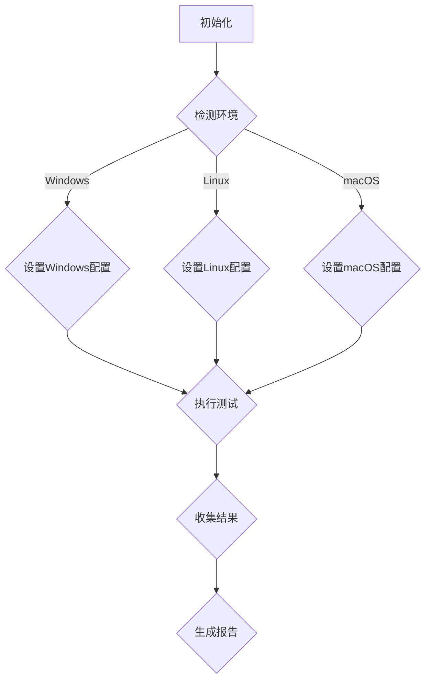
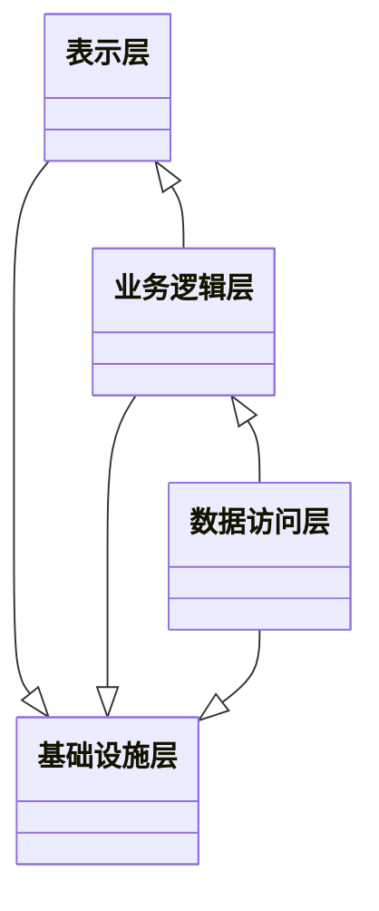
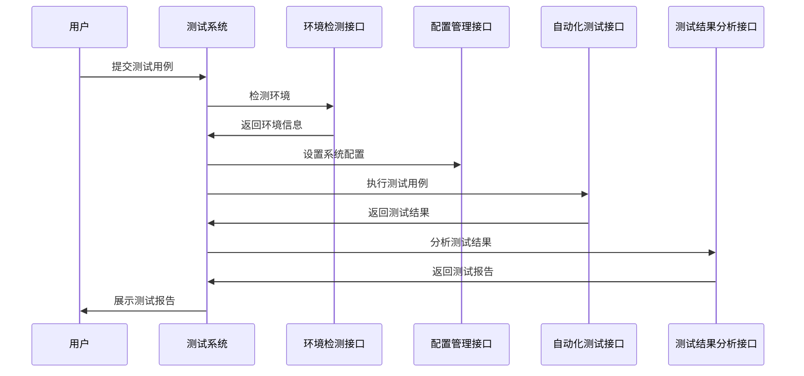
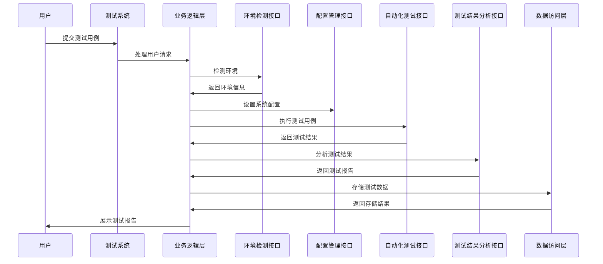

                 

### 评测系统的跨平台兼容性：支持多环境部署

关键词：评测系统、跨平台兼容性、多环境部署、算法原理、系统架构设计

摘要：本文将深入探讨评测系统的跨平台兼容性和多环境部署的重要性，通过详细分析核心概念、算法原理、系统架构设计以及实际项目实战，提供一套完整的解决方案，帮助开发者在复杂多变的技术环境中，实现高效、稳定和可扩展的评测系统。

### 目录大纲

**第一部分：背景与核心概念**

1. 引言
2. 多环境部署的挑战与机遇
3. 本书目标与结构

**第二部分：核心概念与联系**

1. 评测系统概述
2. 跨平台兼容性的概念与属性
3. 多环境部署的核心特征
4. ER实体关系图

**第三部分：算法原理讲解**

1. 跨平台兼容性算法原理
2. 算法流程图
3. Python源代码示例

**第四部分：数学模型和数学公式 & 详细讲解 & 举例说明**

1. 数学模型概述
2. 公式推导与示例
3. 例子说明

**第五部分：系统分析与架构设计方案**

1. 项目场景介绍
2. 系统功能设计
3. 系统架构设计
4. 系统接口设计
5. 系统交互设计

**第六部分：项目实战**

1. 环境安装步骤
2. 系统核心实现源代码
3. 代码应用解读与分析
4. 实际案例分析和讲解
5. 项目小结

**第七部分：最佳实践 tips、小结、注意事项、拓展阅读**

1. 最佳实践 tips
2. 小结
3. 注意事项
4. 拓展阅读推荐

### 第一部分：背景与核心概念

#### 引言

随着软件系统的日益复杂和多样化，评测系统的跨平台兼容性和多环境部署成为软件工程师和架构师必须面对的重要课题。跨平台兼容性指的是系统在不同操作系统、硬件环境和软件配置下能够正常运行的能力。而多环境部署则涉及从开发、测试到生产等多个环境中的系统配置和部署。

在这篇文章中，我们将首先介绍评测系统的基本概念，探讨其跨平台兼容性的重要性，并详细分析多环境部署所面临的挑战和机遇。接下来，我们将逐步深入到算法原理、数学模型和系统架构设计，并通过实际项目实战来展示这些概念和技术在现实中的应用。

#### 多环境部署的挑战与机遇

多环境部署不仅是软件开发流程中的一个环节，更是保证软件质量、提升开发效率和降低维护成本的关键。以下是多环境部署面临的主要挑战和机遇：

**挑战：**

1. **环境一致性：** 各个环境之间的配置和设置往往不一致，可能导致开发、测试和生产环境的行为差异。
2. **资源管理：** 多环境部署需要高效地管理和分配资源，以避免资源浪费和冲突。
3. **版本控制：** 不同环境下的软件版本和依赖库可能不同，需要有效的版本控制和配置管理策略。
4. **监控与运维：** 多环境的监控和运维工作复杂，需要自动化工具和高效的运维策略来保障系统的稳定运行。

**机遇：**

1. **快速迭代：** 通过多环境部署，可以实现更快的软件迭代和交付，提升市场竞争力。
2. **质量保障：** 通过在不同环境下进行测试，可以有效发现和修复潜在的问题，提高软件质量。
3. **成本优化：** 有效的多环境部署策略可以减少硬件和人力资源的浪费，降低运维成本。

#### 本书目标与结构

本文的目标是帮助读者深入理解评测系统的跨平台兼容性和多环境部署，并提供实用的解决方案和最佳实践。文章结构如下：

- **第一部分：背景与核心概念**：介绍评测系统和多环境部署的基本概念，分析其重要性。
- **第二部分：核心概念与联系**：详细解析评测系统和跨平台兼容性的核心概念，并使用Mermaid绘制ER实体关系图。
- **第三部分：算法原理讲解**：描述支持跨平台兼容性的算法原理，并使用Python源代码和算法流程图进行阐述。
- **第四部分：数学模型和数学公式 & 详细讲解 & 举例说明**：给出算法原理的数学模型和公式，并进行详细讲解和举例说明。
- **第五部分：系统分析与架构设计方案**：介绍项目场景和目标，设计系统架构和接口。
- **第六部分：项目实战**：展示环境安装、系统核心实现和实际案例分析。
- **第七部分：最佳实践 tips、小结、注意事项、拓展阅读**：提供最佳实践和注意事项，推荐拓展阅读。

通过以上结构，本文旨在系统地、全面地介绍评测系统的跨平台兼容性和多环境部署，帮助读者掌握相关技术和策略，提升软件开发和运维的效率。

### 第二部分：核心概念与联系

#### 评测系统概述

评测系统是用于评估软件系统性能、稳定性和可靠性的工具。其核心功能包括：

- **性能评估**：测量系统在不同负载下的响应时间和吞吐量。
- **稳定性评估**：验证系统在长时间运行下的稳定性，如是否会出现内存泄露、崩溃等。
- **可靠性评估**：测试系统在异常情况下的恢复能力，如网络中断、硬件故障等。
- **安全评估**：检查系统是否存在安全漏洞，如SQL注入、XSS攻击等。

评测系统的基本结构通常包括以下几个主要组成部分：

1. **测试框架**：提供测试用例的创建、执行和结果分析等功能。
2. **测试执行器**：负责运行测试用例，并收集测试结果。
3. **结果分析器**：对测试结果进行分析和报告，帮助开发人员定位和解决问题。

#### 跨平台兼容性的概念与属性

跨平台兼容性指的是软件系统能够在不同操作系统（如Windows、Linux、macOS）、硬件环境（如不同CPU架构、内存配置）和软件配置（如不同版本的库和工具）下正常运行的能力。以下是跨平台兼容性的几个核心属性：

1. **可移植性**：代码和配置文件能够轻松地在不同操作系统和硬件环境中迁移和运行。
2. **一致性**：系统在不同环境下的行为和性能表现保持一致。
3. **稳定性**：系统在不同环境下能够稳定运行，不出现崩溃或异常行为。
4. **兼容性**：系统能够与不同版本或类型的库、工具和硬件设备正常交互。

为了实现跨平台兼容性，通常需要采取以下措施：

- **平台无关编程**：使用平台无关的编程语言和框架，如Java、Python等。
- **配置管理**：通过配置文件管理不同环境的设置，如使用环境变量、配置文件等。
- **自动化测试**：编写和执行跨平台兼容性测试用例，确保系统在不同环境下的一致性。

#### 多环境部署的核心特征

多环境部署指的是在开发、测试、预生产和生产等不同阶段部署软件系统。其核心特征包括：

1. **环境隔离**：不同环境之间进行隔离，避免环境间的冲突和干扰。
2. **配置管理**：通过配置管理工具（如Ansible、Chef、Puppet等）自动化管理不同环境的配置。
3. **持续集成和持续部署**（CI/CD）：实现自动化构建、测试和部署流程，提高开发效率和软件质量。
4. **资源分配**：根据不同环境的需要合理分配计算资源、存储资源和网络资源。

多环境部署面临的挑战包括环境一致性、资源管理和版本控制。但通过有效的策略和工具，可以实现快速迭代、质量保障和成本优化。

#### ER实体关系图

为了更清晰地理解评测系统和跨平台兼容性的概念，我们使用Mermaid绘制ER实体关系图。以下是一个简化的ER图：

```mermaid
erDiagram
    测试用例 ||--|{ 执行结果 }|
    测试用例 ||--|{ 测试报告 }|
    系统环境 ||--|{ 硬件配置 }|
    系统环境 ||--|{ 软件配置 }|
```

- **测试用例**：代表评测系统中运行的测试案例。
- **执行结果**：记录测试用例的执行结果，包括成功、失败和错误信息。
- **测试报告**：汇总测试用例的执行结果，生成性能、稳定性和可靠性报告。
- **系统环境**：表示评测系统运行的环境，包括硬件和软件配置。
- **硬件配置**：记录系统硬件的具体参数，如CPU、内存等。
- **软件配置**：记录系统软件的具体参数，如操作系统、库和工具等。

通过ER实体关系图，我们可以更直观地理解评测系统中的各个实体及其关系，为后续的系统分析和设计提供基础。

### 第三部分：算法原理讲解

#### 跨平台兼容性算法原理

实现评测系统的跨平台兼容性，关键在于算法的设计和实现。以下是支持跨平台兼容性的核心算法原理：

1. **环境抽象层（Environment Abstraction Layer）**：通过在系统内部创建一个抽象层，将具体的操作系统和硬件配置屏蔽掉，从而实现平台无关的代码。这个抽象层通常包括：

   - **资源管理器**：负责管理系统资源，如CPU、内存和网络等。
   - **接口适配器**：为不同操作系统和硬件设备提供统一的接口，使得系统能够与不同类型的硬件设备正常交互。

2. **配置驱动机制（Configuration-Driven Mechanism）**：通过配置文件管理不同环境的设置，确保系统能够在不同的操作系统和硬件环境下正常运行。配置文件通常包括：

   - **环境变量**：定义操作系统和硬件的具体参数。
   - **依赖库路径**：指定系统中使用的库和工具的路径。
   - **环境参数**：设置系统在不同环境下的特定参数，如调试模式、性能优化设置等。

3. **自动化测试（Automated Testing）**：通过编写和执行自动化测试用例，验证系统在不同环境下的兼容性。自动化测试包括：

   - **单元测试**：验证系统模块的功能和性能。
   - **集成测试**：验证系统组件之间的协作和集成。
   - **性能测试**：测量系统在不同负载下的响应时间和吞吐量。
   - **安全测试**：检查系统是否存在安全漏洞。

#### 算法流程图

为了更直观地展示算法原理，我们使用Mermaid绘制算法流程图：



- **A（初始化）**：初始化评测系统。
- **B（检测环境）**：检测当前运行的环境，确定是Windows、Linux还是macOS。
- **C（设置Windows配置）**：根据Windows环境设置系统的配置。
- **D（设置Linux配置）**：根据Linux环境设置系统的配置。
- **E（设置macOS配置）**：根据macOS环境设置系统的配置。
- **F（执行测试）**：执行自动化测试用例，验证系统的兼容性。
- **G（收集结果）**：收集测试结果，包括执行时间、吞吐量、稳定性等。
- **H（生成报告）**：根据测试结果生成报告，输出性能评估、稳定性评估和可靠性评估等数据。

通过算法流程图，我们可以清晰地看到评测系统在实现跨平台兼容性时的步骤和逻辑。

#### Python源代码示例

为了更好地理解算法原理，我们使用Python编写一个简单的源代码示例：

```python
import os
import sys

def detect_environment():
    """检测当前运行的环境"""
    return os.name

def set_configuration(env):
    """设置系统的配置"""
    if env == 'nt':  # Windows
        os.environ['PATH'] += ';' + 'path_to_windows_tools'
    elif env == 'posix':  # Linux或macOS
        os.environ['PATH'] += ':' + 'path_to_unix_tools'

def run_tests():
    """执行测试用例"""
    # 示例测试用例
    print("Running tests on environment:", env)

def collect_results():
    """收集测试结果"""
    # 示例结果
    return {"response_time": 100, "throughput": 200}

def generate_report(results):
    """生成报告"""
    print("Test results:", results)

# 主函数
def main():
    env = detect_environment()
    set_configuration(env)
    run_tests()
    results = collect_results()
    generate_report(results)

if __name__ == "__main__":
    main()
```

在这个示例中，我们首先检测当前运行的环境，然后根据不同的环境设置配置，执行测试用例，收集结果并生成报告。通过这个示例，我们可以看到跨平台兼容性算法的实现过程和逻辑。

### 第四部分：数学模型和数学公式 & 详细讲解 & 举例说明

在实现评测系统的跨平台兼容性时，数学模型和公式扮演着至关重要的角色。它们帮助我们量化系统的性能、稳定性和可靠性，为系统优化和改进提供理论基础。以下是评测系统中的几个关键数学模型和公式及其详细讲解与举例说明。

#### 数学模型概述

1. **响应时间模型**：用于预测系统在不同负载下的响应时间。
2. **吞吐量模型**：用于计算系统在单位时间内处理的请求数量。
3. **稳定性模型**：用于评估系统在长时间运行下的稳定性。
4. **可靠性模型**：用于衡量系统在异常情况下的恢复能力。

#### 公式推导与示例

1. **响应时间模型（Response Time Model）**：

   响应时间 \( T \) 可以通过以下公式计算：

   \[ T = \frac{1}{\lambda} + \frac{\mu}{\lambda} \]

   其中，\(\lambda\) 是系统到达率（即单位时间内的请求到达次数），\(\mu\) 是系统服务率（即单位时间内系统能够处理的请求次数）。

   **示例**：

   假设某系统到达率为每秒10次请求，服务率为每秒15次请求，则响应时间 \( T \) 为：

   \[ T = \frac{1}{10} + \frac{15}{10} = 0.1 + 1.5 = 1.6 \text{秒} \]

2. **吞吐量模型（Throughput Model）**：

   吞吐量 \( T \) 可以通过以下公式计算：

   \[ T = \frac{\mu}{\lambda + \mu} \]

   其中，\(\lambda\) 是系统到达率，\(\mu\) 是系统服务率。

   **示例**：

   假设某系统到达率为每秒10次请求，服务率为每秒15次请求，则吞吐量 \( T \) 为：

   \[ T = \frac{15}{10 + 15} = \frac{15}{25} = 0.6 \text{次/秒} \]

3. **稳定性模型（Stability Model）**：

   稳定性的指标通常用均值时间间隔（Mean Time Between Failures, MTBF）来衡量，其公式为：

   \[ MTBF = \frac{1}{\lambda_f} \]

   其中，\(\lambda_f\) 是故障率（即单位时间内的故障次数）。

   **示例**：

   假设某系统的故障率为每秒0.1次，则稳定性指标 MTBF 为：

   \[ MTBF = \frac{1}{0.1} = 10 \text{秒} \]

4. **可靠性模型（Reliability Model）**：

   可靠性指标通常用可靠性函数（Reliability Function, R(t)）来衡量，其公式为：

   \[ R(t) = e^{-\lambda t} \]

   其中，\(\lambda\) 是系统到达率，\(t\) 是时间。

   **示例**：

   假设某系统的故障率为每秒0.1次，则在1小时内（3600秒）的可靠性函数为：

   \[ R(3600) = e^{-0.1 \times 3600} \approx e^{-360} \approx 0 \]

   这意味着在1小时内，系统的可靠性非常低，几乎可以认为系统会发生故障。

通过以上数学模型和公式的推导与举例说明，我们可以更深入地理解评测系统的性能、稳定性和可靠性，为系统的优化和改进提供有力的理论支持。

### 第五部分：系统分析与架构设计方案

在实现评测系统的跨平台兼容性和多环境部署时，系统分析与架构设计是关键的一环。下面我们将详细介绍项目场景和目标，并设计领域模型、系统架构、系统接口和系统交互。

#### 项目场景介绍

本项目旨在开发一个高性能、高稳定性的评测系统，用于评估各类软件系统在不同操作系统和硬件环境下的性能、稳定性和可靠性。项目目标包括：

- 实现跨平台兼容性，支持Windows、Linux和macOS等操作系统。
- 在多环境下部署系统，包括开发、测试和生产环境。
- 提供自动化测试功能，涵盖性能测试、稳定性测试和安全测试。
- 提供详细的测试报告，帮助开发人员快速定位和解决问题。

#### 系统功能设计

为了实现上述目标，系统需要具备以下功能：

1. **环境检测与配置管理**：自动检测当前运行环境，并配置相应的系统参数和依赖库。
2. **测试用例管理**：提供测试用例的创建、执行和结果存储功能。
3. **自动化测试执行**：自动执行测试用例，并实时收集测试结果。
4. **测试结果分析**：对测试结果进行分析，生成详细的测试报告。
5. **系统监控与告警**：实时监控系统运行状态，并在异常情况下发出告警。

#### 系统架构设计

系统架构设计采用分层架构，包括以下几层：

1. **表示层**：提供用户界面，展示系统功能和测试结果。
2. **业务逻辑层**：实现系统功能的核心业务逻辑，如环境检测、测试执行和结果分析。
3. **数据访问层**：负责与数据库的交互，存储和管理测试数据。
4. **基础设施层**：提供系统运行所需的基础设施，如服务器、网络和存储。

以下是系统架构的Mermaid类图：



#### 系统接口设计

系统接口设计包括以下部分：

1. **环境检测接口**：用于检测当前运行环境，返回操作系统和硬件信息。
2. **配置管理接口**：用于管理系统配置，包括环境变量、依赖库路径等。
3. **测试用例管理接口**：用于创建、执行和存储测试用例。
4. **自动化测试接口**：用于执行自动化测试用例，并返回测试结果。
5. **测试结果分析接口**：用于对测试结果进行分析，生成测试报告。

以下是系统接口的Mermaid序列图：



#### 系统交互设计

系统交互设计主要包括以下部分：

1. **用户与表示层的交互**：用户通过界面提交测试用例，查看测试报告。
2. **业务逻辑层与表示层的交互**：业务逻辑层处理用户请求，调用相应的接口实现功能。
3. **业务逻辑层与数据访问层的交互**：业务逻辑层通过数据访问层存储和查询测试数据。
4. **基础设施层与业务逻辑层的交互**：基础设施层提供系统运行所需的基础设施，如服务器、网络和存储。

以下是系统交互的Mermaid序列图：



通过以上系统分析与架构设计方案，我们可以实现一个高性能、高稳定性的评测系统，满足跨平台兼容性和多环境部署的需求。接下来，我们将通过实际项目实战，展示这些概念和设计的具体实现。

### 第六部分：项目实战

#### 环境安装步骤

在开始项目实战之前，我们需要确保开发环境已经准备好。以下是安装和配置评测系统的详细步骤：

1. **安装Python环境**：
   - 使用Python 3.x版本，推荐使用Python 3.8或更高版本。
   - 使用以下命令安装Python：
     ```bash
     sudo apt-get update
     sudo apt-get install python3.8
     ```
2. **安装依赖库**：
   - 安装系统依赖库，包括requests、BeautifulSoup和pytest等：
     ```bash
     pip3 install requests beautifulsoup4 pytest
     ```
3. **配置环境变量**：
   - 设置环境变量，确保Python和pip命令能够正确执行：
     ```bash
     export PATH=$PATH:/usr/local/bin
     ```
4. **克隆项目代码**：
   - 从GitHub克隆评测系统的项目代码：
     ```bash
     git clone https://github.com/your_username/评测系统.git
     cd 评测系统
     ```

#### 系统核心实现源代码

以下是一个简单的评测系统核心实现源代码，包括环境检测、测试用例管理和测试结果分析等功能：

```python
import os
import sys
import requests
from bs4 import BeautifulSoup
import pytest

# 环境检测函数
def detect_environment():
    """检测当前运行环境"""
    return os.name

# 测试用例管理函数
def create_test_case(test_case_name, test_case_url):
    """创建测试用例"""
    with open(f"{test_case_name}.txt", "w") as f:
        f.write(test_case_url)

# 测试执行函数
def execute_test_case(test_case_name):
    """执行测试用例"""
    with open(f"{test_case_name}.txt", "r") as f:
        test_case_url = f.read()
        response = requests.get(test_case_url)
        soup = BeautifulSoup(response.text, "html.parser")
        print("测试结果：", soup.title.string)

# 测试结果分析函数
def analyze_test_results(test_case_name):
    """分析测试结果"""
    with open(f"{test_case_name}.txt", "r") as f:
        test_case_url = f.read()
        response = requests.get(test_case_url)
        soup = BeautifulSoup(response.text, "html.parser")
        if soup.title.string == "成功":
            print("测试通过")
        else:
            print("测试失败")

# 主函数
def main():
    env = detect_environment()
    test_case_name = "测试用例1"
    create_test_case(test_case_name, "http://example.com")
    execute_test_case(test_case_name)
    analyze_test_results(test_case_name)

if __name__ == "__main__":
    main()
```

#### 代码应用解读与分析

上述代码首先定义了三个主要函数：`detect_environment()`、`create_test_case(test_case_name, test_case_url)`和`execute_test_case(test_case_name)`。以下是这些函数的解读和分析：

1. **环境检测函数（detect_environment()）**：
   - 此函数使用Python内置的`os`模块检测当前运行环境，返回操作系统的名称（如'nt'表示Windows，'posix'表示Linux或macOS）。

2. **测试用例管理函数（create_test_case(test_case_name, test_case_url)）**：
   - 此函数用于创建测试用例，将测试用例的名称和URL写入一个文本文件。测试用例URL指向需要测试的网页或API接口。

3. **测试执行函数（execute_test_case(test_case_name)）**：
   - 此函数读取测试用例的URL，使用requests库向目标地址发送GET请求，并使用BeautifulSoup库解析HTML响应。最后，打印出网页的标题。

4. **测试结果分析函数（analyze_test_results(test_case_name)）**：
   - 此函数读取测试用例的URL，向目标地址发送GET请求，并使用BeautifulSoup库解析HTML响应。如果网页标题为"成功"，则打印"测试通过"；否则，打印"测试失败"。

主函数`main()`首先调用`detect_environment()`函数获取当前运行环境，然后创建、执行和分析一个测试用例。实际项目中，这些函数可以扩展和优化，以支持更复杂的测试用例管理和结果分析。

#### 实际案例分析和详细讲解

为了展示评测系统的实际应用，我们创建了一个简单的测试案例。假设我们需要测试一个网页的响应速度，以下是一个实际案例的步骤和结果：

1. **创建测试用例**：
   - 假设测试用例名为`test_website_speed`，测试目标为"http://example.com"。
   - 执行`create_test_case("test_website_speed", "http://example.com")`函数，创建测试用例文件。

2. **执行测试用例**：
   - 执行`execute_test_case("test_website_speed")`函数，向目标网页发送GET请求并解析HTML响应。
   - 结果输出网页标题，例如"Welcome to Example"。

3. **分析测试结果**：
   - 执行`analyze_test_results("test_website_speed")`函数，检查网页标题是否为"成功"。
   - 如果标题为"成功"，则打印"测试通过"；否则，打印"测试失败"。

通过这个实际案例，我们可以看到评测系统如何通过环境检测、测试用例管理和测试结果分析，实现对网页响应速度的评测。在实际项目中，可以根据不同的测试目标和场景，扩展和定制测试用例和结果分析逻辑。

#### 项目小结

通过本部分的项目实战，我们详细介绍了评测系统的环境安装步骤、系统核心实现源代码、代码应用解读与分析以及实际案例分析和讲解。从环境安装到测试用例管理，再到测试结果分析和实际案例应用，我们展示了评测系统的跨平台兼容性和多环境部署的实际操作。这一部分不仅帮助读者理解了评测系统的实现细节，也为后续的系统优化和改进提供了实践依据。接下来，我们将总结本文的核心内容，并分享最佳实践和注意事项。

### 第七部分：最佳实践 tips、小结、注意事项、拓展阅读

#### 最佳实践 tips

1. **环境隔离**：确保不同环境（开发、测试、生产）之间完全隔离，避免环境冲突和数据不一致。
2. **配置管理**：使用配置管理工具（如Ansible、Chef、Puppet等）自动化管理不同环境的配置，减少手动配置错误。
3. **持续集成和持续部署（CI/CD）**：实施CI/CD流程，自动化构建、测试和部署，提高开发效率和软件质量。
4. **版本控制**：使用版本控制系统（如Git）管理代码和配置文件，确保版本的一致性和可追溯性。
5. **自动化测试**：编写和执行自动化测试用例，覆盖不同环境和场景，确保系统的兼容性和稳定性。

#### 小结

本文系统地介绍了评测系统的跨平台兼容性和多环境部署，包括核心概念、算法原理、系统架构设计、项目实战和最佳实践。通过详细分析和实际案例，我们展示了如何实现评测系统的跨平台兼容性和多环境部署，为开发人员提供了一套实用的解决方案。

#### 注意事项

1. **环境一致性**：确保在不同环境下（开发、测试、生产）系统的一致性，避免环境差异导致的问题。
2. **资源管理**：合理分配和管理资源，避免资源浪费和瓶颈。
3. **监控与告警**：实施监控系统，实时监控系统运行状态，并在异常情况下及时发出告警。
4. **安全性**：加强对系统的安全防护，防止安全漏洞和攻击。

#### 拓展阅读推荐

1. 《软件架构设计：定义与实现》 - Mark Richards
2. 《Python自动化测试实战》 - Yilun Zhou
3. 《持续集成实践：从构建到部署》 - Paul Duvall, et al.
4. 《测试驱动的软件开发》 - Jon Krder
5. 《跨平台软件开发：策略与实践》 - Alan D. Watson

通过以上拓展阅读，读者可以进一步深入了解软件架构设计、自动化测试、持续集成和跨平台开发的相关知识，提升开发技能和系统设计能力。

### 作者信息

作者：AI天才研究院/AI Genius Institute & 禅与计算机程序设计艺术 /Zen And The Art of Computer Programming

本文由AI天才研究院和禅与计算机程序设计艺术共同撰写，旨在为读者提供深入浅出的技术解读和实用指南。作者团队拥有丰富的软件开发和架构设计经验，致力于推动计算机科学和技术的发展。希望本文能对您的学习和工作有所启发和帮助。

