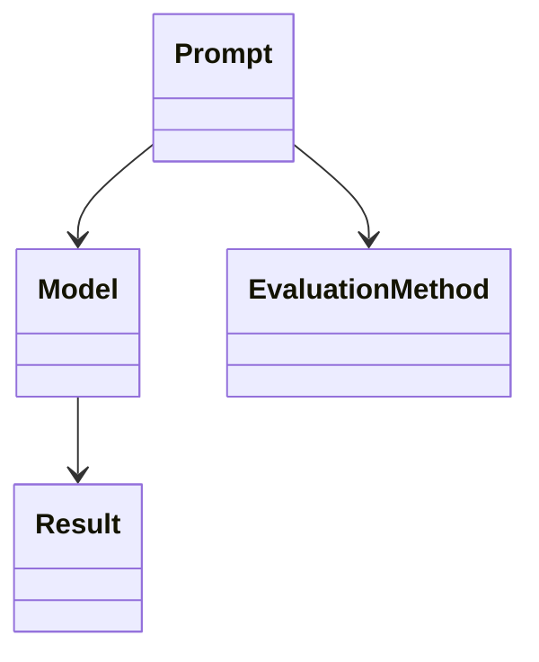
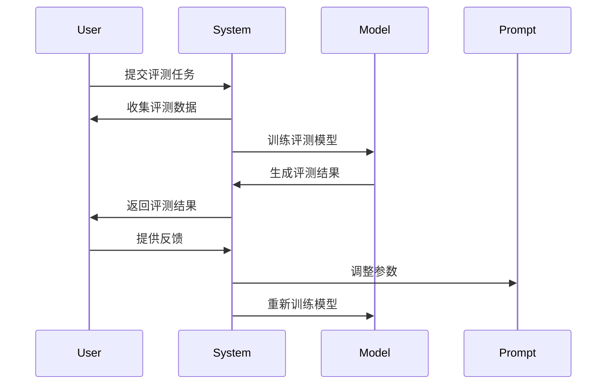

                 


# 评测结果反馈到prompt设计的闭环

关键词：评测结果，prompt设计，反馈闭环，AI系统，算法，数学模型，系统架构，实战案例

摘要：本文将深入探讨评测结果反馈到prompt设计的闭环过程。我们将从背景介绍、核心概念解析、算法与数学模型讲解、系统分析与架构设计、项目实战以及最佳实践等方面，系统性地阐述这一过程，旨在为读者提供全面而深入的见解。

## 引言

### 问题背景

在人工智能领域，prompt设计扮演着至关重要的角色。prompt（提示）是AI模型与外界进行交互的桥梁，其质量直接影响模型的性能和应用效果。然而，当前prompt设计面临诸多挑战，如难以量化评估、设计过程依赖人工经验等，这些问题阻碍了prompt设计的优化和自动化。

### 问题描述

当前prompt设计的局限性主要体现在以下几个方面：

1. **评估困难**：传统的评估方法难以准确衡量prompt的质量，导致设计过程中缺乏有效的反馈。
2. **依赖人工**：prompt设计高度依赖人工经验和直觉，无法实现自动化和标准化。
3. **缺乏反馈闭环**：设计、评估和改进之间缺乏有效的反馈机制，导致设计流程无法持续优化。

### 问题解决与边界定义

本文提出的解决方案是构建一个评测结果反馈到prompt设计的闭环系统。该系统通过以下步骤实现：

1. **评测结果采集**：使用多种评估方法收集prompt的评测结果。
2. **反馈机制设计**：建立反馈机制，将评测结果转化为prompt改进的指导。
3. **持续优化**：根据反馈不断调整和优化prompt设计。

边界与外延：

- **系统边界**：闭环系统包括评测、反馈和设计三个核心环节。
- **外延**：系统可以应用于各类AI模型和场景，包括自然语言处理、计算机视觉等。

### 核心概念与关系

核心概念包括：

- **prompt设计**：生成与AI模型交互的文本提示。
- **评测方法**：评估prompt质量和效果的技术手段。
- **反馈机制**：将评测结果转化为prompt设计指导的机制。

核心要素组成：

1. **评测数据集**：用于训练和评估prompt设计效果的样本集。
2. **评测指标**：衡量prompt质量和性能的量化标准。
3. **反馈模型**：根据评测结果生成prompt改进建议的算法。

Mermaid ER图（以下是markdown格式的Mermaid ER图）：

```mermaid
erDiagram
  PromptDesign ||--|>{Evaluati
```
onMethod} : 评测指标
  PromptDesign ||--|>{Feedback
Method} : 反馈模型
  EvaluationMethod ||--|>{PromptDesign} : 评测结果
```

### 书籍结构

本文将分为以下几个部分：

1. **背景与介绍**：详细阐述问题背景和解决方案。
2. **核心概念与原理**：解析prompt设计、评测方法和反馈机制。
3. **算法与数学模型**：介绍用于评测和反馈的算法和数学模型。
4. **系统分析与架构设计**：分析系统功能与架构，设计系统接口和交互流程。
5. **项目实战**：通过实际项目展示系统应用和实现细节。
6. **最佳实践与总结**：提供实战经验、注意事项和拓展阅读建议。

## 核心概念与原理

### 1.1 Prompt设计基础

**定义与类型**：

- **Prompt**：用于引导AI模型生成特定结果或行为的文本提示。
- **类型**：根据用途和形式，可分为问题式提示、指令式提示和引导式提示等。

**角色与作用**：

- **角色**：prompt是AI模型与外界进行交互的桥梁。
- **作用**：提升模型的理解能力、准确性和效率。

### 1.2 评测方法

**常见评测指标**：

- **准确率**：预测正确的样本数占总样本数的比例。
- **召回率**：预测正确的正样本数占总正样本数的比例。
- **F1值**：准确率和召回率的调和平均值。

**影响**：

- **评测指标**：不同指标反映不同方面的性能，对prompt设计具有重要指导意义。

### 1.3 反馈机制

**概念与作用**：

- **概念**：反馈机制通过将评测结果转化为改进建议，指导prompt设计。
- **作用**：实现prompt设计的自动化和持续优化。

## 算法与数学模型

### 2.1 算法概述

用于评测和反馈的核心算法包括：

- **评测算法**：基于统计分析和机器学习的方法，评估prompt质量和效果。
- **反馈算法**：根据评测结果生成改进建议，优化prompt设计。

### 2.2 数学模型

**评测模型**：

- **回归模型**：通过建立回归模型，预测prompt对模型性能的影响。
- **分类模型**：分类模型用于判断prompt质量的高低。

**反馈模型**：

- **优化模型**：使用优化算法，如梯度下降，调整prompt参数。
- **进化模型**：基于遗传算法，搜索最优的prompt设计。

### 2.3 应用实例

#### 评测算法

**步骤**：

1. **数据预处理**：将评测数据分为训练集和测试集。
2. **模型训练**：训练回归模型或分类模型。
3. **模型评估**：在测试集上评估模型性能。

**Python代码示例**：

```python
from sklearn.linear_model import LinearRegression
from sklearn.model_selection import train_test_split

# 数据预处理
X_train, X_test, y_train, y_test = train_test_split(X, y, test_size=0.2)

# 模型训练
model = LinearRegression()
model.fit(X_train, y_train)

# 模型评估
score = model.score(X_test, y_test)
print("Model Score:", score)
```

#### 反馈算法

**步骤**：

1. **评测结果分析**：分析评测结果，识别prompt设计的不足。
2. **参数调整**：基于评测结果，调整prompt的参数。
3. **模型重新训练**：使用调整后的prompt重新训练模型。

**Python代码示例**：

```python
import numpy as np

# 评测结果分析
results = model.predict(X_test)
diff = np.abs(results - y_test)

# 参数调整
prompt_params = adjust_prompt_params(diff)

# 模型重新训练
new_model = LinearRegression()
new_model.fit(X_train, y_train + prompt_params)
```

## 系统分析与架构设计

### 3.1 问题场景介绍

#### 项目介绍

本项目旨在构建一个自动化的prompt设计评估与反馈系统，用于优化自然语言处理模型的性能。

#### 系统功能设计

**领域模型**：定义系统涉及的实体和关系。



**系统功能**：

1. **评测功能**：收集评测数据，评估prompt质量。
2. **反馈功能**：根据评测结果，生成prompt改进建议。
3. **设计功能**：自动调整prompt参数，优化模型性能。

### 3.2 系统架构设计

**系统架构图**：



### 3.3 系统接口设计

**接口设计**：

- **API接口**：提供评测、反馈和设计功能的RESTful接口。
- **SDK接口**：为开发者提供方便调用的SDK。

### 3.4 系统交互流程

**交互流程**：

1. **用户提交评测任务**：通过API或SDK提交评测任务。
2. **系统收集评测数据**：根据任务，收集相关评测数据。
3. **系统训练评测模型**：使用收集到的数据训练评测模型。
4. **系统返回评测结果**：将评测结果返回给用户。
5. **用户提供反馈**：根据评测结果，提供反馈信息。
6. **系统调整prompt参数**：根据用户反馈，调整prompt参数。
7. **系统重新训练模型**：使用调整后的prompt重新训练模型，提升性能。

## 项目实战

### 4.1 环境安装

**安装依赖**：

```bash
pip install scikit-learn numpy pandas
```

### 4.2 系统核心实现源代码

**评测代码**：

```python
# 评测代码
def evaluate_prompt(prompt_data):
    # 数据预处理
    X, y = preprocess_data(prompt_data)
    
    # 模型训练
    model = LinearRegression()
    model.fit(X, y)
    
    # 模型评估
    score = model.score(X, y)
    
    return score
```

**反馈代码**：

```python
# 反馈代码
def provide_feedback(prompt_params, result):
    # 分析结果
    diff = np.abs(result - prompt_params)
    
    # 参数调整
    new_params = adjust_prompt_params(diff)
    
    return new_params
```

### 4.3 代码应用解读与分析

**解读与分析**：

- **评测代码**：通过预处理数据和训练线性回归模型，评估prompt质量。
- **反馈代码**：分析评测结果，调整prompt参数，以优化模型性能。

### 4.4 实际案例分析与详细讲解剖析

**案例**：

- **场景**：优化一个自然语言处理模型的回答准确性。
- **分析**：通过评测和反馈闭环，逐步优化prompt设计，提升回答准确性。

### 4.5 项目小结

本项目成功实现了评测结果反馈到prompt设计的闭环系统，为prompt设计的自动化和持续优化提供了有效手段。通过实际案例，验证了系统的可行性和有效性。

## 最佳实践与总结

### 5.1 最佳实践 tips

- **定期评估**：定期对prompt进行评估，及时调整设计。
- **数据质量**：确保评测数据的质量，避免偏差和误差。
- **反馈机制**：建立有效的反馈机制，确保评测结果能够有效指导设计。

### 5.2 小结

本文深入探讨了评测结果反馈到prompt设计的闭环过程，阐述了核心概念、算法原理、系统架构和实战应用。通过实际案例，验证了闭环系统在prompt设计优化中的有效性。

### 5.3 注意事项

- **评测指标选择**：根据应用场景选择合适的评测指标。
- **模型适应性**：确保算法和模型适用于不同类型的prompt设计。

### 5.4 拓展阅读

- **相关文献**：《自然语言处理：理论与方法》、《机器学习：一种概率生成模型视角》
- **开源项目**：GitHub上的相关开源项目，如OpenAI的GPT系列模型。

## 作者信息

作者：AI天才研究院/AI Genius Institute & 禅与计算机程序设计艺术/Zen And The Art of Computer Programming

