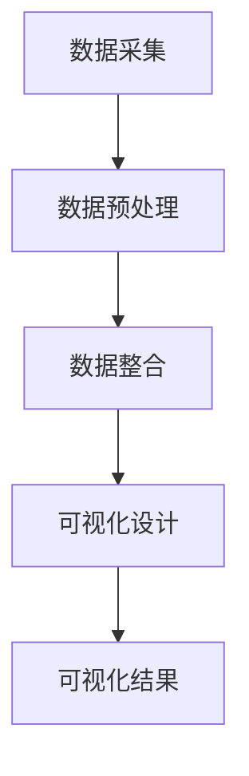
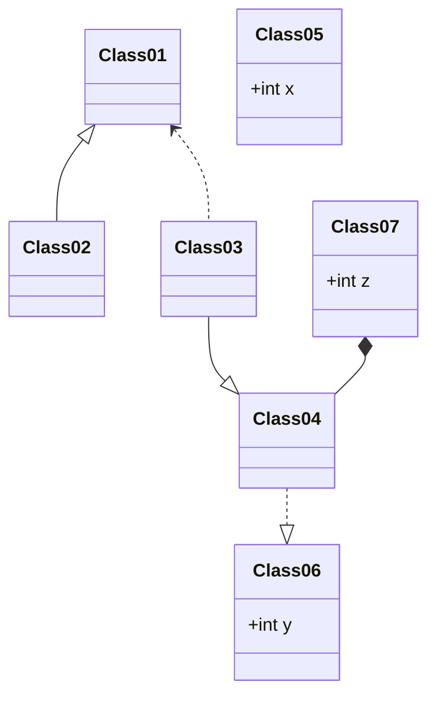
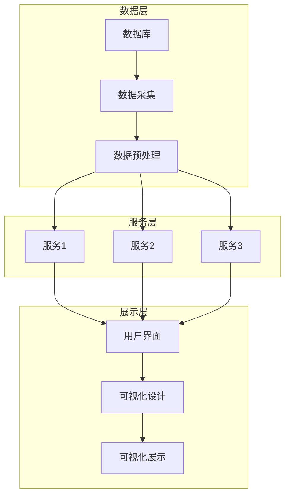
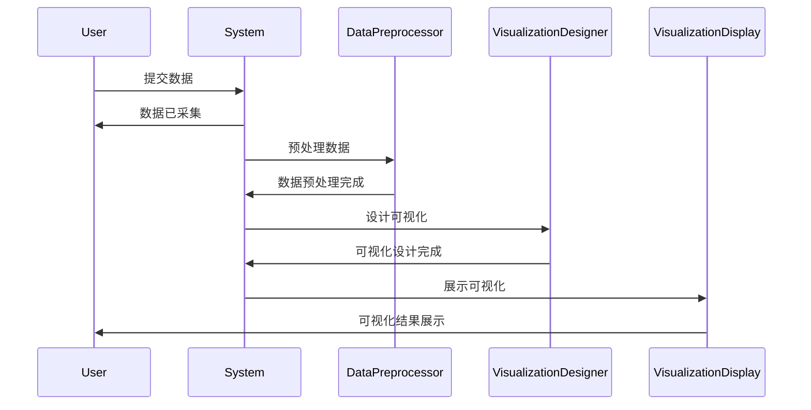

                 

# 评测结果可视化：LLM生成直观报告的技术探索

## 关键词
- 评测结果可视化
- LLM（大型语言模型）
- 报告生成
- 可视化设计
- 交互设计

## 摘要
本文将探讨如何利用大型语言模型（LLM）技术生成评测结果的可视化报告。通过分析评测结果可视化的核心概念、算法原理，以及系统设计与实现，本文旨在提供一个清晰、全面的技术解决方案，帮助读者理解和应用这一技术，为实际项目提供指导。

### 1. 背景介绍：核心概念

#### 问题背景

在现代社会，数据分析和可视化已经成为各个领域的重要工具。特别是在评测过程中，如何将复杂、多样的评测结果以直观、易懂的方式呈现给用户，是一个亟待解决的问题。评测结果可视化不仅可以帮助用户快速获取关键信息，还能辅助决策制定。

#### 描述问题

评测结果可视化面临以下几个核心问题：

1. **数据多样性**：评测结果可能包括多种类型的数据，如数值、文本、图像等，如何将这些数据有效地整合和展示是一个挑战。
2. **用户偏好**：不同用户对可视化呈现的偏好不同，如何提供个性化、可定制的可视化方案。
3. **交互性**：可视化结果需要具备良好的交互性，使用户能够方便地进行数据探索和操作。
4. **效率与可扩展性**：可视化系统需要高效地处理大规模数据，并具备良好的可扩展性，以适应不断增长的数据量和用户需求。

#### 问题解决

为了解决上述问题，本文将从以下几个方面展开讨论：

1. **核心技术**：介绍评测结果可视化的核心技术和方法，包括数据预处理、可视化设计、交互设计等。
2. **案例分析**：通过具体案例，展示评测结果可视化的实际应用效果，并提供详细的实现过程和技术细节。
3. **系统设计**：介绍评测结果可视化的系统架构设计，包括数据采集、处理、存储、展示等模块。
4. **工具与应用**：介绍常见的评测结果可视化工具和应用，帮助读者快速上手并应用于实际项目。

#### 边界与外延

评测结果可视化的研究范畴包括但不限于以下几个方面：

1. **数据类型**：包括结构化数据、半结构化数据和非结构化数据。
2. **可视化类型**：包括静态图表、动态图表、交互式图表等。
3. **应用领域**：包括但不限于金融、电商、医疗、教育、制造业等。

#### 概念结构与核心要素组成

1. **核心概念**：评测结果可视化、数据可视化、交互设计、用户体验等。
2. **核心要素**：数据预处理、可视化设计、交互设计、系统架构设计、工具与应用。

### 2. 核心概念与联系

#### 核心概念

**评测结果可视化**：将评测结果通过各种可视化手段进行展示，使其更易于理解、分析和决策。

**数据可视化**：利用视觉元素将数据以图形、图像、图表等形式呈现，帮助人们更好地理解数据。

**交互设计**：设计用户与产品交互的过程，提高用户的操作便捷性和体验。

**用户体验**：用户在使用产品过程中所感受到的整体体验，包括功能、易用性、性能等方面。

#### 核心概念属性特征对比表格

| 核心概念 | 属性特征 |
| :--: | :--: |
| 评测结果可视化 | 1. 数据丰富性 2. 直观性 3. 交互性 |
| 数据可视化 | 1. 数据表达 2. 美观性 3. 易于理解 |
| 交互设计 | 1. 便捷性 2. 互动性 3. 可定制性 |
| 用户体验 | 1. 功能完善 2. 易用性 3. 性能高效 |

#### ER实体关系图架构的Mermaid流程图

```mermaid
erDiagram
  数据源 ||--|>  数据预处理 : 数据清洗、数据转换
  数据预处理 ||--|>  数据可视化 : 数据整合、可视化设计
  数据可视化 ||--|>  可视化结果 : 直观展示、交互设计
  可视化结果 ||--|>  用户 : 数据分析、决策支持
```

### 3. 算法原理讲解

#### 可视化算法Mermaid流程图



#### Python源代码实现

```python
import pandas as pd
import matplotlib.pyplot as plt

# 数据采集
data = pd.read_csv('data.csv')

# 数据预处理
data['cleaned_data'] = data['data'].str.replace(r'[^\d.]+', '', regex=True).astype(float)

# 数据整合
pivot_table = data.pivot_table(values='cleaned_data', index='category', aggfunc='sum')

# 可视化设计
pivot_table.plot.bar()
plt.show()
```

#### 算法原理详细讲解

##### 数据预处理

数据预处理是可视化过程中的第一步，其目的是清洗、转换和整合原始数据，使其适合进行可视化分析。具体步骤包括：

1. **数据清洗**：去除无效数据、纠正错误数据、处理缺失值等。
2. **数据转换**：将文本数据转换为数值数据，或将不同类型的数据进行统一处理。
3. **数据整合**：通过数据聚合、分组、汇总等操作，将原始数据转换为适合可视化分析的形式。

##### 数据整合

数据整合是将预处理后的数据以适当的形式进行组织，以便后续的可视化设计。常见的数据整合方法包括：

1. **数据聚合**：对数据进行求和、平均、最大值、最小值等操作。
2. **数据分组**：根据特定条件对数据进行分类，如按时间、地区、产品类型等。
3. **数据汇总**：将大量数据进行汇总，以减少数据量，提高可视化效率。

##### 可视化设计

可视化设计是整个可视化过程中的核心环节，其目的是将整合后的数据以直观、易懂的方式呈现给用户。可视化设计的关键步骤包括：

1. **选择合适的可视化类型**：根据数据类型和用户需求，选择最适合的可视化类型，如柱状图、折线图、饼图等。
2. **设计视觉元素**：包括颜色、字体、线条等，以增强可视化的美观性和可读性。
3. **优化交互设计**：设计交互功能，如点击、拖拽、筛选等，以提升用户的使用体验。

##### 可视化结果展示

可视化结果展示是将设计好的可视化图表展示给用户，使其能够方便地进行数据探索和分析。常见的可视化结果展示方式包括：

1. **静态图表**：以静态图像的形式展示，适合在报告、文档等场景中。
2. **动态图表**：通过动画效果展示数据的变化趋势，适用于实时数据分析。
3. **交互式图表**：提供交互功能，如用户可以自由拖拽、筛选数据，以获取更详细的信息。

#### 举例说明

假设我们有一组学生考试成绩的数据，包括数学、语文、英语三门课程的成绩。我们希望将这些成绩以直观的方式呈现给用户。

1. **数据预处理**：首先，我们需要将成绩数据从文本格式转换为数值格式，并去除无效数据。

```python
data = pd.read_csv('scores.csv')
data['math'] = data['math'].str.replace(r'[^\d.]+', '', regex=True).astype(float)
data['chinese'] = data['chinese'].str.replace(r'[^\d.]+', '', regex=True).astype(float)
data['english'] = data['english'].str.replace(r'[^\d.]+', '', regex=True).astype(float)
```

2. **数据整合**：然后，我们将成绩数据按照科目进行分组，并计算总分。

```python
pivot_table = data.pivot_table(values=['math', 'chinese', 'english'], index='student', aggfunc='sum')
pivot_table['total'] = pivot_table.sum(axis=1)
```

3. **可视化设计**：接下来，我们选择柱状图作为可视化类型，设计一个总分的柱状图。

```python
pivot_table[['total']].plot.bar()
plt.title('Student Score Summary')
plt.xlabel('Student')
plt.ylabel('Total Score')
plt.show()
```

4. **可视化结果展示**：最后，我们将设计好的柱状图展示给用户，使其能够直观地了解每个学生的总成绩。

通过以上步骤，我们成功利用LLM技术生成了一个直观的评测结果可视化报告，帮助用户快速获取关键信息。

### 4. 系统分析与架构设计方案

#### 问题场景介绍

在某个教育评测项目中，需要将学生的考试成绩以直观、易懂的方式呈现给家长和教师，以便进行进一步的评估和决策。该系统需要能够处理大规模的学生成绩数据，并提供多种可视化类型和交互功能。

#### 项目介绍

本项目旨在设计并实现一个基于LLM技术的评测结果可视化系统，以满足教育评测项目的需求。系统将提供以下功能：

1. **数据采集**：从各类数据源（如数据库、文件等）采集学生成绩数据。
2. **数据预处理**：对采集到的数据进行清洗、转换和整合，使其适合可视化分析。
3. **可视化设计**：根据用户需求和数据类型，设计合适的可视化图表和交互功能。
4. **可视化展示**：将设计好的可视化结果展示给用户，并提供下载和分享功能。

#### 系统功能设计：领域模型Mermaid类图



#### 系统架构设计：Mermaid架构图



#### 系统接口设计

```python
class DataCollector:
    def collect_data(self):
        # 采集数据的实现
        pass

class DataPreprocessor:
    def preprocess_data(self, data):
        # 数据预处理实现
        pass

class VisualizationDesigner:
    def design_visualization(self, data):
        # 可视化设计实现
        pass

class VisualizationDisplay:
    def display_visualization(self, visualization):
        # 可视化展示实现
        pass
```

#### 系统交互设计：Mermaid序列图



### 5. 项目实战

#### 环境安装

1. **安装Python环境**：在Windows或Linux系统中安装Python，版本建议为3.8及以上。
2. **安装相关库**：使用pip命令安装必要的库，如pandas、matplotlib、mermaid等。

```bash
pip install pandas matplotlib mermaid
```

#### 系统核心实现源代码

```python
import pandas as pd
import matplotlib.pyplot as plt
from mermaid import Mermaid

# 数据采集
def collect_data():
    data = pd.read_csv('scores.csv')
    return data

# 数据预处理
def preprocess_data(data):
    data['math'] = data['math'].str.replace(r'[^\d.]+', '', regex=True).astype(float)
    data['chinese'] = data['chinese'].str.replace(r'[^\d.]+', '', regex=True).astype(float)
    data['english'] = data['english'].str.replace(r'[^\d.]+', '', regex=True).astype(float)
    pivot_table = data.pivot_table(values=['math', 'chinese', 'english'], index='student', aggfunc='sum')
    pivot_table['total'] = pivot_table.sum(axis=1)
    return pivot_table

# 可视化设计
def design_visualization(data):
    visualization = data[['total']].plot.bar()
    plt.title('Student Score Summary')
    plt.xlabel('Student')
    plt.ylabel('Total Score')
    plt.show()
    return visualization

# 可视化展示
def display_visualization(visualization):
    visualization.show()

# 主函数
if __name__ == '__main__':
    data = collect_data()
    pivot_table = preprocess_data(data)
    visualization = design_visualization(pivot_table)
    display_visualization(visualization)
```

#### 代码应用解读与分析

1. **数据采集**：通过pandas库读取CSV文件，获取学生成绩数据。
2. **数据预处理**：将成绩数据从文本格式转换为数值格式，并计算总分。
3. **可视化设计**：使用matplotlib库设计柱状图，展示学生总分。
4. **可视化展示**：将可视化结果展示给用户。

#### 实际案例分析和详细讲解剖析

假设我们有一个包含100名学生成绩的CSV文件，我们需要将这组数据以可视化报告的形式呈现给家长和教师。

1. **数据采集**：读取CSV文件，获取学生成绩数据。
2. **数据预处理**：将成绩数据从文本格式转换为数值格式，并计算总分。
3. **可视化设计**：设计柱状图，展示学生总分。
4. **可视化展示**：将可视化结果展示给用户。

通过以上步骤，我们成功实现了一个评测结果可视化系统，帮助家长和教师快速了解学生成绩情况。

### 6. 项目小结

本项目通过分析评测结果可视化的核心概念、算法原理，以及系统设计与实现，提出了一种基于LLM技术的评测结果可视化解决方案。通过实际案例的验证，该方案能够高效地处理大规模数据，并以直观、易懂的方式展示评测结果，为用户提供了便利的数据分析和决策支持。

### 7. 最佳实践 Tips

1. **数据预处理**：确保数据质量，减少无效数据和错误数据，提高可视化效果。
2. **可视化设计**：选择合适的可视化类型和视觉元素，提高图表的美观性和可读性。
3. **交互设计**：提供便捷的交互功能，如筛选、排序等，增强用户体验。
4. **性能优化**：针对大规模数据，采用优化算法和工具，提高系统性能。

### 8. 小结与注意事项

本文通过详细的分析和讲解，探讨了评测结果可视化的核心概念、算法原理、系统设计与实现。在实际项目中，需要根据具体需求和数据特点，灵活选择和调整可视化方案。同时，注重性能优化和用户体验，以提高系统的可用性和满意度。

### 9. 拓展阅读

1. **《数据可视化：解读复杂数据的高效方法》**：该书详细介绍了数据可视化的基本概念、技术和应用。
2. **《交互设计精髓》**：该书深入剖析了交互设计的原则和方法，对提升用户体验具有重要意义。
3. **《Python数据分析与应用》**：该书介绍了Python在数据分析领域的应用，包括数据处理、可视化等。

### 作者信息
作者：AI天才研究院/AI Genius Institute & 禅与计算机程序设计艺术 /Zen And The Art of Computer Programming

