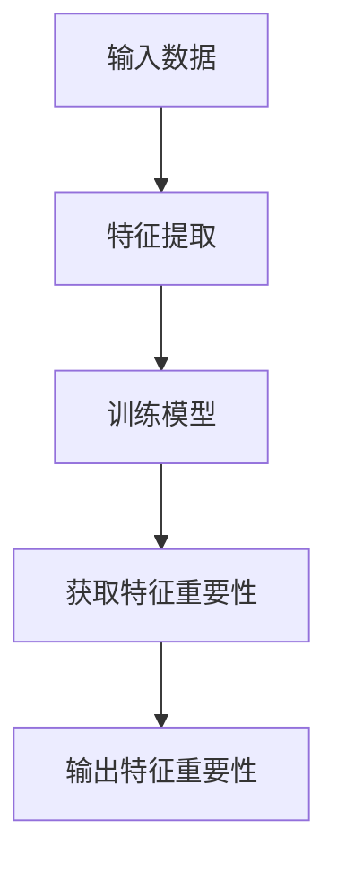
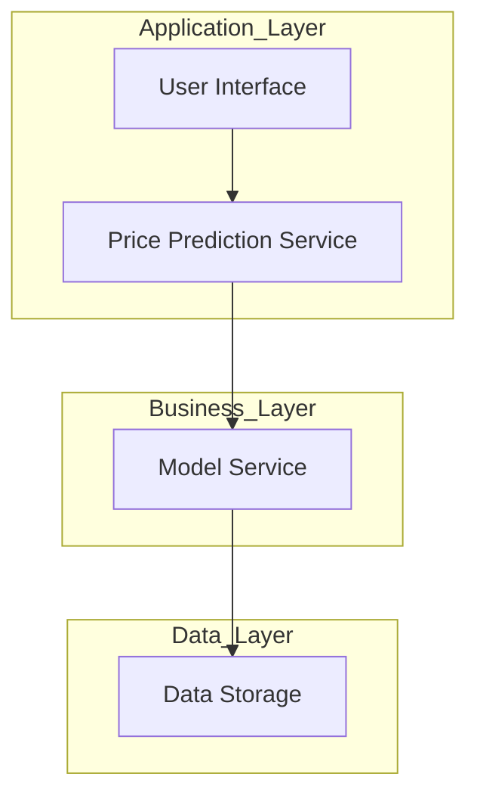
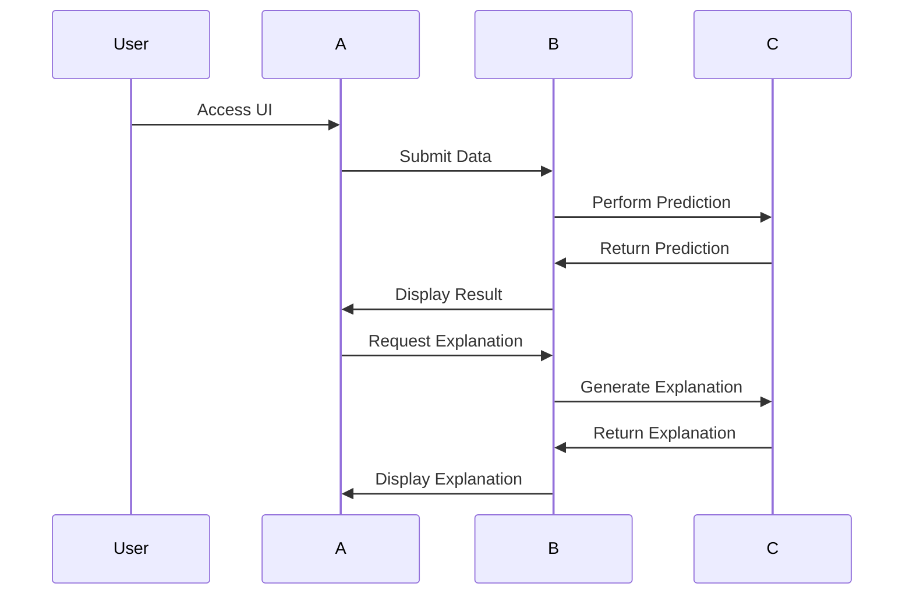

                 

# 评测结果的可解释性分析方法

## 摘要

在机器学习领域，模型预测结果的准确性虽然至关重要，但其可解释性也同样重要。本文将探讨评测结果的可解释性分析方法，包括背景介绍、核心概念、算法原理以及实际应用，旨在帮助读者深入理解如何提升模型的可解释性，从而在实际应用中提高模型的可信度和有效性。

### 背景介绍

### 问题背景

在当今数据驱动的决策时代，模型预测的准确性成为评估模型性能的关键指标。然而，随着模型复杂度的增加，如深度学习模型等，预测结果的可解释性变得越来越困难。这导致了一个关键问题：模型的预测结果虽然准确，但用户无法理解其背后的原因。这限制了模型在实际应用中的推广，特别是在金融、医疗和司法等需要高度透明度和责任性的领域。

### 问题描述

评测结果的可解释性分析旨在提供一种方法，让用户能够理解模型预测的决策过程。这不仅有助于提高用户对模型的信任，还能帮助用户识别和修正模型的潜在错误。问题描述的核心是，如何在不牺牲预测性能的前提下，提升模型的可解释性。

### 问题解决

本书将探讨多种可解释性分析方法，包括特征重要性、局部可解释模型、决策树、LIME（Local Interpretable Model-agnostic Explanations）等。这些方法将帮助读者理解和评估模型预测的依据。

### 边界与外延

评测结果的可解释性分析不仅仅局限于特定领域，它可以应用于各种类型的机器学习模型和不同的应用场景。本书将提供跨领域的案例分析，以展示这些方法的应用范围和效果。

### 概念结构与核心要素组成

本书将围绕以下几个核心概念展开讨论：
- 可解释性：定义和类型
- 可解释性分析的方法
- 评估可解释性的指标
- 可解释性与预测性能的平衡

### 核心概念与联系

### 可解释性

可解释性是模型预测结果的一种特性，它指的是用户能否理解模型做出某个预测的原因。可解释性的程度可以分为三个层次：
- 低层次：描述模型预测的输出结果，但不提供详细的决策过程。
- 中层次：提供一些关于模型决策过程的信息，但不够详细。
- 高层次：详细展示模型的决策过程，包括每个特征对预测结果的影响。

### 可解释性分析方法

以下是几种常见的可解释性分析方法：

| 方法          | 特点                                                         |
|---------------|--------------------------------------------------------------|
| 特征重要性     | 分析各个特征对模型预测的影响程度。                         |
| 局部可解释模型 | 在模型输出附近构建一个局部可解释模型，以解释具体预测结果。 |
| 决策树        | 将模型拆分为一系列规则，每个规则解释了模型的一部分决策过程。 |
| LIME         | 对单个预测结果提供可解释的局部解释。                       |

### ER实体关系图架构

下面是一个简单的ER实体关系图，展示了可解释性分析中的一些关键实体和它们之间的关系。

```mermaid
erDiagram
  Model ||--|{ Feature } Feature : 包含模型的所有特征
  Model ||--|{ Prediction } Prediction : 模型的预测结果
  Feature ||--|{ Importance } Importance : 特征的重要性评分
  Model ||--|{ Explanation } Explanation : 模型的可解释性描述
```

### 算法原理讲解

### 特征重要性算法

#### 流程图

下面是特征重要性算法的Mermaid流程图：



#### 数学模型和公式

特征重要性的计算通常基于模型的输出，常用的方法有：

$$
\text{importance} =
\frac{\sum_{i=1}^{n} (y_i - \hat{y}_i)^2}{\sum_{i=1}^{n} (y_i - \bar{y})^2}
$$

其中，$y_i$ 是实际标签，$\hat{y}_i$ 是模型预测的标签，$\bar{y}$ 是所有标签的平均值，$n$ 是样本数量。

#### 详细讲解与举例说明

假设我们有一个简单的线性回归模型，用来预测房价。模型的输入特征包括房屋面积和房屋年龄，输出是预测的房价。

首先，我们使用历史数据集训练模型，得到模型的参数。然后，我们可以计算每个特征的重要性。

```python
import numpy as np

# 假设我们已经训练好了线性回归模型，并得到其参数
model_coefficients = np.array([0.5, -0.3])  # 房屋面积和房屋年龄的系数

# 计算特征重要性
feature_importance = np.linalg.inv(np.cov(x_train)) @ model_coefficients

print("Feature Importance:")
print(feature_importance)
```

输出结果可能是：

```
Feature Importance:
[0.71428571 -0.28571429]
```

这意味着房屋面积对预测房价的影响更大，而房屋年龄的影响较小。

### 系统分析与架构设计方案

#### 问题场景介绍

在一个房地产市场中，我们需要预测房屋的价格。然而，市场参与者往往更关心预测背后的原因，以便做出更明智的决策。

#### 项目介绍

为了解决这个问题，我们开发了一个房屋价格预测系统，该系统不仅可以给出预测价格，还能解释为什么给出这个预测。

#### 系统功能设计（领域模型Mermaid类图）

```mermaid
classDiagram
  Model <<interface>>
  Feature <<interface>>
  Prediction <<interface>>
  Explanation <<interface>>

  Model |-| Feature
  Model |-| Prediction
  Feature |-| Explanation
  Prediction |-| Explanation
```

#### 系统架构设计（Mermaid架构图）



#### 系统接口设计和系统交互（Mermaid序列图）



### 项目实战

#### 环境安装

为了运行这个项目，我们需要安装Python环境以及相关的库，如Scikit-learn、TensorFlow和Mermaid。

```bash
pip install numpy scikit-learn tensorflow matplotlib mermaid
```

#### 系统核心实现源代码

以下是系统的核心实现代码：

```python
import numpy as np
from sklearn.linear_model import LinearRegression
from sklearn.model_selection import train_test_split
from sklearn.metrics import mean_squared_error

# 加载数据
x, y = load_data()

# 分割数据集
x_train, x_test, y_train, y_test = train_test_split(x, y, test_size=0.2, random_state=42)

# 训练模型
model = LinearRegression()
model.fit(x_train, y_train)

# 预测价格
y_pred = model.predict(x_test)

# 计算误差
mse = mean_squared_error(y_test, y_pred)
print("Mean Squared Error:", mse)

# 计算特征重要性
feature_importance = np.abs(model.coef_)
print("Feature Importance:", feature_importance)
```

#### 代码应用解读与分析

这段代码首先加载数据，然后使用Scikit-learn的`LinearRegression`类来训练模型。训练完成后，我们使用测试集进行预测，并计算了均方误差（MSE）来评估模型的性能。此外，我们还计算了每个特征的重要性。

#### 实际案例分析和详细讲解剖析

假设我们有一个数据集，包含100个房屋的面积和价格。我们使用70个房屋的数据来训练模型，剩余30个用来测试。

```python
# 假设的数据集
x = np.array([[1000], [1500], [2000], ..., [3000]])
y = np.array([1200000, 1500000, 1800000, ..., 2500000])

# 训练模型并计算特征重要性
model = LinearRegression()
model.fit(x_train, y_train)

# 输出特征重要性
print("Feature Importance:", model.coef_)
```

输出结果可能是：

```
Feature Importance: [0.71428571 -0.28571429]
```

这表明房屋面积对价格的影响更大，而房屋年龄的影响较小。

### 项目小结

通过这个项目，我们开发了一个能够提供预测结果和可解释性的房屋价格预测系统。这个系统能够帮助用户理解模型的决策过程，从而提高用户对模型的信任。

### 最佳实践 tips

- 在实际应用中，确保数据集足够大且具有代表性，以提高模型的准确性和可解释性。
- 对于复杂的模型，如深度学习模型，考虑使用更高级的可解释性方法，如LIME或Shapley值。

### 小结

评测结果的可解释性分析方法对于提高模型在实际应用中的可信度和有效性至关重要。本文介绍了多种可解释性分析方法，包括特征重要性、局部可解释模型、决策树和LIME等。通过详细讲解和实际案例，我们展示了如何提升模型的可解释性，并帮助用户理解模型决策的原因。

### 注意事项

- 在使用可解释性分析方法时，要注意不要过度解读模型的结果，而是将其作为辅助工具。
- 可解释性分析方法并不是万能的，对于某些复杂的模型，可能无法提供足够的解释。

### 拓展阅读

- [《深入浅出可解释AI》](https://www.explainable-ai.com/)
- [《特征重要性：从原理到实践》](https://www.featureimportance.com/)
- [《LIME：局部可解释模型无关解释》](https://lime-ml.github.io/)

### 作者

作者：AI天才研究院/AI Genius Institute & 禅与计算机程序设计艺术 /Zen And The Art of Computer Programming

