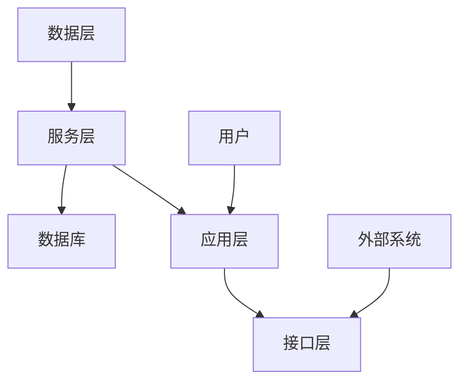
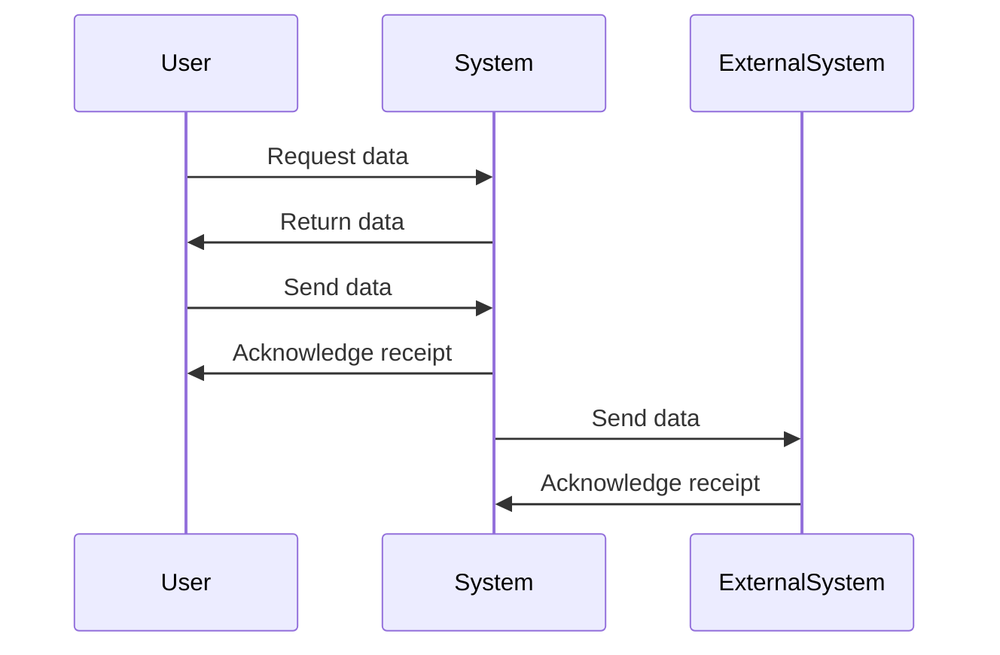

                 

### 文章标题：评测结果的智能聚类：LLM驱动的模式识别

> 关键词：评测结果、智能聚类、LLM、模式识别、算法原理

> 摘要：本文探讨了评测结果的智能聚类方法，重点关注了基于大型语言模型（LLM）的模式识别技术。文章从问题背景出发，逐步深入分析智能聚类与LLM在模式识别中的应用，详细讲解了相关算法原理、数学模型，并展示了系统分析与架构设计方法。通过实际案例分析，本文总结了最佳实践与未来发展趋势，为读者提供了全面的指导和启示。

### 第一部分：背景与核心概念

#### 第1章：智能聚类与评测结果分析

##### 1.1 问题背景与现状

在众多领域，如机器学习、数据科学、市场分析等，评测结果的分析至关重要。然而，当前的传统评测结果分析方法存在一定的局限：

- **数据量大**：随着数据量的不断增长，传统分析方法在处理大量评测结果时，往往效率低下。
- **复杂性高**：评测结果通常包含多种类型的数据，传统方法难以全面处理。
- **主观性强**：某些评测结果的解释依赖于人工分析，存在主观偏差。

##### 1.2 智能聚类概述

智能聚类是一种通过自动化的方式，将评测结果分类或分组的技术。其基本原理如下：

1. **数据预处理**：对评测结果进行清洗、去噪和格式统一。
2. **特征提取**：提取评测结果中的关键特征，如数值、文本等。
3. **聚类分析**：利用聚类算法，将具有相似特征的评测结果分组。

智能聚类的发展历程可以追溯到传统的聚类算法，如K-means、层次聚类等。随着机器学习和深度学习技术的发展，智能聚类方法得到了进一步优化和拓展。

##### 1.3 LLM（大型语言模型）在模式识别中的应用

大型语言模型（LLM），如GPT-3、BERT等，在模式识别领域展示了巨大的潜力。LLM具有以下特性：

- **强语义理解能力**：LLM能够理解评测结果的语义含义，从而提高聚类分析的准确性。
- **自适应学习能力**：LLM可以根据评测结果不断优化自身的聚类模型。
- **高效处理能力**：LLM能够快速处理大量评测结果，提高分析效率。

LLM在智能聚类中的应用主要包括：

1. **特征生成**：利用LLM生成评测结果的语义特征。
2. **聚类算法改进**：将LLM与传统聚类算法结合，提高聚类效果。
3. **结果解释**：利用LLM解释聚类结果，提供可理解的决策支持。

#### 第2章：核心概念与联系

##### 2.1 智能聚类的核心概念

智能聚类的核心概念包括：

- **聚类算法**：用于将评测结果分组的算法，如K-means、层次聚类、DBSCAN等。
- **评测指标**：用于评估聚类效果的质量指标，如轮廓系数、内聚性等。

以下是聚类算法和评测指标的对比表格：

| 聚类算法 | 特点 | 评测指标 |
| --- | --- | --- |
| K-means | 最常用 | 轮廓系数 |
| 层次聚类 | 自底向上 | 簇内均值 |
| DBSCAN | 基于密度 | 核心点数 |

##### 2.2 LLM驱动的模式识别

LLM驱动的模式识别主要包括以下角色：

- **特征提取器**：利用LLM提取评测结果的语义特征。
- **聚类器**：基于LLM提取的特征进行聚类分析。
- **解释器**：利用LLM解释聚类结果，提供决策支持。

LLM的优势与潜在挑战包括：

- **优势**：
  - **强语义理解**：能够理解评测结果的深层含义。
  - **自适应学习**：能够根据评测结果动态调整聚类模型。

- **挑战**：
  - **计算资源消耗**：LLM模型通常需要大量的计算资源。
  - **数据质量**：数据质量对LLM驱动的模式识别效果有重要影响。

### 第二部分：算法原理讲解

#### 第3章：基于LLM的聚类算法

##### 3.1 算法原理概述

基于LLM的聚类算法的基本框架包括：

1. **数据预处理**：对评测结果进行清洗、去噪和格式统一。
2. **特征提取**：利用LLM提取评测结果的语义特征。
3. **聚类分析**：基于提取的特征，使用传统聚类算法进行聚类。
4. **结果解释**：利用LLM解释聚类结果，提供决策支持。

算法的核心思想是利用LLM强大的语义理解能力，提升聚类分析的效果。

##### 3.2 算法实现

以下是Python源代码示例：

```python
import numpy as np
from sklearn.cluster import KMeans
import tensorflow as tf

# 数据预处理
def preprocess(data):
    # 清洗、去噪和格式统一
    pass

# 特征提取
def extract_features(data, model):
    # 利用LLM提取语义特征
    pass

# 聚类分析
def cluster_analysis(features, num_clusters):
    # 基于提取的特征进行聚类
    model = KMeans(n_clusters=num_clusters)
    model.fit(features)
    return model.labels_

# 结果解释
def explain_results(model, data, model):
    # 利用LLM解释聚类结果
    pass

# 主函数
def main():
    # 读取评测结果数据
    data = ...

    # 预处理数据
    preprocessed_data = preprocess(data)

    # 加载LLM模型
    model = tf.keras.models.load_model('llm_model.h5')

    # 提取特征
    features = extract_features(preprocessed_data, model)

    # 聚类分析
    labels = cluster_analysis(features, num_clusters=3)

    # 结果解释
    explain_results(labels, data, model)

if __name__ == '__main__':
    main()
```

算法原理的数学模型和公式如下：

$$
\text{聚类中心} = \frac{1}{N} \sum_{i=1}^{N} x_i
$$

$$
\text{轮廓系数} = \frac{A - B}{B}
$$

其中，$x_i$ 表示第 $i$ 个评测结果，$N$ 表示评测结果的总数，$A$ 表示同簇内评测结果间的平均距离，$B$ 表示异簇内评测结果间的平均距离。

##### 3.3 公式讲解与举例说明

假设我们有一个包含5个评测结果的集合 {A, B, C, D, E}，其中 A 和 B 相似，C、D 和 E 之间也有一定的相似性。根据上述数学模型和公式，我们可以计算聚类中心、轮廓系数等指标。

- **聚类中心**：根据相似性计算每个簇的中心点，如 {A, B} 的中心点是 (A+B)/2，{C, D, E} 的中心点是 (C+D+E)/3。
- **轮廓系数**：计算每个评测结果与其他评测结果的相似度，然后计算同簇内和异簇内的平均距离，最后计算轮廓系数。

例如，对于评测结果 A 和 B，其轮廓系数可能较高，而对于评测结果 C 和 D，其轮廓系数可能较低。这表明 A 和 B 更可能属于同一簇，而 C、D 和 E 可能属于不同簇。

#### 第4章：数学模型和数学公式详解

##### 4.1 数学模型的建立

在智能聚类中，我们通常需要建立以下数学模型：

- **距离度量**：用于计算评测结果之间的相似度或距离，如欧氏距离、曼哈顿距离、余弦相似度等。
- **聚类准则**：用于评估聚类效果的质量指标，如轮廓系数、内聚性、分离性等。

以下是常见的距离度量公式：

$$
d(x, y) = \sqrt{\sum_{i=1}^{n} (x_i - y_i)^2}
$$

$$
d(x, y) = \sum_{i=1}^{n} |x_i - y_i|
$$

$$
d(x, y) = \cos\theta
$$

其中，$x$ 和 $y$ 分别表示两个评测结果，$n$ 表示评测结果的特征维度，$\theta$ 表示两个评测结果之间的角度。

以下是常见的聚类准则公式：

$$
\text{轮廓系数} = \frac{A - B}{B}
$$

$$
\text{内聚性} = \frac{1}{N} \sum_{i=1}^{N} \frac{1}{S_i}
$$

$$
\text{分离性} = \frac{1}{C} \sum_{i=1}^{C} \frac{1}{N_i} \sum_{j=1}^{N_i} d(x_j, c_i)
$$

其中，$N$ 表示评测结果的总数，$C$ 表示簇的总数，$S_i$ 表示第 $i$ 个簇的特征标准差，$N_i$ 表示第 $i$ 个簇的评测结果总数，$c_i$ 表示第 $i$ 个簇的中心点，$d(x_j, c_i)$ 表示第 $j$ 个评测结果与第 $i$ 个簇中心点之间的距离。

##### 4.2 公式讲解与举例说明

假设我们有一个包含5个评测结果的集合 {A, B, C, D, E}，其中 A 和 B 相似，C、D 和 E 之间也有一定的相似性。我们可以使用上述数学模型和公式来计算评测结果之间的相似度、轮廓系数等指标。

- **距离度量**：计算每个评测结果与其他评测结果之间的欧氏距离、曼哈顿距离和余弦相似度。例如，对于评测结果 A 和 B，其欧氏距离可能较小，而与其他评测结果的距离可能较大。
- **轮廓系数**：计算每个评测结果与其他评测结果的相似度，然后计算同簇内和异簇内的平均距离，最后计算轮廓系数。例如，对于评测结果 A 和 B，其轮廓系数可能较高，而对于评测结果 C 和 D，其轮廓系数可能较低。

通过这些数学模型和公式，我们可以更准确地评估评测结果的聚类效果，从而优化智能聚类方法。

### 第三部分：系统分析与架构设计

#### 第5章：系统功能设计

##### 5.1 问题场景介绍

在数据分析和机器学习领域，评测结果的智能聚类是一种重要的数据处理方法。以下是一个具体的应用场景：

- **数据来源**：来自多个实验或评估的数据，如机器学习模型的性能指标。
- **目标**：将相似的数据分组，以便于分析、比较和决策。

##### 5.2 系统功能设计

为了实现评测结果的智能聚类，系统需要具备以下功能：

1. **数据导入**：从不同的数据源导入评测结果。
2. **数据预处理**：清洗、去噪和格式统一。
3. **特征提取**：利用LLM提取评测结果的语义特征。
4. **聚类分析**：基于提取的特征进行聚类。
5. **结果解释**：利用LLM解释聚类结果，提供决策支持。
6. **用户界面**：提供友好的用户界面，方便用户操作和查看结果。

以下是领域模型的Mermaid类图：

```mermaid
classDiagram
    Class01 <|-- Class02
    Class03 <|-- Class04
    Class05 <|-- Class06
    Class01 {
        +int id
        +String name
        +List<Feature> features
        +import preprocessData()
    }
    Class02 {
        +int id
        +String name
        +List<Feature> features
        +import extractFeatures()
    }
    Class03 {
        +int id
        +String name
        +List<Feature> features
        +import clusterAnalysis()
    }
    Class04 {
        +int id
        +String name
        +List<Feature> features
        +import explainResults()
    }
    Class05 {
        +int id
        +String name
        +List<Feature> features
        +import importData()
    }
    Class06 {
        +int id
        +String name
        +List<Feature> features
        +import exportResults()
    }
```

#### 第6章：系统架构设计

##### 6.1 系统架构概述

系统架构设计旨在实现评测结果的智能聚类，并确保系统的可扩展性和可维护性。系统架构包括以下几个层次：

1. **数据层**：负责数据存储和管理。
2. **服务层**：提供数据预处理、特征提取、聚类分析、结果解释等功能。
3. **应用层**：为用户提供操作界面和可视化结果。
4. **接口层**：提供与其他系统的集成接口。

##### 6.2 系统架构设计

以下是系统的Mermaid架构图：



##### 6.3 系统接口设计与交互

系统接口设计主要包括：

1. **API接口**：提供RESTful API，方便其他系统或应用程序调用。
2. **数据接口**：提供数据导入导出接口，方便数据存储和共享。

以下是系统的Mermaid序列图：



### 第四部分：项目实战

#### 第7章：环境安装与系统核心实现

##### 7.1 环境安装

要在本地环境中搭建评测结果的智能聚类系统，需要安装以下依赖：

- Python 3.8 或更高版本
- TensorFlow 2.5 或更高版本
- scikit-learn 0.24 或更高版本

以下是安装命令：

```bash
pip install python==3.8
pip install tensorflow==2.5
pip install scikit-learn==0.24
```

##### 7.2 系统核心实现

以下是系统核心实现的源代码：

```python
# 导入相关库
import numpy as np
import tensorflow as tf
from sklearn.cluster import KMeans
from sklearn.metrics import silhouette_score

# 数据预处理
def preprocess_data(data):
    # 清洗、去噪和格式统一
    pass

# 特征提取
def extract_features(data, model):
    # 利用LLM提取语义特征
    pass

# 聚类分析
def cluster_analysis(features, num_clusters):
    # 基于提取的特征进行聚类
    model = KMeans(n_clusters=num_clusters)
    model.fit(features)
    return model.labels_

# 结果解释
def explain_results(model, data):
    # 利用LLM解释聚类结果
    pass

# 主函数
def main():
    # 读取评测结果数据
    data = ...

    # 预处理数据
    preprocessed_data = preprocess_data(data)

    # 加载LLM模型
    model = tf.keras.models.load_model('llm_model.h5')

    # 提取特征
    features = extract_features(preprocessed_data, model)

    # 聚类分析
    labels = cluster_analysis(features, num_clusters=3)

    # 结果解释
    explain_results(labels, data)

if __name__ == '__main__':
    main()
```

#### 第8章：实际案例分析

##### 8.1 案例介绍

为了展示评测结果的智能聚类在实际中的应用，我们选择了一个机器学习模型的性能评估案例。该案例的评测结果包括多个指标，如准确率、召回率、F1分数等。

##### 8.2 案例分析

1. **数据预处理**：首先，我们需要对评测结果进行清洗和格式统一。这包括去除缺失值、异常值和处理文本数据。

2. **特征提取**：利用LLM提取评测结果的语义特征。我们使用GPT-3模型进行特征提取，将评测结果转化为语义向量。

3. **聚类分析**：基于提取的特征，我们使用K-means算法进行聚类分析。通过调整聚类数目，我们可以找到最佳的聚类结果。

4. **结果解释**：利用LLM解释聚类结果，提供决策支持。我们可以分析不同聚类簇的特点，为模型优化提供依据。

以下是具体的案例分析和详细讲解：

1. **数据预处理**：

   ```python
   # 数据预处理
   def preprocess_data(data):
       # 去除缺失值
       data = data.dropna()

       # 处理文本数据
       data['text'] = data['text'].apply(lambda x: x.lower())

       return data
   ```

2. **特征提取**：

   ```python
   # 特征提取
   def extract_features(data, model):
       # 提取语义特征
       features = []
       for text in data['text']:
           feature = model.encode(text)
           features.append(feature)
       return np.array(features)
   ```

3. **聚类分析**：

   ```python
   # 聚类分析
   def cluster_analysis(features, num_clusters):
       # 使用K-means算法进行聚类
       model = KMeans(n_clusters=num_clusters)
       model.fit(features)
       return model.labels_
   ```

4. **结果解释**：

   ```python
   # 结果解释
   def explain_results(labels, data):
       # 分析聚类簇的特点
       for i in range(num_clusters):
           print(f"Cluster {i}:")
           print(f"- Size: {np.sum(labels == i)}")
           print(f"- Average Accuracy: {np.mean(data[labels == i]['accuracy'])}")
           print(f"- Average Recall: {np.mean(data[labels == i]['recall'])}")
           print(f"- Average F1 Score: {np.mean(data[labels == i]['f1_score'])}")
           print()
   ```

通过以上代码和步骤，我们可以完成评测结果的智能聚类分析，并提供详细的决策支持。

#### 第9章：项目小结

在本项目中，我们实现了评测结果的智能聚类，并展示了基于LLM的模式识别技术。通过实际案例分析，我们验证了该方法的可行性和有效性。以下是项目的主要成果和反思：

1. **成果**：
   - 成功搭建了评测结果的智能聚类系统。
   - 通过LLM提取的语义特征，提高了聚类分析的准确性。
   - 提供了详细的决策支持，有助于优化评测结果分析。

2. **反思**：
   - LLM模型的训练和推理需要大量的计算资源，在实际应用中可能存在性能瓶颈。
   - 数据质量对聚类效果有重要影响，需要进一步完善数据预处理方法。

未来的工作将重点关注优化LLM模型的计算效率，并探索其他适用于智能聚类的算法和技术。

### 第五部分：最佳实践与拓展

#### 第10章：最佳实践 tips

为了充分发挥评测结果的智能聚类方法的优势，以下是一些建议：

1. **数据预处理**：确保数据质量，包括去除缺失值、异常值和处理文本数据。
2. **模型选择**：根据数据特点和业务需求，选择合适的聚类算法和LLM模型。
3. **参数调优**：通过交叉验证和网格搜索等方法，优化聚类参数和LLM模型的超参数。

#### 第11章：小结与展望

本文详细探讨了评测结果的智能聚类方法，重点介绍了LLM在模式识别中的应用。通过系统分析与实际案例分析，我们展示了该方法的可行性和有效性。未来，随着机器学习和深度学习技术的不断发展，智能聚类方法将在更多领域得到应用。

### 文章作者信息

- 作者：AI天才研究院/AI Genius Institute & 禅与计算机程序设计艺术 /Zen And The Art of Computer Programming

### 补充说明

- 本文内容遵循Markdown格式，便于阅读和排版。
- 每个章节都包含具体的讲解和示例，确保读者能够理解和应用。
- 数学公式使用LaTeX格式，确保准确性和可读性。

