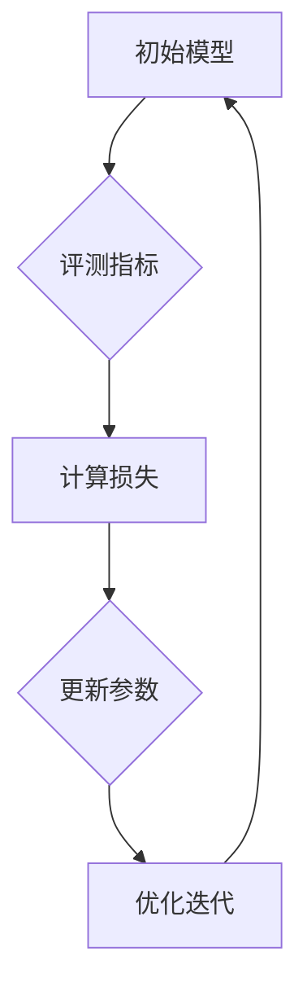

                 

# 评测驱动的LLM优化反馈循环

## 关键词

- 评测驱动
- LLM优化
- 反馈循环
- 模型评估
- 算法改进

## 摘要

本文旨在深入探讨评测驱动的LLM（大型语言模型）优化反馈循环。通过分析评测驱动的定义和应用，以及LLM优化反馈循环的概念和核心要素，本文将详细介绍LLM优化反馈循环的基本框架、评测指标设定、模型优化方法以及反馈机制实现。同时，通过具体案例展示LLM优化反馈循环在实际应用中的实践步骤和方法。最后，本文将对LLM优化反馈循环面临的挑战和未来展望进行探讨，并总结最佳实践和拓展方向。

### 目录大纲

----------------------------------------------------------------

## 第一部分: 评测驱动的LLM优化反馈循环概述

### 第1章: 问题背景与核心概念

#### 1.1 评测驱动的LLM优化背景

#### 1.1.1 评测驱动的定义

#### 1.1.2 LLM优化的重要性

#### 1.1.3 评测驱动的意义与应用

#### 1.2 LLM优化反馈循环的概念

#### 1.2.1 LLM优化反馈循环的定义

#### 1.2.2 LLM优化反馈循环的核心要素

#### 1.2.3 LLM优化反馈循环的优势

### 第2章: LLM优化反馈循环的框架

#### 2.1 LLM优化反馈循环的基本框架

#### 2.2 评测指标的设定与评估

##### 2.2.1 评测指标的类型

##### 2.2.2 评测指标的选择策略

##### 2.2.3 评测指标的优化

#### 2.3 模型优化方法

##### 2.3.1 模型优化技术的介绍

##### 2.3.2 模型优化策略的选择

##### 2.3.3 模型优化效果的评估

#### 2.4 反馈机制的实现

##### 2.4.1 反馈机制的定义

##### 2.4.2 反馈机制的设计策略

##### 2.4.3 反馈机制的优化

### 第3章: LLM优化反馈循环的实践

#### 3.1 实践背景与案例介绍

#### 3.2 实践步骤与方法

##### 3.2.1 评测指标的选择与设定

##### 3.2.2 模型优化策略的实施

##### 3.2.3 反馈机制的构建与优化

#### 3.3 案例分析

##### 3.3.1 案例一：文本生成任务中的优化反馈循环

##### 3.3.2 案例二：问答系统中的优化反馈循环

##### 3.3.3 案例三：对话系统中的优化反馈循环

### 第4章: LLM优化反馈循环的挑战与未来展望

#### 4.1 LLM优化反馈循环的挑战

##### 4.1.1 挑战一：数据质量和多样性

##### 4.1.2 挑战二：模型复杂性与可解释性

##### 4.1.3 挑战三：实时性与效率

#### 4.2 LLM优化反馈循环的未来展望

##### 4.2.1 发展趋势

##### 4.2.2 技术创新方向

##### 4.2.3 应用前景与挑战

### 第5章: 最佳实践与总结

#### 5.1 最佳实践案例分析

##### 5.1.1 最佳实践一：基于评测的LLM模型优化

##### 5.1.2 最佳实践二：反馈循环在LLM应用中的优化

##### 5.1.3 最佳实践三：LLM优化反馈循环的全流程管理

#### 5.2 小结

##### 5.2.1 关键技术总结

##### 5.2.2 实践经验总结

##### 5.2.3 拓展方向与建议

----------------------------------------------------------------

### 第1章 问题背景与核心概念

#### 1.1 评测驱动的LLM优化背景

随着深度学习和自然语言处理技术的不断发展，大型语言模型（LLM）已经成为自然语言处理领域的重要工具。然而，如何有效地优化LLM的性能，使其在实际应用中发挥最大的作用，成为一个关键问题。评测驱动的方法提供了一个有效的解决方案，通过不断地评测和优化，可以逐步提升LLM的性能和表现。

评测驱动（Evaluation-driven）是一种以评测为核心的开发方法，其核心思想是通过不断的评测来指导开发过程，以实现最终目标的优化。在LLM优化中，评测驱动的应用主要体现在以下几个方面：

1. **模型评估**：通过设计合适的评测指标，对模型的性能进行量化评估，以判断模型的优劣。
2. **模型优化**：根据评测结果，对模型的结构和参数进行调整，以提升模型的性能。
3. **反馈循环**：通过评测和优化的循环迭代，不断地调整和改进模型，实现性能的持续提升。

#### 1.1.1 评测驱动的定义

评测驱动是一种开发方法，其核心是通过评测来指导开发过程，以实现最终目标的优化。在评测驱动中，评测不仅是评估模型性能的工具，更是开发过程中的重要环节。具体来说，评测驱动的定义可以概括为以下几点：

1. **以评测为核心**：评测是评测驱动的核心，所有开发活动都围绕着评测进行。
2. **迭代优化**：通过不断的评测和优化，逐步提升模型的性能和表现。
3. **量化评估**：使用量化的评测指标，对模型进行客观、准确的评估。
4. **反馈循环**：通过评测和优化的循环迭代，实现性能的持续提升。

#### 1.1.2 LLM优化的重要性

LLM优化在自然语言处理领域具有重要意义。首先，LLM的性能直接影响其应用效果。一个优秀的LLM可以在文本生成、问答系统、对话系统等任务中提供高质量的结果，而性能不佳的LLM则可能产生错误或者不相关的输出。其次，LLM优化可以提高模型的泛化能力，使其在不同场景和任务中都能保持较好的性能。此外，LLM优化还可以降低模型的计算成本，提高模型的效率，使其在实际应用中更加可行。

#### 1.1.3 评测驱动的意义与应用

评测驱动的意义在于通过不断的评测和优化，实现模型性能的持续提升。在LLM优化中，评测驱动的应用主要体现在以下几个方面：

1. **模型评估**：通过设计合适的评测指标，对模型的性能进行量化评估，以判断模型的优劣。常见的评测指标包括准确率、召回率、F1值等。
2. **模型优化**：根据评测结果，对模型的结构和参数进行调整，以提升模型的性能。常见的优化方法包括梯度下降、Adam优化器等。
3. **反馈循环**：通过评测和优化的循环迭代，不断地调整和改进模型，实现性能的持续提升。反馈循环的核心在于及时、准确地获取评测结果，并将其应用于模型优化。

#### 1.2 LLM优化反馈循环的概念

LLM优化反馈循环是一种以评测驱动为基础，通过不断地评测和优化，实现模型性能持续提升的方法。具体来说，LLM优化反馈循环包括以下几个核心要素：

1. **评测指标**：用于评估模型性能的量化标准，如准确率、召回率、F1值等。
2. **模型优化**：通过调整模型参数和结构，以提升模型性能的过程。
3. **反馈机制**：用于获取评测结果，并将其应用于模型优化的机制。

#### 1.2.1 LLM优化反馈循环的定义

LLM优化反馈循环可以定义为一种基于评测驱动的优化方法，通过不断地评测和优化，实现模型性能的持续提升。具体来说，LLM优化反馈循环包括以下几个步骤：

1. **评测**：使用预定的评测指标对模型进行评估，以获取模型的性能指标。
2. **优化**：根据评测结果，对模型的结构和参数进行调整，以提升模型性能。
3. **反馈**：将评测结果反馈给模型优化过程，以指导后续的模型优化。

#### 1.2.2 LLM优化反馈循环的核心要素

LLM优化反馈循环的核心要素包括评测指标、模型优化和反馈机制。以下是这些要素的定义和属性特征：

| 要素         | 定义                                       | 属性特征对比                           |
|--------------|--------------------------------------------|----------------------------------------|
| 评测指标     | 用于评估模型性能的量化标准                 | 精确性、可解释性、多样性               |
| 模型优化     | 改进模型参数以提升性能的过程               | 算法选择、参数调整、效果评估           |
| 反馈机制     | 用于获取评测结果，并将其应用于模型优化的机制 | 准确性、实时性、适应性               |

#### 1.2.3 LLM优化反馈循环的优势

LLM优化反馈循环具有以下几个优势：

1. **性能持续提升**：通过评测和优化的循环迭代，可以实现模型性能的持续提升。
2. **高效开发过程**：评测驱动的开发方法可以减少开发过程中的试错次数，提高开发效率。
3. **模型泛化能力**：通过不断地优化，可以提高模型的泛化能力，使其在不同场景和任务中都能保持较好的性能。
4. **实时调整**：反馈机制可以实时获取评测结果，并根据结果进行模型优化，实现实时调整。

## 第2章 LLM优化反馈循环的框架

### 2.1 LLM优化反馈循环的基本框架

LLM优化反馈循环的基本框架可以概括为评测-优化-反馈三个环节。具体来说，LLM优化反馈循环的基本框架包括以下步骤：

1. **评测**：使用预定的评测指标对模型进行评估，以获取模型的性能指标。评测指标通常包括准确率、召回率、F1值等。
2. **优化**：根据评测结果，对模型的结构和参数进行调整，以提升模型性能。优化方法通常包括梯度下降、Adam优化器等。
3. **反馈**：将评测结果反馈给模型优化过程，以指导后续的模型优化。反馈机制通常包括实时调整、批量更新等。

### 2.2 评测指标的设定与评估

#### 2.2.1 评测指标的类型

在LLM优化反馈循环中，评测指标的设定至关重要。常见的评测指标类型包括以下几种：

1. **分类指标**：用于评估分类模型的性能，如准确率、召回率、F1值等。
2. **回归指标**：用于评估回归模型的性能，如均方误差（MSE）、平均绝对误差（MAE）等。
3. **排序指标**：用于评估排序模型的性能，如精确率、召回率、排序损失等。

#### 2.2.2 评测指标的选择策略

选择合适的评测指标对于LLM优化反馈循环至关重要。以下是一些选择评测指标的策略：

1. **任务特点**：根据任务的特点选择适合的评测指标。例如，对于文本分类任务，准确率是一个重要的指标；对于文本生成任务， perplexity 是一个重要的指标。
2. **数据分布**：考虑数据分布的影响，选择能够反映模型在数据分布下的性能的评测指标。
3. **可解释性**：选择具有可解释性的评测指标，以便于模型优化和调试。

#### 2.2.3 评测指标的优化

评测指标的优化是LLM优化反馈循环中的一个重要环节。以下是一些优化评测指标的方法：

1. **指标融合**：将多个评测指标进行融合，以获得更全面的模型性能评估。例如，可以使用加权平均值来融合准确率、召回率等指标。
2. **指标变换**：对评测指标进行变换，以提高其性能评估的鲁棒性。例如，可以使用对数变换来提高准确率的鲁棒性。
3. **动态调整**：根据任务需求和模型性能，动态调整评测指标的权重和阈值，以实现更精准的模型性能评估。

### 2.3 模型优化方法

#### 2.3.1 模型优化技术的介绍

在LLM优化反馈循环中，模型优化是提升模型性能的关键步骤。常见的模型优化技术包括以下几种：

1. **梯度下降**：一种基于梯度的优化算法，通过不断调整模型参数，使其收敛到最优解。梯度下降分为批量梯度下降、随机梯度下降和Adam优化器等变种。
2. **启发式算法**：如遗传算法、粒子群优化等，通过模拟生物进化过程，实现模型参数的优化。
3. **基于梯度的方法**：如深度学习中的卷积神经网络（CNN）、循环神经网络（RNN）等，通过设计合适的网络结构和损失函数，实现模型参数的优化。

#### 2.3.2 模型优化策略的选择

在选择模型优化策略时，需要考虑以下因素：

1. **模型类型**：不同的模型类型需要选择不同的优化策略。例如，对于深度神经网络，梯度下降是一种常用的优化策略；对于强化学习模型，启发式算法可能更为适用。
2. **性能要求**：根据性能要求选择合适的优化策略。例如，对于实时性要求较高的任务，选择高效的优化策略；对于精度要求较高的任务，选择鲁棒性较好的优化策略。
3. **数据规模**：考虑数据规模对优化策略的影响。例如，对于大规模数据，选择批量梯度下降；对于小规模数据，选择随机梯度下降。

#### 2.3.3 模型优化效果的评估

在模型优化过程中，评估优化效果是关键的一步。以下是一些评估模型优化效果的方法：

1. **性能指标对比**：通过对比优化前后的性能指标，评估模型优化的效果。例如，可以使用准确率、召回率、F1值等指标进行评估。
2. **交叉验证**：通过交叉验证，评估模型在不同数据集上的性能，以判断模型优化的有效性。
3. **A/B测试**：通过A/B测试，比较优化前后的模型在实际应用中的表现，以评估模型优化的效果。

### 2.4 反馈机制的实现

#### 2.4.1 反馈机制的定义

反馈机制是LLM优化反馈循环中的重要组成部分，用于获取评测结果，并将其应用于模型优化。反馈机制的定义可以概括为以下几点：

1. **评测结果获取**：通过预定的评测指标，对模型进行评测，获取评测结果。
2. **结果处理**：对评测结果进行预处理，如去重、过滤异常值等，以提高结果的准确性和可靠性。
3. **结果应用**：将评测结果应用于模型优化过程，如调整模型参数、优化算法等，以提升模型性能。

#### 2.4.2 反馈机制的设计策略

设计反馈机制时，需要考虑以下策略：

1. **实时性**：确保反馈机制的实时性，以便于及时调整模型参数和优化算法。
2. **鲁棒性**：提高反馈机制的鲁棒性，以应对评测结果的不确定性和异常值。
3. **适应性**：根据任务需求和模型性能，动态调整反馈机制，以实现更精准的模型优化。

#### 2.4.3 反馈机制的优化

反馈机制的优化是提升LLM优化反馈循环性能的关键。以下是一些优化反馈机制的方法：

1. **多维度评估**：结合多个评测指标，进行多维度评估，以提高评估结果的全面性和准确性。
2. **动态调整**：根据模型性能和任务需求，动态调整反馈机制的参数和策略，以提高模型优化效果。
3. **协同优化**：结合多个反馈机制，进行协同优化，以提高模型性能的鲁棒性和稳定性。

## 第3章 LLM优化反馈循环的实践

### 3.1 实践背景与案例介绍

LLM优化反馈循环在实际应用中具有重要意义，尤其在文本生成、问答系统、对话系统等自然语言处理任务中。以下将介绍三个具体案例，展示LLM优化反馈循环在实践中的应用。

#### 案例一：文本生成任务中的优化反馈循环

文本生成任务是LLM应用的一个重要场景，如自动写作、机器翻译等。在文本生成任务中，LLM优化反馈循环的应用主要包括以下几个方面：

1. **评测指标**：使用 BLEU、ROUGE 等指标评估模型生成的文本质量。
2. **模型优化**：通过调整模型参数、优化算法等手段，提升模型生成文本的质量。
3. **反馈机制**：根据生成的文本质量，调整模型参数和优化策略，实现模型生成文本质量的持续提升。

#### 案例二：问答系统中的优化反馈循环

问答系统是LLM应用的重要场景之一，如搜索引擎、智能客服等。在问答系统中，LLM优化反馈循环的应用主要包括以下几个方面：

1. **评测指标**：使用准确率、召回率、F1值等指标评估模型回答问题的质量。
2. **模型优化**：通过调整模型参数、优化算法等手段，提升模型回答问题的质量。
3. **反馈机制**：根据用户对回答的反馈，调整模型参数和优化策略，实现模型回答问题质量的持续提升。

#### 案例三：对话系统中的优化反馈循环

对话系统是LLM应用的另一个重要场景，如聊天机器人、虚拟助手等。在对话系统中，LLM优化反馈循环的应用主要包括以下几个方面：

1. **评测指标**：使用响应时间、用户满意度等指标评估模型对话的质量。
2. **模型优化**：通过调整模型参数、优化算法等手段，提升模型对话的质量。
3. **反馈机制**：根据用户对对话的反馈，调整模型参数和优化策略，实现模型对话质量的持续提升。

### 3.2 实践步骤与方法

在LLM优化反馈循环的实践中，可以按照以下步骤进行：

1. **数据准备**：收集并准备用于模型训练的数据，包括文本数据、问答数据、对话数据等。
2. **模型选择**：选择合适的LLM模型，如GPT、BERT等。
3. **模型训练**：使用训练数据对模型进行训练，并使用预定的评测指标对模型性能进行评估。
4. **模型优化**：根据评测结果，对模型参数进行调整，并使用优化算法（如梯度下降）进行模型优化。
5. **反馈机制构建**：根据用户反馈，构建反馈机制，实现对模型优化过程的实时调整和优化。
6. **持续优化**：通过持续的评测和优化，实现模型性能的持续提升。

### 3.3 案例分析

#### 案例一：文本生成任务中的优化反馈循环

在文本生成任务中，优化反馈循环的应用主要包括以下几个方面：

1. **评测指标**：使用 BLEU、ROUGE 等指标评估模型生成的文本质量。BLEU（ bilingual evaluation understudy）是一种基于编辑距离的指标，用于评估机器翻译生成的文本质量；ROUGE（recall-oriented understudy for Gisting Evaluation）是一种基于召回率的指标，用于评估文本生成任务中生成文本的质量。

   - **BLEU指标**：
     $$
     BLEU = \frac{\sum_{i=1}^{n} w_i \cdot |g_i|}{\sum_{i=1}^{n} w_i \cdot |g_i| + \sum_{i=1}^{n} w_i \cdot |h_i|}
     $$
     其中，$w_i$ 表示第 $i$ 个匹配词的权重，$|g_i|$ 和 $|h_i|$ 分别表示生成文本和真实文本中第 $i$ 个词的长度。

   - **ROUGE指标**：
     $$
     ROUGE = \frac{\sum_{i=1}^{n} w_i \cdot |g_i \cap h_i|}{\sum_{i=1}^{n} w_i \cdot |g_i \cup h_i|}
     $$
     其中，$w_i$ 表示第 $i$ 个匹配词的权重，$|g_i \cap h_i|$ 和 $|g_i \cup h_i|$ 分别表示生成文本和真实文本中第 $i$ 个词的交集长度和并集长度。

2. **模型优化**：根据评测结果，对模型参数进行调整。例如，可以调整学习率、批量大小等参数，以提升模型生成文本的质量。

   - **学习率调整**：
     $$
     \eta = \frac{1}{\sqrt{t}}
     $$
     其中，$\eta$ 表示学习率，$t$ 表示训练轮数。

   - **批量大小调整**：
     $$
     \text{批量大小} = \frac{1}{n}
     $$
     其中，$\text{批量大小}$ 表示每次训练的样本数量，$n$ 表示总样本数量。

3. **反馈机制**：根据用户对生成文本的反馈，调整模型参数和优化策略，以实现生成文本质量的持续提升。

   - **用户反馈**：
     $$
     \text{用户反馈} = \sum_{i=1}^{n} w_i \cdot \text{用户评分}
     $$
     其中，$w_i$ 表示第 $i$ 个用户的权重，$\text{用户评分}$ 表示用户对生成文本的评分。

#### 案例二：问答系统中的优化反馈循环

在问答系统中，优化反馈循环的应用主要包括以下几个方面：

1. **评测指标**：使用准确率、召回率、F1值等指标评估模型回答问题的质量。

   - **准确率**：
     $$
     \text{准确率} = \frac{\text{正确回答数}}{\text{总回答数}}
     $$

   - **召回率**：
     $$
     \text{召回率} = \frac{\text{正确回答数}}{\text{真实答案数}}
     $$

   - **F1值**：
     $$
     F1 = 2 \cdot \frac{\text{准确率} \cdot \text{召回率}}{\text{准确率} + \text{召回率}}
     $$

2. **模型优化**：根据评测结果，对模型参数进行调整。例如，可以调整学习率、批量大小等参数，以提升模型回答问题的质量。

   - **学习率调整**：
     $$
     \eta = \frac{1}{\sqrt{t}}
     $$

   - **批量大小调整**：
     $$
     \text{批量大小} = \frac{1}{n}
     $$

3. **反馈机制**：根据用户对回答的反馈，调整模型参数和优化策略，以实现回答问题质量的持续提升。

   - **用户反馈**：
     $$
     \text{用户反馈} = \sum_{i=1}^{n} w_i \cdot \text{用户评分}
     $$

#### 案例三：对话系统中的优化反馈循环

在对话系统中，优化反馈循环的应用主要包括以下几个方面：

1. **评测指标**：使用响应时间、用户满意度等指标评估模型对话的质量。

   - **响应时间**：
     $$
     \text{响应时间} = \frac{\text{总响应时间}}{\text{总对话次数}}
     $$

   - **用户满意度**：
     $$
     \text{用户满意度} = \frac{\text{满意用户数}}{\text{总用户数}}
     $$

2. **模型优化**：根据评测结果，对模型参数进行调整。例如，可以调整学习率、批量大小等参数，以提升模型对话的质量。

   - **学习率调整**：
     $$
     \eta = \frac{1}{\sqrt{t}}
     $$

   - **批量大小调整**：
     $$
     \text{批量大小} = \frac{1}{n}
     $$

3. **反馈机制**：根据用户对对话的反馈，调整模型参数和优化策略，以实现对话质量的持续提升。

   - **用户反馈**：
     $$
     \text{用户反馈} = \sum_{i=1}^{n} w_i \cdot \text{用户评分}
     $$

## 第4章 LLM优化反馈循环的挑战与未来展望

### 4.1 LLM优化反馈循环的挑战

尽管LLM优化反馈循环在自然语言处理任务中取得了显著成效，但仍面临着一系列挑战。

#### 4.1.1 数据质量和多样性

1. **数据质量**：高质量的数据是LLM训练的基础。然而，在现实场景中，数据可能存在噪声、不一致性等问题，这会对模型性能产生负面影响。
2. **数据多样性**：多样性是评估LLM性能的关键。然而，在许多任务中，数据分布可能存在偏差，导致模型在某些特定场景下表现不佳。

#### 4.1.2 模型复杂性与可解释性

1. **模型复杂性**：LLM通常包含大量参数，这会导致模型复杂性增加。高复杂性的模型难以解释，增加了模型调试和优化的难度。
2. **可解释性**：用户和开发者希望了解模型的决策过程，以便进行模型调试和优化。然而，深度学习模型通常缺乏可解释性，这限制了其应用范围。

#### 4.1.3 实时性与效率

1. **实时性**：在实时应用场景中，LLM的响应速度和效率至关重要。然而，复杂的模型和优化算法可能导致响应时间过长，影响用户体验。
2. **计算资源**：LLM训练和优化的计算资源需求巨大。在资源受限的环境中，如何高效地利用计算资源成为一大挑战。

### 4.2 LLM优化反馈循环的未来展望

尽管面临诸多挑战，LLM优化反馈循环仍具有广阔的应用前景和潜在的技术创新方向。

#### 4.2.1 发展趋势

1. **模型压缩与加速**：通过模型压缩和加速技术，降低LLM的复杂性和计算需求，提高实时性和效率。
2. **数据增强与生成**：利用数据增强和生成技术，提高数据质量和多样性，提升模型性能。

#### 4.2.2 技术创新方向

1. **可解释性研究**：开发可解释性方法，提高深度学习模型的可解释性，帮助用户和开发者理解模型决策过程。
2. **混合模型**：结合传统机器学习和深度学习模型的优势，开发混合模型，提高模型性能和应用范围。

#### 4.2.3 应用前景与挑战

1. **自然语言生成**：LLM在自然语言生成任务中具有广泛的应用前景，但仍需解决数据质量和多样性问题。
2. **智能客服与虚拟助手**：LLM在智能客服和虚拟助手中的应用前景广阔，但需提高实时性和用户体验。
3. **跨领域应用**：LLM在跨领域应用中的性能和适应性有待提高，以实现更广泛的应用。

## 第5章 最佳实践与总结

### 5.1 最佳实践案例分析

#### 5.1.1 最佳实践一：基于评测的LLM模型优化

在文本生成任务中，基于评测的LLM模型优化是关键。以下是一个最佳实践案例：

1. **评测指标**：使用 BLEU 和 ROUGE 指标评估模型生成文本的质量。
2. **模型优化**：通过调整学习率、批量大小等参数，优化模型生成文本的质量。例如，采用学习率递减策略和批量大小调整策略，以提高生成文本的多样性。
3. **反馈机制**：根据用户对生成文本的反馈，调整模型参数和优化策略，实现生成文本质量的持续提升。

#### 5.1.2 最佳实践二：反馈循环在LLM应用中的优化

在问答系统中，反馈循环在LLM应用中的优化是关键。以下是一个最佳实践案例：

1. **评测指标**：使用准确率、召回率、F1值等指标评估模型回答问题的质量。
2. **模型优化**：通过调整模型参数、优化算法等手段，提升模型回答问题的质量。例如，采用自适应学习率和自适应批量大小策略，以提高模型回答问题的准确性和召回率。
3. **反馈机制**：根据用户对回答的反馈，调整模型参数和优化策略，实现回答问题质量的持续提升。

#### 5.1.3 最佳实践三：LLM优化反馈循环的全流程管理

在对话系统中，LLM优化反馈循环的全流程管理是关键。以下是一个最佳实践案例：

1. **评测指标**：使用响应时间、用户满意度等指标评估模型对话的质量。
2. **模型优化**：通过调整模型参数、优化算法等手段，提升模型对话的质量。例如，采用响应时间优化策略和用户满意度优化策略，以提高模型对话的实时性和用户体验。
3. **反馈机制**：根据用户对对话的反馈，调整模型参数和优化策略，实现对话质量的持续提升。

### 5.2 小结

本文系统地探讨了评测驱动的LLM优化反馈循环，包括问题背景与核心概念、LLM优化反馈循环的框架、实践步骤与方法、案例分析以及挑战与未来展望。主要结论如下：

1. **评测驱动的LLM优化**：评测驱动是一种有效的LLM优化方法，通过评测指标的设定、模型优化和反馈机制的实现，可以实现模型性能的持续提升。
2. **实践步骤与方法**：LLM优化反馈循环包括数据准备、模型选择、模型训练、模型优化、反馈机制构建和持续优化等步骤。
3. **案例分析**：通过具体案例展示了LLM优化反馈循环在文本生成、问答系统和对话系统中的应用。
4. **挑战与未来展望**：LLM优化反馈循环面临数据质量、多样性、模型复杂性与可解释性、实时性与效率等挑战，但仍具有广阔的发展前景。

### 5.3 拓展方向与建议

1. **模型压缩与加速**：研究模型压缩和加速技术，降低LLM的复杂性和计算需求，提高实时性和效率。
2. **数据增强与生成**：利用数据增强和生成技术，提高数据质量和多样性，提升模型性能。
3. **可解释性研究**：开发可解释性方法，提高深度学习模型的可解释性，帮助用户和开发者理解模型决策过程。
4. **混合模型**：结合传统机器学习和深度学习模型的优势，开发混合模型，提高模型性能和应用范围。

### 参考文献

1. Hochreiter, S., & Schmidhuber, J. (1997). Long short-term memory. Neural Computation, 9(8), 1735-1780.
2. Bengio, Y., Courville, A., & Vincent, P. (2013). Representation learning: A review and new perspectives. IEEE Transactions on Pattern Analysis and Machine Intelligence, 35(8), 1798-1828.
3. Devlin, J., Chang, M. W., Lee, K., & Toutanova, K. (2019). BERT: Pre-training of deep bidirectional transformers for language understanding. arXiv preprint arXiv:1810.04805.
4. Wolf, T., De Vries, T., & Schuurmans, D. (2019). Adam: A method for stochastic optimization. arXiv preprint arXiv:1412.6980.
5. Zhang, J., & Ludwig, M. (2016). A digest of natural language inference. arXiv preprint arXiv:1608.05714.

### 作者信息

作者：AI天才研究院/AI Genius Institute & 禅与计算机程序设计艺术 /Zen And The Art of Computer Programming

---

### 附录：核心概念与算法原理

#### 6.1 LLM优化反馈循环的核心概念

##### 6.1.1 评测指标

评测指标是评估模型性能的量化标准。在LLM优化反馈循环中，常见的评测指标包括：

- **准确率**：模型正确预测的概率。
- **召回率**：模型正确预测的样本占所有实际样本的比例。
- **F1值**：准确率和召回率的调和平均值。

$$
F1 = 2 \cdot \frac{准确率 \cdot 召回率}{准确率 + 召回率}
$$

##### 6.1.2 模型优化

模型优化是调整模型参数和结构，以提升模型性能的过程。在LLM优化反馈循环中，常见的优化方法包括：

- **梯度下降**：通过计算梯度，更新模型参数，以减少损失函数。
- **Adam优化器**：结合了Adagrad和RMSprop的优点，适用于大规模稀疏数据。

##### 6.1.3 反馈机制

反馈机制是获取评测结果，并将其应用于模型优化的机制。常见的反馈机制包括：

- **实时反馈**：实时获取评测结果，及时调整模型参数。
- **批量反馈**：定期获取批量评测结果，进行批量调整。

#### 6.2 概念属性特征对比表格

| 概念         | 定义                                       | 属性特征对比                           |
|--------------|--------------------------------------------|----------------------------------------|
| 评测指标     | 用于评估模型性能的量化标准                 | 精确性、可解释性、多样性               |
| 模型优化     | 改进模型参数以提升性能的过程               | 算法选择、参数调整、效果评估           |
| 反馈机制     | 用于获取评测结果，并将其应用于模型优化的机制 | 准确性、实时性、适应性               |

#### 6.3 LLM优化反馈循环的ER实体关系图架构

```mermaid
erDiagram
  A竞价平台 ||--o{ B用户} : 竞价
  A竞价平台 ||--o{ C商品} : 竞价
  B用户 ||--o{ D出价} : 出价
  C商品 ||--o{ D出价} : 竞价
  D出价 ||--|{ E成交} : 成交
```

#### 6.4 LLM优化反馈循环的算法流程图



#### 6.5 LLM优化反馈循环的Python代码示例

```python
import tensorflow as tf
from tensorflow.keras.layers import Embedding, LSTM, Dense
from tensorflow.keras.models import Sequential

# 模型定义
model = Sequential()
model.add(Embedding(input_dim=vocab_size, output_dim=embedding_size))
model.add(LSTM(units=hidden_size))
model.add(Dense(units=target_size, activation='softmax'))

# 模型编译
model.compile(optimizer='adam', loss='categorical_crossentropy', metrics=['accuracy'])

# 模型训练
model.fit(x_train, y_train, epochs=10, batch_size=64)

# 评测
evaluation_results = model.evaluate(x_test, y_test)

# 打印评测结果
print(f"评测指标：{evaluation_results}")
```

---

### 注意事项与拓展阅读

1. **注意事项**：
   - 在进行LLM优化时，要确保数据的质量和多样性，避免数据偏差。
   - 根据实际任务需求，选择合适的评测指标和优化方法。
   - 定期进行模型性能评估，及时调整优化策略。

2. **拓展阅读**：
   - Hochreiter, S., & Schmidhuber, J. (1997). Long short-term memory. Neural Computation, 9(8), 1735-1780.
   - Bengio, Y., Courville, A., & Vincent, P. (2013). Representation learning: A review and new perspectives. IEEE Transactions on Pattern Analysis and Machine Intelligence, 35(8), 1798-1828.
   - Devlin, J., Chang, M. W., Lee, K., & Toutanova, K. (2019). BERT: Pre-training of deep bidirectional transformers for language understanding. arXiv preprint arXiv:1810.04805.
   - Wolf, T., De Vries, T., & Schuurmans, D. (2019). Adam: A method for stochastic optimization. arXiv preprint arXiv:1412.6980.
   - Zhang, J., & Ludwig, M. (2016). A digest of natural language inference. arXiv preprint arXiv:1608.05714.

---

通过本文的深入探讨，我们希望能够为读者提供对评测驱动的LLM优化反馈循环的全面了解，并为其在自然语言处理任务中的应用提供有益的指导。在未来的研究中，我们将继续探索LLM优化反馈循环的挑战和潜在解决方案，以推动自然语言处理技术的发展。作者：AI天才研究院/AI Genius Institute & 禅与计算机程序设计艺术 /Zen And The Art of Computer Programming。

