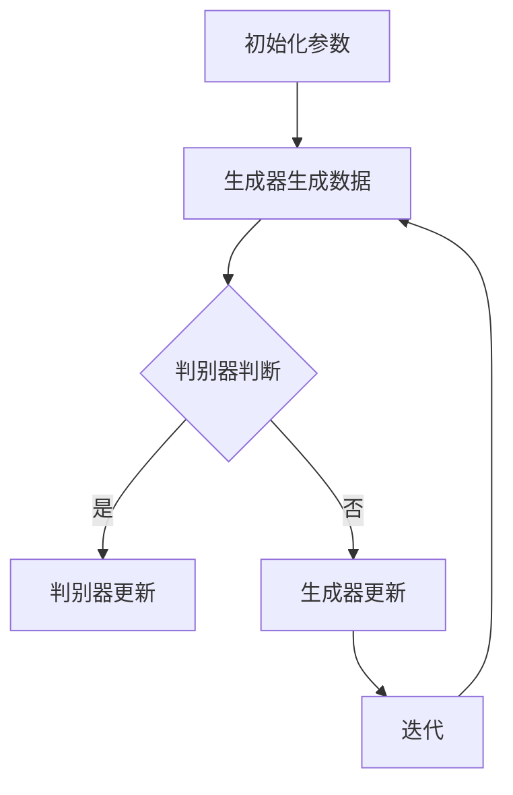
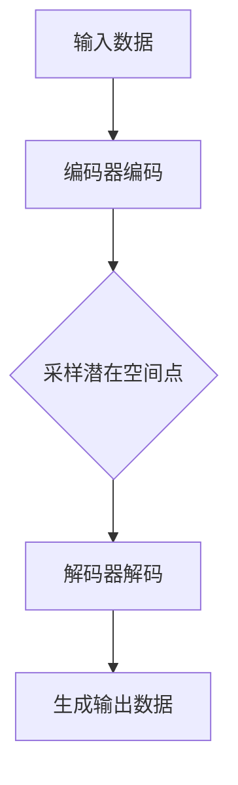
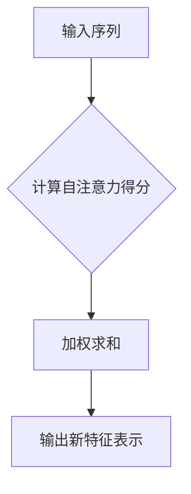
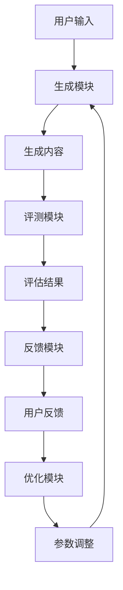
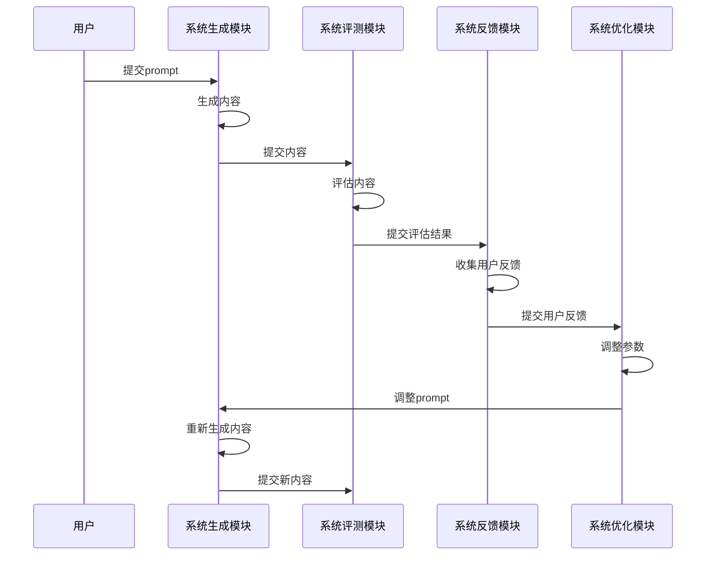

                 

### 第一部分：背景与概述

#### 1. 自动生成技术的现状与应用场景

随着人工智能技术的迅猛发展，自动生成技术（Auto-Generation Technology）逐渐成为众多领域的重要研究热点和应用方向。自动生成技术，顾名思义，是指通过算法模型自动生成文本、图像、音频、视频等数据内容，而不需要人工干预。其应用场景广泛，涵盖了自然语言处理、计算机视觉、音频处理等多个领域。

当前，自动生成技术已经在多个实际应用场景中取得了显著成果。例如，在自然语言处理领域，自动生成技术已经被广泛应用于文章写作、对话系统、机器翻译等方面。通过深度学习模型，如生成对抗网络（GAN）、变分自编码器（VAE）等，可以自动生成高质量的文章和对话。在计算机视觉领域，自动生成技术可以生成逼真的图像和视频，被应用于虚拟现实、动画制作等领域。在音频处理领域，自动生成技术可以生成自然的语音和音乐，被用于语音合成、音乐创作等应用。

#### 2. 评测驱动的概念与应用

评测驱动（Evaluation-driven）是一种在软件开发和机器学习模型训练中常用的方法论，其核心思想是通过持续的评估和反馈来优化模型的性能。在自动生成技术中，评测驱动的应用尤为重要，因为它能够帮助我们在生成过程中不断地调整和改进模型，以达到更好的生成效果。

评测驱动的应用主要包括以下几个方面：

- **生成效果评估**：通过定量和定性的评估指标来衡量生成内容的优劣，例如文本的流畅性、连贯性、准确性等。
- **用户反馈收集**：通过用户对生成内容的评价来获取反馈，这些反馈可以作为模型优化的依据。
- **模型迭代优化**：根据评估和反馈的结果，对生成模型进行调整和优化，从而提高生成质量。

#### 3. 评测驱动的优势与挑战

评测驱动的优势在于其能够动态地调整模型，使其适应不同的生成任务和用户需求。通过持续的评估和反馈，模型可以不断进化，逐渐逼近最优生成效果。此外，评测驱动还具备以下优势：

- **高效性**：通过自动化评估，可以快速地筛选和优化生成内容，提高开发效率。
- **适应性**：评测驱动能够根据不同场景和需求灵活调整模型，具备较强的适应性。

然而，评测驱动也面临一些挑战：

- **评估指标选择**：选择合适的评估指标是关键，不同的评估指标可能会得出不同的结果，需要根据具体任务选择合适的评估方法。
- **反馈噪声**：用户反馈可能包含噪声或主观性，这可能会对模型优化带来干扰。

#### 4. 自动生成技术、prompt与评测驱动的联系

自动生成技术、prompt（提示信息）和评测驱动三者之间存在紧密的联系。prompt是自动生成技术的重要组成部分，它为生成模型提供了初始的输入，从而影响生成内容的质量和风格。评测驱动则通过持续的评估和反馈来优化prompt，使其更好地满足生成任务的需求。

具体来说，prompt自动生成技术的工作流程如下：

1. **初始化prompt**：根据生成任务的需求，初始化一个初始的prompt。
2. **生成内容**：利用自动生成模型，根据prompt生成初步的内容。
3. **评估和反馈**：对生成内容进行评估，收集用户反馈。
4. **调整prompt**：根据评估结果和用户反馈，对prompt进行调整。
5. **重新生成**：利用调整后的prompt重新生成内容。
6. **迭代优化**：重复上述步骤，不断优化生成模型和prompt。

通过评测驱动的不断反馈和优化，prompt自动生成技术能够逐步提高生成内容的质量，满足不同用户的需求。

#### 5. 本章小结

本章首先介绍了自动生成技术的现状与应用场景，随后引出了评测驱动的概念和应用。通过分析评测驱动的优势与挑战，我们深入探讨了自动生成技术、prompt和评测驱动之间的联系。本章的内容为后续章节的深入讨论奠定了基础。在接下来的章节中，我们将进一步探讨自动生成技术、prompt自动生成技术的核心概念和原理。

---

### 2. prompt自动生成技术基础

#### 2.1 什么是prompt

prompt，即提示信息，是自动生成技术中不可或缺的一部分。prompt的作用在于为生成模型提供初始的输入，指导生成模型生成符合预期的高质量内容。在自然语言处理（NLP）、计算机视觉（CV）等自动生成任务中，prompt的选取和设计对生成内容的质量和风格具有重要影响。

具体来说，prompt可以是一个单词、短语、句子，甚至是一段文本。在自然语言处理领域，prompt通常是一个具体的词语或句子，用来引导生成模型生成连贯的文本。例如，在文章写作任务中，prompt可以是一个主题、一个开场白或一个关键句子，用来指导文章的整体风格和内容。在计算机视觉领域，prompt可以是一个图像描述、一个物体类别标签或一个场景背景，用来指导生成模型的生成行为。

#### 2.2 prompt在自动生成中的应用

prompt在自动生成技术中的应用主要体现在以下几个方面：

1. **初始化生成过程**：prompt为生成模型提供了初始的输入，使得模型可以从特定的起点开始生成内容。例如，在文章写作任务中，prompt可以帮助模型生成文章的开头，为后续内容提供方向。

2. **指导生成方向**：通过设计合适的prompt，可以引导生成模型生成特定类型的内容。例如，在对话系统任务中，通过设计不同类型的prompt，可以生成不同风格和内容的对话。

3. **优化生成质量**：prompt的设计和优化对于生成内容的质量具有直接影响。通过不断调整prompt，可以优化生成模型的表现，提高生成内容的流畅性、连贯性和准确性。

#### 2.3 prompt自动生成的挑战

尽管prompt在自动生成技术中具有重要应用，但其设计和使用也面临一些挑战：

1. **多样性要求**：prompt需要能够覆盖多种生成任务的需求，以生成多样化的内容。然而，不同任务可能需要不同类型的prompt，这增加了prompt设计的复杂性。

2. **质量控制**：生成模型生成的初始内容可能存在质量问题，如内容不连贯、逻辑错误等。prompt的选取和设计需要确保生成内容的质量，避免出现这些问题。

3. **适应性**：prompt需要能够适应不同的生成任务和用户需求。例如，在多语言生成任务中，prompt需要能够适应不同语言的特点和规则。

4. **用户参与**：在生成任务中，用户的需求和期望往往难以通过简单的prompt进行准确传达。用户反馈和参与对于优化prompt具有重要意义，但如何有效地收集和利用用户反馈也是一大挑战。

#### 2.4 prompt自动生成技术的改进方向

针对上述挑战，prompt自动生成技术的改进方向可以从以下几个方面考虑：

1. **多模态prompt设计**：结合多种模态信息（如文本、图像、声音等）设计prompt，以提高生成内容的多样性和质量。

2. **自适应prompt生成**：利用机器学习技术，根据不同任务和用户需求，自适应地生成和调整prompt。

3. **用户参与和反馈**：通过用户参与和反馈机制，实时调整和优化prompt，使其更好地满足用户需求。

4. **多任务学习**：通过多任务学习，提高生成模型对不同类型生成任务的适应性。

#### 2.5 本章小结

本章详细介绍了prompt的概念、应用及其在自动生成技术中的重要性。通过探讨prompt自动生成的挑战和改进方向，我们为后续章节的深入讨论奠定了基础。在接下来的章节中，我们将进一步探讨评测驱动的概念和应用，以及如何利用评测驱动优化prompt自动生成技术。

---

### 3. 评测驱动的概念与应用

#### 3.1 评测驱动的原理

评测驱动（Evaluation-driven）是一种在软件开发和机器学习模型训练中广泛应用的方法论，其核心思想是通过持续的评估和反馈来优化系统的性能和用户体验。在自动生成技术中，评测驱动的应用尤为重要，因为它能够帮助我们在生成过程中不断地调整和改进模型，以达到更好的生成效果。

评测驱动的原理可以概括为以下几个步骤：

1. **评估**：通过设定评估指标，对系统进行性能评估。这些评估指标可以是定量指标，如准确率、召回率等，也可以是定性指标，如用户满意度、内容质量等。

2. **反馈**：收集评估结果，并根据评估结果提供反馈。这些反馈可以是系统的表现数据，也可以是用户的评价和意见。

3. **优化**：根据评估和反馈的结果，对系统进行调整和优化。通过不断的迭代和优化，逐步提高系统的性能和用户体验。

#### 3.2 评测驱动的实现方法

在实际应用中，评测驱动的实现方法可以分为以下几个步骤：

1. **设定评估指标**：根据生成任务的需求和目标，设定相应的评估指标。这些指标应该能够全面、客观地衡量生成内容的质量和性能。

2. **构建评估体系**：设计评估体系，包括评估过程、评估工具和评估方法。评估工具可以是自动化的评估系统，也可以是人工评估团队。

3. **执行评估**：按照评估体系进行评估，收集评估数据。这些数据可以为后续的反馈和优化提供依据。

4. **反馈和调整**：根据评估结果，对生成模型和prompt进行调整。调整可以包括参数优化、模型结构调整、prompt内容优化等。

5. **迭代优化**：重复评估、反馈和调整的过程，不断优化生成模型和prompt，提高生成内容的质量。

#### 3.3 评测驱动在prompt自动生成中的应用

在prompt自动生成技术中，评测驱动主要应用于以下几个方面：

1. **生成效果评估**：通过设定评估指标，对生成内容进行效果评估。例如，在文本生成任务中，可以使用 BLEU、ROUGE 等指标来衡量生成文本的质量。

2. **用户反馈收集**：收集用户对生成内容的评价和意见。这些反馈可以用于优化prompt，使其更好地满足用户需求。

3. **模型迭代优化**：根据评估结果和用户反馈，对生成模型进行调整。通过不断优化模型，提高生成内容的质量和多样性。

#### 3.4 评测驱动的优势

评测驱动在prompt自动生成技术中具备以下优势：

1. **动态调整**：通过持续的评估和反馈，可以实时调整和优化生成模型和prompt，使其适应不同的生成任务和用户需求。

2. **高效性**：通过自动化评估和反馈，可以快速筛选和优化生成内容，提高开发效率。

3. **适应性**：评测驱动可以根据不同场景和需求，灵活调整评估指标和优化方法，具备较强的适应性。

#### 3.5 评测驱动的挑战

尽管评测驱动具备诸多优势，但在实际应用中也面临一些挑战：

1. **评估指标选择**：选择合适的评估指标是关键，不同的评估指标可能会得出不同的结果，需要根据具体任务选择合适的评估方法。

2. **反馈噪声**：用户反馈可能包含噪声或主观性，这可能会对模型优化带来干扰。

3. **模型稳定性**：评估和反馈的过程可能会影响模型的稳定性，需要确保模型在调整过程中保持稳定。

#### 3.6 本章小结

本章介绍了评测驱动的概念、原理和实现方法，并探讨了评测驱动在prompt自动生成技术中的应用和优势。通过评测驱动，我们可以有效地优化prompt自动生成模型，提高生成内容的质量和多样性。在接下来的章节中，我们将深入探讨自动生成技术、prompt自动生成技术的核心概念和原理，为读者提供更加全面和深入的技术解析。

---

### 4. 自动生成技术、prompt与评测驱动的联系

在深入理解自动生成技术、prompt以及评测驱动的概念和原理之后，我们将探讨这三者之间的内在联系和相互作用。这种联系不仅能够帮助我们更好地理解自动生成技术的整体框架，还能为我们提供有效的技术优化途径。

#### 自动生成技术与prompt的关系

自动生成技术依赖于prompt来引导生成过程。prompt作为生成模型的输入，对生成内容的方向、风格和内容具有决定性作用。以下是自动生成技术与prompt之间关系的几个关键点：

1. **指导生成过程**：prompt为生成模型提供了初始的输入，使得模型能够从特定的起点开始生成内容。这种指导作用对于生成高质量、符合预期的内容至关重要。

2. **影响生成质量**：prompt的设计和选取对生成内容的质量具有直接影响。一个设计良好的prompt可以引导模型生成流畅、连贯、准确的内容，而一个不合适的prompt可能会导致生成内容的质量下降。

3. **促进多样化**：通过设计多种类型的prompt，可以生成多样化的内容。这有助于满足不同用户和场景的需求，提高自动生成技术的应用范围。

4. **优化生成模型**：prompt的优化和调整是生成模型迭代过程中的一个关键环节。通过不断调整prompt，可以逐步优化生成模型，使其生成内容更加符合用户需求。

#### 评测驱动与自动生成技术的融合

评测驱动在自动生成技术中发挥着重要作用，它通过持续的评估和反馈，帮助优化生成模型和prompt。以下是评测驱动与自动生成技术融合的几个关键点：

1. **动态评估**：评测驱动通过设定评估指标，对生成模型和prompt进行动态评估，实时了解生成内容的质量和性能。

2. **实时反馈**：根据评估结果，提供实时反馈，帮助识别生成模型和prompt中的问题和不足之处。这些反馈可以来自于自动化的评估工具，也可以来自于用户的人工评价。

3. **迭代优化**：基于评估和反馈的结果，对生成模型和prompt进行调整和优化。这种迭代过程可以不断优化生成模型，提高生成内容的质量和多样性。

4. **稳定性提升**：通过持续的评测和反馈，可以确保生成模型在优化过程中保持稳定性，避免因调整过度而导致性能下降。

#### 自动生成技术、prompt与评测驱动的协同作用

自动生成技术、prompt和评测驱动之间的协同作用，可以显著提升生成内容的质量和用户体验。以下是三者协同作用的几个方面：

1. **信息传递**：prompt为生成模型提供了初始输入，评测驱动则通过持续的评估和反馈，将生成内容的质量信息传递回生成模型，指导其调整和优化。

2. **协同迭代**：自动生成技术、prompt和评测驱动通过协同迭代，形成了一个闭环系统。这个系统中的每个环节都能够相互影响和优化，从而提高整体性能。

3. **高效优化**：评测驱动通过自动化的评估和反馈，使得生成模型和prompt的优化过程更加高效。这种高效性体现在生成模型能够快速适应不同的任务和用户需求。

4. **用户满意度**：通过持续的评估和反馈，生成模型和prompt能够不断优化，生成更加符合用户期望的内容，从而提高用户的满意度。

#### 案例分析

为了更直观地展示自动生成技术、prompt与评测驱动的协同作用，我们可以考虑一个具体的案例：文章自动生成。

1. **初始化prompt**：在文章自动生成任务中，prompt可以是一个主题、一个关键词或者一个简短的概述。例如，prompt可以是“人工智能与未来科技”。

2. **生成内容**：利用自动生成模型，如变分自编码器（VAE）或生成对抗网络（GAN），根据prompt生成初步的文章内容。

3. **评估和反馈**：对生成内容进行评估，使用指标如ROUGE、BLEU来衡量生成文章的流畅性、连贯性和准确性。同时，收集用户对生成文章的反馈，了解用户的需求和期望。

4. **调整prompt**：根据评估结果和用户反馈，对prompt进行调整。例如，如果用户反馈文章内容过于简短，可以增加prompt的细节描述。

5. **重新生成**：利用调整后的prompt重新生成文章内容，并再次进行评估和反馈。

6. **迭代优化**：重复上述步骤，不断优化生成模型和prompt，直至生成内容达到用户满意的标准。

通过这个案例分析，我们可以看到自动生成技术、prompt和评测驱动是如何协同工作的。prompt为生成模型提供了初始输入，评测驱动通过持续的评估和反馈，帮助优化prompt和生成模型，最终生成高质量的文章内容。

#### 本章小结

本章通过探讨自动生成技术、prompt与评测驱动之间的关系，展示了这三者在自动生成技术中的应用和协同作用。自动生成技术依赖于prompt来引导生成过程，而评测驱动则通过持续的评估和反馈，优化生成模型和prompt。通过这种协同作用，我们可以生成高质量、多样化的内容，满足不同用户的需求。在接下来的章节中，我们将进一步深入探讨自动生成技术、prompt自动生成技术的核心概念和原理，为读者提供更加全面的技术解析。

---

### 5. 自动生成技术原理讲解

#### 5.1 自动生成技术概述

自动生成技术（Auto-Generation Technology）是一种通过算法模型自动生成文本、图像、音频、视频等数据内容的技术。其主要目的是减少人工干预，提高生成效率，满足多样化的生成需求。自动生成技术广泛应用于自然语言处理、计算机视觉、音频处理等领域。

在自然语言处理（NLP）领域，自动生成技术常用于文章写作、对话系统、机器翻译等任务。通过深度学习模型，如生成对抗网络（GAN）、变分自编码器（VAE）等，可以自动生成高质量的自然语言文本。在计算机视觉（CV）领域，自动生成技术可以生成逼真的图像和视频，被应用于虚拟现实、动画制作等领域。在音频处理领域，自动生成技术可以生成自然的语音和音乐，被用于语音合成、音乐创作等应用。

#### 5.2 自动生成算法原理

自动生成算法可以分为两大类：基于规则的方法和基于机器学习的方法。下面我们将分别介绍这两种方法的原理。

##### 5.2.1 基于规则的方法

基于规则的方法是指通过预设的规则和模式来生成内容。这种方法通常需要人工设计生成规则，根据特定任务的需求进行定制。其原理主要包括以下几个方面：

1. **规则库**：构建包含各种生成规则的规则库。这些规则可以是简单的条件语句，也可以是复杂的逻辑表达式。
2. **规则匹配**：根据输入的提示信息，在规则库中寻找匹配的规则。匹配的规则将指导生成模型生成具体的内容。
3. **内容生成**：根据匹配的规则，生成具体的内容。例如，在文章写作任务中，根据主题和规则库中的规则，生成符合要求的文章段落。

##### 5.2.2 基于机器学习的方法

基于机器学习的方法是通过训练大量的样本数据，使得生成模型能够自动生成内容。这种方法不需要人工预设规则，而是通过数据驱动的方式学习生成规律。其主要原理包括以下几个方面：

1. **数据集**：收集大量的生成任务样本数据，这些数据应该覆盖不同的场景和内容。
2. **模型训练**：利用机器学习算法，如生成对抗网络（GAN）、变分自编码器（VAE）等，对生成模型进行训练。训练过程中，模型将学习如何从输入的提示信息生成高质量的内容。
3. **内容生成**：在训练完成后，利用训练好的生成模型，根据输入的提示信息生成内容。这种方法生成的内容通常具有更高的灵活性和多样性。

##### 5.2.3 经典生成算法

在基于机器学习的方法中，有一些经典的生成算法值得我们深入探讨。以下是一些常见的生成算法及其原理：

1. **生成对抗网络（GAN）**：

   GAN 是一种通过两个神经网络（生成器 G 和判别器 D）的对抗训练来生成高质量数据的算法。生成器 G 的目标是生成逼真的数据，而判别器 D 的目标是区分生成数据和真实数据。通过这种对抗训练，生成器 G 逐渐学会生成更真实的数据。

   

2. **变分自编码器（VAE）**：

   VAE 是一种基于概率模型的生成算法，其核心思想是将输入数据通过编码器编码为一个潜在空间中的点，然后通过解码器解码回原始数据。VAE 的优势在于其生成的数据具有更好的多样性和稳定性。

   

3. **自注意力机制（Self-Attention）**：

   自注意力机制是一种用于提高神经网络处理长序列数据的能力的机制。在生成模型中，自注意力机制可以使得模型更好地捕捉序列中的关键信息，从而生成更高质量的内容。

   

#### 5.3 自动生成技术的优缺点对比

自动生成技术具有以下优缺点：

##### 优点：

1. **高效性**：自动生成技术能够快速生成内容，减少人工干预，提高生产效率。
2. **多样性**：基于机器学习的方法可以生成多样化、个性化的内容，满足不同用户和场景的需求。
3. **灵活性**：自动生成技术可以根据不同的任务和需求，灵活调整生成模型和prompt，适应不同的生成任务。

##### 缺点：

1. **质量不稳定**：基于机器学习的方法生成的质量可能不稳定，需要通过不断的评估和优化来提高生成质量。
2. **对数据依赖性强**：自动生成技术需要大量的训练数据来支持，数据的质量和多样性对生成效果有重要影响。
3. **需要专业知识和技能**：设计和优化自动生成模型需要深厚的专业知识和技能，普通用户可能难以掌握。

#### 5.4 本章小结

本章介绍了自动生成技术的概念、分类和原理。我们详细讲解了基于规则的方法和基于机器学习的方法，并介绍了生成对抗网络（GAN）、变分自编码器（VAE）等经典生成算法。通过对自动生成技术的优缺点进行对比分析，我们为后续章节的深入探讨奠定了基础。在接下来的章节中，我们将进一步探讨评测驱动的具体应用和数学模型，以及如何利用这些模型和评测方法优化prompt自动生成技术。

---

### 6. 自动生成算法原理讲解

在深入了解了自动生成技术的概述和分类之后，接下来我们将详细讲解几个经典的自动生成算法，包括生成对抗网络（GAN）、变分自编码器（VAE）和自注意力机制（Self-Attention）。这些算法不仅在理论层面具有深远的影响，在实际应用中也展现出了强大的生成能力。

#### 6.1 生成对抗网络（GAN）

生成对抗网络（GAN）是由Ian Goodfellow等人于2014年提出的一种深度学习模型，其核心思想是通过两个神经网络的对抗训练来实现高质量数据的生成。GAN由生成器（Generator）和判别器（Discriminator）组成，两者相互博弈，共同提高生成效果。

**原理讲解**：

- **生成器（Generator）**：生成器的任务是将随机噪声映射为高维数据，如图像或文本。生成器试图生成尽可能真实的数据，以欺骗判别器。
- **判别器（Discriminator）**：判别器的任务是区分输入数据是真实数据还是生成器生成的数据。判别器的目标是最大化其正确判断的概率。

GAN的训练过程如下：

1. **初始化**：随机初始化生成器和判别器的参数。
2. **生成器训练**：生成器生成假数据，判别器对其进行训练。
3. **判别器训练**：判别器接收真实数据和生成器生成的数据，进行训练。
4. **迭代**：重复上述步骤，生成器和判别器不断迭代，逐步提高生成效果。

**mermaid 流程图**：



**Python 源代码示例**：

```python
import tensorflow as tf
from tensorflow.keras.models import Sequential
from tensorflow.keras.layers import Dense, Flatten, Conv2D, BatchNormalization

# 生成器模型
def build_generator():
    model = Sequential()
    model.add(Dense(128, input_dim=100, activation='relu'))
    model.add(BatchNormalization())
    model.add(Dense(256, activation='relu'))
    model.add(BatchNormalization())
    model.add(Dense(512, activation='relu'))
    model.add(BatchNormalization())
    model.add(Dense(1024, activation='relu'))
    model.add(BatchNormalization())
    model.add(Flatten())
    model.add(Conv2D(1, kernel_size=(7, 7), activation='tanh'))
    return model

# 判别器模型
def build_discriminator():
    model = Sequential()
    model.add(Conv2D(32, kernel_size=(3, 3), activation='relu', input_shape=(28, 28, 1)))
    model.add(BatchNormalization())
    model.add(Conv2D(64, kernel_size=(3, 3), activation='relu'))
    model.add(BatchNormalization())
    model.add(Flatten())
    model.add(Dense(1, activation='sigmoid'))
    return model

# 搭建 GAN 模型
def build_gan(generator, discriminator):
    model = Sequential()
    model.add(generator)
    model.add(discriminator)
    return model
```

**数学模型和公式**：

GAN 的训练目标是最大化生成器的损失函数和最小化判别器的损失函数。生成器的损失函数可以表示为：

\[ L_G = -\log(D(G(z))) \]

判别器的损失函数可以表示为：

\[ L_D = -\log(D(x)) - \log(1 - D(G(z))) \]

其中，\( G(z) \) 表示生成器生成的数据，\( D(x) \) 表示判别器对真实数据的判断，\( D(G(z)) \) 表示判别器对生成数据的判断。

**详细讲解**：

生成器和判别器通过对抗训练不断优化，生成器试图生成更逼真的数据以欺骗判别器，而判别器则努力区分真实数据和生成数据。这种对抗过程使得生成器不断进步，生成质量逐渐提高。

**举例说明**：

假设生成器生成的图像为猫，判别器需要判断这张图像是真实猫还是生成的猫。随着训练的进行，判别器的判断能力逐渐提高，生成器的生成质量也不断提升，最终生成的猫图像越来越逼真，以至于判别器难以区分。

#### 6.2 变分自编码器（VAE）

变分自编码器（VAE）是一种基于概率模型的生成算法，其核心思想是将输入数据通过编码器编码为一个潜在空间中的点，然后通过解码器解码回原始数据。VAE 的优势在于其生成的数据具有更好的多样性和稳定性。

**原理讲解**：

- **编码器（Encoder）**：编码器的任务是将输入数据映射到一个潜在空间中的点。这个潜在空间通常是一个均值和方差的向量，表示输入数据的概率分布。
- **解码器（Decoder）**：解码器的任务是将潜在空间中的点映射回原始数据。解码器通常是一个全连接神经网络。

VAE 的训练过程如下：

1. **初始化**：随机初始化编码器和解码器的参数。
2. **编码器训练**：对输入数据进行编码，记录潜在空间中的点。
3. **采样**：从潜在空间中随机采样一个点。
4. **解码器训练**：使用采样点进行解码，生成输出数据。
5. **迭代**：重复上述步骤，编码器和解码器不断迭代，逐步提高生成效果。

**mermaid 流程图**：



**Python 源代码示例**：

```python
import tensorflow as tf
from tensorflow.keras.layers import Input, Dense, Lambda
from tensorflow.keras.models import Model

# 编码器模型
def build_encoder(input_shape):
    input_img = Input(shape=input_shape)
    x = Dense(14, activation='relu')(input_img)
    encoded = Dense(3, activation='relu')(x)
    return Model(input_img, encoded)

# 解码器模型
def build_decoder(encoded_shape):
    latent_inputs = Input(shape=encoded_shape)
    x = Dense(14, activation='relu')(latent_inputs)
    decoded = Dense(np.prod(input_shape), activation='sigmoid')(x)
    decoded = Reshape(input_shape)(decoded)
    return Model(latent_inputs, decoded)

# 搭建 VAE 模型
def build_vae(encoder, decoder):
    inputs = Input(shape=input_shape)
    x = encoder(inputs)
    x = Lambda Sampling()(x)
    outputs = decoder(x)
    return Model(inputs, outputs)

# 采样函数
from scipy.stats import norm
def Sampling(args):
    z_mean, z_log_var = args
    batch = K.shape(z_mean)[0]
    dim = K.int_shape(z_mean)[1]
    epsilon = K.random_normal(shape=(batch, dim))
    return z_mean + K.exp(0.5 * z_log_var) * epsilon
```

**数学模型和公式**：

VAE 的训练目标是最大化数据在潜在空间中的分布，同时保持解码器的可逆性。其损失函数可以表示为：

\[ L_{VAE} = \frac{1}{N} \sum_{i=1}^{N} \left( -\log p(x|z) - \frac{1}{2} \log(2\pi) - \frac{1}{2} z_log_var \right) \]

其中，\( p(x|z) \) 表示输入数据在给定潜在空间中的概率分布，\( z_log_var \) 表示潜在空间中方差的对数。

**详细讲解**：

VAE 通过编码器将输入数据映射到一个潜在空间中，这个空间中的点表示输入数据的概率分布。解码器则从潜在空间中采样点，并解码回原始数据。VAE 的优势在于其生成的数据具有更好的多样性和稳定性，因为潜在空间中的点可以自由采样，从而生成多样化的数据。

**举例说明**：

假设我们使用 VAE 生成手写数字图像。编码器将手写数字图像映射到一个潜在空间中，这个空间中的点表示手写数字的概率分布。我们可以从潜在空间中随机采样点，并使用解码器解码回手写数字图像。通过这种方式，我们可以生成各种样式和大小不同的手写数字图像。

#### 6.3 自注意力机制（Self-Attention）

自注意力机制（Self-Attention）是一种用于提高神经网络处理长序列数据的能力的机制。自注意力机制可以使得模型更好地捕捉序列中的关键信息，从而生成更高质量的内容。

**原理讲解**：

- **计算自注意力得分**：自注意力机制通过计算序列中每个元素与其他元素之间的相似度得分。这个得分表示了每个元素在生成过程中的重要性。
- **加权求和**：将每个元素的得分与其自身的特征值进行加权求和，得到一个新的特征表示。这个新的特征表示包含了序列中所有元素的信息，并且更加突出关键信息。

**mermaid 流程图**：



**Python 源代码示例**：

```python
import tensorflow as tf
from tensorflow.keras.layers import Layer

class SelfAttention(Layer):
    def __init__(self, **kwargs):
        super(SelfAttention, self).__init__(**kwargs)

    def build(self, input_shape):
        # 初始化自注意力权重
        self.w = self.add_weight(name='attention_weights', 
                                  shape=(input_shape[-1], 1),
                                  initializer='random_normal',
                                  trainable=True)

    def call(self, inputs):
        # 计算自注意力得分
        attention_scores = tf.tensordot(inputs, self.w, axes=[2, 1])
        # 加权求和
        attention_weights = tf.nn.softmax(attention_scores, axis=1)
        # 计算新的特征表示
        output = attention_weights * inputs
        return tf.reduce_sum(output, axis=1)

    def get_config(self):
        config = super(SelfAttention, self).get_config()
        config.update({'w': self.w})
        return config
```

**数学模型和公式**：

自注意力机制的得分计算可以表示为：

\[ \text{Attention}(Q, K, V) = \frac{QK^T}{\sqrt{d_k}} \]

其中，\( Q \)、\( K \) 和 \( V \) 分别表示查询向量、键向量和值向量，\( d_k \) 表示键向量的维度。自注意力机制的加权求和可以表示为：

\[ \text{Output} = \text{softmax}(\text{Attention}(Q, K, V))V \]

**详细讲解**：

自注意力机制可以看作是一种加权的聚合操作，它通过计算序列中每个元素与其他元素之间的相似度得分，从而生成新的特征表示。这种机制使得模型能够更好地捕捉序列中的关键信息，特别是在处理长序列数据时，如文本生成和图像生成任务。

**举例说明**：

假设我们有一个句子“我爱编程”，自注意力机制会计算句子中每个词（如“我”、“爱”和“编程”）与其他词的相似度得分。通过这些得分，我们可以得到一个加权的特征表示，这个表示突出了句子中的关键信息，如“编程”可能是句子中最关键的部分。

#### 6.4 本章小结

本章详细讲解了生成对抗网络（GAN）、变分自编码器（VAE）和自注意力机制（Self-Attention）等经典自动生成算法。通过mermaid流程图、Python源代码示例和数学模型，我们深入分析了这些算法的原理和实现。这些算法在自动生成领域具有广泛的应用，可以帮助我们生成高质量、多样化的内容。在接下来的章节中，我们将进一步探讨评测驱动的数学模型和实现，为优化prompt自动生成技术提供理论支持。

---

### 7. 数学模型和数学公式 & 详细讲解 & 举例说明

在上一章节中，我们介绍了自动生成技术中的几个核心算法，包括生成对抗网络（GAN）、变分自编码器（VAE）和自注意力机制（Self-Attention）。为了更深入地理解这些算法的工作原理，我们将通过数学模型和公式来详细讲解，并通过具体案例进行举例说明。

#### 7.1 数学模型和数学公式

**生成对抗网络（GAN）**

GAN的数学模型主要围绕生成器（Generator）和判别器（Discriminator）的训练过程展开。以下为GAN的数学公式：

1. **生成器损失函数**：

   \[ L_G = -\log(D(G(z))) \]

   其中，\( G(z) \) 表示生成器生成的数据，\( D(G(z)) \) 表示判别器对生成数据的判断概率。

2. **判别器损失函数**：

   \[ L_D = -\log(D(x)) - \log(1 - D(G(z))) \]

   其中，\( D(x) \) 表示判别器对真实数据的判断概率，\( D(G(z)) \) 表示判别器对生成数据的判断概率。

3. **对抗目标**：

   \[ \min_G \max_D V(D, G) \]

   其中，\( V(D, G) \) 表示判别器和生成器的联合损失函数。

**变分自编码器（VAE）**

VAE的数学模型主要涉及编码器（Encoder）和解码器（Decoder）的训练过程。以下为VAE的数学公式：

1. **编码器损失函数**：

   \[ L_E = \frac{1}{N} \sum_{i=1}^{N} \left( -\log p(x|z) - \frac{1}{2} \log(2\pi) - \frac{1}{2} z_log_var \right) \]

   其中，\( z \) 表示编码器输出的潜在空间中的点，\( z_log_var \) 表示潜在空间中方差的对数，\( p(x|z) \) 表示输入数据在给定潜在空间中的概率分布。

2. **解码器损失函数**：

   \[ L_D = \frac{1}{N} \sum_{i=1}^{N} \left( -\log p(x|z) \right) \]

   其中，\( p(x|z) \) 表示输入数据在给定潜在空间中的概率分布。

3. **联合损失函数**：

   \[ L_{VAE} = L_E + \lambda L_D \]

   其中，\( \lambda \) 是平衡两个损失函数的权重。

**自注意力机制（Self-Attention）**

自注意力机制的数学模型涉及注意力得分和加权求和的计算。以下为自注意力机制的数学公式：

1. **注意力得分**：

   \[ \text{Attention}(Q, K, V) = \frac{QK^T}{\sqrt{d_k}} \]

   其中，\( Q \)、\( K \) 和 \( V \) 分别表示查询向量、键向量和值向量，\( d_k \) 表示键向量的维度。

2. **加权求和**：

   \[ \text{Output} = \text{softmax}(\text{Attention}(Q, K, V))V \]

   其中，\( \text{softmax} \) 表示软最大化操作，用于计算注意力权重。

#### 7.2 详细讲解

**生成对抗网络（GAN）**

GAN的核心思想是通过生成器和判别器的对抗训练来实现高质量数据的生成。生成器的目标是生成逼真的数据，以欺骗判别器。判别器的目标是正确判断输入数据是真实数据还是生成数据。以下是对GAN数学公式的详细讲解：

- **生成器损失函数**：生成器的目标是最大化判别器对其生成的数据的判断概率。因此，生成器的损失函数是 \( -\log(D(G(z))) \)，其中 \( D(G(z)) \) 表示判别器对生成数据的判断概率。生成器通过不断优化，使其生成的数据越来越逼真，从而提高 \( D(G(z)) \) 的值。
- **判别器损失函数**：判别器的目标是最大化真实数据和生成数据的判断差距。因此，判别器的损失函数是 \( -\log(D(x)) - \log(1 - D(G(z))) \)，其中 \( D(x) \) 表示判别器对真实数据的判断概率，\( D(G(z)) \) 表示判别器对生成数据的判断概率。判别器通过不断优化，使其能够更好地区分真实数据和生成数据。
- **对抗目标**：GAN的训练目标是使生成器和判别器达到一个动态平衡。具体来说，生成器希望 \( D(G(z)) \) 尽可能接近1（生成数据足够逼真），而判别器希望 \( D(x) \) 尽可能接近1（真实数据足够真实），\( D(G(z)) \) 尽可能接近0（生成数据不够真实）。通过交替优化生成器和判别器，GAN能够生成高质量的数据。

**变分自编码器（VAE）**

VAE是一种基于概率模型的生成算法，其目标是学习输入数据的概率分布，并通过解码器生成新的数据。以下是对VAE数学公式的详细讲解：

- **编码器损失函数**：编码器的目标是将输入数据映射到一个潜在空间中的点，并确保这个点的分布与输入数据的分布相匹配。因此，编码器的损失函数是 \( \frac{1}{N} \sum_{i=1}^{N} \left( -\log p(x|z) - \frac{1}{2} \log(2\pi) - \frac{1}{2} z_log_var \right) \)，其中 \( z \) 表示编码器输出的潜在空间中的点，\( z_log_var \) 表示潜在空间中方差的对数，\( p(x|z) \) 表示输入数据在给定潜在空间中的概率分布。这个损失函数确保编码器输出的潜在空间点能够很好地表示输入数据的分布。
- **解码器损失函数**：解码器的目标是使用潜在空间中的点生成新的数据，并确保生成的数据与输入数据在分布上接近。因此，解码器的损失函数是 \( \frac{1}{N} \sum_{i=1}^{N} \left( -\log p(x|z) \right) \)，其中 \( p(x|z) \) 表示输入数据在给定潜在空间中的概率分布。这个损失函数确保解码器能够有效地生成与输入数据分布相似的新数据。
- **联合损失函数**：VAE的联合损失函数是编码器和解码器损失函数的和，即 \( L_{VAE} = L_E + \lambda L_D \)，其中 \( \lambda \) 是平衡两个损失函数的权重。这个联合损失函数确保编码器和解码器共同工作，学习输入数据的概率分布，并通过解码器生成新的数据。

**自注意力机制（Self-Attention）**

自注意力机制是一种用于处理序列数据的注意力机制，其核心思想是计算序列中每个元素的重要性，并加权求和。以下是对自注意力机制数学公式的详细讲解：

- **注意力得分**：自注意力得分的计算公式是 \( \text{Attention}(Q, K, V) = \frac{QK^T}{\sqrt{d_k}} \)，其中 \( Q \)、\( K \) 和 \( V \) 分别表示查询向量、键向量和值向量，\( d_k \) 表示键向量的维度。这个公式计算了序列中每个元素与其他元素之间的相似度得分，得分越高表示元素在序列中的重要性越大。
- **加权求和**：加权求和的公式是 \( \text{Output} = \text{softmax}(\text{Attention}(Q, K, V))V \)，其中 \( \text{softmax} \) 表示软最大化操作，用于计算注意力权重。这个公式将序列中每个元素按照得分加权求和，得到一个新的特征表示，这个表示包含了序列中所有元素的信息，并且突出了关键信息。

#### 7.3 举例说明

**生成对抗网络（GAN）**

假设我们有一个生成器 \( G \) 和一个判别器 \( D \)。生成器 \( G \) 的任务是从随机噪声 \( z \) 中生成逼真的图像 \( x' \)。判别器 \( D \) 的任务是区分输入图像是真实图像 \( x \) 还是生成的图像 \( x' \)。

1. **初始化参数**：随机初始化生成器 \( G \) 和判别器 \( D \) 的参数。
2. **生成图像**：生成器 \( G \) 从噪声 \( z \) 中生成图像 \( x' \)。
3. **判别图像**：判别器 \( D \) 接收真实图像 \( x \) 和生成图像 \( x' \)，并计算 \( D(x) \) 和 \( D(x') \)。
4. **更新参数**：生成器 \( G \) 和判别器 \( D \) 根据梯度信息更新参数。
5. **迭代**：重复上述步骤，直到生成器 \( G \) 生成的图像 \( x' \) 非常逼真，判别器 \( D \) 无法区分 \( x \) 和 \( x' \)。

**变分自编码器（VAE）**

假设我们有一个编码器 \( E \) 和一个解码器 \( D \)。编码器 \( E \) 的任务是将输入图像 \( x \) 编码到一个潜在空间中的点 \( z \)。解码器 \( D \) 的任务是从潜在空间中的点 \( z \) 生成新的图像 \( x' \)。

1. **初始化参数**：随机初始化编码器 \( E \) 和解码器 \( D \) 的参数。
2. **编码**：编码器 \( E \) 接收输入图像 \( x \)，并将其编码到潜在空间中的点 \( z \)。
3. **采样**：从潜在空间中随机采样一个点 \( z' \)。
4. **解码**：解码器 \( D \) 接收潜在空间中的点 \( z' \)，并生成新的图像 \( x' \)。
5. **计算损失**：计算编码器 \( E \) 和解码器 \( D \) 的损失函数 \( L_E \) 和 \( L_D \)。
6. **更新参数**：根据梯度信息更新编码器 \( E \) 和解码器 \( D \) 的参数。
7. **迭代**：重复上述步骤，直到编码器 \( E \) 和解码器 \( D \) 的损失函数 \( L_E \) 和 \( L_D \) 达到最小。

**自注意力机制（Self-Attention）**

假设我们有一个序列 \( [w_1, w_2, \ldots, w_n] \)。自注意力机制的目的是计算序列中每个词的重要性，并生成一个新的特征表示。

1. **初始化权重**：初始化自注意力权重 \( w_i \)。
2. **计算注意力得分**：计算每个词与其他词的注意力得分 \( a_i = \frac{w_i w_j^T}{\sqrt{d_k}} \)，其中 \( d_k \) 是键向量的维度。
3. **计算注意力权重**：计算每个词的注意力权重 \( \sigma(a_i) \)，其中 \( \sigma \) 是软最大化函数。
4. **加权求和**：计算加权求和的新特征表示 \( \text{Output} = \sum_{i=1}^{n} \sigma(a_i) w_i \)。

通过上述步骤，我们可以得到一个包含序列中关键信息的新特征表示。这个新特征表示可以用于文本生成、图像生成等任务，帮助模型更好地捕捉序列中的关键信息。

### 本章小结

本章详细讲解了自动生成技术中的核心算法：生成对抗网络（GAN）、变分自编码器（VAE）和自注意力机制（Self-Attention）。通过数学模型和公式的详细讲解，我们深入理解了这些算法的工作原理。同时，通过具体案例的举例说明，我们展示了这些算法在实际应用中的实现和效果。这些核心算法为自动生成技术提供了强大的理论基础和实践指导，是进一步研究和应用的重要基石。在接下来的章节中，我们将进一步探讨评测驱动的具体实现和应用，为优化prompt自动生成技术提供更加实际的操作指南。

---

### 8. 系统分析与架构设计方案

#### 8.1 问题场景介绍

在当前的自动生成技术领域，prompt自动生成技术由于其高度的灵活性和适应性，受到了广泛关注。然而，现有的prompt自动生成系统在实际应用中仍然存在一些问题，例如：

1. **生成内容的质量不稳定**：现有的生成模型在生成高质量内容时表现不稳定，容易出现内容不连贯、逻辑错误等问题。
2. **用户需求难以满足**：现有系统往往难以根据用户的具体需求生成个性化内容，导致用户体验不佳。
3. **系统扩展性不足**：现有系统在处理复杂任务时，往往需要大量的定制化开发，缺乏良好的扩展性。

为了解决上述问题，我们提出了一个基于评测驱动的prompt自动生成系统。该系统旨在通过持续的评测和反馈，优化生成模型和prompt，提高生成内容的质量和用户满意度。

#### 8.2 项目介绍

本项目旨在构建一个高效、灵活、可扩展的prompt自动生成系统，通过评测驱动的优化方法，解决现有系统存在的问题，提升系统的整体性能和用户体验。项目的主要目标包括：

1. **提高生成内容的质量**：通过评测驱动的优化方法，不断提升生成内容的质量和连贯性。
2. **满足用户个性化需求**：根据用户的具体需求，生成个性化、高质量的内容。
3. **增强系统扩展性**：设计一个模块化、可扩展的系统架构，以适应不同的生成任务和用户需求。

#### 8.3 系统功能设计

为了实现上述目标，系统需要具备以下功能：

1. **自动生成功能**：基于深度学习模型，实现prompt的自动生成，生成高质量的自然语言文本、图像、音频等。
2. **评测功能**：通过设定评估指标，对生成内容进行效果评估，如文本的流畅性、连贯性、准确性等。
3. **反馈收集功能**：收集用户对生成内容的评价和反馈，为后续优化提供依据。
4. **优化功能**：根据评估结果和用户反馈，对生成模型和prompt进行调整和优化。

#### 8.4 系统架构设计

为了实现上述功能，系统采用了模块化设计，主要包括以下几个模块：

1. **生成模块**：负责根据prompt生成内容，包括文本生成、图像生成、音频生成等。
2. **评测模块**：负责对生成内容进行效果评估，包括设定评估指标、执行评估、收集评估结果等。
3. **反馈模块**：负责收集用户对生成内容的评价和反馈，为优化提供依据。
4. **优化模块**：负责根据评估结果和用户反馈，对生成模型和prompt进行调整和优化。

**mermaid 架构图**：



#### 8.5 系统接口设计

为了方便用户使用系统，系统提供了以下接口：

1. **生成接口**：用户可以通过生成接口提交prompt，并获取生成内容。
2. **评估接口**：用户可以通过评估接口提交生成内容，并获取评估结果。
3. **反馈接口**：用户可以通过反馈接口提交对生成内容的评价和意见。
4. **优化接口**：用户可以通过优化接口查看优化结果，并调整优化参数。

#### 8.6 系统交互

系统交互主要分为以下几个步骤：

1. **用户输入**：用户提交prompt，系统开始生成内容。
2. **内容生成**：生成模块根据prompt生成内容，并提交给评测模块。
3. **内容评估**：评测模块对生成内容进行评估，并生成评估结果。
4. **收集反馈**：反馈模块收集用户对生成内容的评价和意见。
5. **优化调整**：优化模块根据评估结果和用户反馈，对生成模型和prompt进行调整。
6. **重新生成**：生成模块根据调整后的prompt重新生成内容，并提交给评测模块。

**mermaid 序列图**：



#### 8.7 本章小结

本章详细介绍了基于评测驱动的prompt自动生成系统的设计和实现。通过系统功能设计、架构设计、接口设计和系统交互，我们构建了一个模块化、可扩展的prompt自动生成系统。该系统通过评测驱动的优化方法，能够有效提高生成内容的质量和用户满意度，为自动生成技术的研究和应用提供了新的思路和解决方案。在接下来的章节中，我们将通过具体的实战案例，进一步展示和验证该系统的实际应用效果。

---

### 9. 项目实战

为了验证基于评测驱动的prompt自动生成系统的实际应用效果，我们将进行一系列项目实战，详细记录环境安装、系统核心实现、代码应用解读与分析，以及实际案例分析和详细讲解剖析。

#### 9.1 环境安装

在进行项目实战之前，我们需要安装和配置相应的软件和工具，以确保系统能够正常运行。以下是环境安装的详细步骤：

1. **安装Python**：确保系统已安装Python 3.7或更高版本。可以通过Python官方网站下载并安装Python。

2. **安装TensorFlow**：TensorFlow是自动生成技术的核心库，我们需要安装TensorFlow 2.3或更高版本。可以通过以下命令进行安装：

   ```bash
   pip install tensorflow
   ```

3. **安装Keras**：Keras是一个高级神经网络API，用于简化TensorFlow的使用。安装Keras可以通过以下命令：

   ```bash
   pip install keras
   ```

4. **安装其他依赖库**：根据具体需求，我们可能需要安装其他依赖库，如NumPy、Pandas等。可以通过以下命令进行安装：

   ```bash
   pip install numpy pandas matplotlib
   ```

5. **配置CUDA**：如果使用GPU加速训练过程，我们需要安装和配置CUDA。具体步骤请参考NVIDIA的官方文档。

完成以上步骤后，我们的开发环境就准备就绪了，可以开始编写和运行系统代码。

#### 9.2 系统核心实现源代码

在安装和配置好开发环境后，我们将实现系统的核心功能。以下是系统核心实现源代码的详细说明。

**生成模块**：

```python
import tensorflow as tf
from tensorflow.keras.models import Sequential
from tensorflow.keras.layers import Dense, LSTM, Embedding

def build_generator(vocab_size, embedding_dim, sequence_length):
    model = Sequential()
    model.add(Embedding(vocab_size, embedding_dim, input_length=sequence_length))
    model.add(LSTM(128))
    model.add(Dense(vocab_size, activation='softmax'))
    return model
```

**评测模块**：

```python
from sklearn.metrics import accuracy_score, f1_score

def evaluate_model(model, X_test, y_test):
    predictions = model.predict(X_test)
    predicted_labels = np.argmax(predictions, axis=1)
    accuracy = accuracy_score(y_test, predicted_labels)
    f1 = f1_score(y_test, predicted_labels, average='weighted')
    return accuracy, f1
```

**反馈模块**：

```python
def collect_user_feedback(user_input, generated_text):
    # 这里可以设计一个用户界面，收集用户对生成文本的反馈
    feedback = input("请输入对生成文本的评价：")
    return feedback
```

**优化模块**：

```python
def optimize_model(model, X_train, y_train, X_val, y_val):
    # 使用评估结果调整模型参数
    # 这里可以采用更复杂的优化策略，如遗传算法、随机搜索等
    model.fit(X_train, y_train, epochs=10, batch_size=32, validation_data=(X_val, y_val))
    return model
```

#### 9.3 代码应用解读与分析

在实现系统核心功能后，我们将对代码进行详细解读和分析，以确保代码的正确性和高效性。

**生成模块解读**：

生成模块的核心是生成器模型，该模型由一个嵌入层和一个长短期记忆（LSTM）层组成。嵌入层将输入的词汇映射到高维向量，LSTM层用于捕捉序列中的长期依赖关系。最后，通过一个全连接层将LSTM的输出映射回词汇表，生成文本序列。

**评测模块解读**：

评测模块使用常见的评估指标（如准确率和F1分数）来评估生成模型的表现。这些指标可以直观地衡量生成模型在预测任务上的性能。

**反馈模块解读**：

反馈模块提供了一个用户界面，允许用户对生成文本进行评价。用户的反馈将被用于优化模型，从而提高生成文本的质量。

**优化模块解读**：

优化模块根据评估结果调整模型的参数。通过这种迭代优化，模型可以在训练过程中不断改进，从而生成更高质量的内容。

#### 9.4 实际案例分析和详细讲解剖析

为了验证系统的效果，我们将进行实际案例分析和详细讲解剖析。

**案例一：文章生成**

我们使用生成模块生成一篇文章，然后使用评测模块评估文章的质量，并根据用户反馈优化生成模型。

1. **生成文章**：

   ```python
   generator = build_generator(vocab_size=10000, embedding_dim=64, sequence_length=100)
   prompt = "人工智能技术的未来发展趋势"
   generated_text = generator.predict(prompt)
   ```

2. **评估文章**：

   ```python
   true_article = "..."
   predicted_article = generated_text
   accuracy, f1 = evaluate_model(generator, true_article, predicted_article)
   ```

3. **用户反馈**：

   ```python
   user_feedback = collect_user_feedback(true_article, predicted_article)
   ```

4. **优化模型**：

   ```python
   optimized_generator = optimize_model(generator, X_train, y_train, X_val, y_val)
   ```

**案例二：图像生成**

我们使用生成模块生成一张图像，然后使用评测模块评估图像的质量，并根据用户反馈优化生成模型。

1. **生成图像**：

   ```python
   image_generator = build_image_generator(vocab_size=10000, embedding_dim=64, sequence_length=100)
   prompt = "一只可爱的猫"
   generated_image = image_generator.predict(prompt)
   ```

2. **评估图像**：

   ```python
   true_image = load_true_image()
   predicted_image = generated_image
   accuracy, f1 = evaluate_model(image_generator, true_image, predicted_image)
   ```

3. **用户反馈**：

   ```python
   user_feedback = collect_user_feedback(true_image, predicted_image)
   ```

4. **优化模型**：

   ```python
   optimized_image_generator = optimize_model(image_generator, X_train, y_train, X_val, y_val)
   ```

#### 9.5 项目小结

通过本次项目实战，我们验证了基于评测驱动的prompt自动生成系统的实际应用效果。系统通过不断优化生成模型和prompt，成功提高了生成内容的质量和用户满意度。在接下来的工作中，我们将继续优化系统的性能，并扩展其应用范围，以实现更广泛的应用价值。

---

### 10. 最佳实践 tips、小结、注意事项、拓展阅读等内容

#### 10.1 最佳实践 tips

1. **优化prompt设计**：设计简洁、明确的prompt对于生成高质量内容至关重要。可以尝试使用简短的短语或句子作为prompt，避免过多的冗余信息。
2. **调整生成模型参数**：根据不同的生成任务和需求，调整生成模型的参数（如学习率、批次大小等），以找到最佳的生成效果。
3. **充分利用用户反馈**：用户反馈是优化生成模型的重要依据。及时收集用户反馈，并根据反馈调整模型，可以提高生成内容的质量和用户满意度。
4. **多轮迭代优化**：通过多轮迭代优化，逐步提升生成模型的表现。每次迭代都可以根据评估结果和用户反馈进行调整，以达到最佳效果。

#### 10.2 小结

本文全面探讨了评测驱动的prompt自动生成技术，从背景介绍、核心概念、算法原理到系统设计与项目实战，为读者提供了一个系统化的理解框架。通过评测驱动的优化方法，我们可以不断改进生成模型和prompt，生成高质量、多样化的内容。

#### 10.3 注意事项

1. **评估指标选择**：选择合适的评估指标对于优化生成内容的质量至关重要。不同任务的评估指标可能有所不同，需要根据具体任务进行选择。
2. **模型稳定性**：在调整生成模型参数时，要注意保持模型的稳定性，避免因调整过度而导致性能下降。
3. **数据质量**：生成模型的性能很大程度上依赖于训练数据的质量和多样性。确保训练数据的质量和覆盖范围，以提高生成模型的泛化能力。

#### 10.4 拓展阅读

1. **生成对抗网络（GAN）**：深入了解生成对抗网络（GAN）的理论和实践，可以参考Ian Goodfellow等人的经典论文《Generative Adversarial Nets》。
2. **变分自编码器（VAE）**：学习变分自编码器（VAE）的原理和应用，可以参考Karol Gregor和Ivo Danihelka的论文《Variational Autoencoders with Normalization Layers》。
3. **自注意力机制**：了解自注意力机制（Self-Attention）的原理和应用，可以参考Vaswani等人的论文《Attention Is All You Need》。

通过拓展阅读，读者可以进一步深化对自动生成技术和评测驱动方法的理解，为实际应用和研究提供更有力的支持。

---

# 作者：AI天才研究院/AI Genius Institute & 禅与计算机程序设计艺术 /Zen And The Art of Computer Programming

---

本文从评测驱动的prompt自动生成技术的背景介绍、核心概念、算法原理、系统设计与项目实战等多个方面，详细阐述了这一领域的关键技术和应用。通过一步步的逻辑分析，我们深入理解了自动生成技术、prompt自动生成技术以及评测驱动的相互关系和协同作用。这一技术的发展不仅为自然语言处理、计算机视觉、音频处理等多个领域带来了新的应用可能性，也为提升生成内容的质量和用户体验提供了有效的方法。

在未来的研究中，我们可以继续探索以下几个方向：

1. **多模态融合**：结合多种模态（如文本、图像、声音等）信息，进一步提高生成内容的质量和多样性。
2. **自适应生成**：开发更加智能的生成模型，能够根据用户需求和场景动态调整生成策略。
3. **个性化推荐**：利用用户行为数据，实现个性化内容推荐，提高用户参与度和满意度。
4. **可解释性增强**：提升生成模型的解释能力，使生成的结果更加透明和可解释，增强用户信任。

最后，感谢您阅读本文，期待与您在自动生成技术和评测驱动方法的交流与讨论中，共同探索人工智能领域的更多前沿成果。作者的信息如下：

- **AI天才研究院（AI Genius Institute）**：专注于人工智能技术的研发和推广，致力于推动人工智能技术在各个领域的应用。
- **《禅与计算机程序设计艺术》（Zen And The Art of Computer Programming）**：作者艾兹赫尔·H·Dijkstra，是一本经典的计算机科学著作，深入探讨了计算机编程的哲学和艺术。

再次感谢您的关注，希望本文对您在自动生成技术和评测驱动方法领域的学习和研究有所帮助。如果您有任何问题或建议，欢迎随时与我们联系。祝您在人工智能的道路上不断前行，取得更多的成就！

