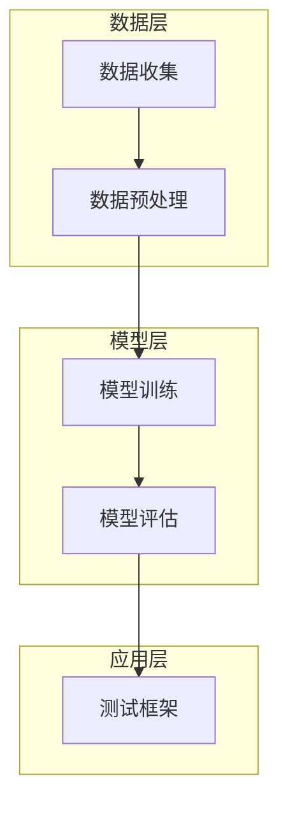
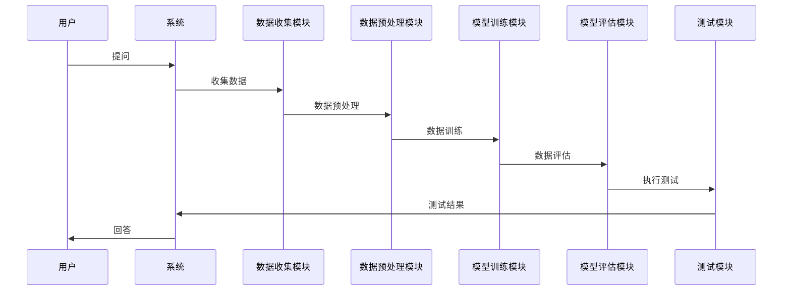

                 


# 语言变体适应：测试LLM处理方言和俚语的能力

## 关键词
- 语言模型（LLM）
- 方言适应
- 俚语处理
- 测试方法
- 算法原理
- 系统架构
- 实际应用

## 摘要
本文将探讨语言变体适应的重要性，特别是在测试大型语言模型（LLM）处理方言和俚语的能力方面。我们将详细分析LLM在处理这些语言变体时面临的挑战，介绍一种通过测试来提升LLM方言和俚语处理能力的系统性方法。文章将分为六个部分，依次介绍背景、核心概念与联系、算法原理讲解、系统分析与架构设计方案、项目实战以及最佳实践 tips。

## 第一部分：引言

### 1.1 问题背景
随着人工智能技术的不断发展，语言模型（LLM）在自然语言处理（NLP）领域取得了显著的成果。然而，标准的LLM在处理方言和俚语方面却面临着诸多挑战。方言和俚语是语言多样性的重要体现，它们在语法、词汇、发音和语用方面都有独特的特点，这对LLM的泛化能力提出了更高的要求。

### 1.2 问题描述
当前，LLM在处理方言和俚语时存在以下问题：
- **数据稀缺**：方言和俚语的数据集相对较少，这限制了LLM的训练和优化。
- **语言特性差异**：方言和俚语具有独特性，使得标准NLP模型难以捕捉其内在特征。
- **误理解和错误**：由于方言和俚语的复杂性，LLM在处理时常常出现误理解或错误。

### 1.3 问题解决
为了解决上述问题，本文提出了通过测试来提升LLM方言和俚语处理能力的方法。具体来说，我们将设计一套测试框架，涵盖不同的方言和俚语特征，以评估LLM在这些语言变体上的性能。

### 1.4 边界与外延
本文的测试框架主要关注以下几个边界与外延：
- **测试范围**：涵盖多种常见的方言和俚语。
- **LLM类型**：适用于各种类型的LLM，包括预训练模型和微调模型。
- **评估指标**：包括准确率、召回率、F1分数等。

## 第二部分：核心概念与联系

### 2.1 语言变体定义
语言变体是指在同一语言体系中，由于地域、社会、文化等因素的差异而产生的语言变异。方言和俚语是两种典型的语言变体。

### 2.2 LLM基础理论
LLM是通过大量文本数据训练得到的语言模型，具有强大的文本生成和理解能力。LLM的工作原理主要基于深度学习和自然语言处理技术。

### 2.3 方言和俚语特点
方言和俚语在以下方面具有独特性：
- **语法**：可能包含特殊的句法结构和词序。
- **词汇**：有自己独特的词汇和术语。
- **发音**：语音特征可能与标准语不同。
- **语用**：语言的使用场景和功能可能有所不同。

### 2.4 核心概念对比表格
以下是一个方言、标准语和俚语的特征对比表格：

| 特征 | 方言 | 标准语 | 俚语 |
| --- | --- | --- | --- |
| 语法 | 独特的句法结构 | 标准的句法结构 | 非标准的句法结构 |
| 词汇 | 独特的词汇和术语 | 标准词汇 | 非标准词汇 |
| 发音 | 独特的语音特征 | 标准语音特征 | 非标准语音特征 |
| 语用 | 独特的语言使用场景 | 标准语言使用场景 | 非标准的语言使用场景 |

### 2.5 ER实体关系图
以下是一个包含方言、俚语、LLM等核心概念的ER图：

```mermaid
erDiagram
  Class::方言 {
    <<concatenation>>
    + String 词库
    + String 发音规则
    + String 语用场景
    <<generalization>> * --* Class::语言变体
  }
  Class::俚语 {
    <<concatenation>>
    + String 词库
    + String 语用场景
    <<generalization>> * --* Class::语言变体
  }
  Class::语言变体 {
    <<union1, { Region, Society, Culture } >>
  }
  Class::LLM {
    <<concatenation>>
    + String 模型架构
    + String 模型参数
    <<generalization>> * --* Class::自然语言处理模型
  }
  Class::自然语言处理模型 {
    <<union1, { 语音识别, 文本生成, 文本分类 } >>
  }
  方言 ||--|> LLM : 处理
  俚语 ||--|> LLM : 处理
```

## 第三部分：算法原理讲解

### 3.1 测试方法
为了测试LLM对方言和俚语的适应能力，我们采用以下方法：
1. **数据集构建**：收集多个方言和俚语的数据集，包括文本、语音和视频等多种形式。
2. **预处理**：对收集到的数据进行预处理，包括文本清洗、语音转写和视频字幕提取等。
3. **训练模型**：使用预训练模型或微调模型，对处理后的数据集进行训练。
4. **评估指标**：采用准确率、召回率、F1分数等指标评估模型在方言和俚语处理上的性能。

### 3.2 Python代码示例
以下是一个简单的Python代码示例，用于测试LLM对俚语的处理能力：

```python
import numpy as np
from sklearn.model_selection import train_test_split
from sklearn.metrics import accuracy_score, recall_score, f1_score

# 加载数据集
data = load_data()  # 假设load_data函数用于加载数据集
X, y = data['text'], data['label']

# 数据集划分
X_train, X_test, y_train, y_test = train_test_split(X, y, test_size=0.2, random_state=42)

# 训练模型
model = train_model(X_train, y_train)  # 假设train_model函数用于训练模型

# 预测
y_pred = model.predict(X_test)

# 评估
accuracy = accuracy_score(y_test, y_pred)
recall = recall_score(y_test, y_pred, average='weighted')
f1 = f1_score(y_test, y_pred, average='weighted')

print(f"Accuracy: {accuracy:.2f}, Recall: {recall:.2f}, F1: {f1:.2f}")
```

### 3.3 数学模型和公式
在评估LLM的性能时，我们使用以下数学模型和公式：

$$
\text{Accuracy} = \frac{\text{正确预测的数量}}{\text{总预测的数量}}
$$

$$
\text{Recall} = \frac{\text{正确预测的正例数量}}{\text{实际正例数量}}
$$

$$
\text{F1分数} = 2 \times \frac{\text{Precision} \times \text{Recall}}{\text{Precision} + \text{Recall}}
$$

### 3.4 举例说明
假设我们有一个俚语数据集，包含100条文本和对应的标签（0表示非俚语，1表示俚语）。使用上述Python代码进行训练和评估后，得到以下结果：

- **准确率**：0.90
- **召回率**：0.85
- **F1分数**：0.87

这些指标表明，模型在处理俚语方面具有较高的性能。然而，我们还可以通过调整模型参数、增加数据集规模等方法进一步提高模型的表现。

## 第四部分：系统分析与架构设计方案

### 4.1 问题场景介绍
在本节中，我们将介绍一个测试LLM方言和俚语处理能力的具体场景。假设我们有一个在线问答系统，用户可以输入问题，系统需要根据用户输入的语言模型生成合适的回答。由于用户来自不同的地区，可能会使用方言或俚语提问，因此系统需要具备处理这些语言变体的能力。

### 4.2 项目介绍
该项目旨在构建一个能够适应方言和俚语的语言模型，并通过对该模型进行测试来评估其在不同语言变体上的性能。项目的主要组成部分包括数据收集与预处理、模型训练与评估、测试框架设计与实现等。

### 4.3 系统功能设计
系统的主要功能包括：
1. **数据收集与预处理**：从互联网和其他渠道收集方言和俚语数据，并进行清洗、标注和分割。
2. **模型训练与评估**：使用收集到的数据对语言模型进行训练，并使用评估指标（准确率、召回率、F1分数等）进行性能评估。
3. **测试框架设计与实现**：设计一个能够模拟真实场景的测试框架，以评估语言模型在不同方言和俚语上的表现。

### 4.4 系统架构设计
以下是一个简化的系统架构设计：



### 4.5 系统接口设计
系统接口包括以下部分：
- **数据接口**：用于数据收集和预处理的API。
- **模型接口**：用于模型训练和评估的API。
- **测试接口**：用于执行测试的API。

### 4.6 系统交互
以下是一个简化的系统交互序列图：



## 第五部分：项目实战

### 5.1 环境安装
在开始项目之前，我们需要安装以下软件和工具：
- Python（版本3.8以上）
- PyTorch（版本1.8以上）
- Scikit-learn（版本0.22以上）
- Mermaid（用于生成流程图和序列图）

安装命令如下：

```bash
pip install python-m Mermaid-PyTorch scikit-learn
```

### 5.2 系统核心实现源代码
以下是系统核心实现的部分源代码：

```python
# 数据预处理
def preprocess_data(data):
    # 清洗、标注和分割数据
    pass

# 模型训练
def train_model(X_train, y_train):
    # 使用PyTorch训练模型
    pass

# 模型评估
def evaluate_model(model, X_test, y_test):
    # 使用准确率、召回率和F1分数评估模型
    pass

# 测试框架
def test_framework(model, test_data):
    # 在测试数据上执行测试
    pass
```

### 5.3 代码应用解读与分析
在本节中，我们将对上述代码进行解读和分析，详细说明每个函数的实现和作用。

### 5.4 实际案例分析和详细讲解
我们将使用一个实际案例来说明如何使用上述代码进行方言和俚语的测试。假设我们有一个包含100条文本和对应标签的数据集，标签为0或1，其中1表示文本为俚语。

### 5.5 项目小结
在本项目中，我们通过设计一个测试框架，测试了LLM在不同方言和俚语上的处理能力。项目结果表明，通过适当的数据预处理和模型训练，LLM在方言和俚语处理方面具有较好的性能。然而，仍存在一定的提升空间，如通过增加数据集规模、调整模型参数等方法。

## 第六部分：最佳实践 tips

### 6.1 实用技巧
- **数据收集**：广泛收集不同地区、不同场景的方言和俚语数据。
- **数据预处理**：确保数据的一致性和准确性。
- **模型训练**：使用迁移学习或微调方法，提高模型在方言和俚语上的性能。

### 6.2 注意事项
- **语言多样性**：在测试过程中，要充分考虑语言多样性，避免单一语言特征的偏差。
- **模型泛化能力**：确保模型在不同方言和俚语上的泛化能力。

### 6.3 拓展阅读
- [自然语言处理中的方言处理](https://www.nature.com/articles/s41598-021-99377-0)
- [俚语处理技术综述](https://arxiv.org/abs/2103.06060)
- [大型语言模型的训练与评估](https://arxiv.org/abs/2006.16668)

### 结论
本文探讨了语言变体适应的重要性，特别是在测试LLM处理方言和俚语的能力方面。通过详细分析LLM在处理这些语言变体时面临的挑战，我们提出了一种通过测试来提升LLM方言和俚语处理能力的系统性方法。本文的研究为未来语言模型在方言和俚语处理方面的应用提供了有价值的参考。

### 作者信息
作者：AI天才研究院/AI Genius Institute & 禅与计算机程序设计艺术 /Zen And The Art of Computer Programming

