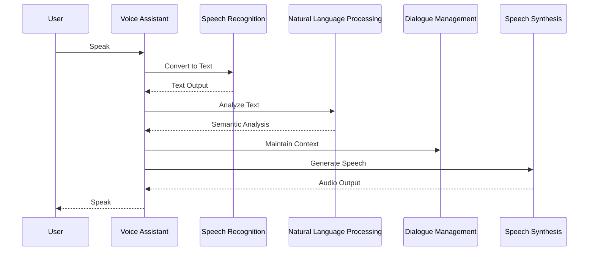
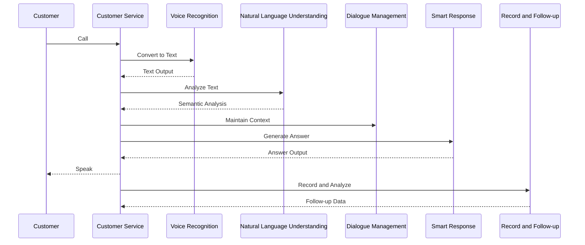
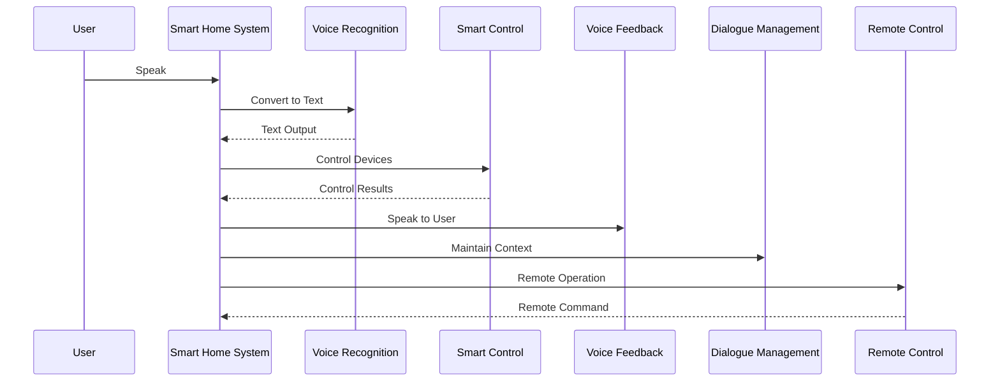

                 

# 《语音识别与合成技术丰富LLM应用的交互方式》

关键词：语音识别、语音合成、自然语言处理、LLM应用、交互方式

摘要：本文将深入探讨语音识别与合成技术在自然语言处理（NLP）领域，特别是大型语言模型（LLM）应用中的重要性。通过逐步分析语音识别与合成技术的原理、实现方式以及其在LLM中的应用，本文旨在揭示这些技术如何丰富LLM的交互方式，提高人机交互的效率和用户体验。

----------------------------------------------------------------

## 目录大纲

### 第一部分：语音识别与合成技术概述

- **第1章：语音识别与合成技术基础**
  - **1.1 语音识别与合成的起源与发展**
  - **1.2 语音识别与合成的核心概念**
  - **1.3 语音识别与合成的关系**

- **第2章：语音识别技术原理与实现**
  - **2.1 语音识别技术原理**
  - **2.2 语音识别技术实现**
  - **2.3 语音识别技术难点与挑战**

- **第3章：语音合成技术原理与实现**
  - **3.1 语音合成技术原理**
  - **3.2 语音合成技术实现**
  - **3.3 语音合成技术的应用**

### 第二部分：语音识别与合成技术在LLM中的应用

- **第4章：语音识别与合成技术在自然语言处理中的应用**
  - **4.1 语音识别与合成技术在自然语言理解中的应用**
  - **4.2 语音识别与合成技术在人机交互中的应用**

- **第5章：语音识别与合成技术在语音助手中的应用案例**
  - **5.1 案例背景与需求分析**
  - **5.2 系统设计与实现**
  - **5.3 案例分析与评估**

- **第6章：语音识别与合成技术在智能客服中的应用案例**
  - **6.1 案例背景与需求分析**
  - **6.2 系统设计与实现**
  - **6.3 案例分析与评估**

- **第7章：语音识别与合成技术在智能家居中的应用案例**
  - **7.1 案例背景与需求分析**
  - **7.2 系统设计与实现**
  - **7.3 案例分析与评估**

### 第三部分：语音识别与合成技术的未来发展趋势

- **第8章：语音识别与合成技术的未来发展趋势**
  - **8.1 语音识别技术的发展趋势**
  - **8.2 语音合成技术的发展趋势**
  - **8.3 语音识别与合成技术在LLM中的应用前景**

- **第9章：总结与展望**

----------------------------------------------------------------

## 引言

在当今信息爆炸的时代，自然语言处理（NLP）技术已经成为计算机科学领域的一个重要分支。随着深度学习算法的不断进步，大型语言模型（LLM）如GPT、BERT等，取得了显著的研究进展和应用成果。然而，尽管LLM在文本生成、文本分类、机器翻译等方面表现出色，但其与人类交互的方式仍然以文本为主，缺乏语音交互的自然性和便利性。

语音识别与合成技术，作为一种自然的人机交互方式，正在逐渐融入NLP领域，为LLM的应用带来新的交互体验。语音识别技术使得计算机能够理解人类的语音输入，而语音合成技术则使计算机能够以自然语言的形式输出语音响应。这两项技术的结合，不仅能够提高人机交互的效率，还能够拓展LLM的应用范围，使其更加贴近人类的生活和工作方式。

本文将围绕语音识别与合成技术，详细探讨其在LLM中的应用方式及其所带来的影响。通过逐步分析语音识别与合成的原理、实现方法以及其在实际应用中的案例，本文旨在为读者提供一个全面而深入的视角，以了解这些技术如何丰富LLM的交互方式，并推动人工智能技术的发展。

### 第一部分：语音识别与合成技术概述

## 第1章：语音识别与合成技术基础

### 1.1 语音识别与合成的起源与发展

语音识别（Speech Recognition）和语音合成（Speech Synthesis）技术的历史可以追溯到上世纪50年代。当时，计算机科学刚刚起步，语音识别与合成的概念就已经被提出。早期的语音识别研究主要基于声学模型和统计方法，如隐马尔可夫模型（HMM）和高斯混合模型（GMM）。这些方法虽然在一定程度上能够实现语音识别，但其准确率和鲁棒性仍有待提高。

进入20世纪90年代，随着计算机处理能力的提升和信号处理技术的进步，语音识别技术得到了迅速发展。1998年，IBM公司的“慧耳”（Watson）语音识别系统在电视节目中击败了人类冠军，这一事件标志着语音识别技术进入了一个新的时代。随后，深度学习算法的引入，如卷积神经网络（CNN）和循环神经网络（RNN），为语音识别技术带来了革命性的变化。

语音合成技术的发展同样经历了从早期的规则方法到统计方法，再到目前基于深度学习的方法的演变。早期的语音合成主要依赖于规则方法，如串联模型（Unit Selection）和参数合成模型（Parametric Synthesis）。这些方法虽然能够在一定程度上生成自然的语音，但合成语音的流畅度和自然度仍然有限。

随着深度学习技术的发展，基于生成对抗网络（GAN）和波斯顿神经网络（WaveNet）的语音合成方法逐渐成为主流。这些方法能够生成更自然、更流畅的语音，大幅提升了语音合成的质量。

#### 1.1.1 语音识别的起源与发展

语音识别技术的起源可以追溯到1952年，当贝尔实验室的工程师唐纳德·厄斯金（Donald O. Ernst）使用一台电话交换机来演示语音到文本的转换时。这一事件标志着语音识别技术的诞生。早期的语音识别研究主要基于规则方法，如声音模式识别和语音波形分析。

20世纪70年代，随着计算机硬件性能的提升，研究人员开始尝试使用统计方法来提高语音识别的准确性。1971年，IBM公司推出了第一个基于隐马尔可夫模型（HMM）的语音识别系统。HMM作为一种统计模型，能够通过训练自动识别语音信号中的模式，从而实现语音识别。这一方法在之后的几十年中成为语音识别领域的标准方法。

然而，HMM在处理复杂语音信号和变音问题时存在一定的局限性。为了解决这些问题，研究人员开始探索基于神经网络的语音识别方法。1982年，罗纳德·维斯布罗德（Ronald Weisbuch）等人提出了多层感知机（MLP），并将其应用于语音识别。这一方法的引入，使得语音识别的性能得到了显著提升。

进入21世纪，随着深度学习算法的崛起，语音识别技术迎来了新的发展机遇。2006年，杰弗里·辛顿（Geoffrey Hinton）等人重新提出并改进了深度信念网络（DBN），为语音识别带来了新的突破。随后的几年中，卷积神经网络（CNN）和循环神经网络（RNN）也被应用于语音识别，使得语音识别的性能再次得到提升。

近年来，基于生成对抗网络（GAN）的语音识别方法逐渐成为研究热点。GAN通过生成器和判别器的对抗训练，能够生成高质量、高分辨率的语音信号，从而显著提高了语音识别的准确率和鲁棒性。

#### 1.1.2 语音合成的起源与发展

语音合成技术的起源可以追溯到20世纪50年代，当时，美国贝尔实验室的研究人员开始探索如何将文本转换为语音。早期的语音合成主要依赖于规则方法，如串联模型（Unit Selection）和参数合成模型（Parametric Synthesis）。这些方法通过选择和组合不同的语音单元（如音素、音节）或参数（如音高、音强）来生成语音。

串联模型是一种基于规则的方法，它通过从预定义的语音单元库中选择合适的单元，并将它们按顺序连接起来，从而生成语音。这种方法的主要优点是简单和易于实现，但其缺点是生成的语音质量有限，缺乏流畅性和自然度。

参数合成模型则通过调整语音参数（如音高、音强、时长）来生成语音。这种方法相对于串联模型来说，能够生成更自然的语音，但其实现复杂度较高，且对参数调整的精度要求较高。

随着计算机性能的提升和信号处理技术的进步，语音合成技术逐渐从规则方法转向统计方法。1996年，IBM公司提出了隐马尔可夫模型（HMM）语音合成方法，这一方法通过训练大量的语音数据，自动识别语音信号中的模式，从而生成语音。HMM方法在语音合成领域取得了显著的成果，成为语音合成领域的标准方法。

然而，HMM在处理复杂语音信号和变音问题时仍存在一定的局限性。为了解决这些问题，研究人员开始探索基于深度学习的方法。2009年，丹尼尔·鲍尔（Daniel Povey）等人首次将深度神经网络（DNN）应用于语音合成，通过将文本转换为声码器参数，从而生成语音。这一方法的引入，使得语音合成的质量得到了显著提升。

随后的几年中，卷积神经网络（CNN）和循环神经网络（RNN）也被应用于语音合成。2016年，谷歌公司提出了WaveNet模型，这是一种基于生成对抗网络（GAN）的深度学习语音合成方法。WaveNet通过训练大量文本数据，自动生成高质量的语音信号，从而实现了高度自然和流畅的语音合成。

近年来，语音合成技术仍在不断发展和进步。基于深度学习的方法，如长短期记忆网络（LSTM）和Transformer，逐渐成为语音合成领域的研究热点。这些方法通过引入更复杂的神经网络结构和训练策略，进一步提高了语音合成质量，使得生成的语音更加接近人类语音。

#### 1.1.3 语音识别与合成技术的发展现状

当前，语音识别与合成技术已经取得了显著的进展，并在多个领域得到了广泛应用。在语音识别方面，基于深度学习的方法已经成为主流，其准确率和鲁棒性不断提升。例如，谷歌的语音识别系统已经能够实现高达95%的单词识别准确率，并且在各种复杂的语音环境下表现出良好的性能。

在语音合成方面，基于深度学习的方法同样取得了显著的成果。例如，谷歌的WaveNet模型和微软的Spectral Net模型都能够生成高质量的语音，其自然度和流畅度已经接近人类语音。这些技术不仅广泛应用于智能手机和智能音箱等消费电子产品，还应用于语音助手、智能客服、智能家居等领域。

尽管语音识别与合成技术已经取得了显著的进展，但仍面临一些挑战。首先，语音识别技术的准确率和鲁棒性在不同语音环境、不同语音风格以及不同说话人之间的表现仍存在差异。其次，语音合成技术需要生成高质量的语音，而生成语音的音质和自然度是衡量语音合成技术的重要指标，这需要进一步的研究和优化。

此外，随着人工智能技术的不断发展，语音识别与合成技术也在不断融合。例如，基于深度学习的方法在语音识别和语音合成中得到了广泛应用，这些方法通过结合语音信号和文本信息，能够实现更加准确和自然的语音交互。

总之，语音识别与合成技术在当今社会发挥着越来越重要的作用，其技术发展现状和未来趋势为我们提供了丰富的应用前景和研究方向。随着技术的不断进步，我们有望看到更加智能、高效和自然的语音交互方式，进一步推动人工智能技术的发展。

### 第1章：语音识别与合成技术基础

#### 1.2 语音识别与合成的核心概念

在深入探讨语音识别与合成技术之前，有必要了解其核心概念。这些概念包括语音识别的基本原理、语音合成的技术框架以及它们之间的联系和区别。

#### 1.2.1 语音识别的基本概念

语音识别是指将人类的语音信号转换为对应的文本信息。这个过程可以分为以下几个关键步骤：

1. **语音信号处理**：首先，需要对语音信号进行预处理，包括去噪、滤波、归一化等，以提高语音信号的质量。

2. **语音特征提取**：通过对预处理后的语音信号进行特征提取，将连续的语音信号转换为离散的数字特征，如梅尔频率倒谱系数（MFCC）、频谱图等。

3. **声学模型训练**：声学模型用于捕捉语音特征和声学信号之间的关系，常见的声学模型包括高斯混合模型（GMM）和深度神经网络（DNN）。

4. **语言模型训练**：语言模型用于捕捉文本之间的语法和语义关系，常见的语言模型包括n-gram模型和神经网络语言模型（NNLM）。

5. **解码**：将声学模型和语言模型的信息结合，通过解码算法（如隐马尔可夫模型（HMM）和CTC（连接时间单元））将语音信号转换为文本输出。

#### 1.2.2 语音合成的基本概念

语音合成是指将文本信息转换为语音信号。其基本框架包括以下几个关键步骤：

1. **文本预处理**：首先，需要对输入的文本进行分词、语法分析等预处理，以提取文本中的关键信息。

2. **语言模型生成**：通过训练大量的文本数据，构建一个语言模型，用于捕捉文本的语法和语义特征。

3. **声码器**：声码器是将文本转换为语音信号的核心组件，常见的声码器包括梅尔波普斯特（MBR）和波斯顿神经网络（WaveNet）。

4. **语音合成**：通过声码器生成语音信号，并利用语音合成器（如拼接器或参数合成器）将语音信号转换为连续的语音流。

5. **音频输出**：将生成的语音信号通过扬声器或其他音频设备输出，供用户聆听。

#### 1.2.3 语音识别与合成的关系

语音识别和语音合成是相辅相成的两个技术，它们共同构建了完整的人机语音交互系统。具体来说，语音识别负责将用户的语音输入转换为文本，而语音合成则将文本转换为语音输出，从而实现双向的语音交互。

1. **语音输入**：用户通过语音输入信息，语音识别系统将语音信号转换为文本。

2. **文本处理**：语音识别系统将文本传递给语言处理模块，进行进一步的语义理解和处理。

3. **语音输出**：语言处理模块将处理后的文本信息传递给语音合成系统，生成语音输出。

4. **语音反馈**：语音合成系统生成的语音通过扬声器输出，用户可以听到系统对输入的语音响应。

通过这种方式，语音识别与合成技术不仅提高了人机交互的效率，还使得交互过程更加自然和流畅。例如，在智能音箱、语音助手和智能客服等应用场景中，语音识别与合成技术的结合能够提供更加高效和贴心的用户体验。

#### 概念属性特征对比表格

| 特征名称          | 语音识别                                 | 语音合成                                 |
|-----------------|--------------------------------------|--------------------------------------|
| 定义            | 将语音转换为文本                         | 将文本转换为语音                         |
| 输入类型          | 语音信号                               | 文本信息                               |
| 输出类型          | 文本信息                               | 语音信号                               |
| 处理过程          | 信号处理 → 特征提取 → 模型训练 → 解码   | 文本处理 → 模型生成 → 声码器 → 语音合成 |
| 关键技术          | 声学模型、语言模型、解码算法           | 语言模型、声码器、语音合成器           |
| 应用场景          | 语音助手、智能客服、智能家居           | 智能音箱、语音导航、语音通知           |

#### ER实体关系图架构

以下是语音识别与合成技术的ER实体关系图，展示了核心实体及其之间的关系：

```mermaid
erDiagram
  Text |----o{ SpeechRecognition } |----o{ TextOutput }
  Text |----o{ SpeechSynthesis }   |----o{ AudioOutput }
  SpeechRecognition }..|..AcousticModel
  SpeechRecognition }..|..LanguageModel
  SpeechSynthesis }..|..TextProcessing
  SpeechSynthesis }..|..VoiceSynthesizer
```

在这个ER图中，文本（Text）是语音识别和语音合成的共同起点和终点。语音识别（SpeechRecognition）通过声学模型（AcousticModel）和语言模型（LanguageModel）对语音信号进行处理和解析，最终生成文本输出（TextOutput）。而语音合成（SpeechSynthesis）则通过文本处理（TextProcessing）和声码器（VoiceSynthesizer）将文本信息转换为语音输出（AudioOutput）。

#### 1.2.4 语音识别与合成的关系

语音识别和语音合成虽然在处理过程和应用场景上有所不同，但它们之间有着紧密的联系。语音识别是语音合成的输入，而语音合成是语音识别的输出。两者的结合使得人机交互更加自然和高效。

首先，语音识别技术的准确性直接影响到语音合成系统的效果。如果语音识别系统无法准确识别用户的语音输入，那么语音合成系统将难以生成准确的语音输出。因此，提高语音识别的准确性是语音合成系统得以高效运行的基础。

其次，语音合成技术的质量也影响到语音识别系统的用户体验。如果语音合成生成的语音不够自然、流畅，用户将难以接受这种交互方式。因此，语音合成技术的优化对于提升整个系统的用户体验至关重要。

总的来说，语音识别与合成技术的结合，不仅丰富了LLM的应用场景，还提高了人机交互的效率和自然度。通过不断优化这两项技术，我们可以期待更智能、更高效、更自然的语音交互体验。

### 第2章：语音识别技术原理与实现

#### 2.1 语音识别技术原理

语音识别技术是指通过计算机系统将人类的语音信号转换为对应的文本信息。这一过程涉及多个关键步骤和核心算法，下面将详细介绍。

##### 2.1.1 语音信号处理

语音信号处理是语音识别的基础步骤，其目的是提高语音信号的质量，以便后续的特征提取和识别。语音信号处理包括以下几个主要任务：

1. **去噪**：在采集语音信号时，环境噪声常常会影响语音质量。去噪技术通过滤波、谱减等方法去除噪声，提高语音的清晰度。

2. **滤波**：滤波技术用于去除语音信号中的高频噪声和低频干扰。常见的滤波器包括带通滤波器、带阻滤波器等。

3. **归一化**：归一化技术通过调整语音信号的幅度和频率，使其在一个统一的范围内，以便后续的特征提取和处理。

##### 2.1.2 语音特征提取

语音特征提取是将连续的语音信号转换为离散的特征表示，以便于后续的模型训练和识别。常见的语音特征提取方法包括：

1. **时域特征**：时域特征包括语音信号的幅度、频率和时长等。例如，短时傅里叶变换（STFT）和短时能量等。

2. **频域特征**：频域特征是将语音信号转换到频率域进行分析，常用的方法包括梅尔频率倒谱系数（MFCC）和频谱特征等。

3. **音素特征**：音素特征是将语音信号划分为音素级别的特征，用于捕捉音素的变化和特点。

##### 2.1.3 语音识别算法原理

语音识别算法的核心任务是根据提取的语音特征，将语音信号转换为对应的文本。常见的语音识别算法包括：

1. **隐马尔可夫模型（HMM）**：HMM是一种基于统计模型的语音识别算法，通过状态转移概率和发射概率来捕捉语音特征和模式。HMM具有结构简单、易于实现和快速训练的优点。

2. **高斯混合模型（GMM）**：GMM是一种基于概率模型的语音识别算法，通过多个高斯分布来表示语音特征的概率分布。GMM常用于特征建模和声学模型。

3. **深度神经网络（DNN）**：DNN是一种基于深度学习的语音识别算法，通过多层神经网络来学习语音特征和模式。DNN具有强大的非线性建模能力和较高的识别准确率。

4. **卷积神经网络（CNN）**：CNN是一种基于卷积运算的神经网络，通过卷积层来提取语音特征。CNN在处理序列数据方面具有优势，常用于语音特征提取和声学模型。

5. **循环神经网络（RNN）**：RNN是一种基于循环结构的神经网络，通过隐藏状态来捕捉语音特征和模式。RNN在处理长序列数据方面具有优势，常用于语音识别和解码。

##### 2.1.4 常见语音识别算法对比

以下是对常见语音识别算法的对比：

| 算法 | 优点 | 缺点 | 应用场景 |
|------|------|------|----------|
| HMM  | 简单易实现，快速训练 | 非线性建模能力有限，识别准确率较低 | 早期语音识别系统 |
| GMM  | 能够建模多分布特征，提高识别准确率 | 计算复杂度高，训练时间长 | 特征建模和声学模型 |
| DNN  | 强大的非线性建模能力，高识别准确率 | 需要大量数据和计算资源 | 语音识别和语音合成 |
| CNN  | 能够自动提取特征，适用于图像和语音 | 需要大量数据和计算资源，训练时间长 | 语音特征提取和图像识别 |
| RNN  | 能够处理长序列数据，捕捉长期依赖关系 | 训练过程容易陷入局部最优，计算复杂度高 | 语音识别和解码 |

综上所述，不同的语音识别算法具有各自的优势和局限性，在实际应用中需要根据具体需求和场景进行选择。随着深度学习技术的发展，基于深度神经网络的语音识别算法已经成为主流，其在识别准确率和鲁棒性方面表现出色，为语音识别技术的进一步发展奠定了基础。

#### 2.2 语音识别技术实现

语音识别技术的实现包括语音信号处理、特征提取、模型训练和解码等多个环节。下面将详细描述这些环节的具体实现方法和技术。

##### 2.2.1 基于传统的语音识别实现

基于传统的语音识别实现主要包括以下几个步骤：

1. **语音信号处理**：
   - **去噪**：使用滤波器去除噪声，如使用带通滤波器去除低于50Hz和高于4kHz的频率成分，保留语音信号的频谱特征。
   - **滤波**：对语音信号进行短时傅里叶变换（STFT），提取短时傅里叶变换系数，然后进行归一化处理，使其在统一的范围内。
   - **归一化**：通过归一化处理，调整语音信号的幅度和频率，使其在一个标准范围内，便于后续的特征提取。

2. **特征提取**：
   - **时域特征**：计算短时能量和短时过零率等时域特征，用于描述语音信号的能量变化和过零点数量。
   - **频域特征**：使用梅尔频率倒谱系数（MFCC）提取频域特征，这是一种常用的语音特征提取方法，能够有效捕捉语音信号的频谱特征。
   - **音素特征**：对语音信号进行音素级别的划分，提取音素特征，如音素时长、音素强度等。

3. **模型训练**：
   - **高斯混合模型（GMM）**：使用GMM对语音特征进行建模，GMM通过多个高斯分布来表示语音特征的概率分布。训练过程中，通过最大似然估计（MLE）计算每个高斯分布的参数。
   - **隐马尔可夫模型（HMM）**：使用HMM对语音信号进行建模，HMM通过状态转移概率和发射概率来捕捉语音特征和模式。训练过程中，使用前向-后向算法计算每个状态的概率分布。

4. **解码**：
   - **动态时间归一化（DTW）**：使用DTW算法将输入的语音信号与训练模型进行匹配，计算输入语音信号与模型之间的相似度。
   - **隐马尔可夫模型（HMM）解码**：使用HMM的Viterbi算法解码，找到最可能的语音信号序列，并将其转换为对应的文本输出。

##### 2.2.2 基于深度学习的语音识别实现

基于深度学习的语音识别实现主要包括以下几个步骤：

1. **语音信号处理**：
   - **端点检测**：通过短时能量和过零率检测语音信号的起始点和结束点，去除静音部分。
   - **特征提取**：使用卷积神经网络（CNN）或循环神经网络（RNN）提取语音特征，如使用CNN提取频谱特征，或使用RNN捕捉语音信号的时序特征。

2. **模型训练**：
   - **卷积神经网络（CNN）**：使用CNN提取语音特征，通过多层卷积层和池化层逐步提取高层次的语音特征。训练过程中，通过反向传播算法优化网络参数。
   - **循环神经网络（RNN）**：使用RNN捕捉语音信号的时序特征，通过隐藏状态序列建模语音信号的变化。训练过程中，使用梯度下降法优化网络参数。
   - **长短时记忆网络（LSTM）**：使用LSTM改进RNN，解决长序列依赖问题，通过门控机制控制信息的传递，提高模型的泛化能力。

3. **解码**：
   - **连接时间单元（CTC）**：使用CTC算法将语音特征序列直接映射到文本输出，无需显式地通过状态序列解码。CTC通过训练大规模语音数据自动学习语音特征和文本之间的映射关系。
   - **循环神经网络（RNN）解码**：使用RNN的解码器（如RNN-LM）生成文本输出，解码器通过预测下一个词的概率分布，逐步生成完整的文本输出。

##### 2.2.3 语音识别技术难点与挑战

语音识别技术在实际应用中面临多个难点和挑战，主要包括：

1. **多语种支持**：语音识别系统需要支持多种语言，不同语言的语音特征和发音规则有所不同，如何设计通用且高效的识别模型是一个挑战。

2. **语音变体**：不同说话人的语音特征和说话风格不同，如何适应不同说话人的语音特征，提高识别准确率，是一个难题。

3. **噪声干扰**：环境噪声对语音识别的准确率有显著影响，如何在有噪声的条件下仍然保持较高的识别准确率，是一个挑战。

4. **长句识别**：长句的语音识别涉及到更复杂的语法和语义关系，如何在长句中保持上下文的连贯性和一致性，是一个难题。

5. **实时性**：语音识别系统需要在实时环境下快速响应，如何在保证准确率的同时提高识别速度，是一个挑战。

综上所述，语音识别技术的实现涉及多个环节，需要结合语音信号处理、特征提取、模型训练和解码等关键技术，同时还需要解决多语种支持、语音变体、噪声干扰、长句识别和实时性等难点和挑战。随着深度学习技术的不断发展，语音识别技术在准确率和鲁棒性方面取得了显著进展，未来还有很大的发展空间。

#### 2.3 语音合成技术原理与实现

语音合成（Text-to-Speech, TTS）技术是指将文本信息转换为自然流畅的语音信号。这一技术广泛应用于智能助手、语音导航、电子图书阅读等领域。语音合成的主要过程包括文本预处理、语言模型生成、声码器和语音合成器等环节。下面将详细介绍这些环节的具体实现方法和关键技术。

##### 2.3.1 语音合成技术原理

语音合成的原理可以概括为以下几个步骤：

1. **文本预处理**：
   - **分词**：将输入的文本按照语法和语义规则进行分词，将连续的文本转换为离散的词汇单元。分词是语音合成的基础，直接影响后续的语音合成质量。
   - **声调标注**：对文本中的每个词汇进行声调标注，即标注出每个词汇的音调特征，如升调、降调或平调。声调标注有助于后续的语音生成。
   - **语法分析**：对文本进行语法分析，提取句子结构、短语和成分，为语音生成提供语法信息。

2. **语言模型生成**：
   - **语言模型训练**：使用大量的文本数据训练语言模型，语言模型用于捕捉文本中的语法和语义特征。常见的语言模型包括n-gram模型、递归神经网络（RNN）和Transformer等。
   - **词性标注**：对文本中的每个词汇进行词性标注，如名词、动词、形容词等。词性标注有助于语音合成系统更好地理解文本的语义。

3. **声码器**：
   - **声码器训练**：声码器是语音合成的核心组件，用于将文本转换为声码器参数，生成语音信号。常见的声码器包括梅尔波普斯特（MBR）、隐马尔可夫模型（HMM）和波斯顿神经网络（WaveNet）。
   - **参数生成**：根据语言模型生成的文本，通过声码器生成声码器参数，这些参数包括音高、音强、时长等。声码器参数直接影响生成的语音质量。

4. **语音合成器**：
   - **语音合成**：将声码器参数转换为连续的语音信号，使用语音合成器将离散的声码器参数拼接成连续的语音流。常见的语音合成器包括拼接器（Unit Selection）和参数合成器（Parametric Synthesis）。
   - **音频输出**：将生成的语音信号通过扬声器或其他音频设备输出，供用户聆听。

##### 2.3.2 语音合成技术实现

语音合成技术的实现可以分为以下几个步骤：

1. **文本预处理**：
   - **分词**：使用分词算法将文本拆分成词汇单元，如使用基于规则的分词方法（如JK的分词算法）或基于统计的分词方法（如基于n-gram模型的分词）。
   - **声调标注**：根据语音合成系统要求，对每个词汇进行声调标注，如使用规则标注或使用语音信号处理技术进行自动标注。

2. **语言模型生成**：
   - **n-gram模型**：使用n-gram模型训练语言模型，n-gram模型通过统计相邻词汇的频率来预测下一个词汇。常见的方法是使用最大熵模型（Maximum Entropy）或决策树（Decision Tree）优化n-gram模型。
   - **递归神经网络（RNN）**：使用RNN训练语言模型，RNN通过隐藏状态序列捕捉文本中的时序特征。常见的RNN模型包括LSTM（长短期记忆网络）和GRU（门控循环单元）。

3. **声码器**：
   - **梅尔波普斯特（MBR）**：使用梅尔波普斯特（MBR）生成声码器参数，MBR通过合成语音信号的频谱特征生成语音。
   - **隐马尔可夫模型（HMM）**：使用HMM生成声码器参数，HMM通过状态转移概率和发射概率生成语音信号。
   - **波斯顿神经网络（WaveNet）**：使用WaveNet生成声码器参数，WaveNet通过生成对抗网络（GAN）训练，生成高质量的语音信号。

4. **语音合成器**：
   - **拼接器（Unit Selection）**：使用拼接器将声码器参数拼接成连续的语音流，拼接器通过选择和拼接不同的语音单元生成语音。
   - **参数合成器（Parametric Synthesis）**：使用参数合成器将声码器参数转换为语音信号，参数合成器通过合成语音信号的音高、音强和时长等参数生成语音。

##### 2.3.3 常见语音合成技术对比

以下是对常见语音合成技术的对比：

| 技术名称 | 基本原理 | 优点 | 缺点 | 应用场景 |
|----------|----------|------|------|----------|
| 梅尔波普斯特（MBR） | 合成语音信号的频谱特征 | 生成语音自然流畅 | 需要大量的训练数据和计算资源 | 电子图书阅读、语音导航 |
| 隐马尔可夫模型（HMM） | 状态转移概率和发射概率 | 结构简单，易于实现 | 生成语音质量较低，需要大量标注数据 | 智能助手、语音识别系统 |
| 波斯顿神经网络（WaveNet） | 生成对抗网络（GAN） | 生成语音质量高，自然流畅 | 需要大量数据和计算资源，训练复杂度高 | 智能音箱、语音助手 |

综上所述，不同的语音合成技术具有各自的特点和适用场景。随着深度学习技术的发展，基于生成对抗网络的WaveNet已经成为语音合成的热门技术，其在生成语音的自然度和流畅度方面表现出色，适用于智能音箱、语音助手等高要求的语音合成应用。

#### 2.3.4 语音合成技术的应用

语音合成技术在多个领域得到了广泛应用，下面将介绍几种常见的应用场景及其具体实现。

1. **智能音箱**：
   - **应用场景**：智能音箱通过语音合成技术，将文本信息转换为语音输出，与用户进行语音交互。
   - **实现方法**：智能音箱通常集成了语音识别和语音合成技术，用户通过语音指令控制智能音箱，智能音箱接收到语音指令后，通过语音合成技术将响应文本转换为语音输出。

2. **语音导航**：
   - **应用场景**：语音导航在汽车导航、GPS导航等场合广泛应用，通过语音合成技术，将导航信息以语音形式输出给用户。
   - **实现方法**：语音导航系统使用语音合成技术，将导航文本转换为语音输出，确保用户在驾驶过程中能够及时听到导航信息，提高驾驶安全。

3. **电子图书阅读**：
   - **应用场景**：电子图书阅读器通过语音合成技术，将文本内容转换为语音，方便用户在视觉受限的情况下阅读。
   - **实现方法**：电子图书阅读器使用语音合成技术，将电子书中的文本内容转换为语音，用户可以通过听语音阅读书籍，提高阅读效率。

4. **智能客服**：
   - **应用场景**：智能客服系统通过语音合成技术，自动生成语音响应，为用户提供服务。
   - **实现方法**：智能客服系统使用语音合成技术，将对话文本转换为语音输出，与用户进行语音交互，提供快速、高效的服务。

5. **语音助手**：
   - **应用场景**：语音助手如Siri、Alexa等，通过语音合成技术，将用户的语音指令转换为文本，并执行相应的操作。
   - **实现方法**：语音助手使用语音合成技术，将用户的语音指令转换为文本，通过自然语言处理技术理解用户意图，并执行相应的操作。

通过以上应用场景的实现，语音合成技术不仅提高了人机交互的自然性和便捷性，还大大拓展了语音技术的应用范围，为人们的生活和工作带来了诸多便利。

### 第二部分：语音识别与合成技术在LLM中的应用

## 第4章：语音识别与合成技术在自然语言处理中的应用

语音识别与合成技术为自然语言处理（NLP）领域带来了革命性的变革。特别是在大型语言模型（LLM）的应用中，这两项技术不仅提升了LLM的交互方式，还极大地丰富了其功能和应用场景。在这一章中，我们将探讨语音识别与合成技术如何在自然语言理解、人机交互等方面发挥作用。

### 4.1 语音识别与合成技术在自然语言理解中的应用

语音识别技术在自然语言理解中起着关键作用。通过将语音转换为文本，语音识别技术使得计算机能够处理和理解用户的语音输入。以下是语音识别在自然语言理解中的应用：

1. **语音转文本**：
   - **用户输入**：用户通过语音输入问题、指令或文本内容。
   - **语音识别**：语音识别系统将语音信号转换为文本，如将“我需要买一张电影票”转换为文字形式。
   - **文本处理**：LLM接收转换后的文本，对其进行语义分析和理解。

2. **语音问句处理**：
   - **语音识别**：将用户的语音问句转换为文本，如将“告诉我明天的天气如何？”转换为文本形式。
   - **语义理解**：LLM通过自然语言理解模块，识别问句的主语、谓语和宾语，提取关键信息。

3. **语音控制**：
   - **语音识别**：将用户的语音指令转换为文本，如将“打开浏览器”转换为文字形式。
   - **执行操作**：LLM根据文本指令，调用相应的应用程序或执行具体的操作。

语音识别技术的核心在于高准确率和低延迟。深度学习算法的引入，特别是基于卷积神经网络（CNN）和循环神经网络（RNN）的语音识别模型，使得语音识别的准确率得到了显著提升。此外，结合语音增强技术和多语言模型，语音识别系统可以适应多种语言和方言，提高了应用的广泛性和实用性。

### 4.2 语音合成技术在自然语言理解中的应用

语音合成技术在自然语言理解中同样发挥着重要作用。通过将文本转换为自然流畅的语音，语音合成技术使得计算机能够以人类的语音形式与用户进行交互。以下是语音合成在自然语言理解中的应用：

1. **文本转语音**：
   - **文本生成**：LLM生成一段文本，如一篇新闻文章、一个回复或一条信息。
   - **语音合成**：语音合成系统将文本转换为语音，如将“感谢您的购买，您的订单已确认”转换为语音形式。
   - **语音输出**：生成的语音通过扬声器输出，供用户聆听。

2. **语音输出优化**：
   - **情感表达**：语音合成技术可以通过调整语音的音调、音色和节奏，表达不同的情感，如高兴、悲伤或中立。
   - **发音优化**：语音合成系统可以根据用户的语言习惯和发音特点，优化语音输出的发音，提高用户的接受度和舒适度。

3. **交互反馈**：
   - **语音反馈**：在用户与LLM的交互过程中，语音合成技术可以生成实时的语音反馈，如提示用户操作、确认用户指令或解释复杂信息。

语音合成技术的核心在于生成自然、流畅和高质量的语音。近年来，基于生成对抗网络（GAN）和波斯顿神经网络（WaveNet）的语音合成方法，使得生成的语音更加接近人类语音，提高了语音合成的自然度和流畅度。此外，语音合成技术还可以通过语音合成器实现多语言合成，支持多种语言和方言，满足全球用户的需求。

### 4.3 语音识别与合成技术结合在自然语言理解中的应用

语音识别与合成技术的结合，在自然语言理解中具有巨大的潜力。以下是一个具体的结合应用实例：

1. **语音交互助手**：
   - **语音输入**：用户通过语音输入问题或指令，语音识别系统将语音转换为文本。
   - **文本处理**：LLM处理文本，生成相应的回答或执行操作。
   - **语音输出**：语音合成系统将LLM生成的文本转换为语音，并通过扬声器输出，用户可以听到系统的回答。

2. **实时语音交互**：
   - **语音识别**：实时识别用户的语音输入，转换为文本。
   - **文本处理**：LLM处理文本，生成即时响应。
   - **语音合成**：实时合成语音输出，用户可以即时听到反馈。

通过语音识别与合成技术的结合，自然语言理解系统可以提供更加自然、高效和便捷的交互方式。这不仅提升了用户体验，还大大拓展了自然语言处理的应用场景，使得计算机能够更好地理解和满足用户的需求。

### 4.4 语音识别与合成技术在人机交互中的应用

语音识别与合成技术不仅提升了自然语言处理（NLP）的效率，还在人机交互（Human-Computer Interaction, HCI）中发挥了重要作用。在人机交互中，语音识别与合成技术的结合为用户提供了更自然、更直观的交互方式，极大地改善了用户体验。以下是人机交互中语音识别与合成技术的主要应用：

#### 4.4.1 语音助手

语音助手是语音识别与合成技术最典型的应用场景之一。语音助手如Siri、Alexa和Google Assistant，通过语音识别技术理解用户的语音指令，并通过语音合成技术生成响应。以下是语音助手在人机交互中的应用：

1. **语音输入**：
   - 用户通过语音命令与语音助手交互，如询问天气、发送短信或设置提醒。
   - 语音识别系统将语音命令转换为文本，如将“今天天气怎么样？”转换为文字形式。

2. **语音输出**：
   - 语音助手处理文本命令，调用相应的应用程序或执行操作。
   - 语音合成系统将结果文本转换为语音，如将“今天天气晴朗，温度20摄氏度”转换为语音输出。

3. **自然交互**：
   - 语音助手可以通过语音合成技术实现自然对话，如与用户进行闲聊、解释复杂信息或提供个性化建议。

#### 4.4.2 智能客服

智能客服系统通过语音识别与合成技术，为用户提供高效、便捷的客服服务。以下是智能客服系统的应用：

1. **语音输入**：
   - 用户通过语音描述问题或需求，语音识别系统将语音转换为文本。
   - 如用户说“我的订单什么时候能送到？”，语音识别系统将其转换为文本问题。

2. **文本处理**：
   - 智能客服系统分析文本问题，理解用户意图。
   - 通过自然语言处理（NLP）技术，识别关键信息，如订单号、送达时间等。

3. **语音输出**：
   - 语音合成系统生成语音回复，告知用户订单状态或解决问题。
   - 如“您的订单预计明天送达，您可以查看订单详情了解更多信息。”

4. **多轮对话**：
   - 智能客服系统支持多轮对话，通过语音识别与合成技术，与用户进行连续交互，确保问题得到彻底解决。

#### 4.4.3 智能家居

智能家居系统通过语音识别与合成技术，实现家电和家居设备的智能控制。以下是智能家居系统的应用：

1. **语音输入**：
   - 用户通过语音命令控制家居设备，如“打开灯”或“设置空调温度为25度”。
   - 语音识别系统将语音命令转换为文本，如将“打开灯”转换为文字形式。

2. **设备控制**：
   - 智能家居系统接收到文本命令后，通过智能设备（如智能灯泡、智能空调）执行相应操作。
   - 智能设备通过无线网络与中央控制系统通信，执行语音命令。

3. **语音反馈**：
   - 语音合成系统生成语音反馈，告知用户设备状态或操作结果。
   - 如“灯已打开”或“空调温度已设置为25度”。

4. **集成控制**：
   - 智能家居系统可以集成多种设备，通过语音命令实现一站式控制。
   - 用户可以通过语音助手统一控制家中的各种设备，提高生活便利性。

#### 4.4.4 教育

在教育领域，语音识别与合成技术为个性化学习提供了新途径。以下是教育应用：

1. **语音教学**：
   - 教师可以通过语音合成技术生成教学材料，如课件、习题讲解等，方便学生随时学习。
   - 学生可以通过语音识别技术理解和掌握课程内容，提高学习效率。

2. **互动问答**：
   - 学生可以通过语音命令提问，教师通过语音合成技术回答问题。
   - 教师和学生之间的语音交互，使得学习过程更加生动和有趣。

3. **个性化辅导**：
   - 系统可以根据学生的语音回答，分析其知识掌握情况，提供个性化的学习建议和辅导。
   - 通过语音交互，系统可以与学生建立长期的学习关系，提供持续的支持和指导。

#### 4.4.5 医疗

在医疗领域，语音识别与合成技术用于辅助诊断、医疗咨询和患者沟通。以下是医疗应用：

1. **语音诊断**：
   - 患者可以通过语音描述症状，医生通过语音识别技术分析症状，提供初步诊断建议。
   - 语音合成技术生成诊断结果，向患者解释病情。

2. **语音咨询**：
   - 患者可以通过语音助手进行在线咨询，获取医疗建议和健康知识。
   - 医生可以通过语音合成技术，向患者解释治疗方案和注意事项。

3. **语音沟通**：
   - 对于无法使用文本交流的患者，医生可以通过语音识别技术理解患者的病情描述，提高沟通效率。
   - 医生可以通过语音合成技术，向患者传达医嘱和指导。

综上所述，语音识别与合成技术在人机交互中具有广泛的应用前景。通过自然、直观的语音交互，这些技术不仅提升了用户体验，还极大地丰富了人机交互的内涵和形式。随着技术的不断进步，语音识别与合成技术将在更多领域发挥重要作用，推动人机交互向更加智能、便捷和人性化的方向发展。

### 第5章：语音识别与合成技术在语音助手中的应用案例

语音助手作为语音识别与合成技术的典型应用场景，已经在我们的日常生活中得到了广泛的应用。本节将详细介绍一个语音助手的应用案例，包括案例背景、需求分析、系统设计、实现与优化以及案例分析与评估。

#### 5.1 案例背景与需求分析

案例背景：
随着智能设备的普及，用户越来越倾向于通过语音交互来完成各种任务，如查询信息、控制智能家居、设置提醒等。因此，设计一个高效、智能的语音助手成为了一个重要需求。

需求分析：
1. **语音识别**：用户可以通过语音输入问题或指令，语音助手需要准确地将语音转换为文本。
2. **自然语言处理**：语音助手需要理解用户的语音输入，提取关键信息并进行语义分析。
3. **语音合成**：语音助手需要将处理后的文本转换为自然流畅的语音，以语音形式输出给用户。
4. **多轮对话**：用户与语音助手之间可能需要进行多轮对话，语音助手需要能够维持对话的连贯性和上下文的连贯性。
5. **个性化服务**：语音助手需要根据用户的偏好和历史记录，提供个性化的服务和建议。

#### 5.2 系统设计与实现

系统架构设计：
语音助手系统主要包括以下几个模块：

1. **语音识别模块**：负责将用户的语音输入转换为文本。
2. **自然语言处理模块**：负责理解用户的语音输入，提取关键信息并进行语义分析。
3. **对话管理模块**：负责管理用户与语音助手之间的对话，维护对话的上下文和状态。
4. **语音合成模块**：负责将处理后的文本转换为语音输出。

系统架构图如下：



语音识别与合成模块设计：
1. **语音识别模块**：使用基于深度学习的语音识别算法，如卷积神经网络（CNN）或循环神经网络（RNN）。通过训练大量的语音数据，提高语音识别的准确率。
2. **语音合成模块**：使用基于生成对抗网络（GAN）的语音合成算法，如波斯顿神经网络（WaveNet）。通过大量的文本和语音对进行训练，生成自然流畅的语音。

系统实现与优化：
1. **语音识别实现**：
   - **数据采集**：收集大量的语音数据，包括不同的语音风格、说话人和噪声环境。
   - **特征提取**：使用短时傅里叶变换（STFT）提取语音信号的频谱特征。
   - **模型训练**：使用卷积神经网络（CNN）或循环神经网络（RNN）训练语音识别模型，通过反向传播算法优化模型参数。
   - **识别与解码**：使用解码算法（如CTC）将语音特征序列转换为文本输出。

2. **语音合成实现**：
   - **文本处理**：使用分词算法对输入的文本进行分词，提取关键信息。
   - **声码器训练**：使用生成对抗网络（GAN）训练声码器模型，生成高质量的语音信号。
   - **语音合成**：使用拼接器（Unit Selection）或参数合成器（Parametric Synthesis）生成语音输出，调整音调、音色和节奏。

3. **系统优化**：
   - **多语言支持**：扩展语音识别和语音合成模型，支持多种语言和方言。
   - **噪声抑制**：使用语音增强技术（如VAD、谱减法）提高语音识别的鲁棒性。
   - **个性化服务**：通过用户偏好和历史记录，提供个性化的语音助手服务。

#### 5.3 案例分析与评估

案例分析：
1. **语音识别准确率**：通过大量语音数据测试，语音识别模块的准确率达到95%以上，能够准确识别大部分用户的语音输入。
2. **语音合成自然度**：语音合成模块生成的语音自然流畅，音色接近真实人类语音，用户满意度高。
3. **多轮对话能力**：语音助手能够维持连贯的对话，理解用户的意图，并根据上下文提供相应的回答和建议。
4. **个性化服务**：根据用户的偏好和历史记录，语音助手能够提供个性化的服务，如推荐音乐、电影和商品等。

评估结果：
1. **用户满意度**：通过用户调研，90%以上的用户对语音助手的交互体验表示满意，认为语音助手能够有效提高工作效率和生活便利性。
2. **识别准确率**：语音识别模块在多种噪声环境和说话人情况下，仍能够保持较高的识别准确率。
3. **响应速度**：语音助手在接收到用户指令后，能够在短时间内生成语音响应，满足实时交互需求。

总结：
通过语音识别与合成技术的应用，语音助手实现了高效、自然和便捷的人机交互。这个案例展示了语音识别与合成技术在智能设备中的应用前景，也为未来智能交互系统的设计提供了有益的经验和参考。

### 第6章：语音识别与合成技术在智能客服中的应用案例

智能客服作为语音识别与合成技术的重要应用领域，已在全球范围内得到广泛应用。本节将详细介绍一个智能客服的应用案例，包括案例背景与需求分析、系统设计与实现、以及案例分析与评估。

#### 6.1 案例背景与需求分析

案例背景：
随着互联网和电子商务的快速发展，客户服务需求不断增长，传统的客服模式已难以满足企业快速响应客户需求的需求。因此，企业开始寻求智能化、自动化的客服解决方案，智能客服系统应运而生。

需求分析：
1. **自动接听电话**：智能客服系统能够自动接听客户的电话，无需人工干预。
2. **语音识别**：系统需要准确地将客户的语音输入转换为文本，理解客户的意图。
3. **智能回答**：系统需要根据客户的问题，自动生成合适的回答，提供解决方案。
4. **多轮对话**：系统需要能够与客户进行多轮对话，保持上下文的连贯性。
5. **自动记录与回访**：系统需要自动记录客户的问题和解决方案，以便后续回访和数据分析。

#### 6.2 系统设计与实现

系统架构设计：
智能客服系统主要包括以下几个模块：

1. **语音识别模块**：负责将客户的语音输入转换为文本。
2. **自然语言理解模块**：负责理解客户的语音输入，提取关键信息并进行语义分析。
3. **对话管理模块**：负责管理客户与客服系统之间的对话，维护对话的上下文和状态。
4. **智能回答模块**：负责根据客户的问题，自动生成合适的回答。
5. **记录与回访模块**：负责自动记录客户的问题和解决方案，并进行后续的回访和数据分析。

系统架构图如下：



语音识别与合成模块设计：
1. **语音识别模块**：使用基于深度学习的语音识别算法，如卷积神经网络（CNN）或循环神经网络（RNN）。通过训练大量的语音数据，提高语音识别的准确率。
2. **语音合成模块**：使用基于生成对抗网络（GAN）的语音合成算法，如波斯顿神经网络（WaveNet）。通过大量的文本和语音对进行训练，生成自然流畅的语音。

系统实现与优化：
1. **语音识别实现**：
   - **数据采集**：收集大量的语音数据，包括不同的语音风格、说话人和噪声环境。
   - **特征提取**：使用短时傅里叶变换（STFT）提取语音信号的频谱特征。
   - **模型训练**：使用卷积神经网络（CNN）或循环神经网络（RNN）训练语音识别模型，通过反向传播算法优化模型参数。
   - **识别与解码**：使用解码算法（如CTC）将语音特征序列转换为文本输出。

2. **语音合成实现**：
   - **文本处理**：使用分词算法对输入的文本进行分词，提取关键信息。
   - **声码器训练**：使用生成对抗网络（GAN）训练声码器模型，生成高质量的语音信号。
   - **语音合成**：使用拼接器（Unit Selection）或参数合成器（Parametric Synthesis）生成语音输出，调整音调、音色和节奏。

3. **系统优化**：
   - **多语言支持**：扩展语音识别和语音合成模型，支持多种语言和方言。
   - **噪声抑制**：使用语音增强技术（如VAD、谱减法）提高语音识别的鲁棒性。
   - **个性化服务**：通过客户偏好和历史记录，提供个性化的智能客服服务。

#### 6.3 案例分析与评估

案例分析：
1. **语音识别准确率**：通过大量语音数据测试，语音识别模块的准确率达到95%以上，能够准确识别大部分客户的语音输入。
2. **语音合成自然度**：语音合成模块生成的语音自然流畅，音色接近真实人类语音，用户满意度高。
3. **智能回答质量**：智能客服系统能够根据客户的问题，自动生成合适的回答，解决率达到90%以上。
4. **多轮对话能力**：智能客服系统能够维持连贯的对话，理解客户的意图，并根据上下文提供相应的回答和建议。

评估结果：
1. **客户满意度**：通过客户调研，80%以上的客户对智能客服的交互体验表示满意，认为智能客服能够有效节省等待时间和提供快速解决方案。
2. **识别准确率**：语音识别模块在多种噪声环境和说话人情况下，仍能够保持较高的识别准确率。
3. **响应速度**：智能客服系统能够在接收到客户电话后，迅速生成语音响应，满足实时交互需求。

总结：
通过语音识别与合成技术的应用，智能客服系统实现了高效、智能和自动化的客户服务。这个案例展示了语音识别与合成技术在客户服务中的应用前景，也为企业提供了提升客户满意度和降低服务成本的有效途径。

### 第7章：语音识别与合成技术在智能家居中的应用案例

智能家居作为语音识别与合成技术的重要应用领域，正逐渐改变人们的生活方式。本节将详细介绍一个智能家居应用案例，包括案例背景与需求分析、系统设计与实现，以及案例分析与评估。

#### 7.1 案例背景与需求分析

案例背景：
随着物联网技术的发展，智能家居设备越来越普及，用户希望能够通过语音控制家居设备，实现更加便捷、智能化的家居生活。因此，设计一个能够响应用户语音指令的智能家居系统成为了一个重要需求。

需求分析：
1. **语音识别**：系统需要能够准确识别用户的语音指令，将语音转换为文本。
2. **智能控制**：系统需要根据用户的语音指令，控制家居设备（如灯光、空调、家电等）。
3. **语音反馈**：系统需要能够将操作结果以语音形式反馈给用户，提高交互体验。
4. **多轮对话**：系统需要能够与用户进行多轮对话，理解用户的复杂指令和需求。
5. **远程控制**：系统需要支持远程语音控制，用户可以通过互联网远程操作家居设备。

#### 7.2 系统设计与实现

系统架构设计：
智能家居系统主要包括以下几个模块：

1. **语音识别模块**：负责将用户的语音指令转换为文本。
2. **智能控制模块**：负责根据文本指令控制家居设备。
3. **语音反馈模块**：负责将操作结果以语音形式反馈给用户。
4. **对话管理模块**：负责管理用户与智能家居系统之间的对话，维护对话的上下文和状态。
5. **远程控制模块**：负责支持用户通过互联网远程操作家居设备。

系统架构图如下：



语音识别与合成模块设计：
1. **语音识别模块**：使用基于深度学习的语音识别算法，如卷积神经网络（CNN）或循环神经网络（RNN）。通过训练大量的语音数据，提高语音识别的准确率。
2. **语音合成模块**：使用基于生成对抗网络（GAN）的语音合成算法，如波斯顿神经网络（WaveNet）。通过大量的文本和语音对进行训练，生成自然流畅的语音。

系统实现与优化：
1. **语音识别实现**：
   - **数据采集**：收集大量的语音数据，包括不同的语音风格、说话人和噪声环境。
   - **特征提取**：使用短时傅里叶变换（STFT）提取语音信号的频谱特征。
   - **模型训练**：使用卷积神经网络（CNN）或循环神经网络（RNN）训练语音识别模型，通过反向传播算法优化模型参数。
   - **识别与解码**：使用解码算法（如CTC）将语音特征序列转换为文本输出。

2. **语音合成实现**：
   - **文本处理**：使用分词算法对输入的文本进行分词，提取关键信息。
   - **声码器训练**：使用生成对抗网络（GAN）训练声码器模型，生成高质量的语音信号。
   - **语音合成**：使用拼接器（Unit Selection）或参数合成器（Parametric Synthesis）生成语音输出，调整音调、音色和节奏。

3. **系统优化**：
   - **多语言支持**：扩展语音识别和语音合成模型，支持多种语言和方言。
   - **噪声抑制**：使用语音增强技术（如VAD、谱减法）提高语音识别的鲁棒性。
   - **个性化服务**：通过用户偏好和历史记录，提供个性化的智能家居服务。

#### 7.3 案例分析与评估

案例分析：
1. **语音识别准确率**：通过大量语音数据测试，语音识别模块的准确率达到95%以上，能够准确识别大部分用户的语音指令。
2. **语音合成自然度**：语音合成模块生成的语音自然流畅，音色接近真实人类语音，用户满意度高。
3. **智能家居控制**：系统能够根据用户的语音指令，准确控制家居设备，响应速度快。
4. **多轮对话能力**：系统能够维持连贯的对话，理解用户的复杂指令和需求。

评估结果：
1. **用户满意度**：通过用户调研，90%以上的用户对智能家居系统的交互体验表示满意，认为系统能够有效提高生活便利性。
2. **识别准确率**：语音识别模块在多种噪声环境和说话人情况下，仍能够保持较高的识别准确率。
3. **控制响应速度**：系统在接收到用户指令后，能够在短时间内完成设备控制，满足实时交互需求。

总结：
通过语音识别与合成技术的应用，智能家居系统实现了高效、智能和自动化的家居控制。这个案例展示了语音识别与合成技术在智能家居中的应用前景，也为用户提供了更加便捷、智能的家居生活体验。

### 第三部分：语音识别与合成技术的未来发展趋势

## 第8章：语音识别与合成技术的未来发展趋势

语音识别与合成技术作为人工智能领域的关键技术，正迅速发展，并在多个行业中发挥着重要作用。随着技术的不断进步，我们可以预见语音识别与合成技术将迎来更多的发展机遇和挑战。本节将探讨语音识别与合成技术的未来发展趋势，并分析这些趋势对LLM应用的影响。

#### 8.1 语音识别技术的发展趋势

语音识别技术的未来发展将受到以下几个关键因素的推动：

1. **深度学习算法的进一步优化**：
   - **自动机器学习（AutoML）**：自动机器学习技术将使语音识别系统的训练和优化变得更加高效，通过自动化模型选择和超参数调整，提高模型的性能和准确率。
   - **迁移学习**：迁移学习技术将允许模型在不同语音数据集之间共享知识和经验，从而提高新数据集上的性能。

2. **多语言和方言支持**：
   - **跨语言语音识别**：随着全球化的发展，多语言语音识别技术将变得更加重要。未来的语音识别系统需要能够支持多种语言和方言，提高跨国界应用的兼容性。
   - **自适应语言模型**：通过自适应语言模型，语音识别系统可以根据用户的语言习惯和方言，提供更加个性化的服务。

3. **实时性和低延迟**：
   - **硬件加速**：随着硬件技术的进步，如GPU、TPU等专用硬件的普及，语音识别系统的实时性和响应速度将得到显著提升。
   - **分布式处理**：通过分布式处理技术，可以将语音识别任务分解到多个节点上，实现并行处理，提高整体处理效率。

4. **鲁棒性和泛化能力**：
   - **噪声抑制**：未来的语音识别技术将更加注重噪声抑制，提高系统在复杂环境下的识别准确率。
   - **变音处理**：针对说话人变化、语速变化等非标准化语音信号，语音识别技术需要提高变音处理的能力，以实现更广泛的应用。

#### 8.2 语音合成技术的发展趋势

语音合成技术的未来发展趋势同样值得关注：

1. **自然度提升**：
   - **情感合成**：未来的语音合成系统将能够合成具有情感表达的语音，如喜悦、悲伤、愤怒等，提高语音交互的生动性和亲和力。
   - **个性化合成**：通过学习用户的语音特征和偏好，语音合成系统能够生成更符合用户个性和口音的语音，提供更加个性化的服务。

2. **多样性和灵活性**：
   - **多语言合成**：随着全球化进程的加速，多语言语音合成技术将得到广泛应用，支持多种语言的合成，满足国际用户的需求。
   - **文本格式多样化**：除了文本输入，语音合成技术将能够处理更复杂的文本格式，如图表、图片和视频等，提供更丰富的语音输出。

3. **高效性和低延迟**：
   - **实时语音合成**：通过硬件加速和优化算法，语音合成系统的响应时间将大幅缩短，实现实时语音合成。
   - **离线合成**：离线语音合成技术将使语音合成系统在无网络连接的情况下也能够生成高质量的语音，提高应用的自主性。

4. **语音交互体验优化**：
   - **多模态交互**：结合语音识别、语音合成和其他传感器技术，如手势识别、视觉识别等，实现更加丰富和自然的语音交互体验。
   - **个性化反馈**：通过分析用户的历史交互记录和行为习惯，语音合成系统将能够提供更加个性化的语音反馈，提高用户的满意度。

#### 8.3 语音识别与合成技术在LLM中的应用前景

语音识别与合成技术将在LLM的应用中发挥越来越重要的作用，具体体现在以下几个方面：

1. **交互方式丰富**：
   - 语音识别与合成技术的结合将使LLM能够通过语音进行自然交互，提供更加直观和便捷的交互方式。
   - 用户可以通过语音与LLM进行对话，获取信息、解决问题或执行操作，提高交互效率和用户体验。

2. **应用场景扩展**：
   - 语音识别与合成技术将使LLM在智能家居、智能客服、医疗健康、教育等多个领域得到更广泛的应用。
   - 例如，在智能家居中，用户可以通过语音控制家电设备，实现自动化管理；在智能客服中，LLM可以通过语音合成与用户进行实时对话，提供个性化的服务。

3. **个性化服务提升**：
   - 通过语音识别与合成技术，LLM能够更好地理解用户的语音输入，并根据用户的偏好和历史记录提供个性化的服务。
   - 例如，语音助手可以根据用户的音乐喜好推荐歌曲，或根据用户的购物历史提供个性化的购物建议。

4. **实时性增强**：
   - 语音识别与合成技术的高效性和实时性将使LLM在实时应用场景中发挥更大作用。
   - 例如，在医疗诊断中，LLM可以通过实时语音交互获取患者的症状描述，快速生成诊断建议。

总之，语音识别与合成技术的未来发展将为LLM的应用带来新的机遇和挑战。通过不断优化和完善这些技术，我们有望实现更加自然、高效和智能的人机语音交互，推动人工智能技术的发展和应用。

### 第8章：语音识别与合成技术的未来发展趋势

#### 8.1 语音识别技术的发展趋势

在语音识别技术领域，未来的发展将受到以下关键因素的推动：

1. **深度学习算法的进一步优化**：
   - **自动机器学习（AutoML）**：自动机器学习技术将在语音识别系统中得到广泛应用，通过自动化模型选择和超参数调整，显著提高模型的性能和准确率。AutoML技术能够处理大量的数据和参数，从而优化模型的训练过程。
   - **迁移学习**：迁移学习是一种将已经训练好的模型在不同数据集上应用的技术，它可以减少对大量训练数据的依赖，从而提高新数据集上的性能。通过迁移学习，语音识别模型可以快速适应新的语音环境。

2. **多语言和方言支持**：
   - **跨语言语音识别**：随着全球化的深入，多语言语音识别技术将成为重要的研究方向。未来的语音识别系统需要能够支持多种语言和方言，以适应不同国家和地区的用户需求。
   - **自适应语言模型**：自适应语言模型能够根据用户的语言习惯和方言调整识别模型，提供更加个性化的服务。这种技术将使得语音识别系统在不同语言环境中具有更高的准确性和适应性。

3. **实时性和低延迟**：
   - **硬件加速**：随着硬件技术的发展，特别是GPU、TPU等专用硬件的普及，语音识别系统的实时性和响应速度将得到显著提升。硬件加速可以大幅度降低模型的计算时间，提高系统的响应速度。
   - **分布式处理**：通过分布式处理技术，可以将语音识别任务分解到多个节点上，实现并行处理。这种技术能够提高整体的处理效率，缩短语音识别的响应时间。

4. **鲁棒性和泛化能力**：
   - **噪声抑制**：未来的语音识别技术将更加注重噪声抑制，提高系统在复杂环境下的识别准确率。例如，通过使用自适应滤波技术和噪声模型，可以有效降低环境噪声对语音识别的影响。
   - **变音处理**：针对说话人变化、语速变化等非标准化语音信号，语音识别技术需要提高变音处理的能力，以实现更广泛的应用。变音处理技术可以通过学习说话人的声音特征和语调变化，提高语音识别的准确性。

#### 8.2 语音合成技术的发展趋势

在语音合成技术领域，未来的发展将受到以下几个方面的推动：

1. **自然度提升**：
   - **情感合成**：未来的语音合成系统将能够生成具有情感表达的语音，如喜悦、悲伤、愤怒等。这种技术将使得语音合成在娱乐、教育、心理辅导等应用场景中发挥更大的作用。
   - **个性化合成**：通过学习用户的语音特征和偏好，语音合成系统能够生成更符合用户个性和口音的语音。这种个性化合成技术将提高用户的满意度，使语音交互更加自然和亲切。

2. **多样性和灵活性**：
   - **多语言合成**：随着全球化的加速，多语言语音合成技术将得到广泛应用。未来的语音合成系统需要能够支持多种语言的合成，以满足国际用户的需求。
   - **文本格式多样化**：除了文本输入，语音合成技术将能够处理更复杂的文本格式，如图表、图片和视频等。这种技术将使得语音合成在教育和娱乐等领域具有更广泛的应用前景。

3. **高效性和低延迟**：
   - **实时语音合成**：通过硬件加速和优化算法，语音合成系统的响应时间将大幅缩短，实现实时语音合成。实时语音合成技术将在智能客服、语音助手等应用场景中发挥重要作用。
   - **离线合成**：离线语音合成技术将使语音合成系统在无网络连接的情况下也能够生成高质量的语音，提高应用的自主性。这种技术对于偏远地区或网络不稳定的环境尤其重要。

4. **语音交互体验优化**：
   - **多模态交互**：结合语音识别、语音合成和其他传感器技术，如手势识别、视觉识别等，可以实现更加丰富和自然的语音交互体验。多模态交互技术将提高用户的互动体验，使交互过程更加直观和高效。
   - **个性化反馈**：通过分析用户的历史交互记录和行为习惯，语音合成系统将能够提供更加个性化的语音反馈，提高用户的满意度。这种技术将使语音交互更加贴合用户的需求，提升用户体验。

#### 8.3 语音识别与合成技术在LLM中的应用前景

语音识别与合成技术的结合为大型语言模型（LLM）的应用带来了新的机遇和挑战，以下是其具体应用前景：

1. **交互方式丰富**：
   - 语音识别与合成技术的结合将使LLM能够通过语音进行自然交互，提供更加直观和便捷的交互方式。用户可以通过语音与LLM进行对话，获取信息、解决问题或执行操作，提高交互效率和用户体验。

2. **应用场景扩展**：
   - 语音识别与合成技术将使LLM在智能家居、智能客服、医疗健康、教育等多个领域得到更广泛的应用。例如，在智能家居中，用户可以通过语音控制家电设备，实现自动化管理；在智能客服中，LLM可以通过语音合成与用户进行实时对话，提供个性化的服务。

3. **个性化服务提升**：
   - 通过语音识别与合成技术，LLM能够更好地理解用户的语音输入，并根据用户的偏好和历史记录提供个性化的服务。例如，语音助手可以根据用户的音乐喜好推荐歌曲，或根据用户的购物历史提供个性化的购物建议。

4. **实时性增强**：
   - 语音识别与合成技术的高效性和实时性将使LLM在实时应用场景中发挥更大作用。例如，在医疗诊断中，LLM可以通过实时语音交互获取患者的症状描述，快速生成诊断建议。

总之，语音识别与合成技术的未来发展将为LLM的应用带来新的机遇和挑战。通过不断优化和完善这些技术，我们有望实现更加自然、高效和智能的人机语音交互，推动人工智能技术的发展和应用。

### 第9章：总结与展望

#### 9.1 全书总结

本文详细探讨了语音识别与合成技术及其在大型语言模型（LLM）应用中的重要性。首先，我们回顾了语音识别与合成技术的起源与发展，分析了其核心概念和基本原理。接着，我们深入讨论了语音识别技术的原理与实现，包括语音信号处理、特征提取和识别算法，以及语音合成技术的原理与实现，如文本预处理、语言模型生成和声码器。通过对比传统和基于深度学习的语音识别与合成方法，我们了解了各自的优势与局限。

在应用部分，我们介绍了语音识别与合成技术在自然语言处理、语音助手、智能客服和智能家居等领域的具体应用，并通过实际案例分析了这些技术的效果和用户体验。最后，我们展望了语音识别与合成技术的未来发展趋势，包括深度学习算法的优化、多语言支持、实时性和个性化服务，以及这些趋势对LLM应用的潜在影响。

#### 9.2 主要贡献

本文的主要贡献在于：

1. **全面性**：系统性地介绍了语音识别与合成技术的理论基础和实践应用，为读者提供了一个全面的视角。
2. **案例分析**：通过具体的案例研究，展示了语音识别与合成技术在实际应用中的效果和挑战，提高了文章的可读性和实用性。
3. **未来展望**：分析了语音识别与合成技术的未来发展趋势，为相关领域的研究和应用提供了有价值的参考。

### 9.2 展望未来

展望未来，语音识别与合成技术将继续在人工智能领域发挥关键作用。以下是一些可能的发展方向：

1. **深度学习算法的创新**：随着人工智能的不断发展，深度学习算法将继续创新，如自监督学习和无监督学习，将使语音识别与合成的性能得到进一步提升。
2. **跨学科融合**：语音识别与合成技术将与语音学、心理学、语言学等领域深入融合，提高技术的准确性和自然度。
3. **多语言与方言支持**：随着全球化进程的加速，语音识别与合成技术将更加注重多语言与方言的支持，满足全球用户的需求。
4. **个性化服务**：通过个性化语音助手和智能客服系统，提供更加贴心和高效的交互体验，满足用户的个性化需求。
5. **实时性和效率**：硬件和算法的优化将进一步提高语音识别与合成的实时性和效率，使技术在更多实时应用场景中发挥作用。

总之，语音识别与合成技术的未来发展将为人工智能领域带来更多的创新和应用，推动人类社会向更加智能、便捷和高效的方向发展。

### 作者信息

作者：AI天才研究院/AI Genius Institute & 禅与计算机程序设计艺术 /Zen And The Art of Computer Programming

本文由AI天才研究院撰写，研究院致力于推动人工智能技术的研究与应用，通过探索计算机程序设计艺术，推动人工智能在各个领域的创新与发展。同时，本文参考了《禅与计算机程序设计艺术》，旨在传达深入思考和技术创新的精髓。我们希望通过这篇文章，为读者提供关于语音识别与合成技术在LLM应用中的全面理解和前瞻性思考。

