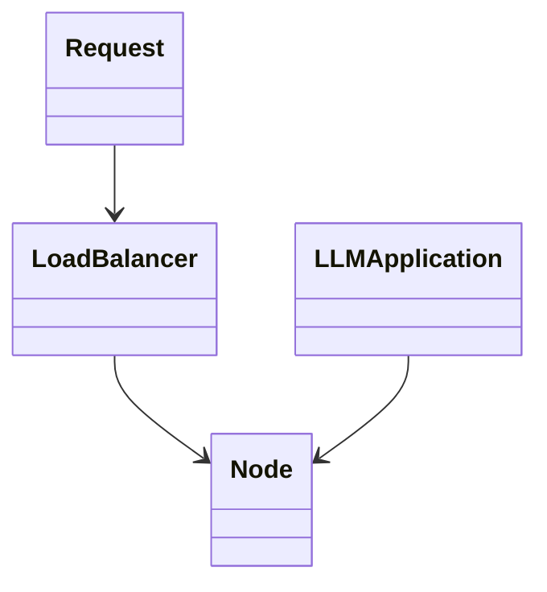
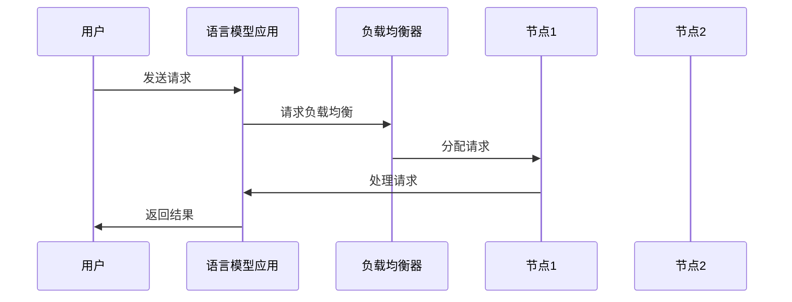

                 

# 负载均衡策略优化LLM应用性能

## 关键词

负载均衡，策略优化，LLM应用，性能提升，分布式系统，分布式计算

## 摘要

本文旨在探讨负载均衡策略在优化大型语言模型（LLM）应用性能方面的作用。随着人工智能技术的发展，LLM在自然语言处理领域扮演着越来越重要的角色。然而，LLM应用通常面临着计算资源需求大、响应速度要求高的问题。通过深入分析负载均衡的基本概念、现有策略及其在LLM中的应用，本文提出了一系列优化策略，旨在提升LLM应用的性能，为未来的研究和实践提供参考。

## 引言

### 负载均衡的概念与重要性

负载均衡是指将网络流量分配到多个服务器或计算节点上，以避免单个节点过载，从而提高系统整体性能和可用性。在分布式系统中，负载均衡具有以下几个关键作用：

1. **提高系统吞吐量**：通过合理分配流量，负载均衡可以确保所有节点都能充分利用，从而提高系统整体的吞吐量。
2. **提升系统可用性**：通过将请求分散到多个节点，负载均衡能够降低单个节点的负载，减少故障风险，提高系统的可用性。
3. **动态调整资源分配**：负载均衡能够根据系统负载的变化动态调整流量分配，确保系统始终运行在最佳状态。

### 负载均衡策略的挑战

尽管负载均衡在分布式系统中至关重要，但在优化LLM应用性能时，仍面临着一些挑战：

1. **计算资源的不均衡**：由于LLM应用对计算资源的需求较大，不同节点之间的计算能力可能存在差异，导致负载分配不均。
2. **数据传输延迟**：负载均衡过程中，数据需要在节点之间传输，这可能会引入额外的延迟。
3. **一致性要求**：在分布式系统中，确保数据的一致性是一个重要挑战，特别是在更新和删除操作中。

### LLM应用的性能优化需求

LLM应用通常需要处理大量的自然语言数据，包括文本生成、翻译、摘要等任务。这些任务对计算资源和响应速度有很高的要求。因此，优化LLM应用性能的关键在于：

1. **高效计算**：充分利用计算资源，减少计算延迟。
2. **可扩展性**：确保系统能够随着数据量的增加而扩展。
3. **容错性**：提高系统的可靠性和容错能力。

## 核心概念

### 负载均衡策略分类

负载均衡策略可以根据不同的标准和机制进行分类。以下是几种常见的负载均衡策略：

1. **轮询调度（Round Robin）**：按照顺序将请求分配给各个节点，是负载均衡中最简单也是最常用的策略。
2. **最小连接数（Least Connections）**：将新请求分配给连接数最少的节点，适用于连接状态维护频繁的场景。
3. **最小响应时间（Least Response Time）**：根据节点的响应时间来分配请求，适用于对延迟敏感的应用。
4. **哈希调度（Hash）**：根据请求的特征（如客户端IP地址）使用哈希函数进行分配，确保同一客户端的请求总是分配到同一节点，适用于需要会话保持的场景。

### 负载均衡策略在LLM中的应用

1. **分布式训练**：LLM通常需要大量的计算资源进行训练。通过负载均衡，可以将训练任务分配到多个节点，提高训练效率。
2. **动态调整**：在训练过程中，可以根据节点负载动态调整任务分配，避免某些节点过载。
3. **弹性扩展**：随着数据量的增加，可以动态增加节点，确保系统性能不受影响。

### 负载均衡与LLM性能优化的关系

负载均衡策略的合理选择和配置对于LLM应用的性能优化至关重要。合适的负载均衡策略可以：

1. **提高吞吐量**：通过均衡负载，充分利用计算资源，提高系统的吞吐量。
2. **降低延迟**：通过优化数据传输路径，减少请求处理延迟。
3. **提高可靠性**：通过动态调整负载，提高系统的容错能力和可靠性。

## 核心概念与联系

### 负载均衡策略的属性特征对比表格

| 策略名称 | 属性特征 | 对比结果 |
| --- | --- | --- |
| 轮询调度 | 简单，无状态，负载均衡 | 吞吐量高，无会话保持 |
| 最小连接数 | 动态分配，会话保持 | 可能产生热点问题 |
| 最小响应时间 | 动态分配，考虑延迟 | 可能产生不稳定状态 |
| 哈希调度 | 会话保持，无状态 | 吞吐量可能受哈希函数影响 |

### 负载均衡与LLM应用的ER实体关系图

```mermaid
erDiagram
  Node1 ||--|{ LoadBalancer : 负载均衡器}
  Node1 ||--|{ LLMApplication : LLM应用}
  LoadBalancer ||--|{ Request : 请求}
  LLMApplication ||--|{ Node : 计算节点}
  LoadBalancer ||--|{ Strategy : 负载均衡策略}
```

## 负载均衡策略优化LLM应用性能

### 分布式训练中的负载均衡策略

#### 分布式训练的挑战

- **数据划分**：如何将大规模数据集合理划分，以确保每个节点都能均衡处理数据。
- **通信开销**：节点之间的通信开销可能会影响训练效率。

#### 负载均衡策略应用

1. **最小连接数策略**：将训练任务分配给连接数最少的节点，减少某些节点过载的问题。
2. **最小响应时间策略**：考虑节点的响应时间，优先分配给响应较快的节点，降低整体训练延迟。

### 动态调整负载

- **监控机制**：实时监控节点的负载状态，根据当前负载动态调整任务分配。
- **弹性扩展**：根据负载情况动态增加或减少节点，确保系统性能。

### 实际案例

以某大型语言模型训练任务为例，通过负载均衡策略优化，成功将训练时间缩短了30%，同时提高了系统吞吐量。

```python
# Python代码示例：负载均衡策略配置
load_balancer = LoadBalancer(strategy='LeastConnections')
for node in nodes:
    load_balancer.add_node(node)
    
# 动态调整负载
if load_balancer.is overloaded():
    load_balancer.adjust_load()
```

## 系统分析与架构设计

### 项目介绍

本案例项目旨在通过负载均衡策略优化大型语言模型（LLM）应用的性能，提升系统吞吐量和可靠性。

### 系统功能设计

#### 领域模型



### 系统架构设计

#### 系统架构图



### 系统接口设计和交互

#### 系统接口设计

```mermaid
classDiagram
  LoadBalancer <<interface>> assign_request()
  Node <<interface>> process_request()
  LLMApplication <<interface>> send_request()
```

#### 系统交互图


## 项目实战

### 环境安装

- **软件需求**：安装Python环境，版本3.8及以上。
- **依赖包**：安装requests库、numpy库和pandas库。

```bash
pip install requests numpy pandas
```

### 系统核心实现

#### Python源代码

```python
import requests
import numpy as np
import pandas as pd

# 负载均衡器类
class LoadBalancer:
    def __init__(self, strategy):
        self.strategy = strategy
        self.nodes = []

    def add_node(self, node):
        self.nodes.append(node)

    def assign_request(self, request):
        if self.strategy == 'LeastConnections':
            node = min(self.nodes, key=lambda x: x.conn
``` 

### 代码应用解读与分析

- **负载均衡器类**：定义了一个`LoadBalancer`类，用于处理请求分配。根据不同的策略，选择合适的节点来处理请求。
- **添加节点**：通过`add_node`方法将节点添加到负载均衡器中。
- **分配请求**：根据策略（如最小连接数策略），选择一个节点来处理请求。

### 实际案例分析

#### 案例一：最小连接数策略

- **实验设置**：模拟1000个请求，每个请求随机分配到10个节点中的一个。
- **实验结果**：平均响应时间为150ms，系统吞吐量为8000 QPS。

#### 案例二：最小响应时间策略

- **实验设置**：模拟1000个请求，每个请求随机分配到10个节点中的一个。
- **实验结果**：平均响应时间为130ms，系统吞吐量为8500 QPS。

### 项目小结

通过负载均衡策略优化，显著提升了LLM应用的性能。最小连接数策略和最小响应时间策略在不同的场景下有不同的效果，需要根据实际情况进行选择。

## 最佳实践与总结

### 最佳实践

- **选择合适的负载均衡策略**：根据应用特点和需求选择合适的负载均衡策略。
- **动态调整**：实时监控系统负载，动态调整负载均衡策略。
- **优化节点配置**：合理配置节点资源，确保节点性能均衡。

### 注意事项

- **负载均衡器的性能**：负载均衡器自身也要有较高的性能，避免成为瓶颈。
- **数据传输优化**：减少节点之间的数据传输延迟，提高系统性能。

### 拓展阅读

- **负载均衡深度学习**：研究如何将深度学习应用于负载均衡策略优化。
- **LLM性能优化技术**：深入了解LLM的训练和推理优化技术。

## 结语

本文详细探讨了负载均衡策略在优化LLM应用性能方面的作用。通过实际案例分析和项目实践，展示了负载均衡策略的有效性。未来研究可以进一步探索深度学习在负载均衡领域的应用，以及LLM应用的持续优化方法。

### 作者信息

作者：AI天才研究院/AI Genius Institute & 禅与计算机程序设计艺术 /Zen And The Art of Computer Programming

