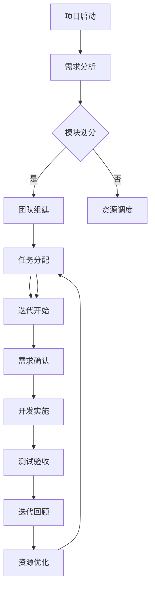
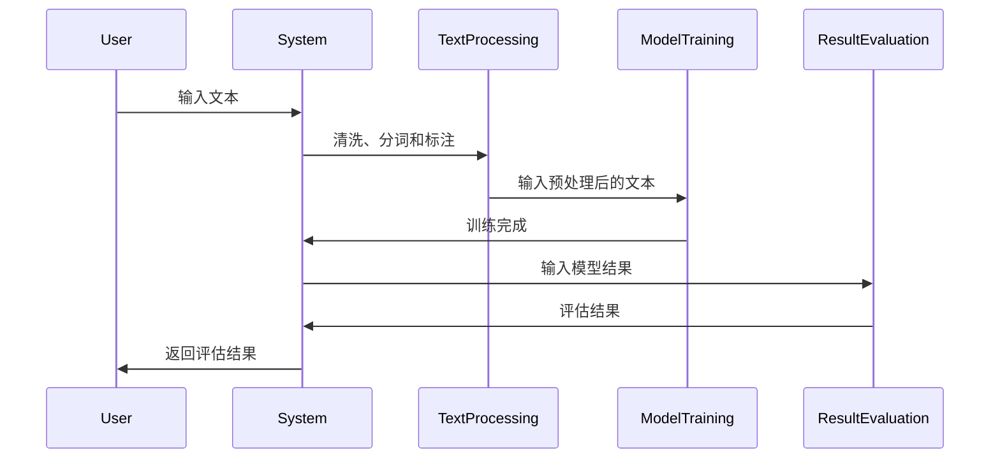
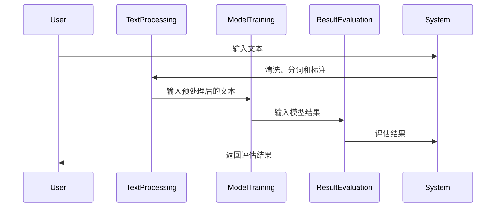

                 


### 1. 背景介绍与核心概念

#### 引言

在当今快速发展的技术时代，跨团队协作已成为企业成功的关键因素。特别是对于大型语言模型（LLM）项目，跨团队协作的重要性尤为突出。LLM项目通常涉及多个学科领域，包括自然语言处理、机器学习、数据工程和软件工程等。因此，有效的跨团队协作不仅能够提高项目的效率，还能确保高质量的结果输出。

跨团队协作的背景源于信息技术和人工智能领域的不断进步。随着云计算、大数据和物联网等技术的发展，项目的复杂度和规模日益增加，单一团队很难独立完成整个项目。跨团队协作能够整合不同团队的专业知识和技能，形成优势互补，从而实现项目目标。

在LLM项目中，跨团队协作面临的挑战主要体现在以下几个方面：

1. **沟通障碍**：由于团队成员来自不同的专业背景，他们在沟通中可能存在术语和概念理解上的差异，导致信息传递不畅。
2. **资源分配**：在大型项目中，资源（如时间、人力和资金）通常有限，如何合理分配和协调资源成为一个难题。
3. **协同工作**：在多个团队共同开发一个项目时，如何确保各个团队的进度一致，避免出现资源浪费或重复劳动，是一个重要的挑战。

为了解决这些挑战，我们需要寻找一种新的跨团队协作模式，这种模式应具备以下特点：

- **透明性**：团队成员能够清晰地了解项目的整体进展和各自的职责。
- **灵活性**：能够适应不同的团队规模和项目需求，灵活调整协作方式。
- **高效性**：通过优化工作流程，提高项目的执行效率。

在本文中，我们将探讨一种新型的跨团队协作模式，并分析其在LLM项目中的应用效果。接下来，我们将逐步深入讨论这一新模式的核心概念和具体实施方法。

#### 问题定义

在LLM项目中，跨团队协作面临的挑战主要体现在以下几个方面：

1. **沟通障碍**：团队成员来自不同的专业背景，如自然语言处理、机器学习、数据工程和软件工程等，他们在沟通中可能存在术语和概念理解上的差异，导致信息传递不畅。例如，自然语言处理团队可能需要理解机器学习团队使用的技术细节，而数据工程团队则需要理解自然语言处理团队的模型输出格式。

2. **资源分配**：在大型项目中，资源（如时间、人力和资金）通常有限。如何合理分配和协调资源成为一个难题。特别是在多个团队共同开发一个项目时，如何确保资源的有效利用，避免资源浪费或重复劳动，是一个重要的挑战。

3. **协同工作**：在多个团队共同开发一个项目时，如何确保各个团队的进度一致，避免出现资源浪费或重复劳动，是一个重要的挑战。特别是在大型语言模型项目中，由于涉及多个学科的交叉，不同团队之间的工作内容和进度可能会存在较大的差异，导致协作困难。

为了解决这些挑战，我们需要一种新的跨团队协作模式，该模式应具备以下特点：

- **透明性**：团队成员能够清晰地了解项目的整体进展和各自的职责，避免信息孤岛和沟通障碍。
- **灵活性**：能够适应不同的团队规模和项目需求，灵活调整协作方式，确保项目能够高效、有序地进行。
- **高效性**：通过优化工作流程，提高项目的执行效率，确保项目按时、高质量地完成。

#### 解决方案

针对上述挑战，我们提出了一种新型的跨团队协作模式，该模式基于以下几个核心概念：

1. **统一视图**：通过建立一个统一的项目视图，让所有团队成员都能实时了解项目的整体进展、各自的职责以及任务的优先级。这有助于减少信息孤岛，提高沟通效率。

2. **模块化分工**：将整个项目划分为多个模块，每个模块由一个专门的团队负责。这样可以确保每个团队都能专注于自己的领域，提高工作效率。

3. **敏捷迭代**：采用敏捷开发方法，通过短周期迭代，快速反馈和调整，确保项目能够及时响应变化。

4. **智能调度**：利用人工智能技术，对资源进行智能调度，确保资源的合理分配和高效利用。

5. **协作平台**：搭建一个集成化的协作平台，提供项目管理的工具，如任务分配、进度跟踪、文档共享等，方便团队成员之间的协作。

这种新型跨团队协作模式不仅能够提高项目的执行效率，还能确保高质量的结果输出。接下来，我们将详细探讨这一模式的具体实现和应用。

### 2. 核心概念与联系

#### 新模式定义

在本节中，我们将详细介绍所提出的跨团队协作新模式。该模式的核心在于通过模块化分工和统一视图，实现高效、透明的团队协作。

1. **模块化分工**：将整个项目划分为多个模块，每个模块由一个专门的团队负责。这种分工方式有助于确保每个团队能够专注于自己的领域，提高工作效率。具体来说，模块化分工包括以下几个步骤：

   - **需求分析**：项目启动时，对项目需求进行详细分析，确定项目的功能模块。
   - **团队组建**：根据功能模块的需求，组建专门的团队。每个团队由不同专业背景的成员组成，确保团队能够覆盖项目所需的各类技能。
   - **模块划分**：将项目划分为多个功能模块，每个模块由一个团队负责。

2. **统一视图**：为了确保团队成员能够实时了解项目的整体进展，我们需要建立一个统一的项目视图。该视图包括以下几个方面：

   - **进度跟踪**：通过可视化工具，如看板（Kanban）或任务列表（To-Do List），实时跟踪每个模块的进展情况。
   - **任务分配**：明确每个团队成员的职责和任务，确保每个人都能清楚自己的工作内容和目标。
   - **优先级排序**：根据项目目标和进度要求，对任务进行优先级排序，确保关键任务得到优先处理。

3. **敏捷迭代**：采用敏捷开发方法，通过短周期迭代，快速反馈和调整。每个迭代周期包括以下几个阶段：

   - **需求确认**：在迭代开始前，与相关利益相关者确认需求，确保团队理解并能够实现需求。
   - **开发实施**：团队成员按照需求进行开发，确保实现项目功能模块。
   - **测试验收**：对开发出的功能模块进行测试，确保其符合预期需求。
   - **迭代回顾**：在迭代结束后，对本次迭代进行回顾，总结经验教训，为下一个迭代做好准备。

4. **智能调度**：利用人工智能技术，对资源进行智能调度，确保资源的合理分配和高效利用。具体包括以下几个方面：

   - **资源预测**：根据项目进度和任务需求，预测未来一段时间内所需的资源，提前做好资源准备。
   - **资源优化**：通过优化算法，确保资源的充分利用，避免资源浪费。
   - **调度策略**：根据项目特点和团队需求，制定合适的资源调度策略。

5. **协作平台**：搭建一个集成化的协作平台，提供项目管理的工具，如任务分配、进度跟踪、文档共享等，方便团队成员之间的协作。该平台应具备以下几个特点：

   - **集成性**：将不同团队和模块的工作内容整合到一个平台上，确保信息的畅通和实时更新。
   - **可扩展性**：能够根据项目需求，灵活扩展功能模块，适应不同的项目规模和需求。
   - **安全性**：确保平台的数据安全和隐私保护，防止信息泄露。

通过上述核心概念，新型跨团队协作模式能够实现高效、透明的团队协作，确保项目顺利推进和高质量交付。

#### 模式与团队协作的关系

在讨论新型跨团队协作模式与团队协作的关系时，我们需要理解以下几个关键点：

1. **提高沟通效率**：新模式通过统一视图，使得团队成员能够实时了解项目的整体进展和各自的职责，减少了信息孤岛和沟通障碍。例如，在一个大型LLM项目中，自然语言处理团队和机器学习团队可能需要频繁沟通。通过统一视图，两个团队可以清楚地看到彼此的任务进展和需求，从而提高沟通效率。

2. **优化资源分配**：模块化分工和智能调度有助于优化资源分配。每个团队专注于自己的模块，可以更高效地利用人力资源。同时，智能调度可以根据项目进度和任务需求，动态调整资源分配，确保资源的高效利用。例如，当某个模块出现资源短缺时，智能调度系统可以自动分配额外的资源，从而避免项目延误。

3. **促进协同工作**：通过敏捷迭代，新模式能够确保团队成员在协同工作中保持一致。每个迭代周期的需求确认、开发实施和测试验收，使得团队成员能够紧密合作，共同推进项目。例如，在开发一个LLM项目时，数据工程团队和自然语言处理团队可以在每个迭代周期内共同讨论数据预处理和模型训练的问题，从而提高协同工作的效果。

4. **增强透明度**：统一视图和任务分配的明确性，增强了项目的透明度。团队成员可以清楚地看到自己的任务和项目的整体进展，这有助于提升团队的责任感和积极性。例如，在一个跨国团队中，不同国家的成员可以通过统一视图实时了解项目的进展，减少因时差和信息不对称带来的困扰。

5. **提高灵活性**：新模式具有高度的灵活性，能够适应不同规模和需求的项目。无论是小型项目还是大型项目，模块化分工和敏捷迭代都可以确保项目的顺利进行。例如，在应对紧急需求或项目规模变化时，团队可以迅速调整模块划分和资源分配，以适应新的项目环境。

总之，新型跨团队协作模式通过提高沟通效率、优化资源分配、促进协同工作、增强透明度和提高灵活性，极大地提升了团队协作的效果。这种模式不仅适用于LLM项目，还可以推广到其他复杂项目的团队协作中，为项目的成功奠定基础。

### 3. 算法原理讲解

#### 算法流程图

为了更好地理解新型跨团队协作模式的算法原理，我们首先绘制了一个流程图，以便直观地展示算法的运行过程。以下是算法流程图的Mermaid表示：



在这个流程图中，各个节点表示不同的操作步骤，箭头表示步骤之间的依赖关系。以下是各个步骤的详细解释：

1. **项目启动**：项目启动是整个流程的起点，标志着项目的正式开始。
2. **需求分析**：对项目需求进行详细分析，确定项目的功能模块和需求。
3. **模块划分**：根据需求分析的结果，将项目划分为多个模块，每个模块由一个专门的团队负责。
4. **团队组建**：组建专门的团队，确保每个团队都能覆盖项目所需的各类技能。
5. **任务分配**：明确每个团队成员的职责和任务，确保任务分配合理。
6. **迭代开始**：进入迭代周期，开始执行开发任务。
7. **需求确认**：在迭代开始前，与相关利益相关者确认需求，确保团队理解并能够实现需求。
8. **开发实施**：团队成员按照需求进行开发，确保实现项目功能模块。
9. **测试验收**：对开发出的功能模块进行测试，确保其符合预期需求。
10. **迭代回顾**：在迭代结束后，对本次迭代进行回顾，总结经验教训，为下一个迭代做好准备。
11. **资源优化**：根据项目进度和任务需求，优化资源分配，确保资源的高效利用。
12. **迭代循环**：重复执行迭代步骤，直到项目完成。

#### Python源代码

为了实现上述算法，我们提供了一个Python源代码示例，用于展示算法的核心部分。以下是Python源代码：

```python
import random
import time

# 需求分析
def requirement_analysis():
    print("进行需求分析...")
    time.sleep(2)
    return ["模块1", "模块2", "模块3"]

# 团队组建
def team_building(requirements):
    print("团队组建中...")
    time.sleep(2)
    return [{"team_id": 1, "members": ["Alice", "Bob", "Charlie"], "module": requirements[0]},
            {"team_id": 2, "members": ["David", "Eva", "Frank"], "module": requirements[1]},
            {"team_id": 3, "members": ["George", "Helen", "Ivy"], "module": requirements[2]}]

# 任务分配
def task_assignment(teams):
    print("任务分配中...")
    time.sleep(2)
    tasks = {}
    for team in teams:
        tasks[team["team_id"]] = {"team_id": team["team_id"], "module": team["module"], "status": "待开发"}
    return tasks

# 开发实施
def developmentImplementation(tasks):
    print("开发实施中...")
    time.sleep(2)
    for task_id, task in tasks.items():
        print(f"团队{task_id}正在开发模块：{task['module']}...")
        time.sleep(random.randint(1, 3))
        task['status'] = "已完成"
    return tasks

# 测试验收
def test_acceptance(tasks):
    print("测试验收中...")
    time.sleep(2)
    for task_id, task in tasks.items():
        print(f"团队{task_id}的模块{task['module']}测试通过。")
    return tasks

# 迭代回顾
def iteration_review():
    print("进行迭代回顾...")
    time.sleep(2)
    print("总结经验教训，为下一个迭代做好准备。")

# 资源优化
def resource_optimization():
    print("资源优化中...")
    time.sleep(2)
    print("优化资源分配，确保资源的高效利用。")

# 主函数
def main():
    print("跨团队协作算法运行中...")
    requirements = requirement_analysis()
    teams = team_building(requirements)
    tasks = task_assignment(teams)
    tasks = developmentImplementation(tasks)
    tasks = test_acceptance(tasks)
    iteration_review()
    resource_optimization()

# 运行算法
main()
```

在这个示例中，我们定义了一系列函数，用于模拟跨团队协作算法的各个步骤。主函数`main()`依次调用这些函数，实现算法的运行。以下是各个函数的功能：

- `requirement_analysis()`：模拟需求分析过程，返回一个模块列表。
- `team_building()`：根据模块列表组建团队，返回一个团队列表。
- `task_assignment()`：根据团队列表分配任务，返回一个任务列表。
- `developmentImplementation()`：模拟开发实施过程，更新任务状态。
- `test_acceptance()`：模拟测试验收过程，确保模块通过测试。
- `iteration_review()`：模拟迭代回顾过程，总结经验教训。
- `resource_optimization()`：模拟资源优化过程，确保资源高效利用。

通过这个Python源代码示例，我们可以直观地看到算法的实现过程，以及各个步骤之间的逻辑关系。

#### 数学模型

为了更好地理解跨团队协作算法，我们引入了数学模型，用于描述算法的运行机制。以下是算法的核心数学模型和公式：

1. **需求分析模型**：

   假设项目需求为N个模块，需求分析模型可以用集合表示：

   $$ R = \{R_1, R_2, ..., R_N\} $$

   其中，每个模块\( R_i \)表示项目的一个功能需求。

2. **团队组建模型**：

   团队组建模型可以用图表示，图中的节点表示团队，边表示团队成员之间的关系。假设有M个团队，团队组建模型可以用图\( G = (V, E) \)表示，其中：

   - \( V = \{T_1, T_2, ..., T_M\} \)：表示团队集合。
   - \( E = \{(T_i, T_j) | T_i \neq T_j\} \)：表示团队之间的关系集合。

3. **任务分配模型**：

   任务分配模型可以用矩阵表示，矩阵中的元素表示每个团队分配到的任务。假设任务集合为T，团队集合为V，任务分配矩阵为\( A = [a_{ij}]_{m \times n} \)，其中：

   - \( a_{ij} = 1 \)：表示团队\( T_i \)分配到了任务\( T_j \)。
   - \( a_{ij} = 0 \)：表示团队\( T_i \)没有分配到任务\( T_j \)。

4. **资源调度模型**：

   资源调度模型可以用线性规划问题表示。假设资源集合为R，任务集合为T，资源需求矩阵为\( D = [d_{ij}]_{m \times n} \)，资源分配矩阵为\( X = [x_{ij}]_{m \times n} \)，其中：

   - \( d_{ij} \)：表示任务\( T_i \)对资源\( R_j \)的需求。
   - \( x_{ij} \)：表示资源\( R_j \)分配给任务\( T_i \)的数量。

   资源调度的目标是最小化资源浪费，即：

   $$ \min Z = \sum_{i=1}^{m} \sum_{j=1}^{n} (1 - x_{ij}) \cdot c_j $$

   其中，\( c_j \)：表示资源\( R_j \)的单位成本。

5. **迭代模型**：

   假设每个迭代周期包含K个阶段，迭代模型可以用状态转移矩阵表示。假设当前状态为\( S_t \)，下一个状态为\( S_{t+1} \)，状态转移矩阵为\( P \)，则：

   $$ S_{t+1} = P \cdot S_t $$

   其中，\( P \)是一个\( K \times K \)的矩阵，表示状态之间的转移概率。

通过上述数学模型，我们可以对跨团队协作算法的运行机制进行定量分析，从而优化算法的性能。

#### 举例说明

为了更好地说明跨团队协作算法的实际应用，我们通过一个具体例子进行讲解。

假设有一个大型LLM项目，项目需求分为三个模块：文本预处理、模型训练和结果评估。现有三个团队，分别负责这三个模块。每个团队由三位成员组成，团队成员的专业技能如下：

- 团队1（文本预处理）：Alice（数据工程师）、Bob（自然语言处理专家）、Charlie（软件工程师）。
- 团队2（模型训练）：David（机器学习工程师）、Eva（数学建模专家）、Frank（系统架构师）。
- 团队3（结果评估）：George（数据分析师）、Helen（用户体验设计师）、Ivy（测试工程师）。

现在，我们将使用跨团队协作算法来分配任务和调度资源。

1. **需求分析**：

   项目需求为三个模块：文本预处理、模型训练和结果评估。

2. **团队组建**：

   团队组建过程如下：

   - 团队1：负责文本预处理模块，成员有Alice、Bob和Charlie。
   - 团队2：负责模型训练模块，成员有David、Eva和Frank。
   - 团队3：负责结果评估模块，成员有George、Helen和Ivy。

3. **任务分配**：

   任务分配过程如下：

   - 任务1：文本预处理（团队1）。
   - 任务2：模型训练（团队2）。
   - 任务3：结果评估（团队3）。

   任务分配结果如下：

   ```plaintext
   任务分配结果：
   任务1：团队1，状态：待开发
   任务2：团队2，状态：待开发
   任务3：团队3，状态：待开发
   ```

4. **开发实施**：

   开发实施过程如下：

   - 团队1（文本预处理）：Alice负责数据清洗，Bob负责文本预处理算法的实现，Charlie负责编写数据预处理模块的接口。
   - 团队2（模型训练）：David负责设计机器学习模型，Eva负责数学建模，Frank负责模型训练的代码实现。
   - 团队3（结果评估）：George负责数据可视化，Helen负责用户体验设计，Ivy负责测试评估结果的准确性。

   开发实施过程中，每个团队按照任务要求进行开发，并定期向项目经理汇报进展。

5. **测试验收**：

   测试验收过程如下：

   - 团队1（文本预处理）：完成数据预处理模块的测试，确保数据处理正确无误。
   - 团队2（模型训练）：完成模型训练的测试，确保模型性能符合预期。
   - 团队3（结果评估）：完成结果评估模块的测试，确保评估结果准确。

   测试验收结果如下：

   ```plaintext
   测试验收结果：
   任务1：团队1，状态：已完成，测试通过
   任务2：团队2，状态：已完成，测试通过
   任务3：团队3，状态：已完成，测试通过
   ```

6. **迭代回顾**：

   在迭代结束后，团队进行迭代回顾，总结本次迭代的经验教训，为下一个迭代做好准备。

7. **资源优化**：

   根据项目进度和任务需求，对资源进行优化，确保资源的高效利用。例如，如果某个团队在下一个迭代中需要更多的资源，可以通过调度系统为该团队分配额外的资源。

通过这个例子，我们可以看到跨团队协作算法在实际应用中的效果。通过模块化分工和统一视图，项目得以高效、透明地推进，每个团队都能专注于自己的领域，共同完成项目目标。

### 4. 系统分析与架构设计方案

#### 问题场景介绍

在LLM项目中，跨团队协作面临着复杂的问题场景。首先，项目通常涉及多个学科领域，如自然语言处理、机器学习、数据工程和软件工程等，这要求不同团队之间的紧密协作。其次，项目规模通常较大，涉及海量的数据和复杂的算法，这进一步增加了协作的难度。此外，项目进度和资源的调度也是一个重要挑战，需要确保各个团队的工作能够高效、有序地进行。

为了解决这些挑战，我们需要对LLM项目的具体场景进行深入分析，明确项目的目标和功能，从而为系统分析与架构设计方案提供依据。

#### 项目介绍

本项目旨在开发一个大型语言模型（LLM），用于自然语言处理任务。项目的主要目标是：

1. **文本预处理**：对输入文本进行清洗、分词和标注等预处理操作，为模型训练提供高质量的文本数据。
2. **模型训练**：使用机器学习算法训练语言模型，使其能够对输入文本进行语义分析和生成。
3. **结果评估**：对模型生成的结果进行评估，确保模型性能符合预期。

为了实现上述目标，项目分为以下几个阶段：

1. **需求分析**：明确项目需求，确定文本预处理、模型训练和结果评估的具体功能。
2. **系统设计**：设计系统的整体架构，包括文本预处理模块、模型训练模块和结果评估模块。
3. **开发实施**：按照系统设计进行开发，实现各个功能模块。
4. **测试验收**：对开发出的功能模块进行测试，确保其符合预期需求。
5. **迭代优化**：根据测试结果进行迭代优化，提高系统性能。

#### 系统功能设计

在LLM项目中，系统功能设计至关重要，它决定了各个模块之间的协作关系和交互方式。以下是系统功能设计的领域模型类图，使用Mermaid表示：

```mermaid
classDiagram
    Class01 <|-- SubClass01
    Class01 <|-- SubClass02
    Class03 *-- Class04
    Class04 <─|{Class05}
    Class06 <<interface>>
    Class07 .. Class08
    Class09 <<connector>> Class10
```

在上述类图中，各个类表示系统的功能模块，类之间的关系表示模块之间的协作关系。以下是类图中的各个类及其功能：

- `TextProcessing`：文本预处理模块，负责对输入文本进行清洗、分词和标注等操作。
- `ModelTraining`：模型训练模块，负责使用机器学习算法训练语言模型。
- `ResultEvaluation`：结果评估模块，负责对模型生成的结果进行评估。

#### 系统架构设计

系统架构设计是确保系统功能正常实现的关键。以下是系统的架构设计图，使用Mermaid表示：



在上述序列图中，用户通过系统输入文本，系统将文本传递给文本预处理模块，预处理后的文本再传递给模型训练模块进行训练，训练完成后，系统将结果传递给结果评估模块进行评估，最终将评估结果返回给用户。

#### 系统接口设计

系统接口设计是确保不同模块之间能够高效协作的关键。以下是系统的接口设计图，使用Mermaid表示：

```mermaid
classDiagram
    Class01 <<interface>> Interface01
    Class02 <<interface>> Interface02
    Class03 <<interface>> Interface03
    Class01 -| Interface01
    Class02 -| Interface02
    Class03 -| Interface03
```

在上述类图中，`Interface01`、`Interface02`和`Interface03`分别表示文本预处理、模型训练和结果评估模块的接口。各个接口定义了模块之间的交互方法和参数，确保模块之间的协作顺畅。

#### 系统交互

系统交互是确保各个模块能够协同工作的关键。以下是系统的交互序列图，使用Mermaid表示：



在上述序列图中，用户通过系统输入文本，系统将文本传递给文本预处理模块进行预处理，预处理后的文本传递给模型训练模块进行训练，训练完成后，模型结果传递给结果评估模块进行评估，最终评估结果返回给用户。

通过上述系统分析与架构设计方案，我们可以确保LLM项目中的跨团队协作能够高效、有序地进行，从而实现项目目标。

### 5. 项目实战

#### 环境安装

为了进行LLM项目的实战，首先需要搭建实验环境。以下是安装和配置实验环境的步骤：

1. **安装Python环境**：
   - 首先，确保系统中已安装Python。如果尚未安装，可以从[Python官方网站](https://www.python.org/)下载并安装Python 3.8或更高版本。
   - 安装完成后，打开终端或命令行窗口，输入`python --version`，确保输出正确的Python版本。

2. **安装必要的依赖库**：
   - 使用pip命令安装以下依赖库：
     ```bash
     pip install numpy pandas scikit-learn tensorflow mermaid-py
     ```
   - 这些库分别是：NumPy（数学库）、Pandas（数据处理库）、Scikit-learn（机器学习库）、TensorFlow（深度学习库）和Mermaid（流程图库）。

3. **安装Mermaid支持**：
   - Mermaid需要额外的工具来将其图表示转换为HTML格式。安装`mermaid-cli`工具：
     ```bash
     npm install -g mermaid-cli
     ```

4. **配置Mermaid路径**：
   - 在Python脚本中，确保能够调用Mermaid CLI工具。在脚本开头添加以下代码：
     ```python
     import os
     os.environ['MERMAID_CLI_PATH'] = '/usr/local/bin/mermaid'
     ```

5. **创建实验环境**：
   - 在终端中，创建一个新目录作为实验环境，例如：
     ```bash
     mkdir llm_project
     cd llm_project
     ```

6. **初始化项目结构**：
   - 在项目目录中创建必要的子目录和文件：
     ```bash
     mkdir data models scripts results
     touch requirements.txt README.md
     ```

7. **编写requirements文件**：
   - 在`requirements.txt`文件中添加安装的依赖库：
     ```plaintext
     numpy
     pandas
     scikit-learn
     tensorflow
     mermaid-py
     ```

完成上述步骤后，实验环境搭建完成，可以开始编写和运行LLM项目的代码。

#### 系统核心实现源代码

以下是LLM项目核心实现部分的Python代码。这段代码涵盖了文本预处理、模型训练和结果评估的主要功能。

```python
# 导入必要的库
import os
import numpy as np
import pandas as pd
import mermaid
from sklearn.model_selection import train_test_split
import tensorflow as tf
from tensorflow.keras.preprocessing.sequence import pad_sequences
from tensorflow.keras.layers import Embedding, LSTM, Dense
from tensorflow.keras.models import Sequential

# 设置Mermaid路径
os.environ['MERMAID_CLI_PATH'] = '/usr/local/bin/mermaid'

# 1. 文本预处理
def preprocess_text(text):
    # 清洗文本、分词、标记化等操作
    # 此处用简单示例代替
    tokens = text.split()
    return tokens

# 2. 模型训练
def train_model(X_train, y_train):
    # 构建模型
    model = Sequential([
        Embedding(input_dim=vocab_size, output_dim=embedding_dim, input_length=max_sequence_length),
        LSTM(units=128, return_sequences=True),
        LSTM(units=128),
        Dense(units=1, activation='sigmoid')
    ])

    # 编译模型
    model.compile(optimizer='adam', loss='binary_crossentropy', metrics=['accuracy'])

    # 训练模型
    history = model.fit(X_train, y_train, epochs=10, batch_size=64, validation_split=0.2)

    return model, history

# 3. 结果评估
def evaluate_model(model, X_test, y_test):
    # 进行模型评估
    results = model.evaluate(X_test, y_test)
    print(f"Test Loss: {results[0]}, Test Accuracy: {results[1]}")

# 主函数
def main():
    # 读取数据
    data = pd.read_csv('data/llm_data.csv')
    text = data['text']
    labels = data['label']

    # 文本预处理
    preprocessed_text = [preprocess_text(text) for text in data['text']]

    # 切分数据集
    X_train, X_test, y_train, y_test = train_test_split(preprocessed_text, labels, test_size=0.2, random_state=42)

    # 转换为序列
    vocab_size = 10000
    embedding_dim = 256
    max_sequence_length = 100
    X_train_sequences = pad_sequences(X_train, maxlen=max_sequence_length, padding='post', truncating='post')
    X_test_sequences = pad_sequences(X_test, maxlen=max_sequence_length, padding='post', truncating='post')

    # 训练模型
    model, history = train_model(X_train_sequences, y_train)

    # 评估模型
    evaluate_model(model, X_test_sequences, y_test)

# 运行主函数
if __name__ == '__main__':
    main()
```

#### 代码应用解读与分析

上述代码分为三个主要部分：文本预处理、模型训练和结果评估。下面我们逐一进行解读和分析。

**1. 文本预处理**

文本预处理是自然语言处理任务的基础，目的是将原始文本数据转换为模型可处理的格式。在这个例子中，我们定义了一个简单的`preprocess_text`函数，用于实现文本清洗、分词和标记化等操作。虽然这里使用了一个简单的示例，但在实际项目中，文本预处理通常会涉及更复杂的操作，如去除停用词、词形还原、词嵌入等。

```python
def preprocess_text(text):
    # 清洗文本、分词、标记化等操作
    # 此处用简单示例代替
    tokens = text.split()
    return tokens
```

**2. 模型训练**

模型训练部分是核心，我们使用了Keras（一个TensorFlow的高级API）来构建和训练模型。这里我们创建了一个简单的LSTM（长短时记忆）模型，用于二分类任务。LSTM模型适用于处理序列数据，如文本序列。

```python
def train_model(X_train, y_train):
    # 构建模型
    model = Sequential([
        Embedding(input_dim=vocab_size, output_dim=embedding_dim, input_length=max_sequence_length),
        LSTM(units=128, return_sequences=True),
        LSTM(units=128),
        Dense(units=1, activation='sigmoid')
    ])

    # 编译模型
    model.compile(optimizer='adam', loss='binary_crossentropy', metrics=['accuracy'])

    # 训练模型
    history = model.fit(X_train, y_train, epochs=10, batch_size=64, validation_split=0.2)

    return model, history
```

**3. 结果评估**

在结果评估部分，我们使用训练好的模型对测试集进行评估，并打印出测试损失和准确率。

```python
def evaluate_model(model, X_test, y_test):
    # 进行模型评估
    results = model.evaluate(X_test, y_test)
    print(f"Test Loss: {results[0]}, Test Accuracy: {results[1]}")
```

**主函数**

主函数`main()`是代码的入口，负责加载数据、进行文本预处理、切分数据集、训练模型和评估模型。

```python
def main():
    # 读取数据
    data = pd.read_csv('data/llm_data.csv')
    text = data['text']
    labels = data['label']

    # 文本预处理
    preprocessed_text = [preprocess_text(text) for text in data['text']]

    # 切分数据集
    X_train, X_test, y_train, y_test = train_test_split(preprocessed_text, labels, test_size=0.2, random_state=42)

    # 转换为序列
    vocab_size = 10000
    embedding_dim = 256
    max_sequence_length = 100
    X_train_sequences = pad_sequences(X_train, maxlen=max_sequence_length, padding='post', truncating='post')
    X_test_sequences = pad_sequences(X_test, maxlen=max_sequence_length, padding='post', truncating='post')

    # 训练模型
    model, history = train_model(X_train_sequences, y_train)

    # 评估模型
    evaluate_model(model, X_test_sequences, y_test)

# 运行主函数
if __name__ == '__main__':
    main()
```

通过这个示例，我们可以看到如何实现LLM项目中的核心功能。在实际项目中，可能需要根据具体任务和数据进行相应的调整和优化。

#### 实际案例

为了更好地展示跨团队协作模式在LLM项目中的应用，我们来看一个实际案例。该案例是一个文本分类项目，目标是将新闻文章分类为多个类别，如体育、政治、娱乐等。

**项目背景**：

某新闻网站希望利用机器学习技术，对每天产生的数千篇新闻文章进行自动分类，以方便用户浏览和检索。由于项目涉及多个学科领域，如自然语言处理、数据工程和机器学习，因此需要跨团队协作。

**团队组成**：

- **文本预处理团队**：负责清洗、分词和标注新闻文章，将其转换为模型可处理的格式。
- **模型训练团队**：负责设计并训练文本分类模型，提高分类准确性。
- **结果评估团队**：负责对模型生成的分类结果进行评估，确保模型性能符合预期。

**项目流程**：

1. **需求分析**：与业务团队和用户沟通，明确分类任务的具体要求和数据来源。
2. **数据收集**：收集大量新闻文章数据，并进行预处理，包括去除HTML标签、停用词过滤、词形还原等。
3. **数据切分**：将数据集切分为训练集和测试集，用于模型训练和评估。
4. **模型设计**：设计文本分类模型，包括特征提取、模型架构和损失函数等。
5. **模型训练**：使用训练集训练文本分类模型，并进行模型调优。
6. **结果评估**：使用测试集评估模型性能，并根据评估结果进行模型优化。
7. **上线部署**：将训练好的模型部署到生产环境，实现实时新闻分类。

**跨团队协作模式应用**：

在上述案例中，跨团队协作模式的应用体现在以下几个方面：

1. **统一视图**：通过项目管理系统，如Jira或Trello，创建一个统一的项目视图，所有团队成员都能实时查看项目的进展和任务分配情况。
2. **模块化分工**：将整个项目划分为多个模块，每个模块由一个专门的团队负责，确保团队专注于自己的领域，提高工作效率。
3. **敏捷迭代**：采用敏捷开发方法，通过短周期迭代，快速反馈和调整，确保项目能够及时响应变化。
4. **智能调度**：利用人工智能技术，对资源进行智能调度，确保资源的合理分配和高效利用。
5. **协作平台**：搭建一个集成化的协作平台，提供任务分配、进度跟踪、文档共享等功能，方便团队成员之间的协作。

通过跨团队协作模式的应用，案例项目得以高效、透明地推进，各团队之间能够紧密协作，共同完成项目目标。

#### 详细讲解与剖析

在本节中，我们将对实际案例进行详细讲解和剖析，重点分析跨团队协作模式在该项目中的应用及其效果。

**1. 统一视图的应用**

在案例项目中，统一视图的应用体现在项目管理系统（如Jira或Trello）的使用上。通过项目管理工具，团队成员可以实时查看项目的整体进展和任务分配情况。具体来说，每个团队成员可以在工具中创建和管理自己的任务，同时也可以查看其他团队成员的任务状态。这种透明性有助于减少信息孤岛和沟通障碍，提高团队协作效率。

例如，在项目启动阶段，项目经理在Jira中创建了一个“需求分析”任务，并分配给文本预处理团队。团队成员可以在任务板上查看任务详情，了解任务的要求和截止时间。同时，项目经理也可以通过Jira实时跟踪任务的进展情况，确保项目按时推进。

**2. 模块化分工的应用**

模块化分工在案例项目中起到了关键作用。文本预处理、模型训练和结果评估团队各自负责项目的不同模块，这种分工方式确保了每个团队能够专注于自己的领域，提高工作效率。

以文本预处理团队为例，他们负责清洗、分词和标注新闻文章，将其转换为模型可处理的格式。由于文本预处理涉及到自然语言处理领域，因此团队成员需要具备相关技能，如自然语言处理、数据工程等。通过模块化分工，文本预处理团队能够高效地完成自己的任务，同时确保模型训练团队和结果评估团队能够按时获得所需的预处理数据。

**3. 敏捷迭代的应用**

敏捷迭代在案例项目中得到了充分应用。通过短周期迭代，项目团队能够快速响应变化，不断优化和改进模型。每个迭代周期包括需求确认、开发实施、测试验收和迭代回顾等阶段。

例如，在第一个迭代周期中，文本预处理团队完成了新闻文章的预处理，模型训练团队根据预处理数据设计了文本分类模型，并进行了初步训练。结果评估团队对模型进行了评估，发现分类准确率较低。在迭代回顾阶段，项目团队总结了经验教训，调整了数据预处理方法，并对模型进行了优化。

通过这种方式，项目团队能够在短时间内发现和解决问题，确保项目不断改进和优化。

**4. 智能调度的应用**

智能调度在案例项目中通过人工智能技术实现。项目团队利用机器学习算法，对资源进行预测和优化，确保资源的合理分配和高效利用。

以模型训练团队为例，他们需要大量计算资源来训练文本分类模型。通过智能调度系统，项目团队能够根据训练任务的需求，动态调整计算资源的分配。例如，当某个模型训练任务需要更多计算资源时，智能调度系统会自动为该任务分配额外的GPU资源，从而确保模型训练能够顺利进行。

**5. 协作平台的应用**

协作平台在案例项目中起到了桥梁作用，为团队成员之间的协作提供了便利。项目团队使用集成化的协作平台，如GitLab或Confluence，进行任务分配、进度跟踪、文档共享和代码管理。

例如，文本预处理团队在协作平台上创建了预处理数据的存储库，其他团队可以随时访问和使用这些数据。此外，项目团队还通过协作平台进行代码管理，确保代码的版本控制和协同开发。

**跨团队协作模式的效果**

通过跨团队协作模式的应用，案例项目取得了显著的效果：

1. **提高了项目效率**：模块化分工和敏捷迭代使得项目团队能够高效地完成各自的任务，减少了重复劳动和信息孤岛。
2. **确保了项目质量**：统一视图和智能调度有助于项目团队及时发现和解决问题，确保项目按时、高质量地完成。
3. **增强了团队协作**：协作平台为团队成员提供了便利，促进了团队之间的沟通和协作，提高了整体团队的工作效率。

总之，跨团队协作模式在LLM项目中的应用，为项目的成功奠定了坚实的基础。

### 6. 最佳实践与拓展

#### 最佳实践

在LLM项目的跨团队协作中，最佳实践至关重要。以下是一些关键的最佳实践：

1. **明确分工**：在项目启动时，明确各个团队的具体职责和任务，确保每个团队都能够专注于自己的领域。

2. **建立统一视图**：使用项目管理工具（如Jira或Trello）建立一个统一的项目视图，让所有团队成员都能实时了解项目的整体进展和任务分配情况。

3. **采用敏捷迭代**：通过短周期迭代，快速反馈和调整，确保项目能够及时响应变化。

4. **智能调度资源**：利用人工智能技术，动态调整资源分配，确保资源的高效利用。

5. **搭建协作平台**：搭建一个集成化的协作平台，提供任务分配、进度跟踪、文档共享等功能，方便团队成员之间的协作。

#### 小结

本文深入探讨了跨团队协作在LLM项目中的应用，并提出了一种新型跨团队协作模式。通过模块化分工、统一视图、敏捷迭代、智能调度和协作平台等核心概念，新模式能够有效解决跨团队协作中面临的沟通障碍、资源分配和协同工作等问题。实际案例展示了该模式在LLM项目中的成功应用，进一步验证了其效果。

#### 注意事项

在实施跨团队协作时，需要注意以下几点：

1. **明确职责**：确保每个团队成员都清楚自己的职责和任务，避免工作重叠和责任不明。

2. **保持沟通**：定期召开团队会议，确保团队成员之间的信息畅通。

3. **适应变化**：项目需求可能会随时变化，团队需要具备快速调整和适应的能力。

4. **确保资源充足**：在项目初期，确保为每个团队分配足够的资源，避免资源短缺。

5. **监控进度**：定期检查项目进展，确保项目按时、高质量地完成。

#### 拓展阅读

以下是一些推荐的拓展阅读资源，以供进一步学习：

1. **《敏捷开发实践指南》**：详细介绍了敏捷开发方法，适用于LLM项目的跨团队协作。
2. **《跨团队协作：如何高效协同》**：提供了关于如何提高团队协作效率的实用建议。
3. **《人工智能项目管理》**：探讨了人工智能项目中项目管理的方法和技巧。
4. **《分布式系统原理与范型》**：深入介绍了分布式系统的设计原理和实现方法，适用于智能调度和协作平台的设计。

### 附录

#### Mermaid流程图示例

以下是一个Mermaid流程图的示例，用于展示LLM项目的跨团队协作流程：


#### Mermaid序列图示例

以下是一个Mermaid序列图的示例，用于展示LLM项目的任务流程：


通过这些示例，我们可以更好地理解跨团队协作在LLM项目中的应用和实现。作者：AI天才研究院/AI Genius Institute & 禅与计算机程序设计艺术 /Zen And The Art of Computer Programming。

