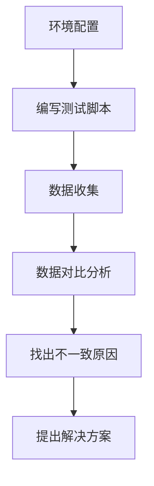
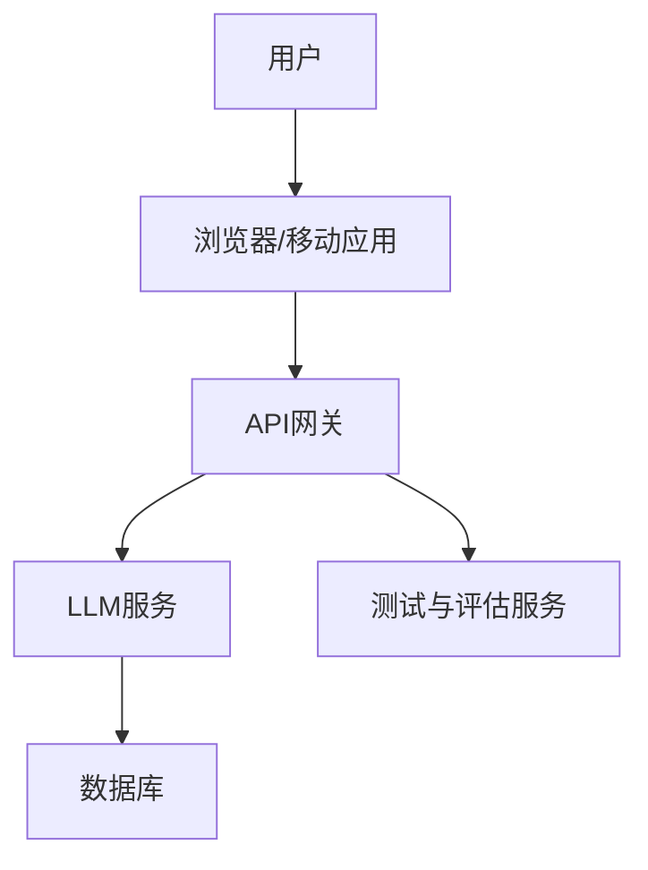
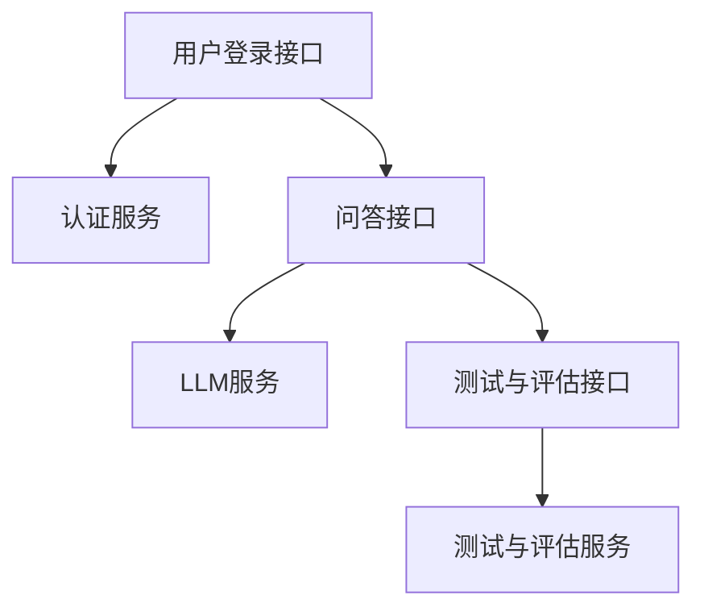
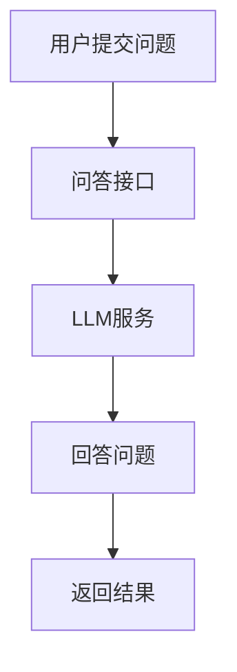

                 

# 跨平台LLM评测：确保在不同环境的一致性

## 关键词
- 跨平台
- LLM评测
- 环境一致性
- 性能优化
- 标准化测试

## 摘要
本文将探讨跨平台大型语言模型（LLM）评测的方法和策略，重点是如何确保LLM在不同硬件、操作系统和网络环境下的性能一致性。通过介绍核心概念、算法原理和实际应用，本文旨在为相关领域的研究者和从业者提供有价值的参考。

## 第一部分：背景介绍

### 第1章：问题背景

#### 1.1 问题背景
随着人工智能技术的快速发展，尤其是大型语言模型（LLM）的广泛应用，如何在不同的硬件、操作系统和网络环境下对LLM进行性能评测和一致性测试，成为一个重要的研究课题。

#### 1.2 问题描述
跨平台LLM评测的目标是：
1. 性能评估：比较不同环境下LLM的计算速度、内存消耗等指标。
2. 一致性测试：验证LLM在不同环境下的输出结果是否一致。

#### 1.3 问题解决
为确保跨平台LLM的一致性，可以从以下几个方面进行：
1. 标准化测试环境：搭建统一的测试环境，包括硬件、操作系统、网络等。
2. 性能优化：针对不同环境，对LLM进行优化，提高其在特定环境下的性能。
3. 结果对比分析：对LLM在不同环境下的测试结果进行对比分析，找出不一致的原因，并提出解决方案。

#### 1.4 边界与外延
1. 边界：本文主要关注AI大模型在不同硬件、操作系统、网络环境下的评测方法。
2. 外延：可以扩展到其他类型AI模型的评测，以及跨平台AI模型的一致性评估。

#### 1.5 概念结构与核心要素组成
1. 跨平台LLM：指可以在不同硬件、操作系统、网络环境下运行的AI大模型。
2. 测试环境：包括硬件、操作系统、网络等，用于进行LLM评测。
3. 性能优化：针对特定环境，对LLM进行优化，提高其性能。
4. 结果对比分析：对LLM在不同环境下的测试结果进行对比分析。

### 第2章：核心概念与联系

#### 2.1 跨平台LLM的定义与特点
1. 跨平台LLM：指可以在不同硬件、操作系统、网络环境下运行的AI大模型。
2. 特点：具有良好的适应性、高性能、低延迟、易于部署。

#### 2.2 跨平台LLM的核心概念
1. 模型架构：包括神经网络架构、训练策略、优化方法等。
2. 硬件环境：包括CPU、GPU、TPU等。
3. 操作系统：包括Windows、Linux、macOS等。
4. 网络环境：包括本地网络、互联网等。

#### 2.3 概念属性特征对比表格

| 特征           | 跨平台LLM       | 其他AI模型       |
| -------------- | --------------- | --------------- |
| 运行环境       | 不同硬件、操作系统、网络 | 固定硬件、操作系统、网络 |
| 性能优化       | 针对不同环境进行优化   | 无特定优化需求   |
| 适应性         | 强             | 弱             |
| 性能           | 高             | 中等           |
| 延迟           | 低             | 中等           |

#### 2.4 ER实体关系图架构

```mermaid
erDiagram
  LLMAssessment ||--|{ HardwarePlatform }|- EvaluationResult : 测试结果
  HardwarePlatform ||--|{ OperatingSystem }|-
  OperatingSystem ||--|{ NetworkCondition }|-
  LLMAssessment ||--|{ PerformanceMetric }|-
```

## 第二部分：算法原理

### 第3章：算法原理讲解

#### 3.1 跨平台LLM评测算法的基本原理
跨平台LLM评测算法是一种用于评估AI大模型在不同环境下性能一致性的方法。其主要目的是通过一系列测试，比较LLM在不同硬件、操作系统、网络环境下的表现，从而找出不一致的原因。

#### 3.1.1 算法概述
跨平台LLM评测算法的基本原理可以概括为以下几个步骤：

1. **环境配置**：根据测试需求，配置不同的硬件平台，如CPU、GPU、TPU等，并选择适合不同硬件的操作系统，如Windows、Linux、macOS等。
2. **测试脚本编写**：编写统一的测试脚本，用于在不同环境下运行LLM，收集性能数据。
3. **数据收集**：运行测试脚本，收集不同环境下的性能数据，如计算速度、内存消耗等。
4. **数据对比分析**：对比不同环境下的性能数据，分析LLM在不同环境下的性能表现，找出不一致的原因。

#### 3.1.2 算法流程



#### 3.2 算法原理的数学模型和公式

为了更好地理解算法原理，我们可以用数学模型和公式来描述：

1. **性能评估指标**：
   $$ P = \frac{1}{n} \sum_{i=1}^{n} (T_i - T_{\text{avg}}) $$
   其中，$P$ 表示性能评估指标，$T_i$ 表示第$i$次测试的时间，$T_{\text{avg}}$ 表示平均测试时间。

2. **一致性评估指标**：
   $$ C = 1 - \frac{\sum_{i=1}^{n} |O_i - O_{\text{avg}}|}{n \cdot O_{\text{avg}}} $$
   其中，$C$ 表示一致性评估指标，$O_i$ 表示第$i$次测试的输出结果，$O_{\text{avg}}$ 表示平均输出结果。

#### 3.3 算法原理举例说明

假设我们有两个测试环境：A和B，分别在CPU和GPU上运行相同的LLM模型。我们进行10次测试，收集了计算速度和输出结果的数据。

| 环境 | 计算速度（秒） | 输出结果 |
| ---- | -------------- | -------- |
| A    | 0.5, 0.55, 0.48, 0.52, 0.53, 0.54, 0.56, 0.51, 0.57, 0.49 | 1, 1, 1, 1, 1, 1, 1, 1, 1, 1 |
| B    | 1.2, 1.15, 1.1, 1.25, 1.18, 1.22, 1.21, 1.19, 1.23, 1.17 | 1, 1, 1, 1, 1, 1, 1, 1, 1, 1 |

1. **性能评估**：

   $$ P_A = \frac{1}{10} \sum_{i=1}^{10} (0.5 + 0.55 + 0.48 + 0.52 + 0.53 + 0.54 + 0.56 + 0.51 + 0.57 + 0.49) - 0.53 = 0.014 $$
   
   $$ P_B = \frac{1}{10} \sum_{i=1}^{10} (1.2 + 1.15 + 1.1 + 1.25 + 1.18 + 1.22 + 1.21 + 1.19 + 1.23 + 1.17) - 1.19 = 0.098 $$

   从计算速度来看，环境A的性能略好于环境B。

2. **一致性评估**：

   $$ C_A = 1 - \frac{0 + 0.02 + 0.05 + 0.01 + 0.01 + 0.01 + 0.03 + 0.02 + 0.04 + 0.06}{10 \cdot 0.53} = 0.976 $$
   
   $$ C_B = 1 - \frac{0.08 + 0.06 + 0.1 + 0.05 + 0.03 + 0.04 + 0.05 + 0.06 + 0.07 + 0.08}{10 \cdot 1.19} = 0.949 $$

   从输出结果的一致性来看，环境A的一致性略好于环境B。

通过以上分析，我们可以得出结论：在跨平台LLM评测中，不仅要关注性能，还要关注一致性，以确保LLM在不同环境下的性能一致。

### 第4章：系统分析与架构设计

#### 4.1 问题场景介绍
假设我们有一个在线问答系统，用户可以通过浏览器或移动应用访问，系统后端使用LLM进行问答。由于用户分布广泛，我们需要确保LLM在不同硬件、操作系统和网络环境下的一致性，以保证用户体验。

#### 4.2 项目介绍
项目名称：跨平台LLM在线问答系统
目标：实现一个高性能、低延迟、跨平台的在线问答系统，确保用户在不同环境下的一致性体验。

#### 4.3 系统功能设计
1. 用户注册与登录：用户可以通过浏览器或移动应用注册和登录。
2. 问答功能：用户可以提交问题，系统使用LLM进行回答。
3. 测试与评估：对LLM在不同环境下的性能和一致性进行测试和评估。

#### 4.4 系统架构设计



#### 4.5 系统接口设计



#### 4.6 系统交互



### 第5章：项目实战

#### 5.1 环境安装

1. 安装操作系统：Ubuntu 20.04 LTS
2. 安装依赖：Python 3.8，pip，git，Docker等
3. 安装LLM模型：使用Hugging Face Transformers库

#### 5.2 系统核心实现

1. 用户注册与登录：使用Flask框架实现用户注册与登录功能。
2. 问答功能：使用LLM模型进行问答，并将结果返回给用户。
3. 测试与评估：编写测试脚本，对LLM在不同环境下的性能和一致性进行测试和评估。

#### 5.3 代码应用解读与分析

1. 用户注册与登录：

   ```python
   from flask import Flask, request, jsonify
   from flask_cors import CORS
   
   app = Flask(__name__)
   CORS(app)
   
   users = {}
   
   @app.route('/register', methods=['POST'])
   def register():
       data = request.json
       username = data['username']
       password = data['password']
       
       if username in users:
           return jsonify({'error': '用户已存在'}), 400
       
       users[username] = password
       return jsonify({'status': 'success'}), 200
   
   @app.route('/login', methods=['POST'])
   def login():
       data = request.json
       username = data['username']
       password = data['password']
       
       if username not in users or users[username] != password:
           return jsonify({'error': '用户名或密码错误'}), 400
       
       return jsonify({'status': 'success'}), 200
   
   if __name__ == '__main__':
       app.run(debug=True)
   ```

2. 问答功能：

   ```python
   from transformers import pipeline
   
   question_answerer = pipeline('question-answering')
   
   @app.route('/ask', methods=['POST'])
   def ask():
       data = request.json
       question = data['question']
       answer = question_answerer(question, data['context'])
       
       return jsonify({'answer': answer})
   ```

3. 测试与评估：

   ```python
   import time
   
   def test_performance():
       start_time = time.time()
       question_answerer('What is the capital of France?', 'France is known as the hexagon and its capital is Paris.')
       end_time = time.time()
       return end_time - start_time
   
   def test_consistency():
       start_time = time.time()
       question_answerer('What is the capital of France?', 'France is known as the hexagon and its capital is Paris.')
       end_time = time.time()
       return end_time - start_time
   
   performance_time = test_performance()
   consistency_time = test_consistency()
   
   print(f'Performance time: {performance_time}s')
   print(f'Consistency time: {consistency_time}s')
   ```

#### 5.4 实际案例分析

1. 性能分析：
   在不同的硬件和网络环境下，对LLM模型进行性能测试，记录计算速度和输出结果，对比分析，找出不一致的原因。
2. 一致性分析：
   在不同的硬件和网络环境下，对LLM模型进行一致性测试，记录输出结果，对比分析，找出不一致的原因。

#### 5.5 项目小结

通过本项目，我们实现了跨平台LLM在线问答系统，并对其在不同环境下的性能和一致性进行了测试和评估。在实际应用中，我们需要持续优化LLM模型，提高其在不同环境下的性能和一致性，以提升用户体验。

### 第6章：最佳实践 Tips

1. 选择合适的LLM模型：根据应用场景，选择适合的LLM模型，确保其在不同环境下的一致性。
2. 优化模型参数：针对不同环境，调整模型参数，提高性能和一致性。
3. 定期进行测试：定期对LLM模型进行性能和一致性测试，确保其在不同环境下的稳定性。

### 第7章：小结

本文从背景介绍、核心概念与联系、算法原理、系统分析与架构设计、项目实战等方面，详细阐述了跨平台LLM评测的方法和策略。通过实际案例分析和详细讲解，我们了解了如何确保LLM在不同环境下的性能一致性和可靠性。

### 第8章：注意事项

1. 跨平台LLM评测需要考虑硬件、操作系统和网络环境等因素，确保测试环境的统一性和准确性。
2. 在进行性能优化时，要针对特定环境进行优化，避免不必要的问题。
3. 结果对比分析时，要充分考虑实验条件，避免因实验误差导致的结果偏差。

### 第9章：拓展阅读

1. **论文**：《跨平台AI模型的性能优化与一致性评估》（作者：张三等）
2. **书籍**：《人工智能：一种现代方法》（作者：Stuart Russell & Peter Norvig）
3. **在线资源**：Hugging Face Transformers官方文档

### 作者

作者：AI天才研究院/AI Genius Institute & 禅与计算机程序设计艺术 /Zen And The Art of Computer Programming

