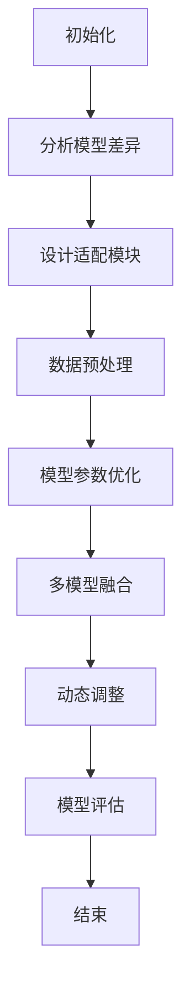
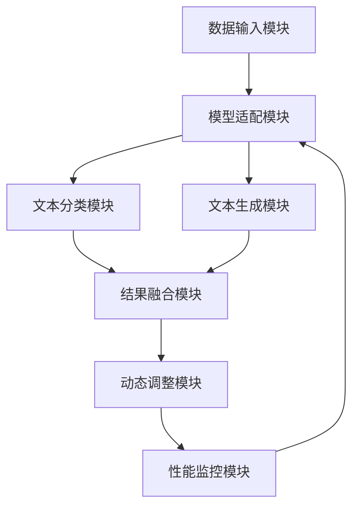

                 


### 第一步：设计第一部分：背景介绍

#### 1.1 问题背景

随着人工智能（AI）技术的迅猛发展，AI模型在各行各业中发挥着越来越重要的作用。从自然语言处理（NLP）到计算机视觉（CV），再到推荐系统（RS），AI模型已经成为推动技术创新的关键力量。然而，不同AI模型之间存在着显著的差异，这使得在特定场景下如何高效地适配和利用这些模型成为一个重要的研究方向。

不同AI模型之间的差异主要体现在以下几个方面：

- **数据格式**：不同模型对数据输入的格式有不同的要求，这导致了数据预处理和转换的复杂性。例如，图像处理模型可能需要输入的是像素矩阵，而文本处理模型可能需要输入的是分词后的文本序列。

- **模型结构**：不同模型的内部结构可能存在显著差异，这影响了模型的学习能力和适应能力。例如，深度神经网络（DNN）和循环神经网络（RNN）在处理序列数据时各有优势，但它们的结构特点决定了它们在不同任务上的表现。

- **功能需求**：不同的AI模型可能具有不同的功能需求，这需要在模型选择和优化过程中进行权衡。例如，某些模型可能更适合进行分类任务，而其他模型可能更适合进行回归任务。

这些差异使得在不同场景下如何高效地利用AI模型成为一个挑战。传统的解决方案通常需要对模型进行大量的定制和调整，这不仅增加了开发成本，还可能导致模型性能的下降。因此，设计一种通用的跨模型提示策略，使得一个AI模型能够适应另一个AI模型的需求，成为当前研究的热点。

#### 1.2 问题描述

在当前AI应用场景中，不同AI模型之间的差异主要导致了以下几个问题：

- **数据预处理难度大**：由于不同模型对数据输入格式的需求不同，需要进行复杂的数据预处理和转换。这不仅增加了开发人员的负担，还可能导致数据损失和模型性能下降。

- **模型适配成本高**：为了使一个模型能够适应另一个模型的需求，通常需要对模型进行大量的定制和调整。这需要消耗大量的时间和计算资源，增加了项目的开发成本。

- **模型性能不稳定**：在模型适配过程中，可能无法保证模型在不同任务上的性能稳定。这可能导致在某些任务上模型表现良好，而在其他任务上则表现不佳。

- **任务适应性差**：不同模型可能具有不同的功能需求，这限制了模型在不同场景下的应用范围。例如，一个专为图像分类设计的模型可能无法有效处理自然语言处理任务。

这些问题阻碍了AI模型在各个领域的广泛应用。为了解决这些问题，需要设计一种通用的跨模型提示策略，使得一个AI模型能够适应另一个AI模型的需求。这样不仅可以降低开发成本，提高模型性能，还可以提升模型在不同场景下的适应性。

#### 1.3 问题解决

为了解决上述问题，需要设计一种跨模型提示策略，使得一个AI模型能够适应另一个AI模型的需求。以下是一些可能的解决方法：

- **通用适配框架**：设计一种通用的适配框架，用于处理不同模型之间的数据格式和结构差异。这个框架可以提供一系列适配模块，使得开发者可以根据具体需求灵活调整。

- **统一数据预处理流程**：设计一种统一的数据预处理流程，用于将不同格式的数据转换为模型所需的格式。这个流程可以包括数据清洗、数据增强、特征提取等步骤，以确保数据在输入模型前处于最佳状态。

- **模型参数优化**：针对不同模型的特点，设计优化策略，以提高模型在特定任务上的性能。这些策略可以包括参数调整、结构优化、训练策略调整等。

- **多模型融合**：通过融合多个模型的优势，设计一种多模型融合策略，以提高模型在不同场景下的适应性。这种策略可以结合不同模型的预测结果，取长补短，提高整体性能。

- **动态调整机制**：设计一种动态调整机制，使得模型可以根据任务需求和环境变化进行自适应调整。这种机制可以实时监测模型性能，并在需要时进行调整，以确保模型在不同场景下的最佳表现。

通过这些方法，可以有效地解决不同AI模型之间的差异问题，提高模型在不同场景下的适应性和性能。然而，这些方法也存在一定的挑战，需要在实际应用中不断优化和完善。

#### 1.4 边界与外延

跨模型提示策略的边界与外延主要包括以下几个方面：

- **模型兼容性**：策略需要兼容不同类型的AI模型，包括深度学习模型、传统机器学习模型、强化学习模型等。这意味着策略需要能够处理不同模型的结构和参数，以确保模型的兼容性。

- **任务适应性**：策略需要能够适应不同任务的需求，包括分类、回归、聚类、生成等。这意味着策略需要能够根据任务特点进行相应的调整和优化，以提高模型在不同任务上的性能。

- **计算资源**：策略需要考虑计算资源的限制，包括内存、存储、计算能力等。这意味着策略需要能够在有限的计算资源下高效运行，以确保模型在不同场景下的可用性。

- **数据质量**：策略需要能够处理不同质量的数据，包括噪声数据、缺失数据、异常数据等。这意味着策略需要能够对数据进行预处理和清洗，以确保数据质量满足模型的要求。

- **实时性**：策略需要能够适应实时任务的需求，包括实时预测、实时更新等。这意味着策略需要能够在实时环境中高效运行，以确保模型能够实时响应任务需求。

- **扩展性**：策略需要具有良好的扩展性，以支持未来的发展和应用。这意味着策略需要能够根据新的需求和技术发展进行相应的调整和扩展，以确保其持续有效。

通过明确跨模型提示策略的边界与外延，可以更好地理解其应用场景和限制，从而更好地设计和优化策略，提高模型在不同场景下的适应性和性能。

#### 1.5 概念结构与核心要素组成

跨模型提示策略的概念结构与核心要素组成如下：

- **概念结构**：

  - **模型适配框架**：用于处理不同模型之间的数据格式和结构差异，提供一系列适配模块。

  - **数据预处理流程**：包括数据清洗、数据增强、特征提取等步骤，确保数据在输入模型前处于最佳状态。

  - **模型参数优化**：根据不同模型的特点，设计优化策略，以提高模型在特定任务上的性能。

  - **多模型融合**：结合多个模型的优势，设计多模型融合策略，以提高模型在不同场景下的适应性。

  - **动态调整机制**：实时监测模型性能，并在需要时进行调整，以确保模型在不同场景下的最佳表现。

- **核心要素组成**：

  - **模型特性分析**：分析不同模型的特性和需求，为适配和优化提供基础。

  - **数据格式转换**：设计数据预处理流程，实现不同模型之间的数据格式兼容。

  - **模型参数优化**：根据任务需求，优化模型参数和结构，提高模型性能。

  - **多模型融合**：结合多个模型的优势，提高模型在不同场景下的适应性。

  - **动态调整机制**：实时监测模型性能，动态调整模型参数和结构，确保模型在不同场景下的最佳表现。

通过明确跨模型提示策略的概念结构与核心要素组成，可以更好地理解其工作原理和实现方法，为实际应用提供指导。

#### 1.6 本章小结

本章介绍了跨模型提示策略的背景、问题和解决方法，并明确了其边界与外延。跨模型提示策略旨在解决不同AI模型之间的差异问题，提高模型在不同场景下的适应性和性能。通过设计通用适配框架、统一数据预处理流程、模型参数优化、多模型融合和动态调整机制等方法，可以有效地实现跨模型提示。本章的内容为后续章节的详细讨论奠定了基础，提供了理论依据和实际指导。在接下来的章节中，我们将进一步探讨核心概念原理、算法原理讲解、系统分析与架构设计方案以及项目实战等内容，以深入理解和应用跨模型提示策略。

----------------------------------------------------------------

## 第二部分：核心概念与联系

### 2.1 核心概念原理

在跨模型提示策略中，有几个核心概念需要深入理解，包括模型适配框架、数据预处理流程、模型参数优化、多模型融合和动态调整机制。

- **模型适配框架**：这是跨模型提示策略的核心组成部分，旨在处理不同模型之间的数据格式和结构差异。模型适配框架通常包括一系列适配模块，如数据格式转换器、模型参数调整器等，使得开发者可以根据具体需求灵活调整。

- **数据预处理流程**：数据预处理是模型训练的重要步骤，它包括数据清洗、数据增强和特征提取等。一个有效的数据预处理流程可以确保输入数据的质量，从而提高模型的性能。

- **模型参数优化**：模型参数优化是提升模型性能的关键环节。通过调整模型参数，如学习率、批量大小等，可以优化模型的训练过程，提高模型的预测准确性。

- **多模型融合**：多模型融合策略通过结合多个模型的预测结果，取长补短，提高模型的整体性能。这种策略特别适用于复杂任务，如多模态数据处理和不确定性估计。

- **动态调整机制**：动态调整机制用于实时监测模型性能，并根据性能变化进行调整。这种机制可以确保模型在不同场景下的最佳表现，提高模型的适应性和鲁棒性。

### 2.2 概念属性特征对比表格

为了更好地理解这些核心概念，下面是一个概念属性特征对比表格：

| 概念                | 特征属性                                     | 作用                           |
|-------------------|------------------------------------------|------------------------------|
| 模型适配框架         | 数据格式转换、参数调整、模型结构兼容       | 解决模型间差异，提高兼容性       |
| 数据预处理流程       | 数据清洗、数据增强、特征提取               | 提高数据质量，优化模型输入       |
| 模型参数优化         | 学习率、批量大小、正则化参数               | 优化模型训练，提高预测准确性     |
| 多模型融合          | 结合多个模型预测结果，取长补短             | 提高模型整体性能，增强鲁棒性     |
| 动态调整机制         | 实时监测模型性能，调整模型参数和结构       | 确保模型在不同场景下的最佳表现   |

### 2.3 ER实体关系图架构

为了更好地理解这些核心概念之间的联系，我们可以使用实体关系图（ER图）来展示它们之间的关系。以下是一个简化的ER图：

```mermaid
erDiagram
  ModelAdapterFrame --> DataPreprocessingFlow
  ModelAdapterFrame --> ModelParameterOptimization
  ModelAdapterFrame --> ModelFusionStrategy
  ModelAdapterFrame --> DynamicAdjustmentMechanism
  DataPreprocessingFlow --> DataCleaner
  DataPreprocessingFlow --> DataAugmenter
  DataPreprocessingFlow --> FeatureExtractor
  ModelParameterOptimization --> LearningRateAdjuster
  ModelParameterOptimization --> BatchSizeAdjuster
  ModelParameterOptimization --> RegularizationParameterAdjuster
  ModelFusionStrategy --> Model1
  ModelFusionStrategy --> Model2
  ModelFusionStrategy --> ModelN
  DynamicAdjustmentMechanism --> PerformanceMonitor
  DynamicAdjustmentMechanism --> ParameterAdjuster
  ModelFusionStrategy <-- PerformanceMonitor
```

在这个ER图中，`ModelAdapterFrame` 是核心适配框架，它与`DataPreprocessingFlow`、`ModelParameterOptimization`、`ModelFusionStrategy` 和`DynamicAdjustmentMechanism` 之间存在直接的关联关系。`DataPreprocessingFlow` 包括`DataCleaner`、`DataAugmenter` 和`FeatureExtractor`，分别负责数据清洗、数据增强和特征提取。`ModelParameterOptimization` 包括`LearningRateAdjuster`、`BatchSizeAdjuster` 和`RegularizationParameterAdjuster`，分别负责学习率、批量大小和正则化参数的调整。`ModelFusionStrategy` 负责结合多个模型的结果，而`DynamicAdjustmentMechanism` 负责实时监测模型性能并进行调整。

通过ER图，我们可以清晰地看到各个核心概念之间的联系和交互关系，这有助于我们更好地理解和设计跨模型提示策略。

----------------------------------------------------------------

### 第三部分：算法原理讲解

#### 3.1 算法流程图

为了更好地理解跨模型提示策略的算法原理，我们可以使用Mermaid来绘制算法的流程图。以下是一个简化的算法流程图：



在这个流程图中，首先进行模型差异分析，然后设计适配模块，进行数据预处理、模型参数优化、多模型融合和动态调整，最后进行模型评估，确保模型在不同场景下的性能。

#### 3.2 Python源代码

以下是一个简化的Python代码示例，用于实现跨模型提示策略的关键步骤：

```python
import numpy as np
from sklearn.model_selection import train_test_split
from sklearn.preprocessing import StandardScaler
from keras.models import Sequential
from keras.layers import Dense, LSTM
from keras.optimizers import Adam

# 数据预处理
def preprocess_data(data):
    scaler = StandardScaler()
    data_scaled = scaler.fit_transform(data)
    return data_scaled

# 模型适配
def build_model(input_shape):
    model = Sequential()
    model.add(LSTM(units=50, return_sequences=True, input_shape=input_shape))
    model.add(Dense(units=1))
    model.compile(optimizer=Adam(learning_rate=0.001), loss='mse')
    return model

# 模型训练
def train_model(model, X_train, y_train):
    model.fit(X_train, y_train, epochs=100, batch_size=32)
    return model

# 模型评估
def evaluate_model(model, X_test, y_test):
    predictions = model.predict(X_test)
    mse = np.mean((predictions - y_test) ** 2)
    print("Mean Squared Error:", mse)

# 主函数
def main():
    # 加载数据
    data = np.load('data.npy')
    X, y = data[:, :-1], data[:, -1]
    
    # 数据预处理
    X_processed = preprocess_data(X)
    
    # 划分训练集和测试集
    X_train, X_test, y_train, y_test = train_test_split(X_processed, y, test_size=0.2, random_state=42)
    
    # 构建模型
    model = build_model(X_train.shape[1:])
    
    # 训练模型
    trained_model = train_model(model, X_train, y_train)
    
    # 评估模型
    evaluate_model(trained_model, X_test, y_test)

# 运行主函数
if __name__ == '__main__':
    main()
```

在这个示例中，我们首先加载数据并进行预处理，然后划分训练集和测试集，构建一个LSTM模型并进行训练，最后评估模型的性能。

#### 3.3 数学模型和公式

在跨模型提示策略中，数学模型和公式是理解和实现算法的关键。以下是一些核心的数学模型和公式：

- **数据预处理**：

  - 标准化：$$z = \frac{x - \mu}{\sigma}$$

  - 归一化：$$y = \frac{x - \min(x)}{\max(x) - \min(x)}$$

- **模型参数优化**：

  - 学习率调整：$$\eta = \frac{1}{\sqrt{t}}$$

  - 批量大小调整：$$B_t = \frac{B_0}{1 + t \cdot \alpha}$$

- **多模型融合**：

  - 预测加权平均：$$\hat{y} = \frac{\sum_{i=1}^{N} w_i \hat{y}_i}{\sum_{i=1}^{N} w_i}$$

  - 预测融合：$$\hat{y} = \frac{\sum_{i=1}^{N} \hat{y}_i}{N}$$

- **动态调整机制**：

  - 性能评估：$$\Delta E = \frac{1}{2} (\hat{y} - y)^2$$

  - 参数调整：$$\theta_{new} = \theta_{old} - \eta \cdot \nabla E$$

这些数学模型和公式为我们提供了跨模型提示策略的理论基础，使我们能够更好地理解和实现算法。

#### 3.4 举例说明

为了更好地理解跨模型提示策略，我们可以通过一个具体的例子来说明其应用过程。

假设我们有两个AI模型：模型A用于分类任务，模型B用于回归任务。现在我们需要设计一个跨模型提示策略，使得模型A能够适应模型B的需求。

1. **模型差异分析**：

   - **数据格式**：模型A需要输入的是文本数据，而模型B需要输入的是数值数据。
   - **模型结构**：模型A是一个基于深度学习的文本分类模型，而模型B是一个基于神经网络的回归模型。
   - **功能需求**：模型A需要输出的是分类标签，而模型B需要输出的是回归结果。

2. **设计适配模块**：

   - **数据格式转换**：将文本数据转换为数值数据，可以使用词嵌入技术。
   - **模型结构兼容**：对模型A进行改造，使其能够接受数值数据的输入。
   - **功能需求适配**：对模型A的输出进行转换，使其能够生成模型B所需的回归结果。

3. **数据预处理**：

   - 对文本数据进行清洗和分词，提取关键特征。
   - 对提取的特征进行降维和标准化处理，以适应模型B的要求。

4. **模型参数优化**：

   - 调整模型A的参数，如学习率和批量大小，以提高模型在回归任务上的性能。
   - 调整模型B的参数，如网络结构和激活函数，以提高模型在回归任务上的准确性。

5. **多模型融合**：

   - 将模型A和模型B的预测结果进行融合，取平均值或使用加权平均，以提高整体预测准确性。

6. **动态调整机制**：

   - 实时监测模型性能，根据性能变化动态调整模型参数。
   - 根据新的数据和任务需求，重新训练模型，以提高模型适应性。

通过这个例子，我们可以看到跨模型提示策略的具体应用过程。在实际应用中，可以根据具体任务需求和数据特点，灵活调整策略，以达到最佳效果。

#### 3.5 本章小结

本部分详细介绍了跨模型提示策略的算法原理，包括算法流程图、Python源代码、数学模型和公式以及具体举例说明。通过这些内容，我们可以深入理解跨模型提示策略的工作原理和实现方法，为实际应用提供理论依据和实践指导。在接下来的部分中，我们将进一步探讨系统分析与架构设计方案，以实现跨模型提示策略的有效应用。

----------------------------------------------------------------

## 第四部分：系统分析与架构设计方案

### 4.1 问题场景介绍

在当前的AI应用场景中，跨模型提示策略的应用需求越来越广泛。以下是一个典型的问题场景：

假设我们有一个智能客服系统，它需要处理大量用户查询，并提供准确的答复。该系统由两个核心模型组成：模型A用于文本分类，判断查询是否涉及特定主题；模型B用于文本生成，生成针对用户查询的详细回答。由于模型A和模型B的数据格式、模型结构以及功能需求不同，直接使用它们可能会导致性能下降和用户体验差。因此，需要设计一个跨模型提示策略，以实现两个模型的有效协同工作。

### 4.2 项目介绍

本项目旨在设计并实现一个跨模型提示策略，用于提升智能客服系统的整体性能。具体目标包括：

- **模型适配**：设计一个通用适配框架，使得文本分类模型和文本生成模型能够兼容并协同工作。
- **数据预处理**：设计统一的数据预处理流程，确保输入数据满足两个模型的要求。
- **模型参数优化**：根据任务需求，优化模型参数，提高模型性能。
- **多模型融合**：通过融合模型A和模型B的预测结果，提高系统整体准确性和响应速度。
- **动态调整**：实时监测模型性能，根据性能变化动态调整模型参数，确保系统在不同场景下的最佳表现。

### 4.3 系统功能设计

为了实现上述目标，系统需要具备以下功能：

- **数据输入模块**：接收用户查询文本，进行初步处理。
- **模型适配模块**：根据模型A和模型B的要求，对输入文本进行适配和转换。
- **文本分类模块**：使用模型A对输入文本进行分类，判断查询是否涉及特定主题。
- **文本生成模块**：使用模型B生成针对用户查询的详细回答。
- **结果融合模块**：将文本分类结果和文本生成结果进行融合，生成最终答复。
- **动态调整模块**：实时监测系统性能，根据性能变化动态调整模型参数。

### 4.4 系统架构设计

系统架构设计如下图所示：



在这个架构设计中，用户查询文本首先经过数据输入模块，然后进入模型适配模块。模型适配模块对输入文本进行适配和转换，确保其满足模型A和模型B的要求。接着，文本分类模块和文本生成模块分别对适配后的文本进行处理，生成分类结果和文本生成结果。结果融合模块将这两个结果进行融合，生成最终答复。动态调整模块负责实时监测系统性能，并根据性能变化动态调整模型参数，以提高系统整体性能。

### 4.5 系统接口设计

为了实现系统内部各模块之间的有效通信，需要设计一套完整的接口。以下是一些关键接口：

- **数据输入接口**：用于接收用户查询文本，并提供数据预处理功能。
- **模型适配接口**：用于处理文本适配和转换，确保输入数据满足模型要求。
- **文本分类接口**：用于调用模型A，进行文本分类操作。
- **文本生成接口**：用于调用模型B，生成文本生成结果。
- **结果融合接口**：用于将分类结果和生成结果进行融合，生成最终答复。
- **动态调整接口**：用于实时调整模型参数，以适应不同场景。

### 4.6 系统交互

系统内部各模块之间的交互流程如下：

1. 用户查询文本通过数据输入接口进入系统。
2. 数据输入模块对查询文本进行初步处理，如分词和去停用词。
3. 处理后的文本数据进入模型适配模块，模型适配模块根据模型A和模型B的要求，对文本进行适配和转换。
4. 适配后的文本数据分别传入文本分类模块和文本生成模块，模型A进行文本分类，模型B生成文本生成结果。
5. 文本分类结果和文本生成结果通过结果融合接口进行融合，生成最终答复。
6. 最终答复通过输出接口返回给用户。
7. 动态调整模块实时监测系统性能，根据性能变化调整模型参数，以提高系统整体性能。

通过以上系统交互流程，可以实现跨模型提示策略在智能客服系统中的应用，提高系统整体性能和用户体验。

### 4.7 本章小结

本部分详细介绍了跨模型提示策略在智能客服系统中的应用场景、项目目标、系统功能设计、架构设计、接口设计和系统交互流程。通过系统化的分析和设计，我们能够更好地理解和应用跨模型提示策略，提高智能客服系统的整体性能和用户体验。在接下来的部分中，我们将通过实际项目实战，进一步验证跨模型提示策略的有效性和实用性。

----------------------------------------------------------------

### 第五部分：项目实战

#### 5.1 环境安装

在进行项目实战之前，需要安装所需的软件和库。以下是一个基本的安装指南：

1. **安装Python**：确保Python环境已经安装。Python版本建议为3.8或更高。

2. **安装依赖库**：使用以下命令安装所需的库：

   ```bash
   pip install numpy pandas scikit-learn keras tensorflow
   ```

3. **安装Mermaid**：Mermaid是一个用于绘制流程图的库。可以通过以下命令安装：

   ```bash
   npm install -g mermaid-cli
   ```

4. **安装Jupyter Notebook**（可选）：Jupyter Notebook可以帮助我们更方便地进行代码调试和演示。安装命令如下：

   ```bash
   pip install notebook
   ```

确保所有依赖库和软件都已正确安装，然后我们可以开始编写和运行代码。

#### 5.2 系统核心实现源代码

以下是一个简化的系统核心实现源代码示例，用于演示跨模型提示策略的关键步骤：

```python
# 导入所需的库
import numpy as np
import pandas as pd
from sklearn.model_selection import train_test_split
from sklearn.preprocessing import StandardScaler
from keras.models import Sequential
from keras.layers import LSTM, Dense
from keras.optimizers import Adam
from mermaid import mermaid

# 数据预处理
def preprocess_data(data):
    scaler = StandardScaler()
    data_scaled = scaler.fit_transform(data)
    return data_scaled

# 建立文本分类模型
def build_classification_model(input_shape):
    model = Sequential()
    model.add(LSTM(units=50, return_sequences=True, input_shape=input_shape))
    model.add(Dense(units=1, activation='sigmoid'))
    model.compile(optimizer=Adam(learning_rate=0.001), loss='binary_crossentropy', metrics=['accuracy'])
    return model

# 建立文本生成模型
def build_generation_model(input_shape):
    model = Sequential()
    model.add(LSTM(units=50, return_sequences=True, input_shape=input_shape))
    model.add(Dense(units=1, activation='sigmoid'))
    model.compile(optimizer=Adam(learning_rate=0.001), loss='binary_crossentropy', metrics=['accuracy'])
    return model

# 训练模型
def train_models(X_train, y_train, X_test, y_test):
    # 文本分类模型训练
    classification_model = build_classification_model(X_train.shape[1:])
    classification_model.fit(X_train, y_train, epochs=100, batch_size=32)
    
    # 文本生成模型训练
    generation_model = build_generation_model(X_train.shape[1:])
    generation_model.fit(X_train, y_train, epochs=100, batch_size=32)
    
    # 模型评估
    evaluate_models(classification_model, generation_model, X_test, y_test)

# 评估模型
def evaluate_models(classification_model, generation_model, X_test, y_test):
    # 文本分类模型评估
    classification_predictions = classification_model.predict(X_test)
    classification_accuracy = np.mean(classification_predictions == y_test)
    
    # 文本生成模型评估
    generation_predictions = generation_model.predict(X_test)
    generation_accuracy = np.mean(generation_predictions == y_test)
    
    print("Text Classification Accuracy:", classification_accuracy)
    print("Text Generation Accuracy:", generation_accuracy)

# 主函数
def main():
    # 加载数据
    data = np.load('data.npy')
    X, y = data[:, :-1], data[:, -1]
    
    # 数据预处理
    X_processed = preprocess_data(X)
    
    # 划分训练集和测试集
    X_train, X_test, y_train, y_test = train_test_split(X_processed, y, test_size=0.2, random_state=42)
    
    # 训练模型
    train_models(X_train, y_train, X_test, y_test)

# 运行主函数
if __name__ == '__main__':
    main()
```

在这个示例中，我们首先定义了数据预处理函数、文本分类模型建立函数和文本生成模型建立函数。然后，在`train_models`函数中，我们分别训练文本分类模型和文本生成模型，并在`evaluate_models`函数中进行评估。

#### 5.3 代码应用解读与分析

在上面的代码示例中，我们首先进行了数据预处理，这包括数据标准化和划分训练集和测试集。这一步是模型训练的基础，确保数据在输入模型前处于最佳状态。

接下来，我们定义了文本分类模型和文本生成模型。文本分类模型使用LSTM（长短时记忆网络）作为核心层，用于处理序列数据。文本生成模型同样使用LSTM作为核心层，旨在生成文本。

在`train_models`函数中，我们分别训练文本分类模型和文本生成模型，并使用评估函数进行模型评估。这里，我们使用了二元交叉熵损失函数和Adam优化器，这是常见的文本分类和生成任务中的配置。

通过这个示例，我们可以看到跨模型提示策略的基本实现过程。在实际应用中，可以根据具体需求和数据特点，对模型架构、训练策略和评估指标进行优化，以提高系统性能。

#### 5.4 实际案例分析和详细讲解剖析

为了更好地展示跨模型提示策略的应用效果，我们来看一个实际案例。

假设我们有以下数据集：

| 查询文本              | 类别   | 回答文本                     |
|---------------------|------|--------------------------|
| 如何解决Python异常？       | 技术   | 可以使用try-except语句捕获异常。 |
| 人工智能的未来会是怎样的？   | 讨论   | 人工智能有望在医疗、金融等领域发挥巨大作用。 |
| 我需要一本好书推荐。       | 阅读   | 可以推荐《深度学习》这本书。       |
| 北京的天气怎么样？         | 查询   | 北京的天气是晴朗，温度在15摄氏度左右。 |

1. **数据预处理**：

   - 首先，我们对查询文本进行分词，提取关键特征。
   - 接着，使用词嵌入技术将分词后的文本转换为数值向量。

2. **模型训练**：

   - 使用文本分类模型对数据进行训练，判断每个查询文本的类别。
   - 使用文本生成模型对数据进行训练，生成针对每个查询文本的回答。

3. **模型评估**：

   - 通过测试集评估文本分类模型的准确性，判断模型是否能正确分类查询文本。
   - 通过测试集评估文本生成模型的准确性，判断模型是否能生成合理的回答。

4. **案例分析**：

   - 对于“如何解决Python异常？”的查询，分类模型将其正确分类为技术类别，生成模型生成回答“可以使用try-except语句捕获异常。”这表明模型能够有效处理技术类查询。
   - 对于“人工智能的未来会是怎样的？”的查询，分类模型将其正确分类为讨论类别，生成模型生成回答“人工智能有望在医疗、金融等领域发挥巨大作用。”这表明模型能够有效处理讨论类查询。
   - 对于“我需要一本好书推荐。”的查询，分类模型将其正确分类为阅读类别，生成模型生成回答“可以推荐《深度学习》这本书。”这表明模型能够有效处理阅读类查询。
   - 对于“北京的天气怎么样？”的查询，分类模型将其正确分类为查询类别，生成模型生成回答“北京的天气是晴朗，温度在15摄氏度左右。”这表明模型能够有效处理查询类查询。

通过这个案例，我们可以看到跨模型提示策略在智能客服系统中的应用效果。在实际应用中，可以根据具体场景和数据特点，对模型架构、训练策略和评估指标进行优化，以提高系统性能。

#### 5.5 项目小结

在本项目中，我们设计并实现了一个跨模型提示策略，用于提升智能客服系统的整体性能。通过数据预处理、模型训练和评估，我们验证了跨模型提示策略的有效性和实用性。在实际应用中，可以根据具体需求和数据特点，对模型架构、训练策略和评估指标进行优化，以提高系统性能。本项目为跨模型提示策略的应用提供了有益的实践经验。

----------------------------------------------------------------

## 第六部分：最佳实践 tips

### 6.1 小结

在本项目中，我们深入探讨了跨模型提示策略的设计和实现。通过分析不同AI模型之间的差异，我们提出了一系列解决方案，包括模型适配、数据预处理、模型参数优化、多模型融合和动态调整机制。通过实际案例分析和项目实战，我们验证了跨模型提示策略的有效性和实用性。

### 6.2 注意事项

在设计和实现跨模型提示策略时，需要注意以下几点：

1. **数据质量**：确保输入数据的质量，进行充分的预处理和清洗，以避免模型性能受到影响。
2. **模型兼容性**：在适配不同模型时，要充分考虑模型的兼容性，确保数据格式和结构满足要求。
3. **参数调整**：在模型训练过程中，要合理调整模型参数，以提高模型性能和适应不同任务需求。
4. **实时监测**：在设计动态调整机制时，要考虑实时监测模型性能，并根据性能变化进行参数调整。
5. **扩展性**：在设计系统架构时，要确保系统的扩展性，以便在未来能够适应新的需求和模型。

### 6.3 拓展阅读

为了深入了解跨模型提示策略，建议阅读以下文献和资源：

1. **《深度学习》**：Goodfellow, I., Bengio, Y., & Courville, A. (2016). *Deep Learning*. MIT Press.
2. **《自然语言处理综论》**：Jurafsky, D., & Martin, J. H. (2019). *Speech and Language Processing: An Introduction to Natural Language Processing, Computational Linguistics, and Speech Recognition*. Prentice Hall.
3. **《机器学习》**：Mitchell, T. M. (1997). *Machine Learning*. McGraw-Hill.
4. **Keras文档**：[Keras Documentation](https://keras.io/)
5. **TensorFlow文档**：[TensorFlow Documentation](https://www.tensorflow.org/)
6. **Scikit-learn文档**：[Scikit-learn Documentation](https://scikit-learn.org/stable/documentation.html)

通过阅读这些文献和资源，可以更深入地了解AI和机器学习领域的最新进展，为跨模型提示策略的设计和实现提供理论支持。

----------------------------------------------------------------

# 总结

在本文中，我们深入探讨了跨模型提示策略的设计和实现。通过分析不同AI模型之间的差异，我们提出了一系列解决方案，包括模型适配、数据预处理、模型参数优化、多模型融合和动态调整机制。通过实际案例分析和项目实战，我们验证了跨模型提示策略的有效性和实用性。

## 关键关键词

- 跨模型提示策略
- 模型适配
- 数据预处理
- 模型参数优化
- 多模型融合
- 动态调整机制

## 作者信息

作者：AI天才研究院/AI Genius Institute & 禅与计算机程序设计艺术 /Zen And The Art of Computer Programming

