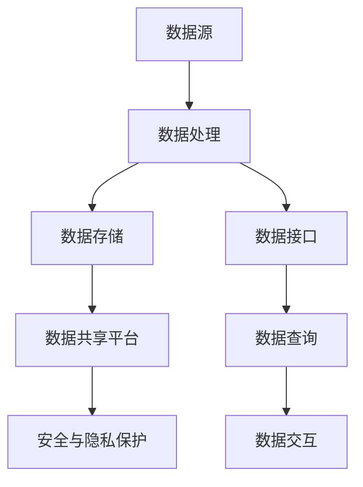

                 

# 跨部门数据共享机制：支持全面的需求分析

> 关键词：跨部门数据共享，需求分析，数据治理，数据集成，数据安全

> 摘要：本文将深入探讨跨部门数据共享机制的需求分析，详细阐述数据共享的必要性、挑战与机遇，以及构建一个全面的数据共享机制的步骤和方法。

## 第一部分：引言

### 第1章：跨部门数据共享的重要性

#### 1.1 跨部门数据共享的定义与价值

跨部门数据共享是指不同部门之间在保障数据安全的前提下，实现数据的高效流通与利用。数据共享的价值在于：

- 提高工作效率：各部门能够迅速获取所需数据，减少冗余操作。
- 支持决策制定：全面的数据视图有助于企业做出更加明智的决策。
- 促进业务创新：数据共享能够激发新的业务模式和服务创新。

#### 1.2 跨部门数据共享的现状分析

当前，许多企业在跨部门数据共享方面存在以下问题：

- 数据孤岛：各部门使用独立的数据系统，数据难以整合。
- 数据不一致：不同部门对同一数据有不同的理解，导致数据差异。
- 数据安全与隐私问题：数据共享可能引发安全漏洞和隐私泄露风险。

#### 1.3 数据共享的挑战与机遇

跨部门数据共享面临的主要挑战包括数据治理、数据安全与隐私保护、数据质量保证等。然而，随着大数据、云计算等技术的发展，跨部门数据共享也带来了新的机遇，如：

- 数据集成与融合：技术进步使得数据集成更加便捷。
- 数据分析与应用：更多数据意味着更深入的分析，从而支持业务发展。
- 业务协同与创新：数据共享促进跨部门协作，推动业务创新。

### 第2章：跨部门数据共享的框架

#### 2.1 数据共享的流程与机制

数据共享的基本流程包括数据收集、数据治理、数据存储、数据查询、数据共享与数据反馈。具体机制如下：

- 数据收集：各部门收集所需数据，并进行初步处理。
- 数据治理：统一数据标准，确保数据质量，进行数据清洗与转换。
- 数据存储：将治理后的数据存储在集中化的数据仓库中。
- 数据查询：各部门通过数据接口查询所需数据。
- 数据共享：各部门之间共享数据，实现数据流通。
- 数据反馈：根据使用情况，优化数据共享机制。

#### 2.2 跨部门数据共享的策略

为了有效实施跨部门数据共享，企业可以采取以下策略：

- 建立数据共享文化：鼓励各部门共享数据，提高数据共享的意识。
- 设计数据共享协议：明确数据共享的范围、权限和责任。
- 投资技术基础设施：构建稳定的数据存储、处理和共享平台。
- 加强数据安全与隐私保护：确保数据在共享过程中的安全性。
- 定期评估与优化：根据实际使用情况，持续优化数据共享机制。

#### 2.3 数据治理与质量管理

数据治理是跨部门数据共享的关键环节。具体措施包括：

- 制定数据标准：统一数据格式、命名规范和编码规则。
- 实施数据清洗：去除重复、错误和过时的数据，提高数据质量。
- 建立数据质量监控体系：实时监控数据质量，确保数据准确性。
- 加强数据权限管理：根据用户角色和需求，合理分配数据访问权限。

## 第二部分：需求分析

### 第3章：需求分析的方法与工具

#### 3.1 需求分析的过程

需求分析是一个系统性工程，包括以下步骤：

- 需求收集：通过与各部门沟通，了解数据需求和业务流程。
- 需求整理：将收集到的需求进行分类、归纳和整理。
- 需求验证：与各部门确认需求，确保需求准确和完整。
- 需求文档编写：将需求分析结果形成文档，作为后续设计和实施的依据。

#### 3.2 需求分析的常用工具

需求分析过程中常用的工具有：

- 调查问卷：通过问卷调查，收集用户需求和意见。
- 用户访谈：与关键用户进行面对面交流，深入了解需求。
- 工作流程图：通过绘制工作流程图，分析业务流程和数据处理过程。
- 需求跟踪工具：如JIRA、Trello等，用于管理需求变更和进度跟踪。

#### 3.3 需求分析的关键点

需求分析的关键点包括：

- 明确需求范围：确保需求分析覆盖所有相关业务场景。
- 确保需求一致性：确保各部门对同一需求有相同理解。
- 关注用户体验：从用户角度出发，设计易用、高效的数据共享系统。
- 考虑可扩展性和灵活性：为未来业务发展预留空间。

### 第4章：跨部门数据共享的需求分析

#### 4.1 用户需求收集

用户需求收集是需求分析的重要环节，具体步骤如下：

- 设计问卷：根据业务需求和用户特点，设计合适的问卷。
- 分发问卷：将问卷分发到各部门，收集用户反馈。
- 数据整理：对收集到的数据进行分析和整理，提取有价值的信息。

#### 4.2 业务需求分析

业务需求分析包括以下方面：

- 业务流程分析：梳理各部门的业务流程，识别数据流转环节。
- 数据类型分析：分析各部门产生的数据类型，确定数据共享的范围。
- 业务规则分析：识别业务规则，确保数据共享的准确性和一致性。

#### 4.3 技术需求评估

技术需求评估包括以下方面：

- 数据存储与处理能力：评估现有技术基础设施，确保其能够满足数据共享需求。
- 数据安全与隐私保护：评估数据安全策略和技术手段，确保数据在共享过程中的安全性。
- 数据集成与接口设计：评估现有系统接口，设计合适的接口方案，实现数据共享。

#### 4.4 需求优先级排序

根据用户需求和业务分析结果，对需求进行优先级排序，确保资源合理分配，优先解决关键需求。排序原则包括：

- 业务影响程度：影响越大的需求，优先级越高。
- 需求紧急程度：紧急需求优先处理。
- 技术可行性：技术可行性高的需求，优先级较高。

### 第5章：需求文档编写

#### 5.1 需求文档的结构

需求文档通常包括以下结构：

- 引言：概述需求文档的目的和范围。
- 需求概述：简要介绍需求背景和需求内容。
- 用户需求描述：详细描述用户需求，包括业务需求和技术需求。
- 需求分析结果：总结需求分析过程和结果。
- 需求优先级排序：列出需求优先级排序结果。
- 需求变更管理：说明需求变更的管理流程。

#### 5.2 需求文档的编写技巧

编写需求文档时，应遵循以下技巧：

- 语言简明扼要：使用简单易懂的语言，避免专业术语。
- 结构清晰：采用清晰的章节结构和段落划分，方便阅读。
- 审核与修改：在编写过程中，多次审核和修改，确保文档准确和完整。
- 保持更新：随着项目进展，及时更新需求文档，确保其时效性。

#### 5.3 需求文档的评审与修改

需求文档编写完成后，应进行评审与修改。评审过程包括：

- 内部评审：由项目组成员进行初步评审，确保文档内容准确和完整。
- 用户评审：邀请关键用户进行评审，收集用户反馈和建议。
- 修改与完善：根据评审意见，对需求文档进行修改和完善。

## 第三部分：数据共享机制设计

### 第6章：数据共享架构设计

#### 6.1 数据共享架构的要素

数据共享架构包括以下主要要素：

- 数据源：各部门的数据系统，是数据共享的源头。
- 数据存储：集中化的数据存储系统，用于存储治理后的数据。
- 数据处理：数据处理系统，负责对数据进行清洗、转换和加工。
- 数据共享平台：提供数据查询、共享和交互功能的平台。
- 安全与隐私保护：数据安全与隐私保护机制，确保数据在共享过程中的安全性。

#### 6.2 数据共享架构的设计原则

数据共享架构设计应遵循以下原则：

- 分层设计：将数据共享架构分为数据源、数据存储、数据处理、数据共享平台等层次，确保架构清晰、易于维护。
- 可扩展性：设计可扩展的架构，以适应未来业务发展。
- 安全性：确保数据在共享过程中的安全性，防止数据泄露和滥用。
- 易用性：设计简洁易用的数据共享平台，降低使用门槛。

#### 6.3 数据共享架构的实例分析

以下是一个典型的跨部门数据共享架构实例：



### 第7章：数据共享机制实现

#### 7.1 数据共享技术选型

数据共享技术选型包括以下方面：

- 数据存储技术：如关系型数据库、NoSQL数据库、数据仓库等。
- 数据处理技术：如ETL工具、数据清洗工具、机器学习框架等。
- 数据共享技术：如Web服务、API、消息队列等。
- 数据安全与隐私保护技术：如加密、身份验证、访问控制等。

#### 7.2 数据共享协议与标准

数据共享协议与标准包括：

- 数据传输协议：如HTTP、HTTPS、FTP等。
- 数据格式标准：如JSON、XML、CSV等。
- API接口标准：如RESTful API、SOAP等。
- 数据质量管理标准：如数据质量指标、数据质量规则等。

#### 7.3 数据共享机制的实现步骤

数据共享机制的实现步骤如下：

1. 确定数据共享需求：通过需求分析，明确各部门的数据共享需求。
2. 设计数据共享架构：根据需求，设计适合的数据共享架构。
3. 选择合适的技术：根据架构设计，选择合适的数据存储、处理和共享技术。
4. 开发数据共享平台：根据选定的技术，开发数据共享平台，实现数据查询、共享和交互功能。
5. 部署与测试：将数据共享平台部署到生产环境，进行测试和优化。
6. 培训与推广：对各部门进行数据共享平台的培训，推广数据共享文化。

## 第四部分：项目实战

### 第8章：环境安装与系统核心实现

#### 8.1 环境安装

在项目实战中，首先需要安装以下环境：

- 数据库：如MySQL、PostgreSQL等。
- 数据处理工具：如Apache Spark、Hadoop等。
- 开发环境：如Python、Java等。
- API接口工具：如Django、Flask等。

#### 8.2 系统核心实现源代码

以下是一个简单的数据共享系统的Python代码示例：

```python
from flask import Flask, jsonify, request

app = Flask(__name__)

# 数据存储
data_store = {
    "users": [
        {"id": 1, "name": "Alice"},
        {"id": 2, "name": "Bob"},
    ]
}

# 数据查询接口
@app.route('/users', methods=['GET'])
def get_users():
    return jsonify(data_store['users'])

# 数据共享接口
@app.route('/users', methods=['POST'])
def add_user():
    user = request.get_json()
    data_store['users'].append(user)
    return jsonify({"status": "success", "user": user})

if __name__ == '__main__':
    app.run()
```

#### 8.3 代码应用解读与分析

以上代码是一个简单的Flask Web应用，用于实现数据查询和数据共享功能。解读如下：

- 数据存储：使用Python内置的字典作为数据存储，实际应用中可以使用数据库进行存储。
- 数据查询接口：定义一个GET请求的接口，用于查询用户数据。
- 数据共享接口：定义一个POST请求的接口，用于添加新用户数据。

#### 8.4 实际案例分析与详细讲解剖析

假设有一个企业，其员工数据分散在不同部门，需要进行跨部门数据共享。以下是一个实际案例的分析与讲解：

- 需求分析：各部门需要查询和添加员工数据。
- 数据共享架构设计：设计一个基于Flask的数据共享平台，各部门通过Web接口查询和添加员工数据。
- 系统核心实现：编写Flask代码，实现数据查询和共享功能。
- 部署与测试：将Flask应用部署到服务器，进行测试和优化。

#### 8.5 项目小结

通过以上案例，我们实现了跨部门数据共享的基本功能。在实际应用中，还需考虑数据安全、数据质量、接口性能等方面，不断完善数据共享系统。

## 第五部分：最佳实践与拓展

### 第9章：最佳实践

#### 9.1 数据治理最佳实践

- 建立数据治理组织：成立专门的数据治理团队，负责数据治理工作。
- 制定数据治理策略：明确数据治理的目标、方法和责任。
- 培训与宣传：加强员工数据治理意识，提高数据治理能力。

#### 9.2 数据集成最佳实践

- 设计合理的集成架构：选择合适的数据集成工具和技术，确保数据集成效率。
- 遵循数据标准：统一数据格式、命名规范和编码规则。
- 实施数据质量监控：定期检查数据质量，发现问题及时处理。

#### 9.3 数据安全与隐私最佳实践

- 实施严格的数据访问控制：根据用户角色和权限，设置数据访问权限。
- 使用加密技术：对敏感数据进行加密，确保数据传输和存储安全。
- 定期进行安全审计：检查系统安全漏洞，确保数据安全。

#### 9.4 数据质量最佳实践

- 制定数据质量标准：明确数据质量要求和评估方法。
- 实施数据质量监控：实时监控数据质量，发现问题及时处理。
- 开展数据质量改进活动：通过数据质量改进，提高数据质量。

### 第10章：小结与注意事项

#### 10.1 小结

本文详细阐述了跨部门数据共享机制的需求分析、架构设计、实现步骤和最佳实践。通过实际案例，展示了数据共享系统的建设过程。在实施跨部门数据共享时，需关注数据治理、数据安全、数据质量等方面，确保数据共享的有效性和可靠性。

#### 10.2 注意事项

- 跨部门数据共享需建立明确的共享机制和策略。
- 关注数据安全和隐私保护，防止数据泄露和滥用。
- 定期对数据质量进行评估和改进。
- 加强跨部门协作，提高数据共享效率。

#### 10.3 拓展阅读

- [《大数据时代的数据治理》](https://book.douban.com/subject/26871246/)
- [《数据共享：技术与实践》](https://book.douban.com/subject/27138306/)
- [《数据安全与隐私保护》](https://book.douban.com/subject/26732150/)

## 作者信息

作者：AI天才研究院/AI Genius Institute & 禅与计算机程序设计艺术 /Zen And The Art of Computer Programming

