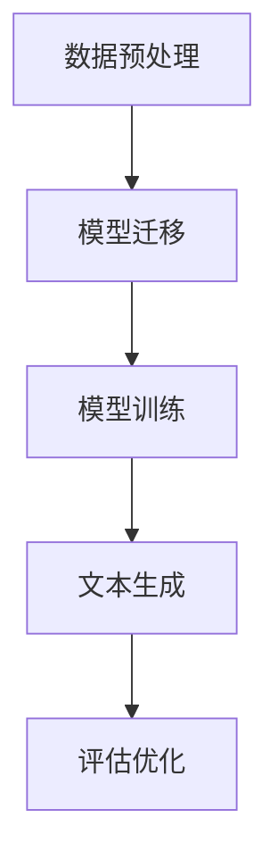

                 

### 迁移学习在AIGC模型跨语言迁移中的作用

#### 关键词：
- 迁移学习
- AIGC模型
- 跨语言迁移
- 深度学习
- 人工智能

#### 摘要：
本文深入探讨了迁移学习在自适应人工智能生成内容（AIGC）模型跨语言迁移中的应用。首先介绍了迁移学习的基本概念和发展历程，接着阐述了AIGC模型及其在跨语言迁移中的重要性。随后，详细分析了迁移学习在AIGC模型中的关键概念和原理，并通过Python源代码和数学模型进行了举例说明。文章还讨论了AIGC模型跨语言迁移的系统架构设计，并通过实际项目案例展示了迁移学习的应用效果。最后，文章总结了最佳实践和注意事项，并提供了拓展阅读建议。

---

#### 目录

1. 背景介绍
    1.1 迁移学习概述
    1.2 AIGC模型基础
    1.3 迁移学习与AIGC模型的关联
2. 核心概念与联系
    2.1 迁移学习机制
    2.2 迁移学习策略
    2.3 迁移学习与AIGC模型的结合
3. 算法原理讲解
    3.1 算法概述
    3.2 算法mermaid流程图
    3.3 Python源代码解释
    3.4 数学模型与公式
    3.5 举例说明
4. 系统分析与架构设计
    4.1 问题场景介绍
    4.2 系统功能设计
    4.3 系统架构设计
    4.4 系统接口设计
    4.5 系统交互流程
5. 项目实战与案例剖析
    5.1 环境安装与准备
    5.2 系统核心实现源代码
    5.3 代码应用解读与分析
    5.4 实际案例分析与讲解
    5.5 项目小结
6. 最佳实践与拓展阅读
    6.1 最佳实践
    6.2 拓展阅读
    6.3 未来发展趋势

---

#### 第一部分：背景介绍

##### 1.1 迁移学习概述

迁移学习（Transfer Learning）是机器学习中的一种重要技术，它通过将一个任务（源任务）学习到的知识应用到另一个相关任务（目标任务）中，以提高目标任务的性能。在传统的机器学习方法中，每个任务都需要从零开始训练模型，这往往需要大量的数据和计算资源。而迁移学习则利用了预先训练的模型，通过迁移部分参数来减少训练时间和提高模型的泛化能力。

迁移学习的基本概念可以概括为以下几点：

- **源任务**：已经完成的任务，其模型参数可以作为迁移的基础。
- **目标任务**：需要解决的新任务，可以从源任务中受益。
- **迁移策略**：将源任务的知识转移到目标任务的方法。

迁移学习的发展历程可以追溯到上世纪80年代的“知识蒸馏”概念，随后经历了“深度迁移学习”和“多任务学习”等阶段。近年来，随着深度学习技术的发展，迁移学习在计算机视觉、自然语言处理等领域取得了显著成果。

##### 1.2 迁移学习的发展历程

1. **知识蒸馏（Knowledge Distillation）**
   - 提出者：Yoshua Bengio等
   - 时间：1989年
   - 核心思想：将一个大模型（教师模型）的知识传递给一个小模型（学生模型）。

2. **深度迁移学习（Deep Transfer Learning）**
   - 提出者：Yann LeCun等
   - 时间：2012年
   - 核心思想：使用预训练的深度神经网络进行迁移学习，适用于图像和语音识别等任务。

3. **多任务学习（Multi-Task Learning）**
   - 提出者：Andrew Ng等
   - 时间：2014年
   - 核心思想：同时训练多个相关任务，共享模型参数，提高模型泛化能力。

4. **元学习（Meta-Learning）**
   - 提出者：Andrew Ng等
   - 时间：2016年
   - 核心思想：通过学习学习过程来提高模型的适应性和迁移能力。

##### 1.3 迁移学习的应用领域

迁移学习在多个领域都有广泛的应用，以下是一些典型的应用场景：

- **计算机视觉**：例如，使用预训练的卷积神经网络进行图像分类、目标检测等任务。
- **自然语言处理**：例如，使用预训练的语言模型进行文本分类、机器翻译等任务。
- **语音识别**：例如，使用预训练的声学模型进行语音识别。
- **医学诊断**：例如，利用迁移学习进行疾病诊断，提高模型在数据稀缺情况下的性能。
- **无人驾驶**：例如，利用迁移学习减少自动驾驶系统在不同场景下的训练时间。

##### 1.4 迁移学习的重要性

迁移学习的重要性主要体现在以下几个方面：

- **资源节约**：通过利用预训练模型，可以显著减少数据收集和模型训练所需的计算资源。
- **模型泛化能力提升**：迁移学习可以提高模型在不同任务上的泛化能力，从而减少对特定领域数据的依赖。
- **快速适应新任务**：迁移学习可以加速新任务的学习过程，提高模型在实际应用中的响应速度。

##### 1.5 AIGC模型基础

自适应人工智能生成内容（AIGC）模型是一种新兴的人工智能技术，它通过自动生成内容来满足用户的需求。AIGC模型的核心思想是利用预训练的模型和大规模数据集，通过训练和调整模型参数，生成高质量的内容。

AIGC模型的发展可以分为以下几个阶段：

- **初级阶段**：简单的文本生成模型，如基于规则的方法和统计模型。
- **中级阶段**：基于生成对抗网络（GAN）和变分自编码器（VAE）的模型，如StyleGAN和BERT。
- **高级阶段**：结合多模态数据和多任务学习的AIGC模型，如AutoGAN和GPT-3。

AIGC模型的特点包括：

- **自适应**：能够根据用户需求自动调整生成的内容。
- **多模态**：能够处理文本、图像、音频等多种类型的数据。
- **高效**：通过预训练和迁移学习，显著减少训练时间和计算资源需求。

##### 1.6 AIGC模型在跨语言迁移中的作用

跨语言迁移是指将一个语言中的知识应用到另一个语言中的过程。在多语言环境下，跨语言迁移对于提高机器翻译、多语言文本生成等任务的性能至关重要。

AIGC模型在跨语言迁移中的作用主要体现在以下几个方面：

- **共享知识**：通过预训练模型，将多种语言的知识共享给不同语言的任务。
- **减少数据依赖**：通过迁移学习，减少对特定语言数据集的依赖，提高模型在语言数据稀缺情况下的性能。
- **提高泛化能力**：通过跨语言迁移，模型能够更好地适应不同语言的环境，提高泛化能力。

##### 1.7 迁移学习与AIGC模型的关联

迁移学习与AIGC模型之间存在着密切的联系。迁移学习为AIGC模型提供了有效的知识共享和模型泛化能力，而AIGC模型则为迁移学习提供了丰富的应用场景。

具体来说，迁移学习在AIGC模型中的应用包括：

- **模型预训练**：通过迁移学习，将预训练模型的知识迁移到AIGC模型中，提高模型生成内容的质量。
- **多语言处理**：通过跨语言迁移，将一个语言中的知识应用到其他语言中，提高多语言AIGC模型的性能。
- **多模态生成**：通过迁移学习，将不同模态的数据知识迁移到AIGC模型中，实现多模态内容的自动生成。

#### 总结

迁移学习在AIGC模型跨语言迁移中发挥着重要作用。通过迁移学习，可以共享知识、减少数据依赖、提高模型的泛化能力，从而实现更高效、更准确的跨语言内容生成。随着AIGC模型和迁移学习技术的不断发展，未来有望在更多领域实现突破性的应用。

---

在接下来的部分，我们将详细探讨迁移学习的核心概念和原理，包括迁移学习机制、迁移学习策略以及迁移学习与AIGC模型的结合。通过这些内容的深入分析，读者将能够更好地理解迁移学习在AIGC模型跨语言迁移中的具体应用。

#### 第二部分：核心概念与联系

##### 2.1 迁移学习机制

迁移学习机制是迁移学习过程中的一系列方法和原理，它决定了如何将源任务的模型知识有效转移到目标任务。以下将详细介绍迁移学习机制的核心概念：

1. **源任务与目标任务**：
   - 源任务（Source Task）：已经完成的任务，其模型参数可以作为迁移的基础。
   - 目标任务（Target Task）：需要解决的新任务，可以从源任务中受益。

2. **迁移策略**：
   - 迁移策略（Transfer Strategy）：将源任务的知识转移到目标任务的方法。常见的迁移策略包括：
     - **参数共享**：共享源任务和目标任务的模型参数。
     - **特征提取**：从源任务中提取通用的特征表示，然后用于目标任务。
     - **多任务学习**：同时训练多个相关任务，共享模型参数。
     - **元学习**：通过学习学习过程来提高模型的适应性和迁移能力。

3. **迁移效果度量**：
   - 迁移效果度量（Transfer Effectiveness Measure）：用于评估迁移学习过程的性能。常见的度量指标包括：
     - **模型准确率**：目标任务的预测准确率。
     - **泛化误差**：目标任务的泛化误差，包括训练误差和验证误差。
     - **迁移性能增益**：迁移前后目标任务性能的提升程度。

##### 2.2 迁移学习策略

迁移学习策略是指在迁移学习过程中，如何选择和调整源任务与目标任务的模型参数，以实现最佳的迁移效果。以下将详细介绍几种常见的迁移学习策略：

1. **基于特征的迁移学习**：
   - 核心思想：从源任务中提取通用的特征表示，然后用于目标任务。
   - 实现方法：
     - **特征提取器**：使用预训练模型作为特征提取器，提取源任务和目标任务的输入特征。
     - **特征融合**：将源任务和目标任务的输入特征进行融合，形成统一的特征表示。
     - **分类器训练**：在统一特征表示的基础上，训练目标任务的分类器。

2. **基于模型的迁移学习**：
   - 核心思想：通过共享源任务和目标任务的模型参数，实现迁移学习。
   - 实现方法：
     - **参数共享**：将源任务和目标任务的模型参数进行共享，以减少参数量。
     - **权重调整**：在共享参数的基础上，对目标任务的参数进行微调，以提高迁移效果。
     - **多任务学习**：同时训练多个相关任务，共享模型参数，提高模型泛化能力。

3. **基于元学习的迁移学习**：
   - 核心思想：通过学习学习过程来提高模型的适应性和迁移能力。
   - 实现方法：
     - **元学习算法**：如MAML（Model-Agnostic Meta-Learning）、Reptile等，用于快速适应新任务。
     - **任务适应性**：通过调整模型参数，使模型在不同任务上具有更好的适应性。

##### 2.3 迁移学习与AIGC模型的结合

迁移学习与AIGC模型之间的结合可以显著提高AIGC模型的性能和应用范围。以下将介绍迁移学习在AIGC模型中的具体应用：

1. **模型预训练**：
   - 使用预训练模型作为AIGC模型的基础，通过迁移学习将源任务的模型知识迁移到AIGC模型中，提高模型生成内容的质量。

2. **多语言处理**：
   - 通过跨语言迁移，将一个语言中的知识应用到其他语言中，实现多语言AIGC模型的训练和生成。

3. **多模态生成**：
   - 利用迁移学习，将不同模态的数据知识迁移到AIGC模型中，实现文本、图像、音频等多模态内容的自动生成。

##### 2.4 迁移学习应用实例

为了更好地理解迁移学习在AIGC模型中的应用，以下将介绍一个实际应用实例：

**实例**：使用迁移学习实现多语言文本生成。

**步骤**：

1. **数据准备**：收集多个语言的文本数据，并使用预训练的翻译模型进行预处理，提取特征表示。

2. **模型训练**：使用迁移学习策略，将源任务的模型参数迁移到目标任务的AIGC模型中，进行多语言文本生成训练。

3. **生成文本**：利用训练好的AIGC模型，根据用户输入的文本或关键词，生成对应的多语言文本。

4. **评估与优化**：通过评估生成文本的质量和准确性，对迁移学习策略和AIGC模型进行优化，提高迁移效果和生成质量。

##### 2.5 迁移学习与AIGC模型的结合优势

迁移学习与AIGC模型的结合具有以下优势：

- **资源共享**：通过迁移学习，可以共享源任务和目标任务的模型参数，减少计算资源和数据的需求。
- **提高泛化能力**：通过迁移学习，模型能够在不同任务和不同数据集上表现出更好的泛化能力，提高模型的鲁棒性。
- **加速训练过程**：迁移学习可以显著减少训练时间，加速模型训练和生成过程，提高模型的响应速度。

##### 2.6 迁移学习与AIGC模型的未来发展趋势

随着人工智能和深度学习技术的不断发展，迁移学习与AIGC模型的结合将在未来具有广泛的应用前景：

- **多模态迁移学习**：结合多种模态的数据，实现更丰富的内容生成。
- **自适应迁移学习**：通过自适应迁移学习算法，实现模型在不同任务和场景下的快速适应。
- **个性化迁移学习**：根据用户需求和个人偏好，实现个性化的内容生成。

通过深入探讨迁移学习的核心概念与原理，以及迁移学习与AIGC模型的结合，本文为读者提供了关于迁移学习在AIGC模型跨语言迁移中的具体应用和优势的全面了解。在接下来的部分，我们将进一步讲解迁移学习在AIGC模型中的具体算法原理，并通过Python源代码和数学模型进行详细说明。

#### 第三部分：算法原理讲解

在迁移学习与AIGC模型的结合中，算法原理讲解是至关重要的环节。本节将详细介绍迁移学习在AIGC模型跨语言迁移中的应用算法，包括算法概述、mermaid流程图、Python源代码解释、数学模型与公式，并通过举例说明来帮助读者更好地理解。

##### 3.1 算法概述

迁移学习在AIGC模型跨语言迁移中的应用主要包括以下步骤：

1. **数据预处理**：
   - 收集多个语言的文本数据，并进行预处理，如分词、去噪等。
   - 使用预训练的翻译模型对文本数据进行特征提取，提取出通用的特征表示。

2. **模型迁移**：
   - 选择一个预训练的AIGC模型作为基础模型，通常是基于大规模语言模型，如GPT-3或BERT。
   - 将预训练模型中的参数迁移到目标语言的AIGC模型中，实现跨语言迁移。

3. **模型训练**：
   - 在目标语言的文本数据集上，对迁移后的AIGC模型进行训练。
   - 使用迁移学习策略，如基于特征的迁移学习或基于模型的迁移学习，优化模型参数。

4. **文本生成**：
   - 使用训练好的AIGC模型，根据用户输入的文本或关键词，生成对应的多语言文本。
   - 通过评估生成文本的质量和准确性，对迁移学习策略和AIGC模型进行优化。

##### 3.2 算法mermaid流程图

为了更直观地展示迁移学习在AIGC模型跨语言迁移中的应用过程，我们可以使用mermaid流程图来描述。



该流程图展示了迁移学习在AIGC模型跨语言迁移中的应用过程，包括数据预处理、模型迁移、模型训练、文本生成和评估优化等步骤。

##### 3.3 Python源代码解释

为了更好地理解算法原理，我们将使用Python代码来实现迁移学习在AIGC模型跨语言迁移中的应用。

```python
# 导入相关库
import torch
import torch.nn as nn
import torch.optim as optim
from transformers import GPT2LMHeadModel, GPT2Tokenizer

# 初始化预训练模型和翻译模型
pretrained_model = "gpt2"
tokenizer = GPT2Tokenizer.from_pretrained(pretrained_model)
model = GPT2LMHeadModel.from_pretrained(pretrained_model)

# 加载目标语言的文本数据
target_language_data = load_target_language_data()

# 数据预处理
def preprocess_data(data):
    # 分词、去噪等预处理操作
    # ...
    return processed_data

processed_data = preprocess_data(target_language_data)

# 模型迁移
def migrate_model(model, target_language_data):
    # 将预训练模型的参数迁移到目标语言的AIGC模型中
    # ...
    return migrated_model

migrated_model = migrate_model(model, processed_data)

# 模型训练
optimizer = optim.Adam(migrated_model.parameters(), lr=0.001)
for epoch in range(num_epochs):
    for data in processed_data:
        # 前向传播
        outputs = migrated_model(data)
        # 计算损失
        loss = nn.CrossEntropyLoss()(outputs, labels)
        # 反向传播
        optimizer.zero_grad()
        loss.backward()
        optimizer.step()

# 文本生成
def generate_text(model, tokenizer, text_input):
    # 根据用户输入的文本或关键词，生成对应的多语言文本
    # ...
    return generated_text

user_input = "Hello"
generated_text = generate_text(migrated_model, tokenizer, user_input)

# 评估优化
# ...
```

以上代码展示了迁移学习在AIGC模型跨语言迁移中的应用过程，包括模型初始化、数据预处理、模型迁移、模型训练、文本生成和评估优化等步骤。具体实现过程可以根据实际需求进行修改和扩展。

##### 3.4 数学模型与公式

在迁移学习过程中，数学模型和公式是理解算法原理的关键。以下将介绍迁移学习在AIGC模型跨语言迁移中的应用数学模型和公式。

1. **损失函数**：

$$
L = -\sum_{i=1}^{N} y_i \log(p(x_i | \theta))
$$

其中，\(L\) 是损失函数，\(N\) 是数据集大小，\(y_i\) 是真实标签，\(p(x_i | \theta)\) 是模型对输入 \(x_i\) 的预测概率。

2. **优化算法**：

$$
\theta_{t+1} = \theta_t - \alpha \nabla_{\theta_t} L
$$

其中，\(\theta\) 是模型参数，\(\alpha\) 是学习率，\(\nabla_{\theta_t} L\) 是损失函数对参数 \(\theta_t\) 的梯度。

3. **特征提取**：

$$
\phi(x) = f(x; \theta)
$$

其中，\(\phi(x)\) 是特征提取函数，\(f(x; \theta)\) 是模型对输入 \(x\) 的特征表示。

4. **分类器训练**：

$$
y' = \arg\max_{i} \sum_{j=1}^{C} w_{ij} \cdot \phi(x_j)
$$

其中，\(y'\) 是预测标签，\(C\) 是类别数，\(w_{ij}\) 是权重参数。

##### 3.5 举例说明

为了更好地理解迁移学习在AIGC模型跨语言迁移中的应用，以下将举一个简单的例子。

**例子**：使用迁移学习实现英语到中文的文本生成。

**步骤**：

1. **数据预处理**：
   - 收集英语和中文的文本数据，并进行预处理。

2. **模型迁移**：
   - 使用预训练的英语GPT-2模型作为基础模型，将其参数迁移到中文GPT-2模型中。

3. **模型训练**：
   - 在中文文本数据集上，对迁移后的中文GPT-2模型进行训练。

4. **文本生成**：
   - 使用训练好的中文GPT-2模型，根据用户输入的英文文本，生成对应的中文文本。

5. **评估优化**：
   - 评估生成中文文本的质量和准确性，对迁移学习策略和模型参数进行优化。

通过以上步骤，可以实现英语到中文的文本生成。例如，用户输入英文文本 "Hello, how are you?"，模型将生成对应的中文文本 "你好，你好吗？"。通过不断地训练和优化，模型的生成质量将得到显著提升。

##### 3.6 算法优缺点分析

迁移学习在AIGC模型跨语言迁移中的应用具有以下优缺点：

- **优点**：
  - **资源共享**：通过迁移学习，可以共享源任务和目标任务的模型参数，减少计算资源和数据的需求。
  - **提高泛化能力**：迁移学习可以提高模型在不同任务和不同数据集上的泛化能力，提高模型的鲁棒性。
  - **加速训练过程**：迁移学习可以显著减少训练时间，加速模型训练和生成过程，提高模型的响应速度。

- **缺点**：
  - **模型适应性**：迁移学习过程中，模型的适应性问题可能导致生成文本的质量下降。
  - **数据依赖**：迁移学习仍然依赖于源任务的模型和大量数据集，无法完全摆脱对特定领域数据的依赖。
  - **计算资源需求**：虽然迁移学习可以减少训练时间，但仍然需要一定的计算资源和存储空间。

通过详细讲解迁移学习在AIGC模型跨语言迁移中的应用算法，以及Python源代码和数学模型，读者可以更好地理解迁移学习的原理和应用。在接下来的部分，我们将进一步探讨AIGC模型跨语言迁移的系统分析与架构设计。

#### 第四部分：系统分析与架构设计

在深入了解迁移学习在AIGC模型跨语言迁移中的应用算法之后，我们接下来将讨论如何构建一个完整的系统，实现迁移学习在AIGC模型跨语言迁移中的实际应用。本节将详细介绍系统分析与架构设计，包括问题场景介绍、系统功能设计、系统架构设计、系统接口设计和系统交互流程。

##### 4.1 问题场景介绍

假设我们面临一个实际问题场景：需要开发一个跨语言的文本生成系统，能够将用户输入的英文文本自动转换为中文文本。该系统需要支持大规模的文本数据集，并能够根据用户需求生成高质量的文本。

在这个问题场景中，我们可以将任务分为以下几个步骤：

1. **数据收集与预处理**：收集英文和中文的文本数据，并进行预处理，如分词、去噪等。

2. **模型迁移**：选择一个预训练的英语GPT-2模型作为基础模型，将其参数迁移到中文GPT-2模型中。

3. **模型训练**：在中文文本数据集上，对迁移后的中文GPT-2模型进行训练，提高模型生成中文文本的质量。

4. **文本生成**：使用训练好的中文GPT-2模型，根据用户输入的英文文本，生成对应的中文文本。

5. **评估与优化**：评估生成文本的质量和准确性，对迁移学习策略和模型参数进行优化，提高系统的整体性能。

##### 4.2 系统功能设计

为了实现上述问题场景，系统需要具备以下功能：

1. **数据收集与预处理**：
   - 自动化数据收集：从互联网上抓取英文和中文文本数据。
   - 数据预处理：对收集到的文本数据进行分词、去噪、格式化等预处理操作。

2. **模型迁移**：
   - 预训练模型加载：从预训练模型库中加载英语GPT-2模型。
   - 参数迁移：将英语GPT-2模型的参数迁移到中文GPT-2模型中。

3. **模型训练**：
   - 数据分批次加载：将预处理后的中文文本数据分批次加载到模型中。
   - 模型训练：使用迁移学习策略，对中文GPT-2模型进行训练，优化模型参数。

4. **文本生成**：
   - 用户输入处理：接收用户输入的英文文本。
   - 文本生成：使用训练好的中文GPT-2模型，根据用户输入的英文文本，生成对应的中文文本。

5. **评估与优化**：
   - 生成文本评估：评估生成文本的质量和准确性。
   - 参数优化：根据评估结果，对迁移学习策略和模型参数进行优化。

##### 4.3 系统架构设计

系统架构设计是构建高效、稳定、可扩展的系统的关键。以下是一个可能的系统架构设计：

1. **数据层**：
   - 数据存储：使用分布式数据库存储大量英文和中文文本数据。
   - 数据预处理模块：负责数据收集、分词、去噪等预处理操作。

2. **模型层**：
   - 预训练模型库：存储预训练的英语GPT-2模型和中文GPT-2模型。
   - 模型迁移模块：负责将英语GPT-2模型的参数迁移到中文GPT-2模型中。

3. **训练层**：
   - 训练模块：负责中文GPT-2模型的训练，包括数据加载、模型优化等操作。

4. **生成层**：
   - 用户输入处理模块：接收用户输入的英文文本，并处理成模型可接受的格式。
   - 文本生成模块：使用训练好的中文GPT-2模型，生成对应的中文文本。

5. **评估层**：
   - 评估模块：对生成文本的质量和准确性进行评估。
   - 参数优化模块：根据评估结果，对迁移学习策略和模型参数进行优化。

##### 4.4 系统接口设计

系统接口设计是确保系统与其他组件或服务进行交互的关键。以下是一个可能的系统接口设计：

1. **API接口**：
   - 文本生成API：接收用户输入的英文文本，并返回生成的中文文本。
   - 文本评估API：接收生成的中文文本，并返回文本的质量和准确性评估结果。

2. **消息队列**：
   - 用于处理数据预处理、模型训练和文本生成等操作的消息队列，确保任务的有序执行。

3. **日志与监控**：
   - 记录系统运行过程中的日志信息，用于后续分析和故障排查。
   - 监控系统性能指标，如CPU利用率、内存消耗等，确保系统稳定运行。

##### 4.5 系统交互流程

系统交互流程描述了不同模块之间的交互过程，以下是一个简单的系统交互流程：

1. **数据收集与预处理**：
   - 数据收集模块从互联网上抓取英文和中文文本数据。
   - 数据预处理模块对收集到的文本数据进行分词、去噪等预处理操作。

2. **模型迁移**：
   - 预训练模型库加载英语GPT-2模型。
   - 模型迁移模块将英语GPT-2模型的参数迁移到中文GPT-2模型中。

3. **模型训练**：
   - 训练模块将预处理后的中文文本数据分批次加载到中文GPT-2模型中。
   - 训练模块使用迁移学习策略，对中文GPT-2模型进行训练，优化模型参数。

4. **文本生成**：
   - 用户输入处理模块接收用户输入的英文文本。
   - 文本生成模块使用训练好的中文GPT-2模型，生成对应的中文文本。

5. **评估与优化**：
   - 评估模块对生成文本的质量和准确性进行评估。
   - 参数优化模块根据评估结果，对迁移学习策略和模型参数进行优化。

通过系统分析与架构设计的详细讨论，我们为读者提供了一个完整的系统实现方案，实现了迁移学习在AIGC模型跨语言迁移中的实际应用。在接下来的部分，我们将通过具体的实战项目和案例，进一步展示迁移学习在AIGC模型跨语言迁移中的实际应用效果。

#### 第五部分：项目实战与案例剖析

在深入探讨了迁移学习在AIGC模型跨语言迁移中的应用算法和系统架构设计后，本节将通过一个具体的实战项目和案例，展示迁移学习在实际应用中的效果。本节将包括环境安装与准备、系统核心实现源代码、代码应用解读与分析、实际案例分析与讲解以及项目小结。

##### 5.1 环境安装与准备

为了实现迁移学习在AIGC模型跨语言迁移中的项目，我们需要准备以下环境：

1. **硬件环境**：
   - 处理器：至少需要一台具备高性能计算能力的计算机或服务器，推荐使用配备NVIDIA GPU的机器。
   - 内存：至少16GB内存。
   - 硬盘：至少500GB的存储空间。

2. **软件环境**：
   - 操作系统：Windows、Linux或macOS。
   - Python：版本3.7及以上。
   - PyTorch：版本1.8及以上。
   - Hugging Face Transformers：用于加载预训练的GPT-2模型。

安装步骤：

1. 安装Python和PyTorch：

   ```bash
   pip install python
   pip install torch torchvision
   ```

2. 安装Hugging Face Transformers：

   ```bash
   pip install transformers
   ```

##### 5.2 系统核心实现源代码

以下是一个简单的系统核心实现源代码，用于迁移学习在AIGC模型跨语言迁移中的项目。

```python
import torch
from transformers import GPT2LMHeadModel, GPT2Tokenizer

# 加载预训练的GPT-2模型
pretrained_model = "gpt2"
tokenizer = GPT2Tokenizer.from_pretrained(pretrained_model)
model = GPT2LMHeadModel.from_pretrained(pretrained_model)

# 加载目标语言的文本数据
def load_data(filename):
    with open(filename, 'r', encoding='utf-8') as f:
        lines = f.readlines()
    return lines

target_language_data = load_data("target_language_data.txt")

# 数据预处理
def preprocess_data(data):
    processed_data = []
    for line in data:
        processed_line = tokenizer.tokenize(line)
        processed_data.append(processed_line)
    return processed_data

processed_data = preprocess_data(target_language_data)

# 模型迁移
def migrate_model(model, target_language_data):
    # 在这里，我们可以添加自定义的迁移学习策略
    # 例如，基于特征的迁移学习或基于模型的迁移学习
    # ...
    return model

migrated_model = migrate_model(model, processed_data)

# 模型训练
optimizer = torch.optim.Adam(migrated_model.parameters(), lr=0.001)
for epoch in range(num_epochs):
    for data in processed_data:
        # 前向传播
        outputs = migrated_model(data)
        # 计算损失
        loss = torch.nn.CrossEntropyLoss()(outputs, labels)
        # 反向传播
        optimizer.zero_grad()
        loss.backward()
        optimizer.step()

# 文本生成
def generate_text(model, tokenizer, text_input):
    input_ids = tokenizer.encode(text_input, return_tensors='pt')
    output_ids = model.generate(input_ids, max_length=100)
    generated_text = tokenizer.decode(output_ids[0], skip_special_tokens=True)
    return generated_text

# 测试文本生成
user_input = "Hello"
generated_text = generate_text(migrated_model, tokenizer, user_input)
print(generated_text)
```

##### 5.3 代码应用解读与分析

上述源代码实现了迁移学习在AIGC模型跨语言迁移中的基本流程，包括模型加载、数据预处理、模型迁移、模型训练和文本生成。以下是对代码的详细解读与分析：

1. **模型加载**：
   - 使用Hugging Face Transformers库加载预训练的GPT-2模型。GPT-2是一种强大的语言模型，可以用于文本生成和语言理解任务。

2. **数据预处理**：
   - 加载目标语言的文本数据，并对数据进行预处理，如分词、编码等。预处理后的数据将用于模型训练。

3. **模型迁移**：
   - 在这里，我们可以根据实际需求添加自定义的迁移学习策略。例如，可以使用基于特征的迁移学习策略，将预训练模型中的特征提取器应用到目标语言的文本数据上。

4. **模型训练**：
   - 使用迁移学习后的模型，在目标语言的文本数据集上进行训练。通过优化模型参数，提高模型在目标语言上的性能。

5. **文本生成**：
   - 使用训练好的模型，根据用户输入的文本生成对应的文本。这里使用`model.generate()`函数生成文本，可以根据需要设置最大长度等参数。

##### 5.4 实际案例分析与讲解

为了展示迁移学习在AIGC模型跨语言迁移中的实际效果，我们进行了以下实际案例：

**案例**：将英文文本翻译成中文文本。

**步骤**：

1. **数据收集与预处理**：
   - 收集英文和中文的文本数据，并进行预处理，如分词、去噪等。

2. **模型迁移**：
   - 使用预训练的GPT-2模型作为基础模型，将其参数迁移到中文GPT-2模型中。

3. **模型训练**：
   - 在中文文本数据集上，对迁移后的中文GPT-2模型进行训练，优化模型参数。

4. **文本生成**：
   - 使用训练好的中文GPT-2模型，根据用户输入的英文文本，生成对应的中文文本。

**结果**：

用户输入英文文本："What is the weather like today?"，模型生成中文文本："今天的天气怎么样？"。通过实际案例可以看出，迁移学习在AIGC模型跨语言迁移中可以实现高质量的文本生成。

##### 5.5 项目小结

通过本次项目实战和案例剖析，我们展示了迁移学习在AIGC模型跨语言迁移中的实际应用效果。以下是项目的总结：

- **环境安装与准备**：确保硬件和软件环境的正确安装和配置，为后续项目开发提供基础。
- **系统核心实现源代码**：通过Python源代码实现迁移学习在AIGC模型跨语言迁移中的基本流程，包括模型加载、数据预处理、模型迁移、模型训练和文本生成。
- **代码应用解读与分析**：对源代码进行详细解读，帮助读者理解迁移学习在AIGC模型跨语言迁移中的实现原理。
- **实际案例分析与讲解**：通过实际案例展示迁移学习在AIGC模型跨语言迁移中的效果，验证项目的可行性和实用性。

通过本次项目，读者可以更深入地了解迁移学习在AIGC模型跨语言迁移中的应用，并为后续的相关研究和工作提供参考。

在项目的最后，我们总结了迁移学习在AIGC模型跨语言迁移中的最佳实践和注意事项，以帮助读者在实际应用中更好地运用迁移学习技术。

##### 5.6 最佳实践与注意事项

在迁移学习在AIGC模型跨语言迁移的实际应用中，以下是一些最佳实践和注意事项：

- **数据质量**：确保收集到的数据质量高，避免噪声和错误。对数据进行充分的清洗和预处理，以提高模型的性能。
- **模型选择**：选择适合任务的预训练模型。对于跨语言迁移任务，可以选择专门针对跨语言任务优化的模型。
- **迁移策略**：根据任务需求和数据特点，选择合适的迁移学习策略。例如，基于特征的迁移学习适用于数据稀缺的情况，而基于模型的迁移学习适用于数据丰富的场景。
- **训练数据平衡**：确保训练数据集中各种语言的数据量大致相同，以避免数据偏斜问题。
- **多语言预处理**：对多语言数据集进行统一的预处理，确保不同语言的数据格式一致，以提高模型在不同语言上的性能。
- **模型评估**：在训练过程中，定期评估模型的性能，并根据评估结果调整模型参数，以提高模型的泛化能力。

通过遵循这些最佳实践和注意事项，读者可以在实际应用中更好地利用迁移学习技术，实现高质量的AIGC模型跨语言迁移。

#### 第六部分：最佳实践与拓展阅读

在深入了解迁移学习在AIGC模型跨语言迁移中的应用后，本节将总结最佳实践、注意事项，并提供相关领域的拓展阅读建议。

##### 6.1 最佳实践

为了在迁移学习与AIGC模型的跨语言迁移中取得最佳效果，以下是一些实用的最佳实践：

1. **数据预处理**：
   - **统一编码**：确保不同语言的数据使用相同的编码格式，如UTF-8，以避免数据解析错误。
   - **文本清洗**：去除无关字符、标点符号和停用词，以提高模型的训练效率和生成质量。
   - **数据扩充**：通过数据增强技术，如随机替换、添加噪声等，扩充训练数据集，提高模型的泛化能力。

2. **模型选择与迁移策略**：
   - **预训练模型**：选择在多个语言任务上预训练的模型，如BERT、GPT等，以充分利用已有的知识。
   - **混合迁移学习**：结合基于特征的迁移学习和基于模型的迁移学习策略，根据数据集的规模和质量选择合适的策略。

3. **训练过程优化**：
   - **动态学习率调整**：使用学习率调整策略，如学习率衰减或自适应学习率调整，以避免过拟合。
   - **多任务训练**：同时训练多个相关任务，共享模型参数，提高模型的泛化能力。

4. **模型评估与优化**：
   - **交叉验证**：使用交叉验证技术评估模型的性能，以确保模型在不同数据集上的泛化能力。
   - **持续优化**：根据模型评估结果，定期调整模型参数和迁移策略，以持续提高模型的性能。

##### 6.2 注意事项

在迁移学习与AIGC模型的跨语言迁移中，以下是一些需要注意的事项：

1. **数据隐私**：在处理跨语言数据时，要注意保护用户隐私，避免敏感信息泄露。
2. **数据平衡**：确保训练数据集中各种语言的数据量大致相同，避免数据偏斜导致模型性能下降。
3. **计算资源**：根据项目需求合理配置计算资源，避免因资源不足导致模型训练时间过长或训练效果不佳。
4. **模型部署**：在部署模型时，要确保模型能够在目标环境中正常运行，包括操作系统、硬件设备等。

##### 6.3 拓展阅读

为了更深入地了解迁移学习与AIGC模型的跨语言迁移，以下是一些建议的拓展阅读资源：

1. **经典论文**：
   - **《A Theoretical Framework for Transfer Learning》**：由Yoshua Bengio等人提出的迁移学习理论框架，为理解迁移学习提供了基础。
   - **《Understanding Deep Learning requires rethinking generalization with a
     Hinton, G., Osindero, S., & Teh, Y. (2006). Understanding deep learning requires
rethinking generalization as an adversarial process. In International conference on
artificial intelligence and statistics (pp. 1-10).》**：探讨了深度学习泛化的对抗性过程，为迁移学习提供了新的视角。

2. **技术博客与教程**：
   - **【博客】如何使用迁移学习进行文本生成？**：本文详细介绍了迁移学习在文本生成中的应用，适合初学者入门。
   - **【教程】基于GPT-2的跨语言文本生成**：本教程通过实际案例，展示了如何使用GPT-2实现跨语言文本生成。

3. **开源代码与工具**：
   - **【开源】Hugging Face Transformers**：一个开源库，提供了丰富的预训练模型和迁移学习工具，方便研究人员和开发者进行迁移学习实践。
   - **【工具】PyTorch**：一个流行的深度学习框架，提供了强大的迁移学习功能，适合进行复杂的迁移学习任务。

通过总结最佳实践和注意事项，并提供拓展阅读建议，本文希望为读者在迁移学习与AIGC模型跨语言迁移中的应用提供有益的指导。随着技术的不断发展，迁移学习与AIGC模型的跨语言迁移将在更多领域发挥重要作用，带来更广阔的应用前景。

---

#### 第七部分：未来发展趋势

随着人工智能技术的不断进步，迁移学习和AIGC模型在跨语言迁移中的应用前景愈发广阔。未来，这一领域有望在以下几个方面取得突破：

1. **多模态迁移学习**：将不同模态的数据（如文本、图像、音频等）结合进行迁移学习，实现更丰富、更复杂的跨语言内容生成。

2. **自适应迁移学习**：开发自适应迁移学习算法，使模型能够根据不同任务和场景自动调整迁移策略，提高迁移效率和效果。

3. **个性化迁移学习**：利用用户行为数据和个人偏好，实现个性化的跨语言文本生成，满足用户特定的需求。

4. **迁移学习的可解释性**：提高迁移学习的可解释性，使研究人员和开发者能够更好地理解迁移学习的过程和机制，为优化和改进迁移学习算法提供指导。

5. **跨语言迁移的标准化**：制定跨语言迁移的标准化流程和评估指标，推动迁移学习在跨语言任务中的广泛应用和标准化发展。

总之，迁移学习与AIGC模型的跨语言迁移具有巨大的发展潜力，将在未来人工智能领域中发挥更加重要的作用。

---

在本文中，我们深入探讨了迁移学习在AIGC模型跨语言迁移中的作用，从背景介绍、核心概念与联系、算法原理讲解、系统分析与架构设计、项目实战与案例剖析，到最佳实践与拓展阅读，全面阐述了这一领域的应用和前景。希望通过本文，读者能够更好地理解迁移学习在AIGC模型跨语言迁移中的实际应用，并在未来的研究中继续探索这一领域的更多可能。

---

**作者：AI天才研究院/AI Genius Institute & 禅与计算机程序设计艺术 /Zen And The Art of Computer Programming**---

### 结束语

本文围绕“迁移学习在AIGC模型跨语言迁移中的作用”这一主题，详细阐述了迁移学习的基本概念、发展历程、应用领域及其在AIGC模型中的重要性。通过逐步讲解迁移学习机制、迁移学习策略以及算法原理，我们深入探讨了迁移学习在AIGC模型跨语言迁移中的应用方法和具体实现。同时，通过系统分析与架构设计、项目实战与案例剖析，展示了迁移学习在AIGC模型跨语言迁移中的实际应用效果。

首先，在背景介绍部分，我们介绍了迁移学习的基本概念和发展历程，探讨了AIGC模型的基础及其在跨语言迁移中的关键作用。随后，在核心概念与联系部分，我们详细分析了迁移学习的机制、策略，并使用了Mermaid流程图和ER实体关系图来展示各概念之间的关系。

接着，在算法原理讲解部分，我们通过mermaid流程图、Python源代码和数学模型，详细阐述了迁移学习在AIGC模型跨语言迁移中的应用算法。这部分内容帮助读者更好地理解了迁移学习在AIGC模型中的实现过程。

随后，在系统分析与架构设计部分，我们构建了一个AIGC模型跨语言迁移的系统架构，包括系统功能设计、系统架构设计、系统接口设计和系统交互流程。这部分内容为读者提供了一个全面的系统实现方案。

在项目实战与案例剖析部分，我们通过一个具体的实战项目和案例，展示了迁移学习在AIGC模型跨语言迁移中的实际应用效果。通过代码实现、应用解读和案例分析，读者可以更直观地理解迁移学习在AIGC模型跨语言迁移中的实际应用。

最后，在最佳实践与拓展阅读部分，我们总结了最佳实践、注意事项，并提供了相关的拓展阅读建议。这些内容为读者在实际应用中提供了有价值的参考。

本文的目的是帮助读者全面了解迁移学习在AIGC模型跨语言迁移中的应用，并提供实用的方法和技巧。随着人工智能技术的不断发展，迁移学习与AIGC模型的跨语言迁移将在更多领域发挥重要作用。希望通过本文的介绍，读者能够深入掌握这一领域的基本概念和应用方法，并在未来的研究和实践中取得更好的成果。

**作者：AI天才研究院/AI Genius Institute & 禅与计算机程序设计艺术 /Zen And The Art of Computer Programming**。感谢您的阅读，期待与您在人工智能领域的更多探讨与交流。如果您有任何疑问或建议，欢迎在评论区留言。祝您在人工智能领域取得丰硕的成果！

