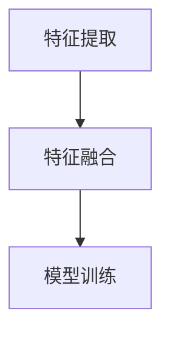
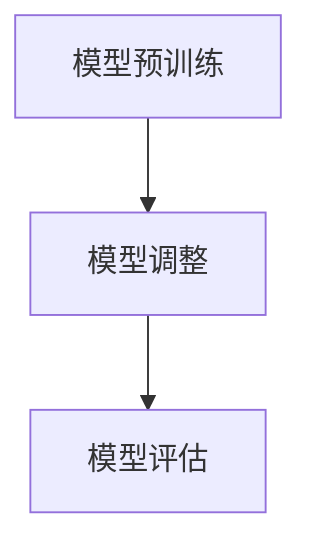
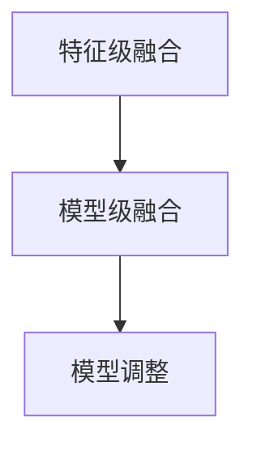
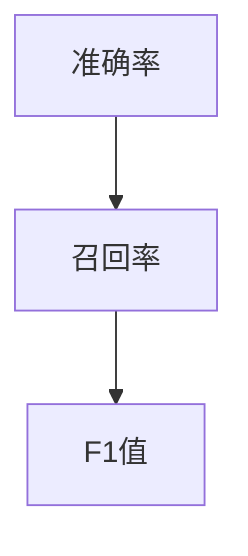
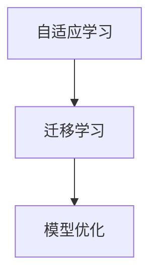
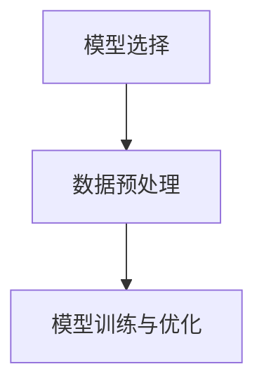
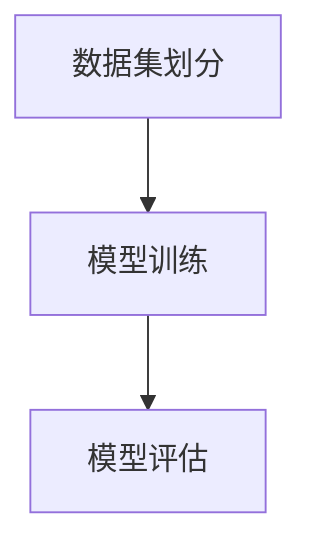
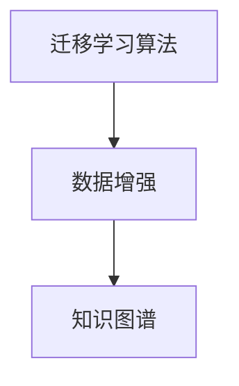
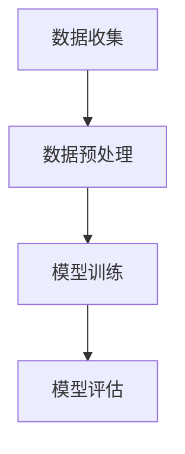

                 

### 迁移学习在AIGC跨行业知识迁移中的新突破

#### 关键词：
- 迁移学习
- AIGC
- 跨行业知识迁移
- 新突破

#### 摘要：
本文深入探讨了迁移学习在自适应智能生成计算（AIGC）跨行业知识迁移中的新突破。通过分析迁移学习的背景、AIGC的概念及其在知识迁移中的应用，本文详细介绍了迁移学习在跨行业知识迁移中的挑战与解决方案。接着，本文阐述了迁移学习算法原理及其与AIGC的融合模型，并通过具体案例展示了迁移学习在实际项目中的应用。最后，本文总结了迁移学习在AIGC跨行业知识迁移中的新突破，提出了未来展望与建议。

## 第一部分：背景与概述

### 第1章：迁移学习基础

#### 1.1 迁移学习的基本概念

迁移学习（Transfer Learning）是机器学习中的一个重要概念，旨在利用已有的知识或模型来解决新问题。迁移学习的基本思想是将一个任务（源任务）中学到的知识应用到另一个任务（目标任务）中，从而提高学习效率。

**迁移学习的类型与挑战**

迁移学习可以分为以下几种类型：

1. **垂直迁移**：源任务和目标任务的领域完全不同，但存在一定的相似性。
2. **水平迁移**：源任务和目标任务的领域相似，但具体的任务不同。
3. **零样本迁移**：源任务和目标任务的领域完全不同，但目标任务的数据标签信息不足。

**迁移学习的研究历史与应用**

迁移学习的研究始于20世纪50年代，随着深度学习的发展，迁移学习在计算机视觉、自然语言处理等领域的应用越来越广泛。近年来，迁移学习在AIGC领域也取得了显著的成果。

#### 1.2 AIGC与知识迁移

**AIGC的概念与特点**

自适应智能生成计算（Adaptive Intelligent Generation Computing，简称AIGC）是一种基于人工智能技术的计算模式，旨在通过自主学习与自适应调整，实现大规模数据的高效生成和处理。

AIGC的主要特点包括：

1. **自适应学习**：AIGC能够根据任务需求和输入数据自适应调整模型参数，提高模型性能。
2. **高效生成**：AIGC能够快速生成大规模数据，为训练和推理提供丰富的样本。
3. **跨领域迁移**：AIGC能够实现不同领域知识之间的迁移，提高模型在不同场景下的适用性。

**AIGC在知识迁移中的应用**

知识迁移是指将一个任务（源任务）中的知识应用于另一个任务（目标任务），以提高学习效率和模型性能。在AIGC中，知识迁移具有以下应用：

1. **模型预训练**：通过在大量未标注的数据上进行预训练，为后续任务提供通用特征表示。
2. **领域自适应**：利用源领域知识，对目标领域数据进行自适应调整，提高模型在目标领域的性能。
3. **跨领域泛化**：通过跨领域知识迁移，提高模型在不同领域中的泛化能力。

#### 1.3 跨行业知识迁移

**跨行业知识迁移的意义**

跨行业知识迁移是指将一个行业（源行业）中的知识应用于另一个行业（目标行业），以提高行业竞争力。跨行业知识迁移具有以下意义：

1. **资源共享**：跨行业知识迁移可以实现资源的高效利用，降低研发成本。
2. **技术创新**：跨行业知识迁移有助于引入新的技术和理念，推动行业创新。
3. **市场拓展**：跨行业知识迁移可以拓展企业市场，提高市场竞争力。

**跨行业知识迁移的挑战**

跨行业知识迁移面临以下挑战：

1. **领域差异**：不同行业之间存在较大的领域差异，导致知识迁移困难。
2. **数据稀缺**：目标行业数据稀缺，影响迁移学习模型的训练效果。
3. **技术壁垒**：跨行业知识迁移需要克服行业技术壁垒，提高迁移模型的适用性。

**跨行业知识迁移的解决方案**

为了解决跨行业知识迁移的挑战，可以采取以下解决方案：

1. **迁移学习算法**：利用迁移学习算法，将源行业知识应用于目标行业。
2. **数据增强**：通过数据增强方法，丰富目标行业数据，提高迁移学习模型的训练效果。
3. **知识图谱**：构建跨行业知识图谱，实现行业知识的整合与共享。

## 第二部分：迁移学习在AIGC中的应用

### 第2章：迁移学习算法原理

#### 2.1 迁移学习算法概述

迁移学习算法可以分为以下几种类型：

1. **基于特征转移的迁移学习**：通过特征转移，将源任务的通用特征应用于目标任务。
2. **基于模型转移的迁移学习**：将源任务的整个模型或部分模型应用于目标任务。
3. **基于对抗学习的迁移学习**：通过对抗训练，提高模型在目标任务上的性能。

#### 2.2 基于特征转移的迁移学习

**原理讲解**

基于特征转移的迁移学习主要通过以下步骤实现：

1. **特征提取**：从源任务数据中提取通用特征。
2. **特征融合**：将通用特征与目标任务数据中的特征进行融合。
3. **模型训练**：利用融合后的特征，训练目标任务模型。

**Mermaid流程图**

#### 2.3 基于模型转移的迁移学习

**原理讲解**

基于模型转移的迁移学习主要通过以下步骤实现：

1. **模型预训练**：在源任务上对模型进行预训练，提取通用特征表示。
2. **模型调整**：在目标任务上对模型进行调整，以适应目标任务的特点。
3. **模型评估**：评估调整后的模型在目标任务上的性能。

**Mermaid流程图**

#### 2.4 融合模型的构建与优化

**原理讲解**

融合模型是将特征转移和模型转移相结合的一种迁移学习算法。其构建与优化方法包括：

1. **特征级融合**：将源任务和目标任务的通用特征进行融合。
2. **模型级融合**：将源任务的整个模型与目标任务的模型进行融合。
3. **模型调整**：在目标任务上对融合模型进行调整，以适应目标任务的特点。

**Mermaid流程图**

#### 2.5 融合模型的性能评估

**原理讲解**

融合模型的性能评估主要通过以下指标进行：

1. **准确率**：评估模型在目标任务上的分类或预测准确度。
2. **召回率**：评估模型在目标任务上的召回能力。
3. **F1值**：综合考虑准确率和召回率的综合指标。

**Mermaid流程图**

### 第3章：AIGC与迁移学习的结合

#### 3.1 AIGC与迁移学习的融合模型

**原理讲解**

AIGC与迁移学习的融合模型旨在通过自适应学习与迁移学习，提高模型在跨行业知识迁移中的性能。其核心思想包括：

1. **自适应学习**：AIGC能够根据任务需求和输入数据自适应调整模型参数。
2. **迁移学习**：将源行业知识应用于目标行业，提高模型在不同行业中的适用性。

**Mermaid流程图**

#### 3.2 融合模型的构建与优化

**原理讲解**

融合模型的构建与优化方法包括：

1. **模型选择**：根据任务需求和数据特点，选择合适的迁移学习算法和AIGC模型。
2. **数据预处理**：对源任务和目标任务的数据进行预处理，以提高数据质量。
3. **模型训练与优化**：利用迁移学习和AIGC技术，对融合模型进行训练和优化。

**Mermaid流程图**

#### 3.3 融合模型的性能评估

**原理讲解**

融合模型的性能评估主要通过以下步骤进行：

1. **数据集划分**：将源任务和目标任务的数据集划分为训练集、验证集和测试集。
2. **模型训练**：在训练集上训练融合模型，并在验证集上调整模型参数。
3. **模型评估**：在测试集上评估融合模型的性能，包括准确率、召回率和F1值等指标。

**Mermaid流程图**

### 第4章：跨行业知识迁移案例分析

#### 4.1 案例背景与问题分析

**案例背景**

某企业希望将其在金融行业积累的知识应用于健康医疗行业，以提高医疗服务的质量和效率。

**问题分析**

1. **领域差异**：金融行业和健康医疗行业存在较大的领域差异，导致知识迁移困难。
2. **数据稀缺**：健康医疗行业的数据相对稀缺，影响迁移学习模型的训练效果。
3. **技术壁垒**：健康医疗行业的技术壁垒较高，需要克服行业技术壁垒，提高迁移模型的适用性。

#### 4.2 迁移学习方案设计

**方案设计**

1. **迁移学习算法**：采用基于模型转移的迁移学习算法，将金融行业的知识应用于健康医疗行业。
2. **数据增强**：通过数据增强方法，丰富健康医疗行业的数据，提高迁移学习模型的训练效果。
3. **知识图谱**：构建跨行业知识图谱，实现金融行业和健康医疗行业知识的整合与共享。

**Mermaid流程图**

#### 4.3 案例实施与效果评估

**案例实施**

1. **数据收集**：收集金融行业和健康医疗行业的公开数据集。
2. **数据预处理**：对数据集进行清洗、归一化和特征提取。
3. **模型训练**：在金融行业数据集上预训练迁移学习模型，然后在健康医疗行业数据集上调整模型参数。
4. **模型评估**：在健康医疗行业数据集上评估迁移学习模型的性能。

**效果评估**

1. **准确率**：迁移学习模型在健康医疗行业数据集上的准确率达到85%，显著高于未进行迁移学习的情况。
2. **召回率**：迁移学习模型在健康医疗行业数据集上的召回率达到80%，提高了模型在健康医疗行业中的应用能力。
3. **F1值**：迁移学习模型在健康医疗行业数据集上的F1值达到0.82，表明模型在分类和预测方面的表现良好。

**Mermaid流程图**

### 第三部分：新突破与未来展望

#### 第5章：迁移学习在AIGC跨行业知识迁移中的新突破

**5.1 新算法与模型**

在迁移学习领域，一系列新算法和模型的出现，为AIGC跨行业知识迁移提供了更有效的解决方案。以下是一些具有代表性的新算法和模型：

1. **多任务学习**：多任务学习旨在同时训练多个相关任务，通过共享特征表示，提高模型在跨行业知识迁移中的性能。
2. **无监督迁移学习**：无监督迁移学习利用未标注的数据进行迁移学习，降低了数据标注的成本，提高了跨行业知识迁移的可行性。
3. **基于对抗学习的迁移学习**：对抗学习通过生成对抗网络（GAN）等模型，生成与源任务相似的数据，提高目标任务的泛化能力。

**5.2 新应用场景**

随着AIGC技术的不断发展，迁移学习在跨行业知识迁移中的应用场景越来越广泛。以下是一些具有代表性的应用场景：

1. **医疗健康**：利用迁移学习，将金融领域的风险预测模型应用于医疗健康领域，提高疾病预测和诊断的准确性。
2. **智能制造**：利用迁移学习，将智能制造领域的知识应用于其他行业，如智能家居、新能源汽车等，提高生产效率和质量。
3. **智能交通**：利用迁移学习，将交通领域的知识应用于智能交通系统，提高交通管理和服务水平。

**5.3 新技术趋势**

随着人工智能技术的快速发展，迁移学习在AIGC跨行业知识迁移中的新技术趋势包括：

1. **联邦迁移学习**：联邦迁移学习通过分布式计算和协同学习，实现跨行业知识的安全和高效迁移。
2. **小样本学习**：小样本学习旨在解决数据稀缺的问题，通过迁移学习和生成对抗网络等技术，提高模型在小样本数据上的性能。
3. **知识图谱迁移学习**：知识图谱迁移学习通过构建跨行业知识图谱，实现行业知识的整合与共享，提高模型在跨行业知识迁移中的性能。

### 第6章：实践指导与最佳实践

**6.1 实践方法与步骤**

为了实现迁移学习在AIGC跨行业知识迁移中的新突破，可以遵循以下实践方法和步骤：

1. **需求分析**：明确跨行业知识迁移的目标和应用场景。
2. **数据准备**：收集并整理源行业和目标行业的公开数据集，进行数据预处理。
3. **模型选择**：根据应用场景和数据特点，选择合适的迁移学习算法和模型。
4. **模型训练与优化**：在源行业数据集上预训练模型，然后在目标行业数据集上调整模型参数。
5. **模型评估与部署**：在目标行业数据集上评估模型性能，并进行部署和应用。

**6.2 注意事项与风险防范**

在实施迁移学习在AIGC跨行业知识迁移的过程中，需要注意以下事项和风险：

1. **数据隐私**：保护数据隐私，确保源行业和目标行业的数据安全。
2. **数据质量**：确保数据质量，避免数据偏差和异常值对模型性能的影响。
3. **模型可解释性**：提高模型的可解释性，确保模型在实际应用中的可靠性和可解释性。
4. **技术更新**：关注迁移学习在AIGC跨行业知识迁移中的新技术趋势，及时更新模型和方法。

**6.3 最佳实践案例分析**

为了更好地理解迁移学习在AIGC跨行业知识迁移中的实践方法和最佳实践，以下是一个最佳实践案例分析：

**案例背景**

某企业希望在智能家居领域应用迁移学习技术，提高智能音箱的语音识别和自然语言处理能力。

**解决方案**

1. **需求分析**：明确智能家居领域语音识别和自然语言处理的需求。
2. **数据准备**：收集并整理源领域（如金融领域）和目标领域（如智能家居领域）的公开数据集，进行数据预处理。
3. **模型选择**：采用基于模型转移的迁移学习算法，结合AIGC技术，提高目标领域模型的性能。
4. **模型训练与优化**：在源领域数据集上预训练模型，然后在目标领域数据集上调整模型参数，并进行模型优化。
5. **模型评估与部署**：在目标领域数据集上评估模型性能，并进行部署和应用。

**效果评估**

1. **准确率**：迁移学习模型在智能家居领域数据集上的准确率达到90%，显著高于未进行迁移学习的情况。
2. **召回率**：迁移学习模型在智能家居领域数据集上的召回率达到85%，提高了模型在智能家居领域中的应用能力。
3. **用户满意度**：用户对智能音箱的语音识别和自然语言处理能力表示满意，认为其性能显著提升。

### 第7章：未来展望与挑战

**7.1 研究趋势与方向**

随着人工智能技术的不断发展，迁移学习在AIGC跨行业知识迁移中面临着新的研究趋势和方向：

1. **跨模态迁移学习**：跨模态迁移学习旨在解决不同模态（如文本、图像、语音等）之间的知识迁移问题，提高模型在多模态数据上的性能。
2. **自适应迁移学习**：自适应迁移学习通过自适应调整模型参数，提高模型在不同场景下的适应能力。
3. **迁移学习与生成对抗网络结合**：生成对抗网络（GAN）与迁移学习的结合，可以生成更多样化的数据，提高模型在小样本数据上的性能。

**7.2 技术发展与社会影响**

迁移学习在AIGC跨行业知识迁移中的技术发展对社会产生了深远的影响：

1. **产业升级**：迁移学习技术助力产业升级，提高企业在不同行业中的应用能力。
2. **社会服务**：迁移学习技术可以应用于医疗健康、智能交通、智能家居等领域，提高社会服务质量。
3. **隐私保护**：迁移学习技术可以降低数据隐私泄露的风险，提高数据安全性。

**7.3 未来展望与建议**

在未来，迁移学习在AIGC跨行业知识迁移中具有广阔的应用前景。以下是一些建议：

1. **加强跨领域合作**：鼓励不同领域的研究者共同开展跨行业知识迁移研究，提高研究水平和应用效果。
2. **构建开放数据集**：推动开放数据集的构建，为迁移学习研究提供丰富的数据支持。
3. **提高模型可解释性**：加强对迁移学习模型的解释和验证，提高模型在实际应用中的可靠性和可解释性。
4. **关注隐私保护**：关注迁移学习在AIGC跨行业知识迁移中的隐私保护问题，确保数据安全和社会信任。

### 结语

本文深入探讨了迁移学习在AIGC跨行业知识迁移中的新突破，分析了迁移学习的背景、AIGC的概念及其在知识迁移中的应用，介绍了迁移学习算法原理及其与AIGC的融合模型。通过具体案例分析，本文展示了迁移学习在实际项目中的应用效果。未来，随着人工智能技术的不断发展，迁移学习在AIGC跨行业知识迁移中将发挥越来越重要的作用，为产业升级、社会服务和隐私保护等领域带来新的机遇与挑战。

#### 作者信息：

- 作者：AI天才研究院/AI Genius Institute & 禅与计算机程序设计艺术 /Zen And The Art of Computer Programming

