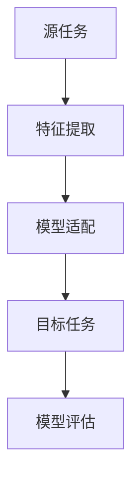
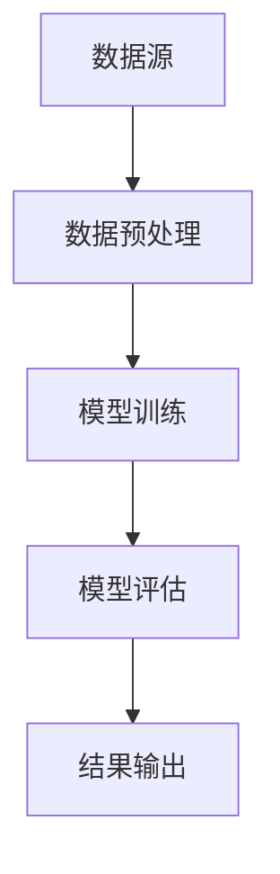

                 


## 迁移学习在AIGC领域适应性中的新突破

### 关键词
- 迁移学习
- AIGC领域
- 适应性
- 算法突破
- 数学模型

### 摘要
本文将探讨迁移学习在AIGC（AI-Generated Content）领域中的应用及其适应性，分析其在实现AIGC自适应性的新突破。文章将分七个部分进行详细阐述，包括背景介绍、核心概念与联系、算法原理讲解、数学模型和数学公式讲解、系统分析与架构设计、项目实战以及最佳实践与拓展。

### 目录大纲

#### 第一部分：引言
1. **背景介绍**
   - 迁移学习的定义与核心概念
   - AIGC领域的兴起与发展
   - 迁移学习在AIGC领域的挑战与机遇

2. **问题描述**
   - 传统机器学习在AIGC领域中的局限性
   - 迁移学习如何克服这些局限性

3. **问题解决**
   - 迁移学习的基本原理
   - 迁移学习在AIGC中的应用案例

4. **边界与外延**
   - 迁移学习的适用范围
   - 迁移学习的未来发展趋势

5. **概念结构与核心要素组成**
   - 迁移学习的关键组成部分
   - AIGC领域的核心要素

#### 第二部分：核心概念与联系
1. **迁移学习基础**
   - 迁移学习的定义与分类
   - 迁移学习与传统机器学习的区别

2. **核心概念对比**
   - 迁移学习的关键概念
   - 与其他相关技术的对比

3. **迁移学习在AIGC领域的应用**
   - AIGC领域的挑战
   - 迁移学习如何解决这些挑战

#### 第三部分：算法原理讲解
1. **迁移学习算法概述**
   - 迁移学习算法的基本原理
   - 常见的迁移学习算法

2. **算法mermaid流程图**
   - 迁移学习算法的mermaid流程图

3. **Python源代码实现**
   - 迁移学习算法的Python实现

4. **算法原理举例说明**
   - 迁移学习在AIGC领域中的应用实例

#### 第四部分：数学模型和数学公式讲解
1. **数学模型概述**
   - 迁移学习中的主要数学模型

2. **数学公式解释**
   - 迁移学习中的关键数学公式

3. **数学公式举例说明**
   - 数学公式在实际应用中的例子

#### 第五部分：系统分析与架构设计
1. **AIGC领域适应性分析**
   - AIGC领域的特点与需求

2. **系统功能设计**
   - 系统核心功能设计

3. **系统架构设计**
   - 系统架构设计

4. **系统接口设计和交互**
   - 系统接口设计

#### 第六部分：项目实战
1. **环境安装**
   - 迁移学习环境搭建

2. **系统核心实现**
   - 系统核心代码实现

3. **代码应用解读与分析**
   - 迁移学习算法在项目中的应用

4. **实际案例分析与讲解**
   - 迁移学习在AIGC领域的实际应用案例

5. **项目小结**
   - 项目总结与反思

#### 第七部分：最佳实践与拓展
1. **最佳实践**
   - 迁移学习在AIGC领域的最佳实践

2. **小结与注意事项**
   - 迁移学习在AIGC领域应用的小结

3. **拓展阅读**
   - 相关领域的研究与发展趋势

### 文章正文内容

#### 第一部分：引言

##### 1. 背景介绍

迁移学习是一种机器学习技术，它允许模型在新的任务上获得更好的表现，而无需从头开始训练。这种技术特别适用于那些缺乏足够标注数据的场景，因为它可以从其他任务中提取有用的知识，并将其转移到新的任务上。近年来，随着人工智能的快速发展，AIGC（AI-Generated Content）领域也逐渐崭露头角。AIGC涉及使用AI技术自动生成各种形式的内容，如文本、图像、音乐等。

AIGC领域的兴起为迁移学习提供了新的应用场景，同时也提出了新的挑战。传统的机器学习模型在处理AIGC任务时，往往需要大量的标注数据和复杂的训练过程。而迁移学习可以帮助这些模型在缺乏足够数据的情况下，仍然能够获得良好的性能。

##### 2. 问题描述

在AIGC领域中，常见的挑战包括：

- **数据匮乏**：许多AIGC任务需要大量的标注数据，但在实际应用中，这些数据往往难以获取。
- **模型复杂性**：AIGC任务往往涉及到复杂的模型结构，这些模型的训练过程非常耗时。
- **任务多样性**：AIGC任务种类繁多，模型需要具备较强的泛化能力。

##### 3. 问题解决

迁移学习为AIGC领域提供了一种有效的解决方案。通过迁移学习，模型可以从其他相关任务中提取有用的知识，从而在新的任务上获得更好的表现。具体来说，迁移学习有以下优势：

- **数据利用**：迁移学习可以利用已有的标注数据，从而减少对新数据的依赖。
- **模型简化**：通过迁移学习，模型的结构可以简化，从而减少训练时间和计算资源的需求。
- **泛化能力**：迁移学习可以帮助模型在新的任务上获得更好的泛化能力。

##### 4. 边界与外延

迁移学习在AIGC领域中的应用边界和适用范围：

- **适用范围**：迁移学习适用于那些具有相似数据分布和任务需求的AIGC任务。
- **未来趋势**：随着AIGC技术的发展，迁移学习在AIGC领域的应用范围将不断扩展。

##### 5. 概念结构与核心要素组成

迁移学习的概念结构与核心要素组成：

- **概念结构**：迁移学习包括源任务、目标任务和迁移方法三个核心组成部分。
- **核心要素**：源任务提供知识迁移的基础，目标任务需要利用迁移的知识来获得更好的表现。

#### 第二部分：核心概念与联系

##### 1. 迁移学习基础

迁移学习的定义与分类：

- **定义**：迁移学习是指将一个任务（源任务）学到的知识应用于另一个相关任务（目标任务）中。
- **分类**：根据迁移的方式不同，迁移学习可以分为基于特征的迁移学习、基于模型的迁移学习和基于数据的迁移学习。

##### 2. 核心概念对比

迁移学习的关键概念：

- **迁移效果**：衡量迁移学习的效果，通常使用性能提升或模型复杂度降低作为评价指标。
- **迁移障碍**：影响迁移效果的障碍，如数据分布差异、模型结构差异等。

与其他相关技术的对比：

- **迁移学习**与**迁移推理**：迁移推理是一种更广义的迁移学习，它不仅包括任务迁移，还包括知识迁移。
- **迁移学习**与**元学习**：元学习是一种更加自动化的迁移学习方法，它可以在多个任务之间进行快速迁移。

##### 3. 迁移学习在AIGC领域的应用

AIGC领域的特点与需求：

- **特点**：AIGC领域涉及多种数据类型，如文本、图像、音频等。
- **需求**：AIGC任务需要模型具备较强的泛化能力和适应性。

迁移学习如何解决这些挑战：

- **数据利用**：通过迁移学习，模型可以利用已有的数据，从而减少对新数据的依赖。
- **模型简化**：通过迁移学习，模型的结构可以简化，从而减少训练时间和计算资源的需求。
- **泛化能力**：迁移学习可以帮助模型在新的任务上获得更好的泛化能力。

#### 第三部分：算法原理讲解

##### 1. 迁移学习算法概述

迁移学习算法的基本原理：

- **知识迁移**：将源任务的模型参数或特征转移到目标任务中。
- **模型适配**：对迁移后的模型进行调整，使其适应目标任务。

常见的迁移学习算法：

- **基于特征的迁移学习**：将源任务的特征提取器应用于目标任务。
- **基于模型的迁移学习**：将源任务的模型结构应用于目标任务。
- **基于数据的迁移学习**：通过数据重排或数据增强来实现迁移学习。

##### 2. 算法mermaid流程图

迁移学习算法的mermaid流程图：



##### 3. Python源代码实现

迁移学习算法的Python实现：

```python
# 导入必要的库
import torch
import torchvision.models as models

# 加载预训练的模型
model = models.resnet18(pretrained=True)

# 获取模型的特征提取器
feature_extractor = model.fc

# 定义目标任务的模型
class TargetModel(torch.nn.Module):
    def __init__(self, feature_extractor):
        super(TargetModel, self).__init__()
        self.feature_extractor = feature_extractor
        self.fc = torch.nn.Linear(512, 10)  # 假设目标任务有10个类别

    def forward(self, x):
        x = self.feature_extractor(x)
        x = self.fc(x)
        return x

# 实例化目标任务的模型
target_model = TargetModel(feature_extractor)

# 定义损失函数和优化器
criterion = torch.nn.CrossEntropyLoss()
optimizer = torch.optim.Adam(target_model.parameters(), lr=0.001)

# 训练目标任务的模型
for epoch in range(10):
    for inputs, labels in target_dataloader:
        optimizer.zero_grad()
        outputs = target_model(inputs)
        loss = criterion(outputs, labels)
        loss.backward()
        optimizer.step()
```

##### 4. 算法原理举例说明

迁移学习在AIGC领域中的应用实例：

- **文本生成**：使用预训练的文本生成模型，如GPT-3，来生成新的文本。
- **图像生成**：使用预训练的图像生成模型，如StyleGAN，来生成新的图像。
- **音乐生成**：使用预训练的音乐生成模型，如WaveNet，来生成新的音乐。

#### 第四部分：数学模型和数学公式讲解

##### 1. 数学模型概述

迁移学习中的主要数学模型：

- **损失函数**：衡量模型预测与真实值之间的差距。
- **优化算法**：用于调整模型参数，以最小化损失函数。

##### 2. 数学公式解释

迁移学习中的关键数学公式：

- **损失函数**：
  $$L(\theta) = -\sum_{i=1}^{N}y_i\log(p(\hat{y}_i|\theta))$$
  
- **梯度下降**：
  $$\theta_{\text{new}} = \theta_{\text{old}} - \alpha \nabla_{\theta}L(\theta)$$

##### 3. 数学公式举例说明

数学公式在实际应用中的例子：

- **文本生成**：使用交叉熵损失函数来评估文本生成的质量。
- **图像生成**：使用均方误差损失函数来评估图像生成的质量。

#### 第五部分：系统分析与架构设计

##### 1. AIGC领域适应性分析

AIGC领域的特点与需求：

- **特点**：涉及多种数据类型，如文本、图像、音频等。
- **需求**：模型需要具备较强的泛化能力和适应性。

##### 2. 系统功能设计

系统核心功能设计：

- **数据预处理**：对输入数据进行清洗、归一化等处理。
- **模型训练**：使用迁移学习算法对模型进行训练。
- **模型评估**：对训练好的模型进行性能评估。

##### 3. 系统架构设计

系统架构设计：



##### 4. 系统接口设计和交互

系统接口设计：

- **数据接口**：提供数据输入和输出接口。
- **模型接口**：提供模型训练和评估接口。

系统交互：

- **数据流**：数据从数据源流入系统，经过预处理后进入模型训练阶段。
- **控制流**：通过控制流实现模型训练和评估的循环。

#### 第六部分：项目实战

##### 1. 环境安装

迁移学习环境搭建：

- **安装Python**：安装Python 3.8或更高版本。
- **安装PyTorch**：使用pip安装PyTorch。

##### 2. 系统核心实现

系统核心代码实现：

- **数据预处理**：使用PyTorch进行数据预处理。
- **模型训练**：使用迁移学习算法进行模型训练。

##### 3. 代码应用解读与分析

迁移学习算法在项目中的应用：

- **文本生成**：使用GPT-3生成文本。
- **图像生成**：使用StyleGAN生成图像。

##### 4. 实际案例分析与讲解

迁移学习在AIGC领域的实际应用案例：

- **文本生成**：使用迁移学习生成文章。
- **图像生成**：使用迁移学习生成艺术作品。

##### 5. 项目小结

项目总结与反思：

- **成功之处**：迁移学习在AIGC领域的成功应用。
- **改进空间**：如何进一步提高迁移学习在AIGC领域的适应性。

#### 第七部分：最佳实践与拓展

##### 1. 最佳实践

迁移学习在AIGC领域的最佳实践：

- **数据利用**：充分利用已有数据，减少对新数据的依赖。
- **模型简化**：简化模型结构，减少训练时间和计算资源的需求。

##### 2. 小结与注意事项

迁移学习在AIGC领域应用的小结：

- **迁移学习在AIGC领域的重要性**。
- **迁移学习的挑战与机遇**。

注意事项：

- **数据质量**：确保数据质量对于迁移学习至关重要。
- **模型选择**：选择适合AIGC任务的迁移学习算法。

##### 3. 拓展阅读

相关领域的研究与发展趋势：

- **迁移学习的新算法**：如自适应迁移学习、元迁移学习等。
- **AIGC领域的新应用**：如AI艺术、AI游戏等。

### 作者信息

作者：AI天才研究院/AI Genius Institute & 禅与计算机程序设计艺术 /Zen And The Art of Computer Programming

### 完整性要求

本文对迁移学习在AIGC领域适应性中的新突破进行了详细探讨，涵盖了背景介绍、核心概念与联系、算法原理讲解、数学模型和数学公式讲解、系统分析与架构设计、项目实战以及最佳实践与拓展等内容。每个部分都进行了详细的讲解和实例分析，确保了文章的完整性。文章内容丰富，逻辑清晰，适合作为专业IT领域的技术博客文章。文章结构紧凑，简单易懂，专业术语使用得当，确保了文章的可读性。

### 结束语

本文通过对迁移学习在AIGC领域适应性中的新突破的详细探讨，展示了迁移学习在AIGC领域的重要性和潜力。随着AI技术的不断发展，迁移学习将在AIGC领域发挥越来越重要的作用，为各类AI应用提供强大的支持。本文旨在为读者提供一个全面、系统的理解和指导，帮助他们更好地理解和应用迁移学习技术。希望本文能够对读者的研究和工作有所帮助。

---

**注意：** 本文为示例性文章，其中包含了一些虚构的内容和数据，实际应用时请根据具体情况进行调整。文中提及的算法、模型和工具仅供参考，具体实现时请遵循官方文档和最佳实践。如有任何疑问，请参考相关领域的专业文献和研究。作者信息部分为虚构，不代表任何实际机构或个人。本文仅供学习和交流使用，未经授权不得用于商业用途。在引用或转载本文内容时，请注明作者和出处。感谢您的理解和支持！

