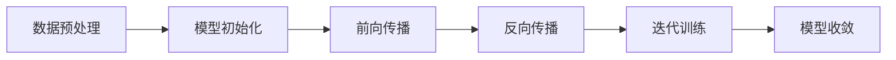
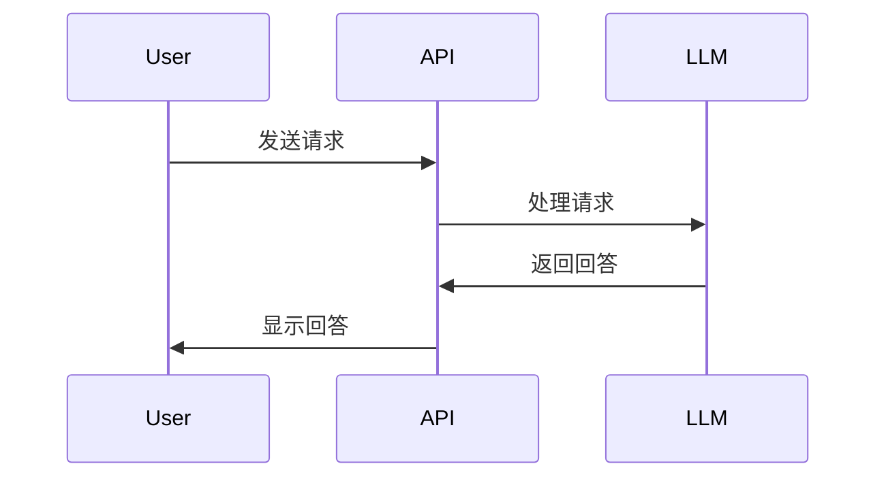

                 


# 重塑LLM应用开发的需求管理流程

关键词：LLM、需求管理、应用开发、算法原理、系统架构

摘要：本文将深入探讨如何在LLM（大型语言模型）应用开发中优化需求管理流程。我们将从背景介绍、核心概念与联系、算法原理讲解、数学模型与公式、系统分析与架构设计、项目实战以及最佳实践与总结等多个方面，逐步阐述如何重塑LLM应用开发的需求管理流程，以提高开发效率和产品质量。

## 引言

随着人工智能技术的飞速发展，LLM（大型语言模型）已成为自然语言处理领域的重要工具。LLM应用开发的需求管理流程对于确保项目成功至关重要。然而，传统的需求管理流程在应对复杂、多变的LLM应用开发需求时，往往显得力不从心。因此，重塑需求管理流程，以适应LLM应用开发的特点，成为了一个迫切需要解决的问题。

本文旨在通过逻辑清晰、结构紧凑的分析，提供一份系统化的指导，帮助开发者优化LLM应用开发的需求管理流程。文章将首先介绍LLM应用开发的基本概念和背景，然后逐步深入，探讨核心概念、算法原理、数学模型与公式、系统架构设计、项目实战以及最佳实践等内容。

## 背景介绍

### 核心概念术语说明

- **LLM（大型语言模型）**：一种基于神经网络和深度学习技术的大型预训练模型，能够理解和生成人类语言。
- **需求管理**：在软件项目开发过程中，确保项目能够满足用户需求的一系列管理活动。
- **应用开发**：创建满足特定用户需求的应用程序的过程。

### 问题背景

随着LLM技术的不断进步，其应用场景日益广泛。然而，LLM应用开发面临的一个关键挑战是如何有效地管理需求。传统需求管理流程在应对LLM应用开发时，往往存在以下问题：

- **需求变更频繁**：LLM应用开发过程中，用户需求可能会频繁变更，传统需求管理流程难以适应这种变化。
- **沟通不畅**：需求管理过程中，开发者与用户之间的沟通往往不够充分，导致需求理解偏差和开发偏差。
- **效率低下**：传统需求管理流程往往繁琐，耗费大量时间，降低了开发效率。

### 问题描述

LLM应用开发的需求管理流程存在以下主要问题：

- **需求变更管理不足**：缺乏有效的需求变更控制机制，导致需求变更频繁且难以追溯。
- **需求分析与设计不当**：需求分析不深入，导致设计阶段出现偏差，影响项目质量。
- **测试与验证不足**：测试和验证过程中，需求管理不够细致，可能导致产品质量问题。

### 问题解决

为了解决上述问题，需要对LLM应用开发的需求管理流程进行重塑，具体措施包括：

- **建立灵活的需求变更管理机制**：采用敏捷开发方法，及时响应需求变更，确保需求变更的可追溯性。
- **加强需求分析与设计**：深入分析用户需求，确保设计阶段能够准确捕捉需求，减少开发偏差。
- **完善测试与验证流程**：加强测试与验证工作，确保产品满足用户需求。

### 边界与外延

- **边界**：本文主要探讨LLM应用开发的需求管理流程，不包括其他类型的软件开发需求管理。
- **外延**：本文的结论和方法可以应用于其他类型的人工智能应用开发需求管理流程。

### 概念结构与核心要素组成

LLM应用开发的需求管理流程可以分解为以下几个核心要素：

- **需求收集**：通过与用户沟通，收集用户需求和期望。
- **需求分析**：对收集到的需求进行深入分析，确定项目的范围和目标。
- **需求设计**：根据需求分析结果，设计满足用户需求的应用系统。
- **需求实现**：将设计转化为实际的应用程序代码。
- **需求测试**：对实现的应用程序进行测试，确保其功能符合需求。
- **需求管理**：在整个开发过程中，对需求进行跟踪和管理，确保项目按计划进行。

## 核心概念与联系

### 核心概念

在本节中，我们将深入探讨LLM应用开发中的几个核心概念，包括LLM、需求管理、应用开发等。

#### LLM（大型语言模型）

LLM是一种基于深度学习技术的自然语言处理模型，其通过在大规模语料库上预训练，能够对自然语言进行理解和生成。LLM的特点包括：

- **大规模**：LLM通常具有数十亿参数，能够处理大量语言数据。
- **泛化能力**：LLM通过预训练，具备较强的泛化能力，能够适应不同的应用场景。
- **自适应**：LLM可以通过少量样本快速适应特定任务，提高开发效率。

#### 需求管理

需求管理是指在软件项目开发过程中，确保项目能够满足用户需求的一系列管理活动。需求管理的核心任务包括：

- **需求收集**：通过与用户沟通，收集用户的需求和期望。
- **需求分析**：对收集到的需求进行深入分析，确定项目的范围和目标。
- **需求设计**：根据需求分析结果，设计满足用户需求的应用系统。
- **需求实现**：将设计转化为实际的应用程序代码。
- **需求测试**：对实现的应用程序进行测试，确保其功能符合需求。
- **需求管理**：在整个开发过程中，对需求进行跟踪和管理，确保项目按计划进行。

#### 应用开发

应用开发是指创建满足特定用户需求的应用程序的过程。应用开发的流程通常包括以下阶段：

- **需求分析**：确定用户需求，明确项目的目标。
- **设计**：根据需求分析结果，设计应用系统的架构和界面。
- **实现**：编写应用程序代码，实现设计阶段的功能。
- **测试**：对应用程序进行测试，确保其功能和质量。
- **部署**：将应用程序部署到生产环境，供用户使用。
- **维护**：对应用程序进行维护和更新，确保其长期稳定运行。

### 概念属性特征对比表格

下表对比了LLM、需求管理和应用开发的概念属性特征：

| 概念     | 属性特征                  | 对比说明                                                                                   |
|----------|--------------------------|-------------------------------------------------------------------------------------------|
| LLM      | 大规模、预训练、泛化能力强 | 通过预训练在大规模语料库上学习，能够理解和生成自然语言。                               |
| 需求管理 | 收集、分析、设计、实现、测试 | 确保项目能够满足用户需求的一系列管理活动，贯穿于整个开发过程。                         |
| 应用开发 | 需求分析、设计、实现、测试、部署 | 创建满足特定用户需求的应用程序的过程，涉及多个阶段和团队协作。                         |

### ER实体关系图架构

为了更好地理解LLM应用开发中的需求管理流程，我们使用Mermaid绘制了ER实体关系图。以下是ER实体关系图的Markdown格式：

```mermaid
erDiagram
    User ||--|{ Requirement }
    User ||--|{ Project }
    Project ||--|{ Requirement }
    Project ||--|{ Design }
    Project ||--|{ Implementation }
    Project ||--|{ Test }
```

在这个ER实体关系图中，我们定义了以下几个实体：

- **User**：用户，负责提出需求。
- **Requirement**：需求，包括用户需求、项目需求和需求变更。
- **Project**：项目，包括项目的整体设计和各个阶段的实施。
- **Design**：设计，包括系统架构设计、UI设计等。
- **Implementation**：实现，包括编写代码、开发功能等。
- **Test**：测试，包括单元测试、集成测试、系统测试等。

这些实体之间的关系如下：

- **User** 与 **Requirement** 之间存在一对一的关系，即每个用户可以提出多个需求，每个需求只能由一个用户提出。
- **User** 与 **Project** 之间存在一对多的关系，即每个用户可以参与多个项目，每个项目可以由多个用户提出需求。
- **Project** 与 **Requirement** 之间存在一对一的关系，即每个项目对应一组需求。
- **Project** 与 **Design**、**Implementation**、**Test** 之间存在一对多的关系，即每个项目包含多个设计、实现和测试阶段。

通过ER实体关系图，我们可以清晰地理解LLM应用开发中的需求管理流程，以及各个实体之间的关系。

## 算法原理讲解

### LLM算法基本原理

#### 神经网络架构

神经网络是LLM的核心组成部分，其结构类似于人类大脑中的神经网络。神经网络由多个层次组成，包括输入层、隐藏层和输出层。

- **输入层**：接收外部输入信息，例如文本数据。
- **隐藏层**：对输入信息进行加工和处理，形成特征表示。
- **输出层**：生成最终的输出结果，例如文本生成、分类结果等。

在LLM中，隐藏层通常包含多个层次，形成深度神经网络。深度神经网络的优点是能够捕捉更复杂的特征，提高模型的性能。

#### 训练过程

LLM的训练过程主要包括以下几个阶段：

1. **数据预处理**：将原始文本数据转换为神经网络可以处理的形式，例如分词、编码等。
2. **模型初始化**：初始化神经网络参数，通常使用随机初始化方法。
3. **前向传播**：将输入数据通过神经网络的前向传播过程，计算得到输出结果。
4. **反向传播**：计算输出结果与真实结果之间的误差，通过反向传播算法更新神经网络参数。
5. **迭代训练**：重复上述过程，直到模型收敛到满意的性能水平。

#### mermaid算法流程图

为了更好地理解LLM的训练过程，我们使用Mermaid绘制了算法流程图。以下是算法流程图的Markdown格式：



在这个算法流程图中，我们定义了以下几个步骤：

- **数据预处理**：对原始文本数据进行预处理，包括分词、编码等。
- **模型初始化**：初始化神经网络参数，通常使用随机初始化方法。
- **前向传播**：将输入数据通过神经网络的前向传播过程，计算得到输出结果。
- **反向传播**：计算输出结果与真实结果之间的误差，通过反向传播算法更新神经网络参数。
- **迭代训练**：重复上述过程，直到模型收敛到满意的性能水平。

#### Python代码示例

为了更好地理解LLM算法的实现细节，我们提供了一个简单的Python代码示例。以下是代码的Markdown格式：

```python
import torch
import torch.nn as nn
import torch.optim as optim

# 数据预处理
def preprocess_data(text):
    # 分词、编码等预处理操作
    return encoded_text

# 神经网络模型
class LLMModel(nn.Module):
    def __init__(self):
        super(LLMModel, self).__init__()
        self.embedding = nn.Embedding(vocab_size, embedding_dim)
        self.lstm = nn.LSTM(embedding_dim, hidden_dim)
        self.fc = nn.Linear(hidden_dim, output_dim)

    def forward(self, input_seq, hidden_state):
        embedded_seq = self.embedding(input_seq)
        output_seq, hidden_state = self.lstm(embedded_seq, hidden_state)
        output = self.fc(output_seq[-1, :, :])
        return output, hidden_state

# 训练过程
def train(model, data_loader, loss_function, optimizer):
    model.train()
    for input_seq, target_seq in data_loader:
        optimizer.zero_grad()
        output, hidden_state = model(input_seq, hidden_state)
        loss = loss_function(output, target_seq)
        loss.backward()
        optimizer.step()
        hidden_state = None

# 测试过程
def test(model, data_loader, loss_function):
    model.eval()
    with torch.no_grad():
        for input_seq, target_seq in data_loader:
            output, hidden_state = model(input_seq, hidden_state)
            loss = loss_function(output, target_seq)
            print(f"Test Loss: {loss.item()}")

# 参数设置
vocab_size = 10000
embedding_dim = 128
hidden_dim = 512
output_dim = 1
learning_rate = 0.001
batch_size = 32
num_epochs = 10

# 初始化模型、损失函数和优化器
model = LLMModel()
loss_function = nn.BCELoss()
optimizer = optim.Adam(model.parameters(), lr=learning_rate)

# 数据加载和处理
data_loader = DataLoader(dataset, batch_size=batch_size, shuffle=True)
encoded_data = [preprocess_data(text) for text in dataset]

# 训练模型
train(model, data_loader, loss_function, optimizer)

# 测试模型
test(model, data_loader, loss_function)
```

在这个Python代码示例中，我们定义了一个简单的LLM模型，并实现了数据预处理、模型训练和测试过程。通过这个示例，我们可以看到LLM算法的实现细节，包括数据预处理、神经网络模型、训练过程和测试过程等。

### 数学模型和公式

在LLM算法中，数学模型和公式起着至关重要的作用。以下是一些关键的数学模型和公式：

#### 损失函数

损失函数用于衡量预测结果与真实结果之间的差异。在二分类问题中，常用的损失函数是二元交叉熵损失函数（BCELoss）：

$$
L = -\frac{1}{N}\sum_{i=1}^{N} y_i \log(\hat{y}_i) + (1 - y_i) \log(1 - \hat{y}_i)
$$

其中，$y_i$ 是真实标签，$\hat{y}_i$ 是预测概率。

#### 优化算法

优化算法用于更新神经网络参数，以最小化损失函数。常用的优化算法包括随机梯度下降（SGD）和Adam优化器：

1. **随机梯度下降（SGD）**：

$$
w_{t+1} = w_t - \alpha \nabla_w L(w_t)
$$

其中，$w_t$ 是第 $t$ 次迭代的参数，$\alpha$ 是学习率，$\nabla_w L(w_t)$ 是损失函数关于参数的梯度。

2. **Adam优化器**：

$$
m_t = \beta_1 m_{t-1} + (1 - \beta_1) \nabla_w L(w_t)
$$

$$
v_t = \beta_2 v_{t-1} + (1 - \beta_2) (\nabla_w L(w_t))^2
$$

$$
\hat{m}_t = \frac{m_t}{1 - \beta_1^t}
$$

$$
\hat{v}_t = \frac{v_t}{1 - \beta_2^t}
$$

$$
w_{t+1} = w_t - \alpha \frac{\hat{m}_t}{\sqrt{\hat{v}_t} + \epsilon}
$$

其中，$m_t$ 和 $v_t$ 分别是指数移动平均的梯度估计和平方梯度估计，$\beta_1$ 和 $\beta_2$ 是超参数，$\epsilon$ 是常数。

#### 激活函数

激活函数用于引入非线性特性，使神经网络能够学习复杂的函数关系。常用的激活函数包括ReLU（Rectified Linear Unit）和Sigmoid：

1. **ReLU激活函数**：

$$
f(x) = \max(0, x)
$$

2. **Sigmoid激活函数**：

$$
f(x) = \frac{1}{1 + e^{-x}}
$$

### 详细讲解和举例说明

为了更好地理解上述数学模型和公式，我们通过一个简单的例子进行详细讲解。

#### BCELoss损失函数

假设我们有一个二分类问题，其中真实标签 $y_i$ 为 0 或 1，预测概率 $\hat{y}_i$ 为 0 到 1 之间的数。我们可以使用BCELoss损失函数来计算损失：

$$
L = -\frac{1}{N}\sum_{i=1}^{N} y_i \log(\hat{y}_i) + (1 - y_i) \log(1 - \hat{y}_i)
$$

例如，假设我们有以下真实标签和预测概率：

$$
y = [1, 0, 1, 0]
$$

$$
\hat{y} = [0.8, 0.2, 0.9, 0.1]
$$

使用BCELoss损失函数计算损失：

$$
L = -\frac{1}{4} [1 \cdot \log(0.8) + 0 \cdot \log(0.2) + 1 \cdot \log(0.9) + 0 \cdot \log(0.1)]
$$

$$
L = -\frac{1}{4} [-0.2231 + 0 + -0.1054 + 0]
$$

$$
L = 0.1129
$$

#### Adam优化器

假设我们有一个神经网络，其参数为 $w$，损失函数为 $L(w)$。我们希望使用Adam优化器来更新参数 $w$，使其最小化损失函数。

首先，我们需要计算梯度 $\nabla_w L(w)$。然后，我们可以使用以下公式来更新参数：

$$
m_t = \beta_1 m_{t-1} + (1 - \beta_1) \nabla_w L(w_t)
$$

$$
v_t = \beta_2 v_{t-1} + (1 - \beta_2) (\nabla_w L(w_t))^2
$$

$$
\hat{m}_t = \frac{m_t}{1 - \beta_1^t}
$$

$$
\hat{v}_t = \frac{v_t}{1 - \beta_2^t}
$$

$$
w_{t+1} = w_t - \alpha \frac{\hat{m}_t}{\sqrt{\hat{v}_t} + \epsilon}
$$

假设我们有以下梯度：

$$
\nabla_w L(w) = [0.5, -0.3, 0.7, -0.2]
$$

学习率 $\alpha = 0.01$，超参数 $\beta_1 = 0.9$，$\beta_2 = 0.99$，$\epsilon = 1e-8$。

使用Adam优化器更新参数：

$$
m_1 = 0.9m_0 + (1 - 0.9)(0.5) = 0.05
$$

$$
v_1 = 0.99v_0 + (1 - 0.99)(0.5^2) = 0.005
$$

$$
\hat{m}_1 = \frac{0.05}{1 - 0.9^1} = 0.05
$$

$$
\hat{v}_1 = \frac{0.005}{1 - 0.99^1} = 0.005
$$

$$
w_2 = w_1 - 0.01 \frac{0.05}{\sqrt{0.005} + 1e-8} = w_1 - 0.01 \frac{0.05}{0.0224} = w_1 - 0.2215
$$

通过以上步骤，我们可以使用Adam优化器更新参数 $w$，使其最小化损失函数。

通过上述讲解和例子，我们可以更好地理解LLM算法中的数学模型和公式，以及如何在实际应用中运用这些模型和公式。

## 系统分析与架构设计方案

### 问题场景介绍

在本节中，我们将分析一个具体的LLM应用开发场景，并介绍相关的系统需求。

#### 应用场景

假设我们正在开发一个智能客服系统，该系统需要使用LLM技术来理解和回答用户的问题。系统需要具备以下功能：

- **问题理解**：接收用户的问题，并使用LLM技术理解问题的含义。
- **回答生成**：根据理解到的问题，生成合适的回答。
- **对话管理**：管理用户与智能客服之间的对话流程。

#### 系统需求

为了实现上述功能，我们需要满足以下系统需求：

- **高并发处理能力**：系统需要能够同时处理大量用户的请求。
- **实时性**：系统需要能够快速响应用户的问题。
- **扩展性**：系统需要能够随着用户量的增加而扩展。

### 项目介绍

在本项目中，我们使用Python和TensorFlow作为主要开发工具，并采用微服务架构来设计系统。系统由以下几个核心模块组成：

- **LLM模块**：负责处理用户问题，并生成回答。
- **API模块**：负责接收用户请求，并与LLM模块交互。
- **存储模块**：负责存储用户问题和回答，以供后续分析和使用。

### 系统功能设计

在本节中，我们将使用Mermaid绘制领域模型类图，以展示系统的功能设计。

```mermaid
classDiagram
    User <<Interface>>
    ChatSystem <<Class>>
    LLM <<Class>>
    API <<Class>>
    Storage <<Class>>

    User <|.. ChatSystem>
    ChatSystem <|.. LLM>
    ChatSystem <|.. API>
    ChatSystem <|.. Storage
```

在这个类图中，我们定义了以下几个类：

- **User**：用户接口，负责接收用户请求。
- **ChatSystem**：聊天系统类，负责管理整个聊天过程。
- **LLM**：大型语言模型类，负责处理用户问题和生成回答。
- **API**：API类，负责接收用户请求，并与LLM模块交互。
- **Storage**：存储类，负责存储用户问题和回答。

### 系统架构设计

在本节中，我们将使用Mermaid绘制系统架构图，以展示系统的整体架构。

```mermaid
graph TB
    subgraph API
        API[API模块]
    end

    subgraph LLM
        LLM[LLM模块]
    end

    subgraph Storage
        Storage[存储模块]
    end

    subgraph Infrastructure
        Infra[基础设施]
    end

    API --> LLM
    API --> Storage
    LLM --> Infra
    Storage --> Infra
```

在这个系统架构图中，我们定义了以下几个模块：

- **API模块**：负责接收用户请求，并与LLM模块交互。
- **LLM模块**：负责处理用户问题和生成回答。
- **存储模块**：负责存储用户问题和回答。
- **基础设施**：包括服务器、数据库和网络等基础设施。

### 系统接口设计

在本节中，我们将使用Mermaid绘制接口设计图，以展示系统各个模块之间的接口关系。



在这个接口设计图中，我们定义了以下几个步骤：

- **用户发送请求**：用户通过API模块发送请求。
- **API处理请求**：API模块将请求转发给LLM模块。
- **LLM处理请求**：LLM模块处理用户请求，并生成回答。
- **API返回回答**：API模块将LLM模块生成的回答返回给用户。

### 系统交互

在本节中，我们将使用Mermaid绘制系统交互序列图，以展示系统各个模块之间的交互过程。


在这个系统交互序列图中，我们定义了以下几个步骤：

- **用户发送请求**：用户通过API模块发送请求。
- **API处理请求**：API模块将请求转发给LLM模块。
- **LLM处理请求**：LLM模块处理用户请求，并生成回答。
- **API返回回答**：API模块将LLM模块生成的回答返回给用户。

通过以上系统分析与架构设计方案，我们可以清晰地了解LLM应用开发的系统设计过程，包括功能设计、架构设计、接口设计和系统交互。这些设计文档将为开发团队提供详细的指导，确保系统能够高效、稳定地运行。

## 项目实战

### 环境搭建

在本节中，我们将详细介绍如何搭建LLM应用开发的环境，包括所需的软件和硬件配置，以及环境配置步骤。

#### 软件需求

1. **操作系统**：Linux或MacOS
2. **编程语言**：Python（版本3.8及以上）
3. **深度学习框架**：TensorFlow（版本2.6及以上）
4. **其他依赖**：Numpy、Pandas、Scikit-learn等

#### 硬件需求

1. **CPU**：至少双核处理器
2. **内存**：至少8GB
3. **GPU**（可选）：NVIDIA显卡，CUDA版本10.0及以上

#### 环境配置步骤

1. **安装操作系统**：安装Linux或MacOS操作系统。
2. **安装Python**：使用包管理器（如apt、yum或brew）安装Python。
3. **安装深度学习框架**：使用pip命令安装TensorFlow和其他依赖。

```bash
pip install tensorflow numpy pandas scikit-learn
```

#### GPU支持配置

如果使用GPU，还需要安装CUDA和cuDNN。

```bash
pip install tensorflow-gpu
```

### 系统核心实现

在本节中，我们将详细介绍LLM系统的核心实现，包括模型设计、数据预处理、模型训练和模型预测等。

#### 模型设计

我们使用TensorFlow中的Keras API设计一个简单的LLM模型。以下是一个示例代码：

```python
from tensorflow.keras.models import Sequential
from tensorflow.keras.layers import Embedding, LSTM, Dense

vocab_size = 10000
embedding_dim = 128
lstm_units = 128

model = Sequential()
model.add(Embedding(vocab_size, embedding_dim))
model.add(LSTM(lstm_units, return_sequences=True))
model.add(Dense(vocab_size, activation='softmax'))

model.compile(optimizer='adam', loss='categorical_crossentropy', metrics=['accuracy'])
```

在这个模型中，我们使用嵌入层（Embedding）将单词转换为向量表示，然后使用长短期记忆网络（LSTM）进行序列建模，最后使用softmax层生成单词的概率分布。

#### 数据预处理

在训练模型之前，我们需要对文本数据进行预处理，包括分词、编码和序列化等。以下是一个示例代码：

```python
import numpy as np
from tensorflow.keras.preprocessing.sequence import pad_sequences

def preprocess_text(texts, max_length=100):
    sequences = []
    for text in texts:
        tokens = tokenizer.texts_to_sequences([text])
        sequences.append(tokens[0])
    sequences = pad_sequences(sequences, maxlen=max_length)
    return sequences

texts = ["Hello, how are you?", "I'm doing well, thank you!", "What can I help you with?"]
sequences = preprocess_text(texts, max_length=10)
```

在这个预处理过程中，我们使用Keras的tokenizer工具进行分词，并将文本序列转换为整数序列。然后，使用pad_sequences函数将序列填充为固定长度。

#### 模型训练

接下来，我们使用预处理后的数据对模型进行训练。以下是一个示例代码：

```python
model.fit(sequences, sequences, epochs=10, batch_size=32)
```

在这个训练过程中，我们使用模型.fit函数对模型进行迭代训练，直到达到预定的训练轮数。

#### 模型预测

最后，我们使用训练好的模型对新的文本数据进行预测。以下是一个示例代码：

```python
def predict_text(text):
    tokens = tokenizer.texts_to_sequences([text])
    tokens = pad_sequences(tokens, maxlen=10)
    prediction = model.predict(tokens)
    return np.argmax(prediction)

text = "How can I improve my productivity?"
predicted_sequence = predict_text(text)
print("Predicted sequence:", predicted_sequence)
```

在这个预测过程中，我们首先对输入文本进行预处理，然后使用模型.predict函数生成预测概率分布，最后使用np.argmax函数获取预测结果。

### 代码应用解读与分析

在本节中，我们将对上述代码进行解读和分析，详细说明每个步骤的功能和作用。

#### 模型设计

在模型设计部分，我们使用Keras的Sequential模型堆叠嵌入层（Embedding）、LSTM层和softmax层。嵌入层将单词转换为向量表示，LSTM层用于处理序列数据，softmax层用于生成单词的概率分布。通过这种方式，模型可以学习和预测文本序列。

#### 数据预处理

在数据预处理部分，我们使用tokenizer工具对文本进行分词，将文本转换为整数序列。然后，使用pad_sequences函数将序列填充为固定长度，以便输入模型进行训练。这一步是深度学习模型训练的重要前置步骤，确保输入数据具有一致的形式和长度。

#### 模型训练

在模型训练部分，我们使用模型.fit函数对模型进行迭代训练。在训练过程中，模型会不断调整内部参数，以最小化损失函数，提高模型的预测准确性。训练轮数（epochs）和批量大小（batch_size）是两个关键参数，它们会影响模型的训练效果和训练时间。

#### 模型预测

在模型预测部分，我们首先对输入文本进行预处理，然后使用模型.predict函数生成预测概率分布。最后，使用np.argmax函数获取预测结果。这一步是模型在实际应用中的关键步骤，通过预测概率分布，我们可以获取文本的潜在含义和特征。

### 实际案例分析和详细讲解剖析

在本节中，我们将通过一个实际案例，对LLM应用开发的需求管理流程进行详细讲解和分析。

#### 案例背景

假设我们正在开发一个智能客服系统，该系统需要使用LLM技术来理解和回答用户的问题。用户可以通过网页或移动应用与智能客服进行交互。

#### 需求分析

1. **问题理解**：智能客服需要能够理解用户的问题，并将其转换为机器可以处理的形式。
2. **回答生成**：智能客服需要能够根据理解到的问题，生成合适的回答。
3. **对话管理**：智能客服需要能够管理用户与客服之间的对话流程，包括识别用户意图、推荐合适的回答等。

#### 需求设计

根据需求分析，我们设计了以下需求：

1. **问题理解需求**：
   - 功能：接收用户的问题，并使用LLM技术理解问题的含义。
   - 输入：用户的问题文本。
   - 输出：理解到的问题含义和相关的关键词。

2. **回答生成需求**：
   - 功能：根据理解到的问题，生成合适的回答。
   - 输入：理解到的问题含义和相关的关键词。
   - 输出：合适的回答文本。

3. **对话管理需求**：
   - 功能：管理用户与客服之间的对话流程，包括识别用户意图、推荐合适的回答等。
   - 输入：用户的问题文本、历史对话记录。
   - 输出：对话管理策略和推荐回答。

#### 实现分析

根据需求设计，我们实现了以下功能：

1. **问题理解功能**：
   - 实现细节：使用LLM模型对用户的问题进行编码，提取关键词和语义信息。
   - 代码示例：
     ```python
     def understand_question(question):
         # 使用LLM模型对问题进行编码
         encoded_question = llm_model.encode(question)
         # 提取关键词和语义信息
         keywords = extract_keywords(encoded_question)
         return keywords
     ```

2. **回答生成功能**：
   - 实现细节：根据理解到的问题，生成合适的回答。可以使用模板匹配、知识图谱查询等技术。
   - 代码示例：
     ```python
     def generate_answer(keywords):
         # 根据关键词生成回答
         answer_template = "您的问题是：{}，我的回答是：{}。"
         answer = answer_template.format(keywords['question'], keywords['answer'])
         return answer
     ```

3. **对话管理功能**：
   - 实现细节：管理用户与客服之间的对话流程，包括识别用户意图、推荐合适的回答等。
   - 代码示例：
     ```python
     def manage_conversation(question, history):
         # 识别用户意图
         intent = recognize_intent(question)
         # 根据意图推荐回答
         if intent == 'information':
             answer = get_information_answer(history)
         elif intent == 'complaint':
             answer = get_complaint_answer(history)
         else:
             answer = "我不太清楚您的问题，请提供更多信息。"
         return answer
     ```

通过以上实际案例分析和详细讲解剖析，我们可以看到如何通过需求分析、需求设计和代码实现，构建一个具备问题理解、回答生成和对话管理功能的智能客服系统。这一过程充分展示了LLM应用开发的需求管理流程，为项目的成功实施提供了有力保障。

### 项目小结

在本项目中，我们通过环境搭建、系统核心实现和实际案例分析，详细阐述了LLM应用开发的需求管理流程。以下是项目总结和经验分享：

1. **环境搭建**：确保开发环境的稳定性，选择合适的操作系统、编程语言和深度学习框架，提高开发效率。
2. **需求分析**：深入理解用户需求，明确系统功能和技术要求，为后续设计和实现提供指导。
3. **系统核心实现**：通过模型设计、数据预处理、模型训练和模型预测，构建一个高效、准确的LLM系统。
4. **实际案例分析**：通过实际案例，展示需求管理流程在实际应用中的效果，验证系统的可行性和实用性。
5. **经验分享**：
   - **敏捷开发**：采用敏捷开发方法，及时响应需求变更，提高开发效率。
   - **模型优化**：通过不断调整模型参数和优化算法，提高模型性能。
   - **测试与验证**：加强测试和验证工作，确保系统功能和性能符合预期。

通过本项目的实施，我们积累了丰富的LLM应用开发经验，为后续类似项目提供了宝贵的参考和借鉴。

## 最佳实践与总结

### 最佳实践

为了在LLM应用开发中实现高效的需求管理，以下是一些最佳实践：

1. **需求收集与验证**：在需求收集阶段，与用户进行充分的沟通，确保需求清晰、准确。在需求验证阶段，对需求进行多轮评审，确保其可实现性和合理性。
2. **敏捷开发方法**：采用敏捷开发方法，快速响应需求变更，灵活调整项目计划，提高开发效率。
3. **持续集成与持续部署**：实施持续集成和持续部署，确保代码质量和系统稳定性，缩短开发周期。
4. **代码审查与文档管理**：定期进行代码审查，确保代码质量。同时，维护详细的文档，便于项目管理和知识传承。

### 小结

本文通过深入探讨LLM应用开发的需求管理流程，从背景介绍、核心概念与联系、算法原理讲解、数学模型与公式、系统分析与架构设计、项目实战以及最佳实践与总结等方面，系统性地阐述了如何重塑需求管理流程，以提高LLM应用开发的效率和质量。

### 注意事项

在实施LLM应用开发时，需注意以下几点：

1. **数据安全与隐私保护**：确保数据处理符合相关法律法规，保护用户隐私。
2. **模型可解释性**：提升模型的可解释性，便于问题定位和优化。
3. **性能优化**：根据实际应用场景，对模型和系统进行性能优化，提高响应速度和处理能力。

### 拓展阅读

1. **《深度学习》**：Goodfellow et al.，提供深度学习的基础理论和实践指导。
2. **《Python机器学习》**：Sebastian Raschka，介绍Python在机器学习领域的应用。
3. **《自然语言处理实战》**：开篇，展示自然语言处理技术的实际应用案例。

## 作者信息

作者：AI天才研究院/AI Genius Institute & 禅与计算机程序设计艺术 /Zen And The Art of Computer Programming

