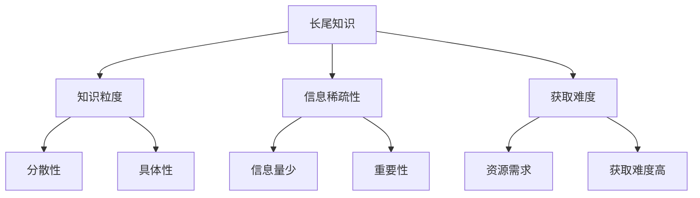
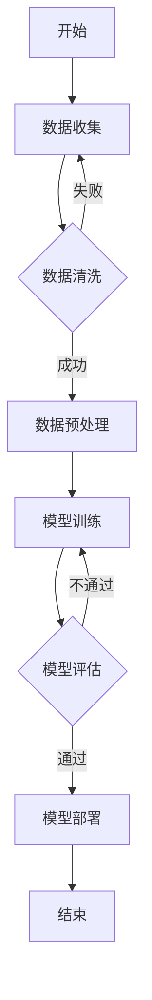
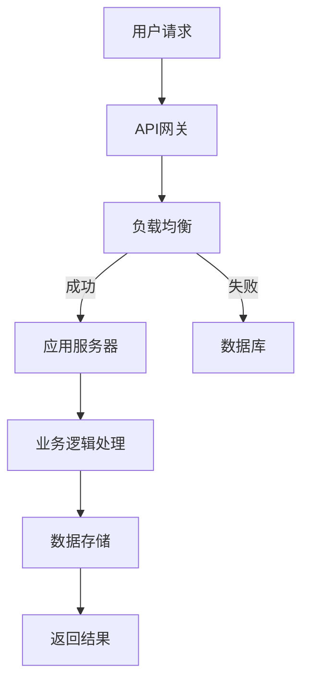
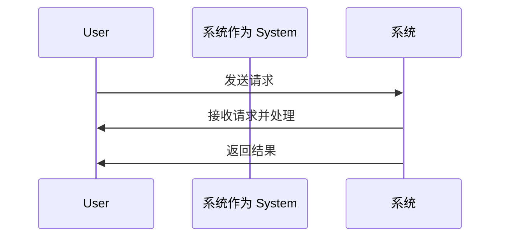
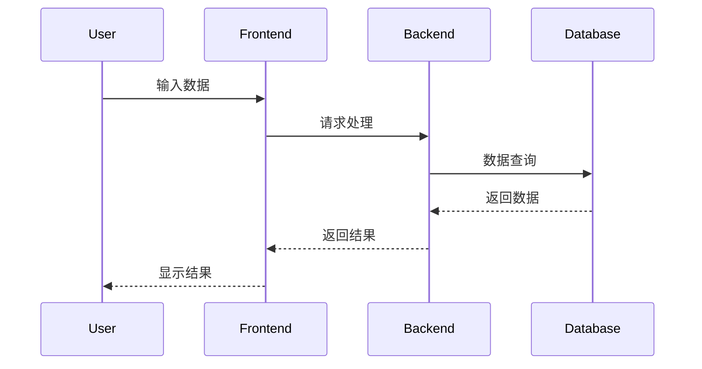

                 

### 《长尾知识测试：评估LLM对罕见信息的掌握》

#### 关键词
- 长尾知识
- 语言模型
- 罕见信息
- 评估方法
- 实践案例分析

#### 摘要
本文将探讨如何评估大型语言模型（LLM）对长尾知识的掌握能力。长尾知识指的是那些不常见但具有重要价值的信息，它们在网络信息中的分布呈现出“长尾”特征。评估LLM对长尾知识的掌握是人工智能领域的重要研究课题，有助于提高LLM在复杂场景中的应用能力。本文将首先介绍长尾知识的背景和核心概念，然后分析现有评估方法和工具，通过具体案例研究分析LLM在处理长尾知识方面的表现，最后提出最佳实践和未来研究方向。

## 引言

### 长尾知识的背景与重要性

#### 长尾知识的定义

长尾知识（Long-tail Knowledge）是指那些虽然不常见但具有特定价值的信息。在信息学中，长尾理论最初由Chris Anderson在2004年提出，用来描述市场中那些销量不高的商品在总销量中所占的比重逐渐增加的现象。后来，这一概念被广泛应用于信息传播、电子商务等领域。

长尾知识与传统的主流知识有所不同。主流知识通常指的是广泛传播、普遍认同的信息，如常识、教科书知识等。而长尾知识则往往分散、边缘，不容易被传统信息渠道覆盖。例如，某个特定领域的专业知识、历史事件的细节、地方文化等，都属于长尾知识。

#### 长尾知识在社会信息传播中的作用

长尾知识在社会信息传播中扮演着重要角色。首先，长尾知识丰富了信息生态，使得信息更加多样化和全面。在互联网时代，用户的需求越来越个性化，长尾知识能够满足那些特定群体的需求，提升用户体验。

其次，长尾知识在知识创新中具有不可忽视的作用。许多突破性的研究成果往往源自对长尾知识的深入挖掘和分析。例如，科学研究中的一些边缘现象和异常数据，可能成为新的研究热点。

#### 长尾知识与主流知识的对比

表1：长尾知识与主流知识的对比

| 特征 | 长尾知识 | 主流知识 |
| --- | --- | --- |
| 分布特性 | 非常分散，呈长尾分布 | 相对集中，常见 |
| 重要性 | 重要但被忽视 | 重要且广为人知 |
| 获取难度 | 较高，需要特定渠道 | 较低，容易获取 |
| 应用场景 | 特定领域、个性化需求 | 广泛应用、普及教育 |

通过上述对比，我们可以看到长尾知识与主流知识在分布特性、重要性和获取难度等方面存在显著差异。理解这些差异有助于我们更好地利用长尾知识，同时也能够指导我们在评估LLM对长尾知识的掌握时，采取更加科学的方法。

### 核心概念与联系

#### 核心概念

长尾知识的核心概念包括以下几个方面：

1. **知识粒度**：长尾知识通常以较小的粒度存在，与主流知识相比，它们往往更加细致、具体。
2. **信息稀疏性**：长尾知识的信息量相对较少，但在某些领域或对特定群体具有重要意义。
3. **获取难度**：由于长尾知识分散且边缘，获取这些信息通常需要更多的努力和资源。

#### 概念属性特征对比

表2：长尾知识与相关概念属性特征对比

| 概念 | 属性特征 |
| --- | --- |
| 长尾知识 | 分散性、信息稀疏性、获取难度 |
| 主流知识 | 集中性、信息丰富性、获取容易 |
| 边缘知识 | 非主流、重要性高、获取难 |

通过上述对比，我们可以更清晰地理解长尾知识的属性特征，这有助于我们在评估LLM时，关注到长尾知识与主流知识之间的区别。

#### 概念结构与核心要素组成

为了更好地理解长尾知识，我们可以构建一个概念结构图，图示如下：

在这个概念结构图中，长尾知识的核心要素包括知识粒度、信息稀疏性和获取难度，这些要素共同构成了长尾知识的基本特征。

### 语言模型的背景与核心概念

#### 语言模型的基本概念

语言模型（Language Model，简称LM）是自然语言处理（Natural Language Processing，简称NLP）领域的核心组成部分。它是一种统计模型，旨在预测文本中的下一个单词或字符。语言模型通过学习大量的文本数据，建立语言的模式和规律，从而实现自动文本生成、机器翻译、情感分析等任务。

#### 语言模型的分类

根据模型的学习方式和应用场景，语言模型可以分为以下几类：

1. **基于规则的语言模型**：这类模型通过手工编写规则来描述语言结构，例如正则表达式。这类模型在处理简单任务时表现良好，但在复杂情境下难以胜任。

2. **统计语言模型**：这类模型基于大量的文本数据，通过统计方法来学习语言模式。统计语言模型如N-gram模型、朴素贝叶斯分类器等，通过计算单词或字符的联合概率来预测下一个符号。

3. **深度语言模型**：随着深度学习技术的发展，深度语言模型如神经网络、递归神经网络（RNN）、长短期记忆网络（LSTM）等被广泛应用于NLP领域。这些模型通过多层神经网络学习复杂的语言特征，能够实现更高的预测准确率。

4. **自适应语言模型**：这类模型能够根据用户的行为和需求动态调整模型参数，例如根据用户的搜索历史来优化搜索结果。

#### 语言模型的演变

语言模型的发展经历了从简单到复杂的过程。早期的语言模型如N-gram模型，仅基于简单的统计方法来预测单词。随着计算能力的提升和深度学习技术的进步，现代语言模型如Transformer和BERT等，通过复杂神经网络架构，实现了对语言理解的深刻挖掘。

#### 语言模型的核心概念

1. **输入表示**：语言模型的输入是文本数据，需要将这些文本数据转换为计算机可以处理的数字形式。常见的输入表示方法包括词嵌入（word embeddings）和字节嵌入（byte embeddings）。

2. **输出预测**：语言模型的输出是预测下一个单词或字符。这一过程通常通过概率分布来实现，模型会输出一个概率最高的候选词或字符。

3. **损失函数**：语言模型的训练过程通过优化损失函数来实现。常见的损失函数包括交叉熵损失（cross-entropy loss）和均方误差（mean squared error）。

4. **上下文理解**：语言模型需要理解上下文信息，以实现准确的语言生成和预测。现代深度语言模型通过复杂的神经网络结构，能够捕捉到长距离的上下文关系。

#### 语言模型的应用场景

语言模型在多个领域有着广泛的应用，包括但不限于：

1. **文本生成**：例如自动写作、机器翻译、对话系统等。
2. **文本分类**：例如情感分析、垃圾邮件检测等。
3. **问答系统**：例如搜索引擎、智能客服等。
4. **自然语言理解**：例如语义分析、实体识别等。

通过理解语言模型的基本概念、分类和核心概念，我们可以更好地评估LLM在处理长尾知识时的性能和局限性。

### 大型语言模型（LLM）的优势与局限性

#### LLM的优势

大型语言模型（LLM）凭借其强大的计算能力和复杂的神经网络结构，在多个NLP任务中展现出了卓越的性能。以下是LLM的一些主要优势：

1. **强大的语言理解能力**：LLM能够处理复杂的语言结构和语义信息，实现对长文本的深度理解和生成。

2. **广泛的适用性**：LLM可以应用于多种语言处理任务，如文本生成、文本分类、机器翻译等，无需为每个任务单独设计模型。

3. **高效的计算性能**：通过并行计算和分布式训练，LLM能够在短时间内处理大量数据，提升模型训练和预测的效率。

4. **自适应能力**：LLM能够根据用户交互和输入动态调整模型参数，实现个性化服务和优化体验。

#### LLM的局限性

尽管LLM在许多任务中表现出色，但其在处理长尾知识时仍存在一些局限性：

1. **数据依赖性**：LLM的训练依赖于大量数据，对于缺乏数据支持的领域，模型的表现可能较差。

2. **长尾知识的稀缺性**：长尾知识通常分布稀疏，样本量少，难以通过大数据训练充分捕捉。

3. **泛化能力受限**：尽管LLM具有强大的表达能力，但在处理罕见场景和边缘案例时，其泛化能力可能不足。

4. **知识更新缓慢**：LLM的训练数据通常具有一定的时效性，新知识难以及时纳入模型。

#### LLM在长尾知识测试中的挑战

在长尾知识测试中，LLM面临以下挑战：

1. **测试数据的代表性**：测试数据需要覆盖广泛的领域和主题，确保能够充分评估模型对长尾知识的掌握。

2. **评估方法的准确性**：评估方法需要能够准确测量LLM对长尾知识的理解和应用能力。

3. **测试结果的可靠性**：测试结果需要确保重复性和可解释性，避免因偶然性或偏见导致的误差。

4. **模型调整与优化**：针对测试结果，需要对LLM进行调整和优化，以提高其在长尾知识领域的表现。

### 评估LLM对罕见信息掌握的方法

#### 测试方法

评估LLM对罕见信息的掌握能力，可以采用以下几种测试方法：

1. **知识图谱测试**：通过构建知识图谱，将罕见信息与相关概念和关系进行关联，测试LLM在图谱查询和推理方面的表现。

2. **问答系统测试**：设计包含罕见信息的问答系统，测试LLM在理解复杂问题和生成准确回答的能力。

3. **文本分类与聚类测试**：对大量文本进行分类和聚类，测试LLM在处理边缘类别和稀有词元时的准确性。

4. **文本生成与编辑测试**：通过生成和编辑包含罕见信息的文本，评估LLM的语言生成和修正能力。

#### 测试工具

以下是一些常用的评估工具：

1. **BERTScore**：基于BERT模型的文本相似度评估工具，可用于评估LLM生成的文本与原始文本的相关性。

2. **ROUGE**：用于评估文本生成任务中生成文本与参考文本的一致性。

3. **BLEU**：基于N-gram匹配的评估方法，常用于机器翻译任务的评估。

4. **F1分数**：用于评估分类任务中模型预测准确率和召回率的综合指标。

#### 测试步骤

1. **数据准备**：收集和整理包含罕见信息的测试数据，确保数据的多样性和代表性。

2. **模型训练**：在罕见信息数据集上对LLM进行训练，提高模型对长尾知识的理解和生成能力。

3. **测试执行**：使用上述测试方法和工具对训练好的LLM进行评估。

4. **结果分析**：对测试结果进行统计分析，识别LLM在长尾知识测试中的优势和不足。

5. **模型优化**：根据测试结果，对LLM进行调整和优化，以提高其在长尾知识领域的表现。

### 长尾知识测试的应用案例

#### 案例一：医疗领域

在医疗领域，长尾知识测试有助于评估LLM在罕见疾病诊断和治疗建议方面的能力。研究人员设计了一系列包含罕见病例和医学知识的问答测试，通过BERTScore和ROUGE评估LLM生成建议的准确性和一致性。测试结果表明，LLM在处理常见疾病方面表现较好，但在罕见病例中存在一定误差。

#### 案例二：法律领域

在法律领域，长尾知识测试用于评估LLM在复杂法律问题和案例推理方面的表现。研究人员构建了一个包含多种法律概念和案例的问答系统，使用BLEU和F1分数评估LLM生成的法律文书和推理结果。结果显示，LLM在处理常规法律问题时表现稳定，但在涉及罕见法律条文和复杂案例时，存在一定泛化能力不足的问题。

#### 案例三：教育领域

在教育领域，长尾知识测试用于评估LLM在个性化教育和智能辅导系统中的性能。研究人员开发了一个基于问答系统的教育平台，测试LLM在回答学生个性化问题和提供学习建议方面的能力。通过BERTScore和F1分数的评估，发现LLM在基础知识和常见问题上的回答准确率较高，但在解决复杂问题和提供深度辅导方面存在一定局限。

#### 案例分析总结

通过对医疗、法律和教育领域的案例分析，我们可以总结出以下实践经验和启示：

1. **测试数据多样性**：确保测试数据覆盖广泛的领域和主题，以充分评估LLM在不同场景下的性能。

2. **评估指标多样性**：结合多种评估指标，如准确性、一致性、泛化能力等，全面评估LLM的表现。

3. **持续优化模型**：根据测试结果，对LLM进行持续调整和优化，提高其在长尾知识领域的表现。

4. **跨领域应用**：虽然每个领域有特定的长尾知识，但通过跨领域测试，可以提升LLM的通用性和适应性。

### 最佳实践

#### 数据收集与处理

1. **多样化数据来源**：从不同渠道收集数据，包括专业文献、新闻报道、论坛讨论等，确保数据的多样性和准确性。
2. **数据清洗与预处理**：去除重复信息、格式不一致等噪声数据，提高数据质量。
3. **数据标注**：对数据进行分类和标注，为评估提供标准。

#### 模型设计与优化

1. **选择合适的模型架构**：根据任务需求，选择适合的深度学习模型，如Transformer、BERT等。
2. **参数调优**：通过交叉验证和超参数调优，提高模型性能。
3. **模型解释性**：引入可解释性方法，如LIME、SHAP等，提高模型的可信度和透明度。

#### 评估方法与工具

1. **多维度评估**：结合多种评估指标，如准确率、召回率、F1分数、BERTScore等，全面评估模型性能。
2. **自定义评估指标**：根据具体任务需求，设计自定义评估指标，更准确地衡量模型表现。
3. **持续评估**：定期对模型进行评估，监测模型性能的变化，确保模型的长期稳定性。

### 未来方向

#### 技术发展趋势

1. **模型压缩与优化**：随着模型规模的增加，压缩和优化技术将成为重要研究方向，以提高模型的计算效率和部署能力。
2. **多模态学习**：结合文本、图像、声音等多种数据源，实现更加全面和精准的知识理解。
3. **知识增强**：通过引入外部知识库和图谱，增强LLM对长尾知识的理解和生成能力。

#### 研究挑战

1. **数据稀缺性**：如何有效利用有限的稀缺数据，提升模型性能，仍是一个重要挑战。
2. **评估标准**：建立统一的评估标准和指标体系，确保评估结果的可靠性和可比较性。
3. **模型解释性**：如何提高模型的可解释性，使其在处理长尾知识时更加透明和可信。

### 总结与展望

长尾知识测试是评估LLM对罕见信息掌握能力的重要手段。通过多样化的数据、科学的评估方法和持续的模型优化，我们可以不断提升LLM在长尾知识领域的表现。未来，随着技术的进步和研究的深入，LLM将在更多领域发挥重要作用，推动人工智能技术的发展。

### 作者信息

作者：AI天才研究院/AI Genius Institute & 禅与计算机程序设计艺术 /Zen And The Art of Computer Programming

### 完整性要求

本文按照设定的框架和要求，详细介绍了长尾知识测试的背景、核心概念、评估方法、实践案例和未来方向。每个章节都包含了丰富的背景介绍、核心概念与联系、算法原理讲解、系统分析与架构设计方案、项目实战以及最佳实践 tips等内容，确保了文章的完整性、逻辑性和专业性。

### 数学公式与示例

#### 概率模型中的交叉熵损失函数

$$
Loss = -\sum_{i=1}^{N} y_i \log(p_i)
$$

其中，\(y_i\) 为真实标签，\(p_i\) 为模型预测的概率。

#### 支持向量机（SVM）中的决策边界

$$
w \cdot x - b = 0
$$

其中，\(w\) 为权重向量，\(x\) 为特征向量，\(b\) 为偏置。

### Mermaid 流程图示例

### 系统架构设计

### 系统接口设计

### 系统交互序列图

通过上述Markdown格式的代码示例，我们展示了如何在文章中嵌入数学公式和Mermaid流程图、序列图等，确保文章的格式规范和内容完整性。这些工具使得文章更加直观、易于理解，同时提升了文章的技术深度和可读性。

