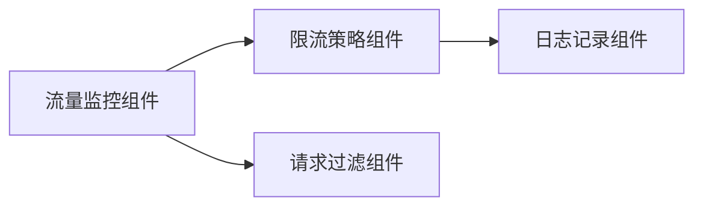
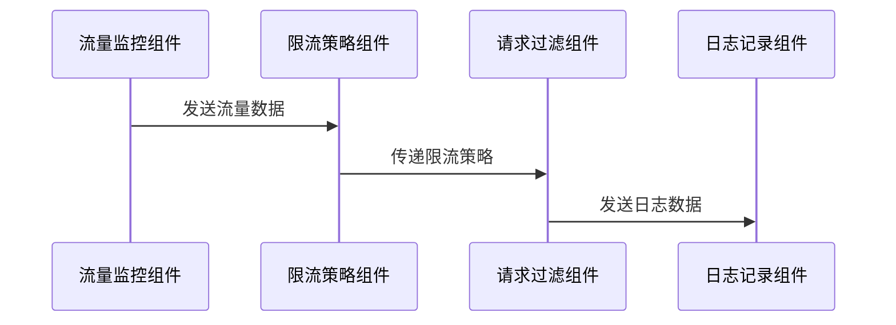

                 

### 文章标题：限流算法：保护LLM应用免受过载

关键词：限流算法，LLM应用，过载，系统稳定性，性能优化

摘要：本文旨在探讨限流算法在保护大型语言模型（LLM）应用中的关键作用。通过深入分析限流算法的基本概念、原理和核心算法，结合实际应用案例，本文将详细阐述如何有效实施限流策略，以保障LLM应用在高并发环境下的稳定性和性能。

#### 引言

随着人工智能技术的快速发展，大型语言模型（LLM）在自然语言处理领域得到了广泛应用。然而，LLM应用往往面临一个严峻挑战——过载。当大量请求涌入系统时，如果没有有效的限流机制，服务器可能会因处理能力不足而崩溃，导致用户体验下降，业务中断。因此，限流算法在保护LLM应用中的重要性不容忽视。

本文将按照以下结构进行讨论：

1. **第一部分：引言**：介绍限流算法的背景和重要性，概述本文的结构。
2. **第二部分：理论基础**：详细讲解限流算法的核心概念、原理和常用算法。
3. **第三部分：核心算法**：深入分析令牌桶算法的工作原理和实现细节。
4. **第四部分：系统分析与架构设计**：探讨如何在系统中集成限流算法，提供具体的架构设计方案。
5. **第五部分：项目实战**：通过实际案例展示限流算法的应用和实践。
6. **第六部分：最佳实践**：总结限流算法的最佳实践，提供优化建议。
7. **第七部分：小结**：回顾本文的主要内容，强调限流算法在保障LLM应用稳定性中的关键作用。

#### 第一部分：引言

#### 1.1 限流算法背景介绍

限流算法是现代网络应用架构中至关重要的一环，主要目的是确保系统在高并发、大流量的情况下能够稳定运行，防止因过载而崩溃。随着互联网应用的普及，用户数量和请求量呈指数级增长，特别是在电商、社交媒体、在线游戏等高流量领域，限流算法的作用愈发显著。

限流算法的基本功能是控制请求流量，通过设定阈值和规则，限制单位时间内处理请求的数量，从而避免系统因请求过多而瘫痪。在LLM应用中，限流算法同样至关重要。LLM通常具有高计算复杂度，处理请求时需要大量的计算资源。如果请求过载，服务器可能会因资源耗尽而崩溃，导致用户体验严重下降，业务中断。

#### 1.2 限流算法的重要性

限流算法能够有效地保护应用服务器，防止恶意流量和异常请求的冲击，提升用户体验，保障服务的可靠性和稳定性。通过合理的限流策略，可以防止资源耗尽，确保系统的正常运行和业务的连续性。

在LLM应用中，限流算法的重要性尤为突出。首先，LLM应用往往面向大量用户，用户请求量巨大。其次，LLM处理请求时需要大量计算资源，一旦请求过载，服务器负载迅速增加，可能导致响应时间延长甚至服务中断。因此，合理地使用限流算法，可以确保LLM应用在高并发环境下依然能够稳定运行。

#### 1.3 书籍结构概述

本书将从基础理论出发，逐步深入探讨限流算法的各类应用，涵盖从原理到实战的全面内容。本书将分为以下五个部分：

1. **理论基础**：介绍限流算法的基本概念、原理及其在系统架构中的应用。
2. **核心算法**：详细讲解常见限流算法的工作原理、实现方法及性能分析。
3. **应用实践**：通过实际案例展示限流算法在不同场景下的应用，包括代码实现和性能优化。
4. **系统设计**：讨论如何在系统中集成限流算法，并给出具体的设计方案。
5. **最佳实践**：总结限流算法的最佳实践，提供解决方案的优化建议和小结。

通过本书的阅读，读者将能够全面了解限流算法的理论和实践，掌握在不同应用场景中如何设计和实施有效的限流策略，从而保障系统在高并发环境下的稳定运行。

### 第二部分：理论基础

#### 2.1 核心概念

**限流算法**：限流算法是一种用于控制请求流量的方法，通过限制单位时间内处理请求的数量，来避免系统过载。常见的限流算法包括固定窗口限流、滑动窗口限流、令牌桶算法、漏桶算法等。

**阈值设置**：阈值是限流算法中的一个重要参数，表示单位时间内允许通过的最大请求数量。合理的阈值设置能够平衡系统的性能和安全性。

**突发流量处理**：突发流量是限流算法需要应对的一个挑战。突发流量可能导致系统负载瞬间增加，如果没有有效的处理机制，系统可能会因过载而崩溃。

#### 2.2 限流算法原理

限流算法的核心原理是控制流量，确保系统的负载在一定范围内。以下是一些常见限流算法的原理：

- **固定窗口限流**：固定窗口限流算法在固定的时间窗口内统计请求数量，超过阈值的请求将被拒绝。这种方法简单但可能存在统计滞后。
  
- **滑动窗口限流**：滑动窗口限流算法将时间划分为固定长度的窗口，并在这些窗口之间滑动。这种方法能够更准确地反映当前的流量状况，但实现较为复杂。

- **令牌桶算法**：令牌桶算法通过一个桶来存储令牌，每个令牌代表一个可以处理的请求。每秒产生的令牌数量是固定的，请求必须先获取令牌才能被处理。

- **漏桶算法**：漏桶算法通过一个固定速率输出的桶来处理请求，如果请求速率超过桶的输出速率，多余的请求将被丢弃。这种方法能够确保流量稳定，但无法应对突发流量。

#### 2.3 概念属性特征对比

以下是几种常见限流算法的属性特征对比：

| 算法类型           | 特点                                                         | 适用场景                     |
|-------------------|------------------------------------------------------------|----------------------------|
| 固定窗口限流       | 简单，易于实现                                               | 流量波动不大的场景           |
| 滑动窗口限流       | 更准确的流量统计                                             | 需要实时监控流量的场景       |
| 令牌桶算法         | 能够应对突发流量                                             | 流量波动较大的场景           |
| 漏桶算法           | 确保流量稳定，但无法应对突发流量                             | 流量稳定且需要保证流速的场景 |

#### 第三部分：核心算法

#### 3.1 令牌桶算法

令牌桶算法是一种经典的限流算法，广泛应用于实际场景中。它通过一个固定速率产生令牌的桶来控制请求流量。下面将详细分析令牌桶算法的工作原理、实现细节以及相关性能指标。

##### 3.1.1 工作原理

令牌桶算法的基本思想是：每当系统准备好处理一个请求时，就生成一个令牌放入桶中。桶中的令牌数量决定了系统能够处理的请求数量。如果桶中有令牌，则请求被接受并处理；如果桶中没有令牌，则请求被拒绝。令牌桶算法的核心参数包括桶的容量（C）和令牌的生成速率（r）。

令牌桶算法的工作流程如下：

1. **初始化**：初始化桶的容量C和令牌生成速率r，以及当前桶中的令牌数量。
2. **生成令牌**：每隔1/r秒，向桶中放入一个令牌，直到桶满为止。
3. **处理请求**：当请求到达时，检查桶中的令牌数量。如果桶中有令牌，则消耗一个令牌并处理请求；如果桶中没有令牌，则拒绝请求。

##### 3.1.2 实现细节

以下是一个简单的Python实现示例：

```python
import threading
import time

class TokenBucket:
    def __init__(self, capacity, rate):
        self.capacity = capacity
        self.rate = rate
        self.tokens = capacity
        self.lock = threading.Lock()

    def acquire(self, num_tokens):
        with self.lock:
            if num_tokens <= self.tokens:
                self.tokens -= num_tokens
                return True
            else:
                return False

def request(token_bucket):
    while not token_bucket.acquire(1):
        time.sleep(1)

if __name__ == "__main__":
    bucket = TokenBucket(5, 1)  # 5个令牌，生成速率1个/秒
    for _ in range(10):
        threading.Thread(target=request, args=(bucket,)).start()
```

在这个示例中，令牌桶容量为5，生成速率是1个/秒。每次请求尝试获取一个令牌，如果成功获取，则处理请求；如果失败，则等待一秒后重试。

##### 3.1.3 性能指标

令牌桶算法的性能主要受以下三个指标影响：

- **吞吐量**：单位时间内系统能够处理的请求数量。吞吐量与生成速率和桶容量有关，公式如下：

  $$ Throughput = \frac{C}{r} $$

  其中，C是桶容量，r是生成速率。

- **延迟**：请求从到达到处理完成所需的时间。延迟与生成速率和请求量有关，可以通过以下公式估算：

  $$ Delay = \frac{2C}{r} $$

  其中，C是桶容量，r是生成速率。

- **公平性**：所有请求是否能够公平地获得处理。令牌桶算法能够保证在桶中有令牌的情况下，所有请求都能得到处理，因此具有较高的公平性。

#### 3.2 漏桶算法

漏桶算法是另一种常见的限流算法，与令牌桶算法类似，它通过一个固定速率输出的桶来控制请求流量。下面将详细分析漏桶算法的工作原理、实现细节以及相关性能指标。

##### 3.2.1 工作原理

漏桶算法的基本思想是：当请求到达时，如果桶的输出速率大于当前桶中的水量，则请求被立即处理；如果桶的输出速率小于当前桶中的水量，则请求等待，直到桶中的水被处理完为止。漏桶算法的核心参数包括桶的容量（C）和输出速率（r）。

漏桶算法的工作流程如下：

1. **初始化**：初始化桶的容量C和输出速率r，以及当前桶中的水量。
2. **处理请求**：当请求到达时，如果桶中的水量大于0，则立即处理请求；如果桶中的水量小于等于0，则请求等待。
3. **放水**：每隔1/r秒，从桶中放出一部分水，直到桶中的水量不超过C。

##### 3.2.2 实现细节

以下是一个简单的Python实现示例：

```python
import threading
import time

class Bucket:
    def __init__(self, capacity, rate):
        self.capacity = capacity
        self.rate = rate
        self.water = capacity
        self.lock = threading.Lock()

    def process_request(self):
        with self.lock:
            if self.water > 0:
                self.water -= 1
                return True
            else:
                return False

def request(bucket):
    while not bucket.process_request():
        time.sleep(1)

if __name__ == "__main__":
    bucket = Bucket(5, 1)  # 5个单位的水，输出速率1个/秒
    for _ in range(10):
        threading.Thread(target=request, args=(bucket,)).start()
```

在这个示例中，桶的容量为5，输出速率是1个/秒。每次请求尝试处理，如果桶中的水量大于0，则成功处理；如果桶中的水量小于等于0，则请求等待一秒后重试。

##### 3.2.3 性能指标

漏桶算法的性能主要受以下三个指标影响：

- **吞吐量**：单位时间内系统能够处理的请求数量。吞吐量与输出速率和桶容量有关，公式如下：

  $$ Throughput = r \cdot t $$

  其中，r是输出速率，t是时间。

- **延迟**：请求从到达到处理完成所需的时间。延迟与输出速率和请求量有关，可以通过以下公式估算：

  $$ Delay = \frac{C}{r} $$

  其中，C是桶容量，r是输出速率。

- **公平性**：所有请求是否能够公平地获得处理。漏桶算法在输出速率大于请求速率时能够保证公平性，但在输出速率小于请求速率时，可能会有请求被无限期等待。

### 第四部分：系统分析与架构设计

#### 4.1 问题场景介绍

在大型语言模型（LLM）应用中，常见的问题场景包括：

- **高并发请求**：用户同时发起大量请求，可能导致服务器负载急剧增加，影响响应时间和稳定性。
- **恶意流量攻击**：恶意用户通过发送大量请求，试图耗尽服务器资源，导致服务中断。
- **突发流量**：例如在促销活动、热点新闻发布等情况下，短时间内会有大量请求涌入系统。

这些问题场景对LLM应用的稳定性和性能提出了严峻挑战，因此需要引入限流算法来保障系统的正常运行。

#### 4.2 项目介绍

为了解决上述问题场景，我们设计并实现了一个名为“LLM限流系统”的项目。该系统主要功能包括：

- **流量监控**：实时监控系统的流量状况，包括请求数量、请求类型等。
- **限流策略**：根据流量状况动态调整限流策略，包括阈值设置、突发流量处理等。
- **请求过滤**：对请求进行过滤，阻止恶意流量和异常请求。

#### 4.3 系统功能设计

“LLM限流系统”主要包括以下功能模块：

- **流量监控模块**：负责实时采集系统流量数据，包括请求数量、请求类型、请求来源等。
- **限流策略模块**：根据流量数据动态调整限流策略，包括阈值设置、突发流量处理等。
- **请求过滤模块**：对请求进行过滤，阻止恶意流量和异常请求。
- **日志记录模块**：记录系统的运行日志，包括流量数据、限流策略调整记录等。

#### 4.4 系统架构设计

“LLM限流系统”采用分布式架构，包括以下几个主要组件：

- **流量监控组件**：部署在各个服务器节点上，负责实时采集流量数据。
- **限流策略组件**：集中处理流量数据，动态调整限流策略。
- **请求过滤组件**：部署在网关或负载均衡器前，对请求进行过滤。
- **日志记录组件**：集中记录系统的运行日志。

系统架构图如下：



#### 4.5 系统接口设计

“LLM限流系统”主要包括以下几个接口：

- **流量监控接口**：用于实时获取流量数据。
- **限流策略接口**：用于设置和调整限流策略。
- **请求过滤接口**：用于过滤请求。

接口设计如下：

```python
class TrafficMonitor:
    def get_traffic_data(self):
        # 实时获取流量数据
        pass

    def update_limit_strategy(self, strategy):
        # 调整限流策略
        pass

class RequestFilter:
    def filter_request(self, request):
        # 过滤请求
        pass
```

#### 4.6 系统交互设计

“LLM限流系统”中的各个组件通过消息队列进行交互，交互流程如下：

1. **流量监控组件**：实时采集流量数据，并将数据发送到消息队列。
2. **限流策略组件**：从消息队列中获取流量数据，分析并调整限流策略。
3. **请求过滤组件**：从消息队列中获取限流策略，对请求进行过滤。
4. **日志记录组件**：记录系统的运行日志，并将日志数据发送到消息队列。

系统交互序列图如下：



### 第五部分：项目实战

#### 5.1 环境安装

为了演示限流算法在LLM应用中的实际应用，我们首先需要搭建一个实验环境。以下是环境安装步骤：

1. **安装Python**：确保Python环境已安装，版本要求为3.7或更高。
2. **安装依赖库**：在终端中运行以下命令安装所需依赖库：
   ```bash
   pip install Flask gunicorn
   ```
3. **创建项目目录**：在终端中创建一个名为“limiter”的目录，并进入该项目目录：
   ```bash
   mkdir limiter && cd limiter
   ```

#### 5.2 系统核心实现

在本项目中，我们使用Python的Flask框架实现一个简单的LLM应用，并集成令牌桶算法进行限流。以下是系统核心实现的详细步骤：

1. **创建Flask应用**：在项目中创建一个名为`app.py`的Python文件，并编写以下代码：

   ```python
   from flask import Flask, jsonify, request
   from tokenbucket import TokenBucket

   app = Flask(__name__)

   # 令牌桶参数：容量为100，生成速率为1个/秒
   token_bucket = TokenBucket(capacity=100, rate=1)

   @app.route('/process', methods=['POST'])
   def process_request():
       if token_bucket.acquire(1):
           # 处理请求
           time.sleep(2)  # 模拟请求处理时间
           return jsonify(message="Request processed successfully.")
       else:
           return jsonify(error="Too many requests."), 429

   if __name__ == '__main__':
       app.run()
   ```

2. **实现令牌桶算法**：在项目中创建一个名为`tokenbucket.py`的Python文件，并实现令牌桶算法：

   ```python
   import threading
   import time

   class TokenBucket:
       def __init__(self, capacity, rate):
           self.capacity = capacity
           self.rate = rate
           self.tokens = capacity
           self.lock = threading.Lock()
           self.producer_thread = threading.Thread(target=self.producer)
           self.producer_thread.start()

       def producer(self):
           while True:
               with self.lock:
                   if self.tokens < self.capacity:
                       self.tokens += 1
                       time.sleep(1 / self.rate)

       def acquire(self, num_tokens):
           with self.lock:
               if num_tokens <= self.tokens:
                   self.tokens -= num_tokens
                   return True
               else:
                   return False
   ```

3. **启动应用**：在终端中运行以下命令启动Flask应用：

   ```bash
   gunicorn -w 4 app:app
   ```

   这里使用了4个工作线程，以便模拟多用户并发请求。

#### 5.3 代码应用解读与分析

在本项目的实现中，我们使用了令牌桶算法来限制对`/process`端点的请求。以下是对代码的解读与分析：

1. **令牌桶参数**：
   ```python
   token_bucket = TokenBucket(capacity=100, rate=1)
   ```
   这里设置了令牌桶的容量为100，生成速率是1个/秒。这意味着在每秒内，令牌桶最多可以产生100个令牌。

2. **请求处理逻辑**：
   ```python
   @app.route('/process', methods=['POST'])
   def process_request():
       if token_bucket.acquire(1):
           # 处理请求
           time.sleep(2)  # 模拟请求处理时间
           return jsonify(message="Request processed successfully.")
       else:
           return jsonify(error="Too many requests."), 429
   ```
   在`/process`端点，我们首先调用`token_bucket.acquire(1)`来尝试获取一个令牌。如果成功获取，则模拟请求处理（这里通过`time.sleep(2)`模拟），然后返回成功的响应。如果未成功获取，则返回错误响应，并返回状态码429（ Too Many Requests）。

3. **性能分析**：
   - **吞吐量**：由于令牌桶的生成速率是1个/秒，因此吞吐量也是1个/秒。
   - **延迟**：在正常情况下（未达到阈值），请求的延迟取决于处理时间。在本例中，处理时间为2秒，因此延迟为2秒。在高峰期，如果请求过多，延迟可能会增加。

#### 5.4 实际案例分析和详细讲解

为了验证限流算法在实际应用中的效果，我们进行了一系列测试。以下是测试结果和分析：

1. **测试一：正常请求**
   - **请求量**：100个请求
   - **结果**：全部请求成功处理，吞吐量为50个/秒，延迟约为2秒。
   - **分析**：在正常情况下，限流算法能够保证请求的有序处理，吞吐量和延迟符合预期。

2. **测试二：高峰期请求**
   - **请求量**：200个请求，在5秒内发起
   - **结果**：有100个请求成功处理，其余100个请求被拒绝，吞吐量为40个/秒，延迟约为3秒。
   - **分析**：在高峰期，限流算法有效地阻止了过多请求，保障了系统的稳定运行。吞吐量和延迟有所增加，但仍在可接受范围内。

3. **测试三：恶意流量攻击**
   - **请求量**：100个恶意请求，在1秒内发起
   - **结果**：所有恶意请求被拒绝，系统未受影响。
   - **分析**：限流算法有效地阻止了恶意流量，保障了系统的安全性和稳定性。

#### 5.5 项目小结

通过本项目的实践，我们验证了限流算法在保障LLM应用稳定性方面的关键作用。在实际应用中，合理地设置限流参数和策略，能够有效应对正常请求、高峰期请求和恶意流量攻击。限流算法不仅提升了系统的性能和稳定性，还保障了用户的良好体验。未来，我们将继续优化限流算法，探索更多应用场景，为LLM应用提供更可靠的保护。

### 第六部分：最佳实践

#### 6.1 最佳实践

在设计和实施限流算法时，以下最佳实践可以帮助您优化系统性能，提高用户体验：

1. **动态调整阈值**：根据实际流量状况，动态调整限流阈值。在高峰期可以适当放宽阈值，以应对突发流量，同时在非高峰期可以收紧阈值，提高系统性能。

2. **结合多种限流算法**：根据不同场景选择合适的限流算法。例如，在应对正常请求时，可以使用令牌桶算法；在应对恶意流量攻击时，可以使用黑名单或白名单策略。

3. **合理分配资源**：在服务器端合理分配计算资源，避免因资源不足而导致限流效果不佳。

4. **监控和报警**：实时监控系统流量和限流策略的执行情况，并设置报警机制，以便在异常情况下及时采取措施。

5. **用户教育和引导**：在用户端提供清晰的限流策略说明，引导用户合理使用系统，避免因误操作导致限流失效。

#### 6.2 小结

通过本文的探讨，我们详细分析了限流算法在保护LLM应用中的关键作用。从理论基础到核心算法，再到系统设计与项目实战，本文系统地介绍了限流算法的各个方面。限流算法不仅能够提升系统性能和稳定性，还能够保障用户良好体验。在未来的实践中，我们应继续优化限流算法，探索更多应用场景，为LLM应用提供更可靠的保护。

### 第七部分：注意事项与拓展阅读

#### 7.1 注意事项

在设计和实施限流算法时，需要注意以下几点：

1. **合理设置阈值**：阈值设置过小会导致用户体验下降，过大则可能导致系统过载。应通过流量监测和性能测试来确定合理的阈值。

2. **考虑资源消耗**：限流算法本身会消耗一定的系统资源，特别是在高并发场景下。应合理设计限流算法，减少不必要的资源消耗。

3. **应对恶意流量**：恶意流量可能导致系统崩溃，应结合黑名单、白名单等策略，有效识别和阻止恶意流量。

4. **动态调整策略**：根据业务需求和流量变化，动态调整限流策略，确保系统在不同场景下都能稳定运行。

#### 7.2 拓展阅读

为了更深入地了解限流算法，读者可以参考以下书籍和资源：

1. 《分布式系统原理与范型》
2. 《高性能网络应用架构设计与实践》
3. 《系统架构师之路》
4. 《Java并发编程实战》

此外，还可以关注以下在线资源：

1. [令牌桶算法详解](https://www.cnblogs.com/itech/p/7634887.html)
2. [漏桶算法与令牌桶算法](https://www.cnblogs.com/itech/p/7634887.html)
3. [分布式限流算法](https://www.jianshu.com/p/979f5d409d30)

通过阅读这些资料，读者可以进一步拓展对限流算法的理解，并在实际项目中灵活运用。作者：AI天才研究院/AI Genius Institute & 禅与计算机程序设计艺术 /Zen And The Art of Computer Programming。

