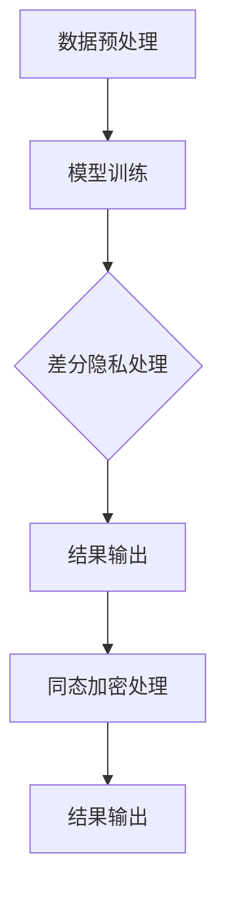
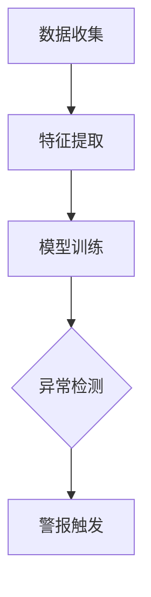
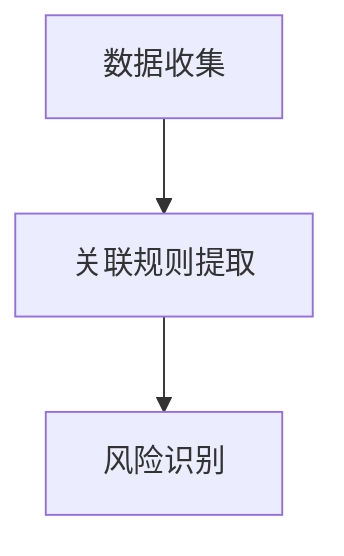
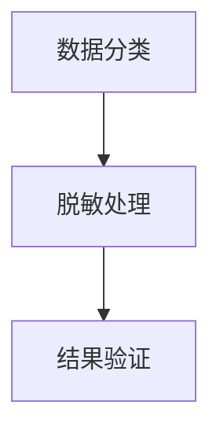
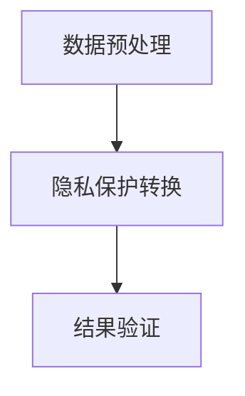
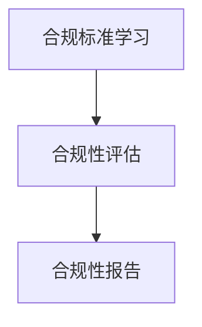
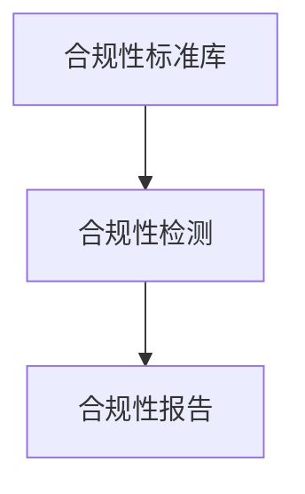

                 

### 隐私保护基础

#### 第1章：隐私保护概述

##### 1.1 隐私保护的重要性

隐私保护是现代社会信息安全的基石。随着互联网和数字技术的飞速发展，个人和组织的数据几乎无时无刻不在网络上流动。然而，数据的广泛收集与利用也带来了隐私泄露的风险。隐私保护的重要性体现在以下几个方面：

- **个人信息安全**：保护个人信息不被非法获取、滥用或泄露，防止个人身份被盗用，对于每个用户来说至关重要。
- **商业秘密保护**：企业的运营数据、客户数据等商业秘密的泄露可能给企业带来无法估量的损失。
- **社会稳定**：隐私泄露可能导致社会矛盾加剧，甚至威胁国家安全。

在当前数据驱动的社会中，隐私保护不仅是技术问题，更是一个涉及伦理、法律和社会治理的综合性课题。因此，加强隐私保护意识，制定合理的隐私保护策略，显得尤为重要。

##### 1.2 隐私的定义与特征

隐私可以定义为个人或组织对信息的控制权，包括信息的访问、使用和披露。具体来说，隐私具有以下几个特征：

- **私密性**：隐私涉及到个人不愿意让他人知晓的信息。
- **控制权**：个人或组织有权决定其信息的访问和使用。
- **数据完整性**：个人信息应保持其原始性和准确性。
- **可用性**：在需要时，个人应能访问和使用其信息。

这些特征共同构成了隐私保护的基础。隐私保护的核心目标是确保个人或组织的信息不被未经授权的第三方获取，从而保护其隐私权益。

##### 1.3 隐私保护的现状与挑战

当前，全球隐私保护的现状呈现出积极和消极两方面。积极方面，各国政府和组织纷纷出台隐私保护法律和政策，加大了对隐私泄露事件的查处力度。例如，欧盟的《通用数据保护条例》（GDPR）和美国的《加州消费者隐私法案》（CCPA）都是较为严格的隐私保护法律。

然而，隐私保护的现状也面临诸多挑战：

- **技术挑战**：随着技术的发展，隐私保护面临着新的威胁。例如，人工智能、大数据分析和区块链技术等可能带来隐私泄露的风险。
- **数据泄露频发**：全球范围内，数据泄露事件频繁发生，造成了巨大的经济损失和信誉损害。
- **法律执行困难**：尽管隐私保护法律不断完善，但执行力度和效果仍存在不足，一些国家和地区缺乏有效的隐私保护机制。

因此，如何在隐私保护和数据利用之间找到平衡，仍然是当前隐私保护领域需要解决的重要问题。

##### 1.4 隐私保护的法律框架

隐私保护的法律框架是确保隐私权益得到有效保护的重要保障。以下简要介绍国际和我国的隐私保护法律体系。

**国际隐私保护法律**

- **欧盟**：欧盟的《通用数据保护条例》（GDPR）是全球最为严格的隐私保护法律之一，它规定了数据处理的合法性、透明度和数据主体的权利等。
- **美国**：美国的隐私保护法律相对分散，较为重要的包括《儿童在线隐私保护法案》（COPPA）和《加州消费者隐私法案》（CCPA）。

**我国隐私保护法律体系**

- **《网络安全法》**：作为我国网络安全的基本法律，明确了网络运营者的安全保护义务和用户个人信息保护的要求。
- **《数据安全法》**：规定了数据安全保护的基本要求和措施，强调了数据安全的重要性。
- **《个人信息保护法》**（PIPL）：该法是我国首部个人信息保护的基础性法律，对个人信息的收集、使用、存储、处理、传输等行为进行了全面规范。

这些法律构成了我国隐私保护的法律框架，为个人信息保护和数据安全提供了法律依据。

##### 1.5 隐私保护的技术手段

隐私保护的技术手段是确保数据在存储、传输和处理过程中不被未经授权的第三方访问和利用的关键。以下介绍几种常见的隐私保护技术手段：

- **加密技术**：加密技术通过对数据进行加密处理，使得只有拥有密钥的用户才能解密和读取数据，从而保护数据的安全性和完整性。
- **安全多方计算**：安全多方计算技术允许多个参与方在不泄露各自敏感数据的前提下，共同完成计算任务，保护了各方的隐私。
- **零知识证明**：零知识证明技术允许一方在不泄露任何信息的情况下，证明某个陈述是正确的，从而保护交易双方的隐私。

这些技术手段在隐私保护中发挥着重要作用，但随着技术的发展，隐私保护技术也在不断更新和完善。

##### 1.6 隐私保护实践案例

隐私保护实践案例能够更好地说明隐私保护在现实中的应用和效果。以下介绍两个案例：

**企业隐私保护实践**

- **案例一**：某互联网企业通过引入加密技术、安全多方计算和零知识证明等隐私保护技术，有效地保护了用户数据的隐私。例如，在用户注册时，该企业采用加密技术对用户信息进行加密存储，并通过安全多方计算完成用户身份验证，从而确保用户数据的安全。
- **案例二**：某金融企业通过建立完善的数据安全管理制度，包括数据访问控制、数据备份与恢复、安全审计等，有效地防止了内部员工和数据泄露事件。

**个人隐私保护实践**

- **案例一**：某个人用户通过使用加密软件对个人电脑中的敏感文件进行加密，并定期备份数据到安全存储设备上，从而防止数据泄露。
- **案例二**：某个人用户通过设置复杂的密码、使用双因素认证、定期更新操作系统和软件等方式，增强了个人账户和信息的安全性。

这些案例表明，隐私保护不仅仅是技术问题，还需要用户和管理者共同努力，才能实现有效的隐私保护。

##### 1.7 本章小结

隐私保护是现代社会信息安全的重要组成部分。本章从隐私保护的重要性、定义与特征、现状与挑战、法律框架、技术手段和实践案例等方面进行了详细阐述。通过本章的学习，读者可以更好地理解隐私保护的核心概念和重要性，为后续章节的学习打下坚实的基础。

### LLM技术简介

#### 第2章：LLM技术简介

##### 2.1 LLM的概念与发展

**概念**

大型语言模型（Large Language Model，简称LLM）是一种基于深度学习技术构建的能够理解、生成和翻译自然语言的强大模型。它通过从大量文本数据中学习语言模式，能够生成连贯、语义丰富的文本。

**发展历程**

LLM的发展经历了几个关键阶段：

- **早期模型**：最早的大型语言模型之一是WordNet，它于1986年推出，通过词汇之间的语义关系构建了一个庞大的语义网络。
- **GPT系列**：2018年，OpenAI发布了GPT（Generative Pre-trained Transformer），这是一个基于Transformer模型的预训练语言模型，具有强大的文本生成能力。
- **BERT**：随后，Google发布了BERT（Bidirectional Encoder Representations from Transformers），这是一个双向的Transformer模型，通过同时学习上下文信息，大幅提升了自然语言处理任务的性能。
- **GPT-3**：2020年，OpenAI发布了GPT-3，这是目前最大的语言模型，拥有1750亿个参数，能够生成高质量的自然语言文本。

##### 2.2 LLM的架构与实现

**Transformer模型**

Transformer模型是LLM的核心架构，它通过自注意力机制（Self-Attention）对输入文本进行编码，能够捕捉文本中的长距离依赖关系。Transformer模型主要包括编码器（Encoder）和解码器（Decoder）两部分。

- **编码器**：编码器将输入的词向量转换为固定长度的序列，每个词向量都经过多层自注意力机制处理，以提取文本的语义信息。
- **解码器**：解码器利用编码器输出的序列生成文本输出，同样通过自注意力机制，结合编码器的输出和已生成的文本，生成下一个词。

**GPT系列模型**

GPT系列模型是LLM的代表性模型，其核心思想是通过大规模预训练和微调来提升模型的文本生成能力。

- **预训练**：GPT模型通过在大规模语料库上进行预训练，学习语言的基本规则和模式。
- **微调**：在特定任务上，对模型进行微调，使其适应具体的任务需求。

**LLM的扩展与应用**

随着LLM技术的发展，各种基于LLM的应用不断涌现。例如：

- **文本生成**：LLM可以生成各种类型的文本，如文章、小说、新闻等。
- **机器翻译**：LLM在机器翻译领域表现出色，能够实现高质量的自然语言翻译。
- **问答系统**：LLM可以构建问答系统，回答用户提出的问题。
- **对话系统**：LLM在构建对话系统方面也有广泛应用，能够实现与人类的自然对话。

##### 2.3 LLM在信息安全中的应用

**安全检测**

LLM在安全检测中具有广泛的应用，包括：

- **恶意软件检测**：LLM可以通过分析恶意软件的代码和行为模式，识别潜在的恶意软件。
- **安全事件预警**：LLM可以对网络流量进行分析，预测可能的安全事件，提前采取措施。

**威胁情报分析**

LLM在威胁情报分析中可以发挥重要作用，包括：

- **攻击模式识别**：LLM可以学习历史攻击数据，识别新的攻击模式。
- **威胁源追踪**：LLM可以帮助追踪攻击者的IP地址、域名等信息，确定攻击源。

**防御策略**

LLM在防御策略中可以提供以下支持：

- **策略生成**：LLM可以根据历史数据和攻击模式，生成个性化的防御策略。
- **策略评估**：LLM可以评估不同防御策略的有效性，帮助决策者选择最优策略。

##### 2.4 LLM的挑战与未来方向

**安全性问题**

随着LLM在信息安全中的应用越来越广泛，其安全性问题也日益突出。例如：

- **模型泄露**：如果模型被攻击者获取，可能导致敏感信息的泄露。
- **对抗攻击**：攻击者可以通过对抗性样本攻击LLM，使其输出错误的结果。

**隐私保护**

LLM在处理大量文本数据时，可能涉及用户隐私。如何保护用户隐私，避免数据泄露，是未来需要解决的重要问题。

**未来方向**

未来LLM在信息安全中的应用将朝着以下几个方向发展：

- **模型安全**：研究如何提高LLM的安全性，防止模型被攻击。
- **隐私保护**：开发新的隐私保护技术，保护用户隐私。
- **自适应防御**：利用LLM的强大学习能力，构建自适应的防御系统，实时应对新的威胁。

##### 2.5 本章小结

本章介绍了LLM的概念与发展、架构与实现、在信息安全中的应用以及挑战和未来方向。通过本章的学习，读者可以了解LLM的基本概念和应用，为进一步探讨其在隐私保护中的表现打下基础。

### LLM在数据安全中的应用

#### 第3章：LLM在数据安全中的应用

##### 3.1 数据安全的重要性

在数字化的今天，数据已经成为企业和社会的核心资产。数据安全的重要性不言而喻，主要体现在以下几个方面：

- **数据泄露**：数据泄露可能导致敏感信息被未授权的个人或组织获取，从而引发经济损失、声誉损害甚至法律风险。
- **商业机密泄露**：企业的商业机密如客户信息、市场策略、研发计划等，如果泄露，可能被竞争对手利用，导致市场份额减少。
- **信任危机**：数据泄露事件会对公众和企业信任产生严重影响，损害企业的品牌形象和用户忠诚度。
- **法律责任**：多个国家和地区对数据泄露有严格的法律法规要求，企业一旦发生数据泄露，可能面临巨额罚款和法律诉讼。

因此，确保数据安全不仅是企业自身的责任，也是维护社会稳定和国家安全的重要任务。

##### 3.2 数据安全的关键因素

数据安全的关键因素包括以下几个方面：

- **物理安全**：确保存储数据的物理设备（如服务器、数据中心）不受损害，防止自然灾害、人为破坏等威胁。
- **网络安全**：通过防火墙、入侵检测系统等网络安全设备和技术，防止网络攻击和数据泄露。
- **数据加密**：对存储和传输的数据进行加密处理，确保只有授权用户才能解密和读取数据。
- **访问控制**：通过用户身份验证、权限管理等方式，控制对数据的访问权限，防止未授权访问。
- **安全审计**：定期对系统进行安全审计，检测潜在的安全漏洞和异常行为，及时采取修补措施。
- **备份与恢复**：定期对数据进行备份，确保在数据丢失或损坏时能够迅速恢复。

这些关键因素共同构成了数据安全的基础，企业应根据自身实际情况，采取综合措施确保数据安全。

##### 3.3 LLM在数据安全检测中的应用

LLM在数据安全检测中的应用主要体现在以下几个方面：

- **恶意软件检测**：LLM可以通过分析恶意软件的代码和行为模式，识别潜在的恶意软件。例如，LLM可以学习已知的恶意代码特征，并利用自注意力机制捕捉代码中的异常行为，从而实现对恶意软件的实时检测。

**具体案例分析**：

- **案例一**：某企业利用LLM对内部网络进行实时监控，通过分析网络流量和日志数据，成功识别出多个恶意软件样本，及时阻止了潜在的攻击。
- **案例二**：某金融机构的网络安全团队利用LLM对交易数据进行监控，通过对交易行为的模式识别，发现了多个异常交易行为，并迅速采取措施，防止了潜在的资金损失。

- **数据泄露预警**：LLM可以通过对历史数据泄露事件的学习，建立数据泄露预警模型。当检测到数据访问模式异常、数据传输量异常等迹象时，LLM可以发出预警，提示安全团队采取进一步的调查和防护措施。

**具体案例分析**：

- **案例一**：某电商平台通过LLM对用户行为数据进行分析，发现某一用户频繁访问敏感数据的行为异常，并迅速采取了安全措施，防止了敏感数据的泄露。
- **案例二**：某政府机构利用LLM对内部文件访问日志进行分析，发现某一部门员工访问大量敏感文件的行为异常，立即进行内部调查，防止了潜在的数据泄露事件。

##### 3.4 LLM在数据加密与解密中的应用

LLM在数据加密与解密中的应用主要体现在以下几个方面：

- **对称加密算法**：LLM可以通过学习对称加密算法的原理和参数，生成复杂的加密密钥，提高加密算法的安全性。同时，LLM还可以在解密过程中，利用加密算法的逆过程，快速解密数据。

**具体案例分析**：

- **案例一**：某金融企业利用LLM生成一对加密密钥，用于对交易数据进行加密存储。通过LLM的学习和优化，加密密钥的生成过程更加复杂，有效提高了数据的安全性。
- **案例二**：某科研机构利用LLM对实验室的研究数据进行加密，确保数据在传输和存储过程中不被泄露。在需要访问数据时，LLM可以快速解密数据，提高数据访问效率。

- **非对称加密算法**：LLM可以通过学习非对称加密算法的原理和参数，生成复杂的公钥和私钥，提高加密算法的安全性。在数据传输过程中，LLM可以实时对数据进行加密和解密，确保数据在传输过程中的安全性。

**具体案例分析**：

- **案例一**：某电商平台利用LLM生成一对非对称加密密钥，用于对用户支付信息进行加密传输。通过LLM的学习和优化，加密密钥的生成过程更加复杂，有效提高了支付信息的安全性。
- **案例二**：某政府机构利用LLM对内部文件进行加密存储，确保文件在传输和存储过程中不被泄露。在需要访问文件时，LLM可以快速解密文件，提高数据访问效率。

##### 3.5 LLM在数据安全管理的应用

LLM在数据安全管理的应用主要体现在以下几个方面：

- **数据访问控制**：LLM可以通过学习用户的访问权限和操作记录，自动生成访问控制策略，确保只有授权用户才能访问特定的数据。

**具体案例分析**：

- **案例一**：某企业利用LLM对内部员工的数据访问权限进行管理。通过LLM的学习和优化，自动生成精细的访问控制策略，有效防止了内部数据泄露事件。
- **案例二**：某政府机构利用LLM对内部文件的访问权限进行管理，确保敏感文件只能被授权的部门和个人访问，有效提高了数据安全性。

- **数据备份与恢复**：LLM可以通过学习历史备份和恢复数据的过程，自动生成备份和恢复策略，确保在数据丢失或损坏时能够迅速恢复。

**具体案例分析**：

- **案例一**：某企业利用LLM对重要数据进行定期备份，并通过LLM自动生成的恢复策略，在数据丢失或损坏时能够迅速恢复，减少了对业务的影响。
- **案例二**：某科研机构利用LLM对研究数据进行备份和恢复管理，通过自动生成的备份和恢复策略，确保研究数据的安全性和完整性。

##### 3.6 本章小结

本章介绍了LLM在数据安全中的应用，包括数据安全的重要性、关键因素、LLM在数据安全检测中的应用、数据加密与解密中的应用以及数据安全管理的应用。通过本章的学习，读者可以了解LLM在数据安全领域的重要作用和实际应用案例，为进一步探讨LLM在信息安全中的表现打下基础。

### LLM在网络安全中的应用

#### 第4章：LLM在网络安全中的应用

##### 4.1 网络安全的重要性

网络安全是保护网络系统、数据、网络资源不受未授权访问、使用、披露、破坏、修改或破坏的重要措施。随着网络技术的发展和应用范围的扩大，网络安全问题变得日益复杂和严重。网络安全的重要性体现在以下几个方面：

- **数据保护**：网络中存储和传输的数据是企业和个人宝贵的资产。网络安全能够确保这些数据不被非法获取、篡改或破坏。
- **业务连续性**：网络攻击可能导致企业业务中断，造成经济损失和声誉损害。网络安全措施能够保障业务的连续性和稳定性。
- **隐私保护**：网络安全能够防止个人隐私泄露，保护用户信息不被滥用。
- **国家利益**：网络空间已经成为国家利益的重要组成部分，网络安全问题直接关系到国家安全和社会稳定。

因此，保障网络安全不仅是企业自身的需求，也是社会和国家的重要任务。

##### 4.2 网络安全的关键因素

网络安全的关键因素包括：

- **访问控制**：通过身份验证和权限管理，确保只有授权用户能够访问网络资源和数据。
- **防火墙**：防火墙是网络安全的第一道防线，可以阻止未授权的访问和攻击。
- **入侵检测系统**：入侵检测系统（IDS）可以实时监测网络流量，检测和响应潜在的入侵和攻击行为。
- **加密技术**：加密技术可以保护数据在传输和存储过程中的安全性，防止数据被截获和篡改。
- **安全审计**：安全审计可以帮助企业发现和修补安全漏洞，确保网络系统的安全性。
- **安全意识培训**：提高员工的安全意识和技能，减少因人为错误导致的安全事件。

这些关键因素共同构成了网络安全的基础，企业应根据自身情况，采取综合措施确保网络安全。

##### 4.3 LLM在网络安全检测中的应用

LLM在网络安全检测中的应用主要包括以下几个方面：

- **异常行为检测**：LLM可以通过学习网络流量和日志数据，识别异常行为和潜在的网络攻击。例如，LLM可以检测网络流量的突发增长、异常数据包传输等行为，从而识别出潜在的攻击行为。

**具体案例分析**：

- **案例一**：某企业的网络安全团队利用LLM对网络流量进行分析，发现某一时间段的网络流量异常增长，并及时采取了防护措施，防止了潜在的DDoS攻击。
- **案例二**：某金融机构通过LLM监控网络日志，发现异常登录行为和多个未授权访问尝试，及时阻止了潜在的安全威胁。

- **漏洞扫描**：LLM可以分析已知的安全漏洞和攻击方法，自动生成漏洞扫描工具，检测网络中的安全漏洞。例如，LLM可以通过学习CVE（公共漏洞和暴露）数据库中的漏洞信息，扫描网络设备和服务，识别潜在的安全风险。

**具体案例分析**：

- **案例一**：某网络安全公司利用LLM开发的漏洞扫描工具，对客户网络进行安全评估，发现多个已知漏洞，并提供了修补建议，有效提高了客户网络的安全性。
- **案例二**：某政府机构利用LLM对内部网络进行漏洞扫描，发现多个未知的潜在安全风险，并采取了相应的安全措施，确保了网络的安全稳定。

##### 4.4 LLM在网络安全防御中的应用

LLM在网络安全防御中的应用主要体现在以下几个方面：

- **入侵防御系统**：LLM可以集成到入侵防御系统（IPS）中，实时监控网络流量，检测和阻止入侵行为。例如，LLM可以识别网络攻击的特征和行为模式，并在检测到攻击时自动触发防御措施。

**具体案例分析**：

- **案例一**：某企业在其网络安全系统中集成了LLM，通过实时监测网络流量，成功阻止了多个网络攻击，确保了业务的安全运行。
- **案例二**：某政府机构的网络安全系统利用LLM对内部网络进行入侵防御，有效防止了多次外部攻击，保障了政府工作的正常运行。

- **行为基线**：LLM可以通过学习正常网络行为，建立行为基线。当网络行为偏离基线时，LLM可以发出警报，提示安全团队采取进一步措施。例如，LLM可以监控员工登录行为、文件访问行为等，当检测到异常行为时，触发警报。

**具体案例分析**：

- **案例一**：某企业的安全团队利用LLM建立网络行为基线，当发现某一员工登录行为异常时，及时进行调查，防止了潜在的数据泄露事件。
- **案例二**：某金融机构的网络安全系统利用LLM监控交易行为，发现异常交易行为时，及时采取措施，防止了潜在的欺诈行为。

##### 4.5 LLM在网络安全管理中的应用

LLM在网络安全管理中的应用主要体现在以下几个方面：

- **安全策略制定**：LLM可以通过学习历史安全事件和攻击模式，为网络安全策略的制定提供支持。例如，LLM可以分析攻击者的攻击路径和手段，帮助安全团队制定有效的防御策略。

**具体案例分析**：

- **案例一**：某企业的安全团队利用LLM分析历史攻击数据，制定了更加全面和有效的安全策略，显著提高了网络安全性。
- **案例二**：某政府机构利用LLM分析网络安全威胁，为网络安全策略的制定提供了科学依据，确保了政府网络的安全稳定。

- **安全事件响应**：LLM可以实时监控网络安全事件，提供事件响应建议和决策支持。例如，LLM可以分析网络攻击的类型、攻击路径和影响范围，为安全团队提供应对策略。

**具体案例分析**：

- **案例一**：某企业的安全团队利用LLM对网络攻击事件进行实时监控和分析，快速响应并阻止了攻击，减少了业务影响。
- **案例二**：某金融机构的安全团队利用LLM对安全事件进行监控和分析，及时采取应对措施，防止了潜在的金融欺诈事件。

##### 4.6 本章小结

本章介绍了LLM在网络安全中的应用，包括网络安全的重要性、关键因素、LLM在网络安全检测中的应用、网络安全防御中的应用以及网络安全管理中的应用。通过本章的学习，读者可以了解LLM在网络安全领域的重要作用和实际应用案例，为进一步探讨LLM在信息安全中的表现打下基础。

### LLM在应用安全中的应用

#### 第5章：LLM在应用安全中的应用

##### 5.1 应用安全的重要性

在当今数字化时代，应用安全已经成为确保信息系统安全稳定运行的核心。应用安全的重要性主要体现在以下几个方面：

- **保护用户数据**：应用程序是用户数据的主要载体，应用安全能够有效保护用户数据不被窃取、篡改或泄露，确保用户的隐私和安全。
- **保障业务连续性**：应用安全能够防止应用系统被攻击或破坏，确保业务能够持续、稳定地运行，避免因安全问题导致的业务中断和损失。
- **维护企业形象**：应用安全能够防止因安全漏洞导致的数据泄露事件，维护企业的声誉和用户信任，避免因安全问题导致的市场份额下降和客户流失。
- **遵守法律法规**：多个国家和地区对应用安全有严格的法律法规要求，如《通用数据保护条例》（GDPR）和《加州消费者隐私法案》（CCPA），企业需要确保其应用安全措施符合相关法律法规要求。

因此，加强应用安全不仅是企业自身发展的需要，也是遵守法律法规、维护用户权益和社会责任的重要体现。

##### 5.2 应用安全的关键要素

确保应用安全需要从多个关键要素入手，包括：

- **代码安全**：编写安全、健壮的代码是应用安全的基础。开发者应遵循安全编码规范，避免常见的代码漏洞，如SQL注入、跨站脚本（XSS）和跨站请求伪造（CSRF）等。
- **身份验证与授权**：应用安全需要有效的身份验证和授权机制，确保只有授权用户才能访问应用的功能和数据。常用的身份验证方式包括用户名和密码、双因素认证（2FA）等。
- **访问控制**：应用安全需要实施严格的访问控制策略，根据用户的角色和权限限制对数据和功能的访问，防止未授权访问。
- **数据加密**：对传输和存储的数据进行加密处理，确保数据在传输过程中不被截获和篡改，同时在存储时对敏感数据进行加密保护。
- **漏洞管理**：定期对应用进行安全漏洞扫描和评估，及时修补已知漏洞，降低应用被攻击的风险。
- **安全审计**：建立完善的安全审计机制，对应用的使用和操作进行监控和记录，及时发现和应对安全事件。

这些关键要素共同构成了应用安全的基础，企业应根据自身实际情况，采取综合措施确保应用安全。

##### 5.3 LLM在应用安全检测中的应用

LLM在应用安全检测中的应用主要体现在以下几个方面：

- **漏洞检测**：LLM可以通过学习大量应用代码和安全漏洞数据，分析代码中的潜在漏洞。例如，LLM可以识别常见的代码漏洞模式，如SQL注入、XSS和CSRF等，从而实现对应用代码的安全检测。

**具体案例分析**：

- **案例一**：某企业通过LLM对其内部应用进行安全检测，成功发现多个潜在的安全漏洞，并采取了修复措施，有效提高了应用的安全性。
- **案例二**：某金融公司利用LLM对其在线交易平台进行安全检测，发现并修复了多个安全漏洞，防止了潜在的攻击和资金损失。

- **异常行为识别**：LLM可以通过分析用户行为数据，识别异常行为和潜在的安全威胁。例如，LLM可以监控用户登录行为、数据访问行为等，当检测到异常行为时，触发警报。

**具体案例分析**：

- **案例一**：某电商平台利用LLM监控用户行为，发现异常登录行为和多个异常访问尝试，及时采取措施阻止了潜在的安全威胁。
- **案例二**：某政府机构利用LLM监控内部员工行为，发现多个异常访问尝试，及时进行了调查和处理，防止了潜在的数据泄露事件。

##### 5.4 LLM在应用安全防御中的应用

LLM在应用安全防御中的应用主要体现在以下几个方面：

- **入侵防御**：LLM可以集成到入侵防御系统中，实时监控应用流量，检测和阻止入侵行为。例如，LLM可以识别常见的攻击手段，如DDoS攻击、SQL注入攻击等，并在检测到攻击时自动触发防御措施。

**具体案例分析**：

- **案例一**：某企业的入侵防御系统集成了LLM，通过实时监控网络流量，成功阻止了多个网络攻击，确保了业务的正常运行。
- **案例二**：某金融机构的入侵防御系统利用LLM监控交易流量，发现并阻止了多个恶意交易请求，防止了潜在的资金损失。

- **威胁情报分析**：LLM可以通过分析历史攻击数据和威胁情报，提供威胁分析和预测。例如，LLM可以分析攻击者的攻击路径和手段，为安全团队提供防御策略建议。

**具体案例分析**：

- **案例一**：某企业的安全团队利用LLM分析历史攻击数据，制定了有效的防御策略，显著提高了网络和应用的防御能力。
- **案例二**：某政府机构的安全团队利用LLM分析威胁情报，及时更新了安全防护措施，有效应对了新的网络威胁。

##### 5.5 LLM在应用安全管理中的应用

LLM在应用安全管理中的应用主要体现在以下几个方面：

- **安全策略制定**：LLM可以通过学习历史安全事件和攻击数据，为安全策略的制定提供支持。例如，LLM可以分析安全事件的模式和趋势，帮助安全团队制定更加有效和安全的管理策略。

**具体案例分析**：

- **案例一**：某企业的安全团队利用LLM分析历史安全事件，制定了更加全面和有效的安全策略，提高了应用的安全性。
- **案例二**：某政府机构的安全团队利用LLM分析安全威胁，为安全策略的制定提供了科学依据，确保了应用的安全稳定。

- **安全事件响应**：LLM可以实时监控应用安全事件，提供事件响应建议和决策支持。例如，LLM可以分析安全事件的类型、影响范围和应急响应措施，为安全团队提供实时响应指导。

**具体案例分析**：

- **案例一**：某企业的安全团队利用LLM实时监控应用安全事件，快速响应并解决了多个安全事件，确保了业务的正常运行。
- **案例二**：某金融机构的安全团队利用LLM监控应用安全事件，及时采取措施应对了多个潜在的金融欺诈事件，保障了用户的资金安全。

##### 5.6 本章小结

本章介绍了LLM在应用安全中的应用，包括应用安全的重要性、关键要素、LLM在应用安全检测中的应用、应用安全防御中的应用以及应用安全管理中的应用。通过本章的学习，读者可以了解LLM在应用安全领域的重要作用和实际应用案例，为进一步探讨LLM在信息安全中的表现打下基础。

### LLM在隐私保护中的应用

#### 第6章：LLM在隐私保护中的应用

隐私保护是当前信息安全领域的一个重要课题。随着大数据和人工智能技术的发展，隐私泄露的风险越来越大。LLM（大型语言模型）作为一种先进的AI技术，其在隐私保护中的应用也越来越受到关注。以下将详细探讨LLM在隐私保护中的具体应用，包括隐私保护算法的设计、隐私泄露风险的识别、隐私数据的保护机制以及隐私合规性的监测和评估。

##### 6.1 隐私保护算法的设计

LLM在隐私保护中的应用首先体现在隐私保护算法的设计上。隐私保护算法的设计目标是确保在数据利用的同时，最大限度地保护个人隐私。以下介绍几种基于LLM的隐私保护算法：

- **差分隐私算法**：差分隐私（Differential Privacy，DP）是一种经典的隐私保护技术，它通过在数据处理过程中添加噪声，使得对单个记录的信息泄漏最小化。LLM可以通过学习差分隐私算法的原理和参数，生成更高效、更可靠的差分隐私模型。例如，LLM可以用于优化噪声函数的选择和噪声水平的调整，从而提高差分隐私算法的性能。

**算法原理和流程**：

1. **数据预处理**：对原始数据进行清洗和预处理，包括去除重复数据、填补缺失值等。
2. **模型训练**：利用LLM对预处理后的数据集进行训练，学习数据中的隐私信息分布。
3. **隐私保护处理**：在数据处理过程中，通过LLM生成的差分隐私模型对数据添加噪声，确保隐私信息不被泄露。
4. **结果输出**：对处理后的数据进行分析和输出，同时确保输出结果仍然具有一定的参考价值。

- **同态加密算法**：同态加密（Homomorphic Encryption，HE）是一种能够在加密状态下对数据进行计算和处理的技术。LLM可以用于优化同态加密算法的密钥生成和加密解密过程，提高同态加密算法的效率和安全性。

**算法原理和流程**：

1. **密钥生成**：利用LLM生成同态加密算法的密钥对，确保密钥的生成过程具有高安全性。
2. **数据加密**：对原始数据进行加密处理，使其在加密状态下仍然可以被计算和分析。
3. **数据计算**：在加密状态下对数据执行计算任务，例如进行数据分析或机器学习模型的训练。
4. **数据解密**：对计算结果进行解密处理，获取最终的分析结果。

**Mermaid流程图**：



**Python代码示例**：

```python
# 差分隐私处理示例代码
from differentialprivacy import Laplace Mechanism

def add_noise(value, sensitivity):
    mechanism = Laplace Mechanism(sensitivity)
    return mechanism.noise_around(value)

# 同态加密处理示例代码
from homomorphicencryption import HE

def encrypt_data(data, key):
    encrypted_data = HE.encrypt(key, data)
    return encrypted_data

def decrypt_data(encrypted_data, key):
    decrypted_data = HE.decrypt(key, encrypted_data)
    return decrypted_data
```

##### 6.2 隐私泄露风险的识别

隐私泄露风险的识别是隐私保护的重要环节。LLM可以通过对大量历史隐私泄露事件和攻击数据的学习，识别潜在的隐私泄露风险。以下介绍几种基于LLM的隐私泄露风险识别方法：

- **异常检测**：LLM可以通过分析用户行为数据和系统日志，识别异常行为和潜在的隐私泄露风险。例如，LLM可以学习正常登录行为模式，当检测到登录行为异常时，触发警报。

**算法原理和流程**：

1. **数据收集**：收集用户行为数据、系统日志等数据。
2. **特征提取**：对数据提取特征，例如登录时间、登录地点、登录频率等。
3. **模型训练**：利用LLM对特征数据进行训练，学习正常行为和异常行为的特征。
4. **异常检测**：对实时数据进行分析，当检测到异常行为时，触发警报。

**Mermaid流程图**：



**Python代码示例**：

```python
# 异常检测示例代码
from sklearn.ensemble import IsolationForest

def detect_anomalies(data, contamination=0.1):
    model = IsolationForest(contamination=contamination)
    model.fit(data)
    return model.predict(data)
```

- **关联规则分析**：LLM可以通过学习历史隐私泄露事件，提取关联规则，用于识别潜在的隐私泄露风险。例如，LLM可以识别出哪些数据项组合可能导致隐私泄露，从而对高风险数据项进行重点关注。

**算法原理和流程**：

1. **数据收集**：收集历史隐私泄露事件数据。
2. **关联规则提取**：利用LLM学习关联规则，例如使用Apriori算法提取频繁项集。
3. **风险识别**：对新的数据进行分析，根据提取的关联规则识别潜在的隐私泄露风险。

**Mermaid流程图**：



**Python代码示例**：

```python
# 关联规则提取示例代码
from mlxtend.frequent_patterns import apriori
from mlxtend.preprocessing import TransactionEncoder

def extract_association_rules(data, min_support=0.5, min_confidence=0.7):
    te = TransactionEncoder()
    te_data = te.fit_transform(data)
    frequent_itemsets = apriori(te_data, min_support=min_support, use_colnames=True)
    association_rules = association_rules(frequent_itemsets, metric="confidence", min_threshold=min_confidence)
    return association_rules
```

##### 6.3 隐私数据的保护机制

隐私数据的保护机制是隐私保护的核心。LLM可以通过多种技术手段，实现对隐私数据的保护。以下介绍几种基于LLM的隐私数据保护机制：

- **数据脱敏**：数据脱敏是一种常见的隐私保护技术，通过改变敏感数据的值，使其无法直接识别，但保留数据的基本特征。LLM可以用于优化数据脱敏算法，提高脱敏效果和效率。

**算法原理和流程**：

1. **数据分类**：对数据集进行分类，识别出敏感数据和非敏感数据。
2. **脱敏处理**：利用LLM对敏感数据进行脱敏处理，例如使用掩码、替换或混淆等技术。
3. **结果验证**：对脱敏后的数据进行验证，确保脱敏效果满足隐私保护要求。

**Mermaid流程图**：



**Python代码示例**：

```python
# 数据脱敏示例代码
import numpy as np

def data_masking(data, mask_value='*'):
    masked_data = data.map(lambda x: mask_value if x is sensitive else x)
    return masked_data
```

- **数据匿名化**：数据匿名化是一种高级的隐私保护技术，通过改变数据中的关联关系，使其无法识别出个体身份。LLM可以用于优化数据匿名化算法，提高匿名化的效果和安全性。

**算法原理和流程**：

1. **数据预处理**：对原始数据进行预处理，包括去重、补全等。
2. **隐私保护转换**：利用LLM对数据进行隐私保护转换，例如使用k-匿名、l-多样性等技术。
3. **结果验证**：对匿名化后的数据进行验证，确保匿名化效果满足隐私保护要求。

**Mermaid流程图**：



**Python代码示例**：

```python
# 数据匿名化示例代码
from anonymizer import Anonymizer

def anonymize_data(data, algorithm='k_anonymity'):
    anonymizer = Anonymizer(algorithm=algorithm)
    anonymized_data = anonymizer.anonymize(data)
    return anonymized_data
```

##### 6.4 隐私合规性的监测和评估

隐私合规性是企业在隐私保护中需要关注的重要方面。LLM可以通过对隐私合规标准的理解和分析，实现对隐私合规性的监测和评估。以下介绍几种基于LLM的隐私合规性监测和评估方法：

- **合规性监测**：LLM可以用于监控企业隐私保护措施的实施情况，识别潜在的合规风险。例如，LLM可以分析企业的数据处理流程、隐私保护措施等，评估其是否符合相关隐私保护法规。

**算法原理和流程**：

1. **合规标准学习**：利用LLM学习相关的隐私保护法规和合规标准。
2. **合规性评估**：对企业的数据处理流程、隐私保护措施等进行评估，识别合规风险。
3. **合规性报告**：生成合规性评估报告，为企业提供改进建议。

**Mermaid流程图**：



**Python代码示例**：

```python
# 合规性监测示例代码
from privacy_compliance import ComplianceChecker

def check_compliance(data, standards):
    checker = ComplianceChecker(standards)
    compliance_status = checker.check(data)
    return compliance_status
```

- **合规性评估工具**：LLM可以开发成隐私合规性评估工具，帮助企业自动检测和评估隐私合规性。例如，LLM可以开发成在线隐私合规性检测平台，用户只需上传相关数据，即可自动生成合规性评估报告。

**算法原理和流程**：

1. **合规性标准库**：建立包含各种隐私保护法规和标准的数据库。
2. **合规性检测**：对上传的数据进行合规性检测，根据标准库中的法规和标准，评估隐私合规性。
3. **合规性报告**：生成详细的合规性评估报告，并提供改进建议。

**Mermaid流程图**：



**Python代码示例**：

```python
# 合规性评估工具示例代码
class PrivacyComplianceTool:
    def __init__(self, standards):
        self.standards = standards

    def assess_compliance(self, data):
        compliance_status = []
        for standard in self.standards:
            if standard.check(data):
                compliance_status.append(True)
            else:
                compliance_status.append(False)
        return compliance_status

# 使用示例
tool = PrivacyComplianceTool(standards=[GDPR, CCPA])
compliance_status = tool.assess_compliance(data=user_data)
```

##### 6.5 本章小结

本章介绍了LLM在隐私保护中的应用，包括隐私保护算法的设计、隐私泄露风险的识别、隐私数据的保护机制以及隐私合规性的监测和评估。通过本章的学习，读者可以了解LLM在隐私保护领域的重要作用和实际应用案例，为进一步探讨LLM在信息安全中的表现打下基础。

