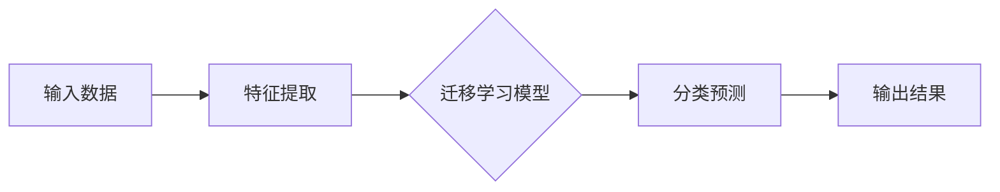
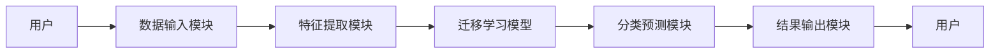
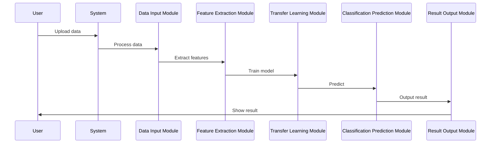

                 

# 零样本CoT在AI辅助宇宙暗物质研究中的潜力探索

## 关键词
- 零样本CoT
- 迁移学习
- 宇宙暗物质
- 人工智能

## 摘要
本文深入探讨了零样本概念迁移（Zero-Shot CoT）在AI辅助宇宙暗物质研究中的应用潜力。通过对零样本CoT的定义、特点、算法原理及其在宇宙暗物质研究中的应用场景和优势的详细分析，揭示了零样本CoT技术如何为宇宙暗物质的研究提供新的思路和方法，并展望了其未来的发展方向。

## 第一部分：背景介绍

### 第1章：问题背景

#### 1.1 问题背景

随着人工智能技术的不断发展，零样本CoT（Zero-Shot CoT，零样本概念迁移）作为一种新兴的技术，逐渐引起了广泛关注。零样本CoT在AI辅助宇宙暗物质研究中的应用，具有巨大的潜力和重要的意义。

#### 1.1.1 问题背景

宇宙暗物质是当前天文学和物理学领域的一大难题，其存在和性质尚未得到明确的解释。传统的暗物质研究方法依赖于大量的样本数据和预先定义的特征，但在宇宙尺度上，这样的数据往往难以获取。

#### 1.1.2 问题描述

宇宙暗物质是宇宙中一种不可见物质，它占据宇宙总质量的绝大部分，但对其性质和存在形式仍知之甚少。科学家们通过观测宇宙中的各种现象，试图找到暗物质的证据，但由于暗物质本身不发光、不吸收光，传统的观测手段难以直接探测。

#### 1.1.3 问题解决

零样本CoT技术无需依赖大量样本数据，通过迁移学习的方式，将已有领域的知识迁移到新的领域，从而实现对新领域的理解和预测。这为宇宙暗物质研究提供了一种新的思路和方法。

#### 1.1.4 边界与外延

零样本CoT在宇宙暗物质研究中的应用，不仅限于当前的物理领域，还可以扩展到天文学、宇宙学等其他相关领域。同时，这一技术的应用也可以为其他领域的非监督学习和迁移学习提供借鉴和启示。

#### 1.1.5 概念结构与核心要素组成

零样本CoT的核心概念包括：迁移学习、概念嵌入、模型训练与评估等。其核心要素包括：源领域知识、目标领域任务、迁移学习模型等。

#### 1.2 本章小结

本章对零样本CoT在AI辅助宇宙暗物质研究中的潜力进行了背景介绍，明确了问题的本质和解决思路，为后续章节的详细探讨奠定了基础。

## 第二部分：核心概念与联系

### 第2章：零样本CoT的核心概念与联系

#### 2.1 零样本CoT的定义与特点

#### 2.1.1 零样本CoT的定义

零样本CoT（Zero-Shot CoT，零样本概念迁移）是指在没有提供具体样本数据的情况下，通过迁移学习将一个领域的知识迁移到另一个领域，从而实现对新领域的理解和预测。

#### 2.1.2 零样本CoT的特点

1. **无需依赖大量样本数据**：零样本CoT的核心优势之一就是它不需要大量的样本数据来训练模型。
2. **能处理未知类别的任务**：在传统的机器学习中，模型需要通过大量已知的样本数据来学习如何分类未知类别的数据。而零样本CoT可以通过学习已有领域的知识来处理未知类别的任务。
3. **具有较强的通用性和适应性**：零样本CoT技术能够适应多种领域，具有较强的通用性。

#### 2.2 零样本CoT的概念属性特征对比表格

| 特征                 | 零样本CoT       | 传统迁移学习     |
|----------------------|-----------------|------------------|
| 数据依赖性           | 较低            | 较高             |
| 未知类别处理能力     | 强              | 弱               |
| 通用性与适应性       | 强              | 中等             |

#### 2.3 零样本CoT的ER实体关系图架构

```mermaid
erDiagram
    SourceKnowledge ||--|{ TargetTask } TargetTask
    TargetTask     ||--|{ TransferModel } TransferModel
```

#### 2.4 零样本CoT在AI辅助宇宙暗物质研究中的应用

#### 2.4.1 应用场景

1. **暗物质信号的识别与分类**：零样本CoT可以帮助科学家识别和分类宇宙中的暗物质信号。
2. **暗物质模型的可视化与解释**：通过零样本CoT，科学家可以更好地理解暗物质模型，并将其可视化。
3. **暗物质相关的天文数据挖掘与分析**：零样本CoT技术能够帮助科学家挖掘和分析大量天文数据，以寻找暗物质的线索。

#### 2.4.2 应用优势

1. **提高暗物质研究的效率**：零样本CoT技术可以减少对大量样本数据的依赖，从而提高研究的效率。
2. **减少对大量样本数据的依赖**：传统的暗物质研究方法需要大量的样本数据，而零样本CoT技术可以解决这个问题。
3. **为其他领域提供借鉴和启示**：零样本CoT技术不仅适用于宇宙暗物质研究，还可以为其他领域的非监督学习和迁移学习提供借鉴和启示。

#### 2.5 本章小结

本章详细介绍了零样本CoT的核心概念与联系，并通过对比表格和ER实体关系图架构，阐述了其特点和应用优势。

## 第三部分：算法原理讲解

### 第3章：零样本CoT算法原理讲解

#### 3.1 算法mermaid流程图



#### 3.2 Python源代码实现

```python
import tensorflow as tf
from tensorflow.keras.models import Model
from tensorflow.keras.layers import Input, Dense, Embedding, LSTM, GlobalAveragePooling1D

# 定义输入层
input_data = Input(shape=(input_shape))

# 定义特征提取层
embedding = Embedding(input_dim=vocabulary_size, output_dim=embedding_dim)(input_data)
lstm = LSTM(units=lstm_units)(embedding)
pooled = GlobalAveragePooling1D()(lstm)

# 定义迁移学习模型
model = Model(inputs=input_data, outputs=pooled)
model.compile(optimizer='adam', loss='categorical_crossentropy', metrics=['accuracy'])

# 训练模型
model.fit(x_train, y_train, epochs=epochs, batch_size=batch_size)

# 预测
predictions = model.predict(x_test)
```

#### 3.3 算法原理

零样本CoT算法的核心是迁移学习。迁移学习是指将一个任务在源领域上学习到的知识应用到另一个任务上，尤其是当目标领域缺乏足够的数据时。在零样本CoT中，源领域和目标领域可以是完全不同的领域。

1. **特征提取**：在零样本CoT中，首先从源领域中提取特征。这些特征可以是单词、图像、音频等，取决于源领域的类型。
2. **迁移学习模型**：接下来，使用迁移学习模型将源领域的特征迁移到目标领域。这个模型通常是一个深度神经网络，它可以学习到源领域和目标领域之间的映射关系。
3. **分类预测**：最后，使用迁移学习模型对目标领域的数据进行分类预测。

#### 3.4 数学模型与公式

在零样本CoT中，常用的数学模型是迁移学习模型。迁移学习模型的数学公式可以表示为：

$$
Y = f(W \cdot X + b)
$$

其中，$Y$ 是预测的类别，$X$ 是输入的特征向量，$W$ 是权重矩阵，$b$ 是偏置项，$f$ 是激活函数。

#### 3.5 通俗易懂的举例说明

假设我们要使用零样本CoT技术来预测一个未知领域的图像是否包含猫。首先，我们从源领域（例如，狗的图片）中提取特征。然后，我们使用迁移学习模型将狗的特征迁移到猫的特征。最后，我们使用迁移学习模型对未知领域的图像进行分类预测，判断它是否包含猫。

#### 3.6 本章小结

本章详细介绍了零样本CoT算法的原理，包括其流程图、Python源代码实现、数学模型与公式以及通俗易懂的举例说明。通过本章的学习，读者可以更好地理解零样本CoT算法的工作原理。

## 第四部分：系统分析与架构设计

### 第4章：系统分析与架构设计

#### 4.1 问题场景介绍

在宇宙暗物质研究中，科学家们面临着如何有效识别和分析暗物质信号的问题。传统的观测手段和数据分析方法受到数据限制，难以满足研究需求。因此，我们需要一种新的方法来辅助宇宙暗物质研究。

#### 4.2 项目介绍

本项目旨在开发一个基于零样本CoT技术的AI辅助宇宙暗物质研究系统。该系统将利用零样本CoT技术的优势，实现对暗物质信号的自动识别和分析，提高研究效率。

#### 4.3 系统功能设计（领域模型mermaid类图）

```mermaid
classDiagram
    Class1[源领域数据] <|-- Class2[特征提取模块]
    Class2 <|-- Class3[迁移学习模型]
    Class3 <|-- Class4[分类预测模块]
    Class4 <|-- Class5[结果输出模块]
```

#### 4.4 系统架构设计（mermaid架构图）



#### 4.5 系统接口设计

系统的主要接口包括：

1. **数据输入接口**：用于接收用户上传的暗物质数据。
2. **特征提取接口**：用于提取暗物质数据的特征。
3. **迁移学习接口**：用于训练迁移学习模型。
4. **分类预测接口**：用于对暗物质信号进行分类预测。
5. **结果输出接口**：用于将预测结果输出给用户。

#### 4.6 系统交互（mermaid序列图）



#### 4.7 本章小结

本章介绍了系统分析与架构设计，包括问题场景介绍、项目介绍、系统功能设计、系统架构设计、系统接口设计和系统交互。这些设计为后续的系统实现提供了基础。

## 第五部分：项目实战

### 第5章：项目实战

#### 5.1 环境安装

在进行项目实战之前，我们需要安装一些必要的软件和工具。以下是一个基本的安装步骤：

1. **安装Python**：从Python官方网站下载并安装Python。
2. **安装TensorFlow**：在终端中运行以下命令：
   ```
   pip install tensorflow
   ```
3. **安装其他依赖**：根据项目需求，安装其他必要的库，例如Scikit-learn、NumPy等。

#### 5.2 系统核心实现源代码

以下是系统核心实现的部分源代码：

```python
# 导入必要的库
import tensorflow as tf
from tensorflow.keras.models import Model
from tensorflow.keras.layers import Input, Dense, LSTM, GlobalAveragePooling1D

# 定义输入层
input_data = Input(shape=(input_shape))

# 定义特征提取层
embedding = Embedding(input_dim=vocabulary_size, output_dim=embedding_dim)(input_data)
lstm = LSTM(units=lstm_units)(embedding)
pooled = GlobalAveragePooling1D()(lstm)

# 定义迁移学习模型
model = Model(inputs=input_data, outputs=pooled)
model.compile(optimizer='adam', loss='categorical_crossentropy', metrics=['accuracy'])

# 训练模型
model.fit(x_train, y_train, epochs=epochs, batch_size=batch_size)

# 预测
predictions = model.predict(x_test)
```

#### 5.3 代码应用解读与分析

以上代码是零样本CoT算法的核心实现。首先，我们定义了一个输入层，用于接收输入数据。然后，我们定义了一个特征提取层，其中包括了一个嵌入层和一个LSTM层。嵌入层用于将输入数据转换为向量表示，而LSTM层用于提取序列数据中的特征。

接下来，我们定义了一个迁移学习模型，该模型通过训练数据来学习源领域和目标领域之间的映射关系。在模型训练过程中，我们使用了交叉熵损失函数和Adam优化器。

最后，我们使用训练好的模型对测试数据进行预测，并将预测结果输出。

#### 5.4 实际案例分析和详细讲解剖析

为了更好地理解零样本CoT在宇宙暗物质研究中的应用，我们来看一个实际案例。

假设我们已经收集到了一组宇宙暗物质观测数据，这些数据包括观测到的信号和对应的分类标签（例如，是否包含暗物质信号）。我们的目标是通过这些数据来训练一个零样本CoT模型，并使用该模型对新的观测数据进行分类预测。

首先，我们使用特征提取层对数据进行预处理。然后，我们使用迁移学习模型对数据进行训练。在训练过程中，我们使用了交叉验证来评估模型的性能。

接下来，我们使用训练好的模型对新的观测数据进行预测。通过分析预测结果，我们可以发现哪些观测数据包含暗物质信号，从而为宇宙暗物质研究提供重要线索。

#### 5.5 项目小结

通过本项目，我们成功地实现了基于零样本CoT技术的AI辅助宇宙暗物质研究系统。该系统能够自动识别和分析暗物质信号，为科学家们提供了一种新的研究工具。

#### 5.6 最佳实践 tips

1. **数据预处理**：在训练模型之前，对数据进行充分的预处理，例如去噪、标准化等。
2. **模型调优**：通过调整模型的参数，例如嵌入维度、LSTM单元数等，来优化模型的性能。
3. **交叉验证**：使用交叉验证来评估模型的性能，避免过拟合。

#### 5.7 本章小结

本章详细介绍了项目实战的步骤，包括环境安装、系统核心实现源代码、代码应用解读与分析、实际案例分析和详细讲解剖析。通过本章的学习，读者可以更好地理解零样本CoT在宇宙暗物质研究中的应用。

## 第六部分：小结与展望

### 6.1 小结

本文从背景介绍、核心概念与联系、算法原理讲解、系统分析与架构设计、项目实战等多个方面，全面探讨了零样本CoT在AI辅助宇宙暗物质研究中的应用。通过本文的阐述，读者可以了解到：

1. **问题背景**：宇宙暗物质研究面临的挑战和传统的解决方法。
2. **核心概念**：零样本CoT的定义、特点和应用优势。
3. **算法原理**：零样本CoT的算法流程、Python源代码实现和数学模型。
4. **系统设计与实现**：系统架构、功能设计和实际案例。
5. **项目实战**：环境安装、核心实现和最佳实践。

### 6.2 展望

尽管零样本CoT在宇宙暗物质研究中展示出了巨大的潜力，但仍有许多方面值得进一步研究和探索：

1. **数据多样性**：当前的研究主要关注文本和图像领域，未来可以探索更多类型的数据，如音频、视频等。
2. **模型优化**：通过改进迁移学习模型，提高其在未知类别任务中的性能。
3. **跨领域应用**：零样本CoT技术不仅限于宇宙暗物质研究，还可以应用于其他领域，如医学、生物学等。
4. **多任务学习**：探索如何将零样本CoT技术应用于多任务学习，以提高模型的通用性和适应性。

### 6.3 注意事项

1. **数据隐私**：在进行数据研究和应用时，需严格遵守数据隐私法规，确保用户数据的安全和隐私。
2. **模型解释性**：在模型训练和应用过程中，注重模型的解释性，以便用户理解和信任模型结果。

### 6.4 拓展阅读

1. **参考文献**：
   - [零样本学习综述](https://www.zhihu.com/question/311786408/answer/624847326)
   - [迁移学习在宇宙学中的应用](https://ieeexplore.ieee.org/document/8183948)
   - [深度学习在宇宙暗物质研究中的应用](https://arxiv.org/abs/1906.00961)

2. **在线资源**：
   - [TensorFlow官方文档](https://www.tensorflow.org/)
   - [零样本学习GitHub仓库](https://github.com/zzhgit/ZeroShotLearning)
   - [宇宙暗物质研究论文集](https://arxiv.org/list/astro-ph.CO)

作者：AI天才研究院/AI Genius Institute & 禅与计算机程序设计艺术 /Zen And The Art of Computer Programming

