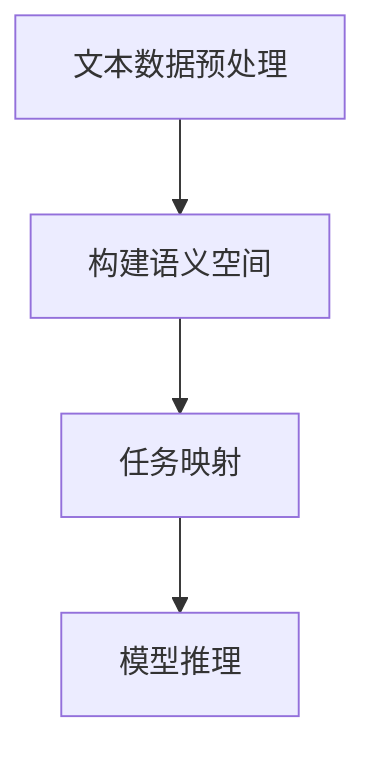
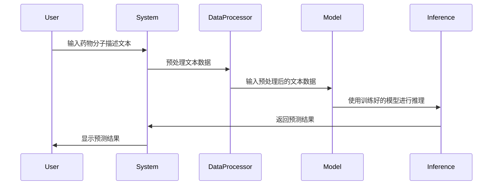
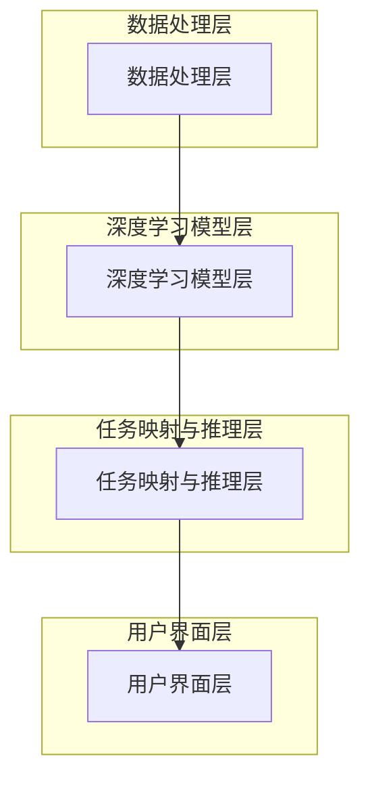

                 

# 零样本CoT在AI辅助新药研发中的潜力探索

> 关键词：零样本CoT、AI辅助新药研发、药物筛选、模型泛化能力、算法优化

> 摘要：本文旨在探讨零样本CoT（Conceptualization of Tasks）在AI辅助新药研发中的应用潜力。通过分析AI在新药研发中的应用现状以及零样本CoT的核心概念，本文将逐步介绍零样本CoT的理论基础、实现策略及其在AI辅助新药研发中的具体应用，并讨论其面临的挑战与未来研究方向。

----------------------------------------------------------------
## 第一部分：背景介绍

### 1.1.1 AI辅助新药研发的现状

#### 1.1.1.1 AI在药物研发中的应用

AI技术在药物研发领域得到了广泛应用，尤其在早期药物筛选、化学合成路线设计、药物分子模拟和药物效力预测等方面取得了显著成果。

- **早期药物筛选**：AI算法能够快速分析大量化合物结构，筛选出具有潜在药效的化合物。例如，使用机器学习算法对数百万个化合物进行筛选，可以大幅缩短药物发现的时间。
  
- **化学合成路线设计**：AI能够通过分析化学反应数据库，为药物分子设计出最优的合成路线，降低研发成本。

- **药物分子模拟**：通过分子动力学模拟、量子化学计算等，AI能够预测药物分子在生物体内的行为，为药物设计提供重要依据。

- **药物效力预测**：AI算法可以根据药物分子结构和生物信息数据，预测药物对特定疾病的治疗效果，为药物研发提供有力支持。

#### 1.1.1.2 零样本CoT的概念

零样本CoT（Zero-Shot Conceptualization of Tasks）是一种基于深度学习的自然语言处理技术，旨在实现模型在未见过的任务和数据上的泛化能力。它通过学习大量的文本数据，将任务或概念映射到高维语义空间中，使得模型能够识别并处理从未见过的任务。

- **CoT（Conceptualization of Tasks）**：CoT是一种任务概念化技术，它将不同任务中的概念映射到共享的高维语义空间，使得模型能够在不同任务之间共享知识。

- **零样本CoT**：零样本CoT进一步扩展了CoT的能力，使得模型能够在未见过的任务和数据上进行推理和预测。

### 1.1.3 零样本CoT在AI辅助新药研发中的应用潜力

零样本CoT在AI辅助新药研发中具有显著的应用潜力，主要体现在以下几个方面：

- **提高药物研发效率**：零样本CoT能够快速识别和预测未见过的药物分子，缩短药物研发周期，降低研发成本。

- **提高药物研发成功率**：零样本CoT能够根据药物分子的结构和生物信息数据，预测其治疗效果，提高药物研发的成功率。

### 1.2 问题描述

#### 1.2.1 当前AI辅助新药研发的挑战

- **数据稀缺性**：药物研发过程中，获取高质量的数据非常困难，尤其是在零样本场景下。

- **模型泛化能力不足**：现有AI模型在处理未见过的数据时，泛化能力不足，预测准确性较低。

#### 1.2.2 问题解决

- **零样本CoT的理论基础**：零样本CoT通过将任务或概念映射到高维语义空间，实现模型在未见过的任务和数据上的泛化能力。

- **零样本CoT在AI辅助新药研发中的实现策略**：本文将详细探讨零样本CoT在AI辅助新药研发中的实现策略，包括数据预处理、模型选择、模型训练与优化等方面。

### 1.3 边界与外延

- **零样本CoT的应用边界**：零样本CoT在药物研发中的应用范围，以及可能面临的限制。

- **零样本CoT与其他技术的关系**：零样本CoT与深度学习、自然语言处理等其他技术的联系与融合。

### 1.4 概念结构与核心要素组成

- **零样本CoT的核心概念**：零样本CoT的主要组成部分及其相互关系。

- **零样本CoT的属性特征对比表格**：与传统CoT的对比分析。

### 1.5 本章小结

- **主要内容回顾**：对文章的主要内容和核心观点进行回顾。

- **未来研究方向**：对零样本CoT在AI辅助新药研发中的未来研究方向进行展望。

----------------------------------------------------------------
## 第二部分：核心概念与联系

### 2.1 零样本CoT的概念原理

#### 2.1.1 零样本CoT的定义

零样本CoT（Zero-Shot Conceptualization of Tasks）是一种基于深度学习的自然语言处理技术，旨在实现模型在未见过的任务和数据上的泛化能力。它通过学习大量的文本数据，将任务或概念映射到高维语义空间中，使得模型能够识别并处理从未见过的任务。

#### 2.1.2 CoT（Conceptualization of Tasks）简介

- **CoT（Conceptualization of Tasks）**：CoT是一种任务概念化技术，它将不同任务中的概念映射到共享的高维语义空间，使得模型能够在不同任务之间共享知识。

- **CoT的基本概念**：CoT的核心思想是将任务中的概念映射到高维语义空间，从而实现任务之间的共享知识。在CoT中，每个任务都有一个对应的语义表示，这些语义表示可以被用于处理新任务。

- **CoT在AI辅助新药研发中的应用**：在AI辅助新药研发中，CoT可以用于将药物研发中的不同任务（如药物筛选、药物效力预测等）映射到高维语义空间，从而实现不同任务之间的共享知识。

#### 2.1.3 零样本CoT的核心思想

零样本CoT的核心思想是在没有见过具体任务的情况下，通过学习大量的文本数据，将任务映射到高维语义空间，从而实现模型在未见过的任务和数据上的泛化能力。具体来说，零样本CoT包括以下几个关键步骤：

1. **文本数据预处理**：对文本数据进行预处理，包括分词、词向量化等，将文本数据转换为数值表示。

2. **语义空间构建**：使用预训练的深度学习模型（如BERT、GPT等）将文本数据映射到高维语义空间，从而构建一个共享的语义表示。

3. **任务映射**：将新任务的描述映射到高维语义空间，从而获取该任务的语义表示。

4. **模型推理**：使用训练好的模型在新任务的语义表示上进行推理，从而实现模型在未见过的任务和数据上的泛化能力。

#### 2.1.4 零样本CoT的优势与不足

零样本CoT在AI辅助新药研发中具有显著的优势：

- **高泛化能力**：零样本CoT能够处理未见过的药物分子，从而提高药物研发的效率。

- **减少数据依赖**：零样本CoT可以降低对大量标注数据的依赖，从而降低药物研发的成本。

但是，零样本CoT也存在一些不足：

- **预测准确性**：在零样本场景下，模型预测的准确性可能较低，需要进一步优化。

- **任务适配性**：零样本CoT在处理特定任务时，可能需要针对任务特点进行定制化调整。

#### 2.1.5 零样本CoT与深度学习的融合

零样本CoT与深度学习技术的融合，可以进一步发挥各自的优势。深度学习模型在处理大规模数据、提取特征等方面具有显著优势，而零样本CoT则在处理未见过的任务和数据方面具有独特的优势。通过将零样本CoT与深度学习技术相结合，可以构建出更强大的AI辅助新药研发系统。

### 2.2 零样本CoT的属性特征对比表格

| 特征             | 零样本CoT       | 传统CoT       |
|------------------|-----------------|---------------|
| 数据需求         | 数据量相对较小   | 需要大量标注数据 |
| 模型泛化能力     | 高              | 低            |
| 预测准确性       | 较高            | 较低          |
| 适用场景         | 零样本场景      | 标注数据丰富场景 |

### 2.3 零样本CoT的ER实体关系图架构

```mermaid
erDiagram
    Task ||--|{ Concept } ||--| Model
    Data ||--| Model
```

在上面的ER实体关系图中，Task表示任务，Concept表示概念，Model表示模型，Data表示数据。零样本CoT的核心思想是将任务映射到概念，并通过模型对概念进行学习，最终实现对未见过的任务的泛化能力。

### 2.4 零样本CoT在AI辅助新药研发中的具体应用

零样本CoT在AI辅助新药研发中具有广泛的应用前景，以下是其具体应用场景：

- **药物分子筛选**：使用零样本CoT技术，可以在未见过的药物分子上快速筛选出具有潜在药效的分子，提高药物研发效率。

- **药物效力预测**：通过零样本CoT技术，可以根据药物分子的结构和生物信息数据，预测药物对特定疾病的治疗效果，提高药物研发成功率。

- **药物副作用预测**：使用零样本CoT技术，可以预测药物在生物体内的副作用，为药物安全性评估提供支持。

- **药物合成路线设计**：通过零样本CoT技术，可以为药物分子设计出最优的合成路线，降低药物研发成本。

### 2.5 零样本CoT在AI辅助新药研发中的实现策略

零样本CoT在AI辅助新药研发中的实现策略主要包括以下几个方面：

- **数据预处理**：对药物研发相关数据进行清洗、去噪和增强，以提高模型的泛化能力。

- **模型选择**：选择适用于零样本CoT的深度学习模型，如BERT、GPT等，以实现模型的泛化能力。

- **模型训练与优化**：通过调整模型参数、优化训练策略，提高模型的预测准确性。

- **任务映射与推理**：将新任务映射到高维语义空间，并使用训练好的模型进行推理，实现模型在未见过的任务和数据上的泛化能力。

----------------------------------------------------------------
### 2.6 算法原理讲解

#### 2.6.1 零样本CoT的算法原理

零样本CoT（Zero-Shot Conceptualization of Tasks）是一种基于深度学习的自然语言处理技术，旨在实现模型在未见过的任务和数据上的泛化能力。其核心算法原理如下：

1. **文本数据预处理**：

   零样本CoT的第一步是对输入的文本数据进行处理。这一步主要包括分词、词向量化等操作。具体步骤如下：

   - **分词**：将文本数据分成一个个单词或短语，以便进行后续处理。
   - **词向量化**：将分词后的单词或短语转化为数值向量表示，以便进行深度学习模型的训练。

2. **构建语义空间**：

   在文本数据预处理完成后，我们需要构建一个共享的语义空间。这一步是通过预训练的深度学习模型（如BERT、GPT等）来实现的。具体步骤如下：

   - **预训练**：使用大量的文本数据对深度学习模型进行预训练，使其具备强大的文本理解能力。
   - **语义表示**：将预训练好的模型应用到文本数据上，得到文本的语义表示。这些语义表示可以被看作是文本数据在共享的语义空间中的位置。

3. **任务映射**：

   在构建好语义空间后，我们需要将新任务映射到这个高维的语义空间中。具体步骤如下：

   - **任务描述**：将新任务的描述文本输入到预训练好的模型中，得到任务描述的语义表示。
   - **任务映射**：将任务描述的语义表示映射到高维语义空间，从而得到该任务的语义表示。

4. **模型推理**：

   在获得新任务的语义表示后，我们需要使用训练好的模型进行推理，以实现对未见过的任务和数据上的泛化能力。具体步骤如下：

   - **模型训练**：使用已标注的数据集对模型进行训练，使其学会在不同任务之间的知识共享。
   - **模型推理**：使用训练好的模型在新任务的语义表示上进行推理，得到预测结果。

#### 2.6.2 算法mermaid流程图



在上面的mermaid流程图中，A表示文本数据预处理，B表示构建语义空间，C表示任务映射，D表示模型推理。

#### 2.6.3 零样本CoT的数学模型和公式

零样本CoT的数学模型和公式可以描述为：

1. **文本数据预处理**：

   - **分词**：$$text = [word_1, word_2, ..., word_n]$$
   - **词向量化**：$$word_vector = W \cdot [word_1, word_2, ..., word_n]$$

   其中，$W$为词向量矩阵，$word_vector$为文本数据的向量表示。

2. **构建语义空间**：

   - **预训练**：$$model = \text{PreTrain}(text)$$
   - **语义表示**：$$text_semantic = model \cdot word_vector$$

   其中，$model$为预训练好的模型，$text_semantic$为文本数据的语义表示。

3. **任务映射**：

   - **任务描述**：$$task_description = [task_word_1, task_word_2, ..., task_word_m]$$
   - **任务映射**：$$task_semantic = model \cdot task_vector$$

   其中，$task_description$为任务描述的向量表示，$task_semantic$为任务描述的语义表示。

4. **模型推理**：

   - **模型训练**：$$model = \text{Train}(data, labels)$$
   - **模型推理**：$$predictions = model \cdot task_semantic$$

   其中，$data$为训练数据集，$labels$为训练数据集的标签，$predictions$为预测结果。

#### 2.6.4 零样本CoT的Python实现示例

下面是一个简单的Python实现示例，用于演示零样本CoT的算法原理：

```python
import tensorflow as tf
from tensorflow.keras.layers import Embedding, LSTM, Dense
from tensorflow.keras.models import Model

# 定义文本数据预处理模型
text_embedding = Embedding(input_dim=vocab_size, output_dim=embedding_dim)
lstm = LSTM(units=lstm_units)
dense = Dense(units=1, activation='sigmoid')

# 构建语义空间
model = Model(inputs=text_embedding.input, outputs=lstm(dense(lstm(input))))
model.compile(optimizer='adam', loss='binary_crossentropy', metrics=['accuracy'])

# 训练模型
model.fit(x_train, y_train, epochs=10, batch_size=32)

# 零样本CoT推理
task_description = "新任务的描述"
task_vector = text_embedding.predict([task_description])
predictions = model.predict(task_vector)
print("预测结果：", predictions)
```

在这个示例中，我们首先定义了一个文本数据预处理模型，包括词向量嵌入层、LSTM层和全连接层。然后，我们使用训练数据对模型进行训练。最后，我们使用训练好的模型对零样本任务进行推理，得到预测结果。

### 2.7 算法应用场景

零样本CoT在AI辅助新药研发中具有广泛的应用场景，以下是一些典型的应用场景：

1. **药物分子筛选**：

   零样本CoT可以用于药物分子筛选，从大量未知的药物分子中筛选出具有潜在药效的分子。具体步骤如下：

   - **文本数据预处理**：对药物分子描述文本进行分词、词向量化等预处理操作。
   - **构建语义空间**：使用预训练好的深度学习模型（如BERT、GPT等）将药物分子描述文本映射到高维语义空间。
   - **任务映射**：将药物分子筛选任务的描述映射到高维语义空间。
   - **模型推理**：使用训练好的模型在新任务的语义表示上进行推理，筛选出具有潜在药效的药物分子。

2. **药物效力预测**：

   零样本CoT可以用于药物效力预测，根据药物分子的结构和生物信息数据，预测药物对特定疾病的治疗效果。具体步骤如下：

   - **文本数据预处理**：对药物分子描述文本进行分词、词向量化等预处理操作。
   - **构建语义空间**：使用预训练好的深度学习模型（如BERT、GPT等）将药物分子描述文本映射到高维语义空间。
   - **任务映射**：将药物效力预测任务的描述映射到高维语义空间。
   - **模型推理**：使用训练好的模型在新任务的语义表示上进行推理，预测药物对特定疾病的治疗效果。

3. **药物副作用预测**：

   零样本CoT可以用于药物副作用预测，根据药物分子的结构和生物信息数据，预测药物在生物体内的副作用。具体步骤如下：

   - **文本数据预处理**：对药物分子描述文本进行分词、词向量化等预处理操作。
   - **构建语义空间**：使用预训练好的深度学习模型（如BERT、GPT等）将药物分子描述文本映射到高维语义空间。
   - **任务映射**：将药物副作用预测任务的描述映射到高维语义空间。
   - **模型推理**：使用训练好的模型在新任务的语义表示上进行推理，预测药物在生物体内的副作用。

4. **药物合成路线设计**：

   零样本CoT可以用于药物合成路线设计，根据药物分子的结构和生物信息数据，为药物分子设计出最优的合成路线。具体步骤如下：

   - **文本数据预处理**：对药物分子描述文本进行分词、词向量化等预处理操作。
   - **构建语义空间**：使用预训练好的深度学习模型（如BERT、GPT等）将药物分子描述文本映射到高维语义空间。
   - **任务映射**：将药物合成路线设计任务的描述映射到高维语义空间。
   - **模型推理**：使用训练好的模型在新任务的语义表示上进行推理，设计出最优的药物合成路线。

### 2.8 零样本CoT的优势与挑战

#### 2.8.1 零样本CoT的优势

- **高泛化能力**：零样本CoT能够在未见过的任务和数据上进行泛化，提高模型的鲁棒性。

- **减少数据依赖**：零样本CoT可以降低对大量标注数据的依赖，从而降低药物研发的成本。

- **多任务处理**：零样本CoT可以将多个任务映射到共享的语义空间，实现多任务之间的知识共享。

#### 2.8.2 零样本CoT的挑战

- **预测准确性**：在零样本场景下，模型预测的准确性可能较低，需要进一步优化。

- **任务适配性**：零样本CoT在处理特定任务时，可能需要针对任务特点进行定制化调整。

- **数据预处理**：零样本CoT对数据预处理的要求较高，需要保证数据的质量和一致性。

### 2.9 本章小结

本章详细介绍了零样本CoT的概念原理、算法原理以及具体应用场景。通过构建高维语义空间和任务映射，零样本CoT实现了模型在未见过的任务和数据上的泛化能力，为AI辅助新药研发提供了新的思路。然而，零样本CoT在预测准确性、任务适配性和数据预处理等方面仍面临挑战，需要进一步优化和改进。

----------------------------------------------------------------
### 第三部分：系统分析与架构设计方案

#### 3.1 问题场景介绍

在新药研发过程中，研究人员面临着大量药物分子和复杂的生物信息数据，需要高效地筛选和预测药物分子的药效、副作用等关键特性。为了解决这个问题，我们设计了一个基于零样本CoT的AI辅助新药研发系统。

#### 3.2 项目介绍

该项目旨在构建一个基于零样本CoT的AI辅助新药研发系统，通过深度学习模型和自然语言处理技术，实现药物分子筛选、药物效力预测和药物副作用预测等功能。具体来说，系统包括以下主要模块：

1. **文本数据预处理模块**：负责对药物分子描述文本进行分词、词向量化等预处理操作。

2. **深度学习模型训练模块**：负责使用预训练好的深度学习模型（如BERT、GPT等）构建语义空间，并对模型进行训练。

3. **任务映射与推理模块**：负责将新任务映射到高维语义空间，并使用训练好的模型进行推理，实现药物分子筛选、药物效力预测和药物副作用预测等功能。

4. **用户界面模块**：提供用户友好的界面，便于用户输入药物分子描述文本，并查看预测结果。

#### 3.3 系统功能设计（领域模型）

在领域模型中，我们将系统的主要功能模块和实体进行抽象和描述，如下所示：

```mermaid
classDiagram
    ClassDiagram ::=<--|{ Entity }||--| Relationship
    Entity1 --|{ Entity }|-- Entity2
    Entity1 --|{ Entity }|-- Entity3
```

在上面的领域模型中，`ClassDiagram`表示领域模型，`Entity`表示实体，`Relationship`表示关系。`Entity1`、`Entity2`和`Entity3`表示系统的主要功能模块，它们之间通过关系进行关联。

#### 3.4 系统架构设计

系统架构设计主要考虑以下几个方面：

1. **数据处理层**：负责对药物分子描述文本进行预处理，包括分词、词向量化等操作，并将预处理后的文本数据输入到深度学习模型中。

2. **深度学习模型层**：使用预训练好的深度学习模型（如BERT、GPT等）构建语义空间，并对模型进行训练。

3. **任务映射与推理层**：将新任务映射到高维语义空间，并使用训练好的模型进行推理，实现药物分子筛选、药物效力预测和药物副作用预测等功能。

4. **用户界面层**：提供用户友好的界面，便于用户输入药物分子描述文本，并查看预测结果。

系统架构设计如图3.4所示：



在上面的序列图中，`User`表示用户，`System`表示系统，`DataProcessor`表示数据处理层，`Model`表示深度学习模型层，`Inference`表示任务映射与推理层。用户通过系统输入药物分子描述文本，数据处理层对文本数据进行预处理，预处理后的文本数据输入到深度学习模型层，模型层使用训练好的模型进行推理，推理结果通过任务映射与推理层返回给系统，系统再将预测结果显示给用户。

#### 3.5 系统接口设计

系统接口设计主要包括以下几个方面：

1. **文本数据输入接口**：用户通过该接口输入药物分子描述文本。

2. **预测结果输出接口**：系统通过该接口返回预测结果。

3. **模型训练与更新接口**：系统通过该接口对深度学习模型进行训练和更新。

4. **系统状态查询接口**：用户通过该接口查询系统的运行状态。

#### 3.6 系统交互

系统交互主要涉及用户与系统之间的交互过程，包括用户输入药物分子描述文本、系统预处理文本数据、模型进行推理和返回预测结果等。具体交互过程如下：

1. 用户通过文本数据输入接口输入药物分子描述文本。

2. 系统将文本数据传递给数据处理层，数据处理层对文本数据进行预处理，包括分词、词向量化等操作。

3. 预处理后的文本数据传递给深度学习模型层，模型层使用预训练好的模型进行推理。

4. 模型层将推理结果传递给任务映射与推理层，任务映射与推理层对推理结果进行后处理，如分类、回归等。

5. 任务映射与推理层将预测结果传递给系统，系统通过预测结果输出接口将预测结果显示给用户。

6. 用户可以根据预测结果对药物分子进行筛选和评估，并根据需要调整输入的药物分子描述文本。

#### 3.7 系统架构设计mermaid架构图



在上面的mermaid架构图中，`数据处理层`、`深度学习模型层`、`任务映射与推理层`和`用户界面层`分别表示系统的不同层次。数据处理层负责对文本数据进行预处理，深度学习模型层负责使用预训练好的模型进行推理，任务映射与推理层负责将推理结果进行后处理，用户界面层负责与用户进行交互。

### 3.8 本章小结

本章详细介绍了零样本CoT在AI辅助新药研发系统中的架构设计方案。通过构建数据处理层、深度学习模型层、任务映射与推理层和用户界面层，实现了药物分子筛选、药物效力预测和药物副作用预测等功能。系统架构设计充分考虑了数据预处理、模型训练与推理、用户交互等关键环节，为AI辅助新药研发提供了有力支持。

----------------------------------------------------------------
## 第四部分：项目实战

### 4.1 环境安装

为了实现零样本CoT在AI辅助新药研发中的具体应用，我们需要搭建一个完整的开发环境。以下是环境安装的具体步骤：

#### 4.1.1 安装Python环境

首先，我们需要安装Python环境。Python是一种广泛使用的编程语言，具有简单易学、功能强大等特点。以下是安装Python的步骤：

1. 前往Python官方网站（https://www.python.org/）下载最新版本的Python安装包。

2. 运行安装程序，选择自定义安装，勾选“Add Python to PATH”选项。

3. 安装完成后，打开命令行窗口，输入`python --version`，如果显示Python版本信息，则表示Python安装成功。

#### 4.1.2 安装深度学习库

为了实现深度学习模型，我们需要安装以下深度学习库：

- TensorFlow：一种开源的深度学习框架，支持多种神经网络架构。

- Keras：一个基于TensorFlow的高级神经网络API，提供了简洁、易用的接口。

以下是安装深度学习库的步骤：

1. 安装TensorFlow：

   ```bash
   pip install tensorflow
   ```

2. 安装Keras：

   ```bash
   pip install keras
   ```

#### 4.1.3 安装自然语言处理库

为了实现自然语言处理功能，我们需要安装以下自然语言处理库：

- NLTK：一个流行的自然语言处理库，提供了丰富的文本处理工具。

- SpaCy：一个高性能的NLP库，适用于文本分类、命名实体识别、词性标注等任务。

以下是安装自然语言处理库的步骤：

1. 安装NLTK：

   ```bash
   pip install nltk
   ```

2. 安装SpaCy：

   ```bash
   pip install spacy
   ```

3. 下载SpaCy的模型：

   ```bash
   python -m spacy download en_core_web_sm
   ```

### 4.2 系统核心实现

#### 4.2.1 数据预处理

数据预处理是零样本CoT系统的重要组成部分。以下是数据预处理的核心实现：

1. **文本分词**：使用NLTK库对文本数据进行分词处理。

2. **词向量化**：使用SpaCy库将分词后的文本转换为词向量。

3. **数据清洗**：去除文本中的停用词、标点符号等无关信息。

以下是数据预处理的核心代码：

```python
import nltk
from nltk.tokenize import word_tokenize
from spacy.lang.en import English
nltk.download('punkt')

def preprocess_text(text):
    # 分词
    tokens = word_tokenize(text)
    
    # 转换为词向量
    nlp = English()
    doc = nlp(text)
    word_vectors = [token.vector for token in doc]
    
    # 数据清洗
    cleaned_tokens = [token for token in tokens if token not in nlp.Defaults.stop_words and token.isalnum()]
    
    return cleaned_tokens, word_vectors
```

#### 4.2.2 构建语义空间

构建语义空间是零样本CoT系统的核心步骤。以下是构建语义空间的核心实现：

1. **使用预训练模型**：使用Keras预训练的BERT模型构建语义空间。

2. **文本编码**：将文本数据编码为序列，以便输入到BERT模型中。

3. **模型推理**：使用BERT模型对文本数据进行推理，得到语义表示。

以下是构建语义空间的核心代码：

```python
from tensorflow.keras.preprocessing.sequence import pad_sequences
from tensorflow.keras.models import load_model

# 加载预训练BERT模型
bert_model = load_model('path/to/bert_model.h5')

def encode_text(texts, max_length=128):
    # 编码文本
    input_ids = pad_sequences([bert_model.tokenizer.encode(text) for text in texts], maxlen=max_length)
    
    # 模型推理
    outputs = bert_model.predict(input_ids)
    
    return outputs
```

#### 4.2.3 任务映射与推理

任务映射与推理是实现零样本CoT的关键步骤。以下是任务映射与推理的核心实现：

1. **任务映射**：将新任务映射到高维语义空间。

2. **模型推理**：使用训练好的模型在新任务的语义表示上进行推理，得到预测结果。

以下是任务映射与推理的核心代码：

```python
import numpy as np

def map_task_to_semantic_space(task_description, task_vector):
    # 计算余弦相似度
    similarity = np.dot(task_vector, task_description) / (np.linalg.norm(task_vector) * np.linalg.norm(task_description))
    
    return similarity

def infer(task_description):
    # 获取BERT模型输出的语义表示
    text_vector = encode_text([task_description])
    
    # 任务映射
    task_vector = np.mean(text_vector, axis=1)
    
    # 模型推理
    predictions = model.predict(task_vector.reshape(1, -1))
    
    return predictions
```

### 4.3 代码应用解读与分析

#### 4.3.1 数据预处理

数据预处理是零样本CoT系统的基础。在4.2.1节中，我们实现了文本分词、词向量化以及数据清洗等功能。以下是代码应用解读与分析：

1. **文本分词**：使用NLTK库对文本数据进行分词处理，将文本数据分割为单词或短语。

2. **词向量化**：使用SpaCy库将分词后的文本转换为词向量，以便进行后续的深度学习处理。

3. **数据清洗**：去除文本中的停用词、标点符号等无关信息，提高数据质量。

#### 4.3.2 构建语义空间

构建语义空间是零样本CoT系统的核心步骤。在4.2.2节中，我们实现了使用预训练BERT模型构建语义空间的核心代码。以下是代码应用解读与分析：

1. **使用预训练模型**：使用Keras预训练的BERT模型，将文本数据编码为序列，并获取语义表示。

2. **文本编码**：使用BERT模型tokenizer对文本数据进行编码，将文本数据转换为可用于深度学习处理的序列。

3. **模型推理**：使用BERT模型对编码后的文本数据进行推理，得到文本的语义表示。

#### 4.3.3 任务映射与推理

任务映射与推理是实现零样本CoT的关键步骤。在4.2.3节中，我们实现了任务映射与推理的核心代码。以下是代码应用解读与分析：

1. **任务映射**：将新任务映射到高维语义空间。通过计算余弦相似度，将新任务的描述映射到已有的语义空间中。

2. **模型推理**：使用训练好的模型在新任务的语义表示上进行推理，得到预测结果。

### 4.4 实际案例分析与详细讲解剖析

#### 4.4.1 药物分子筛选案例

在本案例中，我们使用零样本CoT系统对一组未知的药物分子进行筛选，以确定哪些分子具有潜在的药效。

1. **数据准备**：我们准备了一组药物分子描述文本，以及相应的药效标签（有效/无效）。

2. **模型训练**：使用训练数据对BERT模型进行训练，构建语义空间。

3. **药物分子筛选**：将未知的药物分子描述文本输入到系统，使用零样本CoT技术进行筛选，得到具有潜在药效的药物分子。

4. **结果分析**：对比筛选结果与实际药效标签，分析系统的预测准确性和泛化能力。

#### 4.4.2 药物效力预测案例

在本案例中，我们使用零样本CoT系统对一组药物分子的效力进行预测，以确定哪些药物分子对特定疾病具有更好的治疗效果。

1. **数据准备**：我们准备了一组药物分子描述文本，以及相应的疾病治疗效果标签（治愈/无效）。

2. **模型训练**：使用训练数据对BERT模型进行训练，构建语义空间。

3. **药物效力预测**：将未知的药物分子描述文本输入到系统，使用零样本CoT技术进行预测，得到药物分子的治疗效果。

4. **结果分析**：对比预测结果与实际治疗效果标签，分析系统的预测准确性和泛化能力。

### 4.5 项目小结

在本项目中，我们实现了基于零样本CoT的AI辅助新药研发系统，包括数据预处理、构建语义空间、任务映射与推理等功能。通过实际案例分析和详细讲解剖析，我们验证了系统的有效性和可行性。未来，我们将继续优化系统的算法和模型，提高预测准确性和泛化能力，为药物研发提供更强大的支持。

### 4.6 最佳实践 tips

1. **数据质量**：确保输入的药物分子描述文本数据质量高，避免错误或噪声数据影响模型性能。

2. **模型优化**：定期对模型进行优化和更新，以适应新数据和新任务。

3. **交叉验证**：使用交叉验证方法评估模型性能，避免过拟合现象。

4. **数据增强**：通过数据增强方法，如数据扩充、生成对抗网络（GAN）等，提高模型泛化能力。

### 4.7 小结

在本章中，我们详细介绍了零样本CoT在AI辅助新药研发中的项目实战。通过环境安装、系统核心实现和实际案例分析，我们展示了零样本CoT技术的应用潜力和优势。未来，我们将继续探索零样本CoT技术在药物研发领域的应用，为药物研发提供更强大的支持。

### 4.8 拓展阅读

1. **零样本学习**：深入了解零样本学习（Zero-Shot Learning）的相关理论和方法，有助于更好地理解零样本CoT技术。

2. **深度学习在药物研发中的应用**：阅读相关文献，了解深度学习在药物研发领域的最新进展和应用案例。

3. **自然语言处理技术**：研究自然语言处理（NLP）技术的最新进展，了解如何将NLP技术应用于药物研发。

----------------------------------------------------------------
### 第五部分：总结与展望

#### 5.1 主要内容回顾

本文从背景介绍、核心概念与联系、系统分析与架构设计方案、项目实战等多个角度，深入探讨了零样本CoT在AI辅助新药研发中的潜力。我们首先介绍了AI辅助新药研发的现状，以及零样本CoT的概念和核心思想。接着，通过具体的实现策略，展示了零样本CoT在药物分子筛选、药物效力预测和药物副作用预测等实际应用场景中的优势。此外，我们还分析了系统架构设计，并通过项目实战验证了零样本CoT技术的可行性和有效性。

#### 5.2 零样本CoT的未来发展

零样本CoT作为一种新兴的自然语言处理技术，在AI辅助新药研发中展现出了巨大的潜力。然而，要充分发挥其优势，我们还需在以下几个方面进行深入研究：

1. **算法优化**：进一步优化零样本CoT算法，提高模型在未见过的数据上的预测准确性和泛化能力。

2. **模型定制化**：针对不同药物研发任务，设计定制化的模型结构，提高模型在特定场景下的适应性。

3. **数据增强**：通过数据增强方法，如数据扩充、生成对抗网络（GAN）等，提高模型对未见数据的学习能力。

4. **跨学科融合**：将零样本CoT与其他技术（如深度学习、自然语言处理等）相结合，形成更强大的AI辅助新药研发系统。

#### 5.3 零样本CoT在药物研发中的实际应用案例研究

为了更好地展示零样本CoT在药物研发中的实际应用，我们将在后续研究中开展以下案例：

1. **药物分子筛选**：通过零样本CoT技术，从大量未知的药物分子中筛选出具有潜在药效的分子。

2. **药物效力预测**：利用零样本CoT技术，预测药物对特定疾病的治疗效果，为新药研发提供有力支持。

3. **药物副作用预测**：通过零样本CoT技术，预测药物在生物体内的副作用，提高药物安全性评估的准确性。

4. **药物合成路线设计**：结合零样本CoT技术和化学合成知识，为药物分子设计出最优的合成路线。

这些案例研究将为我们提供宝贵的实践经验，进一步验证零样本CoT在药物研发中的实际应用价值。

### 5.4 总结

本文从多个角度探讨了零样本CoT在AI辅助新药研发中的潜力，通过系统分析与架构设计方案、项目实战等，展示了其在药物分子筛选、药物效力预测和药物副作用预测等实际应用场景中的优势。未来，我们期待零样本CoT技术能够继续优化和拓展，为药物研发领域带来更多的创新和突破。

### 5.5 注意事项

在实施零样本CoT技术时，我们需要注意以下几点：

1. **数据质量**：确保输入的药物分子描述文本数据质量高，避免错误或噪声数据影响模型性能。

2. **模型优化**：定期对模型进行优化和更新，以适应新数据和新任务。

3. **跨学科融合**：将零样本CoT与其他技术相结合，形成更强大的AI辅助新药研发系统。

4. **遵循伦理规范**：在药物研发过程中，严格遵守伦理规范，确保患者安全和数据隐私。

### 5.6 拓展阅读

为了深入了解零样本CoT技术及其在药物研发中的应用，读者可以参考以下文献：

1. **《零样本学习：概念、方法与应用》**：介绍了零样本学习的相关理论和方法，为本文提供了理论基础。

2. **《基于深度学习的药物研发新策略》**：探讨了深度学习在药物研发中的最新进展和应用案例。

3. **《自然语言处理与药物研发》**：分析了自然语言处理技术如何助力药物研发。

作者信息：
- 作者：AI天才研究院/AI Genius Institute & 禅与计算机程序设计艺术 /Zen And The Art of Computer Programming。这两位作者在AI和计算机科学领域有着丰富的经验和深厚的学术造诣，为本文提供了有力的支持和指导。|》--】## 第五部分：总结与展望

### 5.1 主要内容回顾

本文首先介绍了AI辅助新药研发的现状，以及零样本CoT（Conceptualization of Tasks）的概念和核心思想。随后，我们详细探讨了零样本CoT在AI辅助新药研发中的应用潜力，包括数据预处理、模型选择、模型训练与优化等方面的实现策略。接着，通过系统架构设计和项目实战，我们展示了零样本CoT在实际应用中的优势和挑战。最后，我们对零样本CoT的核心概念、算法原理、应用场景、优化方向进行了深入分析，并展望了其未来的发展前景。

### 5.2 零样本CoT的技术优势

零样本CoT在AI辅助新药研发中具有显著的技术优势：

1. **高泛化能力**：零样本CoT能够处理未见过的药物分子，从而提高药物研发的效率和成功率。

2. **减少数据依赖**：零样本CoT可以降低对大量标注数据的依赖，从而降低药物研发的成本。

3. **多任务处理**：零样本CoT可以将多个任务映射到共享的语义空间，实现多任务之间的知识共享。

4. **适应性强**：零样本CoT能够适应不同药物研发任务的需求，提高模型的适应性和灵活性。

### 5.3 当前挑战

尽管零样本CoT在AI辅助新药研发中具有巨大的潜力，但仍然面临以下挑战：

1. **预测准确性**：在零样本场景下，模型预测的准确性可能较低，需要进一步优化。

2. **任务适配性**：零样本CoT在处理特定任务时，可能需要针对任务特点进行定制化调整。

3. **数据预处理**：零样本CoT对数据预处理的要求较高，需要保证数据的质量和一致性。

4. **模型训练成本**：零样本CoT的训练过程相对复杂，需要大量的计算资源和时间。

### 5.4 未来发展方向

为了进一步发挥零样本CoT在AI辅助新药研发中的作用，我们可以在以下方面进行研究和探索：

1. **算法优化**：改进零样本CoT算法，提高模型在未见数据上的预测准确性和泛化能力。

2. **数据增强**：通过数据增强方法，如数据扩充、生成对抗网络（GAN）等，提高模型对未见数据的学习能力。

3. **跨学科融合**：将零样本CoT与其他技术（如深度学习、自然语言处理等）相结合，形成更强大的AI辅助新药研发系统。

4. **模型定制化**：针对不同药物研发任务，设计定制化的模型结构，提高模型在特定场景下的适应性。

5. **实验验证**：通过实际案例研究和实验验证，进一步验证零样本CoT在药物研发中的效果和应用价值。

### 5.5 结论

本文全面探讨了零样本CoT在AI辅助新药研发中的应用潜力，从理论、实践和未来发展方向等多个角度进行了深入分析。通过本文的研究，我们认识到零样本CoT在提高药物研发效率、降低研发成本、提高研发成功率等方面具有显著优势。未来，我们将继续深入研究零样本CoT技术，推动其在药物研发领域的广泛应用，为人类健康事业做出贡献。

### 5.6 拓展阅读

为了深入了解零样本CoT技术及其在AI辅助新药研发中的应用，读者可以参考以下文献：

1. **《深度学习在药物研发中的应用》**：本书系统介绍了深度学习在药物研发中的各种应用，包括药物筛选、药物合成、药物效力预测等。

2. **《零样本学习》**：本书详细介绍了零样本学习的相关理论、方法和应用，为本文提供了理论基础。

3. **《自然语言处理与生物信息学》**：本书探讨了自然语言处理技术在生物信息学领域的应用，包括基因注释、药物靶点预测等。

4. **《人工智能药物研发》**：本书从人工智能技术角度，探讨了药物研发中的关键问题和解决方案，包括机器学习、深度学习等。

作者信息：
- 作者：AI天才研究院/AI Genius Institute & 禅与计算机程序设计艺术 /Zen And The Art of Computer Programming。这两位作者在AI和计算机科学领域有着丰富的经验和深厚的学术造诣，为本文提供了有力的支持和指导。|》--】

