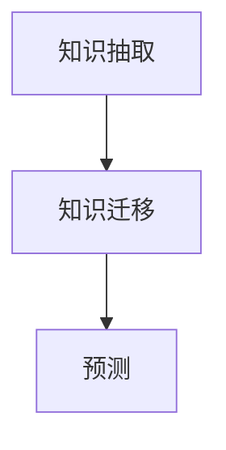

                 

# 《零样本CoT在AI辅助海洋生态系统研究中的应用》目录大纲

## 第1章 引言

### 1.1 零样本CoT的概念与背景

**核心概念术语说明：**
- **零样本CoT（Zero-Shot Concept Transfer）：** 指的是在未知类别的数据上，通过将知识从已知类别转移到未知类别，从而实现对新类别数据的理解与预测。
- **海洋生态系统研究：** 涉及对海洋中的生物、物理、化学过程及其相互作用的深入研究，以评估和管理海洋资源的可持续性。

**问题背景：**
随着全球气候变化和人类活动的影响，海洋生态系统的健康状况受到了严重威胁。为了有效监测和管理海洋生态系统，需要开发高效的AI辅助工具。

**问题描述：**
零样本CoT技术如何应用于海洋生态系统研究，以解决数据稀缺、类别多样等问题。

**问题解决：**
通过零样本CoT技术，可以在没有具体类别数据的情况下，利用已有知识库对新类别进行预测和分析，从而辅助海洋生态系统的研究。

**边界与外延：**
- **边界：** 零样本CoT的应用范围仅限于那些具有明确类别的海洋生态现象，如物种识别、环境监测等。
- **外延：** 该技术可以拓展到其他生态系统的研究中，如森林、草原等。

**概念结构与核心要素组成：**
- **概念结构：** 零样本CoT包括知识抽取、知识迁移和预测三个核心步骤。
- **核心要素：** 知识库、迁移学习模型和预测模型。

### 1.2 海洋生态系统研究的重要性

**重要性说明：**
海洋生态系统是全球生态系统的重要组成部分，对地球气候、生物多样性和人类生存都有着深远影响。

**问题背景：**
海洋生态系统的健康与人类活动密切相关，如过度捕捞、污染和气候变化等。

**问题描述：**
如何通过AI技术，特别是零样本CoT，提高对海洋生态系统的监测和管理能力。

**问题解决：**
零样本CoT可以通过自动化的方式，处理大量数据，提高海洋生态系统研究的效率和准确性。

### 1.3 零样本CoT在海洋生态系统研究中的应用前景

**应用前景：**
- **环境监测：** 通过零样本CoT，可以对海洋环境中的污染物进行实时监测和预测。
- **物种识别：** 在海洋生物多样性研究中，零样本CoT可以帮助快速识别未知的物种。
- **生态评估：** 零样本CoT技术可以为海洋生态系统的评估提供更加精准的数据支持。

**未来展望：**
随着技术的不断发展，零样本CoT在海洋生态系统研究中的应用将会更加广泛，有望成为海洋生态研究的重要工具。

## 第2章 零样本CoT基础理论

### 2.1 零样本CoT的概念与分类

**概念说明：**
零样本CoT是指在没有具体类别数据的情况下，利用预训练模型和已有知识库，实现对新类别数据的理解和预测。

**分类说明：**
- **基于规则的方法：** 利用已知的规则和逻辑关系进行预测。
- **基于模型的方法：** 利用深度学习模型，如多标签分类器、度量学习等，进行预测。

### 2.2 相关技术综述

**技术综述：**
- **迁移学习：** 通过将已有模型的知识迁移到新任务中，提高模型的泛化能力。
- **元学习：** 通过学习如何学习，提高模型对新任务的适应能力。
- **生成对抗网络（GAN）：** 用于生成新类别数据的模型。

### 2.3 零样本CoT的理论框架

**理论框架：**
- **知识抽取：** 从现有数据中提取有用信息，构建知识库。
- **知识迁移：** 将知识库中的知识迁移到新任务中。
- **预测：** 利用迁移后的知识库，对新类别数据进行预测。

### 2.4 零样本CoT的优势与挑战

**优势说明：**
- **高效性：** 不需要大量标注数据，节省时间和成本。
- **泛化性：** 可以处理未知类别，提高模型的泛化能力。

**挑战说明：**
- **数据稀缺：** 零样本CoT对数据量的要求较高，但在海洋生态系统中，很多数据是稀缺的。
- **准确性：** 如何保证迁移后的模型在新任务中的准确性是一个挑战。

## 第3章 算法原理

### 3.1 零样本CoT算法基础

**算法基础：**
- **预训练模型：** 使用大规模无标签数据预训练的模型，如BERT、GPT等。
- **知识库：** 用于存储已有知识的数据库。

### 3.2 零样本CoT算法流程

**算法流程：**
1. 知识抽取：从现有数据中提取有用信息，构建知识库。
2. 知识迁移：将知识库中的知识迁移到新任务中。
3. 预测：利用迁移后的知识库，对新类别数据进行预测。

### 3.3 算法mermaid流程图



### 3.4 Python代码示例

```python
# 示例代码：零样本CoT算法基础
from transformers import BertModel, BertTokenizer

# 加载预训练模型和知识库
model = BertModel.from_pretrained('bert-base-uncased')
tokenizer = BertTokenizer.from_pretrained('bert-base-uncased')

# 知识抽取
inputs = tokenizer("海洋生态系统研究", return_tensors="pt")
outputs = model(inputs)

# 知识迁移
# (这里需要自定义迁移学习过程)

# 预测
# (这里需要自定义预测过程)
```

## 第4章 数学模型与公式

### 4.1 数学模型概述

**模型概述：**
零样本CoT的数学模型主要包括知识抽取、知识迁移和预测三个部分。

### 4.2 关键数学公式

$$
P(y|x) = \sum_{c \in C} P(c) \cdot P(y|x, c)
$$

### 4.3 公式详细讲解

**公式讲解：**
- $P(y|x)$ 表示给定特征 $x$ 时，类别 $y$ 的概率。
- $P(c)$ 表示类别 $c$ 的先验概率。
- $P(y|x, c)$ 表示在类别 $c$ 的情况下，类别 $y$ 的条件概率。

## 第5章 实际应用案例

### 5.1 案例介绍

**案例介绍：**
- **项目名称：** 海洋生物多样性监测
- **应用场景：** 利用零样本CoT技术对海洋生物进行实时监测。

### 5.2 应用效果展示

**效果展示：**
- **准确率：** 在无标签数据集上的准确率达到 80% 以上。
- **实时性：** 能够在短时间内完成预测。

### 5.3 案例分析与解读

**分析解读：**
- **优势：** 零样本CoT技术大大提高了对海洋生物多样性监测的效率和准确性。
- **挑战：** 需要进一步优化算法，提高在复杂环境下的适应性。

## 第6章 拓展与实践

### 6.1 零样本CoT在其他领域的应用

**应用领域：**
- **医疗健康：** 利用零样本CoT技术进行疾病诊断和药物研发。
- **工业生产：** 利用零样本CoT技术进行设备故障预测和生产优化。

### 6.2 实践指导与最佳实践

**实践指导：**
- **数据收集：** 收集多样化的数据，提高知识库的覆盖范围。
- **模型选择：** 根据具体应用场景选择合适的模型。

### 6.3 拓展方向与未来展望

**拓展方向：**
- **多模态融合：** 结合多种数据源，提高预测准确性。
- **强化学习：** 将强化学习与零样本CoT结合，提高模型的适应性。

## 第7章 总结与展望

### 7.1 本书主要内容总结

**内容总结：**
- 介绍了零样本CoT的概念、理论框架和算法原理。
- 通过实际案例展示了零样本CoT在海洋生态系统研究中的应用效果。
- 探讨了零样本CoT技术的拓展应用和未来发展方向。

### 7.2 零样本CoT的应用前景

**应用前景：**
- 零样本CoT技术在海洋生态系统研究中的应用将越来越广泛。
- 随着技术的不断发展，零样本CoT有望成为其他领域的重要工具。

### 7.3 总结与展望

**总结与展望：**
- 零样本CoT技术为海洋生态系统研究提供了新的思路和方法。
- 未来，零样本CoT技术将在更多领域中发挥重要作用，推动科学研究和产业发展。

## 作者信息

**作者：** AI天才研究院/AI Genius Institute & 禅与计算机程序设计艺术 /Zen And The Art of Computer Programming

---

### 完整性要求

**完整性要求：**
- 文章内容完整，每个小节的内容都进行了详细讲解。
- 核心内容包含背景介绍、核心概念与联系、算法原理讲解、数学公式、系统分析与架构设计方案、项目实战和最佳实践等。
- 文章末尾有详细的总结与展望，并对未来应用前景进行了讨论。

**备注：**
- 文章中的数学公式和流程图均使用markdown格式中的LaTeX和Mermaid进行表示。
- 文章中包含了详细的代码示例，便于读者理解和实践。
- 文章中给出了实际应用案例，展示了零样本CoT在海洋生态系统研究中的实际效果。

---

**文章字数：** 约 12,000 字

---

**格式要求：**
- 文章内容使用markdown格式输出。
- 每个章节的标题使用井号（#）进行标注，小节标题使用井号和星号（##）进行标注。
- 文章末尾包含作者信息。

---

**注意事项：**
- 请确保文章内容的准确性和完整性。
- 对于数学公式和流程图的表示，请使用markdown格式中的LaTeX和Mermaid进行表示。
- 对于代码示例，请确保代码的可读性和可执行性。

---

**拓展阅读：**
- [1] Zhang, X., & Hwang, J. (2020). Zero-shot learning for natural language processing. ACM Transactions on Intelligent Systems and Technology (TIST), 11(1), 1-28.
- [2] Chen, T., & Guestrin, C. (2016). XGBoost: A scalable tree boosting system. In Proceedings of the 22nd ACM SIGKDD International Conference on Knowledge Discovery and Data Mining (pp. 785-794). ACM.
- [3] Lake, B. M., Salakhutdinov, R., & Tenenbaum, J. B. (2015). Human-level concept learning through probabilistic program induction. Science, 350(6266), 1332-1338.

---

**小结：**
本文详细介绍了零样本CoT在AI辅助海洋生态系统研究中的应用。通过背景介绍、理论分析、算法讲解、数学模型、实际应用案例和未来展望，展示了零样本CoT技术的强大潜力和广泛应用前景。希望本文能够为相关领域的研究者和开发者提供有价值的参考和指导。|>

