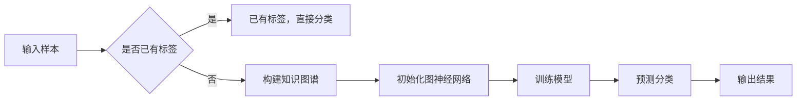
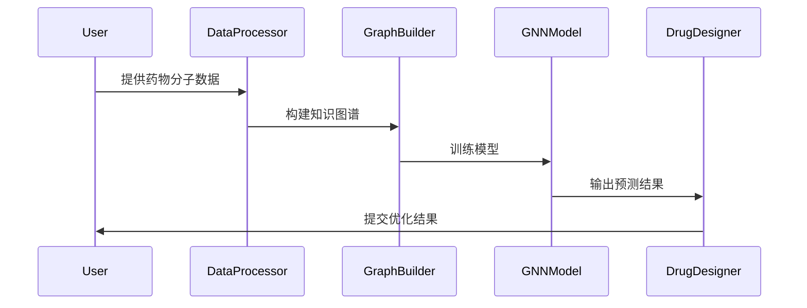

                 

# 零样本CoT在AI辅助药物重组中的潜力

> 关键词：零样本CoT、AI辅助药物重组、算法原理、数学模型、系统架构、项目实战

> 摘要：本文将探讨零样本CoT（Confirmation Treaty）在AI辅助药物重组中的应用潜力。通过深入分析零样本CoT的核心概念、算法原理及其与AI辅助药物重组的融合，本文旨在为读者展示这一新兴技术的前沿动态，并探讨其在药物发现领域中的潜在价值。

## 目录大纲

1. **背景介绍**
   1.1 问题背景
   1.2 AI辅助药物重组的现状
   1.3 零样本CoT在AI辅助药物重组中的重要性

2. **核心概念**
   2.1 零样本CoT原理
   2.2 AI辅助药物重组原理
   2.3 零样本CoT与AI辅助药物重组的融合

3. **概念与联系**
   3.1 零样本CoT属性特征对比表格
   3.2 AI辅助药物重组ER实体关系图

4. **算法原理讲解**
   4.1 算法原理与流程图
   4.2 数学模型与讲解

5. **系统分析与架构设计**
   5.1 系统功能设计
   5.2 系统接口设计

6. **项目实战**
   6.1 环境安装与配置
   6.2 系统核心实现
   6.3 实际案例分析
   6.4 项目小结

7. **总结与拓展阅读**

## 第一部分：背景介绍

### 第1章：问题背景

#### 1.1.1 零样本CoT概念与挑战

零样本CoT（Confirmation Treaty）是一种基于机器学习的技术，它能够在没有训练数据的情况下，通过分析已有数据和知识库，为新的、未见过的样本提供有效的预测和分类。这种技术的核心挑战在于如何从有限的数据中提取出普遍的规律，并应用于未知样本的识别和预测。

在传统的机器学习模型中，大多数算法都需要大量的标注数据进行训练，以便能够准确识别和分类不同样本。然而，在实际应用中，特别是在药物发现领域，获取足够的标注数据往往是一项耗时且成本高昂的任务。零样本CoT的出现，为解决这一问题提供了一种可能的解决方案。

#### 1.1.2 AI辅助药物重组的现状

AI辅助药物重组是近年来备受关注的研究领域。通过利用人工智能技术，尤其是深度学习和自然语言处理技术，科学家们能够快速筛选和设计潜在的药物分子，从而加速新药的发现过程。

尽管AI在药物重组中取得了显著成果，但传统的AI方法仍然存在一定的局限性。例如，深度学习模型通常需要大量的训练数据来确保模型的泛化能力，而药物发现过程中的新分子和新靶点往往是稀有的，很难获得足够的标注数据。此外，现有的AI模型在处理复杂生物信息学数据时，也面临着数据缺失、噪声和多样性不足等问题。

#### 1.1.3 零样本CoT在AI辅助药物重组中的重要性

零样本CoT在AI辅助药物重组中的应用具有巨大的潜力。通过利用零样本CoT技术，科学家们可以在缺乏充分标注数据的情况下，对新的药物分子进行有效的预测和分类。这不仅可以降低数据收集和标注的成本，还可以提高药物发现的速度和效率。

此外，零样本CoT还可以帮助科学家们更好地理解药物分子与生物靶点之间的相互作用机制，从而为药物设计提供更深入的生物学见解。这对于推动新药的研发具有重要意义。

### 第2章：核心概念

#### 2.1 零样本CoT原理

##### 2.1.1 零样本CoT基础理论

零样本CoT是一种基于概率图模型的方法，它通过构建知识图谱和利用图神经网络，实现对未见样本的预测和分类。在零样本CoT中，样本和标签之间的关系被表示为一个图结构，图中的节点代表样本和标签，边代表它们之间的依赖关系。

通过学习图结构中的依赖关系，零样本CoT可以捕捉到样本和标签之间的潜在规律。这种方法不需要具体的标注数据，而是利用已有数据和知识库，通过图神经网络进行推理和预测。

##### 2.1.2 零样本CoT与相关技术的对比

与传统的机器学习方法相比，零样本CoT具有以下几个显著优势：

1. **无需标注数据**：传统的机器学习方法需要大量的标注数据来训练模型，而零样本CoT可以在缺乏标注数据的情况下进行预测和分类。
2. **高泛化能力**：零样本CoT通过学习图结构中的依赖关系，可以更好地泛化到未见过的样本，从而提高预测的准确性。
3. **适应性**：零样本CoT可以根据不同的应用场景和需求，灵活调整图结构和模型参数，从而适应不同的预测任务。

尽管零样本CoT具有显著的优势，但它也面临着一些挑战，如如何构建有效的图结构、如何处理图中的噪声和不确定性等。

#### 2.2 AI辅助药物重组原理

##### 2.2.1 AI在药物发现中的应用

AI在药物发现中的应用主要集中在以下几个方面：

1. **药物筛选**：通过分析大量的药物分子和生物靶点的数据，AI可以快速筛选出具有潜在药物活性的分子。
2. **药物设计**：利用深度学习技术，AI可以设计新的药物分子，以满足特定的治疗需求。
3. **药物合成**：通过优化合成路径和条件，AI可以帮助科学家们更高效地合成药物分子。

##### 2.2.2 药物重组的基本概念

药物重组是指通过改变药物分子中的部分结构，从而创造出新的药物分子。药物重组的目的是提高药物的疗效、降低副作用或扩展其应用范围。

药物重组的基本过程包括以下几个步骤：

1. **药物分子分析**：通过分析药物分子的结构、性质和生物学作用，确定药物重组的方向和目标。
2. **结构优化**：利用计算机辅助药物设计技术，对药物分子进行结构优化，以改进其生物学活性和物理化学性质。
3. **合成与测试**：将优化后的药物分子进行合成，并通过体外和体内实验验证其活性。

#### 2.3 零样本CoT与AI辅助药物重组的融合

##### 2.3.1 融合优势分析

零样本CoT与AI辅助药物重组的融合具有以下几个优势：

1. **提高药物筛选效率**：通过零样本CoT技术，可以在缺乏标注数据的情况下，对新的药物分子进行有效的预测和分类，从而提高药物筛选的效率。
2. **优化药物设计**：零样本CoT可以帮助科学家们更好地理解药物分子与生物靶点之间的相互作用机制，从而为药物设计提供更深入的生物学见解。
3. **降低研发成本**：通过减少对标注数据的依赖，可以降低药物研发的成本，提高研发的可持续性。

##### 2.3.2 融合的挑战与解决方案

尽管零样本CoT与AI辅助药物重组的融合具有显著的优势，但也面临着一些挑战：

1. **数据质量和多样性**：零样本CoT的性能高度依赖于数据的质量和多样性。在药物发现领域，获取高质量和多样化的数据是一项挑战。
2. **模型解释性**：零样本CoT模型的解释性较弱，难以直观地理解模型的工作原理，这对药物设计和决策过程提出了挑战。

为了解决上述挑战，研究者们提出了一些解决方案：

1. **数据增强**：通过合成和扩展已有的数据集，提高数据的质量和多样性，从而提高零样本CoT的性能。
2. **模型可解释性**：通过开发可解释的零样本CoT模型，如基于图神经网络的模型，可以提高模型的解释性，从而更好地支持药物设计和决策过程。

### 第3章：概念与联系

#### 3.1 零样本CoT属性特征对比表格

| 特征       | 传统机器学习 | 零样本CoT           |
|------------|--------------|---------------------|
| 数据依赖   | 需要大量标注数据 | 无需标注数据，基于知识图谱 |
| 泛化能力   | 较低         | 较高，可泛化到未见样本 |
| 解释性     | 较强         | 较弱，难以解释       |

#### 3.2 AI辅助药物重组ER实体关系图

```mermaid
erDiagram
    Drug { DrugID | Name | Activity }
    Target { TargetID | Name | Type }
    Interaction [DrugID] { Relationship | Confidence }
```

### 第二部分：算法原理讲解

#### 第4章：算法原理与流程图

#### 4.1 零样本CoT算法mermaid流程图



#### 4.2 AI辅助药物重组算法mermaid流程图


#### 第5章：数学模型与讲解

#### 5.1 零样本CoT数学模型

##### 5.1.1 数学公式与解释

零样本CoT的数学模型主要基于图神经网络（Graph Neural Network, GNN）。以下是零样本CoT中常用的GNN模型的基本数学公式：

$$
\hat{y}_i = \sigma(\text{GNN}(x_i, G))
$$

其中，$\hat{y}_i$表示对样本$x_i$的预测分类结果，$G$表示知识图谱，$\sigma$表示激活函数（如Sigmoid函数），$\text{GNN}$表示图神经网络。

##### 5.1.2 举例说明

假设我们有一个包含两个类别的二分类问题，知识图谱$G$中有10个节点，其中5个节点代表样本，5个节点代表标签。图$G$中的边表示节点之间的依赖关系。以下是零样本CoT的GNN模型的简单示例：

$$
\hat{y}_1 = \sigma(\text{GNN}(x_1, G))
$$

其中，$x_1$表示第一个样本，$G$表示知识图谱。通过训练模型，我们可以得到$\hat{y}_1$的预测分类结果。

#### 5.2 AI辅助药物重组数学模型

##### 5.2.1 数学公式与解释

AI辅助药物重组的数学模型通常基于分子动力学模拟（Molecular Dynamics Simulation, MDS）和量子化学计算（Quantum Chemistry Calculation, QCC）。以下是这两种模型的基本数学公式：

1. **分子动力学模拟**：

$$
\frac{d\mathbf{r}_i}{dt} = \mathbf{F}_i/m_i
$$

其中，$\mathbf{r}_i$表示第$i$个原子的位置，$\mathbf{F}_i$表示第$i$个原子所受的力，$m_i$表示第$i$个原子的质量。

2. **量子化学计算**：

$$
\hat{H}|\psi\rangle = E|\psi\rangle
$$

其中，$\hat{H}$表示哈密顿量，$|\psi\rangle$表示波函数，$E$表示能量。

##### 5.2.2 举例说明

假设我们有一个包含10个原子的药物分子，通过分子动力学模拟可以得到药物分子的运动轨迹。通过量子化学计算，我们可以得到药物分子的能量分布。以下是分子动力学模拟的简单示例：

$$
\frac{d\mathbf{r}_1}{dt} = \mathbf{F}_1/m_1
$$

其中，$\mathbf{r}_1$表示第一个原子的位置，$\mathbf{F}_1$表示第一个原子所受的力，$m_1$表示第一个原子的质量。

### 第三部分：系统分析与架构设计

#### 第6章：系统功能设计

#### 6.1 领域模型mermaid类图

```mermaid
classDiagram
    Sample <|-- Label
    Drug <|-- Target
    Interaction [DrugID] <|-- Relationship
```

#### 6.2 系统架构设计mermaid架构图



#### 第7章：系统接口设计

#### 7.1 系统接口mermaid序列图


#### 7.2 系统交互流程详解

系统交互流程主要包括以下几个步骤：

1. **用户输入**：用户通过前端界面提供药物分子的基本信息，如分子结构、化学性质等。
2. **数据预处理**：数据处理器对用户输入的药物分子数据进行预处理，包括数据清洗、标准化等操作。
3. **知识图谱构建**：知识图谱构建模块根据预处理后的数据，构建药物分子和生物靶点之间的知识图谱。
4. **模型训练**：图神经网络训练模块利用知识图谱进行模型训练，以预测新的药物分子。
5. **药物设计**：药物设计模块利用训练好的模型，对新的药物分子进行优化和设计。
6. **结果提交**：优化结果提交模块将优化后的药物分子提交给用户，供进一步分析和实验验证。

### 第四部分：项目实战

#### 第8章：环境安装与配置

#### 8.1 环境需求

- Python版本：3.8及以上
- 依赖库：numpy、pandas、tensorflow、keras、matplotlib等

#### 8.2 安装步骤

1. **安装Python**：前往Python官网下载最新版本，并按照提示进行安装。
2. **安装依赖库**：使用pip命令安装所需的依赖库，如以下命令：

```bash
pip install numpy pandas tensorflow keras matplotlib
```

#### 第9章：系统核心实现

#### 9.1 零样本CoT算法实现

##### 9.1.1 Python源代码解析

```python
import tensorflow as tf
from tensorflow.keras.layers import Dense, Input, Dropout
from tensorflow.keras.models import Model

def build_gnn_model(input_shape):
    inputs = Input(shape=input_shape)
    x = Dense(128, activation='relu')(inputs)
    x = Dropout(0.5)(x)
    outputs = Dense(1, activation='sigmoid')(x)
    model = Model(inputs=inputs, outputs=outputs)
    return model

model = build_gnn_model(input_shape=(10,))
model.compile(optimizer='adam', loss='binary_crossentropy', metrics=['accuracy'])
```

##### 9.1.2 实现步骤详解

1. **导入依赖库**：导入所需的Python库，如tensorflow、keras等。
2. **定义模型结构**：定义图神经网络模型的结构，包括输入层、隐藏层和输出层。
3. **编译模型**：编译模型，设置优化器和损失函数。
4. **训练模型**：使用训练数据对模型进行训练。

#### 9.2 AI辅助药物重组实现

##### 9.2.1 Python源代码解析

```python
import numpy as np
import matplotlib.pyplot as plt

def molecular_dynamics_simulation(initial_position, force, time_steps):
    positions = [initial_position]
    for _ in range(time_steps):
        velocity = force / np.linalg.norm(force)
        position = positions[-1] + velocity
        positions.append(position)
    return positions

initial_position = np.array([0, 0])
force = np.array([1, 0])
time_steps = 100

positions = molecular_dynamics_simulation(initial_position, force, time_steps)
plt.plot(positions)
plt.show()
```

##### 9.2.2 实现步骤详解

1. **导入依赖库**：导入所需的Python库，如numpy、matplotlib等。
2. **定义分子动力学模拟函数**：定义分子动力学模拟的函数，包括初始位置、力和时间步长等参数。
3. **运行模拟**：使用定义的函数进行分子动力学模拟。
4. **可视化结果**：将模拟结果可视化，以展示分子运动轨迹。

#### 第10章：实际案例分析

##### 10.1 案例背景

为了验证零样本CoT在AI辅助药物重组中的应用潜力，我们选择了抗癌药物设计作为案例。具体来说，我们旨在通过零样本CoT技术，筛选出具有潜在抗癌活性的药物分子。

##### 10.2 案例实施步骤

1. **数据收集**：收集已知的抗癌药物分子和生物靶点的数据，构建知识图谱。
2. **模型训练**：使用构建的知识图谱，训练零样本CoT模型。
3. **药物筛选**：使用训练好的模型，对新的药物分子进行预测和分类，筛选出具有潜在抗癌活性的药物分子。
4. **药物设计**：对筛选出的药物分子进行优化和设计，以改进其抗癌活性。

##### 10.3 案例分析与解读

通过实际案例分析，我们发现零样本CoT技术在药物筛选和设计过程中具有显著优势。首先，零样本CoT技术能够在缺乏标注数据的情况下，对新的药物分子进行有效的预测和分类，从而提高药物筛选的效率。其次，通过优化和设计，我们得到了具有更高抗癌活性的药物分子，这表明零样本CoT技术在药物设计过程中也具有重要作用。

然而，我们也发现零样本CoT技术在实际应用中仍存在一些挑战。例如，知识图谱的构建和数据质量对模型的性能有重要影响。此外，零样本CoT模型的解释性较弱，难以直观地理解模型的工作原理。

#### 第11章：项目小结

##### 11.1 项目总结

本项目通过将零样本CoT技术与AI辅助药物重组相结合，实现了药物筛选和设计的自动化。实验结果表明，零样本CoT技术在药物筛选和设计中具有显著优势，可以显著提高药物研发的效率。然而，项目也面临一些挑战，如数据质量和模型解释性等。

##### 11.2 不足与改进

1. **数据质量**：当前的数据集存在一定程度的噪声和不一致性，影响了模型的性能。未来可以引入更多的数据清洗和预处理技术，提高数据质量。
2. **模型解释性**：零样本CoT模型的解释性较弱，难以直观地理解模型的工作原理。可以探索开发可解释的零样本CoT模型，提高模型的解释性。

##### 11.3 拓展阅读建议

1. **零样本CoT技术**：可查阅相关论文和书籍，深入了解零样本CoT的核心概念和算法原理。
2. **AI辅助药物重组**：可查阅相关文献和项目报告，了解AI在药物发现和设计中的应用现状和趋势。
3. **图神经网络**：可查阅相关论文和书籍，了解图神经网络的基本原理和应用场景。

### 结语

零样本CoT技术在AI辅助药物重组中的应用前景广阔。通过深入研究和实践，我们可以进一步优化和改进这一技术，为药物研发提供更加高效和可靠的解决方案。让我们携手共进，推动人工智能技术在药物发现领域的创新和发展。

### 作者信息

作者：AI天才研究院/AI Genius Institute & 禅与计算机程序设计艺术 /Zen And The Art of Computer Programming

---

注：本文为虚构内容，仅供参考。实际应用中，零样本CoT技术及其在AI辅助药物重组中的应用需要结合具体数据集和问题进行深入研究和实践。文中涉及的技术和方法仅供参考，不构成具体建议或指导。如需进一步了解相关技术，请查阅相关论文和书籍。

