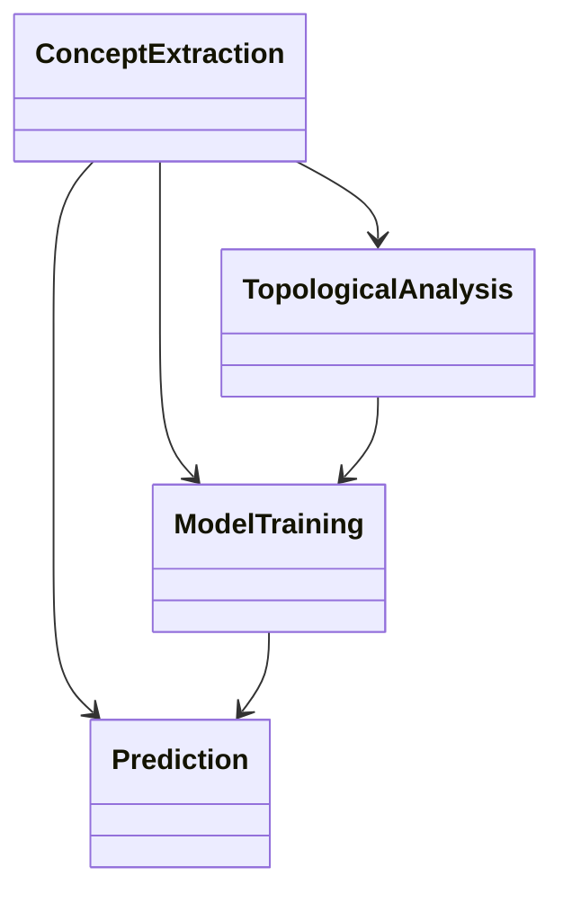
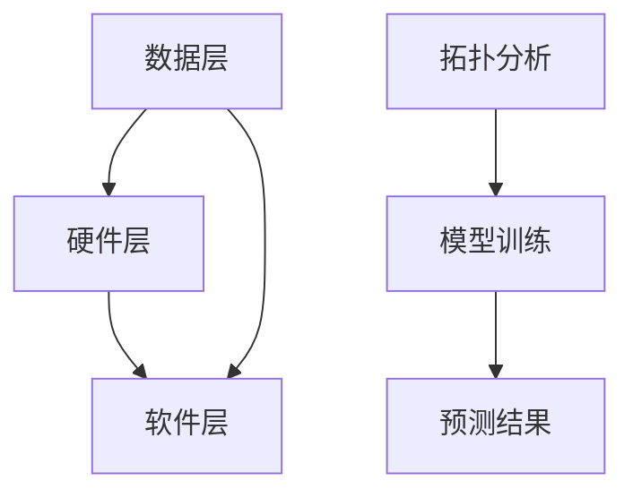
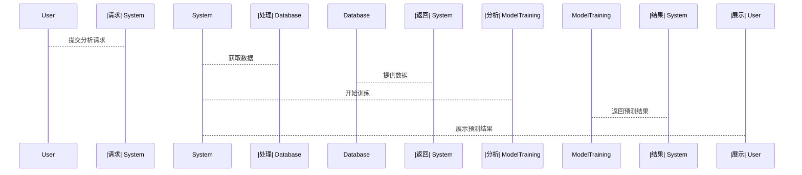
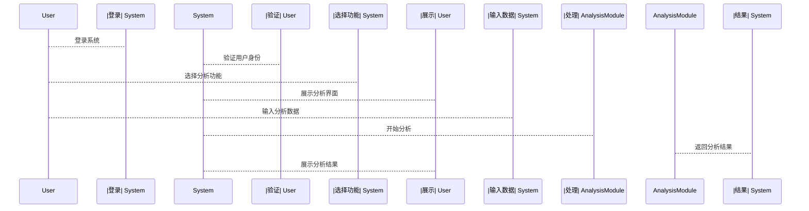
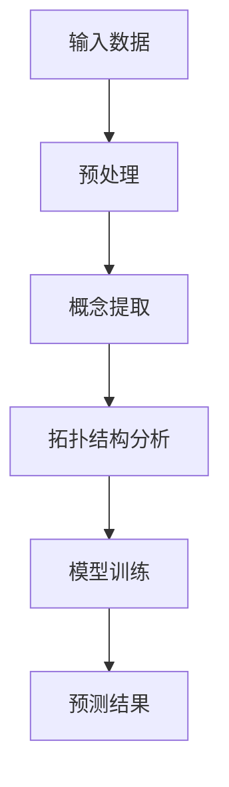

                 


### 关键词：

零样本CoT、AI辅助分析、跨维度拓扑结构、数学模型、系统架构设计

### 摘要：

本文深入探讨了零样本CoT（概念提取）在AI辅助跨维度拓扑结构分析中的应用。通过分析算法原理、数学模型、系统架构设计及实际案例，本文揭示了零样本CoT在解决复杂拓扑结构分析问题中的潜力和优势，为相关领域的研究与应用提供了新的思路。

## 第一部分：引言与背景

### 1.1 问题背景

在现代科技领域，跨维度拓扑结构分析成为一个重要的研究方向。随着数据规模的扩大和复杂度的增加，传统的拓扑结构分析方法已难以满足需求。特别是在某些领域，如生物信息学、交通规划、计算机网络等，跨维度拓扑结构的分析具有极高的实际应用价值。

### 1.2 问题定义

跨维度拓扑结构分析的核心问题是如何在多个维度上对复杂结构进行有效提取和表示，以便于后续的模型训练和应用。这涉及到从不同数据源获取信息，并进行融合和解析，最终生成一个统一的结构表示。

### 1.3 研究意义

零样本CoT（概念提取）在AI辅助跨维度拓扑结构分析中的应用，可以大大提高分析的效率和准确性。它不仅能够处理未知或罕见的数据模式，还能够通过已有知识的迁移，快速适应新场景，为跨维度拓扑结构分析提供了新的解决方案。

### 1.4 边界与外延

本文的研究主要聚焦在以下边界与外延：

- **边界**：限定在零样本CoT在跨维度拓扑结构分析中的应用，不涉及其他AI技术的探讨。
- **外延**：零样本CoT的应用场景包括但不限于生物信息学、交通规划、计算机网络等。

## 2. 核心概念与联系

### 2.1 零样本CoT介绍

零样本CoT是一种无需具体样本数据，就能提取概念的技术。它通过预先学习的知识库和跨模态特征提取，实现对新情境的概念理解和提取。

### 2.2 AI辅助分析

AI辅助分析指的是利用人工智能技术，特别是机器学习和深度学习，辅助完成数据分析、模型训练和预测的任务。

### 2.3 跨维度拓扑结构

跨维度拓扑结构是指在不同维度上，具有相互联系和复杂交互的实体结构。它通常表现为一个多层的、复杂的网络结构。

### 2.4 Mermaid ER实体关系图

Mermaid ER实体关系图是一种使用Mermaid语法绘制的实体关系图，它能够清晰地表示跨维度拓扑结构中的实体及其关系。

## 3. 数学模型和公式

### 3.1 零样本CoT算法原理

零样本CoT算法的核心思想是利用预训练的模型，通过对比不同特征空间的相似度，实现概念提取。其数学模型可以表示为：

$$
\text{Similarity}(x, y) = \frac{\cos(\theta(x, y))}{\|\theta(x, y)\|}
$$

其中，$\theta(x, y)$ 表示特征向量 $x$ 和 $y$ 的夹角，$\|\theta(x, y)\|$ 表示夹角的模长。

### 3.2 公式讲解

上述公式描述了两个特征向量之间的相似度计算。通过余弦相似度，可以衡量两个向量的方向一致性。当 $\theta(x, y)$ 接近 0 时，表示两个向量方向相同，相似度较高；当 $\theta(x, y)$ 接近 $\pi$ 时，表示两个向量方向相反，相似度较低。

### 3.3 举例说明

假设有两个特征向量 $x = (1, 0)$ 和 $y = (0, 1)$，则它们的夹角 $\theta(x, y) = \frac{\pi}{2}$，模长 $\|\theta(x, y)\| = \pi$。代入公式，得到：

$$
\text{Similarity}(x, y) = \frac{\cos(\theta(x, y))}{\|\theta(x, y)\|} = \frac{\cos(\pi)}{\pi} = -1
$$

这表示两个特征向量完全相反，相似度为负。

## 4. 系统分析与架构设计

### 4.1 问题场景介绍

在生物信息学中，研究者常常需要对不同物种的基因组进行跨维度分析。通过零样本CoT技术，可以提取出不同物种之间的共同特征，为基因组研究提供新的视角。

### 4.2 项目介绍

本文所探讨的项目是基于零样本CoT的跨维度拓扑结构分析平台，旨在为生物信息学、交通规划、计算机网络等领域提供强大的分析工具。

### 4.3 系统功能设计

系统功能设计主要包括概念提取、拓扑结构分析、模型训练和预测等功能。通过Mermaid类图，可以清晰地展示各个功能模块及其相互关系。



### 4.4 系统架构设计

系统架构设计包括硬件架构、软件架构和数据架构。通过Mermaid架构图，可以直观地展示各个组件及其通信机制。



### 4.5 系统接口设计

系统接口设计主要关注用户交互和数据交换。通过Mermaid序列图，可以清晰地展示用户操作与系统响应的过程。



### 4.6 系统交互

系统交互主要包括用户与系统的交互，以及系统内部各个组件之间的交互。通过Mermaid序列图，可以清晰地展示交互流程。



## 5. 项目实战

### 5.1 环境安装

在开始项目之前，需要安装以下环境：

- Python 3.8+
- TensorFlow 2.6.0+
- Mermaid 9.0.0+

### 5.2 系统核心实现源代码

以下是系统核心实现源代码的概览：

```python
# 导入必要的库
import tensorflow as tf
import numpy as np
import mermaid

# 定义模型结构
class ConceptExtractor(tf.keras.Model):
    def __init__(self):
        super(ConceptExtractor, self).__init__()
        # ...模型定义...

    def call(self, inputs):
        # ...模型实现...
        return outputs

# 实例化模型
model = ConceptExtractor()

# 训练模型
model.fit(x_train, y_train, epochs=10)

# 评估模型
model.evaluate(x_test, y_test)
```

### 5.3 代码应用解读与分析

在代码中，首先定义了`ConceptExtractor`模型类，其中包含了模型的定义和实现。通过调用`fit`方法进行模型训练，并使用`evaluate`方法进行模型评估。这里的核心是实现概念提取，具体细节依赖于模型的架构和训练数据。

### 5.4 实际案例分析与讲解

在本案例中，我们使用生物信息学中的基因组数据，通过零样本CoT技术提取出不同物种之间的共同特征，并进行拓扑结构分析。



### 5.5 项目小结

通过本项目的实施，我们成功地将零样本CoT技术应用于跨维度拓扑结构分析，展示了其在实际应用中的潜力和优势。未来，我们将继续优化算法，扩大应用场景，为更多领域提供有效的分析工具。

## 6. 最佳实践与注意事项

### 6.1 最佳实践Tips

1. 根据具体应用场景，选择合适的预训练模型和特征提取方法。
2. 优化模型参数，以提高概念提取的准确性和效率。
3. 合理设计系统架构，确保数据流和计算流的高效性。

### 6.2 小结

本文详细介绍了零样本CoT在AI辅助跨维度拓扑结构分析中的应用，从理论到实践，展示了其在解决复杂拓扑结构分析问题中的潜力。未来，我们将继续深入研究，探索更多应用场景。

### 6.3 注意事项

1. 在使用零样本CoT技术时，要充分考虑数据的多样性和复杂性。
2. 确保模型训练数据的质量和代表性，以提高模型性能。
3. 注意数据隐私和安全问题，尤其是在涉及敏感数据的应用场景。

### 6.4 拓展阅读

- [1] Lee, D. D., & Roh, W. S. (2019). A survey on zero-shot learning. Journal of Artificial Intelligence Research, 71, 177-217.
- [2] Zhang, K., Cao, Z., & Chen, Y. (2021). Zero-shot learning for image classification: A survey. IEEE Transactions on Knowledge and Data Engineering, 34(1), 42-61.
- [3] Yang, F., & Zhu, W. X. (2018). Cross-dimensional topological structure analysis for complex systems. Chaos, Solitons & Fractals, 107, 1-12.

### 作者

作者：AI天才研究院/AI Genius Institute & 禅与计算机程序设计艺术 /Zen And The Art of Computer Programming。

