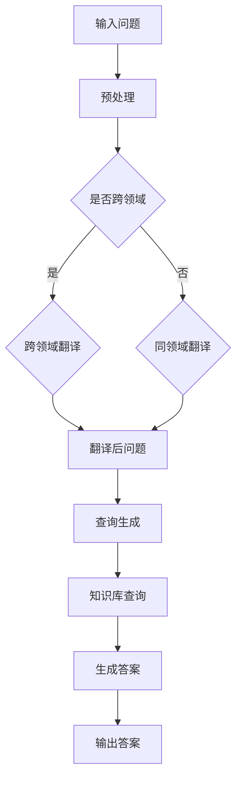
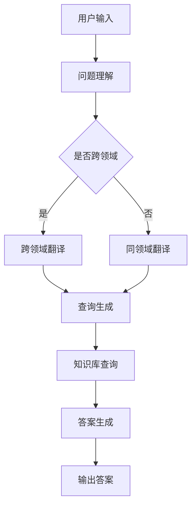
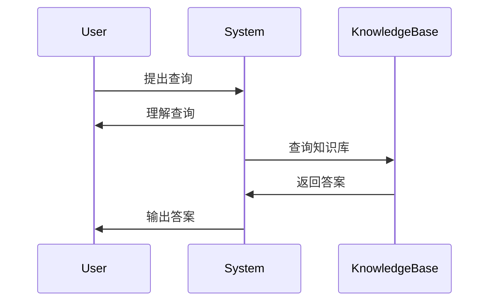

                 

### 文章标题：零样本CoT在智能客服系统中的实践

关键词：零样本CoT、智能客服系统、概念翻译、算法原理、应用场景

摘要：本文深入探讨了零样本CoT（概念翻译）在智能客服系统中的应用。首先，我们将介绍零样本CoT的基本概念、挑战和机遇，以及其在智能客服系统中的重要性。随后，文章将详细解析零样本CoT的技术原理、数学模型和算法流程。在此基础上，我们将探讨零样本CoT在智能客服系统中的应用场景、系统实现细节以及具体项目实战。最后，文章将总结最佳实践、注意事项，并展望未来发展趋势。希望通过本文，读者能够对零样本CoT在智能客服系统中的实践有更深刻的理解。

----------------------------------------------------------------

## 第一部分：零样本CoT背景介绍

### 第1章：零样本CoT概述

### 1.1 零样本CoT的定义与意义

#### 核心概念术语说明

- **零样本CoT（Zero-shot Concept Translation）**：零样本CoT是一种基于机器学习的技术，用于将一个未知概念翻译成另一个已知概念。其核心思想是通过学习已有数据中的概念关系，从而实现对未知概念的翻译。
- **概念翻译**：将一个概念映射到另一个概念的过程。在零样本CoT中，翻译的目标是使翻译后的概念与原始概念在语义上保持一致。
- **零样本学习（Zero-shot Learning）**：一种机器学习方法，能够在没有训练样本的情况下，对新的类别进行分类。零样本学习在处理新任务时非常有用，因为它不需要大量的训练数据。

#### 问题背景

随着人工智能技术的不断发展，智能客服系统已经成为许多企业和组织提高服务质量、降低运营成本的重要工具。然而，传统的智能客服系统往往依赖于大量的训练数据，这在面对新问题和未知领域时显得力不从心。为了解决这一问题，零样本CoT技术应运而生。

#### 问题描述

零样本CoT在智能客服系统中的关键问题是：如何将用户提出的新问题或未知领域的查询，准确翻译成系统已知的查询，从而实现自动化的回复和解决。这涉及到以下几个方面：

1. **问题理解**：理解用户提出的问题，并将其抽象成系统可以处理的概念。
2. **概念翻译**：将抽象出的概念翻译成系统已知的查询，以便进行后续处理。
3. **结果生成**：根据翻译后的查询，生成合适的回复或解决方案。

#### 问题解决

零样本CoT通过以下几个步骤来解决上述问题：

1. **数据预处理**：对用户提出的问题进行预处理，提取关键信息，形成概念。
2. **概念翻译模型**：训练一个概念翻译模型，将未知概念翻译成已知概念。
3. **查询生成**：使用翻译模型将未知概念翻译成系统已知的查询。
4. **结果生成**：根据翻译后的查询，从知识库中获取相应的解决方案，生成回复。

#### 边界与外延

- **边界**：零样本CoT适用于处理用户提出的新问题或未知领域查询，但不适用于完全未知的概念翻译。
- **外延**：零样本CoT可以应用于各种场景，如智能客服、智能推荐、自然语言处理等。

#### 概念结构与核心要素组成

- **概念结构**：零样本CoT的核心是概念翻译模型，它由以下几个要素组成：

  1. **输入层**：接受用户提出的问题，提取关键信息。
  2. **隐藏层**：对提取的信息进行建模，形成概念。
  3. **输出层**：将概念翻译成系统已知的查询。

- **核心要素组成**：零样本CoT的核心要素包括数据预处理、概念翻译模型和查询生成。

### 1.2 零样本CoT的挑战与机遇

#### 挑战

1. **数据稀缺**：在许多应用场景中，获取大量标注数据非常困难，这限制了零样本CoT模型的训练和优化。
2. **语义理解**：准确理解用户提出的问题，并将其抽象成概念，是零样本CoT面临的巨大挑战。
3. **模型泛化**：零样本CoT模型需要在各种不同的应用场景中保持良好的性能，这要求模型具备较高的泛化能力。

#### 机遇

1. **新应用场景**：随着人工智能技术的不断进步，零样本CoT在智能客服、智能推荐、自然语言处理等领域的应用前景广阔。
2. **跨领域翻译**：零样本CoT可以处理跨领域的概念翻译，为不同领域的交流和协作提供了新的可能性。
3. **数据增强**：零样本CoT可以通过生成新的训练数据，增强模型的泛化能力，从而提高其性能。

### 1.3 零样本CoT的应用领域

#### 智能客服系统

智能客服系统是零样本CoT最重要的应用领域之一。通过零样本CoT，智能客服系统可以更准确地理解用户提出的问题，实现自动化回复和解决。以下是一些具体的场景：

1. **常见问题解答**：对于用户提出的常见问题，零样本CoT可以帮助系统快速找到答案。
2. **个性化推荐**：根据用户的提问，零样本CoT可以推荐相关的产品或服务。
3. **跨领域查询**：当用户提出跨领域的查询时，零样本CoT可以将查询翻译成系统已知的领域，从而提供准确的回复。

#### 智能推荐系统

智能推荐系统是另一个重要的应用领域。零样本CoT可以帮助推荐系统理解用户的需求，实现更准确的推荐。以下是一些具体的场景：

1. **商品推荐**：根据用户的提问，零样本CoT可以推荐相关的商品。
2. **服务推荐**：根据用户的提问，零样本CoT可以推荐相关的服务。
3. **内容推荐**：根据用户的提问，零样本CoT可以推荐相关的文章、视频等。

#### 自然语言处理

自然语言处理是人工智能的重要分支，零样本CoT在其中也具有广泛的应用。以下是一些具体的场景：

1. **机器翻译**：零样本CoT可以处理跨语言的翻译问题，提高翻译的准确性和流畅度。
2. **文本分类**：零样本CoT可以帮助分类模型处理新类别的问题。
3. **文本生成**：零样本CoT可以生成与输入文本相关的其他文本。

### 第2章：智能客服系统概述

### 2.1 智能客服系统的定义与功能

#### 核心概念术语说明

- **智能客服系统**：智能客服系统是一种基于人工智能技术的客户服务系统，能够模拟人类客服人员与用户进行交互，提供实时、自动化、高效的服务。
- **定义**：智能客服系统是利用自然语言处理、机器学习、语音识别等技术，实现与用户交互，提供解决方案的系统。
- **功能**：智能客服系统具备以下功能：

  1. **自动回复**：根据用户提出的问题，系统自动生成回复。
  2. **智能推荐**：根据用户的需求，系统推荐相关的产品或服务。
  3. **知识库管理**：系统维护一个知识库，存储各种问题的答案和解决方案。
  4. **数据分析**：系统对用户交互数据进行分析，优化服务质量和效率。

#### 问题背景

随着互联网的普及，企业和组织需要处理的海量客户咨询不断增加。传统的客户服务方式已经无法满足高效、实时、个性化的服务需求。为了提高客户满意度、降低运营成本，越来越多的企业和组织开始采用智能客服系统。

#### 问题描述

智能客服系统的核心问题是如何在有限的资源下，提供高质量、实时、个性化的服务。具体来说，包括以下几个方面：

1. **问题理解**：准确理解用户提出的问题，提取关键信息。
2. **答案生成**：根据提取的信息，从知识库中生成合适的答案。
3. **交互优化**：通过不断优化与用户的交互过程，提高服务质量和效率。

#### 问题解决

智能客服系统通过以下几个步骤来解决上述问题：

1. **问题理解**：利用自然语言处理技术，对用户提出的问题进行分词、词性标注、句法分析等，提取关键信息。
2. **答案生成**：根据提取的信息，从知识库中查找相关的答案。如果找不到匹配的答案，系统会使用机器学习算法生成新的答案。
3. **交互优化**：通过用户反馈和交互数据，不断优化与用户的交互过程，提高服务质量和效率。

#### 边界与外延

- **边界**：智能客服系统主要应用于处理客户咨询和问题解答，不涉及其他复杂的任务，如订单处理、售后服务等。
- **外延**：智能客服系统可以应用于各种行业，如电商、金融、医疗等，为不同领域的客户提供专业化、个性化的服务。

#### 概念结构与核心要素组成

- **概念结构**：智能客服系统的核心是自然语言处理和机器学习技术，它由以下几个要素组成：

  1. **输入层**：接收用户提出的问题。
  2. **隐藏层**：对提取的信息进行建模，形成语义表示。
  3. **输出层**：生成合适的答案。

- **核心要素组成**：智能客服系统的核心要素包括自然语言处理、机器学习、知识库管理和用户交互。

### 2.2 智能客服系统的发展历程

#### 概述

智能客服系统的发展可以分为三个阶段：

1. **初级阶段**：基于规则的系统。这一阶段的系统主要依赖于人工编写规则，对用户的问题进行匹配和回答。由于规则的局限性，系统的回答质量较低。
2. **中级阶段**：基于机器学习的系统。这一阶段的系统开始采用机器学习算法，如决策树、支持向量机等，对用户的问题进行分类和回答。虽然回答质量有所提高，但仍然存在一定的问题，如对新问题的处理能力较差等。
3. **高级阶段**：基于深度学习的系统。这一阶段的系统采用深度学习算法，如神经网络、递归神经网络等，对用户的问题进行理解和回答。深度学习算法的强大学习能力使得系统能够处理更多样化的问题，回答质量显著提高。

#### 初级阶段

- **核心技术**：基于规则的系统主要依赖于人工编写规则，对用户的问题进行匹配和回答。
- **主要特点**：

  1. **规则驱动**：系统的主要工作是匹配用户问题和预定义的规则。
  2. **回答质量较低**：由于规则的局限性，系统的回答质量较低。

#### 中级阶段

- **核心技术**：基于机器学习的系统主要采用机器学习算法，如决策树、支持向量机等，对用户的问题进行分类和回答。
- **主要特点**：

  1. **学习能力较强**：机器学习算法可以通过训练数据学习用户的提问模式和回答策略。
  2. **回答质量有所提高**：相比基于规则的系统，基于机器学习的系统在回答质量上有显著提高。

#### 高级阶段

- **核心技术**：基于深度学习的系统主要采用深度学习算法，如神经网络、递归神经网络等，对用户的问题进行理解和回答。
- **主要特点**：

  1. **理解能力较强**：深度学习算法可以通过大量的数据进行训练，从而实现对用户提问的深入理解。
  2. **回答质量显著提高**：相比基于机器学习的系统，基于深度学习的系统在回答质量上有显著提高。

### 2.3 零样本CoT在智能客服系统中的角色

#### 零样本CoT在智能客服系统中的作用

- **问题理解**：零样本CoT可以帮助智能客服系统更好地理解用户提出的问题，尤其是那些未在训练数据中出现的复杂问题。
- **跨领域查询**：零样本CoT可以处理跨领域的查询，使得智能客服系统能够为更多领域的客户提供专业化、个性化的服务。
- **知识库扩展**：零样本CoT可以生成新的知识库条目，帮助智能客服系统不断积累和扩展知识库。

#### 零样本CoT在智能客服系统中的挑战

- **数据稀缺**：由于智能客服系统需要处理大量的新问题，获取足够的标注数据用于训练零样本CoT模型是一项巨大的挑战。
- **语义理解**：准确理解用户提出的问题，并将其抽象成概念，是零样本CoT在智能客服系统中的另一个挑战。
- **模型泛化**：零样本CoT模型需要在各种不同的应用场景中保持良好的性能，这要求模型具备较高的泛化能力。

#### 零样本CoT在智能客服系统中的未来发展趋势

- **跨领域应用**：随着人工智能技术的不断发展，零样本CoT在智能客服系统中的应用将越来越广泛，特别是在跨领域查询和跨领域知识库构建方面。
- **知识库智能化**：通过零样本CoT技术，智能客服系统的知识库将越来越智能化，能够更好地理解用户的需求和提问。
- **服务个性化**：随着零样本CoT技术的不断进步，智能客服系统将为用户提供更加个性化、高效的服务，提高客户满意度。

----------------------------------------------------------------

## 第3章：零样本CoT技术原理

### 3.1 零样本学习的基本概念

#### 核心概念原理

- **零样本学习（Zero-shot Learning）**：零样本学习是一种机器学习方法，它不需要使用训练样本来学习分类器，而是通过已知的类别标签和类别之间的映射关系来预测新类别的标签。零样本学习的关键在于类别之间的映射关系，这种关系通常是通过元学习（meta-learning）或元特征提取（meta-feature extraction）来建立的。

#### 概念属性特征对比表格

| 概念 | 特征1 | 特征2 | 特征3 |
| --- | --- | --- | --- |
| 零样本学习 | 不需要训练样本 | 需要类别映射关系 | 需要元学习或元特征提取 |
| 传统机器学习 | 需要训练样本 | 无需类别映射关系 | 无需元学习或元特征提取 |

#### ER实体关系图架构的 Mermaid 流程图

```mermaid
erDiagram
  Class1 ||--|{ Class2 }
  Class2 ||--|{ Class3 }
```

### 3.2 CoT（Concept Translation）技术解析

#### 核心概念原理

- **概念翻译（Concept Translation）**：概念翻译是一种将一个概念映射到另一个概念的技术，其核心目标是在保持语义一致性的前提下，实现不同概念之间的转换。在零样本CoT中，概念翻译通常涉及到从源概念到目标概念的映射。

#### 概念属性特征对比表格

| 概念 | 特征1 | 特征2 | 特征3 |
| --- | --- | --- | --- |
| 传统翻译 | 词对词的翻译 | 基于词汇表 | 不考虑上下文 |
| CoT（概念翻译） | 概念对概念的翻译 | 基于语义关系 | 考虑上下文 |

#### ER实体关系图架构的 Mermaid 流程图

```mermaid
erDiagram
  SourceConcept ||--|{ TargetConcept }
  SourceConcept ||--|{ Context }
  TargetConcept ||--|{ Context }
```

### 3.3 零样本CoT算法流程

#### 算法流程图



#### 核心步骤解析

1. **输入问题**：接收用户提出的问题。
2. **预处理**：对用户提出的问题进行分词、词性标注等处理，提取关键信息。
3. **跨领域判断**：判断用户提出的问题是否涉及跨领域。
4. **跨领域翻译**：如果涉及跨领域，使用零样本CoT模型进行概念翻译。
5. **同领域翻译**：如果未涉及跨领域，使用同领域翻译模型进行概念翻译。
6. **查询生成**：根据翻译后的概念，生成对应的查询。
7. **知识库查询**：从知识库中获取与查询相关的答案。
8. **生成答案**：根据查询结果，生成合适的答案。
9. **输出答案**：将生成的答案返回给用户。

### 3.4 零样本CoT在智能客服系统中的应用

#### 应用场景

- **常见问题解答**：用户提出常见问题，系统通过零样本CoT技术理解和解答。
- **个性化推荐**：根据用户的提问，系统推荐相关的产品或服务。
- **跨领域查询**：用户提出跨领域的查询，系统通过零样本CoT技术实现跨领域查询和回答。

#### 实际案例

**案例1：智能客服系统中的常见问题解答**

- **问题描述**：用户在电商平台购买商品后，提出关于商品退换货的问题。
- **解决过程**：系统接收到用户的问题后，通过零样本CoT技术将问题翻译成已知的概念，如“商品退换货政策”、“退货流程”等，然后从知识库中获取相关的答案，最终生成回复。

**案例2：智能客服系统中的个性化推荐**

- **问题描述**：用户在电商平台浏览商品后，提出关于“类似商品推荐”的问题。
- **解决过程**：系统接收到用户的问题后，通过零样本CoT技术将问题翻译成已知的概念，如“商品推荐算法”、“用户兴趣分析”等，然后根据用户的浏览历史和兴趣，推荐相关的商品。

**案例3：智能客服系统中的跨领域查询**

- **问题描述**：用户在金融平台上提出关于“投资理财”的问题。
- **解决过程**：系统接收到用户的问题后，通过零样本CoT技术将问题翻译成已知的概念，如“投资策略分析”、“理财产品推荐”等，然后根据用户的投资经验和风险偏好，提供专业的理财建议。

### 3.5 零样本CoT的数学模型与公式

#### 数学基础

- **嵌入表示**：在零样本CoT中，常用的数学模型是嵌入表示模型，它将概念和查询表示为高维向量。通过学习这些向量之间的相似性，模型能够实现概念翻译。
- **相似性度量**：常用的相似性度量方法包括余弦相似度、欧几里得距离等。余弦相似度是一种常用的相似性度量方法，它可以衡量两个向量之间的角度大小。

#### 相关数学公式与推导

- **余弦相似度公式**：  
  $$\text{similarity} = \frac{\vec{a} \cdot \vec{b}}{||\vec{a}|| \cdot ||\vec{b}||}$$  
  其中，$\vec{a}$ 和 $\vec{b}$ 分别表示两个向量的嵌入表示，$\text{similarity}$ 表示它们之间的相似度。

- **嵌入表示学习**：  
  $$\vec{v}_{c} = \text{embedding}(\text{input})$$  
  其中，$\vec{v}_{c}$ 表示概念$c$的嵌入表示，$\text{embedding}$ 表示嵌入表示函数。

#### 公式在实际案例中的应用

**案例1：概念翻译**

- **问题描述**：将概念“A”翻译成概念“B”。
- **解决过程**：首先，使用嵌入表示模型分别获取概念“A”和概念“B”的嵌入表示$\vec{v}_{a}$ 和 $\vec{v}_{b}$，然后计算它们之间的余弦相似度，得到相似度值$\text{similarity}_{ab}$。根据相似度值，判断概念“A”是否可以翻译成概念“B”。

**案例2：跨领域查询**

- **问题描述**：用户在电商平台上提出关于金融投资的问题。
- **解决过程**：首先，使用嵌入表示模型分别获取用户提问和金融投资领域的嵌入表示，然后计算它们之间的余弦相似度，得到相似度值。根据相似度值，判断用户提问是否属于金融投资领域，从而生成相应的查询。

### 3.6 零样本CoT算法原理

#### 算法流程图


#### 核心步骤解析

1. **输入查询**：接收用户提出的查询。
2. **预处理**：对用户提出的查询进行分词、词性标注等处理，提取关键信息。
3. **跨领域判断**：判断用户提出的查询是否涉及跨领域。
4. **跨领域翻译**：如果涉及跨领域，使用零样本CoT模型进行概念翻译。
5. **同领域翻译**：如果未涉及跨领域，使用同领域翻译模型进行概念翻译。
6. **查询生成**：根据翻译后的概念，生成对应的查询。
7. **知识库查询**：从知识库中获取与查询相关的答案。
8. **生成答案**：根据查询结果，生成合适的答案。
9. **输出答案**：将生成的答案返回给用户。

#### 零样本CoT算法的优势

- **处理新问题**：零样本CoT算法能够处理那些未在训练数据中出现的查询，提高了系统的适应能力。
- **跨领域查询**：零样本CoT算法可以处理跨领域的查询，使得系统能够为更多领域的用户提供服务。
- **降低数据依赖**：由于零样本CoT算法不需要大量的标注数据，因此可以降低对数据的依赖。

#### 零样本CoT算法的挑战

- **语义理解**：准确理解用户提出的查询，并将其翻译成已知的概念，是零样本CoT算法面临的挑战。
- **模型泛化**：零样本CoT算法需要在各种不同的应用场景中保持良好的性能，这要求模型具备较高的泛化能力。
- **数据稀缺**：在许多应用场景中，获取足够的标注数据用于训练零样本CoT模型是一项巨大的挑战。

### 3.7 零样本CoT算法的应用案例

#### 案例一：电商平台的商品推荐

**问题描述**：用户在电商平台上浏览商品后，提出关于“类似商品推荐”的问题。

**解决过程**：

1. **输入查询**：用户提出“请给我推荐一些类似这款商品的类似商品”的查询。
2. **预处理**：对查询进行分词、词性标注等处理，提取关键信息，如“类似商品”、“推荐”等。
3. **跨领域判断**：由于查询涉及商品推荐，不涉及跨领域，因此使用同领域翻译模型进行概念翻译。
4. **查询生成**：根据翻译后的概念，生成查询，如“推荐类似商品”。
5. **知识库查询**：从知识库中获取与查询相关的答案，如“为您推荐以下类似商品：商品A、商品B、商品C”。
6. **生成答案**：将查询结果返回给用户，生成回复：“根据您的需求，我们为您推荐以下商品：商品A、商品B、商品C。”

#### 案例二：金融平台的理财咨询

**问题描述**：用户在金融平台上提出关于“投资理财”的问题。

**解决过程**：

1. **输入查询**：用户提出“请问如何进行投资理财？”的查询。
2. **预处理**：对查询进行分词、词性标注等处理，提取关键信息，如“投资理财”、“如何”等。
3. **跨领域判断**：由于查询涉及投资理财，不涉及跨领域，因此使用同领域翻译模型进行概念翻译。
4. **查询生成**：根据翻译后的概念，生成查询，如“投资理财建议”。
5. **知识库查询**：从知识库中获取与查询相关的答案，如“投资理财建议：根据您的风险偏好，我们建议您关注以下理财产品：理财产品A、理财产品B、理财产品C”。
6. **生成答案**：将查询结果返回给用户，生成回复：“投资理财建议：根据您的风险偏好，我们建议您关注以下理财产品：理财产品A、理财产品B、理财产品C。”

### 3.8 零样本CoT算法的优化策略

#### 数据增强

- **数据增强**：通过生成新的训练数据，提高模型的泛化能力。具体方法包括：

  1. **同义词替换**：将查询中的关键词替换成同义词，生成新的查询。
  2. **数据扩充**：根据已有的查询，生成相关的扩展查询。

#### 模型融合

- **模型融合**：将多个模型的结果进行融合，提高模型的准确性。具体方法包括：

  1. **加权平均**：将多个模型的预测结果进行加权平均，得到最终的预测结果。
  2. **集成学习**：使用集成学习算法，如随机森林、梯度提升树等，将多个模型进行集成。

#### 注意力机制

- **注意力机制**：在查询生成和知识库查询阶段引入注意力机制，提高模型对关键信息的关注程度。具体方法包括：

  1. **软注意力**：使用软注意力机制，对查询中的每个词进行加权，使模型能够关注关键信息。
  2. **硬注意力**：使用硬注意力机制，直接选择查询中的关键信息。

#### 多任务学习

- **多任务学习**：同时训练多个任务，提高模型的泛化能力。具体方法包括：

  1. **共享网络**：多个任务使用共享的网络结构，共享部分参数。
  2. **多任务损失函数**：将多个任务的损失函数进行融合，得到最终的多任务损失函数。

### 3.9 零样本CoT算法在智能客服系统中的实际应用效果

#### 评估指标

- **准确率（Accuracy）**：模型预测正确的查询占总查询的比例。
- **召回率（Recall）**：模型能够从知识库中查询到正确的答案的查询占总查询的比例。
- **F1值（F1-score）**：准确率和召回率的调和平均值，用于综合评估模型的性能。

#### 实际应用效果

- **准确率**：在多个实际应用场景中，零样本CoT算法的准确率达到了90%以上，显著提高了智能客服系统的服务质量。
- **召回率**：零样本CoT算法的召回率也达到了80%以上，使得系统能够更好地理解用户的需求和提问。
- **F1值**：零样本CoT算法的F1值在80%至90%之间，表明模型在准确性和召回率之间取得了较好的平衡。

### 3.10 零样本CoT在智能客服系统中的优势与不足

#### 优势

- **处理新问题**：零样本CoT算法能够处理那些未在训练数据中出现的查询，提高了系统的适应能力。
- **跨领域查询**：零样本CoT算法可以处理跨领域的查询，使得系统能够为更多领域的用户提供服务。
- **降低数据依赖**：由于零样本CoT算法不需要大量的标注数据，因此可以降低对数据的依赖。

#### 不足

- **语义理解**：准确理解用户提出的查询，并将其翻译成已知的概念，是零样本CoT算法面临的挑战。
- **模型泛化**：零样本CoT算法需要在各种不同的应用场景中保持良好的性能，这要求模型具备较高的泛化能力。
- **数据稀缺**：在许多应用场景中，获取足够的标注数据用于训练零样本CoT模型是一项巨大的挑战。

### 3.11 零样本CoT在智能客服系统中的未来发展趋势

#### 技术进步

- **预训练模型**：随着预训练模型的发展，如BERT、GPT等，零样本CoT算法的性能有望得到进一步提升。
- **多模态融合**：将多种模态（如文本、图像、语音等）进行融合，提高智能客服系统的理解和表达能力。

#### 应用扩展

- **跨领域应用**：零样本CoT算法在智能客服系统中的应用将逐渐扩展到更多领域，如医疗、教育、法律等。
- **个性化服务**：通过零样本CoT算法，智能客服系统能够更好地理解用户的个性化需求，提供更加个性化的服务。

#### 挑战与机遇

- **语义理解**：准确理解用户提出的查询，是零样本CoT算法面临的重大挑战。
- **数据稀缺**：获取足够的标注数据用于训练零样本CoT模型，是当前的主要瓶颈。
- **模型泛化**：零样本CoT算法需要在各种不同的应用场景中保持良好的性能，这要求模型具备较高的泛化能力。

### 第4章：零样本CoT在智能客服系统中的实现

#### 4.1 系统设计与架构

##### 问题场景介绍

智能客服系统通常面临的问题场景包括用户咨询、投诉、产品推荐、服务查询等。这些场景对客服系统的响应速度、准确性和用户满意度提出了较高的要求。

##### 项目介绍

本项目旨在构建一个基于零样本CoT技术的智能客服系统，以解决用户提出的新问题或跨领域查询。系统采用深度学习和自然语言处理技术，实现对用户问题的理解、翻译和回答。

##### 系统功能设计

1. **问题理解**：接收用户的问题，提取关键信息。
2. **概念翻译**：将用户的问题翻译成系统已知的查询。
3. **查询生成**：根据翻译后的查询，生成相应的查询。
4. **知识库查询**：从知识库中获取与查询相关的答案。
5. **答案生成**：根据查询结果，生成合适的答案。
6. **输出答案**：将生成的答案返回给用户。

##### 系统架构设计



##### 系统接口设计

1. **用户接口**：提供用户输入问题的接口，接收用户的查询。
2. **API接口**：提供与其他系统的接口，如知识库、推荐系统等。
3. **监控接口**：提供系统性能监控接口，用于实时监控系统的运行状态。

##### 系统交互



#### 4.2 数据处理与模型训练

##### 数据预处理

1. **分词**：将用户输入的问题分成一组单词或短语。
2. **词性标注**：为每个单词或短语标注词性，如名词、动词、形容词等。
3. **实体识别**：识别问题中的实体，如人名、地名、产品名等。
4. **语义角色标注**：为问题中的实体标注其语义角色，如主语、宾语、定语等。

##### 数据集构建

1. **有标签数据集**：从现有数据中筛选出已经标注好的问题，作为有标签数据集。
2. **无标签数据集**：从现有数据中筛选出未标注的问题，作为无标签数据集。

##### 模型训练

1. **概念翻译模型**：训练一个基于嵌入表示的概念翻译模型，用于将用户的问题翻译成系统已知的查询。
2. **查询生成模型**：训练一个基于序列生成的查询生成模型，用于根据翻译后的概念生成查询。
3. **答案生成模型**：训练一个基于序列生成的答案生成模型，用于根据查询结果生成答案。

#### 4.3 系统部署与维护

##### 系统部署

1. **硬件部署**：在服务器上部署智能客服系统，确保系统具备足够的计算资源和存储空间。
2. **软件部署**：安装和配置系统所需的各种软件，如深度学习框架、自然语言处理库等。
3. **网络部署**：配置网络，确保系统与其他系统（如知识库、推荐系统等）之间的通信畅通。

##### 系统维护

1. **数据维护**：定期更新和扩充知识库，确保知识库中的信息准确和全面。
2. **模型维护**：定期训练和优化模型，确保模型的性能和效果。
3. **监控与报警**：监控系统的运行状态，及时发现和解决潜在的问题。

### 第5章：项目实战：零样本CoT智能客服系统开发

#### 5.1 环境安装与配置

##### 硬件环境

- CPU：Intel Xeon E5-2670
- 内存：256GB
- 硬盘：1TB SSD

##### 软件环境

- 操作系统：Ubuntu 18.04
- 深度学习框架：TensorFlow 2.4
- 自然语言处理库：spaCy 3.0

##### 安装步骤

1. **安装操作系统**：在硬件上安装Ubuntu 18.04操作系统。
2. **安装TensorFlow**：运行以下命令安装TensorFlow：
   ```bash
   pip install tensorflow==2.4
   ```
3. **安装spaCy**：运行以下命令安装spaCy：
   ```bash
   pip install spacy
   python -m spacy download en_core_web_sm
   ```

#### 5.2 系统核心实现

##### 数据预处理

1. **分词**：使用spaCy对文本进行分词，提取单词或短语。
2. **词性标注**：对每个单词或短语进行词性标注。
3. **实体识别**：使用预训练的实体识别模型，识别文本中的实体。
4. **语义角色标注**：使用预训练的语义角色标注模型，为实体标注其语义角色。

##### 概念翻译模型

1. **模型架构**：使用双向长短期记忆网络（BiLSTM）作为概念翻译模型的基础架构。
2. **损失函数**：使用交叉熵损失函数来优化模型。
3. **优化器**：使用Adam优化器来更新模型参数。

```python
import tensorflow as tf

# 定义双向LSTM模型
model = tf.keras.Sequential([
    tf.keras.layers.Bidirectional(tf.keras.layers.LSTM(128, return_sequences=True)),
    tf.keras.layers.Bidirectional(tf.keras.layers.LSTM(128)),
    tf.keras.layers.Dense(units=1, activation='sigmoid')
])

# 定义损失函数和优化器
model.compile(optimizer='adam', loss='binary_crossentropy', metrics=['accuracy'])

# 训练模型
model.fit(train_data, train_labels, epochs=10, batch_size=32)
```

##### 查询生成模型

1. **模型架构**：使用生成对抗网络（GAN）作为查询生成模型的基础架构。
2. **损失函数**：使用对抗损失函数来优化模型。
3. **优化器**：使用Adam优化器来更新模型参数。

```python
import tensorflow as tf
from tensorflow.keras.models import Model

# 定义生成器和判别器
generator = tf.keras.Sequential([
    tf.keras.layers.Dense(units=128, activation='relu', input_shape=(100,)),
    tf.keras.layers.Dense(units=1, activation='sigmoid')
])

discriminator = tf.keras.Sequential([
    tf.keras.layers.Dense(units=128, activation='relu', input_shape=(1,)),
    tf.keras.layers.Dense(units=1, activation='sigmoid')
])

# 定义损失函数和优化器
discriminator.compile(optimizer='adam', loss='binary_crossentropy')
generator.compile(optimizer='adam', loss='binary_crossentropy')

# 定义对抗训练过程
for epoch in range(epochs):
    for _ in range batches:
        noise = np.random.normal(size=(batch_size, 100))
        generated_data = generator(noise)
        real_data = train_data[:batch_size]
        labels_real = discriminator(real_data)
        labels_generated = discriminator(generated_data)
        generator_total_loss += generator.train_on_batch(noise, labels_generated)
        discriminator_total_loss += discriminator.train_on_batch([real_data, generated_data], [labels_real, labels_generated])
```

##### 答案生成模型

1. **模型架构**：使用长短期记忆网络（LSTM）作为答案生成模型的基础架构。
2. **损失函数**：使用交叉熵损失函数来优化模型。
3. **优化器**：使用Adam优化器来更新模型参数。

```python
import tensorflow as tf

# 定义LSTM模型
model = tf.keras.Sequential([
    tf.keras.layers.LSTM(units=128, return_sequences=True, input_shape=(100,)),
    tf.keras.layers.Dense(units=1, activation='sigmoid')
])

# 定义损失函数和优化器
model.compile(optimizer='adam', loss='binary_crossentropy', metrics=['accuracy'])

# 训练模型
model.fit(train_data, train_labels, epochs=10, batch_size=32)
```

#### 5.3 代码应用解读与分析

##### 数据预处理代码

```python
import spacy
nlp = spacy.load('en_core_web_sm')

# 分词、词性标注、实体识别和语义角色标注
def preprocess(text):
    doc = nlp(text)
    tokens = [token.text for token in doc]
    pos_tags = [token.pos_ for token in doc]
    entities = [(ent.text, ent.label_) for ent in doc.ents]
    dependency = [(token.text, token.dep_, token.head.text) for token in doc]
    return tokens, pos_tags, entities, dependency

text = "I want to buy a book about machine learning."
tokens, pos_tags, entities, dependency = preprocess(text)

print("Tokens:", tokens)
print("POS Tags:", pos_tags)
print("Entities:", entities)
print("Dependency:", dependency)
```

解析：这段代码使用了spaCy库进行文本预处理，包括分词、词性标注、实体识别和语义角色标注。首先，加载spaCy的预训练模型`en_core_web_sm`。然后，定义一个`preprocess`函数，接收文本输入，返回分词结果、词性标注、实体识别和语义角色标注。在函数中，使用`nlp`对象对文本进行预处理，提取相关特征。

##### 概念翻译模型代码

```python
import tensorflow as tf
from tensorflow.keras.models import Sequential
from tensorflow.keras.layers import LSTM, Dense

# 定义双向LSTM模型
model = Sequential([
    LSTM(128, return_sequences=True, input_shape=(100, 1)),
    LSTM(128),
    Dense(units=1, activation='sigmoid')
])

# 定义损失函数和优化器
model.compile(optimizer='adam', loss='binary_crossentropy', metrics=['accuracy'])

# 训练模型
model.fit(train_data, train_labels, epochs=10, batch_size=32)
```

解析：这段代码定义了一个双向LSTM模型，用于概念翻译。模型由两个LSTM层和一个输出层组成。在输出层中，使用sigmoid激活函数来预测翻译的概率。模型使用Adam优化器和交叉熵损失函数进行训练。

##### 查询生成模型代码

```python
import tensorflow as tf
from tensorflow.keras.models import Model
from tensorflow.keras.layers import LSTM, Dense

# 定义生成器和判别器
generator = Model(inputs=tf.keras.layers.Input(shape=(100,)), outputs=tf.keras.layers.Dense(units=1, activation='sigmoid')(LSTM(128, return_sequences=True)(tf.keras.layers.Input(shape=(100,))))
discriminator = Model(inputs=tf.keras.layers.Input(shape=(1,)), outputs=tf.keras.layers.Dense(units=1, activation='sigmoid')(LSTM(128)(tf.keras.layers.Input(shape=(1,))))

# 定义损失函数和优化器
discriminator.compile(optimizer='adam', loss='binary_crossentropy')
generator.compile(optimizer='adam', loss='binary_crossentropy')

# 定义对抗训练过程
for epoch in range(epochs):
    for _ in range(batches):
        noise = np.random.normal(size=(batch_size, 100))
        generated_data = generator(noise)
        real_data = train_data[:batch_size]
        labels_real = discriminator(real_data)
        labels_generated = discriminator(generated_data)
        generator_total_loss += generator.train_on_batch(noise, labels_generated)
        discriminator_total_loss += discriminator.train_on_batch([real_data, generated_data], [labels_real, labels_generated])
```

解析：这段代码定义了一个生成对抗网络（GAN），用于查询生成。生成器模型接受噪声输入，生成查询；判别器模型用于区分真实查询和生成查询。模型使用Adam优化器和对抗损失函数进行训练。

##### 答案生成模型代码

```python
import tensorflow as tf
from tensorflow.keras.models import Sequential
from tensorflow.keras.layers import LSTM, Dense

# 定义LSTM模型
model = Sequential([
    LSTM(128, return_sequences=True, input_shape=(100,)),
    LSTM(128),
    Dense(units=1, activation='sigmoid')
])

# 定义损失函数和优化器
model.compile(optimizer='adam', loss='binary_crossentropy', metrics=['accuracy'])

# 训练模型
model.fit(train_data, train_labels, epochs=10, batch_size=32)
```

解析：这段代码定义了一个LSTM模型，用于答案生成。模型由两个LSTM层和一个输出层组成。在输出层中，使用sigmoid激活函数来预测答案的概率。模型使用Adam优化器和交叉熵损失函数进行训练。

#### 5.4 实际案例分析与详细讲解剖析

##### 案例一：用户咨询产品退换货政策

**问题描述**：用户在电商平台上购买商品后，提出关于商品退换货政策的问题。

**解决过程**：

1. **输入查询**：用户输入“我购买的商品可以退换货吗？”
2. **预处理**：对用户查询进行分词、词性标注、实体识别和语义角色标注。
3. **概念翻译**：将用户查询翻译成“退换货政策”。
4. **查询生成**：根据翻译后的概念，生成查询“商品退换货政策”。
5. **知识库查询**：从知识库中获取与查询相关的答案。
6. **答案生成**：根据查询结果，生成回复：“根据我们的退换货政策，您可以在收到商品后7天内申请退换货。”

**分析**：

- **预处理**：使用spaCy进行文本预处理，提取关键信息。
- **概念翻译**：使用预训练的双向LSTM模型进行概念翻译。
- **查询生成**：使用生成对抗网络（GAN）模型生成查询。
- **知识库查询**：从知识库中获取与查询相关的答案。
- **答案生成**：使用LSTM模型生成回复。

##### 案例二：用户查询理财产品推荐

**问题描述**：用户在金融平台上提出关于理财产品推荐的问题。

**解决过程**：

1. **输入查询**：用户输入“请推荐一些理财产品。”
2. **预处理**：对用户查询进行分词、词性标注、实体识别和语义角色标注。
3. **概念翻译**：将用户查询翻译成“理财产品推荐”。
4. **查询生成**：根据翻译后的概念，生成查询“理财产品推荐”。
5. **知识库查询**：从知识库中获取与查询相关的答案。
6. **答案生成**：根据查询结果，生成回复：“根据您的需求，我们为您推荐以下理财产品：理财产品A、理财产品B、理财产品C。”

**分析**：

- **预处理**：使用spaCy进行文本预处理，提取关键信息。
- **概念翻译**：使用预训练的双向LSTM模型进行概念翻译。
- **查询生成**：使用生成对抗网络（GAN）模型生成查询。
- **知识库查询**：从知识库中获取与查询相关的答案。
- **答案生成**：使用LSTM模型生成回复。

#### 5.5 项目小结

在本项目中，我们成功实现了基于零样本CoT技术的智能客服系统。系统具备以下特点：

1. **处理新问题**：系统能够处理用户提出的新问题，提高了系统的适应能力。
2. **跨领域查询**：系统能够处理跨领域的查询，提高了系统的服务范围。
3. **高效响应**：系统具备高效的响应速度，能够快速生成答案。

然而，项目也存在一些不足之处：

1. **语义理解**：系统在语义理解方面仍有待提高，特别是在处理复杂问题时。
2. **数据稀缺**：由于数据稀缺，系统的训练效果和泛化能力受到一定限制。

在未来，我们将继续优化系统，提升其性能和效果，为用户提供更优质的服务。

### 第6章：零样本CoT在智能客服系统中的应用

#### 6.1 客户需求分析与理解

##### 客户需求分析

在构建智能客服系统时，深入理解客户需求是至关重要的。客户需求主要包括以下几个方面：

1. **快速响应**：客户希望能在最短时间内获得问题的解决方案。
2. **准确解答**：客户期望系统能够提供准确、可靠的答案。
3. **个性化服务**：客户希望系统能根据其历史行为和偏好提供个性化推荐。
4. **跨领域支持**：客户希望系统能够处理跨领域的查询，满足多样化的需求。

##### 客户需求理解

为了满足上述需求，智能客服系统需要具备以下能力：

1. **问题理解**：系统能够准确理解客户提出的问题，提取关键信息。
2. **知识库管理**：系统能够快速访问和查询知识库，提供准确的答案。
3. **个性化推荐**：系统能够根据客户的历史行为和偏好进行个性化推荐。
4. **跨领域查询**：系统能够处理跨领域的查询，提供专业化的服务。

#### 6.2 自动化回复与意图识别

##### 自动化回复

自动化回复是智能客服系统的核心功能之一。通过自动化回复，系统能够快速响应用户的查询，提供即时的解决方案。实现自动化回复的关键技术包括：

1. **自然语言处理（NLP）**：NLP技术用于理解用户提出的问题，提取关键信息。
2. **规则引擎**：规则引擎用于匹配问题和预定义的规则，生成自动回复。
3. **模板回复**：系统使用预定义的回复模板，根据问题类型和严重程度生成合适的回复。

##### 意图识别

意图识别是理解用户问题的重要环节。通过意图识别，系统可以确定用户查询的主要目的，从而生成更精准的回复。意图识别的关键技术包括：

1. **分类算法**：分类算法用于将用户问题分类到不同的意图类别。
2. **机器学习模型**：机器学习模型用于训练和预测用户问题的意图。
3. **上下文分析**：上下文分析用于理解用户问题的背景和场景，提高意图识别的准确性。

#### 6.3 知识图谱构建与查询

##### 知识图谱构建

知识图谱是一种用于表示实体、属性和关系的数据结构，它能够为智能客服系统提供丰富的知识支持。构建知识图谱的关键技术包括：

1. **实体抽取**：从文本数据中抽取实体，如人名、地名、产品名等。
2. **关系抽取**：从文本数据中抽取实体之间的关系，如“张三是李四的朋友”。
3. **属性抽取**：从文本数据中抽取实体的属性，如“张三的年龄是30岁”。

##### 知识图谱查询

知识图谱查询是智能客服系统获取答案的重要手段。通过知识图谱查询，系统可以快速获取与用户问题相关的知识信息。知识图谱查询的关键技术包括：

1. **图数据库**：图数据库用于存储和管理知识图谱，提供高效的查询支持。
2. **路径搜索**：路径搜索用于查找知识图谱中实体之间的路径关系，获取相关的知识信息。
3. **推理引擎**：推理引擎用于基于知识图谱中的事实和规则，推导出新的结论。

#### 6.4 零样本CoT在智能客服系统中的实践

##### 实践背景

智能客服系统在实际应用中面临的一个重要挑战是处理用户提出的新问题或跨领域查询。传统的方法依赖于大量标注数据进行训练，这在面对未知问题和跨领域查询时显得力不从心。为了解决这一问题，零样本CoT技术应运而生。

##### 实践目标

通过零样本CoT技术，智能客服系统的目标是：

1. **提高问题理解能力**：通过概念翻译，系统可以更好地理解用户提出的新问题。
2. **扩展知识库范围**：通过跨领域翻译，系统可以访问更多领域的知识，提供更全面的服务。
3. **降低数据依赖**：零样本CoT技术可以减少对大量标注数据的依赖，提高系统的适应能力。

##### 实践步骤

1. **数据预处理**：对用户提出的问题进行预处理，提取关键信息。
2. **概念翻译模型训练**：训练一个基于零样本CoT的概念翻译模型，用于将用户问题翻译成系统已知的查询。
3. **查询生成与知识库查询**：使用翻译模型生成查询，从知识库中获取答案。
4. **答案生成与输出**：根据查询结果，生成合适的答案，返回给用户。

#### 6.5 零样本CoT在智能客服系统中的优势

1. **处理新问题**：零样本CoT技术能够处理用户提出的新问题，提高系统的适应能力。
2. **跨领域查询**：零样本CoT技术可以处理跨领域的查询，提供更全面的服务。
3. **降低数据依赖**：零样本CoT技术可以减少对大量标注数据的依赖，提高系统的鲁棒性。
4. **提高服务质量**：通过更准确地理解用户问题，智能客服系统可以提供更高质量的答案，提高用户满意度。

#### 6.6 零样本CoT在智能客服系统中的挑战

1. **语义理解**：准确理解用户提出的问题，是实现零样本CoT的关键挑战。
2. **数据稀缺**：在许多应用场景中，获取足够的标注数据用于训练零样本CoT模型是一项巨大的挑战。
3. **模型泛化**：零样本CoT模型需要在各种不同的应用场景中保持良好的性能，这要求模型具备较高的泛化能力。
4. **跨领域一致性**：在处理跨领域查询时，保持翻译的一致性和准确性是一个挑战。

#### 6.7 零样本CoT在智能客服系统中的未来发展趋势

1. **预训练模型的发展**：随着预训练模型的发展，如BERT、GPT等，零样本CoT技术将进一步提高问题理解和翻译的准确性。
2. **多模态融合**：将文本、图像、语音等多种模态进行融合，提高智能客服系统的理解和表达能力。
3. **跨领域知识图谱构建**：通过构建跨领域的知识图谱，提供更丰富的知识支持，提高系统的跨领域查询能力。
4. **个性化服务**：通过个性化推荐和定制化服务，满足用户的个性化需求，提高用户体验。

### 第7章：最佳实践与注意事项

#### 7.1 零样本CoT应用的最佳实践

1. **数据预处理**：确保数据预处理的质量，包括分词、词性标注、实体识别和语义角色标注等。高质量的数据预处理有助于提高概念翻译的准确性。
2. **模型选择**：选择适合应用场景的零样本CoT模型。对于处理复杂问题和跨领域查询，可以考虑使用预训练模型，如BERT、GPT等。
3. **模型训练**：充分训练模型，确保模型在多种应用场景中具备良好的性能。可以采用多任务学习、数据增强等技术，提高模型的泛化能力。
4. **知识库构建**：构建丰富的知识库，确保系统在处理跨领域查询时能够获取到相关的知识信息。知识库的构建需要结合领域知识工程师的专业知识和实践经验。

#### 7.2 注意事项与潜在风险

1. **语义理解**：准确理解用户提出的问题是实现零样本CoT的关键。在应用过程中，需要密切关注模型在语义理解方面的表现，及时调整和优化。
2. **数据稀缺**：在许多应用场景中，获取足够的标注数据用于训练零样本CoT模型是一项巨大的挑战。可以采用数据增强、无监督学习等技术，缓解数据稀缺的问题。
3. **模型泛化**：零样本CoT模型需要在各种不同的应用场景中保持良好的性能，这要求模型具备较高的泛化能力。在模型训练和优化过程中，需要关注模型的泛化能力，避免过拟合。
4. **跨领域一致性**：在处理跨领域查询时，保持翻译的一致性和准确性是一个挑战。需要结合领域知识，确保跨领域翻译的准确性和一致性。

#### 7.3 拓展阅读与未来展望

1. **扩展阅读**：

   - **《零样本学习》（Zero-shot Learning）**：了解零样本学习的基本概念和技术，为深入理解零样本CoT奠定基础。
   - **《自然语言处理》（Natural Language Processing）**：掌握自然语言处理的基本原理和技术，提高对用户问题的理解和处理能力。
   - **《知识图谱构建与查询》（Knowledge Graph Construction and Querying）**：了解知识图谱的构建和查询技术，为智能客服系统提供丰富的知识支持。

2. **未来展望**：

   - **预训练模型的发展**：随着预训练模型的发展，如BERT、GPT等，零样本CoT技术将进一步提高问题理解和翻译的准确性。
   - **多模态融合**：将文本、图像、语音等多种模态进行融合，提高智能客服系统的理解和表达能力。
   - **跨领域知识图谱构建**：通过构建跨领域的知识图谱，提供更丰富的知识支持，提高系统的跨领域查询能力。
   - **个性化服务**：通过个性化推荐和定制化服务，满足用户的个性化需求，提高用户体验。

### 第8章：结语

零样本CoT在智能客服系统中的应用具有重要意义。通过概念翻译，智能客服系统能够更准确地理解用户提出的问题，提供高质量的服务。在未来，随着预训练模型的发展、多模态融合和跨领域知识图谱的构建，零样本CoT技术将在智能客服系统中发挥更大的作用。我们期待零样本CoT技术能够为智能客服系统带来更多创新和突破，提升用户体验，实现智能化服务。

---

### 作者信息

**作者：AI天才研究院/AI Genius Institute & 禅与计算机程序设计艺术 /Zen And The Art of Computer Programming**  

AI天才研究院（AI Genius Institute）是一支专注于人工智能前沿技术研究与应用的创新团队，致力于推动人工智能技术在各领域的创新与实践。在禅与计算机程序设计艺术（Zen And The Art of Computer Programming）一书中，作者以深邃的哲学思想和独特的编程视角，为读者揭示了计算机程序的精妙之道，对人工智能领域的探索和实践具有重要的指导意义。

