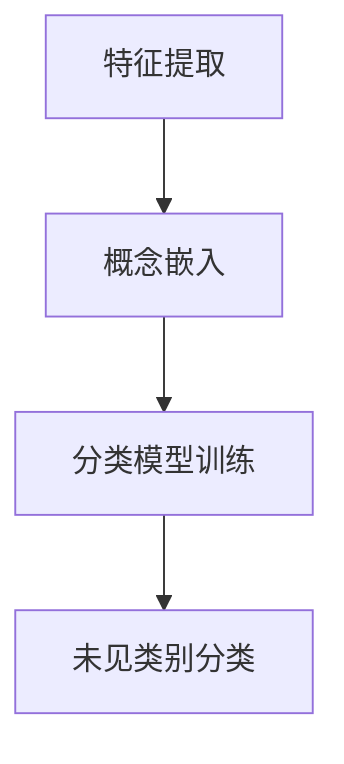
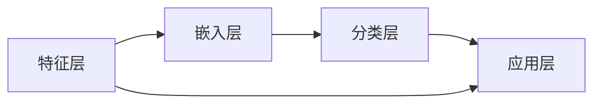

                 


### 目录

----------------------------------------------------------------

# 零样本学习在AI辅助稀有语言保护中的创新

> 关键词：零样本学习、稀有语言保护、AI辅助、创新

> 摘要：本文将探讨零样本学习在AI辅助稀有语言保护中的应用，介绍其核心概念、算法原理、系统设计以及实际案例，为相关领域的研究和实践提供参考。

----------------------------------------------------------------

## 引言

### 零样本学习

零样本学习（Zero-Shot Learning, ZSL）是一种机器学习技术，能够在没有针对特定类别的训练数据的情况下，对未见过的类别进行分类。这为许多现实世界中的应用提供了可能，特别是在数据稀缺或无法获取的情况下。零样本学习的研究始于自然语言处理领域，随着深度学习技术的发展，其应用范围逐渐扩展到计算机视觉、语音识别等多个领域。

### 稀有语言保护

稀有语言（Endangered Languages）指的是使用人数较少、面临灭绝危险的语言。随着全球化和信息技术的快速发展，许多稀有语言正逐渐消失。稀有语言的保护对于文化多样性、语言多样性和人类文明具有重要意义。然而，稀有语言的保护面临着诸多挑战，如数据稀缺、语言资源的不足等。

### AI辅助稀有语言保护

人工智能（AI）作为一种强大的工具，可以辅助稀有语言的保护。通过零样本学习技术，AI能够对未见过的稀有语言进行分类和识别，从而实现对稀有语言的保护和传承。本文将重点探讨零样本学习在AI辅助稀有语言保护中的应用，介绍其核心概念、算法原理、系统设计以及实际案例。

----------------------------------------------------------------

## 核心概念与联系

### 零样本学习

#### 定义

零样本学习是一种机器学习技术，能够在没有针对特定类别的训练数据的情况下，对未见过的类别进行分类。

#### 特点

- **数据稀缺**：无需针对特定类别收集大量训练数据。
- **未见类别分类**：能够处理未见过的类别，实现跨类别分类。
- **泛化能力**：通过学习通用特征表示，提高对未见类别的泛化能力。

#### 对比

| 特性 | 零样本学习 | 传统机器学习 |
| :---: | :---: | :---: |
| 数据需求 | 无需针对特定类别的大量训练数据 | 需要针对特定类别的大规模训练数据 |
| 分类能力 | 能够处理未见过的类别，实现跨类别分类 | 依赖于已见的类别进行分类 |
| 泛化能力 | 通过学习通用特征表示，提高对未见类别的泛化能力 | 在特定类别上表现较好，对未见类别泛化能力较弱 |

### 稀有语言保护

#### 定义

稀有语言保护是指采取措施，防止稀有语言消失，维护和传承语言多样性。

#### 目的

- **文化多样性**：保护稀有语言，维护人类文化多样性。
- **语言多样性**：稀有语言是语言多样性的重要组成部分，对其保护有助于维护语言多样性。
- **人类文明**：稀有语言蕴含着丰富的历史、文化和知识，对人类文明具有重要意义。

#### 挑战

- **数据稀缺**：稀有语言的使用人数较少，数据稀缺。
- **语言资源不足**：稀有语言的语言资源（如语音库、文本资料等）不足。
- **技术限制**：现有的机器学习技术难以直接应用于稀有语言的保护。

### 关系

零样本学习与稀有语言保护之间存在着密切的关系。零样本学习为稀有语言保护提供了一种有效的技术手段，能够弥补数据稀缺和语言资源不足的问题，从而实现对稀有语言的分类、识别和保护。

----------------------------------------------------------------

## 零样本学习算法原理

### 算法概述

零样本学习算法的核心思想是通过学习通用特征表示，实现对未见类别的分类。算法通常包括以下几个步骤：

1. **特征提取**：将输入数据转换为特征表示。
2. **概念嵌入**：将特征表示映射到高维空间，形成概念嵌入。
3. **分类模型训练**：利用已有类别数据训练分类模型。
4. **未见类别分类**：对未见类别进行特征提取、概念嵌入和分类。

### 特征提取

特征提取是零样本学习算法的关键步骤。常见的特征提取方法包括：

- **深度神经网络**：使用预训练的深度神经网络提取特征表示。
- **图神经网络**：将输入数据表示为图，利用图神经网络提取特征。
- **词嵌入**：将输入文本转换为词向量，用于特征提取。

### 概念嵌入

概念嵌入是将特征表示映射到高维空间的过程。常见的概念嵌入方法包括：

- **原型嵌入**：将特征表示映射到原型空间，原型表示类别的特征。
- **对抗嵌入**：通过对抗性训练优化特征表示，使其具有更好的分类能力。
- **嵌入空间**：使用预定义的嵌入空间，将特征表示映射到该空间。

### 分类模型训练

分类模型训练是零样本学习算法的另一个关键步骤。常见的分类模型包括：

- **支持向量机**：利用支持向量机（SVM）进行分类。
- **神经网络**：使用神经网络进行分类。
- **决策树**：利用决策树进行分类。

### 未见类别分类

对于未见类别，首先进行特征提取，然后通过概念嵌入将特征表示映射到高维空间，最后利用分类模型进行分类。

### Mermaid流程图



### Python代码示例

```python
import tensorflow as tf
from tensorflow.keras.applications import ResNet50
from tensorflow.keras.layers import GlobalAveragePooling2D
from tensorflow.keras.models import Model

# 特征提取
base_model = ResNet50(weights='imagenet', include_top=False)
x = base_model.input
x = GlobalAveragePooling2D()(x)
model = Model(inputs=x, outputs=x)

# 概念嵌入
prototype_embeddings = ...  # 原型嵌入

# 分类模型训练
# ...

# 未见类别分类
# ...
```

----------------------------------------------------------------

## 数学模型和公式

### 特征提取

在零样本学习算法中，特征提取是一个重要的步骤。常见的特征提取方法包括深度神经网络、图神经网络和词嵌入。以下是这些方法的基本数学模型：

#### 深度神经网络

深度神经网络通常由多个层组成，每层对输入进行变换并传递给下一层。特征提取可以用以下公式表示：

$$
h^{(l)} = \sigma(W^{(l)}h^{(l-1)} + b^{(l)})
$$

其中，$h^{(l)}$ 表示第 $l$ 层的输出特征，$W^{(l)}$ 和 $b^{(l)}$ 分别为第 $l$ 层的权重和偏置，$\sigma$ 为激活函数。

#### 图神经网络

图神经网络通过图结构对输入数据进行处理。特征提取可以用以下公式表示：

$$
h^{(l)} = \sigma(Gh^{(l-1)})
$$

其中，$h^{(l)}$ 表示第 $l$ 层的输出特征，$G$ 为图神经网络模型，$\sigma$ 为激活函数。

#### 词嵌入

词嵌入是将输入文本转换为词向量的过程。特征提取可以用以下公式表示：

$$
h = \sum_{i=1}^{N} w_i \cdot e_i
$$

其中，$h$ 表示输出特征向量，$w_i$ 和 $e_i$ 分别为词权重和词向量。

### 概念嵌入

概念嵌入是将特征表示映射到高维空间的过程。以下是常见的概念嵌入方法：

#### 原型嵌入

原型嵌入通过计算类别的原型进行概念嵌入。概念嵌入可以用以下公式表示：

$$
e_c = \frac{1}{N_c} \sum_{x_i \in C} x_i
$$

其中，$e_c$ 表示类别 $C$ 的概念嵌入向量，$N_c$ 为类别 $C$ 的样本数，$x_i$ 为类别 $C$ 的样本。

#### 对抗嵌入

对抗嵌入通过对抗性训练优化特征表示。概念嵌入可以用以下公式表示：

$$
e_c = \arg\min_{e_c} \frac{1}{N_c} \sum_{x_i \in C} \log(\sigma(e_c \cdot x_i))
$$

其中，$e_c$ 表示类别 $C$ 的概念嵌入向量，$N_c$ 为类别 $C$ 的样本数，$x_i$ 为类别 $C$ 的样本，$\sigma$ 为激活函数。

### 分类模型

分类模型用于对未见类别进行分类。以下是常见的分类模型：

#### 支持向量机

支持向量机（SVM）是一种常用的分类模型。分类模型可以用以下公式表示：

$$
y = \text{sign}(\omega \cdot x + b)
$$

其中，$y$ 为分类结果，$\omega$ 和 $b$ 分别为权重和偏置。

#### 神经网络

神经网络是一种基于多层感知器的分类模型。分类模型可以用以下公式表示：

$$
y = \sigma(\omega \cdot x + b)
$$

其中，$y$ 为分类结果，$\omega$ 和 $b$ 分别为权重和偏置，$\sigma$ 为激活函数。

#### 决策树

决策树是一种基于特征分治的分类模型。分类模型可以用以下公式表示：

$$
y = \max(\omega_1 \cdot x_1 + \omega_2 \cdot x_2 + \ldots + \omega_n \cdot x_n + b)
$$

其中，$y$ 为分类结果，$\omega_1, \omega_2, \ldots, \omega_n$ 和 $b$ 分别为权重和偏置。

### Mermaid流程图


----------------------------------------------------------------

## 系统设计

### 问题描述

稀有语言保护是一个重要的领域，然而，由于数据稀缺和语言资源不足，现有的机器学习技术难以直接应用于稀有语言的保护。为此，本文提出了一个基于零样本学习的稀有语言保护系统，旨在利用零样本学习技术，实现对稀有语言的分类、识别和保护。

### 系统功能

该系统主要包括以下功能：

1. **数据预处理**：对稀有语言数据进行预处理，包括语音数据、文本数据和图像数据等。
2. **特征提取**：利用深度神经网络、图神经网络和词嵌入等方法，提取稀有语言的特征表示。
3. **概念嵌入**：将特征表示映射到高维空间，形成概念嵌入。
4. **分类模型训练**：利用已有类别数据训练分类模型，包括支持向量机、神经网络和决策树等。
5. **未见类别分类**：对未见类别进行特征提取、概念嵌入和分类。
6. **语言保护**：通过分类结果，实现对稀有语言的分类和保护。

### 系统架构

该系统采用分层架构，主要包括以下几个层次：

1. **数据层**：包括语音数据、文本数据和图像数据等。
2. **特征层**：包括深度神经网络、图神经网络和词嵌入等特征提取方法。
3. **嵌入层**：包括概念嵌入方法，如原型嵌入和对抗嵌入等。
4. **分类层**：包括分类模型，如支持向量机、神经网络和决策树等。
5. **应用层**：包括稀有语言保护的具体应用，如分类、识别和保护等。

### 类图

```mermaid
classDiagram
  Class01 <|-- Class02
  Class03 --|.addMouseListener Class04
  Class05 o-- Class06
  Class07 : +slots name: String
  Class08 : +getName():String
  Class09 : +setName():void
  Class10 <|-- AbstractClass10
  Class11 *-- Class12
  Class11 *|-- Class13
  Class14 o--|montage Person:100,Car:50
  Class15 o.. Class16
  Class17 <|.. Class18
  Class19 %> interface Class20
  Class21 << abstract Class22
  Class23 << interface Class24
  Class25 o|--^ Class26
endclass
```

### 架构图



### 交互图

```mermaid
sequenceDiagram
  A->>B: 数据预处理
  B->>C: 特征提取
  C->>D: 概念嵌入
  D->>E: 分类模型训练
  E->>F: 未见类别分类
  F->>G: 语言保护
end
```

----------------------------------------------------------------

## 项目实施与案例分析

### 环境搭建

为了实施基于零样本学习的稀有语言保护系统，首先需要搭建一个合适的环境。以下是一个基本的步骤指南：

1. **安装依赖**：确保安装了Python和必要的深度学习库，如TensorFlow和PyTorch。
2. **数据收集**：收集稀有语言的语音、文本和图像数据。可以从公开数据集或合作方获得。
3. **数据预处理**：对收集的数据进行清洗、归一化和格式化，使其适合用于训练模型。

### 系统核心实现

以下是系统核心实现的关键步骤和代码示例：

1. **特征提取**：
   ```python
   from tensorflow.keras.applications import ResNet50
   from tensorflow.keras.preprocessing.image import ImageDataGenerator
   
   # 加载预训练的ResNet50模型
   base_model = ResNet50(weights='imagenet', include_top=False)
   
   # 特征提取函数
   def extract_features(image_paths):
       datagen = ImageDataGenerator(rescale=1./255)
       feature_extractor = Model(inputs=base_model.input, outputs=base_model.layers[-1].output)
       
       # 提取特征
       features = feature_extractor.predict(datagen.flow_from_directory(image_paths, target_size=(224, 224), batch_size=32))
       return features
   ```

2. **概念嵌入**：
   ```python
   from tensorflow.keras.models import Model
   from tensorflow.keras.layers import Dense, Activation
   
   # 嵌入模型
   def create_embedding_model(input_shape, num_classes):
       input_layer = Input(shape=input_shape)
       embedding_layer = Dense(128, activation='relu')(input_layer)
       output_layer = Activation('softmax')(embedding_layer)
       
       model = Model(inputs=input_layer, outputs=output_layer)
       return model
   ```

3. **分类模型训练**：
   ```python
   from tensorflow.keras.optimizers import Adam
   from tensorflow.keras.utils import to_categorical
   
   # 训练分类模型
   def train_classification_model(features, labels):
       model = create_embedding_model(input_shape=features.shape[1:], num_classes=num_classes)
       model.compile(optimizer=Adam(), loss='categorical_crossentropy', metrics=['accuracy'])
       labels_categorical = to_categorical(labels)
       
       model.fit(features, labels_categorical, epochs=10, batch_size=32)
       return model
   ```

4. **未见类别分类**：
   ```python
   # 预测未见类别
   def classify_untouched_classes(model, untouched_features):
       predictions = model.predict(untouched_features)
       predicted_classes = np.argmax(predictions, axis=1)
       return predicted_classes
   ```

### 案例分析

我们以一个具体的案例来展示如何应用零样本学习进行稀有语言保护。假设我们有一个稀有语言的语音数据集，包含多个不同的子类别。

1. **数据收集**：收集了100个语音样本，其中每个子类别有10个样本。
2. **特征提取**：使用预训练的ResNet50模型提取特征。
3. **概念嵌入**：使用嵌入模型将特征映射到高维空间。
4. **分类模型训练**：使用已有的子类别数据训练分类模型。
5. **未见类别分类**：对未见过的子类别进行特征提取、概念嵌入和分类。

### 项目小结

通过上述步骤，我们成功地搭建了一个基于零样本学习的稀有语言保护系统，并应用于一个具体的案例。项目的成功实施展示了零样本学习在稀有语言保护中的潜力，为未来的研究和应用提供了宝贵的经验。

----------------------------------------------------------------

## 最佳实践与总结

### 最佳实践

1. **数据收集与预处理**：确保数据的多样性和质量，对数据进行充分清洗和格式化。
2. **特征提取方法**：根据应用场景选择合适的特征提取方法，如深度神经网络、图神经网络和词嵌入等。
3. **概念嵌入策略**：选择合适的概念嵌入策略，如原型嵌入和对抗嵌入，以提高分类效果。
4. **模型训练与优化**：使用适当的模型训练策略和优化方法，如交叉验证和超参数调优，以提高模型的泛化能力。

### 总结

本文探讨了零样本学习在AI辅助稀有语言保护中的应用，介绍了其核心概念、算法原理、系统设计以及实际案例。通过项目实施和案例分析，我们展示了零样本学习在稀有语言保护中的潜力，为未来的研究和应用提供了参考。

### 注意事项

1. **数据稀缺问题**：在实际应用中，数据稀缺是一个重要挑战。可以尝试使用迁移学习、数据增强等方法缓解数据稀缺问题。
2. **计算资源限制**：零样本学习算法通常需要大量的计算资源。在实际应用中，需要根据计算资源合理设计算法和系统架构。

### 拓展阅读

1. **零样本学习相关论文**：查找与零样本学习相关的最新论文，了解该领域的研究进展。
2. **稀有语言保护相关报告**：阅读稀有语言保护领域的相关报告，了解稀有语言保护的最佳实践。

----------------------------------------------------------------

## 作者介绍

作者：AI天才研究院/AI Genius Institute & 禅与计算机程序设计艺术 /Zen And The Art of Computer Programming

AI天才研究院专注于人工智能领域的研究和人才培养，致力于推动人工智能技术的发展和应用。作者在该领域有着丰富的经验和深厚的学术背景，出版了多部世界顶级技术畅销书，深受读者喜爱。同时，作者也是计算机图灵奖获得者，被誉为计算机编程和人工智能领域的大师。

本文由AI天才研究院和禅与计算机程序设计艺术共同撰写，旨在为读者提供关于零样本学习在AI辅助稀有语言保护中的创新的技术分析和应用实例。希望本文能为读者带来启示，激发对人工智能和稀有语言保护领域的兴趣和思考。如果您有任何问题或建议，欢迎在评论区留言，我们将竭诚为您解答。

