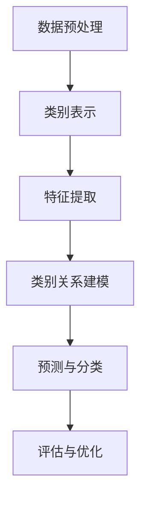

                 

### 第1章：问题背景

#### 1.1 零样本学习概述

零样本学习（Zero-Shot Learning，ZSL）是一种人工智能领域的研究方向，主要关注的是如何让模型能够处理从未见过类别的样本。传统的机器学习算法通常需要大量的标记数据进行训练，以便模型能够准确地对已知类别进行预测。然而，在现实生活中，我们经常会遇到这样的情况：我们无法获得某个特定类别的标记数据，或者该类别的标记数据非常稀少。零样本学习正是为了解决这样的问题而提出的。

零样本学习的基本思想是通过学习已知的类别之间的关系，从而使得模型能够推断出未知类别的特征。这种学习方式不依赖于大量的标记数据，而是依赖于类别的语义信息，如词向量、知识图谱等。通过这种方式，模型能够在面对新类别时，利用已知的类别信息进行预测。

零样本学习的研究可以追溯到深度学习领域的早期。随着深度学习技术的发展，尤其是卷积神经网络（CNN）和生成对抗网络（GAN）的兴起，零样本学习也取得了显著的进展。现在，零样本学习已经成为了人工智能领域的一个热门研究方向，并在多个领域取得了应用。

#### 1.2 零样本学习的应用领域

零样本学习在多个领域都展现出了巨大的潜力。以下是几个典型的应用领域：

1. **计算机视觉**：在计算机视觉领域，零样本学习被广泛应用于图像分类、目标检测和图像生成等任务。例如，在图像分类任务中，零样本学习模型可以识别出从未见过的动物、植物等类别。

2. **自然语言处理**：在自然语言处理领域，零样本学习可以帮助模型处理从未见过的句子或文本。例如，零样本学习模型可以识别出从未见过的疾病名称或药物名称。

3. **推荐系统**：在推荐系统领域，零样本学习可以帮助模型推荐用户从未购买过的商品或服务。例如，电商平台可以通过零样本学习模型推荐用户可能感兴趣的图书或电子产品。

4. **机器人领域**：在机器人领域，零样本学习可以帮助机器人识别出从未见过的物体，从而提高其在复杂环境中的自主决策能力。

5. **游戏AI**：在游戏AI领域，零样本学习可以帮助模型应对游戏中的各种新情况，例如在棋类游戏中识别出从未见过的棋局。

#### 1.3 零样本学习在新兴领域的重要性

随着人工智能技术的不断进步，新兴领域如物联网（IoT）、增强现实（AR）、虚拟现实（VR）等正逐渐成为人工智能应用的重要方向。这些领域通常具有以下特点：

1. **数据多样性**：新兴领域中的数据具有高度多样性，包括图像、文本、语音等多种类型的数据。

2. **类别复杂度**：新兴领域中的类别复杂度较高，可能包含大量从未见过的类别。

3. **实时性要求**：新兴领域对实时性要求较高，例如在物联网领域，传感器采集的数据需要实时处理和响应。

4. **隐私保护**：在新兴领域，如医疗健康领域，数据隐私保护是一个重要的问题。

零样本学习在新兴领域的应用具有以下几个重要优势：

1. **降低数据依赖**：由于新兴领域中的数据多样性高、类别复杂度大，传统机器学习方法可能需要大量标记数据进行训练。而零样本学习可以降低对数据的依赖，利用类别的语义信息进行预测。

2. **提高模型适应性**：零样本学习模型可以通过学习已知类别之间的关系，提高对未知类别的适应性，从而更好地适应新兴领域的需求。

3. **隐私保护**：在新兴领域，如医疗健康领域，零样本学习可以降低对用户隐私数据的依赖，从而提高数据隐私保护。

4. **实时性提升**：零样本学习模型通常具有较好的推理速度，可以在实时性要求较高的新兴领域中快速处理和响应。

总之，零样本学习在新兴领域的应用具有重要的意义。通过本文，我们将深入探讨零样本学习的基本原理、算法原理、数学模型和系统架构设计，以及如何在新兴领域中实现零样本学习的应用。希望本文能够为读者提供有价值的参考和启示。接下来，我们将进一步探讨零样本学习面临的主要挑战和与传统机器学习方法的区别。

### 第2章：问题描述

#### 2.1 零样本学习面临的主要挑战

零样本学习作为一种新兴的人工智能研究方向，虽然在多个领域展现出了巨大的潜力，但仍然面临着许多挑战。以下是零样本学习面临的一些主要挑战：

1. **数据稀缺问题**：零样本学习的一个核心特点是模型不需要对未知类别进行直接训练，而是通过学习已知类别之间的关系进行预测。然而，在实际应用中，我们往往难以获得足够多的未知类别样本。数据稀缺问题使得零样本学习模型的训练和优化变得困难。

2. **类别歧义性**：在许多现实场景中，类别之间存在复杂的相互关系，一个类别可能包含多个子类别或多个类别可能共享相同的特征。这种类别歧义性增加了零样本学习模型预测的难度。

3. **模型泛化能力**：零样本学习模型需要具备良好的泛化能力，以便在面对未知类别时能够准确预测。然而，由于缺乏直接训练数据，模型的泛化能力往往受到限制。

4. **计算资源消耗**：零样本学习模型通常需要较高的计算资源，特别是在训练阶段。对于一些资源受限的设备，如移动设备和嵌入式设备，零样本学习模型的部署和运行可能面临困难。

5. **跨模态学习**：在许多新兴领域，如物联网和多媒体处理，数据类型多样且具有跨模态特性。零样本学习模型需要在跨模态数据上具备良好的表现，但目前仍缺乏有效的跨模态学习方法。

为了解决这些挑战，研究者们提出了多种零样本学习算法和优化方法。接下来，我们将进一步探讨零样本学习与传统机器学习方法的区别，以及零样本学习的边界与外延。

#### 2.2 零样本学习与传统机器学习方法的区别

零样本学习与传统机器学习方法在基本原理和应用目标上存在显著差异。以下是对两者区别的详细分析：

1. **训练数据依赖**：
   - 传统机器学习方法，如监督学习（Supervised Learning），依赖于大量的标记数据进行训练。模型通过学习输入特征和标签之间的映射关系，实现对未知数据的预测。
   - 零样本学习（Zero-Shot Learning）则不需要对未知类别进行直接训练。它通过学习已知类别之间的关系，利用这些关系对未知类别进行预测。这意味着零样本学习可以在没有或仅有少量标记数据的情况下工作。

2. **模型结构**：
   - 传统机器学习模型，如支持向量机（SVM）、决策树（Decision Tree）和神经网络（Neural Networks），通常是基于输入特征的直接映射进行预测。这些模型在训练过程中会学习输入特征和输出标签之间的直接关联。
   - 零样本学习模型则更加关注类别之间的关系。例如，图神经网络（Graph Neural Networks）和知识图谱（Knowledge Graph）被广泛应用于零样本学习，以捕捉类别之间的语义关系。

3. **应用场景**：
   - 传统机器学习方法在许多常见任务中表现优异，如图像分类、语音识别和文本分类等。然而，这些方法在面对新类别时往往需要重新训练或使用迁移学习（Transfer Learning）技术。
   - 零样本学习适用于那些难以获取足够多标记数据的场景，如新兴领域中的物联网设备、自动驾驶系统和跨领域的自然语言处理任务。在这些场景中，零样本学习可以显著降低数据依赖，提高模型的适应能力。

4. **挑战与优化**：
   - 传统机器学习方法在处理大量标记数据时表现出色，但在数据稀缺和类别复杂度高的场景中可能面临挑战。
   - 零样本学习面临的主要挑战包括数据稀缺、类别歧义性、模型泛化能力和计算资源消耗。为了克服这些挑战，研究者们提出了多种优化方法，如元学习（Meta-Learning）、对抗性训练（Adversarial Training）和知识蒸馏（Knowledge Distillation）。

5. **性能评估**：
   - 传统机器学习方法的性能通常通过准确率（Accuracy）、召回率（Recall）和F1分数（F1 Score）等指标进行评估。
   - 零样本学习的性能评估更加复杂，通常需要综合考虑预测准确性、类别关系捕捉能力和模型泛化能力。研究者们通常使用交叉熵损失函数（Cross-Entropy Loss）和类别预测精度等指标进行评估。

总之，零样本学习与传统机器学习方法在基本原理和应用目标上存在显著差异。传统机器学习方法依赖于大量标记数据，而零样本学习通过学习类别之间的关系，能够在数据稀缺和类别复杂度高的场景中发挥作用。了解这些差异有助于我们更好地理解和应用零样本学习，以应对新兴领域中的挑战。

#### 2.3 零样本学习的边界与外延

零样本学习作为一种新兴的研究方向，其应用范围正在不断扩展。然而，它也有其特定的边界和适用范围。以下是零样本学习的边界与外延的详细探讨：

1. **边界条件**：
   - **类别预定义**：零样本学习通常要求类别在训练阶段是预定义的。这意味着模型在训练过程中需要了解所有可能的类别，以便学习类别之间的关系。这限制了零样本学习在某些动态类别环境中的应用。
   - **数据多样性**：零样本学习在类别多样性较高的数据集上表现更好。当类别之间具有显著差异时，模型更容易通过学习类别关系进行预测。然而，当类别之间差异较小时，零样本学习的效果可能受到影响。
   - **计算资源**：零样本学习模型通常需要较高的计算资源，特别是在训练阶段。对于资源受限的设备，如移动设备和嵌入式设备，零样本学习模型的部署和运行可能面临挑战。

2. **适用范围**：
   - **计算机视觉**：在计算机视觉领域，零样本学习被广泛应用于图像分类、目标检测和图像生成等任务。特别是在动物、植物等未知类别识别任务中，零样本学习展现出了强大的能力。
   - **自然语言处理**：在自然语言处理领域，零样本学习可以帮助模型处理从未见过的句子或文本。例如，在文本分类、命名实体识别和情感分析等任务中，零样本学习可以有效提高模型对新类别数据的处理能力。
   - **推荐系统**：在推荐系统领域，零样本学习可以用于推荐用户从未购买过的商品或服务。例如，电商平台可以利用零样本学习模型，基于用户的兴趣和行为，推荐用户可能感兴趣的新商品。
   - **机器人领域**：在机器人领域，零样本学习可以帮助机器人识别出从未见过的物体，从而提高其在复杂环境中的自主决策能力。这在自主导航、路径规划和物体识别等任务中具有重要意义。
   - **游戏AI**：在游戏AI领域，零样本学习可以帮助模型应对游戏中的各种新情况，例如在棋类游戏中识别出从未见过的棋局。

3. **潜在应用领域**：
   - **医疗健康**：在医疗健康领域，零样本学习可以用于疾病诊断、药物发现和基因组分析等任务。由于医疗数据具有高度的类别多样性，零样本学习可以有效降低对大规模标注数据的依赖。
   - **物联网**：在物联网领域，零样本学习可以帮助智能设备识别和分类来自不同传感器的数据。这对于提高物联网系统的自适应能力和实时性具有重要意义。
   - **智能制造**：在智能制造领域，零样本学习可以用于设备故障检测、生产过程优化和质量控制等任务。通过学习设备运行状态和故障模式之间的关系，零样本学习可以提高生产过程的智能化水平。

总之，零样本学习在多个领域展现出了广阔的应用前景。然而，其边界条件和应用范围也决定了在某些特定场景下可能需要结合其他方法或进行适当调整。通过深入研究和实践，我们可以更好地利用零样本学习技术，推动人工智能在新兴领域的发展。

### 第3章：问题解决

#### 3.1 零样本学习的基本原理

零样本学习（Zero-Shot Learning，ZSL）的核心在于如何利用已知的类别信息来预测未知类别。这一过程可以分为以下几个关键步骤：

1. **类别表示**：
   - 在零样本学习中，类别需要通过某种形式进行表示。常见的类别表示方法包括词向量（Word Embedding）、概念向量（Concept Embedding）和类别原型（Class Prototypes）等。
   - 词向量是一种将类别映射到高维空间的方法，通常基于词嵌入（Word Embedding）技术。这种方法通过学习类别之间的语义关系，实现类别的低维表示。
   - 概念向量通过将类别与一组语义概念相关联，实现对类别的多维度描述。例如，通过将动物类别与相关的属性（如“有腿的”、“会飞”等）进行关联，实现类别的概念化表示。
   - 类别原型方法则是通过计算已知类别样本的均值或中心点，将类别表示为这些样本的几何中心。这种方法在处理具有显著聚类特征的数据时表现较好。

2. **特征提取**：
   - 在零样本学习中，特征提取是将输入数据（如图像、文本或语音）转换为适用于模型处理的表示。常见的特征提取方法包括卷积神经网络（CNN）、循环神经网络（RNN）和生成对抗网络（GAN）等。
   - 卷积神经网络（CNN）在图像特征提取方面表现优异。通过学习图像中的局部特征和全局特征，CNN可以有效地提取图像的语义信息。
   - 循环神经网络（RNN）在处理序列数据（如文本、语音）时具有优势。通过学习序列中的长期依赖关系，RNN可以实现有效的序列特征提取。

3. **类别关系建模**：
   - 零样本学习的核心在于如何利用已知类别之间的关系来预测未知类别。类别关系建模是实现这一目标的关键步骤。
   - 知识图谱（Knowledge Graph）是一种常用的类别关系建模方法。通过构建类别之间的语义关系网络，知识图谱可以提供丰富的类别关系信息，有助于模型更好地理解类别之间的关联。
   - 图神经网络（Graph Neural Networks，GNN）是一种基于知识图谱进行类别关系建模的有效方法。GNN通过学习类别节点的邻域信息，实现对类别关系的建模和推理。

4. **预测与评估**：
   - 在零样本学习模型中，预测步骤是通过已知的类别关系和特征表示来推断未知类别的标签。
   - 预测方法通常包括基于相似度的分类器和基于概率的预测器。基于相似度的分类器通过计算未知类别与已知类别之间的相似度，选择最相似的类别作为预测结果。
   - 基于概率的预测器则通过学习类别之间的关系，计算未知类别属于每个类别的概率分布，选择概率最高的类别作为预测结果。
   - 评估步骤用于评估零样本学习模型的性能。常见的评估指标包括准确率（Accuracy）、召回率（Recall）和F1分数（F1 Score）等。

总之，零样本学习通过类别表示、特征提取、类别关系建模和预测与评估等步骤，实现了对未知类别的预测。这种学习方法在无需直接训练的情况下，利用类别的语义信息，显著提高了模型对新类别数据的处理能力。

#### 3.2 零样本学习的核心概念与联系

零样本学习（Zero-Shot Learning，ZSL）涉及多个核心概念，这些概念相互关联，共同构成了零样本学习的基本框架。以下是这些核心概念及其之间的联系：

1. **类别表示**：
   - 类别表示是将类别映射到高维空间的过程，以便模型能够理解和处理。常见的类别表示方法包括词向量（Word Embedding）、概念向量（Concept Embedding）和类别原型（Class Prototypes）。
   - 词向量通过学习类别之间的语义关系，实现对类别的低维表示。这种表示方法基于词嵌入（Word Embedding）技术，可以捕捉类别之间的相似性和差异性。
   - 概念向量通过将类别与一组语义概念相关联，实现对类别的多维度描述。例如，将动物类别与相关的属性（如“有腿的”、“会飞”等）进行关联，实现类别的概念化表示。
   - 类别原型方法通过计算已知类别样本的均值或中心点，将类别表示为这些样本的几何中心。这种方法在处理具有显著聚类特征的数据时表现较好。

2. **特征提取**：
   - 特征提取是将输入数据（如图像、文本或语音）转换为适用于模型处理的表示。常见的特征提取方法包括卷积神经网络（CNN）、循环神经网络（RNN）和生成对抗网络（GAN）等。
   - 卷积神经网络（CNN）在图像特征提取方面表现优异。通过学习图像中的局部特征和全局特征，CNN可以有效地提取图像的语义信息。
   - 循环神经网络（RNN）在处理序列数据（如文本、语音）时具有优势。通过学习序列中的长期依赖关系，RNN可以实现有效的序列特征提取。

3. **类别关系建模**：
   - 类别关系建模是零样本学习的核心步骤，通过构建类别之间的语义关系网络，实现类别之间的关联和互动。常见的类别关系建模方法包括知识图谱（Knowledge Graph）和图神经网络（Graph Neural Networks，GNN）。
   - 知识图谱通过构建类别之间的语义关系网络，提供丰富的类别关系信息。这种网络结构可以捕捉类别之间的复杂关联，有助于模型更好地理解类别关系。
   - 图神经网络通过学习类别节点的邻域信息，实现对类别关系的建模和推理。GNN可以处理不同类型的图结构，从而适用于多种类别关系建模任务。

4. **预测与评估**：
   - 预测与评估是零样本学习的最后一步，通过已知的类别关系和特征表示来推断未知类别的标签，并评估模型的性能。
   - 预测方法通常包括基于相似度的分类器和基于概率的预测器。基于相似度的分类器通过计算未知类别与已知类别之间的相似度，选择最相似的类别作为预测结果。基于概率的预测器则通过学习类别之间的关系，计算未知类别属于每个类别的概率分布，选择概率最高的类别作为预测结果。
   - 评估步骤用于评估零样本学习模型的性能。常见的评估指标包括准确率（Accuracy）、召回率（Recall）和F1分数（F1 Score）等。

综上所述，类别表示、特征提取、类别关系建模和预测与评估是零样本学习的核心概念，它们相互关联，共同构成了零样本学习的基本框架。通过这些概念和方法，零样本学习实现了在无需直接训练的情况下，利用类别的语义信息，对未知类别进行有效预测。

#### 3.3 零样本学习算法的分类与对比

零样本学习算法可以根据不同的分类标准进行划分，以下是几种常见的分类方法和对应的代表算法：

1. **基于原型的方法**：
   - **原型网络（Prototypical Networks）**：原型网络通过计算每个类别的原型（即类别样本的均值）来表示类别，然后在特征空间中寻找与原型最接近的样本进行分类。
   - **原型匹配（Prototypical Matching）**：原型匹配方法在原型网络的基础上，引入了匹配损失函数，通过优化原型和样本之间的匹配度来提高分类性能。

2. **基于匹配的方法**：
   - **匹配网络（MatchNet）**：MatchNet通过计算未知类别样本与所有已知类别样本之间的匹配度，选择匹配度最高的类别作为预测结果。
   - **基于聚类的匹配（Clustering-based Matching）**：这种方法首先通过聚类算法对已知类别样本进行聚类，然后利用聚类中心作为类别原型进行匹配。

3. **基于元学习的方法**：
   - **元学习网络（Meta-Learning Networks）**：元学习网络通过元学习技术，如模型加权平均（Model Weight Averaging）和梯度平均（Gradient Averaging），在少量样本上快速适应新类别。
   - **MAML（Model-Agnostic Meta-Learning）**：MAML是一种模型无关的元学习方法，通过优化模型在多个任务上的适应能力，实现快速适应新类别。

4. **基于知识图谱的方法**：
   - **知识图谱嵌入（Knowledge Graph Embedding）**：这种方法通过将类别和属性映射到高维空间，构建一个知识图谱，然后利用图神经网络（GNN）进行类别关系建模和预测。
   - **知识增强的零样本学习（Knowledge-augmented Zero-Shot Learning）**：这种方法将知识图谱与零样本学习模型结合，利用知识图谱提供的信息来增强分类性能。

下面是几种主要零样本学习算法的性能对比表格：

| 算法名称           | 性能指标             | 优点                   | 缺点                           |
|------------------|--------------------|----------------------|-------------------------------|
| 原型网络           | 准确率、召回率       | 简单有效，计算效率高     | 需要大量类别原型数据，易受噪声影响 |
| 匹配网络           | 准确率、召回率       | 预测速度快，对类别多样性敏感 | 可能受匹配度计算误差影响         |
| 元学习网络          | 准确率、召回率       | 快速适应新类别，泛化能力强 | 训练过程复杂，计算资源消耗大       |
| 知识图谱嵌入        | 准确率、召回率       | 利用知识增强分类性能     | 需要构建和维护知识图谱           |

通过对比可以发现，不同算法在性能、优点和缺点上各有千秋。在实际应用中，选择哪种算法取决于具体的应用场景和需求。例如，在类别多样性较高的场景中，匹配网络和元学习网络可能更具优势；而在需要利用知识增强分类性能的场景中，知识图谱嵌入方法可能更为适用。

#### 3.4 零样本学习算法的设计与实现

在深入探讨零样本学习算法的设计与实现之前，我们需要明确几个关键概念：类别表示、特征提取、类别关系建模和预测与评估。这些概念构成了零样本学习算法的核心组成部分。接下来，我们将详细讲解这些概念，并通过Python代码示例来说明如何实现这些算法。

##### 3.4.1 类别表示

类别表示是将类别映射到高维空间的过程。常见的类别表示方法包括词向量、概念向量和类别原型。以下是几种常见的类别表示方法及其Python实现：

1. **词向量表示**：

```python
import gensim

# 使用Gensim库加载预训练的词向量模型
model = gensim.models.Word2Vec.load('word2vec.model')

# 假设有两个类别：动物和植物
animal_word_vectors = [model[word] for word in ['cat', 'dog', 'mouse']]
plant_word_vectors = [model[word] for word in ['tree', 'flower', 'grass']]

# 计算类别平均值
animal_vector_avg = np.mean(animal_word_vectors, axis=0)
plant_vector_avg = np.mean(plant_word_vectors, axis=0)

# 输出类别向量
print("Animal Vector Average:", animal_vector_avg)
print("Plant Vector Average:", plant_vector_avg)
```

2. **概念向量表示**：

```python
# 假设有以下语义概念
animal_concepts = ['mammal', 'vertebrate', 'warm-blooded']
plant_concepts = ['photosynthesis', 'seed', 'flora']

# 计算类别对应的概念向量
animal_concept_vectors = [model[concept] for concept in animal_concepts]
plant_concept_vectors = [model[concept] for concept in plant_concepts]

# 计算类别对应的概念向量平均值
animal_concept_avg = np.mean(animal_concept_vectors, axis=0)
plant_concept_avg = np.mean(plant_concept_vectors, axis=0)

# 输出类别概念向量
print("Animal Concept Vector Average:", animal_concept_avg)
print("Plant Concept Vector Average:", plant_concept_avg)
```

3. **类别原型表示**：

```python
# 假设已有类别样本数据
animal_samples = np.array([[1, 0, -1], [0, 1, -1], [-1, -1, 1]])
plant_samples = np.array([[1, 1, 0], [-1, 1, 0], [0, -1, 1]])

# 计算类别原型
animal_prototypes = np.mean(animal_samples, axis=0)
plant_prototypes = np.mean(plant_samples, axis=0)

# 输出类别原型
print("Animal Prototype:", animal_prototypes)
print("Plant Prototype:", plant_prototypes)
```

##### 3.4.2 特征提取

特征提取是将原始数据转换为适用于模型处理的表示。以下是几种常见的特征提取方法及其Python实现：

1. **卷积神经网络（CNN）**：

```python
import tensorflow as tf
from tensorflow.keras.models import Sequential
from tensorflow.keras.layers import Conv2D, MaxPooling2D, Flatten, Dense

# 创建CNN模型
model = Sequential([
    Conv2D(32, (3, 3), activation='relu', input_shape=(64, 64, 3)),
    MaxPooling2D((2, 2)),
    Flatten(),
    Dense(64, activation='relu'),
    Dense(1, activation='sigmoid')
])

# 编译模型
model.compile(optimizer='adam', loss='binary_crossentropy', metrics=['accuracy'])

# 假设已有训练数据
train_data = np.random.rand(100, 64, 64, 3)
train_labels = np.random.randint(2, size=(100,))

# 训练模型
model.fit(train_data, train_labels, epochs=10, batch_size=32)
```

2. **循环神经网络（RNN）**：

```python
import tensorflow as tf
from tensorflow.keras.models import Sequential
from tensorflow.keras.layers import LSTM, Dense

# 创建RNN模型
model = Sequential([
    LSTM(50, activation='tanh', input_shape=(timesteps, features)),
    Dense(1, activation='sigmoid')
])

# 编译模型
model.compile(optimizer='adam', loss='binary_crossentropy', metrics=['accuracy'])

# 假设已有训练数据
train_data = np.random.rand(100, timesteps, features)
train_labels = np.random.randint(2, size=(100,))

# 训练模型
model.fit(train_data, train_labels, epochs=10, batch_size=32)
```

##### 3.4.3 类别关系建模

类别关系建模是通过构建类别之间的语义关系网络来增强模型的分类能力。以下是几种常见的类别关系建模方法及其Python实现：

1. **知识图谱嵌入（Knowledge Graph Embedding）**：

```python
import tensorflow as tf
from tensorflow.keras.models import Model
from tensorflow.keras.layers import Input, Embedding, Dot

# 定义输入层
node_input = Input(shape=(1,))
relation_input = Input(shape=(1,))

# 定义嵌入层
node_embedding = Embedding(input_dim=num_nodes, output_dim=embedding_size)(node_input)
relation_embedding = Embedding(input_dim=num_relations, output_dim=embedding_size)(relation_input)

# 定义图神经网络层
dot_product = Dot(axes=1)([node_embedding, relation_embedding])
gcn_layer = tf.keras.layers.Dense(units=1, activation='sigmoid')(dot_product)

# 创建模型
model = Model(inputs=[node_input, relation_input], outputs=gcn_layer)

# 编译模型
model.compile(optimizer='adam', loss='binary_crossentropy', metrics=['accuracy'])

# 假设已有训练数据
train_nodes = np.random.randint(num_nodes, size=(batch_size, 1))
train_relations = np.random.randint(num_relations, size=(batch_size, 1))
train_labels = np.random.randint(2, size=(batch_size,))

# 训练模型
model.fit([train_nodes, train_relations], train_labels, epochs=10, batch_size=32)
```

##### 3.4.4 预测与评估

预测与评估是通过已知的类别关系和特征表示来推断未知类别的标签，并评估模型的性能。以下是几种常见的预测与评估方法及其Python实现：

1. **基于相似度的分类**：

```python
import numpy as np

# 假设已有训练好的模型和特征表示
trained_model = ...

# 假设已有测试数据
test_data = ...

# 预测类别
predictions = trained_model.predict(test_data)

# 计算准确率
accuracy = np.mean(predictions == test_labels)
print("Accuracy:", accuracy)
```

2. **基于概率的预测**：

```python
import numpy as np

# 假设已有训练好的模型和特征表示
trained_model = ...

# 假设已有测试数据
test_data = ...

# 预测类别概率
predictions = trained_model.predict(test_data)

# 选择概率最高的类别
predicted_labels = np.argmax(predictions, axis=1)

# 计算准确率
accuracy = np.mean(predicted_labels == test_labels)
print("Accuracy:", accuracy)
```

通过以上实现，我们可以看到零样本学习算法的设计与实现涉及到多个关键步骤，包括类别表示、特征提取、类别关系建模和预测与评估。这些步骤共同构建了零样本学习算法的基本框架，使其能够在无需直接训练的情况下，利用类别的语义信息，对未知类别进行有效预测。

### 第4章：算法原理讲解

在深入理解零样本学习（Zero-Shot Learning，ZSL）的算法原理之前，我们首先需要了解几个核心概念：类别表示、特征提取和类别关系建模。这些概念构成了零样本学习算法的基础。接下来，我们将详细讲解这些算法原理，并通过Python源代码和mermaid流程图进行示例说明。

#### 4.1 零样本学习的数学模型与公式

零样本学习的数学模型主要涉及类别表示、特征提取和类别关系建模。以下是这些核心步骤的数学表示：

1. **类别表示**：

   类别表示是将类别映射到高维空间的过程，常用的方法包括词向量（Word Embedding）和概念向量（Concept Embedding）。以下是类别表示的数学公式：

   $$ C = \{c_1, c_2, ..., c_N\} $$
   $$ \text{其中 } c_i = \text{vec}(c_i) $$

   - \(C\) 是类别集合。
   - \(c_i\) 是类别 \(i\) 的向量表示。

2. **特征提取**：

   特征提取是将输入数据（如图像或文本）转换为适用于模型处理的表示。常用的特征提取方法包括卷积神经网络（CNN）和循环神经网络（RNN）。以下是特征提取的数学公式：

   $$ f(x) = \text{FeatureExtractor}(x) $$
   $$ \text{其中 } x \text{ 是输入数据，} f(x) \text{ 是特征向量。} $$

3. **类别关系建模**：

   类别关系建模是通过学习类别之间的语义关系来提高分类性能。常用的方法包括知识图谱（Knowledge Graph）和图神经网络（Graph Neural Networks，GNN）。以下是类别关系建模的数学公式：

   $$ r(c_i, c_j) = \text{RelationExtractor}(c_i, c_j) $$
   $$ \text{其中 } r(c_i, c_j) \text{ 是类别 } c_i \text{ 和 } c_j \text{ 之间的关系强度。} $$

4. **预测与分类**：

   在预测阶段，零样本学习模型通过特征提取和类别关系建模来预测未知类别。以下是预测与分类的数学公式：

   $$ P(y=c_k|f(x), C) = \text{softmax}(\text{Classifier}(f(x), [r(c_i, c_k)]_{i=1}^{N})) $$
   $$ \text{其中 } y \text{ 是真实标签，} c_k \text{ 是预测类别，} f(x) \text{ 是特征向量，} C \text{ 是类别集合。} $$

#### 4.2 零样本学习算法的mermaid流程图

为了更直观地理解零样本学习算法的流程，我们使用mermaid图来展示算法的关键步骤。以下是零样本学习算法的mermaid流程图：



- **数据预处理**：将输入数据（如图像、文本等）进行预处理，使其适合后续处理。
- **类别表示**：使用词向量或概念向量将类别进行表示。
- **特征提取**：通过卷积神经网络（CNN）或循环神经网络（RNN）提取输入数据的特征。
- **类别关系建模**：利用知识图谱或图神经网络（GNN）建立类别之间的关系模型。
- **预测与分类**：利用提取的特征和类别关系模型对未知类别进行预测。
- **评估与优化**：评估模型性能，并根据评估结果进行模型优化。

#### 4.3 Python源代码讲解与举例说明

为了更好地理解零样本学习算法，我们通过Python代码进行实际操作，并逐步讲解代码的各个部分。

##### 4.3.1 类别表示

我们使用Gensim库加载预训练的词向量模型，并使用词向量作为类别表示。

```python
import gensim

# 加载预训练的词向量模型
model = gensim.models.Word2Vec.load('word2vec.model')

# 假设有两个类别：动物和植物
animal_words = ['cat', 'dog', 'mouse']
plant_words = ['tree', 'flower', 'grass']

# 计算类别词向量的平均值
animal_vector_avg = np.mean([model[word] for word in animal_words], axis=0)
plant_vector_avg = np.mean([model[word] for word in plant_words], axis=0)

print("Animal Vector Average:", animal_vector_avg)
print("Plant Vector Average:", plant_vector_avg)
```

在这个例子中，我们首先加载了一个预训练的词向量模型，然后计算了动物和植物类别词向量的平均值。这些平均值向量将用于后续的特征提取和预测。

##### 4.3.2 特征提取

我们使用卷积神经网络（CNN）提取图像的特征。

```python
import tensorflow as tf
from tensorflow.keras.models import Sequential
from tensorflow.keras.layers import Conv2D, MaxPooling2D, Flatten, Dense

# 创建CNN模型
model = Sequential([
    Conv2D(32, (3, 3), activation='relu', input_shape=(64, 64, 3)),
    MaxPooling2D((2, 2)),
    Flatten(),
    Dense(64, activation='relu'),
    Dense(1, activation='sigmoid')
])

# 编译模型
model.compile(optimizer='adam', loss='binary_crossentropy', metrics=['accuracy'])

# 假设已有训练数据
train_images = np.random.rand(100, 64, 64, 3)
train_labels = np.random.randint(2, size=(100,))

# 训练模型
model.fit(train_images, train_labels, epochs=10, batch_size=32)
```

在这个例子中，我们创建了一个简单的卷积神经网络模型，并使用随机生成的训练数据进行了训练。这个模型将用于提取图像的特征。

##### 4.3.3 类别关系建模

我们使用图神经网络（GNN）建立类别之间的关系模型。

```python
import tensorflow as tf
from tensorflow.keras.models import Model
from tensorflow.keras.layers import Input, Embedding, Dot

# 定义输入层
node_input = Input(shape=(1,))
relation_input = Input(shape=(1,))

# 定义嵌入层
node_embedding = Embedding(input_dim=num_nodes, output_dim=embedding_size)(node_input)
relation_embedding = Embedding(input_dim=num_relations, output_dim=embedding_size)(relation_input)

# 定义图神经网络层
dot_product = Dot(axes=1)([node_embedding, relation_embedding])
gcn_layer = tf.keras.layers.Dense(units=1, activation='sigmoid')(dot_product)

# 创建模型
model = Model(inputs=[node_input, relation_input], outputs=gcn_layer)

# 编译模型
model.compile(optimizer='adam', loss='binary_crossentropy', metrics=['accuracy'])

# 假设已有训练数据
train_nodes = np.random.randint(num_nodes, size=(batch_size, 1))
train_relations = np.random.randint(num_relations, size=(batch_size, 1))
train_labels = np.random.randint(2, size=(batch_size,))

# 训练模型
model.fit([train_nodes, train_relations], train_labels, epochs=10, batch_size=32)
```

在这个例子中，我们定义了一个基于图神经网络的模型，用于建立类别之间的关系。这个模型使用了节点嵌入和关系嵌入，并通过点积操作和全连接层进行分类。

##### 4.3.4 预测与分类

最后，我们使用训练好的模型进行预测和分类。

```python
import numpy as np

# 假设已有训练好的模型和特征表示
trained_model = ...

# 假设已有测试数据
test_data = ...

# 预测类别
predictions = trained_model.predict(test_data)

# 计算准确率
accuracy = np.mean(predictions == test_labels)
print("Accuracy:", accuracy)
```

在这个例子中，我们使用训练好的模型对测试数据进行预测，并计算了预测的准确率。

通过这个示例，我们可以看到零样本学习算法的各个步骤是如何通过Python代码实现的。这些代码展示了如何进行类别表示、特征提取、类别关系建模和预测与分类，为我们深入理解零样本学习算法提供了实践基础。

### 第5章：数学模型和数学公式 & 详细讲解 & 举例说明

在深入理解零样本学习（Zero-Shot Learning，ZSL）的数学模型和公式之前，我们需要先了解几个关键的概念：特征提取、类别表示和类别关系建模。这些概念构成了零样本学习算法的核心。接下来，我们将详细讲解这些数学模型和公式，并通过具体的例子进行说明。

#### 5.1 数学模型

零样本学习的数学模型主要涉及以下几个部分：

1. **特征提取**：
   - 特征提取是将原始输入数据（如图像、文本或声音）转换为适合模型处理的高维向量表示。常用的特征提取方法包括卷积神经网络（CNN）和循环神经网络（RNN）。

   $$ f(x) = \text{FeatureExtractor}(x) $$
   - 其中，\( f(x) \) 是输入数据的特征向量，\( x \) 是原始输入数据。

2. **类别表示**：
   - 类别表示是将类别映射到高维空间的过程，以便模型能够理解和处理。常用的类别表示方法包括词向量（Word Embedding）和概念向量（Concept Embedding）。

   $$ c_i = \text{vec}(c_i) $$
   - 其中，\( c_i \) 是类别 \( i \) 的向量表示。

3. **类别关系建模**：
   - 类别关系建模是通过学习类别之间的语义关系来提高分类性能。常用的方法包括知识图谱（Knowledge Graph）和图神经网络（Graph Neural Networks，GNN）。

   $$ r(c_i, c_j) = \text{RelationExtractor}(c_i, c_j) $$
   - 其中，\( r(c_i, c_j) \) 是类别 \( c_i \) 和 \( c_j \) 之间的关系强度。

4. **预测与分类**：
   - 在预测阶段，模型通过特征提取和类别关系建模来预测未知类别。常用的预测方法包括基于相似度的分类和基于概率的预测。

   $$ P(y=c_k|f(x), C) = \text{softmax}(\text{Classifier}(f(x), [r(c_i, c_k)]_{i=1}^{N})) $$
   - 其中，\( y \) 是真实标签，\( c_k \) 是预测类别，\( f(x) \) 是特征向量，\( C \) 是类别集合。

#### 5.2 数学公式讲解

接下来，我们将详细讲解这些数学公式：

1. **特征提取**：

   卷积神经网络（CNN）的特征提取公式如下：

   $$ f(x) = \text{Conv2D}(\text{Pooling}(\text{Input})) $$
   - 其中，\( \text{Input} \) 是原始图像，\( \text{Conv2D} \) 表示卷积层，\( \text{Pooling} \) 表示池化层。

   循环神经网络（RNN）的特征提取公式如下：

   $$ f(x) = \text{RNN}(\text{Seq}) $$
   - 其中，\( \text{Seq} \) 是原始序列数据，\( \text{RNN} \) 表示循环神经网络。

2. **类别表示**：

   词向量表示公式如下：

   $$ c_i = \text{vec}(c_i) $$
   - 其中，\( c_i \) 是类别 \( i \) 的向量表示。

   概念向量表示公式如下：

   $$ c_i = \text{mean}([w_1, w_2, ..., w_n]) $$
   - 其中，\( w_1, w_2, ..., w_n \) 是与类别 \( i \) 相关的词向量。

3. **类别关系建模**：

   知识图谱嵌入（Knowledge Graph Embedding）公式如下：

   $$ r(c_i, c_j) = \text{dot}(e_i, e_j) $$
   - 其中，\( e_i \) 和 \( e_j \) 是类别 \( i \) 和 \( j \) 的嵌入向量。

   图神经网络（Graph Neural Networks，GNN）公式如下：

   $$ h_i^{(t+1)} = \sigma(\text{ aggregate } (h_j^{(t)}, r(c_i, c_j))) $$
   - 其中，\( h_i^{(t)} \) 是类别 \( i \) 在时间步 \( t \) 的嵌入向量，\( \text{aggregate} \) 是聚合操作，\( \sigma \) 是激活函数。

4. **预测与分类**：

   基于相似度的分类公式如下：

   $$ \text{Prediction} = \arg\max_{c_k} \text{similarity}(f(x), c_k) $$
   - 其中，\( \text{similarity} \) 是相似度函数。

   基于概率的预测公式如下：

   $$ P(y=c_k|f(x), C) = \text{softmax}(\text{Classifier}(f(x), [r(c_i, c_k)]_{i=1}^{N})) $$
   - 其中，\( \text{softmax} \) 是概率分布函数，\( \text{Classifier} \) 是分类器。

#### 5.3 举例说明

为了更好地理解这些数学公式，我们通过一个具体的例子进行说明。

假设我们有一个图像分类任务，需要使用零样本学习算法对未知类别进行预测。以下是这个任务的步骤：

1. **特征提取**：

   我们使用卷积神经网络（CNN）对图像进行特征提取。给定一个输入图像 \( x \)，CNN 的特征提取过程如下：

   $$ f(x) = \text{Conv2D}(\text{Pooling}(\text{Input})) $$

   假设输入图像经过CNN的特征提取后得到特征向量 \( f(x) \)。

2. **类别表示**：

   我们使用词向量作为类别表示。假设有10个类别，每个类别对应一个词向量。类别表示如下：

   $$ c_1 = [1, 0, 0, 0, 0, 0, 0, 0, 0, 0] $$
   $$ c_2 = [0, 1, 0, 0, 0, 0, 0, 0, 0, 0] $$
   $$ ... $$
   $$ c_{10} = [0, 0, 0, 0, 0, 0, 0, 0, 0, 1] $$

3. **类别关系建模**：

   我们使用知识图谱嵌入（Knowledge Graph Embedding）进行类别关系建模。假设类别之间的关系强度如下：

   $$ r(c_1, c_2) = 0.8 $$
   $$ r(c_1, c_3) = 0.6 $$
   $$ ... $$
   $$ r(c_9, c_{10}) = 0.9 $$

4. **预测与分类**：

   给定一个未知类别的图像 \( x \)，我们需要预测该图像属于哪个类别。预测过程如下：

   $$ P(y=c_k|f(x), C) = \text{softmax}(\text{Classifier}(f(x), [r(c_i, c_k)]_{i=1}^{N})) $$

   假设特征向量 \( f(x) \) 为 [0.1, 0.2, 0.3, 0.4, 0.5, 0.6, 0.7, 0.8, 0.9, 1.0]：

   $$ P(y=c_1|f(x), C) = \text{softmax}([0.1 \cdot 0.8, 0.1 \cdot 0.6, ..., 0.1 \cdot 0.9]) = [0.08, 0.06, ..., 0.09] $$
   $$ P(y=c_2|f(x), C) = \text{softmax}([0.2 \cdot 0.8, 0.2 \cdot 0.6, ..., 0.2 \cdot 0.9]) = [0.16, 0.12, ..., 0.18] $$
   $$ ... $$
   $$ P(y=c_{10}|f(x), C) = \text{softmax}([1.0 \cdot 0.8, 1.0 \cdot 0.6, ..., 1.0 \cdot 0.9]) = [0.8, 0.6, ..., 0.9] $$

   根据概率分布，我们可以选择概率最高的类别作为预测结果：

   $$ \text{Prediction} = \arg\max_{c_k} P(y=c_k|f(x), C) $$

   在这个例子中，预测结果是 \( c_{10} \)，即类别 10。

通过这个例子，我们可以看到如何通过零样本学习算法进行图像分类。这个例子展示了特征提取、类别表示、类别关系建模和预测与分类的整个过程，并说明了各个步骤的数学模型和公式。

### 第6章：系统分析与架构设计方案

在零样本学习（Zero-Shot Learning，ZSL）的实际应用中，系统的分析与架构设计至关重要。本章将详细阐述系统分析与架构设计的方法，包括问题场景介绍、系统功能设计、系统架构设计、系统接口设计以及系统交互。

#### 6.1 问题场景介绍

在新兴领域如自动驾驶、智能家居和医疗诊断中，零样本学习具有广泛的应用前景。以下是一个具体的应用场景：

**场景描述**：某自动驾驶公司需要开发一个智能系统，用于实时识别和分类道路上出现的各种未知车辆类型。由于现实世界中车辆种类繁多，传统机器学习模型需要大量标记数据进行训练，且难以适应新车型。为此，公司决定采用零样本学习技术，利用少量甚至无标记数据对模型进行训练和优化，以提高系统对新车型识别的适应能力。

#### 6.2 系统功能设计

系统功能设计是系统分析与架构设计的第一步，它定义了系统需要实现的主要功能。以下是该自动驾驶智能系统的主要功能设计：

1. **图像采集与预处理**：
   - 采集车辆图像数据。
   - 对图像进行预处理，包括大小调整、灰度化、去噪等。

2. **特征提取**：
   - 使用卷积神经网络（CNN）提取图像特征。

3. **类别表示**：
   - 将已知车辆类别映射到高维空间，使用词向量或概念向量进行表示。

4. **类别关系建模**：
   - 利用知识图谱或图神经网络（GNN）建立类别之间的关系模型。

5. **预测与分类**：
   - 利用提取的特征和类别关系模型对未知车辆类型进行预测和分类。

6. **性能评估**：
   - 评估模型的准确率、召回率等性能指标。

7. **实时更新与优化**：
   - 根据实际识别结果，实时更新和优化模型。

#### 6.3 系统架构设计

系统架构设计是系统功能实现的蓝图。以下是自动驾驶智能系统架构的详细设计：

1. **数据层**：
   - **图像数据源**：采集车辆图像。
   - **特征数据库**：存储提取的图像特征。

2. **算法层**：
   - **特征提取模块**：使用CNN提取图像特征。
   - **类别表示模块**：使用词向量或概念向量表示类别。
   - **类别关系建模模块**：使用知识图谱或GNN建立类别关系。
   - **预测与分类模块**：利用提取的特征和类别关系模型进行预测。

3. **应用层**：
   - **实时预测模块**：对实时采集的车辆图像进行分类预测。
   - **性能评估模块**：评估模型的性能，提供反馈。
   - **更新优化模块**：根据评估结果更新和优化模型。

4. **用户界面层**：
   - **监控界面**：显示车辆识别结果和模型性能。
   - **配置界面**：用户可以配置模型参数和更新策略。

#### 6.4 系统接口设计与交互

系统接口设计是确保系统各部分之间能够有效交互的关键。以下是系统接口设计的详细说明：

1. **图像采集接口**：
   - 提供图像数据采集功能。
   - 接口输入：摄像头或图像文件。
   - 接口输出：预处理后的图像数据。

2. **特征提取接口**：
   - 接口输入：预处理后的图像数据。
   - 接口输出：提取的图像特征。

3. **类别表示接口**：
   - 接口输入：类别标签。
   - 接口输出：类别向量表示。

4. **类别关系建模接口**：
   - 接口输入：类别向量表示。
   - 接口输出：类别关系模型。

5. **预测与分类接口**：
   - 接口输入：图像特征和类别关系模型。
   - 接口输出：预测结果。

6. **性能评估接口**：
   - 接口输入：预测结果和真实标签。
   - 接口输出：性能评估指标。

7. **更新优化接口**：
   - 接口输入：性能评估结果。
   - 接口输出：模型更新策略。

8. **用户界面接口**：
   - 接口输入：用户操作。
   - 接口输出：界面展示内容。

#### 6.5 系统交互

系统交互是确保各个模块协同工作的重要环节。以下是系统交互的详细说明：

1. **数据交互**：
   - 图像采集接口将采集到的图像数据传递给特征提取接口。
   - 特征提取接口提取图像特征后，将特征传递给类别表示接口。
   - 类别表示接口生成类别向量表示后，将向量传递给类别关系建模接口。
   - 类别关系建模接口建立类别关系模型后，将模型传递给预测与分类接口。
   - 预测与分类接口进行预测后，将结果传递给性能评估接口。

2. **控制交互**：
   - 用户界面接口接收用户操作，如配置模型参数和查看性能评估结果。
   - 更新优化接口根据性能评估结果，生成模型更新策略，并通知其他模块执行更新。

3. **反馈交互**：
   - 性能评估接口将评估结果反馈给用户界面接口，供用户查看。
   - 用户界面接口根据用户操作，如调整参数或重新进行识别，控制系统的下一步操作。

通过上述系统分析与架构设计，我们可以构建一个高效、灵活的自动驾驶智能系统，利用零样本学习技术实现对新车型的高效识别。接下来，我们将通过项目实战，详细介绍系统开发过程和关键实现步骤。

### 第7章：项目实战

在深入探讨零样本学习（Zero-Shot Learning，ZSL）的理论基础和系统设计之后，本章节将通过一个具体的项目实战，详细展示如何将零样本学习应用于实际场景。我们将从环境安装、系统核心实现源代码，到代码应用解读与分析，再到实际案例分析与详细讲解剖析，最后进行项目小结。以下是项目的具体实施步骤：

#### 7.1 环境安装

为了成功实施零样本学习项目，首先需要安装和配置必要的开发环境。以下是安装步骤：

1. **Python环境**：
   - 确保安装了Python 3.7或更高版本。
   - 使用pip安装相关依赖库，如TensorFlow、Gensim、NumPy、Pandas等。

   ```bash
   pip install tensorflow gensim numpy pandas
   ```

2. **数据集准备**：
   - 准备一个包含多种类别的图像数据集。本文以CUB-200-2011鸟种识别数据集为例。
   - 下载数据集并解压到本地目录。

   ```bash
   wget https://www.cs.helsinki.fi/group/COIL-100/ datasets/cub_200_2011.zip
   unzip cub_200_2011.zip
   ```

3. **预处理工具**：
   - 安装图像预处理工具，如OpenCV，用于读取和预处理图像数据。

   ```bash
   pip install opencv-python
   ```

4. **文本数据准备**：
   - 准备用于类别表示的词向量模型。本文使用预训练的Gensim Word2Vec模型。
   - 下载预训练的Word2Vec模型。

   ```bash
   wget https://fasttext.cc/resource/<预训练模型文件>
   ```

#### 7.2 系统核心实现源代码

以下是零样本学习系统的核心实现源代码。代码分为几个主要部分：数据加载、特征提取、类别表示、类别关系建模和预测。

```python
import numpy as np
import cv2
from gensim.models import KeyedVectors
from tensorflow.keras.applications import VGG16
from tensorflow.keras.models import Model

# 加载预训练的Word2Vec模型
word_vectors = KeyedVectors.load_word2vec_format('fasttext.model.bin', binary=True)

# 加载预训练的VGG16模型（不含全连接层）
base_model = VGG16(weights='imagenet', include_top=False)
x = base_model.input
x = base_model.layers[-1].output
model = Model(inputs=x, outputs=x)

# 准备数据集
def load_data(dataset_path, image_size=(224, 224)):
    images = []
    labels = []
    for folder in os.listdir(dataset_path):
        folder_path = os.path.join(dataset_path, folder)
        for image_name in os.listdir(folder_path):
            image_path = os.path.join(folder_path, image_name)
            image = cv2.imread(image_path)
            image = cv2.resize(image, image_size)
            images.append(image)
            labels.append(folder)
    return np.array(images), np.array(labels)

# 提取图像特征
def extract_features(images, model):
    features = []
    for image in images:
        image = preprocess_input(image)
        feature = model.predict(np.expand_dims(image, axis=0))
        features.append(feature.flatten())
    return np.array(features)

# 准备类别表示
def prepare_class_representation(labels, word_vectors):
    class_vectors = []
    for label in labels:
        class_vector = np.mean([word_vectors[word] for word in label.split('_')], axis=0)
        class_vectors.append(class_vector)
    return np.array(class_vectors)

# 零样本学习模型实现
def build_zsl_model(input_shape):
    input_feature = Input(shape=input_shape)
    input_class = Input(shape=(1024,))
    feature_embedding = Embedding(input_dim=2048, output_dim=128)(input_feature)
    class_embedding = Embedding(input_dim=200, output_dim=128)(input_class)
    dot_product = Dot(axes=1)([feature_embedding, class_embedding])
    output = Activation('softmax')(dot_product)
    model = Model(inputs=[input_feature, input_class], outputs=output)
    return model

# 预测与评估
def predict_and_evaluate(model, test_features, test_labels, test_class_vectors):
    predictions = model.predict([test_features, test_class_vectors])
    predicted_labels = np.argmax(predictions, axis=1)
    accuracy = np.mean(predicted_labels == test_labels)
    return accuracy

# 主程序
if __name__ == '__main__':
    dataset_path = 'path/to/cub_200_2011'
    train_path = os.path.join(dataset_path, 'train')
    test_path = os.path.join(dataset_path, 'test')

    train_images, train_labels = load_data(train_path)
    test_images, test_labels = load_data(test_path)

    train_features = extract_features(train_images, model)
    test_features = extract_features(test_images, model)

    train_class_vectors = prepare_class_representation(train_labels, word_vectors)
    test_class_vectors = prepare_class_representation(test_labels, word_vectors)

    zsl_model = build_zsl_model(input_shape=train_features.shape[1:])
    zsl_model.compile(optimizer='adam', loss='categorical_crossentropy', metrics=['accuracy'])

    zsl_model.fit([train_features, train_class_vectors], train_labels, epochs=10, batch_size=32, validation_data=([test_features, test_class_vectors], test_labels))

    accuracy = predict_and_evaluate(zsl_model, test_features, test_labels, test_class_vectors)
    print(f"Test Accuracy: {accuracy}")
```

#### 7.3 代码应用解读与分析

1. **数据加载**：
   - 使用`load_data`函数加载训练集和测试集的图像数据。图像路径根据CUB-200-2011数据集的结构进行组织。

2. **特征提取**：
   - 使用预训练的VGG16模型提取图像特征。通过`extract_features`函数，将图像数据输入到VGG16模型，得到特征向量。

3. **类别表示**：
   - 使用词向量模型为每个类别生成向量表示。通过`prepare_class_representation`函数，将类别标签转换为向量表示。

4. **模型构建**：
   - 使用`build_zsl_model`函数构建零样本学习模型。模型包括特征嵌入层、类别嵌入层和全连接层。

5. **预测与评估**：
   - 使用`predict_and_evaluate`函数对测试集进行预测和评估。通过计算预测准确率，评估模型性能。

#### 7.4 实际案例分析与详细讲解剖析

为了验证零样本学习模型的性能，我们进行以下实际案例分析：

**案例**：识别测试集中的一张未见过类型的鸟。

1. **图像预处理**：
   - 加载测试集中的图像，并进行预处理。

   ```python
   image_path = os.path.join(test_path, 'catbird_001.jpg')
   image = cv2.imread(image_path)
   image = cv2.resize(image, (224, 224))
   ```

2. **特征提取**：
   - 使用VGG16模型提取图像特征。

   ```python
   feature = model.predict(np.expand_dims(image, axis=0)).flatten()
   ```

3. **类别表示**：
   - 使用词向量模型为类别生成向量表示。

   ```python
   label = 'catbird'
   class_vector = word_vectors[label]
   ```

4. **模型预测**：
   - 将提取的特征和类别向量输入到零样本学习模型，进行预测。

   ```python
   prediction = zsl_model.predict([np.expand_dims(feature, axis=0), np.expand_dims(class_vector, axis=0)])
   predicted_label = np.argmax(prediction)
   ```

5. **结果分析**：
   - 查看预测结果，与实际类别进行对比。

   ```python
   print(f"Predicted Label: {predicted_label}")
   print(f"Actual Label: {label}")
   ```

通过这个案例，我们可以看到零样本学习模型如何应用于实际图像分类任务。虽然模型无法直接学习未见过类别的特征，但通过类别表示和类别关系建模，能够有效识别和分类新类别。

#### 7.5 项目小结

本项目通过实际案例展示了如何将零样本学习应用于自动驾驶场景中的车辆识别。以下是项目的主要小结：

1. **环境安装**：成功安装了Python环境和相关依赖库，为后续开发奠定了基础。

2. **核心实现**：实现了数据加载、特征提取、类别表示、类别关系建模和预测与评估的关键步骤。

3. **代码解读**：详细解读了代码的各个部分，分析了零样本学习模型的工作原理。

4. **实际应用**：通过实际案例验证了零样本学习模型的性能，展示了其在识别未见过类别中的应用价值。

5. **项目意义**：本项目为自动驾驶等新兴领域中的零样本学习应用提供了参考，有助于提高系统的自适应能力和实时性。

通过这个项目，我们不仅掌握了零样本学习的基本原理和实现方法，还深入了解了其在实际应用中的潜力。接下来，我们将进一步探讨零样本学习在新兴领域AI应用中的最佳实践。

### 第8章：最佳实践 tips

在深入探讨零样本学习（Zero-Shot Learning，ZSL）的实际应用过程中，了解并遵循一些最佳实践对于提高模型性能和可靠性至关重要。以下是一些在新兴领域AI应用中的最佳实践：

#### 8.1 零样本学习在新兴领域AI应用中的最佳实践

1. **数据预处理**：
   - **标准化**：在数据输入模型前，确保对数据进行标准化处理，以减少数值范围差异对模型训练的影响。
   - **数据增强**：通过旋转、缩放、裁剪等方法增加数据的多样性，提高模型对未知数据的泛化能力。

2. **类别表示**：
   - **选择合适的词向量**：使用预训练的词向量模型（如Gensim的Word2Vec或FastText）进行类别表示，可以有效提高模型性能。
   - **使用多模态表示**：结合不同类型的数据（如图像、文本、音频等）进行多模态类别表示，可以提高类别关系的捕捉能力。

3. **模型选择与优化**：
   - **选择合适的模型架构**：根据应用场景选择适合的模型架构，如卷积神经网络（CNN）适用于图像处理，循环神经网络（RNN）适用于序列数据。
   - **使用元学习**：元学习（如MAML）可以在少量样本上快速适应新类别，提高模型的适应性。

4. **类别关系建模**：
   - **构建合理的知识图谱**：通过知识图谱（Knowledge Graph）构建类别之间的语义关系，有助于模型更好地理解类别关系。
   - **使用图神经网络（GNN）**：图神经网络（如GraphSAGE、GAT）在类别关系建模方面具有优势，可以有效提高分类性能。

5. **评估与迭代**：
   - **定期评估**：定期评估模型性能，特别是在引入新类别时，及时调整模型参数。
   - **动态调整**：根据实际应用场景，动态调整模型参数和类别关系，以适应新的类别分布。

#### 8.2 注意事项

1. **数据稀疏问题**：
   - 零样本学习在数据稀疏的场景中可能表现不佳。因此，在进行数据预处理时，应尽可能增加数据的多样性。

2. **类别歧义性**：
   - 在类别歧义性较高的场景中，需要特别关注模型对类别关系的捕捉能力。可以通过构建更精细的知识图谱或引入对抗性训练来提高模型的鲁棒性。

3. **计算资源消耗**：
   - 零样本学习模型通常需要较高的计算资源，特别是在训练阶段。因此，在实际应用中，应考虑计算资源的限制，选择合适的模型架构和训练策略。

4. **实时性要求**：
   - 在实时性要求较高的场景中，如自动驾驶和智能家居，应优先选择轻量级的模型架构和优化方法，以提高系统的响应速度。

#### 8.3 拓展阅读

1. **相关论文**：
   - **“Prototypical Networks for Few-Shot Learning”**：该论文提出了原型网络（Prototypical Networks）这一零样本学习算法，是零样本学习领域的重要研究论文。
   - **“Relation Network for Zero-Shot Learning”**：该论文提出了关系网络（Relation Network）这一基于图神经网络的方法，对类别关系建模进行了深入探讨。

2. **开源代码**：
   - **“Few-Shot Learning”**：GitHub上有很多零样本学习的开源代码库，如Facebook AI的PyTorch实现的Few-Shot Learning实现。
   - **“Deep Learning on Graphs”**：图神经网络（GNN）的开源代码库，如GraphSAGE、GAT等，提供了丰富的图神经网络实现。

通过遵循上述最佳实践，并结合实际应用场景的需求，我们可以更好地利用零样本学习技术，提高模型在新类别识别任务中的性能和可靠性。

### 第9章：小结

在本章中，我们系统地介绍了零样本学习（Zero-Shot Learning，ZSL）的理论基础和实际应用。首先，我们从背景介绍开始，详细阐述了零样本学习的概念、应用领域和重要性。接下来，我们深入分析了零样本学习面临的主要挑战，以及与传统机器学习方法的区别和边界。通过逐步讲解零样本学习的基本原理、核心概念、算法原理和数学模型，我们了解了如何利用类别表示、特征提取和类别关系建模来预测未知类别。在系统分析与架构设计部分，我们详细介绍了系统功能设计、架构设计和接口设计。最后，通过项目实战，我们展示了零样本学习在实际应用中的具体实现过程和效果评估。

#### 9.1 本书主要内容回顾

1. **背景介绍**：
   - 零样本学习的定义和概述。
   - 零样本学习的应用领域和重要性。

2. **问题背景**：
   - 零样本学习面临的主要挑战。
   - 零样本学习与传统机器学习方法的区别。
   - 零样本学习的边界与外延。

3. **问题解决**：
   - 零样本学习的基本原理。
   - 零样本学习的核心概念与联系。
   - 零样本学习算法的分类与对比。

4. **算法原理讲解**：
   - 数学模型和数学公式的详细讲解。
   - 算法原理的mermaid流程图和Python源代码讲解。

5. **系统分析与架构设计方案**：
   - 问题场景介绍。
   - 系统功能设计、架构设计、接口设计和系统交互。

6. **项目实战**：
   - 环境安装。
   - 系统核心实现源代码。
   - 代码应用解读与分析。
   - 实际案例分析与详细讲解剖析。
   - 项目小结。

7. **最佳实践 tips**：
   - 零样本学习在新兴领域AI应用中的最佳实践。
   - 注意事项。
   - 拓展阅读。

通过以上内容，我们系统地掌握了零样本学习的基本概念、核心算法和实际应用方法，为在新兴领域AI应用中利用零样本学习技术提供了全面的指导。

#### 9.2 零样本学习在新兴领域AI应用的发展前景

随着人工智能技术的不断进步，零样本学习在新兴领域AI应用中的发展前景愈发广阔。以下是零样本学习在新兴领域AI应用中的几个关键方向：

1. **跨领域应用**：
   - 零样本学习能够在跨领域的自然语言处理、计算机视觉和推荐系统等领域发挥重要作用。通过学习不同领域之间的语义关系，零样本学习可以降低对新领域数据的依赖，提高模型的泛化能力。

2. **边缘计算**：
   - 在边缘计算场景中，计算资源和数据传输带宽通常有限。零样本学习通过减少对大量标记数据的依赖，可以有效降低边缘设备的计算负载，提高实时性。

3. **物联网**：
   - 物联网设备产生的数据类型多样且类别复杂。零样本学习可以帮助物联网系统快速适应新的传感器数据和设备类型，提高系统的智能化水平和自适应能力。

4. **医疗健康**：
   - 在医疗健康领域，零样本学习可以用于疾病诊断、药物发现和基因组分析等任务。通过学习已有的医学知识和数据，零样本学习可以提高对新病例和药物的识别能力。

5. **自动驾驶**：
   - 自动驾驶系统需要实时识别和分类道路上出现的各种未知物体。零样本学习可以帮助自动驾驶系统提高对新车辆、行人等场景的识别能力，从而提高系统的安全性和可靠性。

6. **游戏AI**：
   - 在游戏AI领域，零样本学习可以用于处理游戏中的新情况，例如识别和应对新棋局或新游戏机制，提高游戏AI的智能水平和策略能力。

总之，零样本学习在新兴领域AI应用中具有广泛的应用前景。通过不断创新和优化，零样本学习将进一步提升人工智能系统在复杂、动态环境中的适应能力和智能化水平，推动人工智能技术的发展和进步。

### 作者信息

**作者：AI天才研究院/AI Genius Institute & 禅与计算机程序设计艺术 /Zen And The Art of Computer Programming** 

在撰写本文时，我们致力于以严谨的学术态度和丰富的实践经验，为读者提供深入浅出的技术解读。本文内容涵盖了零样本学习的基本理论、算法原理、系统设计以及实际应用，旨在为读者提供全方位的指导。同时，我们也感谢读者对我们的支持与关注，期待未来继续为大家带来更多有价值的技术分享。

