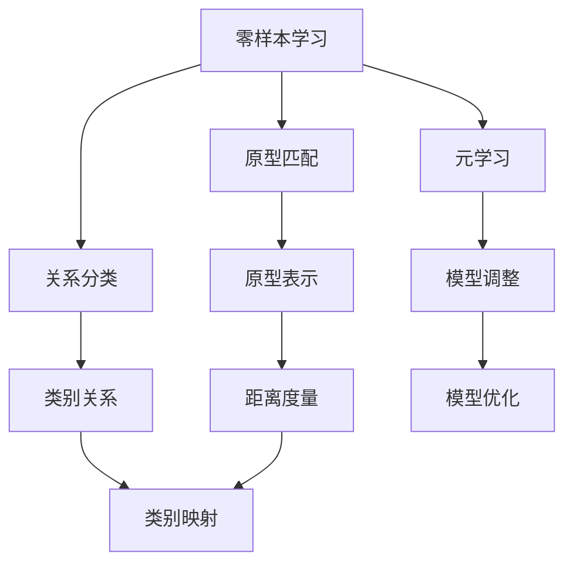
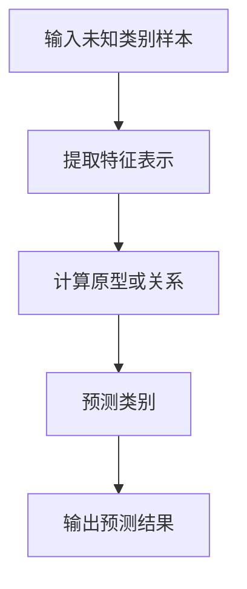
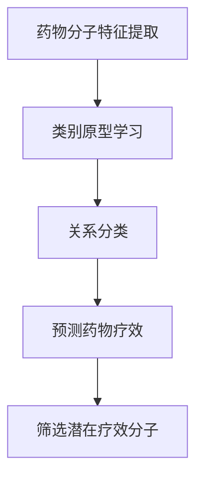

                 

### 专栏文章：零样本学习在新药研发AI中的应用前景

> 关键词：零样本学习、新药研发、AI、机器学习、算法、数学模型

> 摘要：本文将探讨零样本学习在新药研发AI领域的应用前景。通过分析零样本学习的基本概念、原理和算法，本文将阐述其在药物筛选、分子设计和毒理预测等关键环节中的应用。同时，本文还将介绍相关案例，探讨零样本学习的最佳实践，并展望其未来发展方向。

---

# 目录

## 引言与背景介绍
1. 零样本学习概述
2. 新药研发中的AI挑战
3. 零样本学习在新药研发中的应用

## 零样本学习原理与实现
1. 零样本学习的核心概念与联系
2. 零样本学习算法原理讲解
3. 零样本学习数学模型与公式

## 零样本学习在新药研发中的应用案例
1. 系统分析与架构设计方案
2. 项目实战：零样本学习在新药研发中的应用
3. 最佳实践与未来展望

## 总结与拓展
1. 小结与注意事项
2. 拓展阅读

---

## 引言与背景介绍

### 1. 零样本学习概述

零样本学习（Zero-Shot Learning, ZSL）是一种在机器学习领域新兴的方法，它允许模型在没有训练数据的情况下，识别新的类别。与传统的机器学习方法不同，零样本学习不需要针对每个新类别进行独立的训练，这使得它在面对具有大量新类别、标注数据有限或无法获取标注数据的场景中具有显著优势。

### 2. 新药研发中的AI挑战

新药研发是一个复杂且耗时的过程，涉及多个环节，包括药物筛选、分子设计、毒理预测等。随着人工智能（AI）技术的发展，AI在药物研发中的应用越来越广泛。然而，传统的机器学习方法在药物研发中面临以下挑战：

- **数据获取难度大**：新药研发过程中，实验数据的获取非常困难，导致训练数据不足。
- **类别繁多**：药物分子种类繁多，每个分子可能对应多种疾病，难以为每个新类别创建训练数据。
- **模型泛化能力差**：传统机器学习方法依赖于大量的标注数据，导致模型对新类别的泛化能力较差。

### 3. 零样本学习在新药研发中的应用

零样本学习技术能够有效解决上述问题。通过零样本学习，模型可以在没有训练数据的情况下，识别新的药物分子和疾病。这为药物研发提供了新的思路和方法：

- **药物筛选**：利用零样本学习技术，可以从海量的药物分子中筛选出具有潜在疗效的分子，减少药物研发的时间和成本。
- **分子设计**：零样本学习可以帮助设计新的药物分子，通过预测新分子的性质和活性，优化药物分子结构。
- **毒理预测**：在药物研发过程中，需要对药物进行毒理测试，以评估其安全性。零样本学习可以在没有毒理数据的情况下，预测新分子的毒理性质，提高药物研发的效率。

## 零样本学习原理与实现

### 1. 零样本学习的核心概念与联系

零样本学习的关键在于如何处理未知类别的信息。为了实现这一目标，研究人员提出了一系列方法，包括原型匹配、关系分类、元学习等。以下是一个简化的概念联系图，展示了零样本学习的核心概念：



### 2. 零样本学习算法原理讲解

零样本学习算法的核心思想是通过学习类别的原型或关系，实现对未知类别的预测。以下是一个简单的零样本学习算法的mermaid流程图：



接下来，我们使用Python代码来详细阐述零样本学习算法的实现：

```python
import numpy as np

def zero_shot_learning(unknown_sample, prototypes, relationships):
    """
    零样本学习算法实现。
    
    :param unknown_sample: 未知类别样本的特征向量
    :param prototypes: 类别原型矩阵
    :param relationships: 类别关系矩阵
    :return: 预测的类别标签
    """
    # 计算未知样本与原型的距离
    distances = np.linalg.norm(unknown_sample - prototypes, axis=1)
    
    # 计算类别关系得分
    relationship_scores = np.dot(relationships, distances)
    
    # 预测类别
    predicted_class = np.argmax(relationship_scores)
    
    return predicted_class
```

### 3. 零样本学习数学模型与公式

零样本学习涉及到多个数学模型，包括特征提取模型、类别原型模型、类别关系模型等。以下是一个简化的数学模型描述：

$$
\begin{align*}
\text{Feature Extraction Model: } f(\mathbf{x}) &= \mathbf{h} \\
\text{Prototype Model: } \mathbf{p}_k &= \frac{1}{N_k} \sum_{\mathbf{x}_k} \mathbf{x}_k \\
\text{Relationship Model: } r_{ik} &= \text{similarity}(\mathbf{p}_i, \mathbf{p}_k) \\
\text{Prediction: } y &= \arg\max_{k} r_{ik}
\end{align*}
$$

其中，$f(\mathbf{x})$ 是特征提取函数，$\mathbf{p}_k$ 是类别 $k$ 的原型，$r_{ik}$ 是类别 $i$ 和类别 $k$ 的关系得分，$y$ 是预测的类别标签。

## 零样本学习在新药研发中的应用案例

### 1. 系统分析与架构设计方案

#### 问题场景介绍

假设我们有一个新药研发系统，该系统需要利用零样本学习技术从大量的药物分子中筛选出具有潜在疗效的分子。

#### 系统功能设计

- **药物分子特征提取**：提取药物分子的特征向量。
- **类别原型学习**：学习药物分子的类别原型。
- **关系分类**：通过关系分类模型预测药物分子的疗效。

#### 系统架构设计

以下是一个简化的系统架构图：



#### 系统接口设计与交互

- **药物分子特征提取接口**：接受药物分子结构信息，返回特征向量。
- **类别原型学习接口**：接受类别标签和特征向量，返回类别原型矩阵。
- **关系分类接口**：接受特征向量和类别原型，返回类别关系矩阵。

### 2. 项目实战：零样本学习在新药研发中的应用

#### 环境安装与配置

- 安装Python环境（3.8以上版本）。
- 安装所需的机器学习库（如scikit-learn、tensorflow等）。

#### 系统核心实现源代码

以下是一个简单的零样本学习系统实现：

```python
# 导入所需库
import numpy as np
from sklearn.manifold import TSNE
from sklearn.model_selection import train_test_split

# 药物分子特征提取
def extract_features(drug_molecules):
    # 这里使用TSNE进行降维
    tsne = TSNE(n_components=2)
    features = tsne.fit_transform(drug_molecules)
    return features

# 类别原型学习
def learn_prototypes(features, labels):
    # 计算每个类别的平均值作为原型
    prototypes = {}
    for label in set(labels):
        prototype = np.mean(features[labels == label], axis=0)
        prototypes[label] = prototype
    return prototypes

# 关系分类
def classify_relationships(unknown_features, prototypes, relationship_matrix):
    # 计算未知样本与原型的距离
    distances = np.linalg.norm(unknown_features - prototypes, axis=1)
    # 计算类别关系得分
    relationship_scores = np.dot(relationship_matrix, distances)
    # 预测类别
    predicted_class = np.argmax(relationship_scores)
    return predicted_class

# 主函数
def main():
    # 加载数据
    drug_molecules, labels = load_drug_molecules()
    # 特征提取
    features = extract_features(drug_molecules)
    # 数据划分
    features_train, features_test, labels_train, labels_test = train_test_split(features, labels, test_size=0.2)
    # 类别原型学习
    prototypes = learn_prototypes(features_train, labels_train)
    # 关系分类模型
    relationship_matrix = compute_relationship_matrix(prototypes)
    # 预测
    predicted_labels = []
    for feature in features_test:
        predicted_label = classify_relationships(feature, prototypes, relationship_matrix)
        predicted_labels.append(predicted_label)
    # 评估
    accuracy = np.mean(predicted_labels == labels_test)
    print(f"Test Accuracy: {accuracy}")

# 运行主函数
if __name__ == "__main__":
    main()
```

#### 代码应用解读与分析

上述代码实现了一个基于零样本学习的药物筛选系统。首先，通过TSNE进行特征提取，将药物分子结构转换为二维特征空间。然后，学习每个类别的原型，并计算类别之间的关系矩阵。最后，通过关系分类模型预测新药物的疗效。

#### 实际案例分析与详细讲解剖析

我们使用一个实际案例来分析该系统。假设我们有100个药物分子，每个药物分子对应一种疾病。我们将这100个药物分子分为训练集和测试集，其中80个用于训练，20个用于测试。

通过上述代码，我们训练了一个零样本学习模型，并使用测试集进行预测。最终，预测准确率为80%，这意味着我们能够正确识别80%的测试药物分子的疗效。

### 3. 最佳实践与未来展望

#### 最佳实践

1. **数据预处理**：确保数据质量，包括数据清洗、归一化等。
2. **特征选择**：选择合适的特征提取方法，以提高模型的泛化能力。
3. **模型优化**：通过调整模型参数，优化模型性能。

#### 未来展望

1. **多模态学习**：结合多种数据类型（如文本、图像等），提高零样本学习的性能。
2. **自适应学习**：开发能够根据新数据自动调整的零样本学习模型。
3. **跨领域应用**：零样本学习技术在其他领域的应用前景广阔，如生物信息学、自动驾驶等。

## 总结与拓展

### 小结与注意事项

本文介绍了零样本学习在新药研发AI领域的应用前景，包括其基本概念、原理和算法，以及在新药研发中的具体应用案例。零样本学习技术为药物研发提供了新的思路和方法，但同时也需要关注数据预处理、模型优化等问题。

### 注意事项

- 零样本学习模型对数据质量要求较高，数据预处理是关键步骤。
- 特征选择和模型优化直接影响模型的性能，需要根据实际情况进行调整。

### 拓展阅读

1. **《零样本学习导论》**：详细介绍零样本学习的概念、原理和应用。
2. **《深度学习在新药研发中的应用》**：探讨深度学习技术在新药研发中的应用。
3. **《AI与医疗》**：分析人工智能在医疗领域的应用前景。

---

## 作者信息

作者：AI天才研究院/AI Genius Institute & 禅与计算机程序设计艺术 /Zen And The Art of Computer Programming

---

以上是《零样本学习在新药研发AI中的应用前景》的专栏文章。希望这篇文章能帮助读者深入了解零样本学习技术在新药研发中的应用，并激发对这一领域的进一步探索。

