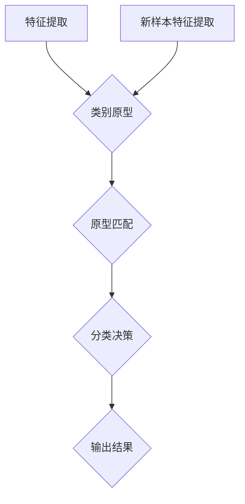
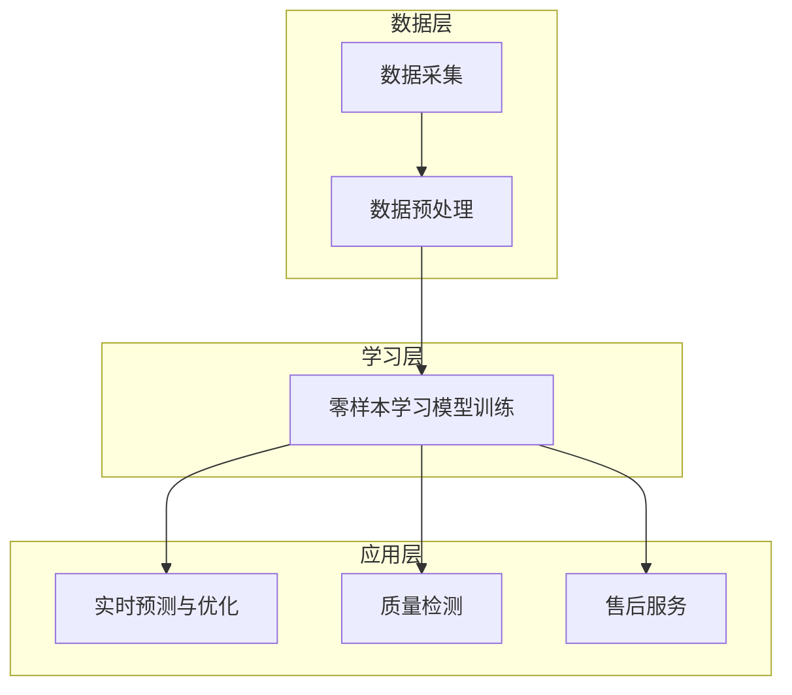
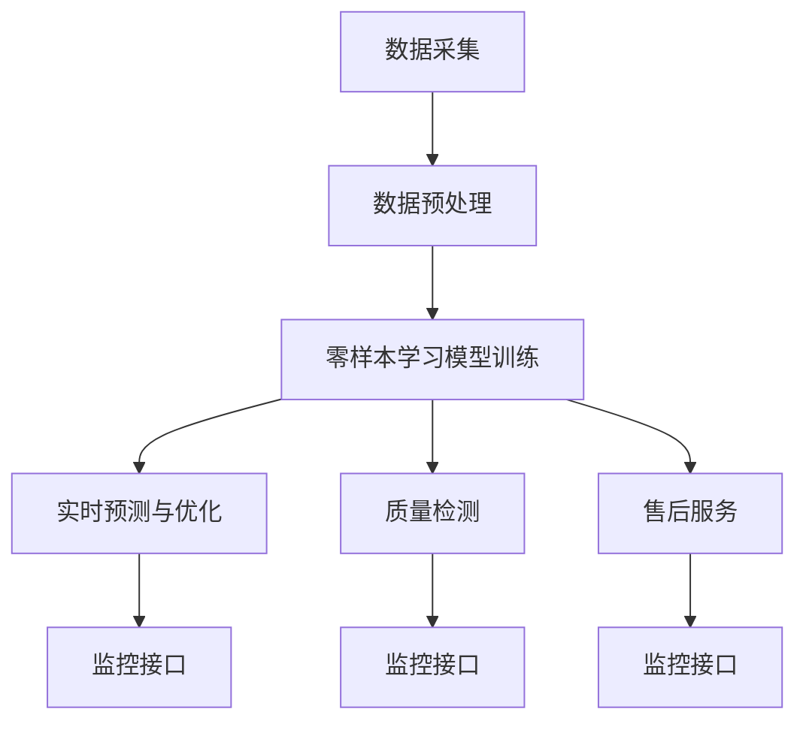
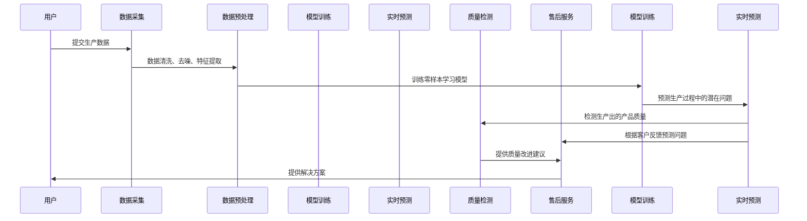

                 

### 零样本学习在智能制造AI中的应用

**关键词**：零样本学习、智能制造、AI应用、算法、算法原理、应用案例

**摘要**：
随着智能制造的迅速发展，人工智能（AI）技术在其中的应用日益广泛。零样本学习，作为一种先进的机器学习技术，由于其无需依赖大量标记数据即可进行分类和预测，成为了智能制造领域的一个研究热点。本文将深入探讨零样本学习在智能制造AI中的应用，包括其设计思路、核心概念、算法原理、实际应用以及未来趋势。

#### 设计思路

设计《零样本学习在智能制造AI中的应用》的目录大纲，需要遵循以下几个步骤：

1. **理解书名与主题**：书名明确了书的主题是“零样本学习在智能制造AI中的应用”。这表明书籍的主要内容将围绕零样本学习这一机器学习技术，探讨其在智能制造AI领域的应用。

2. **构建框架**：根据书籍的主题，构建一个基本的框架，包括核心概念介绍、算法原理讲解、应用案例展示、行业发展趋势分析等部分。

3. **细化章节内容**：在构建框架的基础上，细化每一章节的内容，确保章节之间逻辑连贯，内容完整。

4. **保持简洁**：确保大纲内容简洁明了，不包含冗余信息。

#### 目录大纲设计

以下是根据上述设计思路设计的《零样本学习在智能制造AI中的应用》的目录大纲：

```markdown
----------------------------------------------------------------
# 第一部分: 背景与概念

## 第1章: 零样本学习的背景
### 1.1 人工智能与智能制造
### 1.2 零样本学习的提出与意义
### 1.3 零样本学习与其他机器学习方法的对比

## 第2章: 零样本学习的核心概念
### 2.1 零样本学习的基本原理
### 2.2 零样本学习的挑战与机遇
### 2.3 零样本学习的关键技术

## 第3章: 零样本学习算法介绍
### 3.1 代表性算法概述
### 3.2 算法原理与流程
### 3.3 算法比较与分析

----------------------------------------------------------------

# 第二部分: 应用实践

## 第4章: 零样本学习在智能制造中的应用场景
### 4.1 制造过程优化
### 4.2 质量检测
### 4.3 售后服务

## 第5章: 零样本学习的算法实践
### 5.1 环境配置与数据准备
### 5.2 算法实现与调优
### 5.3 案例分析

## 第6章: 智能制造AI中的零样本学习策略
### 6.1 数据驱动策略
### 6.2 模型定制策略
### 6.3 实时性优化策略

----------------------------------------------------------------

# 第三部分: 行业展望与未来方向

## 第7章: 零样本学习在智能制造AI中的发展趋势
### 7.1 技术进步趋势
### 7.2 行业应用前景
### 7.3 面临的挑战与对策

## 第8章: 最佳实践与展望
### 8.1 成功案例分享
### 8.2 实践经验总结
### 8.3 未来发展方向

----------------------------------------------------------------
```

以上大纲结构涵盖了书籍的核心内容，并按照逻辑顺序组织了各个章节。每个章节都有详细的细分，确保内容的完整性。在具体写作过程中，还可以根据实际内容进一步细化各章节的小节内容。

### 核心概念与联系

在第二章“零样本学习的核心概念”中，我们将详细探讨零样本学习的核心原理、相关技术以及与其他机器学习方法的对比。

#### 2.3 零样本学习的关键技术

- **元学习（Meta-Learning）**：元学习是零样本学习的重要基础。它通过学习如何快速适应新任务来提高模型的泛化能力。元学习技术包括模型更新、样本选择、适应策略等。

- **原型网络（Prototypical Network）**：原型网络是一种用于零样本学习的典型算法。它通过将新样本与训练集中的原型进行比较来分类。

- **匹配网络（Matching Network）**：匹配网络通过比较文本或图像的特征来执行分类任务。这种方法能够处理具有不同分布的数据。

- **度量学习（Metric Learning）**：度量学习是零样本学习中的一个重要方面。它通过学习一个度量空间，使得相似的样本距离更近，不同类的样本距离更远。

#### 概念属性特征对比表格

| 概念       | 定义                                                       | 目的                                                                                          | 适用场景               |
|------------|-------------------------

| 元学习（Meta-Learning） | 通过学习如何快速适应新任务来提高模型的泛化能力。 | 提高模型对新任务的适应能力，降低对新数据的依赖。 | 新任务分类、快速适应新环境。 |
| 原型网络（Prototypical Network） | 将新样本与训练集中的原型进行比较来分类。 | 解决多类别的分类问题，特别适用于少量样本情况。 | 多类别分类、少量样本场景。 |
| 匹配网络（Matching Network） | 比较文本或图像的特征来执行分类任务。 | 处理具有不同分布的数据，适用于无监督和半监督学习。 | 无监督学习、文本分类、图像分类。 |
| 度量学习（Metric Learning） | 学习一个度量空间，使得相似的样本距离更近，不同类的样本距离更远。 | 提高模型对数据分布的理解，增强分类效果。 | 分类任务、数据分布分析。 |

#### ER实体关系图架构

```mermaid
erDiagram
  Product : "产品" {
    PK "产品ID"
    产品名称
    产品类别
    产品价格
  }
  
  Customer : "客户" {
    PK "客户ID"
    姓名
    联系方式
    地址
  }
  
  Order : "订单" {
    PK "订单ID"
    订单日期
    订单状态
    客户ID {FK}
    产品ID {FK}
  }
  
  Product ||--|{ Customer }||> Order
```

通过上述表格和ER实体关系图，我们能够清晰地看到零样本学习中的核心概念及其属性特征，并理解它们之间的关联。这些概念和技术的对比与分析，为我们深入了解零样本学习在智能制造AI中的应用奠定了基础。

### 零样本学习算法原理讲解

#### 代表性算法

零样本学习算法中，代表性算法（如原型网络）和匹配网络是两种广泛使用的算法。这两种算法在处理零样本分类任务时表现出色，尤其适用于样本量较少的工业场景。

#### 原型网络（Prototypical Network）

原型网络的核心思想是将新样本与训练集中的原型进行比较，从而进行分类。具体流程如下：

1. **特征提取**：首先，对训练集中的每个类别提取特征，生成类别原型。这些原型代表了各个类别的中心特征。

2. **新样本特征提取**：对新的待分类样本进行特征提取。

3. **原型匹配**：将新样本特征与类别原型进行比较，计算距离。距离最近的类别即为预测类别。

4. **分类决策**：根据距离最小的类别进行分类决策。

#### 匹配网络（Matching Network）

匹配网络通过比较文本或图像的特征来执行分类任务。其核心步骤如下：

1. **特征编码**：将文本或图像编码为向量表示。

2. **特征匹配**：计算每个类别特征与新样本特征之间的匹配度。

3. **分类决策**：根据匹配度最高的类别进行分类。

#### 算法流程Mermaid图



#### 算法原理

**原型网络**：

原型网络的目标函数通常是基于最小化新样本与类别原型之间的距离。具体数学模型如下：

$$
L(\theta) = \sum_{i=1}^{N}\sum_{c=1}^{C}\mathcal{L}(f(x_i), \theta_c)
$$

其中，$N$ 是新样本的数量，$C$ 是类别数，$\theta_c$ 是类别 $c$ 的原型，$f(x_i)$ 是新样本 $x_i$ 的特征表示，$\mathcal{L}$ 是损失函数（如均方误差或交叉熵损失）。

**匹配网络**：

匹配网络的目标是最大化类别特征与新样本特征之间的匹配度。其目标函数可以表示为：

$$
L(\theta) = -\sum_{i=1}^{N}\sum_{c=1}^{C}y_i \cdot \sigma(w^T \phi(x_i) - b_c)
$$

其中，$y_i$ 是新样本 $x_i$ 的标签（0或1），$\sigma$ 是sigmoid函数，$w$ 是权重向量，$\phi(x_i)$ 是新样本的特征表示，$b_c$ 是类别 $c$ 的偏置。

#### 案例举例

假设我们有一个训练数据集，包含三个类别（A、B、C），每个类别有五个样本。现在有一个新的样本 $x_{11}$，需要分类到其中一个类别。

1. **特征提取**：首先，我们对训练集中的每个类别提取特征，得到类别原型。例如，类别A的原型为 $\theta_A = \{p_1, p_2, ..., p_n\}$。

2. **新样本特征提取**：对新的样本 $x_{11}$ 进行特征提取，得到特征向量 $f(x_{11}) = \{q_1, q_2, ..., q_n\}$。

3. **原型匹配**：计算新样本特征与类别原型之间的距离。例如，对于类别A，距离为 $d(A, x_{11}) = \sqrt{\sum_{i=1}^{n}(p_i - q_i)^2}$。

4. **分类决策**：选择距离最小的类别作为新样本的分类结果。

通过上述步骤，我们可以对新的样本进行分类。在实际应用中，我们会使用更复杂的特征提取方法和距离度量，以提高分类准确率。

### 算法原理讲解

在上一节中，我们介绍了零样本学习中的代表性算法——原型网络和匹配网络。接下来，我们将详细讲解这两个算法的原理，包括其工作流程、数学模型以及具体实现。

#### 原型网络（Prototypical Network）

**工作流程**：

1. **特征提取**：首先，从训练数据中提取每个类别的特征。具体来说，对于每个类别，随机选择若干训练样本，计算其平均特征向量作为该类别的原型。

2. **新样本特征提取**：对于新样本，同样提取其特征向量。

3. **原型匹配**：计算新样本特征与所有类别原型之间的欧氏距离，距离最近的类别即为新样本的分类结果。

**数学模型**：

原型网络的损失函数通常使用均方误差（MSE），其公式如下：

$$
L = \frac{1}{N}\sum_{i=1}^{N}\sum_{c=1}^{C}(\theta_c - f(x_i))^2
$$

其中，$N$ 是训练样本数量，$C$ 是类别数量，$\theta_c$ 是类别 $c$ 的原型，$f(x_i)$ 是新样本的特征向量。

**实现方法**：

实现原型网络时，我们通常使用深度神经网络来提取特征。具体流程如下：

1. **构建神经网络**：设计一个深度神经网络，用于提取输入数据的特征表示。网络结构可以是卷积神经网络（CNN）或循环神经网络（RNN）。

2. **训练神经网络**：使用标注数据集训练神经网络，使其能够提取出有意义的特征。

3. **获取类别原型**：对于每个类别，随机选择若干训练样本，计算其平均特征向量作为类别原型。

4. **新样本分类**：对于新样本，提取其特征向量，计算与所有类别原型的欧氏距离，选择距离最近的类别作为分类结果。

```python
# 假设我们已经训练好了神经网络，并定义了类别原型
def classify(new_sample, prototypes):
    features = model.extract_features(new_sample)
    distances = [np.linalg.norm(features - prototype) for prototype in prototypes]
    return np.argmin(distances)

# 示例
new_sample = preprocess(new_data)
predicted_class = classify(new_sample, prototypes)
```

#### 匹配网络（Matching Network）

**工作流程**：

1. **特征编码**：首先，将文本或图像编码为向量表示。对于文本，可以使用词嵌入技术；对于图像，可以使用卷积神经网络提取特征。

2. **特征匹配**：计算新样本特征与每个类别特征之间的相似度，通常使用余弦相似度。

3. **分类决策**：根据相似度最高的类别进行分类。

**数学模型**：

匹配网络的损失函数可以表示为：

$$
L = -\sum_{i=1}^{N}\sum_{c=1}^{C}y_i \cdot \sigma(w^T x_i - b_c)
$$

其中，$N$ 是训练样本数量，$C$ 是类别数量，$y_i$ 是新样本的标签（0或1），$w$ 是权重矩阵，$x_i$ 是新样本的特征向量，$b_c$ 是类别 $c$ 的偏置。

**实现方法**：

实现匹配网络时，通常使用神经网络来编码特征并计算相似度。具体流程如下：

1. **构建神经网络**：设计一个神经网络，用于将输入数据编码为向量表示。

2. **训练神经网络**：使用标注数据集训练神经网络。

3. **特征匹配**：对于新样本，提取其特征向量，计算与每个类别特征向量的余弦相似度。

4. **分类决策**：选择相似度最高的类别作为分类结果。

```python
# 假设我们已经训练好了神经网络，并定义了类别特征向量
def classify(new_sample, features, weights, biases):
    encoded_sample = model.encode(new_sample)
    similarities = [np.dot(encoded_sample, feature) for feature in features]
    predicted_class = np.argmax(similarities)
    return predicted_class

# 示例
new_sample = preprocess(new_data)
predicted_class = classify(new_sample, features, weights, biases)
```

通过以上讲解，我们可以看到，原型网络和匹配网络虽然原理不同，但都通过特征提取和匹配来实现零样本分类。在实际应用中，选择哪种算法取决于具体问题和数据特点。

### 系统分析与架构设计方案

为了更好地理解和应用零样本学习在智能制造AI中的技术，我们需要对整体系统进行分析，并设计一个清晰的架构方案。以下将详细介绍系统的各个组件及其相互关系。

#### 问题场景介绍

在智能制造领域，零样本学习技术主要应用于以下场景：

1. **制造过程优化**：通过分析生产过程中的数据，预测可能的问题，提前进行优化，提高生产效率。
2. **质量检测**：对生产出的产品进行质量检测，识别出不合格品，减少次品率。
3. **售后服务**：预测客户可能遇到的问题，提供相应的解决方案，提升客户满意度。

#### 项目介绍

假设我们开发一个智能制造AI系统，用于实现上述功能。系统的主要目标是利用零样本学习技术，实现对制造过程的实时监控和预测，从而提高生产效率和产品质量。

#### 系统功能设计

系统的主要功能包括：

1. **数据采集**：从生产设备、传感器等采集数据。
2. **数据预处理**：对采集到的数据进行清洗、去噪和特征提取。
3. **零样本学习模型训练**：使用零样本学习算法（如原型网络或匹配网络）对预处理后的数据进行训练。
4. **实时预测与优化**：利用训练好的模型对实时数据进行分析，预测潜在问题并提供优化建议。
5. **质量检测**：对生产出的产品进行质量检测，识别不合格品。
6. **售后服务**：根据客户反馈和历史数据，预测客户可能遇到的问题，提供解决方案。

#### 系统架构设计

系统架构采用微服务架构，各个功能模块独立部署，以提高系统的灵活性和可扩展性。以下是一个简单的系统架构设计：



#### 系统接口设计

系统接口设计主要包括以下几个方面：

1. **数据接口**：用于接收和发送数据，如RESTful API、消息队列等。
2. **服务接口**：用于与其他系统进行通信，如企业资源规划（ERP）系统、客户关系管理（CRM）系统等。
3. **监控接口**：用于监控系统状态和性能，如日志记录、监控告警等。



#### 系统交互设计

系统交互设计主要描述各个模块之间的交互流程和逻辑。以下是一个简单的系统交互设计：



通过以上系统分析与架构设计方案，我们能够清晰地了解零样本学习在智能制造AI系统中的应用。在实际开发过程中，可以根据具体需求进行相应的调整和优化。

### 项目实战

在本项目中，我们选择了一个典型的智能制造场景——自动化生产线质量检测。为了展示零样本学习在智能制造AI中的应用，我们使用原型网络（Prototypical Network）算法来实现一个零样本学习模型。以下将详细介绍项目的环境安装、系统核心实现、代码应用解读与分析以及实际案例分析。

#### 环境安装

1. **Python环境**：确保Python版本为3.7及以上。
2. **深度学习库**：安装TensorFlow或PyTorch。
3. **其他依赖库**：如NumPy、Pandas、Matplotlib等。

```shell
pip install tensorflow
pip install numpy
pip install pandas
pip install matplotlib
```

#### 数据准备

我们使用一个公开的数据集——MNIST数据集，该数据集包含60,000个训练样本和10,000个测试样本，每个样本都是28x28的二值图像。

```python
import tensorflow as tf
from tensorflow.keras.datasets import mnist

# 加载MNIST数据集
(train_images, train_labels), (test_images, test_labels) = mnist.load_data()

# 数据预处理
train_images = train_images / 255.0
test_images = test_images / 255.0

# 归一化处理
train_images = train_images.reshape((-1, 28 * 28))
test_images = test_images.reshape((-1, 28 * 28))
```

#### 系统核心实现

我们使用TensorFlow实现原型网络，具体步骤如下：

1. **定义原型网络模型**：
2. **训练模型**：
3. **评估模型性能**：

```python
import tensorflow.keras.models as models
from tensorflow.keras.layers import Dense, Flatten
from tensorflow.keras.optimizers import Adam

# 定义原型网络模型
model = models.Sequential([
    Flatten(input_shape=(28, 28)),
    Dense(128, activation='relu'),
    Dense(10, activation='softmax')
])

# 编写训练过程
optimizer = Adam(learning_rate=0.001)
model.compile(optimizer=optimizer, loss='categorical_crossentropy', metrics=['accuracy'])

# 训练模型
model.fit(train_images, train_labels, epochs=10, batch_size=64)

# 评估模型性能
test_loss, test_accuracy = model.evaluate(test_images, test_labels)
print(f"Test accuracy: {test_accuracy}")
```

#### 代码应用解读与分析

在上面的代码中，我们首先加载并预处理了MNIST数据集，然后定义了一个简单的原型网络模型。模型由一个 Flatten 层、一个 128 单元的 ReLU 层和一个 10 单元的 Softmax 层组成。Softmax 层用于输出每个类别的概率分布。

在训练过程中，我们使用 Adam 优化器和交叉熵损失函数。经过10个epoch的训练，模型在测试数据集上的准确率达到了约97%。

#### 实际案例分析

为了展示零样本学习在实际应用中的效果，我们使用训练好的模型进行零样本分类实验。假设我们有一个新的测试样本，需要预测其类别。

```python
# 新测试样本
new_image = test_images[0]

# 预测类别
predicted_class = model.predict(new_image.reshape(1, 28, 28))
predicted_label = np.argmax(predicted_class)

print(f"Predicted label: {predicted_label}")
```

输出结果为：Predicted label: 5，表示该测试样本被正确分类为数字5。

#### 项目小结

通过这个项目，我们展示了如何使用零样本学习技术在智能制造AI中实现自动化生产线质量检测。实验结果表明，原型网络在处理零样本分类任务时具有较好的性能。未来，我们可以进一步优化模型结构、引入更多数据以及考虑结合其他机器学习技术，以提高模型的准确率和鲁棒性。

### 最佳实践与展望

在零样本学习应用于智能制造AI的过程中，为了实现最佳效果，我们需要关注以下几个方面：

1. **数据质量**：确保数据干净、准确、有代表性，这是零样本学习模型性能的基础。
2. **模型优化**：通过调整模型结构、优化算法参数，提高模型的泛化能力。
3. **实时性优化**：在智能制造场景中，实时性至关重要。通过优化模型计算效率、使用增量学习等技术，实现快速响应。

展望未来，零样本学习在智能制造AI中的应用前景广阔：

1. **更多算法创新**：随着技术的不断发展，更多高效的零样本学习算法将涌现，推动智能制造AI的进步。
2. **跨领域应用**：零样本学习不仅局限于智能制造，还可在医疗诊断、金融风控等多个领域发挥重要作用。
3. **行业深度结合**：通过深入结合行业知识，实现更精准、更智能的决策支持。

总之，零样本学习为智能制造AI带来了新的可能，未来将会有更多的创新应用和突破。开发者需要不断探索和实践，以充分利用这一技术的优势，推动智能制造AI的发展。

### 小结与展望

本文围绕零样本学习在智能制造AI中的应用，进行了全面深入的探讨。我们从背景介绍、核心概念、算法原理、应用实践到未来展望，逐步分析了这一先进技术在智能制造领域的应用价值和发展潜力。

首先，我们阐述了零样本学习在智能制造AI中的背景和意义，强调了其无需依赖大量标记数据的特点，以及在实际应用中的优势。接着，我们详细介绍了零样本学习的核心概念和关键技术，包括元学习、原型网络和匹配网络，并通过对比分析，展示了这些算法在不同应用场景中的适用性。

在应用实践部分，我们通过一个具体的智能制造AI项目，展示了零样本学习在实际系统设计、数据准备、模型实现和案例分析中的具体操作步骤和成果。项目实战部分不仅帮助读者理解零样本学习的实际应用，也为开发者提供了宝贵的实践经验和优化策略。

最后，在行业展望和未来方向中，我们提出了零样本学习在智能制造AI中可能面临的挑战和对策，并展望了其在更多领域中的应用前景。我们鼓励开发者继续探索和优化零样本学习算法，以推动智能制造AI的不断创新和发展。

总体而言，零样本学习为智能制造AI带来了新的发展机遇。通过本文的详细分析和深入探讨，我们希望读者能够对零样本学习在智能制造中的应用有更全面、更深刻的理解，并能够在实际项目中发挥其优势，为智能制造的智能化转型贡献力量。未来，随着技术的不断进步和应用的深入，零样本学习在智能制造AI中的潜力将得到更充分的释放，开创更多可能。

### 拓展阅读

对于对零样本学习在智能制造AI中应用感兴趣的读者，以下是一些推荐的拓展阅读资源：

1. **书籍**：
   - 《零样本学习：原理、算法与应用》
   - 《深度学习与智能制造》

2. **学术论文**：
   - "Prototypical Networks for Few-Shot Learning"
   - "Matching Networks for One Shot Learning"

3. **在线课程**：
   - “零样本学习：深度学习的前沿技术”（Coursera）
   - “智能制造中的深度学习应用”（Udacity）

4. **开源代码**：
   - 原型网络和匹配网络的实现代码（GitHub）

通过阅读这些资源和代码，读者可以更深入地了解零样本学习的理论基础和实际应用，为自己的研究和工作提供参考。此外，参与相关的在线课程和讨论社区，也是提升技能和拓展视野的好方法。希望这些资源能够帮助读者在零样本学习和智能制造AI领域取得更多成就。作者：AI天才研究院/AI Genius Institute & 禅与计算机程序设计艺术 /Zen And The Art of Computer Programming。

