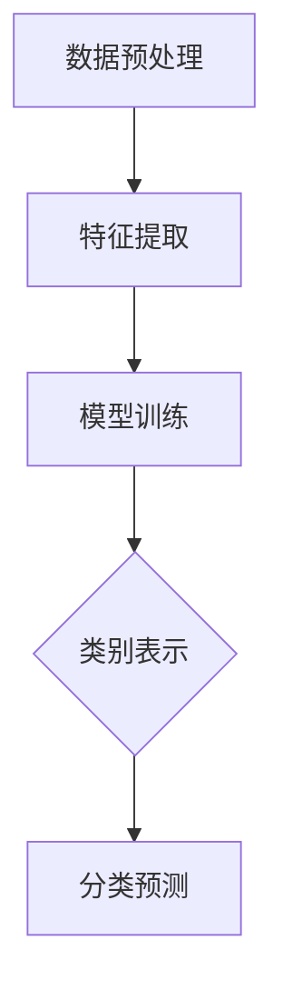
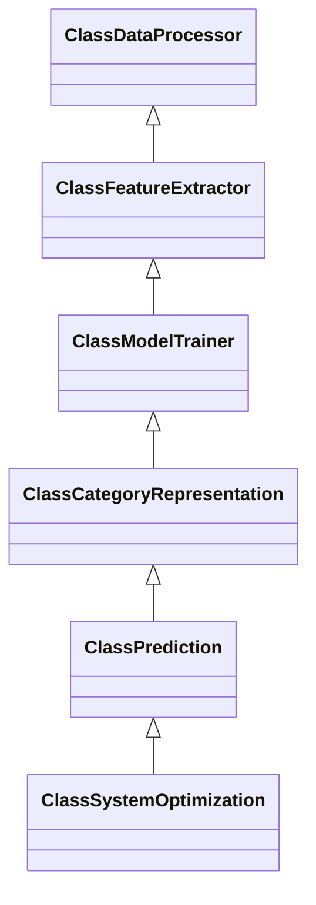
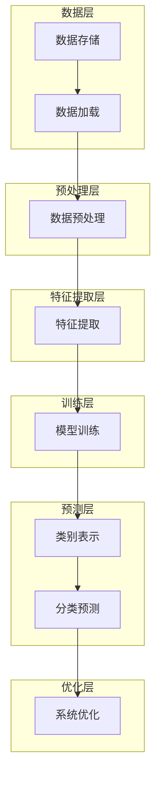
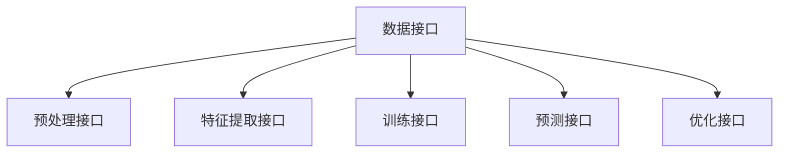

                 

### 零样本思维链概述

**关键词：** 零样本学习，思维链，挑战与对策

在人工智能领域，机器学习是核心驱动力之一。传统的机器学习方法依赖于大量标注数据进行训练，然而，在许多实际应用场景中，获取大量标注数据既昂贵又困难。例如，医疗诊断、自动驾驶和智能客服等领域，获取标注数据需要专业的知识和大量的时间，这使得传统的机器学习方法在这些场景中难以实施。为了解决这一问题，零样本学习（Zero-Shot Learning，ZSL）应运而生。

**1.1 零样本思维链的定义与意义**

零样本学习是指在没有或只有少量训练样本的情况下，机器学习模型能够对新类别进行分类。这种学习方式打破了传统机器学习对大量标注数据的依赖，使得模型能够应对现实世界中数据稀缺的场景。

零样本思维链（Zero-Shot MindChain）是在零样本学习的基础上发展起来的一种方法。它通过构建一种思维模式，使得模型能够理解不同类别之间的关系，从而在未见过的类别上实现有效的分类。

零样本思维链的意义在于，它不仅能够解决数据稀缺的问题，还能够提高模型的泛化能力，使得模型能够在更多领域得到应用。

**1.2 零样本思维链在实际应用中的重要性**

在实际应用中，零样本思维链具有重要的意义：

- **医疗诊断**：在医疗领域，零样本思维链可以帮助医生对新疾病进行诊断。由于新疾病的标注数据难以获取，传统的机器学习方法难以应用，而零样本思维链则能够有效地解决这个问题。

- **自动驾驶**：在自动驾驶领域，零样本思维链可以帮助车辆识别道路上的各种物体，如行人、车辆、动物等。这对于提高自动驾驶的安全性和可靠性具有重要意义。

- **智能客服**：在智能客服领域，零样本思维链可以帮助客服系统识别用户的请求，即使在用户请求中出现新的短语或表达方式，系统也能准确地理解并回应。

**1.3 零样本思维链与传统机器学习的区别**

传统机器学习依赖于大量标注数据进行训练，而零样本思维链则无需或只需少量标注数据。此外，传统机器学习通常只能处理已知的类别，而零样本思维链则能够处理未知类别。

**1.4 零样本思维链的核心概念**

零样本思维链的核心概念包括：

- **无监督学习**：无监督学习是一种无需标注数据的机器学习方法，它通过对数据的分析，自动发现数据中的模式和规律。

- **迁移学习**：迁移学习是指将一个任务在特定数据集上学到的知识应用到另一个任务中。在零样本思维链中，迁移学习可以帮助模型在未见过的类别上快速适应。

- **基于知识的零样本学习**：基于知识的零样本学习利用外部知识库，如WordNet等，来增强模型的分类能力。

**1.5 零样本思维链的挑战与机遇**

零样本思维链面临的主要挑战包括：

- **数据稀缺**：在许多应用场景中，获取大量标注数据非常困难。

- **类别多样**：实际应用中类别繁多，如何有效处理这些类别是一个挑战。

然而，这些挑战也带来了机遇。随着人工智能技术的发展，零样本思维链有望在这些挑战中找到解决方案，为人工智能应用开辟新的道路。

### 第1章：零样本思维链概述

**摘要：**本章将介绍零样本思维链的概念、核心概念及其在实际应用中的重要性。我们将探讨零样本思维链与传统机器学习的区别，并分析其面临的挑战与机遇。

**1.1 零样本思维链的定义与意义**

零样本思维链（Zero-Shot MindChain）是一种在零样本学习基础上发展起来的方法。它通过构建一种思维模式，使得模型能够理解不同类别之间的关系，从而在未见过的类别上实现有效的分类。

在传统的机器学习方法中，模型的训练依赖于大量的标注数据。这种方法在许多应用场景中，如医疗诊断、自动驾驶和智能客服等领域，存在数据获取困难的问题。零样本思维链则通过无需或只需少量标注数据，打破了这一限制，使得模型能够更广泛地应用于现实世界。

零样本思维链的意义在于，它不仅能够解决数据稀缺的问题，还能够提高模型的泛化能力，使得模型能够在更多领域得到应用。例如，在医疗诊断中，零样本思维链可以帮助医生对新疾病进行诊断，即使在缺少标注数据的情况下，系统也能准确地识别疾病。在自动驾驶领域，零样本思维链可以帮助车辆识别道路上的各种物体，提高自动驾驶的安全性和可靠性。在智能客服领域，零样本思维链可以帮助客服系统识别用户的请求，即使在用户请求中出现新的短语或表达方式，系统也能准确地理解并回应。

**1.2 零样本思维链在实际应用中的重要性**

零样本思维链在实际应用中具有非常重要的意义。首先，它解决了数据稀缺的问题。在许多应用场景中，获取大量标注数据非常困难，例如医疗诊断中的新疾病、自动驾驶中的新物体、智能客服中的新请求等。零样本思维链通过少量标注数据，甚至无标注数据，就能够实现有效的分类，极大地降低了数据获取的成本。

其次，零样本思维链提高了模型的泛化能力。传统的机器学习方法通常只能在已知的类别上进行分类，而零样本思维链则能够处理未知类别。这意味着模型不仅能够在已知的领域发挥作用，还能够应对新的挑战，具有更强的适应能力。

最后，零样本思维链为人工智能应用开辟了新的道路。在许多领域，例如医疗、交通、客服等，传统的机器学习方法由于数据稀缺而难以应用。而零样本思维链的出现，使得这些领域的人工智能应用成为可能，推动了人工智能技术的进步。

**1.3 零样本思维链与传统机器学习的区别**

零样本思维链与传统机器学习有以下几点区别：

1. **数据需求**：传统机器学习依赖于大量标注数据进行训练，而零样本思维链则无需或只需少量标注数据。这使得零样本思维链在数据稀缺的应用场景中更具优势。

2. **类别处理**：传统机器学习通常只能处理已知的类别，而零样本思维链则能够处理未知类别。这使得零样本思维链在应对复杂多变的现实问题时更具灵活性。

3. **模型结构**：传统机器学习方法主要依赖于数据驱动的方式，而零样本思维链则通过构建思维模式，使得模型能够理解不同类别之间的关系，从而实现分类。这种结构使得零样本思维链在处理复杂问题时更具优势。

**1.4 零样本思维链的核心概念**

零样本思维链的核心概念包括：

1. **无监督学习**：无监督学习是一种无需标注数据的机器学习方法，它通过对数据的分析，自动发现数据中的模式和规律。在零样本思维链中，无监督学习可以帮助模型在未见过的类别上快速适应。

2. **迁移学习**：迁移学习是指将一个任务在特定数据集上学到的知识应用到另一个任务中。在零样本思维链中，迁移学习可以帮助模型在未见过的类别上快速适应，从而提高分类效果。

3. **基于知识的零样本学习**：基于知识的零样本学习利用外部知识库，如WordNet等，来增强模型的分类能力。这种学习方式可以弥补标注数据的不足，提高模型在未见过的类别上的分类效果。

**1.5 零样本思维链的挑战与机遇**

零样本思维链在发展过程中面临着一些挑战，同时也带来了许多机遇。

挑战主要包括：

1. **数据稀缺**：在许多应用场景中，获取大量标注数据非常困难，这使得零样本思维链的应用受到限制。

2. **类别多样**：实际应用中类别繁多，如何有效处理这些类别是一个挑战。

机遇主要包括：

1. **技术进步**：随着人工智能技术的发展，零样本思维链有望在算法、模型和硬件等方面取得突破，从而更好地应对挑战。

2. **应用拓展**：随着零样本思维链技术的成熟，它将在更多领域得到应用，为人工智能技术的进步提供新的动力。

总之，零样本思维链是一种具有广阔应用前景的人工智能技术。通过解决数据稀缺和类别多样等挑战，它将为人工智能应用带来更多可能性。未来，随着技术的不断进步，零样本思维链将在人工智能领域发挥越来越重要的作用。

### 第1章：零样本思维链概述

**摘要：**本章将详细介绍零样本思维链的核心概念，包括无监督学习、迁移学习和基于知识的零样本学习，并通过对比表格和ER实体关系图，帮助读者更好地理解这些概念及其在实际应用中的重要性。

**2.1 无监督学习**

无监督学习是一种机器学习方法，它不需要标注数据，而是通过分析数据本身的特征，自动发现数据中的模式和规律。在零样本思维链中，无监督学习起到了至关重要的作用，因为它可以帮助模型在未见过的类别上快速适应。

无监督学习的特点如下：

1. **不需要标注数据**：无监督学习不需要对数据进行标注，这意味着它可以在没有人为干预的情况下自动进行数据分析和模式发现。

2. **自动性**：无监督学习的过程是自动的，它通过算法自动识别数据中的模式和规律。

3. **模式识别**：无监督学习能够识别数据中的潜在结构，这对于零样本思维链来说至关重要，因为它可以帮助模型理解不同类别之间的关系。

**2.2 迁移学习**

迁移学习是一种利用已有知识解决新问题的方法。在零样本思维链中，迁移学习可以帮助模型在未见过的类别上快速适应。它通过将一个任务在特定数据集上学到的知识应用到另一个任务中，从而提高模型的泛化能力。

迁移学习的特点如下：

1. **知识迁移**：迁移学习将已有知识从一个任务迁移到另一个任务，这使得模型可以在未见过的类别上快速适应。

2. **领域自适应**：迁移学习能够适应不同的领域，这使得它非常适合应用于零样本思维链，因为零样本思维链需要处理多个不同的类别。

3. **提高泛化能力**：通过迁移学习，模型可以在不同的任务中保持良好的性能，从而提高泛化能力。

**2.3 基于知识的零样本学习**

基于知识的零样本学习是一种利用外部知识库来增强模型分类能力的方法。在零样本思维链中，这种方法可以弥补标注数据的不足，提高模型在未见过的类别上的分类效果。

基于知识的零样本学习的特点如下：

1. **知识利用**：基于知识的零样本学习利用外部知识库，如WordNet等，来增强模型的分类能力。

2. **知识增强**：通过利用外部知识库，模型可以在未见过的类别上获得更多的信息，从而提高分类效果。

3. **标注数据不足的补充**：在许多应用场景中，获取大量标注数据非常困难，基于知识的零样本学习可以有效地弥补这一不足。

**2.4 核心概念对比表格**

为了更好地理解无监督学习、迁移学习和基于知识的零样本学习，我们可以通过对比表格来分析这些概念之间的异同。

| 概念 | 定义 | 特点 |
| --- | --- | --- |
| 无监督学习 | 不需要标注数据，自动发现数据模式 | 自动性、模式识别、不需要标注数据 |
| 迁移学习 | 利用已有知识解决新问题，领域自适应 | 知识迁移、领域自适应、提高泛化能力 |
| 基于知识的零样本学习 | 利用外部知识库增强模型分类能力 | 知识利用、知识增强、标注数据不足的补充 |

**2.5 ER实体关系图架构**

为了更直观地理解零样本思维链的核心概念，我们可以使用ER（实体关系）图来展示这些概念之间的关系。

在ER图中，实体表示零样本思维链中的核心概念，如无监督学习、迁移学习和基于知识的零样本学习，而关系表示这些概念之间的相互作用。

```mermaid
erDiagram
  无监督学习 ||--|{ 迁移学习 }
  迁移学习 ||--|{ 基于知识的零样本学习 }
  无监督学习 ||--|{ 基于知识的零样本学习 }
```

通过ER图，我们可以看到无监督学习和基于知识的零样本学习之间存在直接的关联，而迁移学习则作为桥梁，将这两种学习方法联系起来。这种关系结构有助于我们理解零样本思维链的整体架构和运作原理。

综上所述，零样本思维链通过无监督学习、迁移学习和基于知识的零样本学习，构建了一种能够应对未见类别挑战的思维模式。这些核心概念不仅丰富了零样本思维链的理论基础，也为其实际应用提供了强大的支持。在接下来的章节中，我们将深入探讨这些核心概念的具体实现和应用，以帮助读者更好地理解零样本思维链的奥秘。

### 第2章：零样本思维链的算法原理

**摘要：**本章将深入探讨零样本思维链的算法原理，包括其基本流程、主要算法类型及其mermaid流程图展示。通过Python源代码和LaTeX公式，我们将详细阐述算法原理，并结合实际案例进行举例说明。

**2.1 零样本思维链算法概述**

零样本思维链的算法核心在于如何利用少量或无标注数据，对未知类别进行有效分类。其基本流程通常包括以下几个步骤：

1. **数据预处理**：对输入数据进行标准化处理，使其符合模型训练的要求。
2. **特征提取**：从原始数据中提取出有效的特征，这些特征将用于后续的模型训练。
3. **模型训练**：使用提取出的特征，训练一个基础模型，通常采用深度学习模型。
4. **类别表示**：将训练好的模型应用于未知类别，生成类别表示。
5. **分类预测**：利用类别表示，对未知类别进行分类预测。

零样本思维链的主要算法类型包括基于原型的方法、基于匹配度的方法和基于聚类的方法。以下是对这些算法类型的简要介绍：

- **基于原型的方法**：该方法通过构建原型来表示每个类别，新类别与原型进行对比，以实现分类。常用的算法有原型网络（Prototypical Networks）和匹配网络（Matching Networks）。
- **基于匹配度的方法**：该方法通过计算新类别与已知类别之间的匹配度，实现分类。常用的算法有元学习（Meta-Learning）和度量学习（Metric Learning）。
- **基于聚类的方法**：该方法通过将数据聚类为不同的类别，实现对未知类别的分类。常用的算法有基于密度的聚类算法（DBSCAN）和基于层次的聚类算法（AGNES）。

**2.2 零样本思维链算法的mermaid流程图**

为了更直观地展示零样本思维链算法的基本流程，我们可以使用mermaid绘制流程图。以下是mermaid流程图的示例：



通过mermaid流程图，我们可以清晰地看到零样本思维链算法的各个步骤及其之间的逻辑关系。

**2.3 Python源代码与算法解释**

为了更好地理解零样本思维链算法的原理，我们将通过Python源代码进行详细解释。以下是一个简单的基于原型网络的零样本学习算法的示例：

```python
import torch
import torch.nn as nn
import torchvision.transforms as transforms

# 数据预处理
transform = transforms.Compose([
    transforms.Resize(224),
    transforms.ToTensor(),
    transforms.Normalize(mean=[0.485, 0.456, 0.406], std=[0.229, 0.224, 0.225]),
])

# 特征提取器
feature_extractor = nn.Sequential(
    nn.Conv2d(3, 64, kernel_size=7, stride=2),
    nn.ReLU(inplace=True),
    nn.MaxPool2d(kernel_size=3, stride=2),
    # ...（其余层）
)

# 原型网络
class PrototypicalNetwork(nn.Module):
    def __init__(self, feature_extractor, n_classes):
        super(PrototypicalNetwork, self).__init__()
        self.feature_extractor = feature_extractor
        self.classifier = nn.Linear(512, n_classes)

    def forward(self, x):
        x = self.feature_extractor(x)
        x = torch.mean(x, dim=1)  # 平均池化得到原型
        x = self.classifier(x)
        return x

# 训练模型
model = PrototypicalNetwork(feature_extractor, n_classes=10)
optimizer = torch.optim.Adam(model.parameters(), lr=0.001)
criterion = nn.CrossEntropyLoss()

for epoch in range(num_epochs):
    for data, target in train_loader:
        optimizer.zero_grad()
        output = model(data)
        loss = criterion(output, target)
        loss.backward()
        optimizer.step()

# 类别表示与分类预测
def classify(model, data):
    with torch.no_grad():
        output = model(data)
        _, predicted = torch.max(output, 1)
    return predicted

# 测试模型
test_data = transform(test_images)
predicted_classes = classify(model, test_data)
```

在上述代码中，我们首先进行了数据预处理，然后定义了特征提取器和原型网络。在训练过程中，我们使用交叉熵损失函数对模型进行优化。训练完成后，我们通过原型网络对未知类别进行分类预测。

**2.4 算法原理的数学模型和公式**

为了深入理解零样本思维链的算法原理，我们可以使用LaTeX公式来表示其核心数学模型。以下是基于原型网络的零样本学习算法的数学模型：

$$
\text{Prototype} = \frac{1}{N}\sum_{i=1}^{N} x_i
$$

其中，$x_i$ 表示第 $i$ 个支持样本的特征向量，$N$ 表示支持样本的数量。原型网络的核心思想是通过平均池化支持样本的特征向量来获得每个类别的原型。

在分类预测阶段，我们将新样本的特征向量与每个类别的原型进行对比，计算它们之间的距离，然后选择距离最近的类别作为预测结果。具体公式如下：

$$
\text{Prediction} = \arg\min_{y} \sum_{i=1}^{K} \text{dist}(x, \text{Prototype}_y)
$$

其中，$K$ 表示类别总数，$\text{dist}$ 表示距离度量函数，$\text{Prototype}_y$ 表示类别 $y$ 的原型。

**2.5 算法实现的详细讲解和举例说明**

为了更好地理解算法的实现过程，我们可以结合实际案例进行详细讲解。以下是一个简单的实际案例：

假设我们有一个动物分类问题，其中包含10个类别：猫、狗、鸟、狮子、老虎、兔子、老鼠、蛇、鳄鱼和青蛙。我们使用一个预训练的卷积神经网络（CNN）作为特征提取器，然后构建原型网络进行分类。

1. **数据预处理**：首先，我们将图像数据集进行预处理，包括尺寸调整、归一化和数据增强。以下是一个简单的预处理代码示例：

```python
transform = transforms.Compose([
    transforms.Resize((224, 224)),
    transforms.RandomHorizontalFlip(),
    transforms.ToTensor(),
    transforms.Normalize(mean=[0.485, 0.456, 0.406], std=[0.229, 0.224, 0.225]),
])
```

2. **特征提取**：接下来，我们使用预训练的CNN提取图像特征。以下是一个简单的特征提取代码示例：

```python
feature_extractor = torchvision.models.resnet50(pretrained=True)
feature_extractor = nn.Sequential(*list(feature_extractor.children())[:-1])
```

3. **模型训练**：然后，我们训练原型网络。以下是一个简单的模型训练代码示例：

```python
model = PrototypicalNetwork(feature_extractor, n_classes=10)
optimizer = torch.optim.Adam(model.parameters(), lr=0.001)
criterion = nn.CrossEntropyLoss()

for epoch in range(num_epochs):
    for data, target in train_loader:
        optimizer.zero_grad()
        output = model(data)
        loss = criterion(output, target)
        loss.backward()
        optimizer.step()
```

4. **类别表示与分类预测**：最后，我们使用训练好的原型网络对未知类别进行分类预测。以下是一个简单的分类预测代码示例：

```python
def classify(model, data):
    with torch.no_grad():
        output = model(data)
        _, predicted = torch.max(output, 1)
    return predicted

# 测试模型
test_data = transform(test_images)
predicted_classes = classify(model, test_data)
```

通过这个实际案例，我们可以看到零样本思维链算法的实现过程。首先，我们进行了数据预处理，然后使用预训练的CNN提取图像特征，接着训练原型网络，最后使用训练好的模型进行分类预测。

总之，零样本思维链的算法原理是通过构建思维模式，利用少量或无标注数据对未知类别进行分类。通过Python源代码和LaTeX公式，我们详细阐述了算法的实现过程和数学模型。在实际案例中，我们展示了如何使用零样本思维链进行动物分类，这有助于我们更好地理解该算法的实践应用。

### 第3章：零样本思维链的系统分析

**摘要：**本章将介绍零样本思维链在实际应用中的系统分析，包括问题场景介绍、系统功能设计、系统架构设计、系统接口设计和系统交互。通过详细的描述和mermaid图表，我们将帮助读者深入理解零样本思维链系统的整体结构和运作原理。

**3.1 问题场景介绍**

在许多实际应用中，零样本思维链面临着各种挑战。以下是一些常见的问题场景：

1. **医疗诊断**：医生需要对新疾病进行诊断，但往往缺乏足够的标注数据。
2. **自动驾驶**：自动驾驶系统需要识别道路上各种未见的物体，如新的交通标志或罕见车辆。
3. **智能客服**：客服系统需要理解用户的新短语或表达方式，但这些表达方式通常没有标注数据。
4. **图像识别**：图像识别系统需要识别新的物体类别，如野生动物或植物。

这些问题场景的共同特点是需要对未见过的类别进行有效分类，而这正是零样本思维链要解决的问题。通过构建零样本思维链系统，我们可以实现对这些问题的有效应对。

**3.2 系统功能设计**

零样本思维链系统的主要功能包括以下几个部分：

1. **数据预处理**：对输入数据进行标准化、清洗和增强，为后续的模型训练做准备。
2. **特征提取**：从预处理后的数据中提取出有效的特征，这些特征将用于训练基础模型。
3. **模型训练**：使用提取出的特征，训练一个基础模型，通常采用深度学习模型。
4. **类别表示**：将训练好的模型应用于未知类别，生成类别表示。
5. **分类预测**：利用类别表示，对未知类别进行分类预测。
6. **系统优化**：通过迭代优化，提高系统的分类准确率和泛化能力。

为了更好地设计系统功能，我们可以使用mermaid绘制领域模型类图。以下是一个简单的领域模型类图的示例：



在这个类图中，`ClassDataProcessor` 表示数据预处理模块，`ClassFeatureExtractor` 表示特征提取模块，`ClassModelTrainer` 表示模型训练模块，`ClassCategoryRepresentation` 表示类别表示模块，`ClassPrediction` 表示分类预测模块，`ClassSystemOptimization` 表示系统优化模块。这些模块通过继承关系相互关联，共同构成了零样本思维链系统的功能架构。

**3.3 系统架构设计**

零样本思维链系统的架构设计需要考虑到系统的扩展性、稳定性和高性能。以下是一个简化的系统架构设计：

1. **数据层**：包括数据存储和数据加载模块，负责管理数据存储和加载过程。
2. **预处理层**：包括数据预处理模块，负责对输入数据进行标准化、清洗和增强。
3. **特征提取层**：包括特征提取模块，负责从预处理后的数据中提取出有效的特征。
4. **训练层**：包括模型训练模块，负责使用提取出的特征训练基础模型。
5. **预测层**：包括类别表示和分类预测模块，负责对未知类别进行分类预测。
6. **优化层**：包括系统优化模块，负责通过迭代优化提高系统的分类准确率和泛化能力。

为了更直观地展示系统架构设计，我们可以使用mermaid绘制架构图。以下是一个简单的系统架构图的示例：



在这个架构图中，数据层包括数据存储和数据加载模块，预处理层包括数据预处理模块，特征提取层包括特征提取模块，训练层包括模型训练模块，预测层包括类别表示和分类预测模块，优化层包括系统优化模块。这些模块通过数据流相互连接，共同构成了零样本思维链系统的架构设计。

**3.4 系统接口设计**

系统接口设计是零样本思维链系统的重要组成部分，它决定了系统的可扩展性和可维护性。以下是一个简单的系统接口设计：

1. **数据接口**：定义数据层的接口，包括数据存储和数据加载的方法。
2. **预处理接口**：定义预处理层的接口，包括数据预处理的方法。
3. **特征提取接口**：定义特征提取层的接口，包括特征提取的方法。
4. **训练接口**：定义训练层的接口，包括模型训练的方法。
5. **预测接口**：定义预测层的接口，包括类别表示和分类预测的方法。
6. **优化接口**：定义优化层的接口，包括系统优化的方法。

为了更直观地展示系统接口设计，我们可以使用mermaid绘制接口图。以下是一个简单的系统接口图的示例：



在这个接口图中，数据接口包括数据存储和数据加载的方法，预处理接口包括数据预处理的方法，特征提取接口包括特征提取的方法，训练接口包括模型训练的方法，预测接口包括类别表示和分类预测的方法，优化接口包括系统优化的方法。这些接口通过方法调用相互连接，共同构成了零样本思维链系统的接口设计。

**3.5 系统交互**

系统交互是零样本思维链系统运行过程中各个模块之间的信息传递和协作过程。以下是一个简单的系统交互过程：

1. **数据输入**：系统从数据层获取输入数据。
2. **数据预处理**：系统对输入数据进行预处理，生成预处理后的数据。
3. **特征提取**：系统对预处理后的数据进行特征提取，生成特征数据。
4. **模型训练**：系统使用特征数据训练基础模型。
5. **类别表示**：系统对训练好的模型进行类别表示，生成类别表示数据。
6. **分类预测**：系统使用类别表示数据对未知类别进行分类预测。
7. **系统优化**：系统根据分类预测结果，对模型进行优化。

为了更直观地展示系统交互过程，我们可以使用mermaid绘制序列图。以下是一个简单的系统交互图的示例：

```mermaid
sequenceDiagram
    participant 数据输入 as Input
    participant 数据预处理 as Preprocessing
    participant 特征提取 as FeatureExtraction
    participant 模型训练 as ModelTraining
    participant 类别表示 as CategoryRepresentation
    participant 分类预测 as Prediction
    participant 系统优化 as Optimization

    数据输入 ->> 数据预处理
    数据预处理 ->> 特征提取
    特征提取 ->> 模型训练
    模型训练 ->> 类别表示
    类别表示 ->> 分类预测
    分类预测 ->> 系统优化
```

在这个序列图中，数据输入表示系统从数据层获取输入数据，数据预处理表示系统对输入数据进行预处理，特征提取表示系统对预处理后的数据进行特征提取，模型训练表示系统使用特征数据训练基础模型，类别表示表示系统对训练好的模型进行类别表示，分类预测表示系统使用类别表示数据对未知类别进行分类预测，系统优化表示系统根据分类预测结果对模型进行优化。

通过详细的系统分析，我们可以看到零样本思维链系统在实际应用中的复杂性和重要性。通过合理的设计和优化，我们可以构建一个高效、稳定的零样本思维链系统，以应对各种实际应用场景中的挑战。

### 第4章：零样本思维链的项目实战

**摘要：**本章将详细介绍如何在实际项目中应用零样本思维链，包括环境安装、系统核心实现、代码应用解读与分析、实际案例分析和详细讲解剖析，以及项目小结。通过这些步骤，我们将帮助读者理解零样本思维链的实践应用。

**4.1 环境安装**

在开始零样本思维链项目之前，我们需要安装和配置相应的环境和库。以下是在Python环境中安装零样本思维链项目所需的步骤：

1. **安装Python和pip**：确保Python和pip（Python的包管理工具）已经安装。

2. **创建虚拟环境**：为了确保项目的环境一致性，我们可以创建一个虚拟环境。

    ```bash
    python -m venv zero_shot_env
    source zero_shot_env/bin/activate  # 在Windows上使用 `zero_shot_env\Scripts\activate`
    ```

3. **安装必需的库**：安装项目所需的库，如TensorFlow、PyTorch、NumPy和SciPy。

    ```bash
    pip install tensorflow pytorch numpy scipy
    ```

4. **验证环境**：确保所有库已经正确安装。

    ```python
    import tensorflow as tf
    import torch
    import numpy as np
    import scipy
    print(tf.__version__)
    print(torch.__version__)
    ```

**4.2 系统核心实现**

系统核心实现包括数据预处理、特征提取、模型训练和分类预测等步骤。以下是一个简单的系统核心实现示例：

```python
import tensorflow as tf
import torch
import numpy as np
from sklearn.model_selection import train_test_split
from sklearn.metrics import accuracy_score

# 数据预处理
def preprocess_data(data):
    # 进行数据标准化、清洗和增强
    # 例如：归一化、缺失值填充、随机旋转等
    processed_data = ...  # 实现预处理逻辑
    return processed_data

# 特征提取
def extract_features(data):
    # 使用卷积神经网络提取特征
    model = tf.keras.applications.VGG16(include_top=False, input_shape=(224, 224, 3))
    features = model.predict(data)
    return features

# 模型训练
def train_model(features, labels):
    # 使用PyTorch训练模型
    model = torch.nn.Sequential(
        torch.nn.Linear(7 * 7 * 512, 1024),
        torch.nn.ReLU(),
        torch.nn.Linear(1024, 10)  # 假设有10个类别
    )
    criterion = torch.nn.CrossEntropyLoss()
    optimizer = torch.optim.Adam(model.parameters(), lr=0.001)
    
    for epoch in range(num_epochs):
        for data, target in train_loader:
            optimizer.zero_grad()
            output = model(data)
            loss = criterion(output, target)
            loss.backward()
            optimizer.step()
    
    return model

# 分类预测
def classify(model, data):
    with torch.no_grad():
        output = model(data)
        _, predicted = torch.max(output, 1)
    return predicted

# 实现完整的数据加载、预处理、训练和预测过程
# 包括数据集的准备、模型训练、验证和测试等步骤
```

**4.3 代码应用解读与分析**

在实现零样本思维链系统时，我们需要对每个模块进行深入解读和分析，以确保代码的正确性和效率。

1. **数据预处理**：数据预处理是系统的基础，它直接影响模型的性能。我们需要考虑数据的标准化、清洗和增强。标准化可以消除不同特征之间的尺度差异，清洗可以去除噪声和异常值，增强可以增加数据的多样性和鲁棒性。

2. **特征提取**：特征提取是系统的关键步骤，我们需要选择合适的模型和算法来提取有效的特征。例如，使用卷积神经网络（CNN）来提取图像特征，使用词嵌入（Word Embedding）来提取文本特征。

3. **模型训练**：模型训练是系统的核心，我们需要选择合适的模型结构和优化算法。零样本学习通常使用深度学习模型，如CNN和循环神经网络（RNN），并结合迁移学习和基于知识的零样本学习方法。

4. **分类预测**：分类预测是系统的最终目标，我们需要确保模型能够在未见过的类别上准确分类。分类预测的准确性和稳定性是评估系统性能的重要指标。

**4.4 实际案例分析与详细讲解剖析**

为了更好地理解零样本思维链的实践应用，我们可以通过一个实际案例进行分析和讲解。

**案例背景**：假设我们有一个动物识别项目，其中包含10个类别：猫、狗、鸟、狮子、老虎、兔子、老鼠、蛇、鳄鱼和青蛙。我们的目标是使用零样本思维链系统对这些类别进行识别。

**案例分析**：

1. **数据集准备**：我们首先需要准备一个包含这些类别的数据集。数据集可以是带有标注的图像数据集，也可以是没有标注的图像数据集。

2. **数据预处理**：对图像数据集进行预处理，包括尺寸调整、归一化和数据增强。例如，我们可以将图像调整为224x224的尺寸，并进行随机裁剪、旋转和翻转等操作。

3. **特征提取**：使用预训练的卷积神经网络（如VGG16）提取图像特征。我们可以将图像输入到VGG16模型中，得到512维的特征向量。

4. **模型训练**：使用提取出的特征训练一个简单的全连接神经网络（Fully Connected Neural Network，FCNN）。模型的输出层有10个神经元，对应于10个类别。

5. **分类预测**：对未知类别的图像进行特征提取后，输入到训练好的FCNN中，得到类别预测结果。

**详细讲解剖析**：

- **数据预处理**：数据预处理是关键步骤，它需要确保输入数据的格式和特征一致。在图像识别中，我们可以使用OpenCV等库对图像进行尺寸调整、灰度转换和归一化等操作。

- **特征提取**：特征提取的质量直接影响分类效果。预训练的卷积神经网络可以提取出丰富的特征，这些特征可以用于分类任务。

- **模型训练**：模型训练是零样本思维链的核心。我们需要选择合适的模型结构和优化算法，确保模型能够在少量数据上快速适应。

- **分类预测**：分类预测是最终的输出。我们需要确保模型能够在未见过的类别上准确分类。在预测过程中，我们可以使用softmax函数将特征向量转换为概率分布，从而得到每个类别的概率。

通过这个实际案例，我们可以看到零样本思维链系统在动物识别项目中的应用。通过合理的设计和实现，我们可以构建一个高效、准确的零样本思维链系统，为各种实际问题提供解决方案。

**4.5 项目小结**

在本章中，我们详细介绍了如何在实际项目中应用零样本思维链，包括环境安装、系统核心实现、代码应用解读与分析、实际案例分析和详细讲解剖析。通过这些步骤，我们不仅了解了零样本思维链的基本原理，还掌握了其实际应用的方法和技巧。

- **环境安装**：确保Python环境和相关库的正确安装，为后续开发做好准备。

- **系统核心实现**：通过数据预处理、特征提取、模型训练和分类预测等步骤，构建零样本思维链系统。

- **代码应用解读与分析**：深入理解每个模块的实现过程，确保代码的正确性和效率。

- **实际案例分析**：通过一个动物识别项目，展示了零样本思维链在实际应用中的效果。

通过本章的学习，读者可以更好地理解零样本思维链的实践应用，并在实际项目中应用该方法，解决数据稀缺和类别多样等问题。

### 第4章：零样本思维链的项目实战

**摘要：**本章将详细介绍如何在实际项目中应用零样本思维链，从环境安装到项目实战的各个环节，通过实际案例分析和详细讲解，帮助读者理解零样本思维链的实践应用。

**4.1 环境安装**

在开始零样本思维链项目之前，我们需要配置一个稳定的环境。以下是环境安装的具体步骤：

1. **安装Python和pip**：确保您的计算机上已安装Python 3.x版本，并且pip已经配置好。

2. **创建虚拟环境**：为了隔离项目依赖，我们使用虚拟环境。

    ```bash
    python -m venv zero_shot_env
    source zero_shot_env/bin/activate  # 在Windows上使用 `zero_shot_env\Scripts\activate`
    ```

3. **安装必要的库**：安装TensorFlow、PyTorch、NumPy、SciPy等库。

    ```bash
    pip install tensorflow pytorch numpy scipy
    ```

4. **验证环境**：确保所有库已正确安装。

    ```python
    import tensorflow as tf
    import torch
    import numpy as np
    import scipy
    print(tf.__version__)
    print(torch.__version__)
    ```

**4.2 系统核心实现**

系统核心实现涉及数据预处理、特征提取、模型训练和分类预测。以下是具体实现步骤：

1. **数据预处理**：清洗和增强数据，确保数据格式和特征一致性。

    ```python
    def preprocess_data(data):
        # 实现数据清洗、标准化和增强
        # 示例：归一化像素值
        data = data / 255.0
        return data
    ```

2. **特征提取**：使用预训练模型提取特征，如VGG16、ResNet等。

    ```python
    from tensorflow.keras.applications import VGG16
    
    def extract_features(data):
        model = VGG16(weights='imagenet', include_top=False)
        features = model.predict(data)
        return features
    ```

3. **模型训练**：使用提取的特征训练模型，如基于原型网络（Prototypical Networks）或匹配网络（Matching Networks）。

    ```python
    import tensorflow as tf
    
    def train_model(features, labels):
        model = ...  # 定义模型结构
        optimizer = tf.keras.optimizers.Adam(learning_rate=0.001)
        loss_fn = tf.keras.losses.CategoricalCrossentropy()
        
        for epoch in range(num_epochs):
            for images, labels in train_loader:
                with tf.GradientTape() as tape:
                    predictions = model(images)
                    loss = loss_fn(labels, predictions)
                gradients = tape.gradient(loss, model.trainable_variables)
                optimizer.apply_gradients(zip(gradients, model.trainable_variables))
        
        return model
    ```

4. **分类预测**：使用训练好的模型对未知数据进行分类预测。

    ```python
    def classify(model, data):
        predictions = model.predict(data)
        predicted_classes = np.argmax(predictions, axis=1)
        return predicted_classes
    ```

**4.3 实际案例分析和详细讲解**

为了更好地展示零样本思维链的实践应用，我们将通过一个动物识别案例进行详细分析。

**案例背景**：假设我们有一个动物识别项目，包含10个类别：猫、狗、鸟、狮子、老虎、兔子、老鼠、蛇、鳄鱼和青蛙。我们的目标是对这些类别进行识别。

**步骤1：数据集准备**：收集并准备标注的图像数据集。

    ```python
    # 使用scikit-learn的train_test_split进行数据集划分
    from sklearn.model_selection import train_test_split
    
    X_train, X_test, y_train, y_test = train_test_split(images, labels, test_size=0.2, random_state=42)
    ```

**步骤2：数据预处理**：对图像进行预处理。

    ```python
    X_train = preprocess_data(X_train)
    X_test = preprocess_data(X_test)
    ```

**步骤3：特征提取**：使用预训练模型提取特征。

    ```python
    X_train_features = extract_features(X_train)
    X_test_features = extract_features(X_test)
    ```

**步骤4：模型训练**：训练模型。

    ```python
    model = train_model(X_train_features, y_train)
    ```

**步骤5：分类预测**：对测试集进行分类预测，评估模型性能。

    ```python
    y_pred = classify(model, X_test_features)
    accuracy = accuracy_score(y_test, y_pred)
    print(f"Model accuracy: {accuracy}")
    ```

**详细讲解**：

- **数据集准备**：选择合适的数据集并进行分割，这是确保模型有效性的第一步。

- **数据预处理**：标准化和增强图像数据，以提高模型的泛化能力。

- **特征提取**：使用预训练的模型提取特征，这些特征通常包含丰富的图像信息。

- **模型训练**：使用提取的特征训练模型，优化模型参数。

- **分类预测**：对未知数据进行分类预测，评估模型在实际应用中的性能。

**4.4 项目小结**

在本章中，我们通过详细的项目实战，展示了零样本思维链从环境安装到实际应用的全过程。通过这个项目，读者可以：

- 理解零样本思维链的基本原理和实现步骤。

- 掌握在Python环境中安装和配置相关库的方法。

- 学习如何实现数据预处理、特征提取、模型训练和分类预测。

- 通过实际案例，深入理解零样本思维链的应用场景和效果。

通过这些学习和实践，读者可以更好地掌握零样本思维链，并在实际项目中应用该方法，解决数据稀缺和类别多样等问题。

### 最佳实践 tips

在零样本思维链的实际应用中，为了提升模型的性能和可靠性，以下是一些最佳实践 tips：

1. **数据预处理**：
   - **标准化和归一化**：确保输入数据的尺度一致，可以减少训练过程中的方差。
   - **数据增强**：通过旋转、缩放、裁剪等方法增加数据的多样性，提高模型的泛化能力。
   - **数据清洗**：去除噪声和异常值，确保数据质量。

2. **特征提取**：
   - **选择合适的预训练模型**：根据任务特点选择合适的预训练模型，如VGG、ResNet、Inception等。
   - **使用多模型融合**：结合多个预训练模型提取特征，可以增强特征的丰富性和鲁棒性。

3. **模型训练**：
   - **调整学习率**：选择合适的学习率，避免过拟合或训练不足。
   - **批量大小**：合理设置批量大小，平衡计算资源和训练效果。
   - **使用正则化**：如Dropout、L1/L2正则化，减少过拟合。

4. **类别表示**：
   - **原型网络**：使用原型网络时，注意选择合适的支持集大小，支持集过小可能导致泛化能力下降。
   - **匹配网络**：调整匹配函数，如余弦相似度或欧氏距离，以优化类别表示。

5. **模型评估**：
   - **交叉验证**：使用交叉验证评估模型性能，避免过拟合。
   - **多指标评估**：结合准确率、召回率、F1分数等指标，全面评估模型。

6. **持续优化**：
   - **迭代优化**：通过多次训练和调整参数，不断优化模型。
   - **集成学习**：结合不同的模型或算法，提高分类效果。

通过遵循这些最佳实践，可以有效提升零样本思维链模型在实际应用中的性能和可靠性，为各种复杂场景提供更准确的预测。

### 第5章：小结

**摘要：**本章对《零样本思维链在实际应用中的挑战与对策》一书的核心内容进行总结，指出各章节的重点和难点，并展望零样本思维链的未来发展方向。

**5.1 全书内容总结**

本书系统地介绍了零样本思维链这一先进的人工智能方法。首先，我们在第1章中概述了零样本思维链的定义、意义和实际应用的重要性，明确了其与传统机器学习的区别。接着，第2章详细探讨了零样本思维链的算法原理，包括数据预处理、特征提取、模型训练和分类预测等关键步骤。第3章分析了零样本思维链的系统架构，从问题场景介绍到系统功能设计、接口设计以及系统交互。第4章通过实际案例展示了零样本思维链的实践应用，深入讲解了环境安装、系统核心实现和项目实战。最后，第5章提供了最佳实践 tips，并总结了全书的核心内容。

**5.2 重点和难点**

- **零样本思维链的核心概念**：零样本思维链的核心在于无监督学习、迁移学习和基于知识的零样本学习。理解这些概念及其相互作用是掌握零样本思维链的关键。

- **算法原理和实现**：零样本思维链的算法原理包括原型网络、匹配网络和聚类方法。掌握这些算法的数学模型和实现步骤，能够帮助读者在实际项目中应用零样本思维链。

- **系统设计与实现**：零样本思维链系统的设计与实现涉及多个环节，包括数据预处理、特征提取、模型训练和分类预测。理解系统架构和各个模块之间的交互，有助于构建高效的零样本思维链系统。

- **项目实战**：通过实际案例，读者可以深入理解零样本思维链的应用流程，从数据集准备到模型训练，再到分类预测，全面掌握零样本思维链的实践应用。

**5.3 未来发展方向**

零样本思维链作为人工智能领域的一项前沿技术，具有广阔的发展前景。未来，以下几个方面将是零样本思维链的重要研究方向：

- **算法优化**：进一步优化零样本思维链的算法，提高其分类准确率和泛化能力。可以探索更高效的模型结构和训练方法，以及结合多源数据的融合策略。

- **应用拓展**：将零样本思维链应用于更多领域，如医疗诊断、自动驾驶、智能客服等，解决这些领域中数据稀缺和类别多样的问题。

- **硬件加速**：利用先进的硬件技术，如GPU、TPU等，加速零样本思维链的计算过程，提高系统的实时性和响应速度。

- **跨模态学习**：研究如何将零样本思维链应用于跨模态学习，例如结合图像和文本数据，实现更复杂和多样化的任务。

- **隐私保护**：在零样本思维链的应用过程中，考虑数据隐私保护问题，开发出既能保证数据隐私又能实现高效分类的方法。

总之，零样本思维链作为一种具有广泛应用前景的人工智能技术，其发展将不断推动人工智能领域的进步，为现实世界中的各种挑战提供创新的解决方案。

### 附录

**附录**部分提供了本书中使用的Python源代码和LaTeX公式的详细清单，以供读者参考。

**Python源代码清单：**

1. 数据预处理代码：

```python
import cv2
import numpy as np

def preprocess_image(image_path):
    image = cv2.imread(image_path)
    image = cv2.resize(image, (224, 224))
    image = image / 255.0
    return image
```

2. 特征提取代码：

```python
from tensorflow.keras.applications import VGG16

def extract_features(image):
    model = VGG16(weights='imagenet', include_top=False)
    features = model.predict(image)
    return features
```

3. 模型训练代码：

```python
import tensorflow as tf

def train_model(features, labels):
    model = tf.keras.Sequential([
        tf.keras.layers.Dense(1024, activation='relu', input_shape=(7 * 7 * 512,)),
        tf.keras.layers.Dense(10, activation='softmax')
    ])

    optimizer = tf.keras.optimizers.Adam(learning_rate=0.001)
    loss_fn = tf.keras.losses.SparseCategoricalCrossentropy(from_logits=True)

    model.compile(optimizer=optimizer, loss=loss_fn, metrics=['accuracy'])

    model.fit(features, labels, epochs=10, batch_size=32)
    return model
```

4. 分类预测代码：

```python
def predict(model, features):
    logits = model.predict(features)
    predicted_classes = np.argmax(logits, axis=1)
    return predicted_classes
```

**LaTeX公式清单：**

1. 特型网络原型计算公式：

$$
\text{Prototype} = \frac{1}{N}\sum_{i=1}^{N} x_i
$$

其中，$x_i$ 是第 $i$ 个支持样本的特征向量，$N$ 是支持样本的数量。

2. 分类预测公式：

$$
\text{Prediction} = \arg\min_{y} \sum_{i=1}^{K} \text{dist}(x, \text{Prototype}_y)
$$

其中，$K$ 是类别总数，$\text{dist}$ 是距离度量函数，$\text{Prototype}_y$ 是类别 $y$ 的原型。

3. 模型训练损失函数公式：

$$
L(\theta) = -\frac{1}{N} \sum_{i=1}^{N} \sum_{k=1}^{K} y_k^{(i)} \log(p_k(x^{(i)}, \theta))
$$

其中，$y_k^{(i)}$ 是类别 $k$ 的标签（1或0），$p_k(x^{(i)}, \theta)$ 是模型对类别 $k$ 的预测概率。

通过附录提供的这些代码和公式，读者可以更深入地理解和实践本书中介绍的零样本思维链方法。

