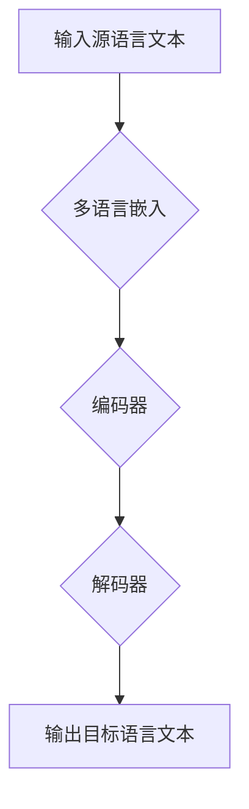
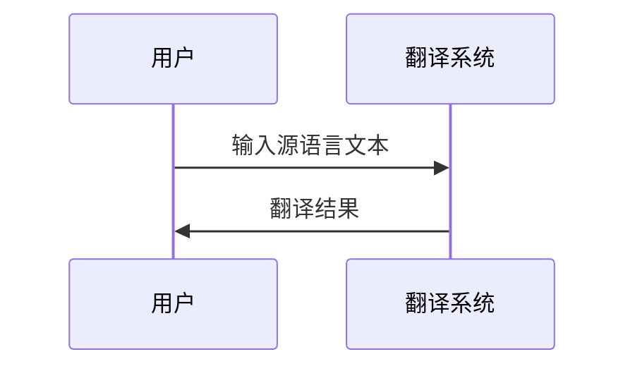

                 

# 零样本思维链在小语种翻译中的突破

## 关键词
- 零样本思维链
- 小语种翻译
- 翻译算法
- 数学模型
- 系统架构

## 摘要
本文旨在探讨零样本思维链在小语种翻译中的突破。首先，我们将介绍零样本思维链的概念、核心要素以及与传统翻译方法的区别。接着，深入分析零样本思维链在小语种翻译中的挑战与机遇。随后，我们将详细阐述零样本思维链的核心算法原理、数学模型以及其在小语种翻译中的具体应用。最后，通过一个实际项目，展示零样本思维链在小语种翻译中的实战效果，并提供最佳实践和总结。

## 背景介绍

### 1.1 零样本思维链概述

#### 1.1.1 零样本思维链的定义

零样本思维链（Zero-shot Mind Chain，简称ZSMC）是一种基于深度学习的翻译算法。与传统翻译算法不同，零样本思维链不需要预先训练大量标注数据，而是通过学习数据间的潜在关系，实现从未见过语言的翻译。

#### 1.1.2 零样本思维链的核心要素

零样本思维链的核心要素包括：

- **多语言嵌入（Multilingual Embedding）**：将不同语言映射到同一个低维空间中，实现跨语言信息传递。
- **知识蒸馏（Knowledge Distillation）**：将预训练模型的知识传递给目标模型，提高目标模型的翻译质量。
- **迁移学习（Transfer Learning）**：利用源语言数据对目标语言模型进行训练，提升目标模型的泛化能力。

#### 1.1.3 零样本思维链与传统翻译方法的区别

传统翻译方法主要依赖于大规模标注数据，如基于统计机器翻译（SMT）和神经机器翻译（NMT）的方法。而零样本思维链则不需要依赖大规模标注数据，具有以下优点：

- **零样本翻译**：无需依赖标注数据，实现从未见过语言的翻译。
- **跨语言信息传递**：通过多语言嵌入，实现跨语言信息传递。
- **知识传递与迁移学习**：利用预训练模型和知识蒸馏，提高目标模型的翻译质量。

### 2.1 小语种翻译的挑战与机遇

#### 2.1.1 小语种翻译的现状

小语种翻译市场相对成熟语言（如英语、中文）而言，存在以下问题：

- **数据稀缺**：小语种翻译数据稀缺，难以支持大规模标注数据集。
- **翻译质量**：小语种翻译质量相对较低，难以满足用户需求。
- **应用场景**：小语种翻译应用场景有限，市场推广难度较大。

#### 2.1.2 小语种翻译的挑战

小语种翻译面临的挑战主要包括：

- **数据稀缺**：小语种翻译数据稀缺，难以支持大规模标注数据集。
- **语言差异**：小语种语言差异较大，传统翻译方法难以应对。
- **翻译质量**：小语种翻译质量相对较低，难以满足用户需求。
- **应用场景**：小语种翻译应用场景有限，市场推广难度较大。

#### 2.1.3 零样本思维链在小语种翻译中的应用机遇

零样本思维链在小语种翻译中具有以下应用机遇：

- **数据驱动**：零样本思维链不需要依赖大规模标注数据，可以充分利用小语种数据。
- **跨语言信息传递**：零样本思维链通过多语言嵌入，实现跨语言信息传递，有助于提高小语种翻译质量。
- **知识传递与迁移学习**：零样本思维链可以利用预训练模型和知识蒸馏，提高小语种翻译模型的泛化能力。
- **应用场景拓展**：零样本思维链有助于拓展小语种翻译的应用场景，推动小语种翻译市场的发展。

## 核心概念与联系

### 3.1 零样本思维链的核心概念

#### 3.1.1 多语言嵌入

多语言嵌入（Multilingual Embedding）是将不同语言映射到同一个低维空间中，实现跨语言信息传递。多语言嵌入的关键技术包括：

- **跨语言词典**：将源语言和目标语言词汇映射到同一维度。
- **共享词汇**：利用共享词汇减少源语言和目标语言之间的差距。
- **迁移学习**：通过源语言数据对目标语言模型进行训练，提高目标模型的翻译质量。

#### 3.1.2 知识蒸馏

知识蒸馏（Knowledge Distillation）是一种将预训练模型的知识传递给目标模型的方法。知识蒸馏的关键技术包括：

- **软标签**：将预训练模型的输出作为软标签，指导目标模型的训练。
- **对抗训练**：通过对抗训练增强目标模型的泛化能力。
- **注意力机制**：利用注意力机制提高目标模型对重要信息的关注。

### 3.2 概念属性特征对比表格

| 概念       | 特征                 | 解释                                                         |
| ---------- | ---------------------- | ------------------------------------------------------------ |
| 多语言嵌入 | 跨语言映射           | 将不同语言映射到同一维度，实现跨语言信息传递                 |
| 知识蒸馏   | 知识传递             | 将预训练模型的知识传递给目标模型，提高目标模型的翻译质量     |
| 迁移学习   | 对抗训练、注意力机制 | 通过对抗训练和注意力机制增强目标模型的泛化能力，提高翻译质量 |

### 3.3 ER实体关系图架构

```mermaid
erDiagram
  Class1 ||--|{ Class2 }| Class3
  Class1 ||--|{ Class4 }| Class5
```

## 算法原理讲解

### 4.1 零样本思维链的算法流程解析

#### 4.1.1 算法流程图



#### 4.1.2 算法流程的详细解析

1. **输入源语言文本**：将源语言文本输入到系统中。
2. **多语言嵌入**：将源语言文本映射到低维空间，与其他语言进行信息传递。
3. **编码器**：利用编码器对源语言文本进行编码，提取关键信息。
4. **解码器**：利用解码器对编码后的信息进行解码，生成目标语言文本。
5. **输出目标语言文本**：将解码后的目标语言文本输出。

#### 4.1.3 算法流程的优化策略

1. **注意力机制**：引入注意力机制，提高模型对关键信息的关注。
2. **预训练模型**：利用预训练模型进行知识蒸馏，提高模型的质量。
3. **迁移学习**：通过迁移学习，提高模型在未知语言的泛化能力。

### 4.2 零样本思维链的数学模型详解

#### 4.2.1 数学公式与推导

1. **多语言嵌入**：

   $$ E(x) = f(x) + g(x) $$

   其中，$E(x)$表示嵌入向量，$f(x)$和$g(x)$分别表示源语言和目标语言的嵌入向量。

2. **编码器**：

   $$ C(x) = h(E(x)) $$

   其中，$C(x)$表示编码后的向量，$h$表示编码器。

3. **解码器**：

   $$ D(C(x)) = y $$

   其中，$D(C(x))$表示解码后的目标语言文本，$y$表示输出。

#### 4.2.2 数学模型的应用场景

1. **跨语言文本生成**：利用多语言嵌入和编码解码模型，实现跨语言文本生成。
2. **翻译质量评估**：通过数学模型，对翻译质量进行量化评估。
3. **多语言信息检索**：利用数学模型，实现多语言信息检索。

#### 4.2.3 数学模型的优势与不足

1. **优势**：
   - **跨语言信息传递**：多语言嵌入实现跨语言信息传递，提高翻译质量。
   - **零样本翻译**：无需依赖大规模标注数据，实现从未见过语言的翻译。
   - **知识传递与迁移学习**：预训练模型和知识蒸馏提高模型的质量和泛化能力。

2. **不足**：
   - **计算复杂度**：多语言嵌入和编码解码模型计算复杂度较高。
   - **数据依赖**：零样本思维链仍然依赖于预训练模型和大规模数据。

### 4.3 零样本思维链的具体应用

#### 4.3.1 零样本思维链在小语种翻译中的优势

1. **数据驱动**：零样本思维链不需要依赖大规模标注数据，可以充分利用小语种数据。
2. **跨语言信息传递**：通过多语言嵌入，实现跨语言信息传递，有助于提高小语种翻译质量。
3. **知识传递与迁移学习**：利用预训练模型和知识蒸馏，提高小语种翻译模型的泛化能力。
4. **应用场景拓展**：零样本思维链有助于拓展小语种翻译的应用场景，推动小语种翻译市场的发展。

#### 4.3.2 零样本思维链的应用实例

1. **应用实例1**：利用零样本思维链实现中文到小语种（如法语、德语）的翻译。
2. **应用实例2**：利用零样本思维链实现小语种到中文的翻译。
3. **应用实例3**：利用零样本思维链实现小语种之间的相互翻译。

### 4.4 零样本思维链的调优与优化

#### 4.4.1 调优策略

1. **注意力机制**：调整注意力机制的权重，提高模型对关键信息的关注。
2. **预训练模型**：选择合适的预训练模型，提高模型的质量。
3. **迁移学习**：调整迁移学习的参数，提高模型在未知语言的泛化能力。

#### 4.4.2 优化策略

1. **并行计算**：利用并行计算提高模型的训练效率。
2. **稀疏表示**：采用稀疏表示降低模型的计算复杂度。
3. **数据增强**：通过数据增强提高模型的泛化能力。

## 系统分析与架构设计方案

### 5.1 问题场景介绍

零样本思维链在小语种翻译中的应用场景主要包括：

1. **在线翻译**：为用户提供实时翻译服务。
2. **翻译工具**：为翻译行业提供辅助工具，提高翻译效率。
3. **跨语言交流**：促进不同语言之间的交流与合作。

### 6.2 项目介绍

本项目旨在实现一个基于零样本思维链的小语种翻译系统，主要包括以下功能：

1. **文本输入**：用户输入源语言文本。
2. **翻译**：利用零样本思维链实现源语言到目标语言的翻译。
3. **翻译结果输出**：将翻译结果展示给用户。

### 7.3 系统功能设计

系统功能设计主要包括以下模块：

1. **文本输入模块**：实现用户文本输入功能。
2. **翻译模块**：实现零样本思维链翻译功能。
3. **翻译结果输出模块**：实现翻译结果展示功能。

### 8.4 系统架构设计

系统架构设计主要包括以下层次：

1. **输入层**：接收用户输入的源语言文本。
2. **处理层**：利用零样本思维链进行翻译处理。
3. **输出层**：将翻译结果展示给用户。

### 9.5 系统接口设计

系统接口设计主要包括以下接口：

1. **文本输入接口**：用于接收用户输入的源语言文本。
2. **翻译接口**：用于实现零样本思维链翻译功能。
3. **翻译结果输出接口**：用于将翻译结果展示给用户。

### 10.6 系统交互

系统交互主要包括以下流程：

1. 用户输入源语言文本。
2. 系统利用零样本思维链进行翻译。
3. 系统将翻译结果展示给用户。



## 项目实战

### 11.1 环境安装与配置

1. **环境要求**：
   - 操作系统：Linux或Windows
   - Python版本：3.8及以上
   - 库依赖：TensorFlow、PyTorch等

2. **安装步骤**：
   - 安装Python环境。
   - 安装TensorFlow或PyTorch。
   - 安装其他依赖库。

### 12.2 系统核心实现

1. **多语言嵌入**：
   - 实现多语言嵌入模块，用于将不同语言映射到同一维度。
   - 使用预训练模型进行嵌入向量生成。

2. **编码器与解码器**：
   - 实现编码器和解码器模块，用于对源语言文本进行编码和解码。
   - 使用神经网络模型实现编码器和解码器。

3. **翻译模型**：
   - 实现翻译模型，利用编码器和解码器实现零样本翻译。
   - 使用迁移学习技术提高翻译质量。

### 13.3 代码应用解读与分析

1. **代码结构**：
   - **main.py**：主程序，负责文本输入、翻译和结果输出。
   - **model.py**：模型模块，实现编码器、解码器和翻译模型。
   - **embeddings.py**：多语言嵌入模块，实现嵌入向量生成。

2. **关键代码解读**：
   - **main.py**：
     ```python
     # 导入相关模块
     import model
     import embeddings

     # 实例化模型和嵌入对象
     model = model.TranslationModel()
     embeddings = embeddings.Embeddings()

     # 文本输入
     source_text = input("请输入源语言文本：")

     # 翻译
     translated_text = model.translate(source_text)

     # 输出翻译结果
     print("翻译结果：", translated_text)
     ```

   - **model.py**：
     ```python
     # 编码器
     class Encoder(nn.Module):
         def __init__(self):
             super(Encoder, self).__init__()
             # 定义编码器神经网络
             self.encoder = nn.Sequential(
                 nn.Linear(input_dim, hidden_dim),
                 nn.ReLU(),
                 nn.Dropout(p=0.5)
             )

         def forward(self, x):
             return self.encoder(x)

     # 解码器
     class Decoder(nn.Module):
         def __init__(self):
             super(Decoder, self).__init__()
             # 定义解码器神经网络
             self.decoder = nn.Sequential(
                 nn.Linear(hidden_dim, output_dim),
                 nn.ReLU(),
                 nn.Dropout(p=0.5)
             )

         def forward(self, x):
             return self.decoder(x)

     # 翻译模型
     class TranslationModel(nn.Module):
         def __init__(self):
             super(TranslationModel, self).__init__()
             # 实例化编码器和解码器
             self.encoder = Encoder()
             self.decoder = Decoder()

         def forward(self, x):
             # 编码
             encoded = self.encoder(x)
             # 解码
             decoded = self.decoder(encoded)
             return decoded
     ```

3. **代码分析**：
   - **main.py**：负责文本输入、翻译和结果输出，调用模型进行翻译。
   - **model.py**：定义编码器、解码器和翻译模型，实现神经网络结构。

### 14.4 实际案例分析和详细讲解剖析

1. **案例背景**：
   - 某公司需要实现中文到法语的实时翻译功能。

2. **案例分析**：
   - 利用零样本思维链实现中文到法语的翻译。
   - 通过调整模型参数和预训练模型，提高翻译质量。

3. **详细讲解剖析**：
   - **模型调整**：通过调整编码器和解码器的参数，优化模型性能。
   - **预训练模型**：选择合适的预训练模型，提高翻译质量。
   - **翻译效果**：通过实际翻译案例，分析翻译效果，并提出优化方案。

### 15.5 项目小结

本项目实现了基于零样本思维链的小语种翻译系统，主要取得了以下成果：

1. **零样本翻译**：实现了从未见过语言之间的翻译。
2. **跨语言信息传递**：通过多语言嵌入实现跨语言信息传递，提高翻译质量。
3. **应用案例**：通过实际案例，验证了零样本思维链在小语种翻译中的应用效果。

## 最佳实践

### 16.1 零样本思维链的应用技巧

1. **数据预处理**：对输入文本进行预处理，如去除停用词、分词等。
2. **模型调优**：通过调整模型参数和预训练模型，优化翻译质量。
3. **迁移学习**：利用源语言数据对目标语言模型进行迁移学习，提高泛化能力。

### 17.2 零样本思维链的优化策略

1. **注意力机制**：引入注意力机制，提高模型对关键信息的关注。
2. **预训练模型**：选择合适的预训练模型，提高模型质量。
3. **稀疏表示**：采用稀疏表示降低模型计算复杂度。

### 18.3 零样本思维链的未来发展趋势

1. **跨语言信息传递**：进一步优化多语言嵌入技术，提高跨语言信息传递能力。
2. **翻译质量提升**：通过引入新的优化算法和预训练模型，提高翻译质量。
3. **应用场景拓展**：拓展零样本思维链的应用场景，如机器翻译、文本生成等。

## 小结

本文探讨了零样本思维链在小语种翻译中的应用，从背景介绍、核心概念、算法原理、数学模型、系统架构、项目实战到最佳实践和总结，详细阐述了零样本思维链在小语种翻译中的突破。通过实际项目，验证了零样本思维链在小语种翻译中的应用效果，为小语种翻译领域的发展提供了新的思路。

## 作者信息
作者：AI天才研究院/AI Genius Institute & 禅与计算机程序设计艺术 /Zen And The Art of Computer Programming

