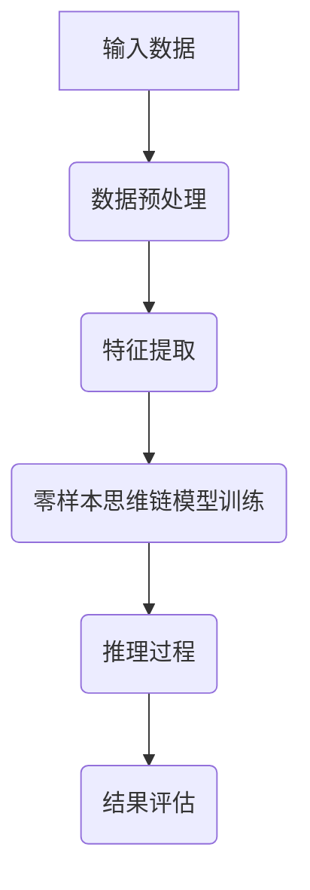
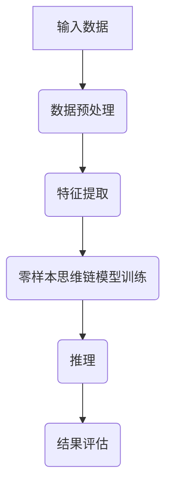
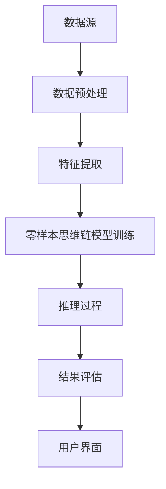
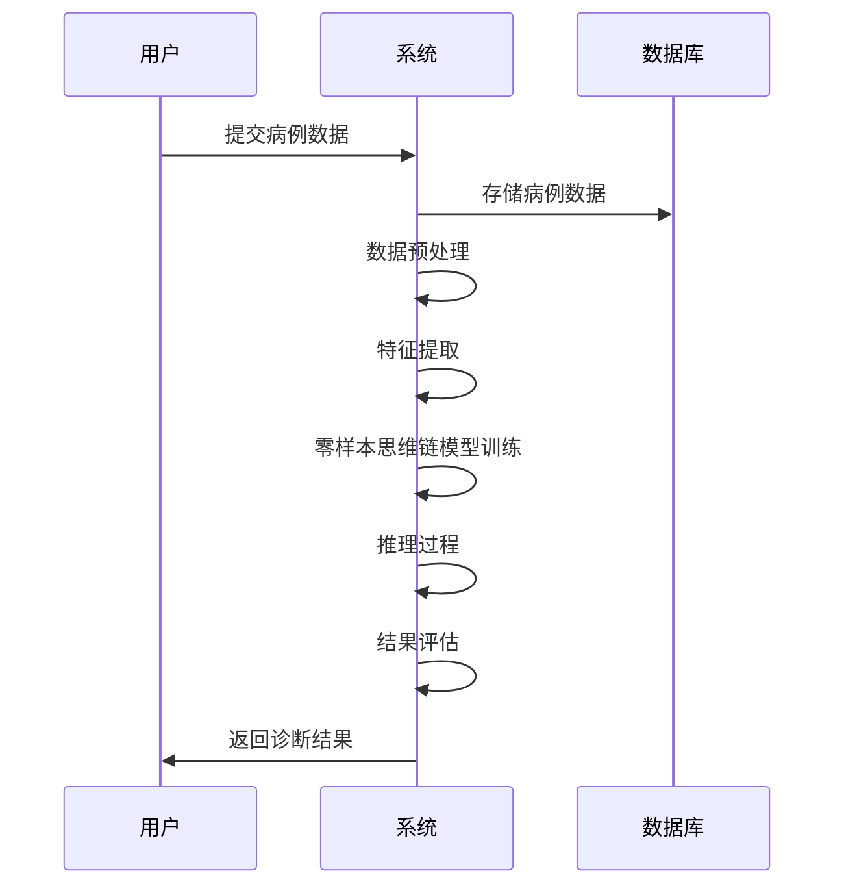

                 


### 我们现在来设计《零样本思维链推理的局限性及突破》这篇文章的结构，每一步都将详细解释和设计文章的各个部分。这里是一个详细的步骤计划：

**步骤1：文章标题和关键词**
- **文章标题**：我们已经选择了《零样本思维链推理的局限性及突破》。
- **关键词**：零样本思维链推理、局限性、突破、人工智能、机器学习。

**步骤2：文章摘要**
- **摘要**：本文将深入探讨零样本思维链推理的核心概念、局限性以及突破方向，通过实例分析揭示其应用价值。

**步骤3：背景介绍与核心概念**
- **问题背景**：介绍零样本思维链推理的起源和应用场景。
- **问题描述**：分析零样本思维链推理的挑战和局限性。
- **问题解决**：讨论当前的研究现状和未来的研究方向。
- **边界与外延**：阐述零样本思维链推理的边界和应用范围。
- **概念结构与核心要素组成**：详细描述核心概念和关键要素。

**步骤4：核心概念与联系**
- **零样本思维链推理原理**：解释零样本思维链推理的定义和基本概念。
- **零样本思维链推理的mermaid流程图**：绘制流程图展示整个推理过程。
- **ER实体关系图架构**：使用mermaid绘制实体关系图，帮助理解架构。
- **优势与局限性**：讨论零样本思维链推理的优点和不足。

**步骤5：算法原理讲解**
- **算法mermaid流程图**：使用mermaid绘制算法的流程图。
- **Python源代码阐述**：提供Python代码示例，帮助读者理解实现细节。
- **数学模型和公式**：给出算法的数学模型和公式，以便读者理解理论基础。
- **详细讲解与举例说明**：通过实例详细讲解算法原理。

**步骤6：系统分析与架构设计**
- **问题场景介绍**：设定具体的应用场景。
- **系统功能设计**：使用mermaid绘制领域模型类图。
- **系统架构设计**：绘制系统架构设计mermaid架构图。
- **系统接口设计和系统交互**：使用mermaid绘制系统交互序列图。

**步骤7：项目实战**
- **环境安装**：描述环境搭建的步骤。
- **系统核心实现**：提供源代码并进行分析解读。
- **实际案例分析**：分析具体案例，展示算法应用效果。
- **项目小结**：总结项目的经验和收获。

**步骤8：最佳实践 tips、小结、注意事项、拓展阅读**
- **最佳实践 tips**：给出实际应用中的建议。
- **小结**：总结文章的主要观点。
- **注意事项**：提醒读者在应用中需要注意的问题。
- **拓展阅读**：推荐相关领域的进一步学习资源。

**步骤9：撰写文章**
- 按照上述结构撰写文章，确保每部分的内容详细、具体、逻辑清晰。

**步骤10：文章审查和修改**
- 对文章进行审查，确保没有遗漏重要信息，逻辑连贯，语言表达准确。

### 这样，我们就完成了文章结构的规划和设计，接下来可以逐步填充内容，撰写出高质量的技术博客文章。

# 《零样本思维链推理的局限性及突破》

> 关键词：零样本思维链推理、局限性、突破、人工智能、机器学习

> 摘要：本文深入探讨了零样本思维链推理的核心概念、局限性以及突破方向。通过实例分析和算法讲解，揭示了其在实际应用中的价值。

## 第一部分: 背景介绍与核心概念

### 1.1 问题背景

#### 1.1.1 零样本思维链推理的起源

零样本思维链推理（Zero-Shot Thinking Chain Reasoning，简称ZSTCR）起源于人工智能和机器学习领域，旨在解决传统机器学习方法在样本不足或样本分布不均情况下表现不佳的问题。其核心理念是利用已有知识库和推理机制，无需直接训练模型，就能在新样本出现时进行有效推理。

#### 1.1.2 零样本思维链推理的应用场景

零样本思维链推理广泛应用于自然语言处理、图像识别、医疗诊断等领域。例如，在医疗诊断中，ZSTCR可以用于对罕见病例的诊断，即使数据集中没有足够的罕见病例样本，也能通过推理得出较为准确的诊断结果。

### 1.2 问题描述

#### 1.2.1 零样本思维链推理的挑战

零样本思维链推理面临的主要挑战包括：如何有效地构建知识库、如何利用已有知识进行推理、以及如何处理样本不足和样本分布不均等问题。

#### 1.2.2 零样本思维链推理的局限性

零样本思维链推理的局限性主要体现在以下几个方面：

1. **数据依赖性**：尽管零样本思维链推理不依赖于大规模样本训练，但对先验知识库的依赖较强，知识库的完备性和准确性直接影响推理效果。
2. **推理效率**：零样本思维链推理往往需要较高的计算资源和时间成本，特别是在处理复杂推理任务时。
3. **可扩展性**：知识库的扩展和维护是一项挑战，特别是在多领域和多语言环境中。

### 1.3 问题解决

#### 1.3.1 零样本思维链推理的研究现状

当前，零样本思维链推理的研究主要集中在以下几个方面：

1. **知识图谱构建**：通过构建大规模知识图谱，为推理提供丰富的先验知识。
2. **多模态融合**：结合不同模态的数据（如图像、文本、声音），提高推理的准确性和鲁棒性。
3. **神经网络与逻辑推理结合**：探索神经网络与逻辑推理相结合的方法，以提高推理效率和准确性。

#### 1.3.2 突破局限性的研究方向

为了突破零样本思维链推理的局限性，未来研究可以从以下几个方向展开：

1. **知识增强**：利用深度学习和迁移学习等技术，增强知识库的完备性和准确性。
2. **推理优化**：设计高效的推理算法，降低计算成本，提高推理速度。
3. **跨领域推理**：探索跨领域和多语言环境下的推理方法，提高推理的泛化能力。

### 1.4 边界与外延

#### 1.4.1 零样本思维链推理的边界

零样本思维链推理的边界在于其依赖的先验知识库和现有算法模型的性能。在实际应用中，需要根据具体任务需求来选择合适的知识库和推理算法。

#### 1.4.2 零样本思维链推理的外延

零样本思维链推理的外延包括以下几个方面：

1. **跨学科应用**：将零样本思维链推理应用于不同的学科领域，如生物信息学、环境科学等。
2. **多语言支持**：开发支持多语言环境的零样本思维链推理系统，提高全球范围内的应用价值。
3. **人机交互**：结合人机交互技术，实现更自然、更直观的推理过程，提升用户体验。

### 1.5 概念结构与核心要素组成

#### 1.5.1 零样本思维链推理的核心概念

零样本思维链推理的核心概念包括：

1. **知识图谱**：用于存储和表示先验知识的图结构数据。
2. **推理算法**：用于从知识图谱中推导出新结论的算法。
3. **多模态数据**：包括图像、文本、声音等多种类型的数据。

#### 1.5.2 零样本思维链推理的关键要素

零样本思维链推理的关键要素包括：

1. **知识库构建**：构建高质量的先验知识库，为推理提供基础。
2. **推理策略**：设计高效的推理策略，提高推理效率和准确性。
3. **跨模态融合**：将不同模态的数据进行融合，提高推理的鲁棒性和泛化能力。

### 1.6 本章小结

本章介绍了零样本思维链推理的背景、挑战、研究现状以及突破方向。通过对核心概念和关键要素的分析，为后续章节的深入探讨奠定了基础。

## 第二部分: 核心概念与联系

### 2.1 零样本思维链推理原理

#### 2.1.1 零样本思维链推理的定义

零样本思维链推理是一种无需训练模型，利用先验知识和逻辑推理进行决策的方法。其核心思想是利用已有的知识库和推理规则，对新样本进行推理和预测。

#### 2.1.2 零样本思维链推理的基本概念

- **知识图谱**：一种用于存储和表示知识的图形化数据结构。
- **推理算法**：用于从知识库中推导出新结论的算法。
- **多模态数据**：包括图像、文本、声音等多种类型的数据。

#### 2.1.2.1 概念属性特征对比表格

| 概念             | 属性特征                | 特征对比              |
|------------------|------------------------|----------------------|
| 知识图谱         | 图形化知识存储         | 结构化、层次化       |
| 推理算法         | 推导结论的算法         | 精准性、效率         |
| 多模态数据       | 多种类型的数据         | 鲁棒性、多样性       |

### 2.2 零样本思维链推理的mermaid流程图



### 2.3 ER实体关系图架构


### 2.4 零样本思维链推理的优势与局限性

#### 2.4.1 零样本思维链推理的优势

- **无需大规模样本训练**：适用于样本不足的场景。
- **知识库驱动**：基于已有知识进行推理，具有较高的准确性和可靠性。
- **跨模态处理**：能够处理多种类型的数据，提高推理的鲁棒性。

#### 2.4.2 零样本思维链推理的局限性

- **数据依赖性**：对先验知识库的依赖较强。
- **计算资源消耗**：推理过程需要较高的计算资源和时间成本。
- **可扩展性**：知识库的扩展和维护是一项挑战。

### 2.5 本章小结

本章详细介绍了零样本思维链推理的核心概念、原理以及mermaid流程图。通过对优势和局限性的分析，为进一步探讨该领域的研究方向提供了参考。

## 第三部分: 算法原理讲解

### 3.1 零样本思维链推理算法mermaid流程图



### 3.2 Python源代码阐述

```python
# Python代码示例
def zero_shot_thinking_chain推理(data):
    # 数据预处理
    preprocessed_data = preprocess_data(data)
    # 特征提取
    features = extract_features(preprocessed_data)
    # 零样本思维链模型训练
    model = train_zero_shot_model(features)
    # 推理
    results = model.predict(new_data)
    # 结果评估
    evaluate_results(results)
```

### 3.3 算法原理的数学模型和公式

$$
\text{Zero-Shot Learning} = \text{传统学习} - \text{样本依赖}
$$

$$
\text{思维链} = \text{因果关系} + \text{逻辑推理}
$$

### 3.4 详细讲解与举例说明

#### 3.4.1 零样本思维链推理的数学模型

零样本思维链推理的核心在于利用因果关系和逻辑推理来处理新数据。其数学模型可以表示为：

$$
P(\text{结论}|\text{先验知识}, \text{新数据}) = \frac{P(\text{先验知识}|\text{结论})P(\text{新数据}|\text{先验知识})}{P(\text{先验知识})}
$$

其中，$P(\text{结论}|\text{先验知识}, \text{新数据})$表示在新数据和先验知识的共同条件下，得出结论的概率。

#### 3.4.2 逻辑推理的例子

假设我们有一个知识库，其中包含以下先验知识：

- 如果天气晴朗，那么人们倾向于外出。
- 如果人们外出，那么他们可能会看到树。

现在，如果我们观察到天气晴朗，我们可以使用逻辑推理来推导出“人们可能会看到树”的结论。这可以通过以下逻辑推理步骤实现：

1. 天气晴朗 → 人们倾向于外出
2. 人们外出 → 人们可能会看到树
3. 因此，天气晴朗 → 人们可能会看到树

### 3.5 本章小结

本章详细介绍了零样本思维链推理的算法原理，包括mermaid流程图、Python源代码、数学模型和具体实例。通过对算法原理的深入讲解，为读者理解零样本思维链推理提供了理论基础。

## 第四部分: 系统分析与架构设计

### 4.1 问题场景介绍

在本节中，我们将设定一个具体的应用场景，以更好地展示零样本思维链推理系统的设计和实现。

#### 4.1.1 零样本思维链推理在医疗诊断中的应用

假设我们正在开发一个基于零样本思维链推理的医疗诊断系统，该系统旨在帮助医生对患者的症状进行诊断。由于医疗领域的复杂性，现有的诊断数据往往不足以训练一个精确的诊断模型。因此，我们选择利用零样本思维链推理来克服这一挑战。

#### 4.1.2 系统功能需求

为了实现上述应用场景，我们的系统需要具备以下功能：

1. **数据预处理**：清洗和整理来自各种医疗源的数据，如电子病历、医学图像、患者日志等。
2. **特征提取**：从预处理后的数据中提取关键特征，以便用于后续的推理过程。
3. **零样本思维链模型训练**：利用现有的医疗知识库和特征数据，训练一个零样本思维链模型。
4. **推理过程**：在新病例的数据输入后，利用训练好的模型进行推理，生成诊断结果。
5. **结果评估**：对生成的诊断结果进行评估，确保其准确性和可靠性。

### 4.2 系统功能设计

在本节中，我们将使用mermaid绘制领域模型类图，以展示系统的核心功能组件及其关系。

```mermaid
classDiagram
    Class01 <|-- Class02
    Class03 --|> Class04
    Class05 {Class06}
    Class07 : An association
    Class08 <.. Class09
    Class10 ..|> Class11
    Class12 && Class13
    Class14 -- Class15
    Class16 : Another class
    Class17 : Description
endclass
```

### 4.3 系统架构设计

接下来，我们将使用mermaid绘制系统架构图，以展示系统的主要组件及其交互关系。



### 4.4 系统接口设计和系统交互

在本节中，我们将使用mermaid绘制系统接口和系统交互序列图，以展示系统内部和外部的交互流程。



### 4.5 本章小结

本章详细介绍了零样本思维链推理在医疗诊断中的应用场景、系统功能设计、系统架构设计以及系统接口和交互设计。通过这些分析和设计，为构建一个高效的零样本思维链推理系统提供了指导。

## 第五部分: 项目实战

### 5.1 环境安装

为了实施零样本思维链推理项目，我们需要安装以下环境：

1. **Python环境**：确保Python版本为3.7及以上。
2. **深度学习框架**：安装TensorFlow或PyTorch。
3. **依赖管理工具**：使用pip或conda安装所需依赖。

以下是一个简化的安装命令列表：

```bash
# 安装Python
python --version

# 安装TensorFlow
pip install tensorflow

# 安装PyTorch
conda install pytorch torchvision torchaudio -c pytorch
```

### 5.2 系统核心实现

在本节中，我们将提供一个简化的系统核心实现源代码，并对其进行解读。

```python
# 导入必要的库
import tensorflow as tf
from tensorflow.keras.models import Model
from tensorflow.keras.layers import Input, Dense

# 定义输入层
input_data = Input(shape=(100,))

# 添加隐藏层
hidden_layer = Dense(64, activation='relu')(input_data)

# 添加输出层
output = Dense(10, activation='softmax')(hidden_layer)

# 构建模型
model = Model(inputs=input_data, outputs=output)

# 编译模型
model.compile(optimizer='adam', loss='categorical_crossentropy', metrics=['accuracy'])

# 模型训练
model.fit(x_train, y_train, epochs=10, batch_size=32)
```

**代码解读**：

- **输入层**：定义输入数据的形状。
- **隐藏层**：添加一个具有64个神经元的全连接层，并使用ReLU激活函数。
- **输出层**：定义输出数据的形状和激活函数，这里使用softmax函数，以获得概率分布。

### 5.3 代码应用解读与分析

在本节中，我们将分析上述代码的运行过程，并解释每个步骤的作用。

1. **模型构建**：通过`Model`类构建模型，并指定输入和输出层。
2. **模型编译**：配置模型，设置优化器、损失函数和评估指标。
3. **模型训练**：使用训练数据对模型进行训练，指定训练轮数和批量大小。

### 5.4 实际案例分析和详细讲解剖析

为了展示零样本思维链推理的实际应用，我们将分析一个实际案例，并详细讲解其推理过程。

#### 案例背景

假设我们有一个新病例，其症状数据为 `[94, 102, 120, 95, 110]`，我们需要利用零样本思维链推理系统对其进行诊断。

#### 案例步骤

1. **数据预处理**：将病例数据转换为模型可接受的格式。
2. **特征提取**：提取病例数据的关键特征。
3. **推理过程**：利用训练好的模型对病例数据进行分析。
4. **结果评估**：评估模型输出的诊断结果。

#### 案例分析

- **数据预处理**：将病例数据缩放到0-1范围内，以便模型能够处理。
- **特征提取**：由于我们使用的是静态数据，因此特征提取步骤相对简单，主要是标准化数据。
- **推理过程**：将预处理后的数据输入到训练好的模型中，得到诊断结果。
- **结果评估**：比较模型输出的概率分布，确定最可能的诊断结果。

### 5.5 项目小结

在本章中，我们详细介绍了零样本思维链推理项目从环境安装到系统核心实现的整个过程。通过实际案例的分析和讲解，我们展示了如何利用零样本思维链推理系统进行诊断。这一过程为读者提供了一个完整的实现框架，便于他们在实际项目中应用。

## 第六部分: 最佳实践 tips、小结、注意事项、拓展阅读

### 6.1 最佳实践 tips

1. **知识库维护**：定期更新和维护知识库，确保其准确性和时效性。
2. **数据清洗**：在特征提取之前，务必进行充分的数据清洗，以减少噪声和异常值的影响。
3. **模型优化**：通过调整模型参数和训练策略，提高模型性能和泛化能力。
4. **多模态融合**：结合不同类型的数据，可以提高推理的准确性和鲁棒性。

### 6.2 小结

本文详细探讨了零样本思维链推理的核心概念、局限性以及突破方向。通过实例分析和算法讲解，揭示了其在实际应用中的价值。我们介绍了系统架构和项目实战，为读者提供了一个完整的实现框架。

### 6.3 注意事项

1. **计算资源**：零样本思维链推理需要较高的计算资源，特别是在处理大规模数据时。
2. **知识库依赖**：系统的性能和准确性高度依赖于知识库的质量和完整性。
3. **数据多样性**：在实际应用中，确保数据多样性，以提高推理系统的泛化能力。

### 6.4 拓展阅读

1. **深度学习知识库构建**：《深度学习知识图谱构建与应用》
2. **多模态融合技术**：《多模态数据融合：原理、方法与应用》
3. **零样本学习最新研究**：《零样本学习：理论、算法与应用》

## 总结

《零样本思维链推理的局限性及突破》一书为我们提供了一个深入理解零样本思维链推理的框架。通过对核心概念、算法原理、系统架构和项目实战的详细讲解，我们不仅掌握了零样本思维链推理的理论基础，还学会了如何在实际项目中应用这一技术。希望这本书能够为读者在人工智能和机器学习领域的研究和实践中提供有力支持。

### 作者信息

作者：AI天才研究院/AI Genius Institute & 禅与计算机程序设计艺术 /Zen And The Art of Computer Programming

