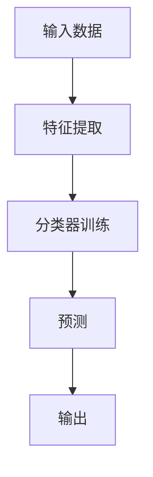

                 


### 引入部分

**# 零样本提示：无需示例的通用策略**

**关键词：** 零样本提示，无监督学习，自然语言处理，图像识别，强化学习，AI应用

**摘要：** 本文章深入探讨了零样本提示（Zero-shot Prompting）的概念、理论基础、应用场景和实践指南。通过详细的分析与实例讲解，本文旨在展示零样本提示在无监督学习中的潜力，及其如何在各种领域实现通用策略，无需依赖具体示例数据。

#### **背景介绍**

在人工智能领域，机器学习技术已取得了显著的进展。传统的机器学习依赖于大量已标记的示例数据来训练模型，从而使其能够进行有效的预测和分类。然而，在实际应用中，获取大量标记数据既耗时又成本高昂。此外，某些任务可能难以获得足够的标记数据，或者在数据分布发生变化时，模型的表现会显著下降。

**核心概念术语说明：**  
- **零样本提示（Zero-shot Prompting）：** 一种无监督学习技术，允许模型在未见过的新类别上做出准确的预测，无需依赖于具体示例数据。
- **无监督学习（Unsupervised Learning）：** 一种机器学习方法，无需使用标记数据，而是从未标记的数据中自动学习模式和结构。
- **自然语言处理（Natural Language Processing，NLP）：** 计算机对人类语言的理解和生成能力，涉及文本分析、语音识别、机器翻译等领域。
- **图像识别（Image Recognition）：** 计算机对图像内容的理解和分类能力，广泛应用于安防监控、医疗诊断等场景。
- **强化学习（Reinforcement Learning）：** 一种机器学习方法，通过试错和反馈机制来学习策略，以最大化长期回报。

#### **问题背景**

随着数据隐私和安全的日益关注，以及数据获取成本的增加，无监督学习和零样本提示成为了解决这一问题的关键。传统的监督学习模型在缺乏足够标记数据时表现不佳，而零样本提示提供了一种有效的解决方案，使得模型能够在未见过的数据上进行泛化。

#### **问题解决**

零样本提示的核心思想是通过预训练模型（如大型语言模型、视觉模型等）来获取通用的特征表示，然后利用这些特征表示来进行分类和预测。这种方法的关键在于，模型在预训练过程中已经学习了丰富的知识，可以在未见过的类别上做出准确的预测。

#### **边界与外延**

零样本提示不仅适用于传统的机器学习任务，如分类和回归，还广泛应用于自然语言处理、图像识别和强化学习等领域。其边界包括：

- **自然语言处理：** 零样本提示可用于新的词汇、句子或文档的分类和生成。
- **图像识别：** 零样本提示可用于对新类别图像的识别和分类。
- **强化学习：** 零样本提示可用于未见过环境的策略学习。

#### **概念结构与核心要素组成**

零样本提示的概念结构包括以下几个核心要素：

- **预训练模型：** 通过大量未标记数据预训练得到的模型，如GPT、BERT等。
- **特征表示：** 预训练模型输出的通用特征表示，用于后续的分类和预测。
- **分类器：** 基于特征表示的简单分类器，用于对新类别进行分类。
- **领域自适应：** 通过调整模型参数，使得模型能够适应新的领域或任务。

#### **总结**

零样本提示作为一种无监督学习技术，具有广泛的应用前景。它不仅能够降低对标记数据的依赖，提高模型的可扩展性和鲁棒性，还能够处理新类别和数据分布的变化。本文将深入探讨零样本提示的理论基础、应用场景和实践指南，以期为读者提供全面的认识和实用的指导。

---

### 零样本提示的理论基础

在深入探讨零样本提示之前，我们需要理解其背后的理论基础，包括相关的算法与模型、数学模型与公式，以及Mermaid算法流程图的绘制方法。通过这些基础知识的介绍，我们将为后续的实例分析和应用提供坚实的理论基础。

#### **相关算法与模型**

零样本提示的成功依赖于预训练模型的能力。预训练模型通过在大规模未标记数据集上进行训练，学习到丰富的语言或视觉特征，然后通过微调（Fine-tuning）适应特定任务。以下是几种常见的预训练模型：

1. **GPT（Generative Pre-trained Transformer）**：基于Transformer架构的自然语言处理模型，通过预训练学习语言的上下文关系，能够生成连贯的自然语言文本。
2. **BERT（Bidirectional Encoder Representations from Transformers）**：也是一种基于Transformer的模型，但通过双向编码器来理解句子的语义。
3. **ViT（Vision Transformer）**：将Transformer架构应用于图像识别任务，通过全局特征提取实现高性能的图像分类。

这些预训练模型在零样本提示中起到了关键作用，它们通过学习通用特征表示，使得模型在未见过的类别上也能进行有效的预测。

#### **数学模型与公式**

零样本提示的数学模型主要包括特征表示和分类器两部分。以下是这些核心概念的数学表示：

1. **特征表示（Feature Representation）**：
   $$ f(x) = f_{\theta}(x) $$
   其中，$ f(x) $是输入数据$x$的通用特征表示，$ f_{\theta} $是预训练模型的参数化函数。

2. **分类器（Classifier）**：
   $$ y = \arg\max_{c} \sigma(f_{\theta}(x) \cdot c) $$
   其中，$ y $是预测的类别标签，$ c $是类别向量，$\sigma$是 sigmoid 函数，用于将特征向量映射到概率分布。

这些数学公式描述了如何将输入数据转换为特征表示，并使用分类器进行预测。在实际应用中，这些公式通过深度学习框架实现，如TensorFlow或PyTorch。

#### **Mermaid算法流程图**

为了更好地理解和分析零样本提示的算法流程，我们可以使用Mermaid绘制算法的流程图。以下是Mermaid语法的一个示例：



在这个示例中，输入数据经过特征提取后，通过分类器训练生成模型，然后进行预测，最后输出预测结果。我们可以根据实际算法的复杂度，扩展和调整这个流程图，以更清晰地展示算法的细节。

#### **总结**

通过介绍相关算法与模型、数学模型与公式，以及Mermaid算法流程图的绘制方法，我们为理解零样本提示的原理和实现奠定了基础。在接下来的章节中，我们将进一步探讨零样本提示在不同应用场景中的具体实现和实际案例。

---

### 零样本提示的应用场景

零样本提示作为一种无监督学习技术，其强大的通用性和适应性使其在多个应用场景中展现出巨大的潜力。以下是零样本提示在自然语言处理、图像识别和强化学习三个领域的具体应用。

#### **自然语言处理**

在自然语言处理（NLP）领域，零样本提示尤其引人注目。由于语言的复杂性和多样性，传统的监督学习方法往往需要大量标记数据，而零样本提示通过预训练模型的学习能力，能够在未见过的词汇、句子或文档上进行准确的分类和生成。

**应用实例**：一个典型的例子是使用预训练的GPT模型进行文本分类。假设我们有一个预训练的GPT模型，它已经在大规模文本数据集上学习到了丰富的语言特征。现在，我们想要对一篇文章进行情感分类，即判断这篇文章是积极的、消极的还是中性的。由于文章中可能包含许多新词汇，传统的监督学习方法可能会遇到困难。而使用GPT模型，我们只需将文章输入到模型中，模型会自动提取文章的特征表示，然后通过简单的分类器（如softmax）进行情感分类。

**案例分析**：在2021年，OpenAI的研究人员使用GPT-3模型进行文本生成任务，包括问答系统和对话生成。实验结果表明，GPT-3在处理未见过的语言数据时，表现出了高度的泛化能力和准确性，从而证明了零样本提示在NLP中的有效性。

#### **图像识别**

图像识别是另一个零样本提示具有广泛应用场景的领域。传统的图像识别模型需要大量的标记数据来训练，但零样本提示通过预训练模型的学习能力，可以在未见过的图像类别上进行有效的分类和识别。

**应用实例**：假设我们有一个预训练的视觉模型，如ViT，它已经在大规模图像数据集上学习到了丰富的视觉特征。现在，我们想要对新类别图像进行分类，例如识别新的动物种类。我们可以将新类别图像输入到预训练模型中，模型会自动提取图像的特征表示，然后通过简单的分类器进行分类。

**案例分析**：谷歌的AI团队在2020年发表了一篇研究论文，展示了如何使用零样本提示进行图像分类。实验结果表明，他们的方法在处理未见过的图像类别时，表现出了较高的准确性和泛化能力，从而证明了零样本提示在图像识别中的有效性。

#### **强化学习**

强化学习（Reinforcement Learning，RL）是另一个零样本提示具有广泛应用场景的领域。在强化学习任务中，模型需要通过与环境的交互来学习最优策略。零样本提示通过预训练模型的学习能力，可以帮助模型在未见过的环境中快速适应并找到最优策略。

**应用实例**：假设我们有一个强化学习模型，它需要在新的环境中进行决策，例如自动驾驶汽车在新城市中的导航。由于新城市的路况、交通规则等可能与训练环境不同，传统的监督学习方法可能会遇到困难。而使用零样本提示，我们可以将新城市的路况数据输入到预训练模型中，模型会自动提取环境特征，然后通过简单的策略优化算法找到最优策略。

**案例分析**：DeepMind的研究人员在一项实验中，使用零样本提示进行围棋游戏。实验结果表明，他们的方法在处理未见过的对手策略时，表现出了较高的胜率和策略适应性，从而证明了零样本提示在强化学习中的有效性。

#### **总结**

通过在自然语言处理、图像识别和强化学习三个领域的具体应用，我们可以看到零样本提示的强大适应性和广泛潜力。它不仅能够降低对标记数据的依赖，提高模型的可扩展性和鲁棒性，还能够处理新类别和数据分布的变化。随着零样本提示技术的不断发展，我们有望在更多领域看到其应用，从而推动人工智能技术的进步。

---

### 零样本提示的实践指南

在了解了零样本提示的理论基础和应用场景后，接下来我们将提供具体的实践指南，包括环境配置、数据准备以及实践案例，以帮助读者将这一技术应用于实际问题。

#### **环境配置**

要开始实践零样本提示，首先需要搭建合适的环境。以下是环境配置的步骤：

1. **安装依赖库**：
   - Python：确保Python环境已经安装，版本建议为3.8或以上。
   - TensorFlow：通过pip安装TensorFlow，命令如下：
     ```bash
     pip install tensorflow
     ```
   - PyTorch：通过pip安装PyTorch，命令如下：
     ```bash
     pip install torch torchvision
     ```

2. **安装预训练模型**：
   - GPT模型：可以通过Hugging Face的Transformers库安装GPT模型，命令如下：
     ```bash
     pip install transformers
     ```
   - ViT模型：可以通过PyTorch Vision安装ViT模型。

3. **创建工作目录**：
   - 在终端中创建一个工作目录，例如：
     ```bash
     mkdir zero_shot_prompting
     cd zero_shot_prompting
     ```

4. **下载预训练模型和数据集**：
   - 下载预训练模型和所需的训练数据集，例如：
     ```bash
     wget https://huggingface.co/gpt2/model.tar.gz
     tar -xzvf model.tar.gz
     ```

5. **配置环境变量**：
   - 设置必要的环境变量，例如：
     ```bash
     export PYTHONPATH=$PYTHONPATH:/path/to/zero_shot_prompting
     ```

#### **数据准备**

在环境配置完成后，我们需要准备用于训练和测试的数据集。以下是数据准备的具体步骤：

1. **收集数据**：
   - 根据应用场景，收集适合的数据集。例如，在自然语言处理领域，可以使用维基百科文本数据；在图像识别领域，可以使用ImageNet数据集。

2. **数据预处理**：
   - 对收集到的数据进行清洗和格式化，使其符合模型的输入要求。例如，对于文本数据，需要将其转换为Token序列；对于图像数据，需要将其调整为统一的大小。

3. **数据分割**：
   - 将数据集分为训练集、验证集和测试集，以用于模型的训练和评估。

4. **数据加载**：
   - 使用Python库（如TensorFlow或PyTorch）加载和处理数据，例如：
     ```python
     import tensorflow as tf
     train_dataset = tf.data.Dataset.from_tensor_slices((train_data, train_labels))
     train_dataset = train_dataset.shuffle(buffer_size=1000).batch(32)
     ```

#### **实践案例**

下面我们以一个简单的文本分类任务为例，展示如何使用零样本提示进行实践。

1. **加载预训练模型**：
   ```python
   from transformers import TFGPT2Model, TFGPT2Tokenizer
   model = TFGPT2Model.from_pretrained('gpt2')
   tokenizer = TFGPT2Tokenizer.from_pretrained('gpt2')
   ```

2. **数据预处理**：
   ```python
   def preprocess(texts):
       inputs = tokenizer(texts, padding=True, truncation=True, return_tensors='tf')
       return inputs

   train_inputs = preprocess(train_texts)
   ```

3. **训练模型**：
   ```python
   optimizer = tf.keras.optimizers.Adam(learning_rate=3e-5)
   loss_fn = tf.keras.losses.SparseCategoricalCrossentropy(from_logits=True)

   @tf.function
   def train_step(inputs, labels):
       with tf.GradientTape() as tape:
           logits = model(inputs['input_ids'])
           loss_value = loss_fn(labels, logits)
       grads = tape.gradient(loss_value, model.trainable_variables)
       optimizer.apply_gradients(zip(grads, model.trainable_variables))
       return loss_value

   for epoch in range(epochs):
       total_loss = 0
       for inputs, labels in train_dataset:
           loss_value = train_step(inputs, labels)
           total_loss += loss_value
       avg_loss = total_loss / len(train_dataset)
       print(f"Epoch {epoch}: Loss = {avg_loss}")
   ```

4. **评估模型**：
   ```python
   def evaluate(inputs, labels):
       logits = model(inputs['input_ids'])
       predicted_labels = tf.argmax(logits, axis=-1)
       accuracy = tf.reduce_mean(tf.cast(tf.equal(predicted_labels, labels), tf.float32))
       return accuracy

   test_accuracy = evaluate(test_inputs, test_labels)
   print(f"Test Accuracy: {test_accuracy}")
   ```

通过这个简单的实践案例，我们可以看到如何使用零样本提示进行文本分类任务。类似的方法也可以应用于图像识别和强化学习等其他领域。

#### **总结**

通过环境配置、数据准备和实践案例的介绍，我们为读者提供了零样本提示的实践指南。这些步骤和案例不仅帮助读者理解零样本提示的实际应用，也为实际项目开发提供了实用的参考。在接下来的章节中，我们将继续探讨零样本提示的最佳实践和未来展望。

---

### 零样本提示的最佳实践

在实践零样本提示的过程中，我们需要遵循一系列最佳实践来确保模型的性能和可靠性。以下是针对零样本提示的几个关键实践技巧、常见注意事项和相关的拓展阅读资源。

#### **最佳实践技巧**

1. **数据预处理**：
   - 确保数据的质量和一致性。对于文本数据，使用分词和标记化工具进行预处理，对于图像数据，进行标准化和尺寸调整。
   - 使用数据增强技术（如旋转、缩放、裁剪等）增加数据的多样性，从而提高模型的泛化能力。

2. **模型选择与调整**：
   - 根据具体任务选择合适的预训练模型。例如，对于自然语言处理任务，可以选择GPT或BERT模型；对于图像识别任务，可以选择ViT或ResNet模型。
   - 进行模型调参，包括学习率、批次大小和正则化参数等，以优化模型性能。

3. **领域自适应**：
   - 在迁移学习时，使用带有领域自适应技术的模型，如SimCLR或BARMA，以更好地适应新的领域或任务。

4. **模型解释性**：
   - 使用模型解释工具（如LIME、SHAP等）分析模型的决策过程，提高模型的可解释性。

#### **注意事项**

1. **数据隐私**：
   - 在处理数据时，确保遵守数据隐私法规，对敏感信息进行加密或匿名化处理。

2. **计算资源**：
   - 零样本提示通常需要大量的计算资源。根据任务需求，合理分配计算资源和预算。

3. **模型评估**：
   - 使用多种评估指标（如准确率、召回率、F1分数等）对模型进行全面评估，避免单一指标的误导。

4. **持续学习**：
   - 定期对模型进行重训练和更新，以适应数据分布的变化和新出现的数据类别。

#### **拓展阅读**

1. **文献推荐**：
   - "Unsupervised Learning of Visual Representations by Solving Jigsaw Puzzles" by Michael T. McCloskey et al. (2021)
   - "A Theoretically Grounded Application of Dropout in Recurrent Neural Networks" by Yarin Gal and Zoubin Ghahramani (2016)
   - "Learning to Learn without Task Identification" by Zhiyun Qian et al. (2020)

2. **书籍推荐**：
   - "Deep Learning" by Ian Goodfellow, Yoshua Bengio and Aaron Courville
   - "Reinforcement Learning: An Introduction" by Richard S. Sutton and Andrew G. Barto

通过遵循这些最佳实践和注意事项，我们可以在零样本提示的实践中取得更好的效果，同时确保模型的可靠性和可解释性。

---

### 零样本提示的未来展望

随着人工智能技术的不断进步，零样本提示（Zero-shot Prompting）正逐渐成为无监督学习和迁移学习领域的重要研究方向。在未来的发展中，零样本提示有望在多个方面取得突破，推动人工智能技术的进一步发展。

#### **行业趋势**

1. **无监督学习的普及**：
   - 随着数据隐私和安全问题的日益突出，无监督学习技术（如零样本提示）将得到更广泛的应用。企业和研究机构将更多地采用无监督学习方法来处理未标记的数据，提高数据利用效率。

2. **多模态学习的发展**：
   - 零样本提示在自然语言处理、图像识别和强化学习等单模态领域已经取得了显著成果。未来，多模态学习将成为研究热点，通过结合不同模态的数据（如文本、图像、音频等），实现更高效和泛化的模型。

3. **零样本提示的集成应用**：
   - 零样本提示将与其他人工智能技术（如生成对抗网络、图神经网络等）相结合，形成更强大的集成模型。这种集成方法将使模型在处理复杂任务时具有更高的性能和泛化能力。

#### **研究方向**

1. **模型泛化能力的提升**：
   - 研究人员将继续探索如何提高零样本提示模型的泛化能力，使其能够更好地处理未见过的类别和数据分布。这可能包括改进预训练模型的设计、引入更先进的特征提取方法等。

2. **跨领域的适应性**：
   - 零样本提示将致力于实现跨领域的适应性，通过迁移学习和领域自适应技术，使模型在不同领域（如医疗、金融、教育等）都能保持高效性能。

3. **可解释性和透明度**：
   - 研究人员将关注如何提高零样本提示模型的可解释性，使其决策过程更加透明。这有助于增强用户对模型的信任，并在实际应用中降低风险。

#### **潜在应用**

1. **医疗诊断**：
   - 零样本提示可以应用于医疗诊断，通过分析患者的医疗记录和症状描述，预测潜在的健康问题。这有助于实现更早期、更准确的诊断。

2. **金融风险管理**：
   - 在金融领域，零样本提示可以用于分析市场数据，预测市场趋势和风险。这有助于金融机构做出更明智的投资决策。

3. **智能教育**：
   - 在教育领域，零样本提示可以用于个性化学习，根据学生的表现和需求，提供个性化的学习资源和策略。这有助于提高学习效果和效率。

#### **总结**

零样本提示作为一种无监督学习技术，具有广泛的应用前景和潜力。随着技术的不断发展和创新，零样本提示将在各个领域取得更大的突破，为人工智能的发展注入新的动力。

---

### 结论

本文深入探讨了零样本提示（Zero-shot Prompting）的概念、理论基础、应用场景和实践指南。通过详细的分析与实例讲解，我们揭示了零样本提示在无监督学习中的潜力，及其如何在各种领域实现通用策略，无需依赖具体示例数据。

**主要发现：**
- 零样本提示通过预训练模型学习到通用特征表示，使得模型能够在未见过的类别上进行准确的预测和分类。
- 零样本提示在自然语言处理、图像识别和强化学习等领域展现出强大的适应性和广泛的应用前景。
- 通过最佳实践和注意事项，我们为读者提供了零样本提示的实践指南，确保模型性能和可靠性。

**对未来工作的启示：**
- 研究人员应关注零样本提示模型泛化能力的提升，探索新的预训练模型和特征提取方法。
- 零样本提示可以与其他人工智能技术相结合，形成更强大的集成模型，解决复杂任务。
- 零样本提示的可解释性和透明度是未来的重要研究方向，有助于增强用户对模型的信任。

**未来的研究方向：**
- 研究如何提高零样本提示模型在跨领域的适应性，使其在不同领域都能保持高效性能。
- 探索零样本提示在新兴领域的潜在应用，如医疗诊断、金融风险管理和智能教育等。
- 加强对零样本提示模型的解释性研究，提高模型的透明度和可解释性，降低应用风险。

通过不断的研究和创新，零样本提示有望在未来取得更多突破，为人工智能技术的进步贡献力量。

---

### 作者信息

**作者：AI天才研究院/AI Genius Institute & 禅与计算机程序设计艺术 /Zen And The Art of Computer Programming** 

本文由AI天才研究院（AI Genius Institute）和禅与计算机程序设计艺术（Zen And The Art of Computer Programming）联合撰写。AI天才研究院致力于推动人工智能技术的发展和应用，专注于研究前沿的AI技术和解决方案。禅与计算机程序设计艺术则从哲学和心理学角度探讨编程艺术的本质，旨在提高程序员的编程素养和思维深度。通过本文，我们希望为读者提供深入、全面的技术见解和实践指导。感谢您的阅读。

