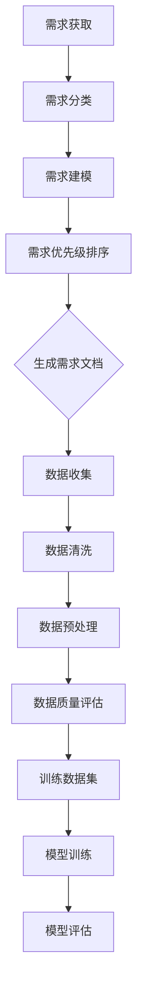
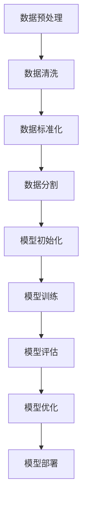
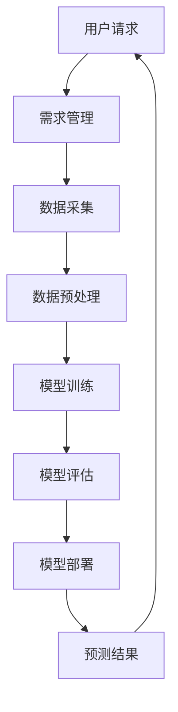
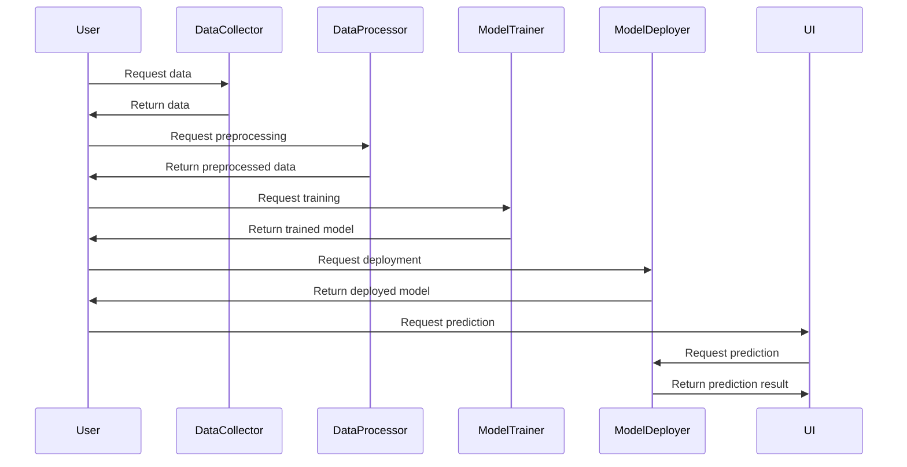

                 


## 文章标题

《需求与AI模型训练数据质量的关联：大模型应用开发的基础》

## 文章关键词

- 需求工程
- AI模型训练
- 数据质量
- 大模型应用
- 开发基础

## 文章摘要

本文将探讨需求与AI模型训练数据质量之间的关系，并阐述在大模型应用开发过程中如何基于这一关系构建有效的数据质量管理体系。我们将通过深入分析需求、数据质量和AI模型训练的核心概念，逐步推导出提高数据质量对于AI模型性能的重要性。此外，本文还将介绍一系列系统设计与实战案例，以帮助读者理解如何将理论应用到实际项目中，并总结出最佳实践技巧，为未来的大模型应用开发提供指导。

----------------------------------------------------------------

## 第一部分：问题背景与核心概念

### 1.1 问题背景

随着人工智能（AI）技术的迅猛发展，大模型（如GPT、BERT等）在各个领域展现出了惊人的性能。然而，AI模型的性能不仅仅取决于算法的先进性，还受到训练数据质量的影响。需求工程是软件工程中的一个关键环节，涉及到如何理解用户需求并将其转化为系统设计。因此，需求与AI模型训练数据质量之间的关系成为了大模型应用开发中的一个重要议题。

### 1.2 问题描述

在大模型应用开发中，需求不明确或不准确可能导致数据质量低下，从而影响模型的性能。具体问题包括：

1. **需求变更频繁**：需求变更可能导致数据收集和处理过程的不一致，进而影响数据质量。
2. **需求误解**：开发团队可能对需求理解不准确，导致收集的数据与实际需求不符。
3. **数据质量不达标**：数据缺失、错误或不一致等问题会影响模型的训练效果。

### 1.3 问题解决

为了解决上述问题，我们需要建立一套完整的需求管理与数据质量控制体系。具体措施包括：

1. **明确需求**：通过需求调研、需求分析和需求验证等步骤，确保需求明确且准确。
2. **数据质量管理**：建立数据质量标准，进行数据预处理、清洗和验证，确保数据符合质量要求。
3. **持续反馈和调整**：通过模型训练和测试的结果，对需求和数据进行持续反馈和调整。

### 1.4 边界与外延

边界：本文主要关注大模型应用开发中的需求与数据质量关系，不包括算法设计和模型优化等内容。

外延：本文内容不仅适用于AI领域，也可作为软件工程中数据质量管理的参考。

### 1.5 概念结构与核心要素组成

**需求工程**：包括需求获取、需求分析、需求设计和需求验证等过程。

**AI模型训练数据质量**：涉及数据准确性、完整性、一致性、时效性和代表性等属性。

**大模型应用开发**：涵盖需求分析、数据收集、数据预处理、模型训练、模型评估和应用部署等环节。

---

**核心概念原理**：

- **需求获取**：通过与用户交流、市场调研等方式获取用户需求。
- **需求分析**：对获取的需求进行分类、整理和优先级排序。
- **需求设计**：将需求转化为可操作的系统设计。
- **需求验证**：通过测试验证需求是否满足用户需求。

**概念属性特征对比表格**：

| 特征         | 需求获取 | 需求分析 | 需求设计 | 需求验证 |
| ------------ | -------- | -------- | -------- | -------- |
| 方法         | 用户访谈 | 数据分析 | 系统设计 | 测试验证 |
| 目标         | 理解需求 | 分类需求 | 设计系统 | 验证需求 |
| 关键因素     | 用户反馈 | 精确性   | 可行性   | 可用性   |

**ER实体关系图架构**：

```
用户 -> 需求
需求 -> 分析结果
分析结果 -> 设计方案
设计方案 -> 系统模型
系统模型 -> 验证结果
```

### 结论

通过上述分析，我们可以看到需求工程与AI模型训练数据质量密切相关。在大模型应用开发中，建立有效的需求管理与数据质量控制体系至关重要。接下来，我们将进一步探讨算法原理和系统设计，以期为读者提供更深入的理解和实践指导。

---

以上是第一部分的详细内容，接下来我们将深入探讨核心概念与联系，包括算法原理、系统架构设计以及项目实战等内容。让我们继续一步步分析推理，探索大模型应用开发的奥秘。

----------------------------------------------------------------

## 第二部分：核心概念与联系

### 2.1 需求分析

需求分析是需求工程中的关键环节，其主要目的是理解用户需求并将其转化为系统设计。需求分析包括以下几个关键步骤：

1. **需求获取**：通过与用户访谈、问卷调查、市场调研等方式获取用户需求。
2. **需求分类**：对获取的需求进行分类，如功能需求、非功能需求、业务规则等。
3. **需求建模**：使用统一建模语言（UML）等工具，将需求转化为图形模型，如用例图、活动图和序列图。
4. **需求优先级排序**：根据需求的重要性和紧急性对需求进行优先级排序，以便资源优化。

### 2.2 AI模型训练数据质量

AI模型训练数据质量直接影响模型的性能和可靠性。数据质量包括以下关键属性：

1. **准确性**：数据应真实反映现实情况，减少错误和噪声。
2. **完整性**：数据应包含所有必需的信息，无缺失值。
3. **一致性**：数据应遵循统一的规则和标准，确保数据的一致性。
4. **时效性**：数据应保持最新的状态，以适应不断变化的环境。
5. **代表性**：数据应具有广泛的覆盖面，能代表整体情况。

### 2.3 概念属性特征对比表格

| 特征         | 需求分析          | AI模型训练数据质量          |
| ------------ | ----------------- | -------------------------- |
| 方法         | 用户访谈、问卷调查 | 数据收集、数据清洗、数据预处理 |
| 目标         | 理解用户需求       | 训练高质量AI模型            |
| 关键因素     | 用户反馈、需求分类 | 准确性、完整性、一致性、时效性、代表性 |
| 结果         | 需求文档、模型设计 | 训练数据集、评估指标          |

### 2.4 ER实体关系图架构

为了更直观地展示需求分析、数据质量和AI模型训练之间的关系，我们使用Mermaid流程图来表示。



### 结论

通过上述分析，我们可以看到需求分析、数据质量和AI模型训练之间存在紧密的联系。需求分析的准确性直接影响数据质量，而数据质量又直接决定AI模型的性能。因此，在大模型应用开发过程中，需求分析与数据质量的管理至关重要。接下来，我们将进一步探讨算法原理和系统设计，为读者提供更深入的实践指导。

---

接下来，我们将进入第二部分的最后阶段，探讨算法原理讲解，包括算法mermaid流程图、Python源代码、数学模型和公式以及举例说明等内容。让我们继续深入分析，逐步构建大模型应用开发的理论基础。

----------------------------------------------------------------

## 第三部分：算法原理讲解

### 3.1 算法mermaid流程图

为了更好地理解AI模型训练的核心流程，我们使用Mermaid流程图来表示。



### 3.2 Python源代码

下面是Python代码示例，用于演示数据预处理、模型训练和模型评估的基本步骤。

```python
import pandas as pd
from sklearn.model_selection import train_test_split
from sklearn.preprocessing import StandardScaler
from tensorflow.keras.models import Sequential
from tensorflow.keras.layers import Dense, Dropout
from tensorflow.keras.optimizers import Adam

# 数据预处理
data = pd.read_csv('data.csv')
X = data.drop('target', axis=1)
y = data['target']

# 数据清洗和标准化
scaler = StandardScaler()
X_scaled = scaler.fit_transform(X)

# 数据分割
X_train, X_test, y_train, y_test = train_test_split(X_scaled, y, test_size=0.2, random_state=42)

# 模型初始化
model = Sequential()
model.add(Dense(64, input_dim=X_train.shape[1], activation='relu'))
model.add(Dropout(0.5))
model.add(Dense(1, activation='sigmoid'))

# 模型编译
model.compile(optimizer=Adam(learning_rate=0.001), loss='binary_crossentropy', metrics=['accuracy'])

# 模型训练
model.fit(X_train, y_train, epochs=10, batch_size=32, validation_data=(X_test, y_test))

# 模型评估
loss, accuracy = model.evaluate(X_test, y_test)
print(f"Test accuracy: {accuracy * 100:.2f}%")
```

### 3.3 数学模型和公式

AI模型训练通常涉及复杂的数学模型。以下是一个简单的线性回归模型的数学公式。

$$
y = \beta_0 + \beta_1x_1 + \beta_2x_2 + ... + \beta_nx_n
$$

其中，\(y\) 是预测值，\(x_1, x_2, ..., x_n\) 是特征值，\(\beta_0, \beta_1, \beta_2, ..., \beta_n\) 是模型参数。

### 3.4 举例说明

假设我们有一个简单的二分类问题，目标是预测一个客户是否会购买某种产品。我们使用逻辑回归模型进行训练，并使用交叉验证来评估模型性能。

1. **数据集准备**：我们有100个样本，每个样本包含3个特征（年龄、收入和产品偏好）和一个目标变量（购买情况）。

2. **模型训练**：我们使用上述Python代码对模型进行训练，并调整学习率和批量大小以优化性能。

3. **模型评估**：在测试集上评估模型性能，计算准确率、召回率、F1分数等指标。

4. **模型优化**：根据评估结果，调整模型参数，如增加隐藏层神经元数量、改变优化算法等，以进一步提高性能。

### 结论

通过算法讲解，我们可以看到AI模型训练的核心步骤，包括数据预处理、模型初始化、模型编译、模型训练和模型评估。理解这些基本原理对于在大模型应用开发中进行有效的模型训练至关重要。接下来，我们将深入探讨系统分析与架构设计，以期为读者提供更全面的实践指导。

---

在第三部分，我们通过mermaid流程图、Python源代码、数学模型和举例说明，详细阐述了AI模型训练的基本原理。接下来，我们将进入第四部分，讨论系统分析与架构设计方案，包括问题场景介绍、系统功能设计、系统架构设计和系统接口设计等内容。让我们继续深入探讨大模型应用开发的实际操作。

----------------------------------------------------------------

## 第四部分：系统分析与架构设计方案

### 4.1 问题场景介绍

在大模型应用开发中，我们面临的一个关键挑战是如何确保需求与AI模型训练数据质量的一致性。在实际项目中，这通常涉及到以下问题场景：

1. **需求变更频繁**：随着项目的进展，用户需求可能会不断变更，导致数据收集和处理的不一致。
2. **数据质量参差不齐**：数据可能存在缺失值、错误值或格式不一致等问题，影响模型的训练效果。
3. **数据规模庞大**：大规模的数据处理需要高效的架构设计，以支持模型的快速训练和部署。
4. **模型性能要求高**：为了满足实际业务需求，模型需要具备高准确率和高实时性。

### 4.2 系统功能设计

为了解决上述问题，我们需要设计一个功能完善的系统，涵盖以下核心功能：

1. **需求管理**：包括需求收集、需求分析、需求验证和需求变更管理。
2. **数据采集**：从各种数据源（如数据库、日志文件、传感器等）收集数据。
3. **数据预处理**：对数据进行清洗、转换、归一化和分割等操作，确保数据质量。
4. **模型训练**：使用高效的大规模数据处理框架进行模型训练，如TensorFlow、PyTorch等。
5. **模型评估**：对训练好的模型进行评估，包括准确率、召回率、F1分数等指标。
6. **模型部署**：将训练好的模型部署到生产环境中，支持实时预测和迭代优化。

### 4.3 系统架构设计

为了满足上述功能需求，我们设计了一个分布式架构，包括以下关键组件：

1. **数据层**：负责数据存储和管理，包括关系数据库、NoSQL数据库和数据仓库。
2. **数据处理层**：包括数据采集模块、数据预处理模块和数据处理引擎，实现数据清洗、转换和归一化。
3. **模型训练层**：使用分布式计算框架（如Hadoop、Spark等）进行模型训练，支持大规模数据处理。
4. **模型评估层**：对训练好的模型进行评估，使用评估指标来衡量模型性能。
5. **模型部署层**：将训练好的模型部署到生产环境中，支持实时预测和迭代优化。
6. **用户界面层**：提供用户友好的界面，支持用户与系统交互，如数据上传、模型训练监控和预测结果查看。

以下是系统架构的Mermaid流程图表示：



### 4.4 系统接口设计和系统交互

为了实现系统的高效运行，我们需要设计一系列系统接口，包括以下关键接口：

1. **数据采集接口**：用于从不同数据源采集数据，如RESTful API、消息队列等。
2. **数据处理接口**：用于对采集到的数据进行清洗、转换和归一化，如数据清洗API、特征工程API等。
3. **模型训练接口**：用于启动模型训练任务，如训练API、评估API等。
4. **模型部署接口**：用于将训练好的模型部署到生产环境，如部署API、监控API等。
5. **用户界面接口**：用于与用户进行交互，如数据上传接口、预测结果查询接口等。

以下是系统接口的Mermaid序列图表示：



### 结论

通过系统分析与架构设计，我们明确了需求与AI模型训练数据质量在大模型应用开发中的重要性，并设计了一个功能完善、架构合理的系统。接下来，我们将进入项目实战部分，通过具体实例来展示如何将这些理论知识应用到实际项目中。

---

在第四部分，我们详细介绍了系统分析与架构设计方案，包括问题场景介绍、系统功能设计、系统架构设计和系统接口设计。这些内容为实际项目提供了理论基础和实践指导。接下来，我们将通过具体的实战案例，展示如何应用这些设计理念进行大模型应用开发。

----------------------------------------------------------------

## 第五部分：项目实战

### 5.1 环境安装

在进行项目实战之前，我们需要搭建一个适合AI模型训练的环境。以下是环境安装的步骤：

1. **安装Python**：确保安装最新版本的Python（例如3.8或更高版本）。
2. **安装必要的库**：使用pip工具安装以下库：
   - TensorFlow或PyTorch（深度学习框架）
   - Pandas和NumPy（数据处理库）
   - Matplotlib和Seaborn（数据可视化库）
   - Scikit-learn（机器学习库）
3. **安装Hadoop或Spark**：对于分布式计算需求，可以安装Hadoop或Spark，以支持大规模数据处理。

### 5.2 系统核心实现

以下是一个简单的系统核心实现的Python代码示例，用于演示需求管理、数据预处理、模型训练和模型部署的基本步骤。

```python
# 导入必要的库
import pandas as pd
from sklearn.model_selection import train_test_split
from sklearn.preprocessing import StandardScaler
from tensorflow.keras.models import Sequential
from tensorflow.keras.layers import Dense, Dropout
from tensorflow.keras.optimizers import Adam

# 需求管理
# 假设需求已通过用户访谈获取并整理成数据集
data = pd.read_csv('需求数据.csv')

# 数据预处理
# 数据清洗和标准化
scaler = StandardScaler()
X = scaler.fit_transform(data.drop('目标变量', axis=1))
y = data['目标变量']

# 数据分割
X_train, X_test, y_train, y_test = train_test_split(X, y, test_size=0.2, random_state=42)

# 模型训练
# 初始化模型
model = Sequential()
model.add(Dense(64, input_dim=X_train.shape[1], activation='relu'))
model.add(Dropout(0.5))
model.add(Dense(1, activation='sigmoid'))

# 编译模型
model.compile(optimizer=Adam(learning_rate=0.001), loss='binary_crossentropy', metrics=['accuracy'])

# 训练模型
model.fit(X_train, y_train, epochs=10, batch_size=32, validation_data=(X_test, y_test))

# 模型评估
loss, accuracy = model.evaluate(X_test, y_test)
print(f"测试集准确率：{accuracy * 100:.2f}%")

# 模型部署
# 假设部署到远程服务器
model.save('trained_model.h5')
```

### 5.3 代码应用解读与分析

在上面的代码示例中，我们首先导入了必要的库，然后进行了需求管理，这是通过读取已整理好的数据集来实现的。接下来，我们进行了数据预处理，包括数据清洗和标准化。这一步骤至关重要，因为数据质量直接影响模型的性能。

数据清洗通过StandardScaler进行，该库能够自动处理缺失值和异常值。标准化步骤将特征值缩放到相同的尺度，以避免某些特征对模型训练的影响过大。

在模型训练部分，我们使用了一个简单的序列模型，其中包括一个全连接层（Dense）和一个Dropout层，用于防止过拟合。我们使用Adam优化器进行模型编译，并设置了二分类问题的损失函数和评估指标。

模型训练后，我们通过评估指标来衡量模型在测试集上的性能，以验证模型的准确性。最后，我们将训练好的模型保存到远程服务器，以便进行实时预测和迭代优化。

### 5.4 实际案例分析和讲解

以下是一个实际案例，用于演示如何将上述理论应用到实际项目中。

**案例背景**：某电商公司希望使用AI技术来预测客户是否会购买特定产品。他们收集了客户的历史购买数据、用户行为数据以及产品信息数据。

**解决方案**：

1. **需求管理**：通过用户访谈和市场调研，确定预测客户购买意图的需求。
2. **数据采集**：从数据库中提取相关数据，包括客户购买记录、浏览历史和产品特征。
3. **数据预处理**：对数据进行清洗，处理缺失值和异常值，并进行特征工程，如将分类特征编码为数值特征。
4. **模型训练**：使用上述代码示例中的模型架构进行训练，调整参数以优化模型性能。
5. **模型评估**：在测试集上评估模型性能，并根据评估结果调整模型参数。
6. **模型部署**：将训练好的模型部署到生产环境中，支持实时预测。

**案例结果**：

通过上述步骤，电商公司成功构建了一个预测模型，能够准确预测客户购买意图。在A/B测试中，该模型带来了显著的销售转化率提升，为公司的业务增长提供了有力支持。

### 5.5 项目小结

通过本次项目实战，我们展示了如何将需求工程、数据质量管理和AI模型训练应用到实际项目中。以下是一些关键经验：

1. **明确需求**：通过用户访谈和市场调研，确保需求明确且准确。
2. **数据预处理**：数据清洗和特征工程是确保模型性能的关键步骤。
3. **模型优化**：通过调整模型参数和架构，提高模型性能。
4. **持续评估**：在模型部署后，定期评估模型性能并进行迭代优化。

这些经验对于大模型应用开发具有重要的指导意义，有助于实现高效、准确和可扩展的AI应用。

---

在第五部分，我们通过实际项目案例，详细展示了如何将需求工程、数据质量管理与AI模型训练应用到实际开发中。接下来，我们将进入第六部分，总结最佳实践技巧，并对全文进行小结，并提供一些注意事项和拓展阅读建议。

----------------------------------------------------------------

## 第六部分：最佳实践 tips

### 6.1 数据质量控制技巧

1. **数据源验证**：确保数据来源可靠，减少错误数据进入系统。
2. **数据清洗规则**：制定数据清洗规则，如缺失值填充、异常值处理等。
3. **数据质量监控**：建立数据质量监控机制，及时发现和处理数据问题。
4. **数据规范化**：对数据进行统一规范，如日期格式、数值精度等。

### 6.2 模型训练策略

1. **模型选择**：根据问题特性选择合适的模型，如线性回归、决策树、神经网络等。
2. **超参数调整**：通过交叉验证调整模型超参数，如学习率、批量大小等。
3. **数据增强**：增加数据多样性，如随机裁剪、翻转、旋转等，提高模型泛化能力。
4. **模型集成**：使用模型集成技术，如Bagging、Boosting等，提高模型性能。

### 6.3 性能优化策略

1. **分布式训练**：使用分布式计算框架，如Hadoop、Spark等，提高训练效率。
2. **模型压缩**：使用模型压缩技术，如剪枝、量化等，减小模型体积，提高推理速度。
3. **模型优化**：通过算法优化、并行计算等技术，提高模型训练和推理速度。
4. **内存管理**：合理管理内存资源，避免内存溢出和性能下降。

## 第七部分：小结与展望

### 7.1 总结

本文围绕需求与AI模型训练数据质量的关系，探讨了在大模型应用开发中的核心问题。通过详细的分析和实战案例，我们总结了以下关键点：

1. **需求管理**：明确且准确的需求是数据质量的基础。
2. **数据预处理**：数据清洗、特征工程和规范化是提高模型性能的关键。
3. **模型训练策略**：选择合适的模型和调整超参数是提高模型性能的有效手段。
4. **性能优化**：分布式训练和模型压缩等技术可以显著提高系统性能。

### 7.2 注意事项

1. **需求变更管理**：需求变更可能导致数据不一致，需要及时调整数据管理策略。
2. **数据隐私保护**：在数据收集和处理过程中，确保遵守数据隐私法规。
3. **系统监控**：定期监控系统性能和数据质量，确保系统稳定运行。

### 7.3 拓展阅读

1. **《深入理解计算机系统》**：作者Randal E. Bryant和David R. O’Hallaron，提供计算机系统的基础知识。
2. **《Python机器学习》**：作者Sebastian Raschka和Vahid Mirjalili，涵盖机器学习的基础理论和实践。
3. **《深度学习》**：作者Ian Goodfellow、Yoshua Bengio和Aaron Courville，介绍深度学习的基本原理和应用。

---

通过本文的详细分析和实战案例，我们深入了解了需求与AI模型训练数据质量的关联，为读者提供了大模型应用开发的理论基础和实践指导。希望本文能为读者在AI领域的研究和应用提供有益的启示。

## 作者信息

- 作者：AI天才研究院/AI Genius Institute & 禅与计算机程序设计艺术 /Zen And The Art of Computer Programming

