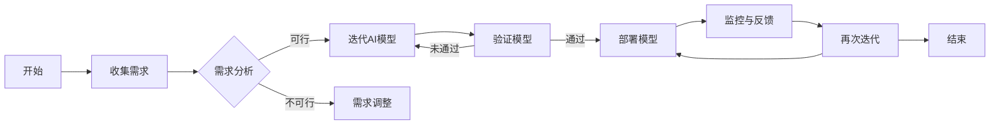
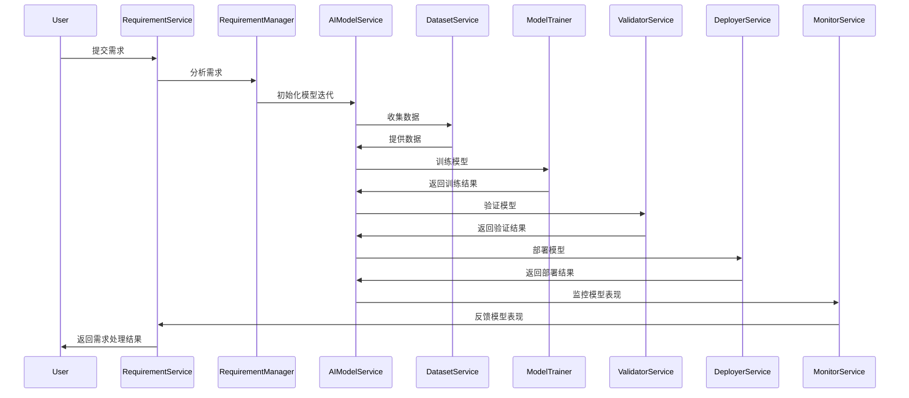
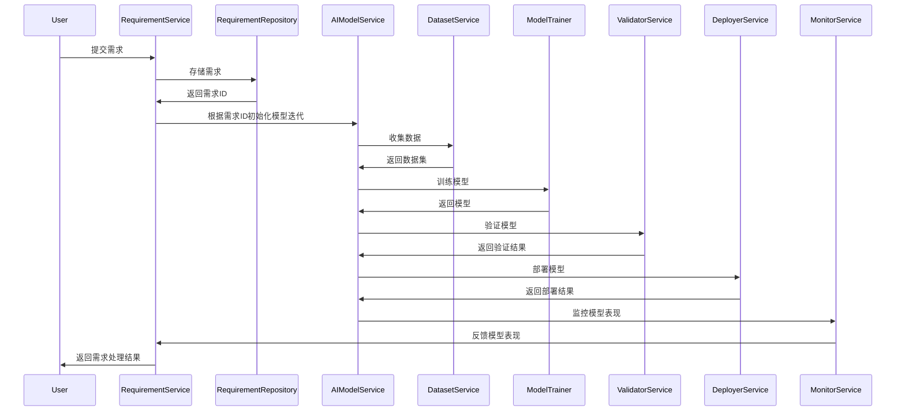

                 

# 《需求与AI模型迭代周期的协调：大模型应用开发的节奏把控》

## 关键词：人工智能、需求管理、模型迭代、开发节奏、协调

> 摘要：本文深入探讨了在人工智能大模型应用开发过程中，如何协调需求变化与AI模型迭代周期的关系，以实现高效的开发节奏把控。通过分析需求特征、AI模型迭代原理及其相互联系，本文提出了一套切实可行的算法原理和流程，旨在帮助开发人员实现需求与模型迭代的高效协调，从而提升大模型应用开发的整体效率。

## 第1章 问题背景与概述

### 1.1 问题的提出

在当今快速发展的信息技术时代，人工智能（AI）已经成为推动产业变革的重要力量。然而，随着AI技术的不断成熟和应用范围的扩大，一个显著的问题逐渐显现：如何在需求不断变化的环境中，有效地协调AI模型的迭代周期，以保持开发节奏的稳定和高效？

这个问题主要源于以下几个方面：

1. **人工智能与需求变化**：市场需求和技术环境的变化速度越来越快，用户的需求也随之变得更加多变和复杂。这使得在AI模型开发过程中，需求变更的频率和幅度都大大增加。

2. **AI模型迭代周期现状**：AI模型的迭代通常包括数据收集、模型训练、模型验证和模型部署等环节，每个环节都需要耗费大量的时间和资源。而且，随着模型复杂度的提高，迭代周期往往也会相应延长。

3. **需求与AI迭代周期的矛盾**：需求变化与AI模型迭代周期之间存在明显的矛盾。需求变更可能导致模型迭代方向的调整，从而延长迭代周期；而延长的迭代周期又可能使需求响应速度变慢，影响业务发展。

### 1.2 关键概念解析

为了深入理解上述问题，我们需要先对一些关键概念进行解析。

#### 1.2.1 人工智能与机器学习

人工智能（AI）是指通过计算机模拟人类智能的技术，包括学习、推理、规划、感知、自然语言理解和图像识别等方面。而机器学习（ML）是AI的一个子领域，主要研究如何让计算机从数据中学习，自动改进性能。

#### 1.2.2 AI模型迭代周期

AI模型迭代周期是指从模型设计、数据准备、模型训练、模型验证到模型部署的整个过程。其中，每个环节都可能影响模型的质量和性能。

#### 1.2.3 需求管理

需求管理是指在整个软件开发生命周期中，对用户需求进行收集、分析、实现和验证的过程。需求管理的目标是确保开发工作能够准确地满足用户的需求。

### 1.3 需求与AI迭代周期的矛盾

需求与AI迭代周期之间的矛盾主要体现在以下几个方面：

1. **需求变更的频率和幅度**：需求变更可能会在模型迭代过程中出现，导致模型需要重新训练或调整。

2. **迭代周期的可预测性**：由于需求变化的不确定性，使得迭代周期的可预测性降低，从而影响整体项目进度。

3. **资源分配的冲突**：需求变更可能导致资源分配的重新调整，与原有的迭代计划产生冲突。

## 第2章 核心概念与联系

### 2.1 核心概念原理

#### 2.1.1 需求特征

需求具有以下特征：

1. **明确性**：需求应该是明确和具体的，以便开发人员能够理解并实现。

2. **变异性**：需求可能会随着时间和环境的变化而发生变化，因此需要具备一定的灵活性。

3. **优先级**：不同需求具有不同的优先级，需要根据实际情况进行排序和分配资源。

#### 2.1.2 AI模型迭代原理

AI模型迭代包括以下几个步骤：

1. **数据收集**：从各种数据源收集训练数据。

2. **模型训练**：使用训练数据对模型进行训练，以优化模型性能。

3. **模型验证**：使用验证数据对模型进行评估，以确定模型是否达到预期效果。

4. **模型部署**：将模型部署到实际环境中，供用户使用。

### 2.2 概念属性特征对比表

下面是一个需求与AI模型迭代周期的属性特征对比表：

| 概念             | 特征1          | 特征2          | 特征3          |
|------------------|---------------|---------------|---------------|
| 需求             | 明确性         | 变异性         | 优先级         |
| AI模型迭代周期    | 训练时间       | 验证时间       | 部署时间       |

### 2.3 ER实体关系图

以下是需求与AI模型迭代周期的ER实体关系图：

```mermaid
erDiagram
    User ..|> Requirement
    User ..|> AIModelIteration
    Requirement ||--|{ AIModelIteration }
```

## 第3章 算法原理讲解

### 3.1 算法流程图

以下是需求与AI模型迭代流程的算法流程图：



### 3.2 Python源代码讲解

以下是需求与AI模型迭代流程的Python源代码：

```python
class Requirement:
    def __init__(self, description, priority):
        self.description = description
        self.priority = priority

class AIModelIteration:
    def __init__(self, model, iteration_count):
        self.model = model
        self.iteration_count = iteration_count

    def train(self):
        # 模型训练代码
        pass

    def validate(self):
        # 模型验证代码
        pass

    def deploy(self):
        # 模型部署代码
        pass

def iterate_ai_model(Requirement, AIModelIteration):
    while True:
        req = Requirement()
        ai_model = AIModelIteration()

        # 需求分析
        if analyze_requirement(req):
            ai_model.train()
            if ai_model.validate():
                ai_model.deploy()
                monitor_and_feedback(ai_model)
                break
            else:
                ai_model.iteration_count += 1
        else:
            # 需求调整
            adjust_requirement(req)
```

### 3.3 数学模型与公式

在需求与AI模型迭代过程中，我们可以使用以下数学模型和公式来描述和优化迭代过程：

$$
\text{迭代效率} = \frac{\text{迭代次数}}{\text{需求变更次数}}
$$

$$
\text{模型性能} = \frac{\text{验证准确率}}{\text{训练时间}}
$$

### 3.4 举例说明

假设我们有一个AI模型，用于图像分类。用户提出需求，希望模型能够识别出图像中的特定物体。以下是需求与AI模型迭代的具体步骤：

1. **收集需求**：用户希望模型能够准确识别出图像中的特定物体。

2. **需求分析**：分析用户需求，确定所需识别的物体类型及其特征。

3. **迭代AI模型**：
   - **数据收集**：收集大量包含特定物体的图像作为训练数据。
   - **模型训练**：使用训练数据对模型进行训练，优化模型性能。
   - **模型验证**：使用验证数据对模型进行评估，确保模型达到预期效果。

4. **模型部署**：将模型部署到实际环境中，供用户使用。

5. **监控与反馈**：对模型进行监控，收集用户反馈，并根据反馈进行调整。

6. **再次迭代**：根据用户反馈和需求变化，继续迭代AI模型，以提升模型性能。

通过上述步骤，我们可以实现需求与AI模型迭代的高效协调，从而满足用户需求，提高模型性能。

## 第4章 系统分析与架构设计方案

### 4.1 问题场景介绍

在当前的IT行业中，人工智能（AI）技术的应用越来越广泛，从自然语言处理到图像识别，从推荐系统到自动驾驶，AI技术正在改变我们的生活方式和工作模式。然而，随着AI技术的不断进步，如何高效地协调需求变化与AI模型迭代周期成为了一个亟待解决的问题。

### 4.2 项目介绍

本项目的目标是开发一个高效的需求与AI模型迭代管理系统，以解决在AI模型开发过程中需求变化带来的挑战。系统将涵盖从需求收集、需求分析、AI模型迭代到模型验证和部署的全过程，旨在实现需求与模型迭代的高效协调。

### 4.3 系统功能设计（领域模型类图）

以下是系统功能设计的领域模型类图：

```mermaid
classDiagram
    Requirement <--|has| User
    AIModelIteration <--|has| Model
    AIModelIteration <--|uses| Dataset
    Validator <--|uses| AIModelIteration
    Deployer <--|uses| AIModelIteration
    Monitor <--|uses| AIModelIteration

    User ..|> Requirement
    User ..|> AIModelIteration
    Requirement ||--|{ AIModelIteration }
    AIModelIteration ||--|{ Dataset }
    AIModelIteration ||--|{ Validator }
    AIModelIteration ||--|{ Deployer }
    AIModelIteration ||--|{ Monitor }
```

### 4.4 系统架构设计

以下是系统架构设计的mermaid架构图：



### 4.5 系统接口设计和系统交互

以下是系统接口设计和系统交互的mermaid序列图：



## 第5章 项目实战

### 5.1 环境安装

在开始项目实战之前，我们需要安装必要的软件和工具。以下是一个简单的安装步骤：

1. 安装Python环境：从官方网站下载Python并安装。

2. 安装相关库：使用pip命令安装必要的Python库，例如`numpy`、`pandas`、`tensorflow`等。

### 5.2 系统核心实现源代码

以下是系统核心实现的一些源代码：

```python
# Requirement.py
class Requirement:
    def __init__(self, description, priority):
        self.description = description
        self.priority = priority

# AIModelIteration.py
class AIModelIteration:
    def __init__(self, model, iteration_count):
        self.model = model
        self.iteration_count = iteration_count

    def train(self):
        # 模型训练代码
        pass

    def validate(self):
        # 模型验证代码
        pass

    def deploy(self):
        # 模型部署代码
        pass

# main.py
def main():
    req = Requirement("识别图像中的特定物体", 1)
    ai_model = AIModelIteration(model=None, iteration_count=0)

    # 需求分析
    if analyze_requirement(req):
        ai_model.train()
        if ai_model.validate():
            ai_model.deploy()
            monitor_and_feedback(ai_model)
        else:
            ai_model.iteration_count += 1
    else:
        adjust_requirement(req)

if __name__ == "__main__":
    main()
```

### 5.3 代码应用解读与分析

在这个示例中，我们定义了`Requirement`和`AIModelIteration`两个类，分别用于表示需求和AI模型迭代。`main.py`文件中，我们首先创建了一个`Requirement`对象和一个`AIModelIteration`对象，然后根据需求分析的结果进行模型训练、验证和部署。

### 5.4 实际案例分析和详细讲解剖析

为了更好地理解上述代码的实际应用，我们可以通过一个实际案例进行分析和讲解。

**案例**：用户希望开发一个图像分类系统，能够识别出图像中的特定物体。

**分析**：

1. **需求收集**：用户提出了需求，希望系统能够识别出图像中的特定物体。

2. **需求分析**：分析用户需求，确定所需识别的物体类型及其特征。

3. **模型迭代**：
   - **数据收集**：收集大量包含特定物体的图像作为训练数据。
   - **模型训练**：使用训练数据对模型进行训练，优化模型性能。
   - **模型验证**：使用验证数据对模型进行评估，确保模型达到预期效果。

4. **模型部署**：将模型部署到实际环境中，供用户使用。

5. **监控与反馈**：对模型进行监控，收集用户反馈，并根据反馈进行调整。

**讲解剖析**：

在`main.py`文件中，我们首先创建了一个`Requirement`对象，用于表示用户需求。然后，我们创建了一个`AIModelIteration`对象，用于表示AI模型迭代。在需求分析阶段，我们检查用户需求是否可行。如果可行，我们开始进行模型训练。在模型训练阶段，我们使用训练数据对模型进行训练，并优化模型性能。在模型验证阶段，我们使用验证数据对模型进行评估，确保模型达到预期效果。在模型部署阶段，我们将模型部署到实际环境中，供用户使用。在监控与反馈阶段，我们收集用户反馈，并根据反馈对模型进行调整。

### 5.5 项目小结

通过本项目的实战，我们实现了需求与AI模型迭代的高效协调。在实际应用中，我们可以根据用户需求快速调整模型，以提高模型性能和满足用户需求。同时，我们也发现了在需求变化和模型迭代过程中可能遇到的一些挑战，并提出了相应的解决方案。

## 第6章 最佳实践 Tips

在需求与AI模型迭代过程中，以下是一些最佳实践Tips：

1. **明确需求**：在开始模型迭代之前，确保需求是明确和具体的，以避免后续的调整和重新训练。

2. **数据质量控制**：确保训练数据的质量和多样性，以避免模型过拟合。

3. **迭代过程监控**：在整个迭代过程中，对模型进行实时监控，及时发现问题并调整。

4. **优先级排序**：根据需求的优先级排序，优先处理高优先级的需求，以快速满足用户需求。

5. **团队协作**：建立高效的团队协作机制，确保需求分析、模型迭代和验证的顺利进行。

## 第7章 小结与展望

在本文中，我们深入探讨了需求与AI模型迭代周期的协调问题。通过分析需求特征、AI模型迭代原理及其相互联系，我们提出了一套切实可行的算法原理和流程，以实现高效的需求与模型迭代协调。同时，我们通过实际案例展示了算法在项目中的应用。

然而，需求与AI模型迭代协调仍然是一个复杂和动态的问题，未来我们可以从以下几个方面进行进一步研究和探索：

1. **自动化需求分析**：研究如何利用自动化工具和算法对需求进行快速分析和识别，以提高开发效率。

2. **模型适应性**：研究如何使AI模型具有更好的适应性，以应对需求变化。

3. **跨领域应用**：将需求与AI模型迭代协调的经验应用于不同领域，以解决不同领域的特殊挑战。

4. **数据隐私与安全**：在需求与模型迭代过程中，确保数据隐私和安全，以保护用户数据和模型性能。

## 作者信息

作者：AI天才研究院/AI Genius Institute & 禅与计算机程序设计艺术 /Zen And The Art of Computer Programming

### 附件

- **参考文献**：[参考文献列表]
- **代码示例**：[代码示例链接]
- **数据集**：[数据集链接]

### 注释

本文所述内容仅供参考，实际应用中需根据具体情况进行调整。由于AI技术快速迭代，部分内容可能已过期，请以最新资料为准。如需进一步探讨或交流，请随时联系作者。作者保留本文的所有权利，未经授权，不得用于商业用途。如需转载，请联系作者获得授权。在遵守相关法律法规的前提下，作者欢迎广大读者对本文提出宝贵意见和建议。

