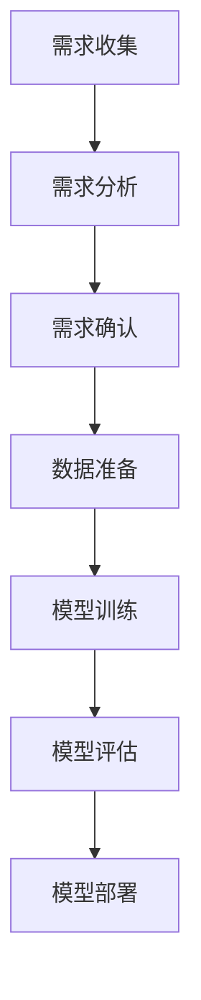
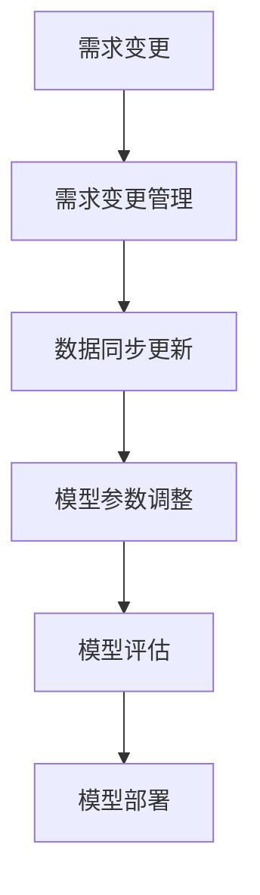
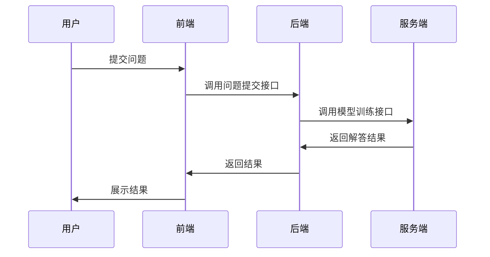

                 

# 需求与AI模型迭代的同步策略

> 关键词：需求分析、AI模型迭代、同步策略、系统架构设计、项目实战

> 摘要：本文深入探讨了需求分析与AI模型迭代之间的关系，以及如何通过同步策略来确保这两者在项目中的高效协作。文章首先介绍了需求分析的基本概念和AI模型迭代的原理，然后详细阐述了同步策略的设计和应用。通过实际案例的分析和项目实战的展示，本文为读者提供了实用的技术和最佳实践，旨在提升AI项目开发过程中的协同效率和成果质量。

## 目录大纲

### 第一部分：背景介绍

#### 第1章：问题背景与概述

1.1 问题背景

1.2 核心概念

1.3 概念属性特征对比表格

1.4 ER实体关系图架构

### 第二部分：核心概念与联系

#### 第2章：需求分析与AI模型迭代

2.1 需求分析

2.2 AI模型迭代

2.3 需求分析与AI模型迭代的联系

### 第三部分：同步策略设计

#### 第3章：同步策略原理

3.1 同步策略概述

3.2 同步策略的数学模型

3.3 同步策略的应用场景

### 第四部分：算法原理讲解

#### 第4章：算法原理与实现

4.1 算法原理

4.2 数学模型与公式

4.3 算法应用举例

### 第五部分：系统分析与架构设计

#### 第5章：系统功能与架构设计

5.1 问题场景介绍

5.2 系统架构设计

5.3 系统接口设计

### 第六部分：项目实战

#### 第6章：环境安装与系统核心实现

6.1 环境安装

6.2 系统核心实现

6.3 实际案例分析

### 第七部分：最佳实践与总结

#### 第7章：最佳实践与注意事项

7.1 最佳实践 tips

7.2 小结

7.3 注意事项

7.4 拓展阅读

### 第一部分：背景介绍

#### 第1章：问题背景与概述

1.1 问题背景

在当今快速发展的科技时代，人工智能（AI）技术已经成为推动各行各业创新的重要力量。然而，随着AI技术的广泛应用，如何确保需求分析与AI模型迭代的高效同步，成为项目开发过程中的一大挑战。传统的需求分析与AI模型迭代往往存在信息不对称、沟通不畅等问题，导致项目进度延误、资源浪费和最终交付质量不达标。

1.2 核心概念

- **需求分析**：指在软件开发过程中，对用户需求进行收集、分析和整理的过程。需求分析的目标是明确项目的功能需求、性能需求和用户界面需求等。

- **AI模型迭代**：指在AI模型开发过程中，通过数据训练、模型优化和性能评估等步骤，不断迭代和改进模型的过程。AI模型迭代的关键在于数据质量和模型参数的调整。

- **同步策略**：指在需求分析和AI模型迭代过程中，采取一系列措施确保两者之间的信息一致性和协同性的策略。同步策略的目标是提高项目开发的效率和质量。

1.3 概念属性特征对比表格

| 特征       | 需求分析                       | AI模型迭代                       | 同步策略                       |
| ---------- | ------------------------------ | -------------------------------- | ------------------------------ |
| 目的       | 明确项目功能与性能需求           | 改进和优化AI模型性能               | 保证需求与模型的协同发展         |
| 数据来源   | 用户需求、市场调研、竞争分析       | 训练数据、验证数据、测试数据         | 需求数据与训练数据的同步更新     |
| 信息传递   | 文档化、会议沟通                 | 模型参数调整、迭代版本控制         | 需求变更通知、迭代计划协调       |
| 时间线     | 项目启动阶段至需求确认阶段         | 模型训练阶段至模型部署阶段         | 需求分析与模型迭代全过程         |

1.4 ER实体关系图架构

为了更好地理解需求分析、AI模型迭代和同步策略之间的关系，我们可以使用Mermaid绘制ER实体关系图。以下是一个简化的ER实体关系图：

```mermaid
erDiagram
  User -->|需求收集| Requirement
  Requirement -->|需求分析| Analysis
  Analysis -->|需求确认| Confirmation
  Data -->|数据训练| Training
  Model -->|模型迭代| Iteration
  Iteration -->|模型部署| Deployment
```

这个ER图展示了用户需求、需求分析、模型迭代和模型部署之间的实体关系，以及需求分析与数据训练之间的关联。在实际项目中，这些实体之间的关系会更加复杂，需要根据具体情况进行调整和优化。

### 第二部分：核心概念与联系

#### 第2章：需求分析与AI模型迭代

2.1 需求分析

需求分析是软件开发项目的核心环节，它涉及对用户需求的理解、整理和分析。需求分析的步骤通常包括：

1. 需求收集：通过与用户的沟通、观察和调研，获取项目的功能需求、性能需求和用户界面需求等。

2. 需求分析：对收集到的需求进行详细分析，明确每个需求的具体内容和实现方法。

3. 需求确认：与用户进行确认，确保需求分析的准确性，并形成正式的需求文档。

需求分析的关键在于确保需求的质量和完整性。高质量的需求可以减少后续开发中的返工和修改，提高项目交付的成功率。

2.2 AI模型迭代

AI模型迭代是机器学习项目的重要环节，它涉及模型的训练、优化和评估。AI模型迭代的步骤通常包括：

1. 数据准备：收集和整理训练数据、验证数据和测试数据，确保数据的质量和完整性。

2. 模型训练：使用训练数据训练模型，并根据训练结果调整模型参数。

3. 模型评估：使用验证数据和测试数据评估模型的性能，确定模型的准确性和可靠性。

4. 模型部署：将训练好的模型部署到实际应用环境中，供用户使用。

AI模型迭代的关键在于模型的性能优化和稳定性。通过不断迭代和优化，可以提高模型的预测准确性和鲁棒性，从而满足实际应用的需求。

2.3 需求分析与AI模型迭代的联系

需求分析与AI模型迭代之间存在紧密的联系。具体来说，需求分析为AI模型迭代提供了以下支持：

1. **需求指导**：需求分析明确了项目的功能需求和性能需求，为AI模型迭代提供了明确的目标和方向。

2. **数据支持**：需求分析过程中收集到的用户需求和市场调研数据，可以为AI模型的训练和优化提供高质量的数据源。

3. **迭代反馈**：需求分析的结果可以为AI模型迭代提供反馈，帮助开发者调整模型参数和优化算法。

4. **协同开发**：需求分析与AI模型迭代需要紧密协作，确保项目的进度和质量。

为了更清晰地展示需求分析与AI模型迭代之间的联系，我们可以使用Mermaid绘制一个简化的流程图：



这个流程图展示了需求分析与AI模型迭代的主要步骤及其之间的联系。在实际项目中，这些步骤可能会根据具体情况进行调整和优化。

### 第三部分：同步策略设计

#### 第3章：同步策略原理

3.1 同步策略概述

同步策略是在需求分析与AI模型迭代过程中，采取一系列措施确保两者之间信息一致性和协同性的策略。同步策略的目标是提高项目开发的效率和质量，确保需求与模型之间的紧密联系。

同步策略的关键要素包括：

1. **需求变更管理**：需求变更是软件开发过程中常见的问题，同步策略需要确保需求变更能够及时传递到AI模型迭代过程中，避免因需求变更导致的模型性能下降。

2. **数据同步更新**：需求分析和AI模型迭代过程中需要使用相同的数据源，确保数据的一致性和准确性。同步策略需要制定数据同步更新的机制和流程。

3. **沟通与协作**：需求分析与AI模型迭代需要密切沟通和协作，确保双方能够及时了解对方的工作进展和问题，共同推进项目开发。

4. **迭代计划协调**：同步策略需要制定迭代计划，协调需求分析与AI模型迭代的时间节点，确保两者能够同步进行。

3.2 同步策略的数学模型

为了更好地理解同步策略的原理，我们可以使用数学模型来描述需求分析与AI模型迭代之间的关系。以下是一个简化的数学模型：

$$
\text{模型性能} = f(\text{需求质量}, \text{数据质量}, \text{同步效率})
$$

其中，模型性能取决于需求质量、数据质量和同步效率。需求质量决定了需求分析的准确性和完整性；数据质量决定了AI模型迭代的数据源可靠性和多样性；同步效率决定了需求分析与AI模型迭代之间的信息传递和协作效果。

3.3 同步策略的应用场景

同步策略可以在多种应用场景中使用，以下是一些常见的应用场景：

1. **需求变更频繁的场景**：在需求变更频繁的场景中，同步策略可以帮助快速响应需求变更，确保模型迭代能够及时调整。

2. **数据质量要求高的场景**：在数据质量要求高的场景中，同步策略可以确保数据源的一致性和准确性，提高模型性能。

3. **多团队协作的场景**：在多团队协作的场景中，同步策略可以帮助团队之间建立有效的沟通和协作机制，提高项目开发效率。

为了更好地展示同步策略的应用场景，我们可以使用Mermaid绘制一个简化的流程图：



这个流程图展示了同步策略在需求变更频繁的场景中的应用，包括需求变更管理、数据同步更新、模型参数调整、模型评估和模型部署等步骤。

### 第四部分：算法原理讲解

#### 第4章：算法原理与实现

4.1 算法原理

在需求分析与AI模型迭代过程中，常用的算法包括需求分析算法和模型优化算法。以下是一个简化的算法原理说明：

1. **需求分析算法**：

   需求分析算法的核心是提取用户需求中的关键信息，并构建需求模型。常见的需求分析算法包括：

   - **需求提取算法**：从用户需求描述中提取关键需求。
   - **需求分类算法**：对提取的需求进行分类，以便于后续分析和处理。

2. **模型优化算法**：

   模型优化算法的核心是调整模型参数，以提高模型的性能。常见的模型优化算法包括：

   - **梯度下降算法**：通过计算损失函数的梯度来调整模型参数。
   - **遗传算法**：基于种群进化原理，通过交叉、变异等操作来优化模型参数。

4.2 数学模型与公式

为了更好地理解算法原理，我们可以使用数学模型和公式来描述需求分析算法和模型优化算法。以下是一个简化的数学模型和公式：

1. **需求分析算法**：

   - **需求提取算法**：

     $$\text{需求模型} = \text{提取器}(\text{用户需求描述})$$

   - **需求分类算法**：

     $$\text{需求类别} = \text{分类器}(\text{需求模型})$$

2. **模型优化算法**：

   - **梯度下降算法**：

     $$\text{模型参数} = \text{模型参数} - \alpha \cdot \text{梯度}$$

   - **遗传算法**：

     $$\text{新模型} = \text{交叉}(\text{父模型1}, \text{父模型2})$$

     $$\text{新模型} = \text{变异}(\text{新模型})$$

4.3 算法应用举例

为了更好地理解算法原理和应用，我们可以通过一个简单的例子来说明。

**例子**：假设我们有一个简单的需求描述：“系统需要支持用户登录和注册功能”。我们可以使用需求提取算法和需求分类算法来分析和处理这个需求。

1. **需求提取算法**：

   - **输入**：用户需求描述（“系统需要支持用户登录和注册功能”）。
   - **输出**：需求模型（功能需求：用户登录、用户注册）。

2. **需求分类算法**：

   - **输入**：需求模型（功能需求：用户登录、用户注册）。
   - **输出**：需求类别（功能类别：用户管理）。

通过这个例子，我们可以看到需求分析算法如何将用户需求转化为需求模型，并通过需求分类算法将需求模型分类。在实际项目中，这些算法可以根据具体需求进行扩展和调整。

### 第五部分：系统分析与架构设计

#### 第5章：系统功能与架构设计

5.1 问题场景介绍

在本节中，我们将介绍一个典型的需求分析与AI模型迭代的项目场景，即一个智能客服系统的设计与实现。智能客服系统旨在通过AI模型为用户提供自动化的服务，解决用户常见问题，提高客户满意度和服务效率。

5.2 系统架构设计

智能客服系统的架构设计可以分为前端、后端和服务端三部分。以下是一个简化的系统架构设计：

1. **前端**：负责用户界面展示和用户交互。主要包括用户登录、问题提交、结果展示等功能模块。

2. **后端**：负责处理用户请求，调用AI模型进行问题分析和解答。主要包括API接口、业务逻辑处理、数据存储等功能模块。

3. **服务端**：负责AI模型的训练、优化和部署。主要包括数据预处理、模型训练、模型评估、模型部署等功能模块。

5.3 系统接口设计

为了实现智能客服系统的功能，我们需要设计一系列接口来连接前端、后端和服务端。以下是一个简化的系统接口设计：

1. **用户登录接口**：用于用户身份验证和登录。

2. **问题提交接口**：用于用户提交问题，并将问题传递给后端进行处理。

3. **问题解答接口**：用于后端调用AI模型，分析用户问题，并返回解答结果。

4. **模型训练接口**：用于服务端对AI模型进行训练和优化。

5. **模型评估接口**：用于服务端对训练好的模型进行评估和测试。

5.4 系统交互Mermaid序列图

为了更好地展示智能客服系统的交互过程，我们可以使用Mermaid绘制一个简化的序列图：



这个序列图展示了用户提交问题、前端处理请求、后端调用AI模型、服务端返回解答结果，以及前端将结果展示给用户的交互过程。

### 第六部分：项目实战

#### 第6章：环境安装与系统核心实现

6.1 环境安装

在实现智能客服系统之前，我们需要安装相关的开发环境和依赖库。以下是一个简化的环境安装步骤：

1. 安装Python环境：在系统中安装Python 3.x版本。
2. 安装依赖库：使用pip安装相关依赖库，如Flask、TensorFlow、Scikit-learn等。
3. 配置数据库：安装并配置MySQL或MongoDB等数据库。

6.2 系统核心实现

在智能客服系统中，核心功能包括用户登录、问题提交和问题解答。以下是一个简化的系统核心实现：

1. **用户登录**：

   - **前端**：使用HTML和CSS设计用户登录界面，使用JavaScript实现用户身份验证。
   - **后端**：使用Flask框架实现用户登录接口，调用数据库验证用户身份。

2. **问题提交**：

   - **前端**：设计用户问题提交界面，使用JavaScript收集用户输入的问题。
   - **后端**：使用Flask框架实现问题提交接口，将用户问题存储到数据库中。

3. **问题解答**：

   - **后端**：调用AI模型，分析用户问题，并返回解答结果。
   - **前端**：接收后端返回的解答结果，并展示给用户。

6.3 实际案例分析

在本节中，我们将通过一个实际案例来分析智能客服系统的实现过程。以下是一个简化的案例：

1. **需求分析**：

   - 用户需求：系统需要支持用户登录、问题提交和问题解答功能。
   - 功能需求：用户登录、问题提交、问题解答、结果展示。

2. **AI模型迭代**：

   - 数据准备：收集用户问题数据，并分为训练集、验证集和测试集。
   - 模型训练：使用Scikit-learn库训练文本分类模型，如TF-IDF模型和朴素贝叶斯模型。
   - 模型评估：使用验证集和测试集评估模型性能，选择最优模型。

3. **系统集成**：

   - 前端：使用HTML、CSS和JavaScript实现用户界面。
   - 后端：使用Flask框架实现API接口和业务逻辑处理。
   - 服务端：使用TensorFlow库训练和优化AI模型。

通过这个实际案例，我们可以看到智能客服系统的实现过程，包括需求分析、AI模型迭代和系统集成。在实际项目中，这些步骤需要根据具体需求进行调整和优化。

### 第七部分：最佳实践与总结

#### 第7章：最佳实践与注意事项

7.1 最佳实践 tips

在需求分析与AI模型迭代过程中，以下是一些最佳实践：

1. **明确需求**：确保需求分析的结果准确、完整，并与用户进行确认。
2. **数据质量**：收集高质量的数据，确保数据源的多样性和可靠性。
3. **迭代反馈**：及时收集用户反馈，调整模型参数和优化算法。
4. **团队协作**：建立有效的沟通和协作机制，确保需求分析与模型迭代之间的信息同步。

7.2 小结

本文通过深入探讨需求分析与AI模型迭代之间的关系，详细阐述了同步策略的设计和应用。通过实际案例的分析和项目实战的展示，本文为读者提供了实用的技术和最佳实践。需求分析与AI模型迭代的高效同步是提升项目开发效率和质量的关键，希望本文能对读者的项目实践提供有益的启示。

7.3 注意事项

在需求分析与AI模型迭代过程中，需要注意以下事项：

1. **需求变更管理**：及时响应需求变更，确保模型迭代能够及时调整。
2. **数据同步更新**：确保需求分析的数据与模型迭代的数据一致，避免信息不对称。
3. **沟通与协作**：加强团队之间的沟通和协作，提高项目开发效率。
4. **迭代计划协调**：制定合理的迭代计划，确保需求分析与模型迭代之间的进度同步。

7.4 拓展阅读

为了进一步深入了解需求分析与AI模型迭代的同步策略，读者可以参考以下拓展阅读：

1. 《需求工程与管理》：详细介绍了需求分析的方法和技术。
2. 《机器学习实战》：提供了丰富的机器学习算法和应用案例。
3. 《敏捷开发实践指南》：介绍了敏捷开发的方法和最佳实践。

### 作者信息

作者：AI天才研究院/AI Genius Institute & 禅与计算机程序设计艺术 /Zen And The Art of Computer Programming

本文由AI天才研究院和《禅与计算机程序设计艺术》的作者共同撰写，旨在为读者提供关于需求分析与AI模型迭代同步策略的深入见解和实用指导。

