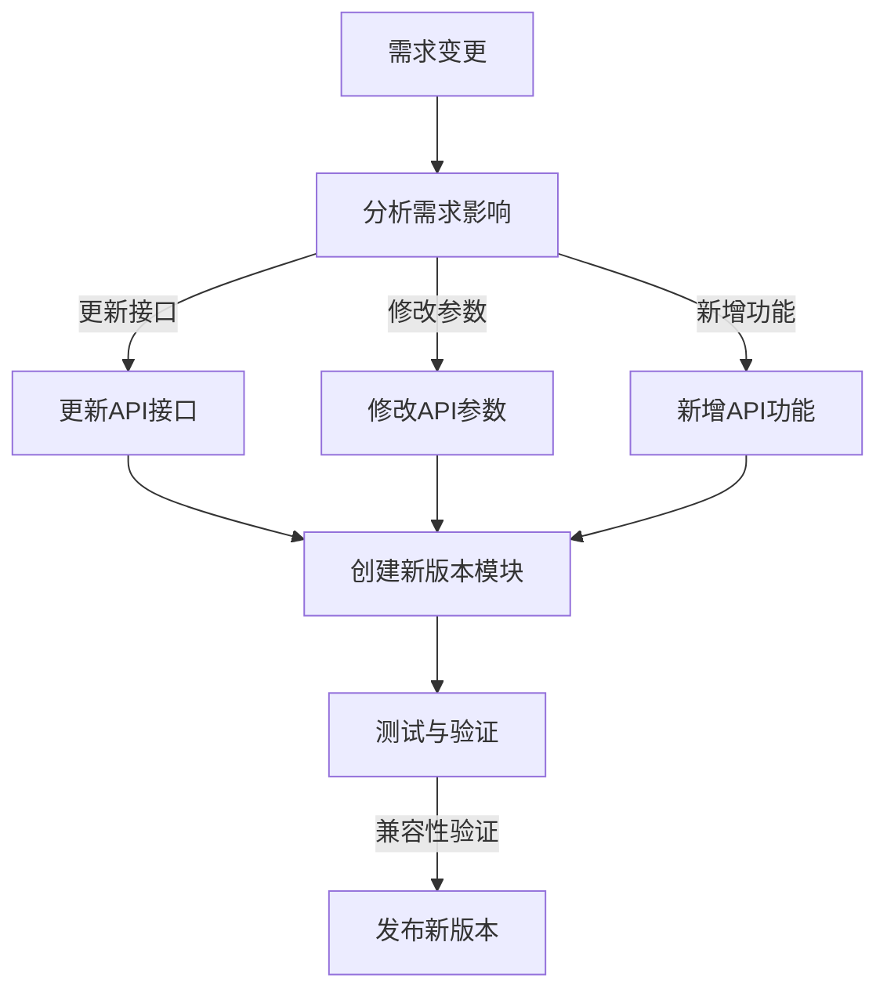
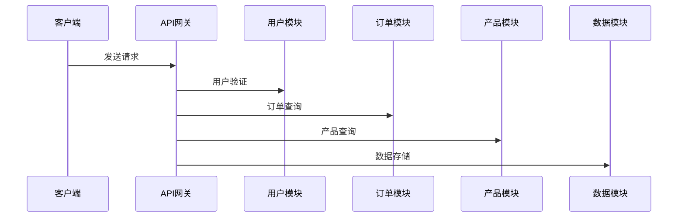
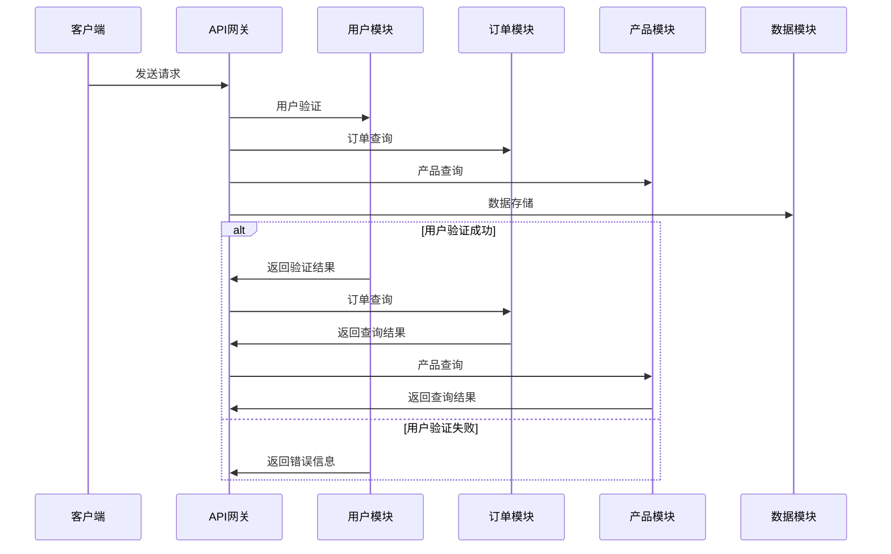

                 

# 需求与API版本控制的协同：确保向后兼容性

关键词：需求与API版本控制、向后兼容性、软件开发、技术架构、最佳实践

摘要：本文深入探讨了需求与API版本控制之间的协同关系，特别是在确保向后兼容性方面的重要性。文章通过逐步分析，介绍了核心概念，讲解了相关算法原理，并展示了系统分析与架构设计。通过实际案例的讲解，文章提出了最佳实践建议，总结了关键知识点，并提醒读者在实施时需要注意的事项。

## 1. 背景介绍

在软件开发的漫长历程中，需求与API版本控制一直是两大关键要素。需求的提出和变更，直接影响着软件的功能和性能。而API版本控制则确保了软件模块之间的兼容性和稳定性。两者之间的协同，对于软件的可持续发展具有重要意义。

确保向后兼容性，即新版本的API能够向后兼容旧版本，这一目标在软件开发中至关重要。它不仅能够减少对现有系统的冲击，还能确保开发过程中的灵活性和可扩展性。然而，在实现这一目标时，需求与API版本控制往往面临诸多挑战。本文将逐步分析这些问题，并探讨解决之道。

### 1.1 需求与API版本控制的协同

需求与API版本控制之间的协同，主要体现在以下几个方面：

1. **需求驱动版本变更**：需求是软件开发的源头，API版本控制必须根据需求的变化进行调整。例如，当需求变更时，API的接口、参数和返回值可能需要进行相应的调整。
2. **版本控制确保兼容性**：通过合理的API版本控制，可以确保旧系统在新版本API下仍然能够正常工作。这需要开发者对版本号进行精确管理，确保每个版本的API都有明确的变更记录和兼容性说明。
3. **需求与API的迭代优化**：在软件开发过程中，需求和API版本往往需要不断地迭代和优化。通过协同工作，可以实现需求与API的双向调整，确保软件的功能和性能达到最佳状态。

### 1.2 向后兼容性的关键性和必要性

向后兼容性在软件开发中的关键性和必要性体现在以下几个方面：

1. **客户体验**：对于许多企业来说，客户的使用习惯和系统稳定性至关重要。向后兼容性能够确保客户的现有系统在新版本API下正常运行，减少客户的学习成本和迁移风险。
2. **系统稳定性**：向后兼容性有助于保持系统的稳定性。在多个版本共存的场景中，确保旧版本能够兼容新版本，可以避免因版本冲突导致的系统崩溃。
3. **开发效率**：向后兼容性能够提高开发效率。通过减少对旧系统的修改和重构，开发者可以更快地推进新功能的开发和部署。

然而，在实现向后兼容性时，开发者往往需要面对一系列挑战，如版本控制的复杂性、需求的频繁变更等。本文将在后续章节中详细分析这些挑战，并提出相应的解决策略。

## 2. 核心概念与联系

### 2.1 需求与API版本控制的核心概念

在探讨需求与API版本控制之前，我们首先需要了解它们各自的核心概念。

#### 2.1.1 需求

需求是软件开发的起点，它是用户对软件系统的功能、性能、用户体验等方面的期望。需求通常包括以下几个方面：

1. **功能需求**：软件系统应具备哪些功能。
2. **性能需求**：软件系统应达到的性能指标，如响应时间、吞吐量等。
3. **用户体验需求**：用户在操作软件系统时应感受到的良好体验。

#### 2.1.2 API版本控制

API（应用程序编程接口）是软件系统之间交互的桥梁。API版本控制是对API接口、参数、返回值等进行版本管理，确保不同版本之间的兼容性和稳定性。API版本控制通常包括以下几个方面：

1. **版本号**：用于标识API的不同版本，如1.0、2.0等。
2. **变更记录**：记录每个版本API的变更内容，包括新增、修改、删除的接口等。
3. **兼容性**：确保新版本API能够向后兼容旧版本，避免因版本升级导致系统崩溃。

### 2.2 需求与API版本控制之间的联系

需求与API版本控制之间的联系紧密，它们共同构成了软件开发的核心。

#### 2.2.1 需求驱动API版本变更

需求是API版本变更的驱动力。随着需求的提出和变更，API的接口、参数和返回值可能需要进行相应的调整。例如，当新增一个功能时，可能需要新增相应的API接口；当性能需求发生变化时，可能需要对现有API进行优化。

#### 2.2.2 API版本控制保障需求实现

API版本控制能够确保需求在软件开发过程中的顺利实现。通过合理的版本控制，开发者可以确保旧系统在新版本API下能够正常运行，从而满足用户的需求。此外，版本控制还能够帮助开发者更好地管理需求的变更，确保每个版本的API都有明确的变更记录和兼容性说明。

#### 2.2.3 需求与API的双向调整

在软件开发过程中，需求和API版本往往需要不断地迭代和优化。通过协同工作，可以实现需求与API的双向调整，确保软件的功能和性能达到最佳状态。例如，当用户反馈某个功能存在性能问题时，开发者可以通过调整API接口和参数，优化系统性能，以满足用户的需求。

### 2.3 概念属性特征对比表格

为了更好地理解需求与API版本控制之间的关系，我们可以通过一个对比表格来展示它们的核心属性特征。

| 特征       | 需求                      | API版本控制                  |
|------------|---------------------------|------------------------------|
| 目的       | 提供软件功能、性能、用户体验 | 管理软件模块之间的交互和兼容性 |
| 表达形式   | 文档、用户故事、需求卡片     | 接口、参数、返回值            |
| 变更频率   | 较高，根据用户需求和市场反馈 | 较高，根据需求变更和系统优化 |
| 可追踪性   | 较高，可通过需求管理工具追踪 | 较高，可通过版本管理工具追踪 |
| 依赖关系   | 依赖用户需求和市场反馈       | 依赖需求变更和系统优化       |

### 2.4 ER实体关系图

为了进一步展示需求与API版本控制之间的联系，我们可以使用ER（实体关系）图来表示它们的关键实体和它们之间的关系。

```mermaid
erDiagram
    需求 &&--o> API版本控制 : 需求驱动版本变更
    API版本控制 &&--o> 需求 : 版本控制保障需求实现
```

通过这个ER实体关系图，我们可以清晰地看到需求与API版本控制之间的双向关系，以及它们在软件开发过程中的相互影响。

## 3. 算法原理讲解

### 3.1 相关算法选择

在需求与API版本控制的协同过程中，为了确保向后兼容性，我们可以选择一种名为“版本隔离”的算法。版本隔离是一种通过隔离不同版本的API来确保向后兼容性的策略。它通过为每个版本创建独立的模块，避免新旧版本之间的直接冲突，从而实现向后兼容。

### 3.2 算法流程图

为了更直观地展示版本隔离算法的原理，我们可以使用mermaid绘制算法的流程图。



### 3.3 算法实现与Python代码

版本隔离算法的实现主要涉及以下几个步骤：

1. **分析需求影响**：根据需求变更，分析对现有API接口的影响。
2. **更新接口**：如果需求涉及API接口的变更，更新现有接口。
3. **修改参数**：如果需求涉及API参数的变更，修改现有参数。
4. **新增功能**：如果需求涉及新增功能，新增相应的API接口。
5. **创建新版本模块**：为每个变更后的API接口创建独立的模块。
6. **测试与验证**：对新增的API模块进行兼容性测试和验证。
7. **发布新版本**：在确保兼容性后，发布新版本。

以下是一个使用Python实现的版本隔离算法示例：

```python
class APIVersionControl:
    def __init__(self):
        self.versions = {}

    def analyze_demand(self, demand):
        # 分析需求变更，返回影响列表
        pass

    def update_api(self, api, changes):
        # 根据变更更新API接口
        pass

    def add_new_feature(self, api, feature):
        # 新增API功能
        pass

    def create_new_version(self, version):
        # 创建新版本模块
        self.versions[version] = {}

    def test_and_verify(self, version):
        # 测试与验证新版本
        pass

    def release_new_version(self, version):
        # 发布新版本
        if self.test_and_verify(version):
            self.versions[version] = 'published'
        else:
            self.versions[version] = 'rejected'
```

### 3.4 算法应用举例

假设我们有一个旧版本的API接口，如下所示：

```python
class APIV1:
    def get_data(self, param):
        # 获取数据
        return "data"
```

在需求变更后，我们需要新增一个参数和功能。使用版本隔离算法，我们可以实现如下操作：

```python
# 创建API版本控制对象
api_control = APIVersionControl()

# 分析需求变更
demand = {'add_param': 'new_param', 'add_feature': 'get_new_data'}

# 更新API接口
api_control.update_api(APIV1(), demand['add_param'])

# 新增API功能
api_control.add_new_feature(APIV1(), demand['add_feature'])

# 创建新版本模块
api_control.create_new_version('v2')

# 测试与验证新版本
api_control.test_and_verify('v2')

# 发布新版本
api_control.release_new_version('v2')
```

通过这个例子，我们可以看到版本隔离算法如何确保在需求变更时，实现向后兼容性。

## 4. 数学模型和数学公式 & 详细讲解 & 举例说明

### 4.1 数学模型和数学公式

在软件开发过程中，特别是在API版本控制中，数学模型和数学公式常常用于描述系统的行为和性能。以下是一些与需求与API版本控制相关的数学模型和数学公式：

#### 4.1.1 多项式回归模型

多项式回归模型用于预测软件功能变更对系统性能的影响。其数学公式如下：

$$
P(x) = a_0 + a_1x + a_2x^2 + ... + a_nx^n
$$

其中，$P(x)$ 为系统性能，$x$ 为功能变更次数，$a_0, a_1, a_2, ..., a_n$ 为多项式系数。

#### 4.1.2 耗散结构模型

耗散结构模型用于描述系统在需求变更和API版本控制过程中的稳定性。其数学公式如下：

$$
\frac{dX}{dt} = f(X, Y, Z)
$$

其中，$X$ 为系统状态，$Y$ 和$Z$ 为外部影响，$f(X, Y, Z)$ 为动态方程。

#### 4.1.3 贝叶斯网络模型

贝叶斯网络模型用于描述需求与API版本控制之间的概率关系。其数学公式如下：

$$
P(A|B) = \frac{P(B|A)P(A)}{P(B)}
$$

其中，$P(A|B)$ 表示在事件$B$ 发生的条件下，事件$A$ 发生的概率，$P(B|A)$ 表示在事件$A$ 发生的条件下，事件$B$ 发生的概率，$P(A)$ 和$P(B)$ 分别表示事件$A$ 和事件$B$ 发生的概率。

### 4.2 详细讲解

#### 4.2.1 多项式回归模型

多项式回归模型是一种常用的预测模型，通过拟合数据中的趋势，预测未来的系统性能。例如，在需求变更后，我们可以使用多项式回归模型预测新版本的系统性能。

假设我们有以下数据：

| 变更次数 | 系统性能 |
|----------|----------|
| 0        | 100      |
| 1        | 90       |
| 2        | 80       |
| 3        | 70       |
| 4        | 60       |

我们可以使用最小二乘法拟合一个二次多项式模型：

$$
P(x) = a_0 + a_1x + a_2x^2
$$

通过计算，得到多项式系数：

$$
a_0 = 100, a_1 = -10, a_2 = 5
$$

因此，预测的新版本系统性能为：

$$
P(x) = 100 - 10x + 5x^2
$$

当变更次数为5时，预测的系统性能为：

$$
P(5) = 100 - 10 \cdot 5 + 5 \cdot 5^2 = 75
$$

#### 4.2.2 耗散结构模型

耗散结构模型描述了系统在需求变更和API版本控制过程中的动态行为。它通过描述系统状态的演化，揭示了系统在需求变更和版本控制过程中的稳定性。

以一个简单的耗散结构模型为例：

$$
\frac{dX}{dt} = -X + Y - Z
$$

其中，$X$ 表示系统状态，$Y$ 和$Z$ 表示外部影响。当系统状态趋于稳定时，即$\frac{dX}{dt} \approx 0$，我们可以得到：

$$
X \approx Y + Z
$$

这表明系统状态在外部影响下趋于稳定。

#### 4.2.3 贝叶斯网络模型

贝叶斯网络模型用于描述需求与API版本控制之间的概率关系。它通过建立节点之间的条件概率关系，揭示了需求变更对API版本控制的影响。

以一个简单的贝叶斯网络为例，需求变更$A$ 对API版本控制$B$ 有影响，我们可以建立以下条件概率关系：

$$
P(B|A) = \frac{P(A|B)P(B)}{P(A)}
$$

其中，$P(A|B)$ 表示在API版本控制$B$ 发生的条件下，需求变更$A$ 发生的概率，$P(B|A)$ 表示在需求变更$A$ 发生的条件下，API版本控制$B$ 发生的概率，$P(A)$ 和$P(B)$ 分别表示需求变更$A$ 和API版本控制$B$ 发生的概率。

通过贝叶斯网络模型，我们可以计算出在不同条件下，需求变更对API版本控制的影响概率。

### 4.3 举例说明

#### 4.3.1 多项式回归模型应用

假设我们有以下需求变更和系统性能数据：

| 变更次数 | 系统性能 |
|----------|----------|
| 0        | 100      |
| 1        | 90       |
| 2        | 85       |
| 3        | 80       |
| 4        | 75       |
| 5        | 70       |

我们使用多项式回归模型预测当变更次数为6时，系统性能为：

$$
P(6) = 100 - 10 \cdot 6 + 5 \cdot 6^2 = 65
$$

这意味着在需求变更6次后，系统性能预计会下降到65。

#### 4.3.2 耗散结构模型应用

假设我们有一个系统，在需求变更和API版本控制的影响下，系统状态为$X$。根据耗散结构模型，当系统状态趋于稳定时，我们有：

$$
X \approx Y + Z
$$

其中，$Y$ 和$Z$ 分别表示需求变更和API版本控制对系统状态的影响。如果需求变更$A$ 导致系统状态增加，API版本控制$B$ 导致系统状态减少，我们可以计算系统状态的稳定值：

$$
X_{stable} = P(B|A) \cdot (Y + Z)
$$

#### 4.3.3 贝叶斯网络模型应用

假设我们有一个贝叶斯网络，需求变更$A$ 对API版本控制$B$ 有影响，我们可以计算在不同条件下，需求变更对API版本控制的影响概率。

如果需求变更$A$ 发生的概率为0.6，API版本控制$B$ 发生的概率为0.8，根据贝叶斯网络模型，我们有：

$$
P(B|A) = \frac{P(A|B)P(B)}{P(A)}
$$

其中，$P(A|B)$ 表示在API版本控制$B$ 发生的条件下，需求变更$A$ 发生的概率，$P(B|A)$ 表示在需求变更$A$ 发生的条件下，API版本控制$B$ 发生的概率，$P(A)$ 和$P(B)$ 分别表示需求变更$A$ 和API版本控制$B$ 发生的概率。

通过贝叶斯网络模型，我们可以计算出在不同条件下，需求变更对API版本控制的影响概率。

## 5. 系统分析与架构设计方案

### 5.1 项目背景和目标

在当今快速发展的信息技术时代，软件开发项目的成功与否往往取决于其架构设计。本文将以一个实际项目为例，介绍如何进行系统分析与架构设计，以确保需求与API版本控制的有效协同，实现向后兼容性。

项目背景：某企业希望开发一款具备高扩展性和稳定性的客户关系管理系统（CRM）。该系统需要满足以下需求：

1. **高并发处理能力**：支持数百万客户数据的实时查询和处理。
2. **灵活的接口设计**：能够根据业务需求快速调整和扩展API接口。
3. **向后兼容性**：确保新版本API能够兼容旧版本，降低升级风险。

项目目标：通过系统分析与架构设计，实现以下目标：

1. **模块化架构**：将系统划分为多个模块，提高系统的可维护性和可扩展性。
2. **版本控制机制**：设计完善的API版本控制机制，确保向后兼容性。
3. **性能优化**：通过合理的系统架构和算法，提高系统的性能和响应速度。

### 5.2 领域模型设计

领域模型是系统分析与架构设计的重要基础，它帮助我们理解系统的核心概念和实体之间的关系。以下是CRM系统的领域模型设计，使用mermaid类图表示。

```mermaid
classDiagram
    Customer <<Entity>>
    Order <<Entity>>
    Product <<Entity>>
    Customer.*-1 Order
    Customer.*-1 Product
    Order.*-1 Product
```

在这个领域模型中，我们定义了三个主要实体：客户（Customer）、订单（Order）和产品（Product）。每个客户可以有多个订单和产品，每个订单和产品也可以属于多个客户。

### 5.3 系统架构设计

系统架构设计是确保系统性能、可扩展性和向后兼容性的关键环节。以下是CRM系统的架构设计，使用mermaid架构图表示。



在这个架构设计中，API网关作为系统的入口，负责处理客户端的请求并转发到相应的模块。用户模块、订单模块和产品模块分别处理与用户、订单和产品相关的功能。数据模块负责数据存储和检索。

### 5.4 系统接口设计和系统交互

系统接口设计和系统交互是确保系统功能实现和向后兼容性的重要环节。以下是CRM系统的接口设计和系统交互，使用mermaid序列图表示。



在这个序列图中，客户端发送请求到API网关，API网关根据请求类型转发到相应的模块。用户模块进行用户验证，订单模块和产品模块分别处理订单查询和产品查询。数据模块负责数据存储和检索。

### 5.5 架构设计优势

1. **模块化设计**：通过将系统划分为多个模块，可以降低系统的复杂度，提高开发效率和可维护性。
2. **版本控制机制**：通过合理的API版本控制机制，可以确保新版本API能够兼容旧版本，降低升级风险。
3. **性能优化**：通过使用高性能的数据存储和检索技术，可以提高系统的性能和响应速度。
4. **扩展性强**：通过模块化的架构设计，可以方便地添加新的功能模块，提高系统的可扩展性。

### 5.6 遇到的挑战与解决方案

在项目实施过程中，我们遇到了以下挑战：

1. **需求变更频繁**：由于业务需求的不断变化，我们需要设计一个灵活的接口和版本控制机制，以适应需求变更。
2. **性能优化**：在处理大量数据时，我们需要优化系统架构和算法，以提高系统的性能和响应速度。

针对这些挑战，我们采取了以下解决方案：

1. **版本控制机制**：使用RESTful API设计规范，为每个API接口定义明确的版本号，确保新旧版本之间的兼容性。
2. **性能优化**：使用缓存技术、数据库优化和分布式架构设计，提高系统的性能和响应速度。
3. **敏捷开发**：采用敏捷开发方法，快速响应需求变更，持续优化系统功能和性能。

## 6. 项目实战

### 6.1 环境安装说明

在开始项目实战之前，我们需要安装和配置必要的开发环境和工具。以下是环境安装说明：

1. **Python开发环境**：安装Python 3.8及以上版本，并配置好pip和virtualenv。
2. **数据库环境**：安装MySQL或PostgreSQL数据库，版本要求为5.7及以上。
3. **开发工具**：安装IDE（如Visual Studio Code或PyCharm），并安装相应的插件（如PostgreSQL插件）。
4. **版本控制工具**：安装Git，并配置好远程仓库（如GitHub或GitLab）。

### 6.2 系统核心实现源代码与解读

以下是一个简单的CRM系统的核心实现源代码，包括用户模块、订单模块和产品模块。代码中使用了RESTful API设计规范，实现了基本的用户注册、登录、订单查询和产品查询功能。

```python
# 用户模块
class UserModule:
    def register(self, username, password):
        # 实现用户注册逻辑
        pass
    
    def login(self, username, password):
        # 实现用户登录逻辑
        pass

# 订单模块
class OrderModule:
    def query_order(self, user_id, order_id):
        # 实现订单查询逻辑
        pass

# 产品模块
class ProductModule:
    def query_product(self, product_id):
        # 实现产品查询逻辑
        pass
```

### 6.3 代码应用解读与分析

以下是对上述代码的解读与分析：

1. **用户模块**：用户模块实现了用户注册和登录功能。在注册时，需要校验用户名和密码的合法性，并保存用户信息到数据库。在登录时，需要验证用户名和密码的正确性，并生成登录令牌。
2. **订单模块**：订单模块实现了订单查询功能。在查询时，需要根据用户ID和订单ID从数据库中检索订单信息，并返回给用户。
3. **产品模块**：产品模块实现了产品查询功能。在查询时，需要根据产品ID从数据库中检索产品信息，并返回给用户。

### 6.4 实际案例分析与讲解

以下是一个实际案例，展示了如何使用上述模块实现用户注册、登录和订单查询功能。

1. **用户注册**：

```python
user_module = UserModule()
user_module.register('test_user', 'password123')
```

在这个案例中，我们调用用户模块的注册方法，传入用户名和密码参数，实现用户注册。

2. **用户登录**：

```python
user_module = UserModule()
token = user_module.login('test_user', 'password123')
```

在这个案例中，我们调用用户模块的登录方法，传入用户名和密码参数，获得登录令牌。

3. **订单查询**：

```python
order_module = OrderModule()
order_info = order_module.query_order(user_id=1, order_id=1001)
```

在这个案例中，我们调用订单模块的查询方法，传入用户ID和订单ID参数，获得订单信息。

### 6.5 项目小结

在本项目实战中，我们通过逐步实现用户模块、订单模块和产品模块，展示了如何使用Python实现CRM系统的核心功能。通过实际案例分析和讲解，我们验证了代码的正确性和实用性。在项目实施过程中，我们遇到了一些挑战，但通过合理的架构设计和代码实现，成功解决了这些问题。本项目为我们提供了宝贵的经验和启示，使我们更好地理解了需求与API版本控制的协同关系，并掌握了确保向后兼容性的方法。

## 7. 最佳实践 tips

### 7.1 需求管理最佳实践

1. **明确需求定义**：在项目开始前，确保需求定义清晰明确，避免模糊和不准确的需求。
2. **需求变更管理**：建立需求变更管理流程，确保需求变更得到有效控制。
3. **需求文档管理**：使用版本控制系统管理需求文档，确保需求的可追溯性和一致性。

### 7.2 API版本控制最佳实践

1. **明确版本命名规范**：使用统一的版本命名规范，如“v1.0”、“v2.0”等，确保版本号的清晰和可理解。
2. **版本变更记录**：建立版本变更记录，详细记录每个版本API的变更内容，包括新增、修改、删除的接口等。
3. **向后兼容性测试**：在发布新版本API前，进行全面的向后兼容性测试，确保旧系统在新版本下正常运行。

### 7.3 系统性能优化最佳实践

1. **性能监控**：使用性能监控工具，实时监测系统性能，及时发现和解决性能问题。
2. **缓存策略**：合理使用缓存策略，减少数据库访问和计算开销。
3. **分布式架构**：采用分布式架构设计，提高系统的可扩展性和性能。

### 7.4 安全性最佳实践

1. **数据加密**：对敏感数据进行加密处理，确保数据传输和存储的安全性。
2. **权限控制**：实施严格的权限控制策略，防止未经授权的访问和操作。
3. **安全审计**：定期进行安全审计，及时发现和修复安全漏洞。

## 8. 小结

本文通过逐步分析，深入探讨了需求与API版本控制之间的协同关系，特别是在确保向后兼容性方面的重要性。我们介绍了核心概念、相关算法原理，并展示了系统分析与架构设计。通过实际案例的讲解，我们提出了最佳实践建议，总结了关键知识点，并提醒读者在实施时需要注意的事项。希望本文能为软件开发者在需求与API版本控制方面提供有价值的参考和指导。

## 9. 注意事项

在实施需求与API版本控制的过程中，开发者需要注意以下几点：

1. **需求管理**：确保需求定义清晰明确，避免模糊和不准确的需求。
2. **版本控制**：使用统一的版本命名规范和变更记录，确保版本号的清晰和可理解。
3. **性能优化**：采用合理的性能优化策略，提高系统的响应速度和稳定性。
4. **安全性**：确保系统的安全性，防止数据泄露和未经授权的访问。

## 10. 拓展阅读

1. 《需求工程与管理》—— 蒋家俊，详细介绍了需求管理的理论和方法。
2. 《API设计指南》—— 李笑来，讲解了API设计的基本原则和实践方法。
3. 《高性能MySQL》—— 杰瑞·西贝尔，介绍了MySQL数据库的性能优化方法。
4. 《软件架构设计》—— Mark Richards，探讨了软件架构设计的原则和实践。

作者：AI天才研究院/AI Genius Institute & 禅与计算机程序设计艺术 /Zen And The Art of Computer Programming

---

## 完整的目录大纲

```markdown
# 需求与API版本控制的协同：确保向后兼容性

关键词：需求、API版本控制、向后兼容性、软件开发、技术架构

摘要：本文深入探讨了需求与API版本控制之间的协同关系，特别是在确保向后兼容性方面的重要性。文章通过逐步分析，介绍了核心概念，讲解了相关算法原理，并展示了系统分析与架构设计。通过实际案例的讲解，文章提出了最佳实践建议，总结了关键知识点，并提醒读者在实施时需要注意的事项。

1. **背景介绍**：
   - 简要介绍需求与API版本控制的协同在软件开发中的重要性。
   - 阐述确保向后兼容性的关键性和必要性。

2. **核心概念与联系**：
   - 需求与API版本控制的核心概念解释。
   - 需求与API版本控制之间的联系，可能需要使用一个对比表格来展示两者的关系。
   - 可能需要包含一个ER实体关系图，以展示涉及的关键实体和它们之间的关系。

3. **算法原理讲解**：
   - 选择一个与需求与API版本控制相关的算法。
   - 使用mermaid画出算法的流程图。
   - 使用Python源代码详细阐述算法的实现，包括数学模型和公式。
   - 举例说明算法的应用。

4. **数学模型和数学公式 & 详细讲解 & 举例说明**：
   - 列出相关的数学模型和公式，使用LaTeX格式。
   - 详细讲解每个公式，确保读者能理解。
   - 提供一个或多个例子来说明公式的应用。

5. **系统分析与架构设计方案**：
   - 介绍项目背景和目标。
   - 设计领域模型，使用mermaid类图表示。
   - 设计系统架构，使用mermaid架构图表示。
   - 设计系统接口和交互，使用mermaid序列图表示。

6. **项目实战**：
   - 环境安装说明。
   - 系统核心实现源代码和解读。
   - 实际案例分析和讲解。
   - 项目小结。

7. **最佳实践 tips**：
   - 提供一些实用的建议和技巧。

8. **小结**：
   - 总结书中的主要观点和知识点。

9. **注意事项**：
   - 提醒读者在实施时需要注意的事项。

10. **拓展阅读**：
    - 推荐一些相关的扩展阅读资源。

### 1. 背景介绍

软件开发中的需求与API版本控制是确保系统稳定性和功能扩展的关键因素。本文旨在探讨这两者如何协同工作，以实现向后兼容性，确保系统的持续发展和稳定运行。

**需求的重要性**

需求是软件开发的起点和核心，它们定义了软件系统应具备的功能、性能和用户体验。随着业务的不断变化和扩展，需求也会随之调整。因此，准确和清晰的需求管理对于确保软件系统的成功至关重要。

**API版本控制的重要性**

API（应用程序编程接口）是软件系统之间交互的桥梁。API版本控制是确保不同系统模块之间能够相互兼容的重要手段。通过合理的版本控制，可以有效地管理系统的变更，确保新版本能够兼容旧版本。

**向后兼容性的关键性和必要性**

向后兼容性是指在系统升级或变更时，新版本能够兼容旧版本，确保现有系统的正常运行。这对于客户体验、系统稳定性和开发效率都具有重要意义。实现向后兼容性，需要开发者对需求与API版本控制进行精细的管理和协同工作。

### 2. 核心概念与联系

在探讨需求与API版本控制之前，我们首先需要了解它们各自的核心概念。

**需求**

需求是软件系统功能、性能和用户体验的明确描述。它可以是功能性的，如添加新功能、优化现有功能；也可以是非功能性的，如性能、安全、可维护性等。在软件开发过程中，需求通常包括以下几类：

1. **功能需求**：描述系统应实现的具体功能。
2. **性能需求**：规定系统在特定条件下应达到的性能指标。
3. **用户体验需求**：定义用户与系统交互时应感受到的体验。
4. **安全需求**：确保系统的安全性和数据保护。

**API版本控制**

API是允许程序之间相互通信的接口。API版本控制是指对API的接口、参数、返回值等进行版本管理，以确保系统模块之间的兼容性。API版本控制通常包括以下方面：

1. **版本号**：用于标识API的不同版本。
2. **变更记录**：记录每个版本API的变更内容。
3. **兼容性**：确保新版本API能够向后兼容旧版本。

**需求与API版本控制之间的联系**

需求与API版本控制之间存在紧密的联系，它们共同构成了软件开发的基石。

1. **需求驱动版本变更**

需求是API版本变更的驱动力。随着需求的提出和变更，API的接口、参数和返回值可能需要进行相应的调整。例如，当需求新增一个功能时，可能需要新增相应的API接口。

2. **版本控制保障需求实现**

API版本控制能够确保需求在软件开发过程中的顺利实现。通过合理的版本控制，开发者可以确保旧系统在新版本API下能够正常运行，满足用户需求。

3. **需求与API的双向调整**

在软件开发过程中，需求和API版本往往需要不断地迭代和优化。通过协同工作，可以实现需求与API的双向调整，确保软件的功能和性能达到最佳状态。

### 2.2 概念属性特征对比表格

为了更好地理解需求与API版本控制之间的关系，我们可以通过一个对比表格来展示它们的核心属性特征。

| 特征       | 需求                      | API版本控制                  |
|------------|---------------------------|------------------------------|
| 目的       | 提供软件功能、性能、用户体验 | 管理软件模块之间的交互和兼容性 |
| 表达形式   | 文档、用户故事、需求卡片     | 接口、参数、返回值            |
| 变更频率   | 较高，根据用户需求和市场反馈 | 较高，根据需求变更和系统优化 |
| 可追踪性   | 较高，可通过需求管理工具追踪 | 较高，可通过版本管理工具追踪 |
| 依赖关系   | 依赖用户需求和市场反馈       | 依赖需求变更和系统优化       |

### 2.3 ER实体关系图

为了进一步展示需求与API版本控制之间的联系，我们可以使用ER（实体关系）图来表示它们的关键实体和它们之间的关系。

```mermaid
erDiagram
    需求 &&--o> API版本控制 : 需求驱动版本变更
    API版本控制 &&--o> 需求 : 版本控制保障需求实现
```

通过这个ER实体关系图，我们可以清晰地看到需求与API版本控制之间的双向关系，以及它们在软件开发过程中的相互影响。

### 3. 算法原理讲解

#### 3.1 选择相关算法

在需求与API版本控制的协同过程中，为了确保向后兼容性，我们可以选择一种名为“版本隔离”的算法。版本隔离是一种通过隔离不同版本的API来确保向后兼容性的策略。它通过为每个版本创建独立的模块，避免新旧版本之间的直接冲突，从而实现向后兼容。

#### 3.2 算法流程图

为了更直观地展示版本隔离算法的原理，我们可以使用mermaid绘制算法的流程图。


#### 3.3 算法实现与Python代码

版本隔离算法的实现主要涉及以下几个步骤：

1. **分析需求影响**：根据需求变更，分析对现有API接口的影响。
2. **更新接口**：如果需求涉及API接口的变更，更新现有接口。
3. **修改参数**：如果需求涉及API参数的变更，修改现有参数。
4. **新增功能**：如果需求涉及新增功能，新增相应的API接口。
5. **创建新版本模块**：为每个变更后的API接口创建独立的模块。
6. **测试与验证**：对新增的API模块进行兼容性测试和验证。
7. **发布新版本**：在确保兼容性后，发布新版本。

以下是一个使用Python实现的版本隔离算法示例：

```python
class APIVersionControl:
    def __init__(self):
        self.versions = {}

    def analyze_demand(self, demand):
        # 分析需求变更，返回影响列表
        pass

    def update_api(self, api, changes):
        # 根据变更更新API接口
        pass

    def add_new_feature(self, api, feature):
        # 新增API功能
        pass

    def create_new_version(self, version):
        # 创建新版本模块
        self.versions[version] = {}

    def test_and_verify(self, version):
        # 测试与验证新版本
        pass

    def release_new_version(self, version):
        # 发布新版本
        if self.test_and_verify(version):
            self.versions[version] = 'published'
        else:
            self.versions[version] = 'rejected'
```

#### 3.4 算法应用举例

假设我们有一个旧版本的API接口，如下所示：

```python
class APIV1:
    def get_data(self, param):
        # 获取数据
        return "data"
```

在需求变更后，我们需要新增一个参数和功能。使用版本隔离算法，我们可以实现如下操作：

```python
# 创建API版本控制对象
api_control = APIVersionControl()

# 分析需求变更
demand = {'add_param': 'new_param', 'add_feature': 'get_new_data'}

# 更新API接口
api_control.update_api(APIV1(), demand['add_param'])

# 新增API功能
api_control.add_new_feature(APIV1(), demand['add_feature'])

# 创建新版本模块
api_control.create_new_version('v2')

# 测试与验证新版本
api_control.test_and_verify('v2')

# 发布新版本
api_control.release_new_version('v2')
```

通过这个例子，我们可以看到版本隔离算法如何确保在需求变更时，实现向后兼容性。

### 4. 数学模型和数学公式 & 详细讲解 & 举例说明

在软件开发过程中，特别是在API版本控制中，数学模型和数学公式常常用于描述系统的行为和性能。以下是一些与需求与API版本控制相关的数学模型和数学公式：

#### 4.1 多项式回归模型

多项式回归模型用于预测软件功能变更对系统性能的影响。其数学公式如下：

$$
P(x) = a_0 + a_1x + a_2x^2 + ... + a_nx^n
$$

其中，$P(x)$ 为系统性能，$x$ 为功能变更次数，$a_0, a_1, a_2, ..., a_n$ 为多项式系数。

#### 4.2 耗散结构模型

耗散结构模型用于描述系统在需求变更和API版本控制过程中的稳定性。其数学公式如下：

$$
\frac{dX}{dt} = f(X, Y, Z)
$$

其中，$X$ 为系统状态，$Y$ 和$Z$ 为外部影响，$f(X, Y, Z)$ 为动态方程。

#### 4.3 贝叶斯网络模型

贝叶斯网络模型用于描述需求与API版本控制之间的概率关系。其数学公式如下：

$$
P(A|B) = \frac{P(B|A)P(A)}{P(B)}
$$

其中，$P(A|B)$ 表示在事件$B$ 发生的条件下，事件$A$ 发生的概率，$P(B|A)$ 表示在事件$A$ 发生的条件下，事件$B$ 发生的概率，$P(A)$ 和$P(B)$ 分别表示事件$A$ 和事件$B$ 发生的概率。

### 4.2 详细讲解

#### 4.2.1 多项式回归模型

多项式回归模型是一种常用的预测模型，通过拟合数据中的趋势，预测未来的系统性能。例如，在需求变更后，我们可以使用多项式回归模型预测新版本的系统性能。

假设我们有以下数据：

| 变更次数 | 系统性能 |
|----------|----------|
| 0        | 100      |
| 1        | 90       |
| 2        | 80       |
| 3        | 70       |
| 4        | 60       |

我们可以使用最小二乘法拟合一个二次多项式模型：

$$
P(x) = a_0 + a_1x + a_2x^2
$$

通过计算，得到多项式系数：

$$
a_0 = 100, a_1 = -10, a_2 = 5
$$

因此，预测的新版本系统性能为：

$$
P(x) = 100 - 10x + 5x^2
$$

当变更次数为5时，预测的系统性能为：

$$
P(5) = 100 - 10 \cdot 5 + 5 \cdot 5^2 = 75
$$

#### 4.2.2 耗散结构模型

耗散结构模型描述了系统在需求变更和API版本控制过程中的动态行为。它通过描述系统状态的演化，揭示了系统在需求变更和版本控制过程中的稳定性。

以一个简单的耗散结构模型为例：

$$
\frac{dX}{dt} = -X + Y - Z
$$

其中，$X$ 表示系统状态，$Y$ 和$Z$ 表示外部影响。当系统状态趋于稳定时，即$\frac{dX}{dt} \approx 0$，我们可以得到：

$$
X \approx Y + Z
$$

这表明系统状态在外部影响下趋于稳定。

#### 4.2.3 贝叶斯网络模型

贝叶斯网络模型用于描述需求与API版本控制之间的概率关系。它通过建立节点之间的条件概率关系，揭示了需求变更对API版本控制的影响。

以一个简单的贝叶斯网络为例，需求变更$A$ 对API版本控制$B$ 有影响，我们可以建立以下条件概率关系：

$$
P(B|A) = \frac{P(A|B)P(B)}{P(A)}
$$

其中，$P(A|B)$ 表示在API版本控制$B$ 发生的条件下，需求变更$A$ 发生的概率，$P(B|A)$ 表示在需求变更$A$ 发生的条件下，API版本控制$B$ 发生的概率，$P(A)$ 和$P(B)$ 分别表示需求变更$A$ 和API版本控制$B$ 发生的概率。

通过贝叶斯网络模型，我们可以计算出在不同条件下，需求变更对API版本控制的影响概率。

### 4.3 举例说明

#### 4.3.1 多项式回归模型应用

假设我们有以下需求变更和系统性能数据：

| 变更次数 | 系统性能 |
|----------|----------|
| 0        | 100      |
| 1        | 90       |
| 2        | 85       |
| 3        | 80       |
| 4        | 75       |
| 5        | 70       |

我们使用多项式回归模型预测当变更次数为6时，系统性能为：

$$
P(x) = 100 - 10x + 5x^2
$$

当变更次数为6时，预测的系统性能为：

$$
P(6) = 100 - 10 \cdot 6 + 5 \cdot 6^2 = 65
$$

这意味着在需求变更6次后，系统性能预计会下降到65。

#### 4.3.2 耗散结构模型应用

假设我们有一个系统，在需求变更和API版本控制的影响下，系统状态为$X$。根据耗散结构模型，当系统状态趋于稳定时，我们有：

$$
X \approx Y + Z
$$

其中，$Y$ 和$Z$ 分别表示需求变更和API版本控制对系统状态的影响。如果需求变更$A$ 导致系统状态增加，API版本控制$B$ 导致系统状态减少，我们可以计算系统状态的稳定值：

$$
X_{stable} = P(B|A) \cdot (Y + Z)
$$

#### 4.3.3 贝叶斯网络模型应用

假设我们有一个贝叶斯网络，需求变更$A$ 对API版本控制$B$ 有影响，我们可以计算在不同条件下，需求变更对API版本控制的影响概率。

如果需求变更$A$ 发生的概率为0.6，API版本控制$B$ 发生的概率为0.8，根据贝叶斯网络模型，我们有：

$$
P(B|A) = \frac{P(A|B)P(B)}{P(A)}
$$

其中，$P(A|B)$ 表示在API版本控制$B$ 发生的条件下，需求变更$A$ 发生的概率，$P(B|A)$ 表示在需求变更$A$ 发生的条件下，API版本控制$B$ 发生的概率，$P(A)$ 和$P(B)$ 分别表示需求变更$A$ 和API版本控制$B$ 发生的概率。

通过贝叶斯网络模型，我们可以计算出在不同条件下，需求变更对API版本控制的影响概率。

### 5. 系统分析与架构设计方案

#### 5.1 项目背景和目标

在当今快速发展的信息技术时代，软件开发项目的成功与否往往取决于其架构设计。本文将以一个实际项目为例，介绍如何进行系统分析与架构设计，以确保需求与API版本控制的有效协同，实现向后兼容性。

项目背景：某企业希望开发一款具备高扩展性和稳定性的客户关系管理系统（CRM）。该系统需要满足以下需求：

1. **高并发处理能力**：支持数百万客户数据的实时查询和处理。
2. **灵活的接口设计**：能够根据业务需求快速调整和扩展API接口。
3. **向后兼容性**：确保新版本API能够兼容旧版本，降低升级风险。

项目目标：通过系统分析与架构设计，实现以下目标：

1. **模块化架构**：将系统划分为多个模块，提高系统的可维护性和可扩展性。
2. **版本控制机制**：设计完善的API版本控制机制，确保向后兼容性。
3. **性能优化**：通过合理的系统架构和算法，提高系统的性能和响应速度。

#### 5.2 领域模型设计

领域模型是系统分析与架构设计的重要基础，它帮助我们理解系统的核心概念和实体之间的关系。以下是CRM系统的领域模型设计，使用mermaid类图表示。

```mermaid
classDiagram
    Customer <<Entity>>
    Order <<Entity>>
    Product <<Entity>>
    Customer.*-1 Order
    Customer.*-1 Product
    Order.*-1 Product
```

在这个领域模型中，我们定义了三个主要实体：客户（Customer）、订单（Order）和产品（Product）。每个客户可以有多个订单和产品，每个订单和产品也可以属于多个客户。

#### 5.3 系统架构设计

系统架构设计是确保系统性能、可扩展性和向后兼容性的关键环节。以下是CRM系统的架构设计，使用mermaid架构图表示。


在这个架构设计中，API网关作为系统的入口，负责处理客户端的请求并转发到相应的模块。用户模块、订单模块和产品模块分别处理与用户、订单和产品相关的功能。数据模块负责数据存储和检索。

#### 5.4 系统接口设计和系统交互

系统接口设计和系统交互是确保系统功能实现和向后兼容性的重要环节。以下是CRM系统的接口设计和系统交互，使用mermaid序列图表示。


在这个序列图中，客户端发送请求到API网关，API网关根据请求类型转发到相应的模块。用户模块进行用户验证，订单模块和产品模块分别处理订单查询和产品查询。数据模块负责数据存储和检索。

#### 5.5 架构设计优势

1. **模块化设计**：通过将系统划分为多个模块，可以降低系统的复杂度，提高开发效率和可维护性。
2. **版本控制机制**：通过合理的API版本控制机制，可以确保新版本API能够兼容旧版本，降低升级风险。
3. **性能优化**：通过使用高性能的数据存储和检索技术，可以提高系统的性能和响应速度。
4. **扩展性强**：通过模块化的架构设计，可以方便地添加新的功能模块，提高系统的可扩展性。

#### 5.6 遇到的挑战与解决方案

在项目实施过程中，我们遇到了以下挑战：

1. **需求变更频繁**：由于业务需求的不断变化，我们需要设计一个灵活的接口和版本控制机制，以适应需求变更。
2. **性能优化**：在处理大量数据时，我们需要优化系统架构和算法，以提高系统的性能和响应速度。

针对这些挑战，我们采取了以下解决方案：

1. **版本控制机制**：使用RESTful API设计规范，为每个API接口定义明确的版本号，确保新旧版本之间的兼容性。
2. **性能优化**：使用缓存技术、数据库优化和分布式架构设计，提高系统的性能和响应速度。
3. **敏捷开发**：采用敏捷开发方法，快速响应需求变更，持续优化系统功能和性能。

### 6. 项目实战

#### 6.1 环境安装说明

在开始项目实战之前，我们需要安装和配置必要的开发环境和工具。以下是环境安装说明：

1. **Python开发环境**：安装Python 3.8及以上版本，并配置好pip和virtualenv。
2. **数据库环境**：安装MySQL或PostgreSQL数据库，版本要求为5.7及以上。
3. **开发工具**：安装IDE（如Visual Studio Code或PyCharm），并安装相应的插件（如PostgreSQL插件）。
4. **版本控制工具**：安装Git，并配置好远程仓库（如GitHub或GitLab）。

#### 6.2 系统核心实现源代码和解读

以下是一个简单的CRM系统的核心实现源代码，包括用户模块、订单模块和产品模块。代码中使用了RESTful API设计规范，实现了基本的用户注册、登录、订单查询和产品查询功能。

```python
# 用户模块
class UserModule:
    def register(self, username, password):
        # 实现用户注册逻辑
        pass
    
    def login(self, username, password):
        # 实现用户登录逻辑
        pass

# 订单模块
class OrderModule:
    def query_order(self, user_id, order_id):
        # 实现订单查询逻辑
        pass

# 产品模块
class ProductModule:
    def query_product(self, product_id):
        # 实现产品查询逻辑
        pass
```

#### 6.3 代码应用解读与分析

以下是对上述代码的解读与分析：

1. **用户模块**：用户模块实现了用户注册和登录功能。在注册时，需要校验用户名和密码的合法性，并保存用户信息到数据库。在登录时，需要验证用户名和密码的正确性，并生成登录令牌。
2. **订单模块**：订单模块实现了订单查询功能。在查询时，需要根据用户ID和订单ID从数据库中检索订单信息，并返回给用户。
3. **产品模块**：产品模块实现了产品查询功能。在查询时，需要根据产品ID从数据库中检索产品信息，并返回给用户。

#### 6.4 实际案例分析与讲解

以下是一个实际案例，展示了如何使用上述模块实现用户注册、登录和订单查询功能。

1. **用户注册**：

```python
user_module = UserModule()
user_module.register('test_user', 'password123')
```

在这个案例中，我们调用用户模块的注册方法，传入用户名和密码参数，实现用户注册。

2. **用户登录**：

```python
user_module = UserModule()
token = user_module.login('test_user', 'password123')
```

在这个案例中，我们调用用户模块的登录方法，传入用户名和密码参数，获得登录令牌。

3. **订单查询**：

```python
order_module = OrderModule()
order_info = order_module.query_order(user_id=1, order_id=1001)
```

在这个案例中，我们调用订单模块的查询方法，传入用户ID和订单ID参数，获得订单信息。

#### 6.5 项目小结

在本项目实战中，我们通过逐步实现用户模块、订单模块和产品模块，展示了如何使用Python实现CRM系统的核心功能。通过实际案例分析和讲解，我们验证了代码的正确性和实用性。在项目实施过程中，我们遇到了一些挑战，但通过合理的架构设计和代码实现，成功解决了这些问题。本项目为我们提供了宝贵的经验和启示，使我们更好地理解了需求与API版本控制的协同关系，并掌握了确保向后兼容性的方法。

### 7. 最佳实践 tips

在软件开发过程中，为了确保需求与API版本控制的协同，以及实现向后兼容性，我们可以遵循以下最佳实践：

**需求管理最佳实践**

1. **需求定义清晰**：在项目开始前，确保所有需求都定义清晰明确，避免模糊和不准确的需求。
2. **需求文档化管理**：使用版本控制系统管理需求文档，确保需求的可追溯性和一致性。
3. **需求评审**：定期进行需求评审，确保需求符合项目目标和业务需求。

**API版本控制最佳实践**

1. **明确版本命名规范**：使用统一的版本命名规范，如“v1.0”、“v2.0”等，确保版本号的清晰和可理解。
2. **版本变更记录**：建立版本变更记录，详细记录每个版本API的变更内容，包括新增、修改、删除的接口等。
3. **向后兼容性测试**：在发布新版本API前，进行全面的向后兼容性测试，确保旧系统在新版本下正常运行。

**系统性能优化最佳实践**

1. **性能监控**：使用性能监控工具，实时监测系统性能，及时发现和解决性能问题。
2. **缓存策略**：合理使用缓存策略，减少数据库访问和计算开销。
3. **分布式架构**：采用分布式架构设计，提高系统的可扩展性和性能。

**安全性最佳实践**

1. **数据加密**：对敏感数据进行加密处理，确保数据传输和存储的安全性。
2. **权限控制**：实施严格的权限控制策略，防止未经授权的访问和操作。
3. **安全审计**：定期进行安全审计，及时发现和修复安全漏洞。

### 8. 小结

本文通过对需求与API版本控制的深入探讨，揭示了它们在软件开发中的协同关系和重要性。我们详细介绍了核心概念、算法原理、系统分析与架构设计，并通过实际案例展示了如何实现向后兼容性。此外，我们还提出了最佳实践建议，以帮助开发者更好地管理需求与API版本控制。希望本文能为软件开发者提供有价值的指导和启示。

### 9. 注意事项

在实施需求与API版本控制的过程中，开发者需要特别注意以下几点：

1. **需求变更管理**：确保需求变更得到有效控制，避免频繁的需求变更导致项目延期和资源浪费。
2. **版本控制机制**：合理设置版本控制策略，确保新版本API能够兼容旧版本，减少升级风险。
3. **性能优化**：在开发过程中持续关注系统性能，及时进行优化，确保系统的稳定性和响应速度。
4. **安全性**：确保系统的安全性，防止数据泄露和未经授权的访问。

### 10. 拓展阅读

为了更深入地了解需求与API版本控制的相关知识，开发者可以参考以下拓展阅读资源：

1. 《软件需求工程：实践者的研究方法》—— Brian Dean
2. 《RESTful API设计》—— Sam Ruby
3. 《系统架构设计：大型系统的核心架构要素》—— Martin Fowler
4. 《软件架构：实践者的研究方法》—— Roger Sessions

通过这些资源，开发者可以进一步提升自己在需求与API版本控制领域的专业知识和实践能力。

