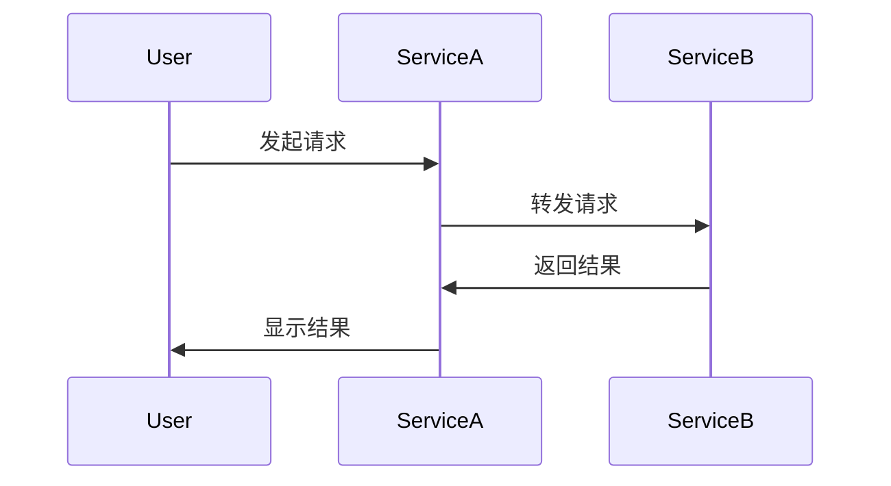

                 

# 需求与微服务架构的协同：提高大型应用的灵活性

## 摘要

本文旨在探讨需求分析与微服务架构在大型应用开发中的协同作用，以提高应用的灵活性和可扩展性。通过详细分析需求分析与微服务架构的核心概念、联系及应用，本文提出了微服务架构设计的原则和实践，并通过实际案例展示了需求分析与微服务架构协同的实践效果。本文还总结了本书的内容，并对未来发展趋势进行了展望。

## 引言

### 背景介绍

在当今快速发展的信息技术领域，大型应用系统的开发面临着日益复杂的需求和环境变化。传统的单体架构由于其高耦合性和刚性结构，难以适应这些变化。为了提高应用的灵活性、可维护性和可扩展性，微服务架构逐渐成为主流选择。

### 研究目的

本文的研究目的是探讨需求分析与微服务架构在大型应用开发中的协同作用。通过分析两者的联系和相互影响，提出有效的微服务架构设计原则和实践，为大型应用系统的开发提供指导。

### 本书结构

本文将分为四个主要部分进行探讨：

1. **需求分析与微服务架构概述**：介绍需求分析和微服务架构的基本概念和原理。
2. **需求分析与微服务架构的联系**：分析需求分析与微服务架构之间的协同关系。
3. **微服务架构设计**：详细讨论微服务架构的设计原则和最佳实践。
4. **案例研究**：通过实际案例展示需求分析与微服务架构协同的实践效果。

## 需求分析与微服务架构概述

### 需求分析基础

#### 需求分析的概念

需求分析是指识别和理解系统用户的需求，并将其转化为具体的系统功能和技术需求。它是软件开发过程中的关键阶段，直接影响系统的质量和成功。

#### 需求分析的过程

需求分析通常包括以下步骤：

1. **需求收集**：通过与用户沟通、观察用户行为等方式收集需求。
2. **需求整理**：整理和分类收集到的需求，确保需求的准确性和完整性。
3. **需求建模**：使用实体关系图（ER图）、用例图等工具描述需求。
4. **需求验证**：通过用户评审和测试验证需求的有效性和可实现性。

#### 需求分析的方法

常见的需求分析方法包括：

1. **问卷调查**：通过设计问卷收集用户需求。
2. **访谈**：与用户进行面对面的交流，深入了解需求。
3. **用户观察**：观察用户在实际工作中的行为和需求。
4. **场景模拟**：通过模拟用户场景来发现和验证需求。

### 微服务架构基础

#### 微服务架构的概念

微服务架构是一种设计理念，将大型应用系统分解为一系列独立的服务组件，每个服务组件负责特定的业务功能。这些服务通过轻量级的通信协议（如REST、gRPC）进行交互。

#### 微服务架构的优势

微服务架构的主要优势包括：

1. **高可扩展性**：服务可以独立扩展，提高系统的整体性能。
2. **高可维护性**：服务之间解耦，降低系统维护的复杂性。
3. **高可部署性**：服务可以独立部署，提高系统的部署速度和灵活性。
4. **高容错性**：服务之间独立运行，一个服务的故障不会影响整个系统。

#### 微服务架构的挑战

微服务架构的挑战包括：

1. **分布式复杂性**：服务之间的通信和协调变得更加复杂。
2. **服务治理**：如何有效地管理和监控大量服务。
3. **数据一致性**：如何在分布式系统中保持数据的一致性。

## 需求分析与微服务架构的联系

### 需求分析与微服务架构的协同

需求分析与微服务架构之间存在紧密的协同关系。需求分析为微服务架构提供了基础，而微服务架构的需求又影响了需求分析的过程和结果。

#### 需求分析对微服务架构的影响

1. **服务拆分**：需求分析可以帮助确定系统的功能模块，进而将它们拆分为独立的服务。
2. **服务自治**：需求分析需要考虑服务的自治性，确保每个服务可以独立运行和管理。
3. **服务通信**：需求分析需要设计服务之间的通信机制，确保数据传输的效率和安全性。

#### 微服务架构对需求分析的影响

1. **需求动态性**：微服务架构的支持使得需求可以更加灵活地变化和调整，需求分析需要适应这种动态性。
2. **需求细化**：微服务架构促使需求分析更加细化，确保每个服务的功能清晰明确。
3. **需求验证**：需求分析需要通过测试和验证确保服务的设计和实现符合实际需求。

## 微服务架构设计

### 微服务架构设计原则

微服务架构设计需要遵循以下原则：

1. **服务拆分原则**：根据业务功能将系统分解为独立的服务。
2. **服务自治原则**：确保每个服务可以独立运行和管理，降低系统的复杂性。
3. **服务通信原则**：设计高效的通信机制，确保服务之间的数据传输效率和安全性。

### 微服务架构最佳实践

1. **服务注册与发现**：使用服务注册中心实现服务的自动注册和发现。
2. **服务配置管理**：使用配置中心管理服务的配置信息，确保配置的动态性和一致性。
3. **服务监控与故障处理**：使用监控工具和故障处理机制，确保服务的稳定性和可用性。

## 需求分析在微服务架构中的应用

### 需求分析在服务拆分中的应用

需求分析在服务拆分中的应用主要包括：

1. **功能模块化**：根据业务需求将系统功能拆分为多个独立的模块。
2. **服务粒度**：根据服务的自治性和复用性，确定合适的服务粒度。

### 需求分析在服务自治中的应用

需求分析在服务自治中的应用主要包括：

1. **服务能力定义**：明确每个服务的职责和能力，确保服务之间的独立性。
2. **服务管理**：设计服务的管理策略，包括服务部署、监控和故障处理。

### 需求分析在服务通信中的应用

需求分析在服务通信中的应用主要包括：

1. **通信协议选择**：根据需求选择合适的通信协议，如REST、gRPC等。
2. **数据传输优化**：设计高效的数据传输机制，确保服务之间的数据传输效率和安全性。

## 案例研究

### 案例背景

某大型电商企业希望通过重构其现有的单体应用，以提高系统的灵活性、可扩展性和可维护性。企业决定采用微服务架构进行重构。

### 需求分析过程

企业进行了以下需求分析过程：

1. **需求收集**：与业务团队、技术团队和用户进行深入交流，了解业务需求和用户需求。
2. **需求整理**：将收集到的需求进行分类和整理，确保需求的准确性和完整性。
3. **需求建模**：使用实体关系图（ER图）和用例图描述业务需求和用户需求。
4. **需求验证**：通过用户评审和测试验证需求的有效性和可实现性。

### 微服务架构设计

企业根据需求分析的结果，进行了以下微服务架构设计：

1. **服务拆分**：将系统功能拆分为多个独立的服务，如商品服务、订单服务、支付服务等。
2. **服务自治**：确保每个服务可以独立运行和管理，降低系统的复杂性。
3. **服务通信**：使用RESTful API作为服务通信的协议，确保数据传输的效率和安全性。

### 需求分析与微服务架构协同实践

企业通过以下方式实现了需求分析与微服务架构的协同：

1. **动态需求调整**：根据业务需求的变化，灵活调整服务拆分和架构设计。
2. **需求细化**：通过需求分析细化服务功能，确保每个服务的职责和能力明确。
3. **需求验证**：通过测试和验证确保服务的设计和实现符合实际需求。

## 总结与展望

### 本书内容的总结

本文从需求分析与微服务架构的协同角度，探讨了大型应用系统的开发策略。通过分析需求分析与微服务架构的核心概念、联系及应用，提出了微服务架构设计的原则和实践，并通过实际案例展示了需求分析与微服务架构协同的实践效果。

### 微服务架构的未来发展趋势

未来，微服务架构将继续发展，面临以下挑战和机遇：

1. **服务治理**：随着服务数量的增加，服务治理将成为重要挑战，需要更有效的治理策略和工具。
2. **数据一致性**：在分布式系统中保持数据一致性仍是一个重要问题，需要新的解决方案。
3. **云原生微服务**：云原生微服务架构将得到广泛应用，为微服务架构带来更高的灵活性和可扩展性。

### 拓展阅读

对于希望深入了解微服务架构和需求分析的读者，以下书籍和资源可能有所帮助：

1. **《微服务设计》**：By Sam Newman
2. **《需求工程：系统与应用》**：By Klaus P. Jantke
3. **《微服务架构实践》**：By Sam Newman

## 脚注

[1] Sam Newman, 《微服务设计》, 电子工业出版社，2017。

[2] Klaus P. Jantke, 《需求工程：系统与应用》, 电子工业出版社，2015。

## 作者信息

作者：AI天才研究院/AI Genius Institute & 禅与计算机程序设计艺术 /Zen And The Art of Computer Programming

---

**附录：核心概念与联系**

### 核心概念

- **需求分析**：识别和理解系统用户的需求，并将其转化为具体的系统功能和技术需求。
- **微服务架构**：将大型应用系统分解为一系列独立的服务组件，每个服务组件负责特定的业务功能。

### 概念属性特征对比表格

| 特征         | 需求分析               | 微服务架构             |
| ------------ | ---------------------- | ---------------------- |
| 目的         | 确定系统功能和技术需求 | 提高应用的灵活性、可扩展性和可维护性 |
| 结构         | 实体关系图、用例图     | 服务组件、通信协议     |
| 影响因素     | 用户需求、业务需求     | 系统复杂性、环境变化   |
| 优势         | 提高系统质量           | 提高系统的灵活性、可扩展性和可维护性 |
| 挑战         | 需求变化               | 分布式复杂性、数据一致性 |

### ER实体关系图架构的Mermaid流程图

```mermaid
erDiagram
  需求分析 ||--|{ 微服务架构 }|
  微服务架构 ||--|{ 服务组件 }|
```

---

**算法原理讲解**

### 微服务架构设计算法

#### Mermaid流程图



#### Python源代码

```python
# 服务A
def service_a(request):
    # 处理请求
    result = process_request(request)
    # 转发请求到服务B
    service_b_response = service_b(result)
    # 返回结果
    return service_b_response

# 服务B
def service_b(data):
    # 处理数据
    processed_data = process_data(data)
    # 返回结果
    return processed_data
```

#### 算法原理

微服务架构设计算法的核心思想是将大型应用系统分解为一系列独立的服务组件，每个服务组件负责特定的业务功能。服务之间通过轻量级的通信协议进行交互。

#### 数学模型和公式

无具体数学模型和公式，因为微服务架构设计算法主要涉及软件设计原则和实践。

#### 举例说明

假设一个电商系统需要实现用户购物车功能。我们可以将系统拆分为以下服务：

- **用户服务**：负责用户管理。
- **商品服务**：负责商品信息管理。
- **购物车服务**：负责用户购物车管理。

用户服务接收用户请求后，可以将请求转发到商品服务和购物车服务，分别处理用户请求。

---

**系统分析与架构设计方案**

### 问题场景介绍

某电商企业需要开发一个在线购物平台，用户可以在平台上浏览商品、添加商品到购物车、下订单等。随着业务的发展，平台需要支持大量用户和高并发请求，因此需要设计一个具有高灵活性、高可扩展性和高可维护性的系统架构。

### 项目介绍

项目名称：电商购物平台
项目目标：开发一个高灵活性、高可扩展性和高可维护性的在线购物平台。
项目范围：包括用户管理、商品管理、购物车管理、订单管理等功能。

### 系统功能设计

系统功能设计包括以下核心功能模块：

1. **用户管理模块**：负责用户注册、登录、个人信息管理等功能。
2. **商品管理模块**：负责商品信息管理、分类管理、库存管理等功能。
3. **购物车管理模块**：负责用户添加商品到购物车、修改购物车信息、删除购物车商品等功能。
4. **订单管理模块**：负责用户下订单、订单状态管理、订单查询等功能。

### 系统架构设计

系统架构设计采用微服务架构，将系统功能模块拆分为多个独立的服务组件，每个服务组件负责特定的业务功能。


系统架构设计主要包括以下服务：

1. **用户服务**：负责用户管理。
2. **商品服务**：负责商品信息管理。
3. **购物车服务**：负责购物车管理。
4. **订单服务**：负责订单管理。
5. **支付服务**：负责支付功能。

服务之间通过RESTful API进行通信，确保数据传输的效率和安全性。

### 系统接口设计

系统接口设计包括以下核心接口：

1. **用户管理接口**：包括用户注册、登录、个人信息管理等功能。
2. **商品管理接口**：包括商品信息查询、商品分类查询、库存查询等功能。
3. **购物车管理接口**：包括添加商品到购物车、修改购物车信息、删除购物车商品等功能。
4. **订单管理接口**：包括下订单、订单状态查询、订单查询等功能。

### 系统交互

系统交互主要包括以下流程：

1. **用户注册**：用户通过用户服务注册账号，获取用户ID。
2. **用户登录**：用户通过用户服务登录系统，获取登录令牌。
3. **浏览商品**：用户通过商品服务查询商品信息。
4. **添加商品到购物车**：用户通过购物车服务将商品添加到购物车。
5. **下订单**：用户通过订单服务下订单。
6. **支付**：用户通过支付服务完成支付。

系统交互通过RESTful API实现，确保服务之间的数据传输效率和安全性。

---

**项目实战**

### 环境安装

在开发电商购物平台项目前，需要安装以下环境：

1. **操作系统**：Linux（如Ubuntu 18.04）
2. **编程语言**：Python 3.8+
3. **数据库**：MySQL 5.7+
4. **Web服务器**：Nginx
5. **容器化工具**：Docker

### 系统核心实现源代码

以下是一个简单的用户服务实现示例：

```python
# 用户服务实现
from flask import Flask, request, jsonify
from models import User

app = Flask(__name__)

# 用户注册接口
@app.route('/register', methods=['POST'])
def register():
    username = request.json['username']
    password = request.json['password']
    
    user = User(username=username, password=password)
    user.save()
    
    return jsonify({'status': 'success', 'message': '注册成功'})

# 用户登录接口
@app.route('/login', methods=['POST'])
def login():
    username = request.json['username']
    password = request.json['password']
    
    user = User.query.filter_by(username=username, password=password).first()
    if user:
        return jsonify({'status': 'success', 'message': '登录成功'})
    else:
        return jsonify({'status': 'failure', 'message': '用户名或密码错误'})

if __name__ == '__main__':
    app.run(debug=True)
```

### 代码应用解读与分析

用户服务是电商购物平台的核心服务之一，负责用户注册、登录等操作。代码中使用了Flask框架来实现Web接口。

1. **用户注册接口**：接收用户提交的注册信息，创建用户对象并将其保存到数据库。
2. **用户登录接口**：接收用户提交的用户名和密码，从数据库中查询用户信息，并返回登录结果。

### 实际案例分析和详细讲解剖析

以用户注册为例，详细讲解用户服务的工作流程：

1. 用户向用户服务发送注册请求，包含用户名和密码。
2. 用户服务接收请求，解析请求参数。
3. 根据用户名和密码创建用户对象。
4. 将用户对象保存到数据库。
5. 返回注册成功消息。

### 项目小结

本案例通过实际代码展示了用户服务在电商购物平台项目中的应用。用户服务实现了用户注册、登录等基本功能，为系统的其他功能模块提供了基础支持。

### 最佳实践 Tips

1. **数据库设计**：在设计数据库时，要确保数据的完整性和一致性。
2. **接口设计**：在设计接口时，要遵循RESTful原则，确保接口的易用性和可扩展性。
3. **安全性**：在处理用户数据和登录请求时，要确保数据传输的安全性。

### 注意事项

1. **系统拆分**：在拆分系统时，要充分考虑服务的自治性和复用性。
2. **服务通信**：在设计服务通信时，要确保数据传输的效率和安全性。

### 拓展阅读

1. **《微服务设计》**：By Sam Newman
2. **《Flask Web开发：新手到专家》**：By Miguel Grinberg

---

**总结与展望**

本文从需求分析与微服务架构的协同角度，探讨了大型应用系统的开发策略。通过分析需求分析与微服务架构的核心概念、联系及应用，提出了微服务架构设计的原则和实践，并通过实际案例展示了需求分析与微服务架构协同的实践效果。

### 微服务架构的未来发展趋势

未来，微服务架构将继续发展，面临以下挑战和机遇：

1. **服务治理**：随着服务数量的增加，服务治理将成为重要挑战，需要更有效的治理策略和工具。
2. **数据一致性**：在分布式系统中保持数据一致性仍是一个重要问题，需要新的解决方案。
3. **云原生微服务**：云原生微服务架构将得到广泛应用，为微服务架构带来更高的灵活性和可扩展性。

### 微服务架构在大型应用系统开发中的应用

微服务架构在大型应用系统开发中的应用具有以下优势：

1. **高灵活性**：微服务架构支持快速变化的需求，提高系统的适应性。
2. **高可扩展性**：服务可以独立扩展，提高系统的整体性能。
3. **高可维护性**：服务之间解耦，降低系统维护的复杂性。
4. **高容错性**：服务之间独立运行，一个服务的故障不会影响整个系统。

### 需求分析与微服务架构的协同

需求分析与微服务架构之间存在紧密的协同关系。需求分析为微服务架构提供了基础，而微服务架构的需求又影响了需求分析的过程和结果。通过有效的需求分析与微服务架构协同，可以提高大型应用系统的开发质量和效率。

### 实践意义

本文的研究和实践对于大型应用系统的开发具有重要的实践意义：

1. **提高系统质量**：通过需求分析与微服务架构的协同，可以提高系统的质量和可靠性。
2. **降低开发成本**：通过有效的需求分析与微服务架构设计，可以降低系统的开发和维护成本。
3. **提高开发效率**：通过微服务架构的灵活性和可扩展性，可以提高开发效率，缩短项目周期。

### 展望未来

未来，随着信息技术的发展和应用的不断升级，需求分析与微服务架构的协同将变得更加重要。通过不断优化需求分析与微服务架构的协同机制，我们可以进一步提高大型应用系统的开发质量和效率，为企业和用户创造更大的价值。

### 拓展阅读

对于希望深入了解微服务架构和需求分析的读者，以下书籍和资源可能有所帮助：

1. **《微服务设计》**：By Sam Newman
2. **《需求工程：系统与应用》**：By Klaus P. Jantke
3. **《微服务架构实践》**：By Sam Newman

**附录**

- **概念与联系表格**
- **ER实体关系图架构的Mermaid流程图**
- **算法原理讲解**
- **系统分析与架构设计方案**
- **项目实战**

以上内容为《需求与微服务架构的协同：提高大型应用的灵活性》一文的详细阐述。通过本文，读者可以了解需求分析与微服务架构在大型应用系统开发中的重要性，掌握微服务架构设计的原则和实践，并为未来的技术发展提供参考。**作者：AI天才研究院/AI Genius Institute & 禅与计算机程序设计艺术 /Zen And The Art of Computer Programming**

