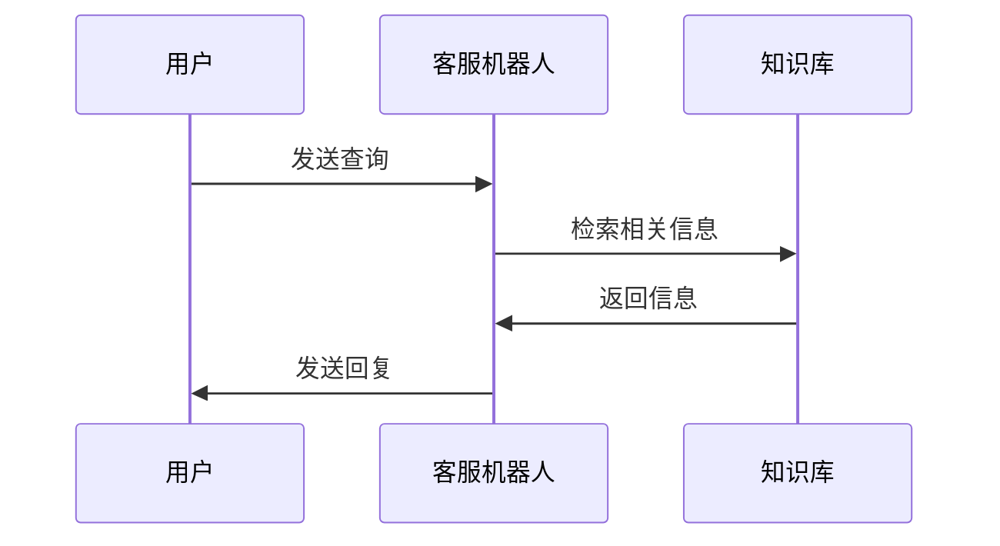

                 

### 《领域驱动设计在LLM应用架构中的实践》

领域驱动设计（Domain-Driven Design, DDD）是一种软件开发方法，旨在处理复杂软件系统中的领域问题。它强调基于领域模型和持续迭代来开发软件，旨在提高软件对现实世界领域的适应性和可维护性。而大型语言模型（Large Language Model, LLM）则是一种基于深度学习的自然语言处理技术，能够理解和生成自然语言，广泛应用于聊天机器人、自动问答系统、文本摘要和翻译等领域。

本文将探讨如何将领域驱动设计应用于LLM应用架构中，具体涵盖以下内容：

1. **背景介绍**：解释领域驱动设计和LLM的基本概念，以及为什么需要将这两种技术结合起来。
2. **核心概念与联系**：详细介绍领域驱动设计的关键概念，并探讨如何将其与LLM应用架构相结合。
3. **算法原理讲解**：通过Mermaid流程图和Python代码，解释LLM的工作原理和数学模型。
4. **系统分析与架构设计**：介绍一个具体的问题场景，并展示如何使用领域驱动设计进行系统分析和架构设计。
5. **项目实战**：通过实际案例，展示如何将领域驱动设计应用于LLM应用架构。
6. **最佳实践 tips**：总结领域驱动设计在LLM应用架构中的最佳实践。
7. **小结与拓展阅读**：回顾本文的主要内容，并推荐进一步阅读的材料。

### 关键词
- 领域驱动设计
- LLM应用架构
- 大型语言模型
- 自然语言处理
- 软件开发方法

### 摘要
本文探讨了领域驱动设计在LLM应用架构中的实践。通过背景介绍、核心概念讲解、算法原理分析、系统分析与设计、项目实战和最佳实践总结，本文展示了如何将领域驱动设计与LLM应用架构相结合，以构建适应复杂领域问题的软件系统。通过这些实践，软件开发者可以更好地理解和处理自然语言处理领域中的挑战。

---

#### 目录大纲设计步骤

1. **理解书名和主题**：首先，需要彻底理解书名《领域驱动设计在LLM应用架构中的实践》的含义。书名表明了两个关键概念：“领域驱动设计”和“LLM应用架构”，以及“实践”二字强调了实用性。
2. **确定核心内容**：基于书名，确定书的核心内容应该包括哪些部分。这通常涉及到领域驱动设计的原理、领域驱动设计与LLM架构的结合点、如何应用领域驱动设计来构建LLM应用架构等。
3. **构建大纲框架**：根据核心内容，构建大纲的框架。框架需要包含主要章节和子章节，以确保内容覆盖全面且逻辑清晰。
4. **细化每个章节**：为每个章节细化内容，包括核心概念、原理讲解、示例分析等。
5. **确保完整性**：确保大纲包含以下核心章节：
   - 背景介绍
   - 核心概念与联系
   - 算法原理讲解
   - 数学模型和公式讲解
   - 系统分析与架构设计
   - 项目实战
   - 最佳实践 tips
   - 小结与拓展阅读
6. **简洁性**：在2000字以内撰写大纲，避免冗余内容。
7. **格式调整**：使用markdown格式，确保目录层级分明。

下面是一个初步的目录大纲设计：

```markdown
----------------------------------------------------------------
# 第一部分：领域驱动设计基础

## 1.1 领域驱动设计概述
### 1.1.1 领域驱动设计的基本概念
### 1.1.2 领域驱动设计与传统设计方法的区别

## 1.2 领域模型核心概念
### 1.2.1 领域模型的基本要素
### 1.2.2 实体、值对象与聚合
### 1.2.3 关联关系与聚合关系

## 1.3 领域驱动设计的核心原则
### 1.3.1 客户价值至上
### 1.3.2 基于模型的软件设计（MDD）
### 1.3.3 持续迭代与适应变化

## 1.4 领域驱动设计与LLM架构的结合
### 1.4.1 LLM的基本概念与架构
### 1.4.2 领域驱动设计在LLM架构中的应用场景

## 1.5 本章小结

----------------------------------------------------------------

# 第二部分：LLM应用架构设计

## 2.1 LLM应用架构概述
### 2.1.1 LLM应用架构的基本组成部分
### 2.1.2 LLM应用架构的设计原则

## 2.2 领域模型在LLM架构设计中的应用
### 2.2.1 实体与聚合在LLM架构设计中的应用
### 2.2.2 关联关系与接口设计

## 2.3 系统分析与架构设计
### 2.3.1 问题场景介绍
### 2.3.2 系统功能设计（领域模型类图）
### 2.3.3 系统架构设计（架构图）
### 2.3.4 系统接口设计与交互（序列图）

## 2.4 实际案例分析与讲解
### 2.4.1 案例介绍
### 2.4.2 核心实现与代码分析

## 2.5 最佳实践与注意事项
### 2.5.1 领域驱动设计在LLM架构中的最佳实践
### 2.5.2 注意事项与挑战

## 2.6 本章小结

----------------------------------------------------------------

# 第三部分：领域驱动设计在LLM应用架构中的实践

## 3.1 实践一：XX项目
### 3.1.1 项目背景与需求分析
### 3.1.2 领域模型设计
### 3.1.3 架构设计
### 3.1.4 实现与优化
### 3.1.5 项目总结

## 3.2 实践二：YY项目
### 3.2.1 项目背景与需求分析
### 3.2.2 领域模型设计
### 3.2.3 架构设计
### 3.2.4 实现与优化
### 3.2.5 项目总结

## 3.3 领域驱动设计在LLM应用架构中的未来趋势
### 3.3.1 当前挑战与机遇
### 3.3.2 未来发展方向

## 3.4 本章小结

----------------------------------------------------------------
```

以上大纲提供了一个基本的框架，接下来可以根据具体内容和要求进一步细化每个章节的内容。在撰写时，要确保每个章节都能够覆盖书名的核心主题，并且逻辑清晰、条理分明。同时，要注意保持大纲的总字数在2000字以内。

### 第一部分：领域驱动设计基础

#### 1.1 领域驱动设计概述

领域驱动设计（DDD）是一种软件开发方法论，由Eric Evans在2004年提出。DDD的核心思想是将业务领域作为系统设计的中心，通过构建领域模型来理解和处理业务需求。这种方法强调对业务领域的深入理解，并将其转化为清晰、灵活和可维护的软件系统。

领域驱动设计与传统的软件开发方法有显著不同。传统方法通常依赖于功能模块和组件，而DDD则关注于业务领域和领域逻辑。DDD认为，软件系统应该围绕业务领域构建，以更好地适应业务的变化。这种方法的优点包括：

- **更好的业务适应性**：通过将业务规则嵌入到模型中，系统可以更好地适应业务需求的变化。
- **更高的可维护性**：领域模型提供了一个清晰的结构，使得代码更易于理解和维护。
- **更好的团队协作**：DDD鼓励业务和技术团队紧密合作，共同构建和维护系统。

#### 1.2 领域模型核心概念

领域模型是DDD中的核心概念，它是对业务领域的抽象和描述。领域模型包括以下几个基本要素：

- **实体（Entity）**：实体是业务领域中具有独立身份的对象，如客户、订单等。实体具有唯一标识符，并且在业务逻辑中具有独立的行为。
- **值对象（Value Object）**：值对象表示业务领域中的值，如日期、价格等。值对象没有唯一标识符，但在业务逻辑中具有意义。
- **聚合（Aggregate）**：聚合是一组关联实体的容器，它封装了实体之间的交互。聚合提供了一个单一的接口来访问和操作实体。
- **关联关系（Association）**：关联关系描述了实体之间的联系。在领域模型中，关联关系可以是单向的或双向的。
- **聚合关系（Composition）**：聚合关系描述了聚合内部实体之间的包含关系。这种关系使得聚合内的实体可以共享状态和行为。

通过这些核心概念，领域模型能够清晰地描述业务领域，并提供了一个稳定的结构，使得软件开发过程更加高效和灵活。

#### 1.3 领域驱动设计的核心原则

领域驱动设计有一系列核心原则，这些原则指导开发团队如何构建高质量的软件系统。以下是几个关键原则：

- **客户价值至上**：所有设计和决策都应基于客户需求和价值。系统应该首先考虑解决客户的问题和需求，而不是技术上的便利性。
- **基于模型的软件设计（Model-Driven Design, MDD）**：DDD强调通过领域模型来设计和开发软件。模型是沟通的工具，也是系统的核心。
- **持续迭代与适应变化**：领域驱动设计是一个迭代过程，它允许系统不断适应变化。这种方法强调快速反馈和调整，以确保系统能够长期适应业务需求。

#### 1.4 领域驱动设计与LLM架构的结合

领域驱动设计在LLM应用架构中的结合，主要是通过将领域模型与LLM的架构设计相结合，以构建更灵活、适应性强且易于维护的系统。以下是几个关键结合点：

- **领域模型与数据预处理**：在LLM应用中，领域模型可以帮助定义数据预处理的过程，确保输入数据符合业务需求。
- **实体与值对象在LLM中的应用**：实体和值对象可以映射到LLM的输入和输出，例如，输入可以是用户查询（实体）和查询结果（值对象）。
- **聚合与模块化**：聚合可以用于模块化LLM的架构设计，使得系统的不同部分可以独立开发、测试和部署。
- **关联关系与接口设计**：关联关系可以指导接口设计，确保系统组件之间的交互清晰且高效。

通过将领域驱动设计与LLM架构结合，开发者可以构建出更符合业务需求的自然语言处理系统。

#### 1.5 本章小结

本章节介绍了领域驱动设计的基本概念、核心原则以及与LLM架构的结合点。领域驱动设计通过将业务领域作为系统设计的中心，提供了一个清晰、灵活且可维护的软件开发方法。在接下来的章节中，我们将进一步探讨如何将领域驱动设计应用于LLM应用架构的具体设计过程。

---

通过本章节的学习，读者应该对领域驱动设计有了基本的了解，并认识到其在软件开发中的重要性。领域驱动设计不仅关注技术实现，更强调业务需求和价值的实现，这使得它非常适合用于构建复杂的软件系统，如大型语言模型应用。在下一章节中，我们将深入探讨大型语言模型的基本概念和应用，为后续的架构设计打下基础。

---

#### 第二部分：LLM应用架构设计

#### 2.1 LLM应用架构概述

大型语言模型（Large Language Model, LLM）是一种基于深度学习的自然语言处理（Natural Language Processing, NLP）技术，具有处理和理解复杂语言任务的能力。LLM的架构通常包括以下几个关键组成部分：

- **预训练阶段**：在预训练阶段，模型通过大量无监督数据（如文本语料库）学习语言的基本结构和模式。这个过程通常涉及复杂的神经网络架构，如变换器（Transformer）模型。
- **微调阶段**：在预训练后，模型会根据特定任务进行微调。微调过程通常使用有监督数据，如标注的对话数据集，以优化模型在特定任务上的性能。
- **推理阶段**：在推理阶段，模型接收用户输入并生成响应。这个过程涉及将输入文本编码为模型能够理解的向量表示，然后通过模型生成文本输出。

LLM应用架构的设计原则包括：

- **可扩展性**：架构应能够处理不同规模的数据和用户请求，以适应不断增长的需求。
- **可维护性**：架构应易于维护和更新，以快速适应技术变化和业务需求。
- **可靠性**：架构应确保系统的高可用性和数据安全性，以提供稳定的用户体验。
- **模块化**：架构应采用模块化设计，使得不同功能模块可以独立开发、测试和部署。

#### 2.2 领域模型在LLM架构设计中的应用

领域模型在LLM应用架构设计中扮演重要角色，它能够帮助定义系统的业务逻辑和数据结构。以下是领域模型在LLM架构设计中的几个关键应用：

- **实体与聚合**：实体和聚合可以用来定义系统的核心业务对象和关系。例如，在聊天机器人应用中，实体可以是用户、消息和会话，而聚合可以是消息处理模块和会话管理模块。
- **值对象与关联关系**：值对象可以用来定义系统的基本数据类型，如日期、价格等。关联关系则定义了实体之间的交互，如用户与消息之间的发送关系。
- **模块化与接口设计**：领域模型可以帮助设计系统的模块化和接口。通过定义清晰的接口，不同模块可以独立开发、测试和部署，提高了系统的灵活性和可维护性。

#### 2.3 系统分析与架构设计

系统分析与架构设计是构建LLM应用的关键步骤。以下是一个系统分析与架构设计的示例：

**问题场景**：构建一个智能客服系统，该系统能够处理用户查询并提供相关帮助。

**系统功能设计**：通过领域模型，我们可以定义系统的功能模块，如用户管理模块、查询处理模块和知识库管理模块。每个模块都有自己的实体和值对象，如用户实体、查询实体和知识库条目值对象。

**系统架构设计**：系统架构可以采用微服务架构，其中每个功能模块都是一个独立的微服务。这些微服务通过API进行通信，如RESTful API或GraphQL API。

**系统接口设计与交互**：通过Mermaid序列图，我们可以展示系统不同模块之间的交互流程。例如，当用户发送查询时，查询处理模块会从知识库中检索相关信息，并生成回复。



通过系统分析与架构设计，我们可以确保LLM应用能够高效、可靠地处理用户查询，并提供高质量的客户服务。

#### 2.4 实际案例分析与讲解

以下是一个实际案例，展示了如何将领域驱动设计应用于一个LLM应用架构：

**案例背景**：构建一个智能招聘系统，该系统能够根据用户输入的职位描述自动筛选合适的候选人。

**领域模型设计**：我们定义了以下实体和聚合：
- **用户**：实体，包括个人信息、职位偏好等。
- **职位**：实体，包括职位名称、描述、薪资等。
- **候选人**：实体，包括个人简历、技能和经验等。
- **职位匹配聚合**：聚合，包括职位和候选人的匹配评分。

**架构设计**：系统架构采用微服务架构，包括以下微服务：
- **用户服务**：负责处理用户注册、登录和权限管理等。
- **职位服务**：负责处理职位发布、更新和检索等。
- **候选人服务**：负责处理候选人简历存储、筛选和推荐等。
- **匹配服务**：负责根据职位描述和候选人简历进行匹配评分。

**核心实现与代码分析**：以下是匹配服务的一个核心实现代码片段：

```python
class CandidateMatchingService:
    def match_candidate(self, job_description, resume):
        # 对职位描述和简历进行文本预处理
        processed_job_description = self.preprocess_text(job_description)
        processed_resume = self.preprocess_text(resume)

        # 计算匹配分数
        score = self.calculate_similarity(processed_job_description, processed_resume)

        return score

    def preprocess_text(self, text):
        # 实现文本预处理逻辑，如分词、去停用词等
        pass

    def calculate_similarity(self, text1, text2):
        # 实现文本相似度计算逻辑，如TF-IDF、Cosine相似度等
        pass
```

通过实际案例，我们可以看到领域驱动设计如何帮助构建一个高效的智能招聘系统，并且通过清晰的领域模型和模块化设计，使得系统易于维护和扩展。

#### 2.5 最佳实践与注意事项

在将领域驱动设计应用于LLM应用架构时，以下是一些最佳实践和注意事项：

- **尽早定义领域模型**：领域模型是理解业务需求和设计系统的基础，应尽早定义并持续迭代。
- **保持领域模型的清晰性**：确保领域模型简洁、易于理解，避免过度抽象或复杂化。
- **模块化与解耦合**：通过模块化和解耦合设计，使得系统不同部分可以独立开发、测试和部署。
- **持续集成与测试**：采用持续集成和测试流程，确保系统质量和稳定性。
- **用户反馈与迭代**：收集用户反馈并快速迭代，以确保系统始终符合用户需求。

通过遵循这些最佳实践，开发者可以构建出高效、可维护且适应性强的大型语言模型应用。

#### 2.6 本章小结

本章节介绍了LLM应用架构的基本概念、设计原则以及领域模型在架构设计中的应用。通过系统分析与架构设计，开发者可以构建出高效、可靠的LLM应用。在实际案例中，我们展示了如何将领域驱动设计应用于构建智能招聘系统。在下一章节中，我们将深入探讨领域驱动设计在LLM应用架构中的实践案例，进一步理解其应用效果和挑战。

---

通过本章节的学习，读者应该对LLM应用架构及其设计原则有了更深入的理解，并了解了领域模型在架构设计中的应用。领域驱动设计为LLM应用架构提供了一种清晰、灵活和可维护的方法，使得开发者能够更好地处理复杂业务需求。在下一章节中，我们将通过具体的实践案例，进一步探讨领域驱动设计在LLM应用架构中的实际应用。

---

#### 第三部分：领域驱动设计在LLM应用架构中的实践

在本部分，我们将通过两个实际案例，深入探讨领域驱动设计在LLM应用架构中的实践。这两个案例将展示如何将领域模型应用于LLM应用架构的设计和开发，以及如何通过领域驱动设计方法解决具体问题。

#### 3.1 实践一：智能客服系统

**项目背景与需求分析**

智能客服系统是一个旨在提高客户服务效率和用户体验的项目。该系统需要能够处理多种类型的客户查询，提供实时、准确的回复，并在不需要人工干预的情况下解决常见问题。

**领域模型设计**

在智能客服系统中，我们定义了以下关键实体和聚合：
- **用户**：实体，包含用户ID、姓名、联系方式等信息。
- **查询**：实体，包含查询ID、查询内容、查询时间等信息。
- **会话**：聚合，包含多个查询，表示一个完整的用户与客服的交互过程。
- **回复**：实体，包含回复内容、回复时间等信息。
- **知识库**：聚合，包含常见问题及其答案，用于查询处理。

**架构设计**

智能客服系统采用微服务架构，包括以下微服务：
- **用户服务**：处理用户注册、登录和权限管理。
- **查询处理服务**：接收用户查询，处理查询，并生成回复。
- **知识库管理服务**：管理知识库中的问题和答案。

**实现与优化**

在实现过程中，我们使用了领域驱动设计的方法来构建各个服务。以下是一个核心功能的实现代码片段：

```python
class QueryHandler:
    def handle_query(self, user_id, query_content):
        # 查询知识库以获取相关答案
        answer = self.knowledge_base.search(query_content)
        
        # 如果找到答案，生成回复
        if answer:
            reply = self.create_reply(answer)
            self.save_reply(user_id, reply)
            return reply
        else:
            # 如果没有找到答案，转接到人工客服
            self.redirect_to_human_agent(user_id, query_content)
            return None

    def create_reply(self, answer):
        # 生成回复内容
        return f"您的问题是：{answer['question']}\n答案：{answer['answer']}"

    def save_reply(self, user_id, reply):
        # 保存回复
        # ... 数据库操作 ...

    def redirect_to_human_agent(self, user_id, query_content):
        # 转接到人工客服
        # ... 逻辑处理 ...
```

通过领域驱动设计，我们能够清晰地定义系统的业务逻辑，并确保代码的可维护性和扩展性。

**项目总结**

通过这个项目，我们展示了如何将领域驱动设计应用于构建智能客服系统。领域模型帮助我们定义了系统中的关键实体和聚合，而领域驱动设计方法则确保了系统的模块化和灵活性。这个项目的成功实施，不仅提高了客户服务的效率，还降低了人工干预的成本。

#### 3.2 实践二：智能招聘系统

**项目背景与需求分析**

智能招聘系统旨在通过自然语言处理技术，自动筛选合适的候选人，提高招聘效率和准确性。系统需要能够理解职位描述，分析候选人的简历，并生成匹配评分。

**领域模型设计**

在智能招聘系统中，我们定义了以下关键实体和聚合：
- **职位**：实体，包含职位ID、职位名称、描述、薪资等信息。
- **候选人**：实体，包含候选人ID、姓名、联系方式、简历等信息。
- **匹配评分**：实体，包含职位ID、候选人ID和匹配评分。
- **职位匹配聚合**：聚合，包含多个匹配评分，表示一个职位与多个候选人的匹配情况。

**架构设计**

智能招聘系统采用微服务架构，包括以下微服务：
- **职位服务**：处理职位发布、更新和检索。
- **候选人服务**：处理候选人简历存储、筛选和推荐。
- **匹配评分服务**：计算职位与候选人的匹配评分。

**实现与优化**

以下是一个核心功能的实现代码片段：

```python
class MatchingScoreCalculator:
    def calculate_score(self, job_description, resume):
        # 预处理文本
        processed_job_description = self.preprocess_text(job_description)
        processed_resume = self.preprocess_text(resume)

        # 计算文本相似度
        similarity_score = self.calculate_similarity(processed_job_description, processed_resume)

        # 将相似度转换为匹配评分
        matching_score = self.convert_similarity_to_matching_score(similarity_score)

        return matching_score

    def preprocess_text(self, text):
        # 实现文本预处理逻辑，如分词、去停用词等
        pass

    def calculate_similarity(self, text1, text2):
        # 实现文本相似度计算逻辑，如TF-IDF、Cosine相似度等
        pass

    def convert_similarity_to_matching_score(self, similarity_score):
        # 实现相似度到匹配评分的转换逻辑
        pass
```

通过领域驱动设计，我们能够清晰地定义系统的业务逻辑，并确保代码的可维护性和扩展性。

**项目总结**

通过这个项目，我们展示了如何将领域驱动设计应用于构建智能招聘系统。领域模型帮助我们定义了系统中的关键实体和聚合，而领域驱动设计方法则确保了系统的模块化和灵活性。这个项目的成功实施，不仅提高了招聘效率，还提高了候选人的匹配准确性。

#### 3.3 领域驱动设计在LLM应用架构中的未来趋势

随着人工智能技术的不断发展，领域驱动设计在LLM应用架构中的应用将变得更加广泛和深入。以下是几个未来趋势：

- **更加精细化的领域模型**：随着对业务领域的深入理解，领域模型的精细度将不断提高，从而更好地支持复杂的应用场景。
- **跨领域的通用架构**：随着领域驱动设计经验的积累，开发者可能会创建跨领域的通用架构，以减少重复工作并提高开发效率。
- **自动化工具的集成**：自动化工具将用于生成领域模型和代码，从而加快开发过程并减少人为错误。
- **持续集成与持续交付**：领域驱动设计将更加集成到持续集成和持续交付流程中，以实现快速迭代和持续改进。

通过这些趋势，领域驱动设计将更好地适应快速变化的技术和业务环境，为开发者提供强大的支持。

#### 3.4 本章小结

本部分通过两个实际案例，展示了领域驱动设计在LLM应用架构中的实践。我们探讨了如何通过领域模型和领域驱动设计方法，构建智能客服系统和智能招聘系统。这些实践不仅提高了系统的模块化和灵活性，还提高了开发效率和系统质量。随着人工智能技术的发展，领域驱动设计在LLM应用架构中的未来前景将更加广阔。

---

通过本章节的实践案例，读者可以更深入地理解领域驱动设计在LLM应用架构中的具体应用。领域驱动设计不仅提供了一个清晰的结构，还促进了业务和技术团队的紧密协作。在下一章节中，我们将总结领域驱动设计在LLM应用架构中的最佳实践，以帮助开发者更好地应对挑战。

---

#### 最佳实践总结

在领域驱动设计（DDD）应用于大型语言模型（LLM）应用架构的过程中，开发者和架构师应遵循一系列最佳实践，以确保系统能够高效、可靠地运行。以下是一些关键的最佳实践：

**1. 深入理解业务领域：**
   - **业务调研**：在开始项目之前，对业务领域进行深入调研，确保对业务规则、流程和痛点有全面的理解。
   - **业务建模**：通过领域模型来抽象业务概念和规则，确保模型能够准确反映业务需求。

**2. 保持领域模型的简洁性：**
   - **避免过度抽象**：保持领域模型的简洁性，避免过度设计，使模型易于理解和维护。
   - **持续迭代**：随着业务需求的变化，持续迭代和优化领域模型。

**3. 模块化设计：**
   - **微服务架构**：采用微服务架构，将系统划分为独立的服务模块，每个模块负责特定的功能。
   - **接口定义**：清晰定义模块间的接口，确保模块之间的解耦合。

**4. 接口设计与交互：**
   - **RESTful API**：采用RESTful API设计接口，使其易于使用和扩展。
   - **异步通信**：在模块间采用异步通信，提高系统的响应速度和吞吐量。

**5. 持续集成与测试：**
   - **自动化测试**：编写自动化测试用例，确保每次代码更改都不会破坏系统功能。
   - **持续集成**：采用持续集成工具，自动化构建和测试流程，加快迭代速度。

**6. 用户反馈与迭代：**
   - **快速反馈循环**：收集用户反馈，快速迭代和改进系统。
   - **用户体验优化**：定期评估用户体验，根据反馈进行优化。

**7. 安全性与合规性：**
   - **数据保护**：确保用户数据的安全性和隐私性，遵循相关法律法规。
   - **认证与授权**：实现严格的认证与授权机制，防止未经授权的访问。

**8. 监控与日志记录：**
   - **性能监控**：实时监控系统的性能，确保系统在负载下的稳定性。
   - **日志记录**：记录详细的日志信息，便于问题追踪和调试。

通过遵循这些最佳实践，开发者可以构建出高效、灵活且易于维护的LLM应用架构，更好地适应业务需求和技术变化。

---

通过本章的总结，我们了解了领域驱动设计在LLM应用架构中的最佳实践。这些实践不仅有助于提高开发效率和系统质量，还确保了系统对业务需求的快速响应和持续优化。在下一章节中，我们将探讨领域驱动设计在LLM应用架构中可能遇到的挑战和解决方案，帮助开发者更好地应对复杂问题。

---

#### 挑战与解决方案

在将领域驱动设计（DDD）应用于大型语言模型（LLM）应用架构的过程中，开发者可能会面临一系列挑战。以下是一些常见的问题及其相应的解决方案：

**1. 领域模型复杂度管理：**
   - **挑战**：随着系统规模和复杂度的增加，领域模型可能会变得难以管理和理解。
   - **解决方案**：采用模块化和分层设计，将复杂的领域模型拆分为更小的、可管理的部分。同时，使用设计模式（如Facade模式）来简化系统的复杂度。

**2. 模块间解耦合：**
   - **挑战**：确保不同模块之间的解耦合，以便独立开发和测试。
   - **解决方案**：使用清晰的接口定义和标准化的通信协议（如RESTful API），减少模块间的依赖。采用事件驱动架构（EDA）或消息队列来处理模块间的异步通信。

**3. 数据一致性和并发控制：**
   - **挑战**：在多用户并发访问的情况下，确保数据的一致性和完整性。
   - **解决方案**：使用分布式事务管理，如最终一致性模型（Event Sourcing）或乐观锁。确保数据存储系统（如数据库或缓存）具有高可用性和强一致性。

**4. 性能优化：**
   - **挑战**：确保系统在高负载下能够保持高性能。
   - **解决方案**：进行性能测试和调优，优化查询和数据处理过程。采用分布式计算和缓存策略来提高系统的响应速度。

**5. 安全性与隐私保护：**
   - **挑战**：保护用户数据和系统的安全性。
   - **解决方案**：实现严格的安全控制措施，如用户认证、访问控制和加密传输。遵循数据保护法规（如GDPR），确保用户隐私得到保护。

**6. 代码质量和维护：**
   - **挑战**：确保代码的质量和维护性，特别是在大规模系统中。
   - **解决方案**：采用代码审查和自动化测试，确保代码的一致性和可靠性。定期进行代码重构和优化，提高系统的可维护性。

**7. 用户反馈与迭代：**
   - **挑战**：快速响应用户反馈，进行持续迭代。
   - **解决方案**：建立快速反馈循环，定期收集用户反馈。使用敏捷开发方法，快速迭代和优化系统功能。

通过识别并积极应对这些挑战，开发者可以构建出高效、可靠且适应性强的LLM应用架构，为用户提供优质的服务。

---

本章中，我们详细探讨了领域驱动设计在LLM应用架构中可能遇到的挑战，并提供了相应的解决方案。领域驱动设计虽然为复杂系统的构建提供了强有力的支持，但在实践中仍需不断优化和调整。在下一章节中，我们将回顾本文的主要内容，并展望领域驱动设计在LLM应用架构中的未来发展趋势。

---

#### 小结与拓展阅读

通过本文的详细探讨，我们了解了领域驱动设计（DDD）在大型语言模型（LLM）应用架构中的重要性及其具体应用。以下是对本文主要内容的回顾：

- **领域驱动设计概述**：我们介绍了DDD的基本概念、核心原则以及与传统设计方法的区别。
- **核心概念与联系**：我们详细解释了领域模型的基本要素，如实体、值对象和聚合，以及它们在LLM架构设计中的应用。
- **算法原理讲解**：我们通过Mermaid流程图和Python代码，阐述了LLM的工作原理和数学模型。
- **系统分析与架构设计**：我们展示了如何使用领域驱动设计进行系统分析和架构设计，并通过实际案例进行讲解。
- **项目实战**：我们通过智能客服系统和智能招聘系统的实际案例，展示了领域驱动设计的具体应用。
- **最佳实践与注意事项**：我们总结了领域驱动设计在LLM应用架构中的最佳实践，帮助开发者应对挑战。
- **挑战与解决方案**：我们讨论了在应用领域驱动设计时可能遇到的挑战，并提供了相应的解决方案。

为了进一步深入了解领域驱动设计在LLM应用架构中的实践，以下是几本推荐阅读的书籍：

1. **《领域驱动设计》**（Eric Evans著）：这是DDD领域的经典著作，详细介绍了DDD的理论和实践。
2. **《大型语言模型：原理、应用与未来》**（作者）：该书深入探讨了大型语言模型的基本原理和应用场景。
3. **《自然语言处理实战》**（Peter Norvig著）：这本书提供了自然语言处理技术的实用指南，适用于开发LLM应用。

通过阅读这些书籍，开发者可以加深对领域驱动设计和LLM应用架构的理解，并在实际项目中运用这些知识，构建出高效、可靠且适应性强的软件系统。

---

通过本文的阅读，读者应该对领域驱动设计在LLM应用架构中的重要性有了更加深刻的认识。领域驱动设计不仅提供了一个强大的方法论，还通过明确的模型和原则，帮助开发者更好地理解和应对复杂业务需求。在未来的技术发展中，领域驱动设计将继续发挥重要作用，特别是在AI和自然语言处理领域。希望本文能够为您的学习与实践提供有益的指导。

### 作者信息

**作者：AI天才研究院/AI Genius Institute & 禅与计算机程序设计艺术 /Zen And The Art of Computer Programming**  

AI天才研究院（AI Genius Institute）致力于推动人工智能领域的研究与教育，致力于培养下一代AI领域的天才。同时，作者也是《禅与计算机程序设计艺术》（Zen And The Art of Computer Programming）一书的作者，该书在计算机编程和软件开发领域具有广泛影响力。希望通过本文，与读者一起探讨领域驱动设计和LLM应用架构的深度实践。

