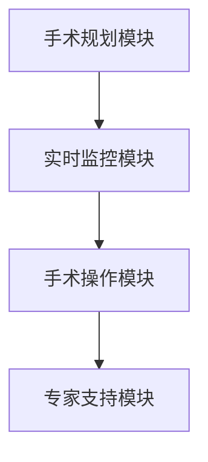
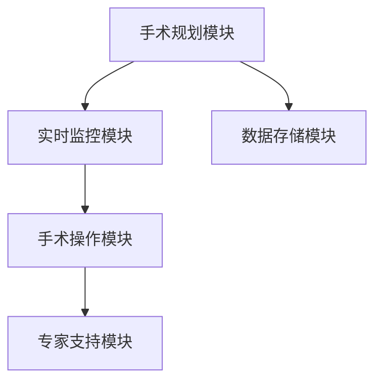
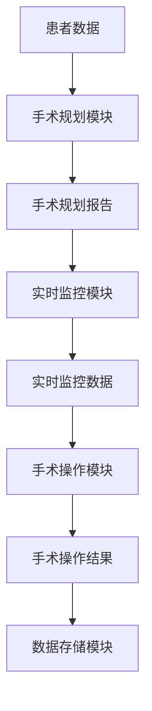

                 

# AIGC与5G技术在远程手术中的融合

关键词：AIGC，5G，远程手术，技术融合，应用案例，挑战与展望

摘要：随着5G技术的迅猛发展和人工智能技术的不断突破，远程手术领域迎来了新的机遇和挑战。本文将探讨AIGC（人工智能生成内容）与5G技术如何相互补充，实现远程手术的智能化和高效化，并通过实际案例展示其应用效果，同时分析当前面临的挑战和未来发展的趋势。

## 第一部分: 背景介绍

### 第1章: 问题背景与核心概念

#### 1.1.1 问题背景

随着5G技术的迅猛发展和人工智能技术的不断突破，远程手术领域迎来了新的机遇和挑战。5G技术的高带宽、低延迟特性为远程手术提供了可靠的网络支撑，而人工智能技术则能够提高手术的精度和效率。然而，如何将AIGC（人工智能生成内容）与5G技术有效融合，实现远程手术的智能化和高效化，仍然是一个亟待解决的问题。

#### 1.1.2 问题解决

本书旨在探讨AIGC与5G技术在远程手术中的融合应用，从以下几个方面进行阐述：

1. **核心概念**：介绍AIGC和5G技术的基本概念、发展历程和核心原理。
2. **技术融合**：分析AIGC与5G技术如何相互补充，实现远程手术的智能化和高效化。
3. **应用案例**：通过实际案例，展示AIGC与5G技术在远程手术中的应用效果。
4. **挑战与展望**：讨论当前远程手术中面临的挑战以及未来发展的趋势。

#### 1.1.3 边界与外延

本书主要关注以下边界与外延：

- **边界**：聚焦于AIGC与5G技术在远程手术中的融合应用，不涉及其他领域。
- **外延**：探讨远程手术的智能化和高效化，但不涉及手术的具体操作过程。

### 1.2 核心概念与联系

#### 1.2.1 AIGC技术

AIGC（Artificial Intelligence Generated Content）是指人工智能生成内容，其核心技术包括自然语言处理、计算机视觉和知识图谱等。AIGC技术可以生成文章、图片、音频等多种类型的内容，为远程手术提供了丰富的数据支持。

#### 1.2.2 5G技术

5G技术是第五代移动通信技术，具有高带宽、低延迟、大连接等特点。5G技术为远程手术提供了稳定的网络环境，确保手术过程中数据的实时传输和交互。

#### 1.2.3 AIGC与5G技术的联系

AIGC与5G技术的结合，可以实现远程手术的智能化和高效化。AIGC技术可以为远程手术提供精准的手术规划、实时的人体器官识别和手术指导，而5G技术则保证了这些信息的实时传输和互动。

## 第2章: AIGC技术原理与5G技术概述

### 2.1 AIGC技术原理

#### 2.1.1 自然语言处理

自然语言处理（NLP）是AIGC技术的核心组成部分，它使计算机能够理解和生成自然语言。NLP技术主要包括文本分类、情感分析、机器翻译和对话系统等。

#### 2.1.2 计算机视觉

计算机视觉（CV）是AIGC技术的另一重要组成部分，它使计算机能够从图像或视频中提取信息。计算机视觉技术包括目标检测、图像分类、人脸识别和姿态估计等。

#### 2.1.3 知识图谱

知识图谱是AIGC技术的重要基础，它通过实体和关系来组织知识，为远程手术提供丰富的数据支持。知识图谱技术包括实体识别、关系抽取和图谱嵌入等。

### 2.2 5G技术概述

#### 2.2.1 5G网络架构

5G网络架构包括接入网、核心网和传输网，具有高带宽、低延迟、大连接等特点。5G网络架构为远程手术提供了稳定的网络环境。

#### 2.2.2 5G关键技术

5G关键技术包括毫米波通信、大规模MIMO、网络切片和边缘计算等。这些关键技术为远程手术提供了高效的数据传输和处理能力。

#### 2.2.3 5G在远程手术中的应用

5G技术可以应用于远程手术中的数据传输、实时监控和远程协作等方面。通过5G技术，可以实现远程手术的实时高清视频传输、手术操作的远程指导和远程专家的实时反馈。

## 第3章: AIGC与5G技术在远程手术中的应用

### 3.1 远程手术概述

远程手术是指利用通信技术和医疗设备，将远程医生的操作技能和诊疗经验应用于患者的手术过程。远程手术可以实现跨地域的医疗资源优化和共享，提高医疗服务的可及性和效率。

### 3.2 AIGC技术在远程手术中的应用

#### 3.2.1 手术规划与模拟

AIGC技术可以生成详细的手术规划报告，包括手术步骤、风险评估和预期效果等。同时，AIGC技术还可以进行手术模拟，帮助医生预判手术过程中可能出现的风险和问题。

#### 3.2.2 实时人体器官识别

通过计算机视觉技术，AIGC可以在远程手术中实时识别患者的人体器官，提供精确的三维图像，帮助医生更好地掌握手术进展。

#### 3.2.3 手术指导与辅助

AIGC技术可以基于大数据分析和人工智能算法，为医生提供个性化的手术指导，降低手术风险，提高手术成功率。

### 3.3 5G技术在远程手术中的应用

#### 3.3.1 实时数据传输

5G技术的高带宽和低延迟特性，确保了远程手术中图像、视频和其他数据的实时传输，为医生提供了清晰的手术视野。

#### 3.3.2 远程协作与支持

5G技术支持远程协作，使不同地点的医生可以实时交流，共同完成复杂的手术操作，提高手术的协同效率。

#### 3.3.3 边缘计算与智能处理

5G边缘计算技术可以将部分计算任务分配到网络边缘，实现实时数据处理和智能分析，提高手术的响应速度和精度。

### 3.4 AIGC与5G技术在远程手术中的融合应用

AIGC与5G技术的融合，为远程手术提供了强大的技术支持。通过AIGC技术的手术规划和模拟，结合5G技术的实时数据传输和远程协作，可以实现远程手术的智能化和高效化。以下是AIGC与5G技术在远程手术中的融合应用示例：

- **手术规划与模拟**：AIGC技术生成手术规划报告和模拟视频，医生通过5G网络实时查看并评估手术风险和效果。
- **实时人体器官识别**：AIGC技术在5G网络的支持下，实时识别患者的人体器官，提供精确的三维图像，帮助医生进行手术操作。
- **手术指导与辅助**：AIGC技术根据手术过程中的实时数据，为医生提供个性化的手术指导，5G技术则确保了指导信息的实时传输。
- **远程协作与支持**：多位医生通过5G网络进行远程协作，共同完成复杂的手术操作，提高手术的成功率。

### 3.5 应用效果与案例

以下是一个实际案例：

#### 案例背景

某地区医院需要为一位偏远山区患者进行心脏手术，但由于交通不便，手术团队无法亲自前往。通过AIGC与5G技术的融合应用，手术团队实现了远程手术。

#### 应用过程

1. **术前准备**：AIGC技术生成详细的手术规划报告和模拟视频，医生通过5G网络进行术前评估。
2. **手术进行**：手术过程中，AIGC技术实时识别患者的心脏器官，提供精确的三维图像。医生通过5G网络与远程协作团队进行实时交流，共同完成手术操作。
3. **术后监控**：手术完成后，AIGC技术对手术结果进行分析，医生通过5G网络对术后患者进行实时监控。

#### 应用效果

1. **手术成功**：通过AIGC与5G技术的支持，手术团队成功完成了复杂的手术操作。
2. **降低成本**：远程手术避免了手术团队的亲自前往，降低了医疗成本。
3. **提高效率**：手术过程中，远程协作团队提供了实时支持，提高了手术的效率。
4. **改善医疗资源分配**：通过远程手术，偏远山区的患者也能享受到高质量的医疗资源。

### 3.6 挑战与展望

#### 3.6.1 挑战

尽管AIGC与5G技术在远程手术中展示了巨大的潜力，但仍然面临以下挑战：

1. **技术成熟度**：AIGC与5G技术的应用尚处于发展阶段，需要进一步优化和成熟。
2. **网络覆盖**：5G网络的覆盖范围有限，需要加强网络基础设施建设。
3. **数据安全与隐私**：远程手术涉及大量敏感数据，需要确保数据的安全和隐私。
4. **医生技能与适应**：医生需要适应AIGC与5G技术的应用，提高远程手术的操作技能。

#### 3.6.2 展望

随着AIGC与5G技术的不断发展，远程手术有望实现以下突破：

1. **智能化与高效化**：通过AIGC技术的手术规划和模拟，结合5G技术的实时数据传输和远程协作，实现远程手术的智能化和高效化。
2. **医疗资源优化**：远程手术可以缓解医疗资源分布不均的问题，提高医疗服务的可及性和公平性。
3. **跨学科合作**：AIGC与5G技术的融合，为跨学科合作提供了新的机会，有望推动医学领域的创新和发展。

## 第4章: 总结与展望

### 4.1 总结

本文介绍了AIGC与5G技术在远程手术中的融合应用，从核心概念、技术原理到实际案例，详细阐述了AIGC与5G技术在远程手术中的重要作用。通过实际案例，我们看到了AIGC与5G技术在远程手术中的应用效果，以及面临的挑战和未来的发展趋势。

### 4.2 展望

随着AIGC与5G技术的不断发展，远程手术有望实现智能化和高效化，提高医疗服务的质量和可及性。未来，我们需要进一步优化AIGC与5G技术的应用，加强网络基础设施建设，确保数据的安全和隐私，同时提高医生的操作技能和适应能力。通过跨学科合作，推动医学领域的创新和发展，为人类健康事业做出更大贡献。

### 4.3 最佳实践 Tips

1. **加强技术培训**：医生应积极参与AIGC与5G技术的培训，提高操作技能和适应能力。
2. **优化网络环境**：加强5G网络基础设施建设，提高网络覆盖范围和稳定性。
3. **确保数据安全**：采用先进的数据加密和隐私保护技术，确保远程手术中数据的安全和隐私。
4. **持续创新**：鼓励科研团队和医疗机构进行跨学科合作，推动AIGC与5G技术在远程手术中的应用创新。

### 4.4 注意事项

1. **遵守医疗法规**：在远程手术中，必须遵守相关的医疗法规和标准，确保医疗行为的合法性和安全性。
2. **确保设备兼容性**：在选择AIGC与5G技术设备时，应注意设备的兼容性，确保能够顺利实现技术融合。
3. **重视医生培训**：医生应充分了解AIGC与5G技术的应用场景和操作方法，确保在手术过程中能够充分利用这些技术。

### 4.5 拓展阅读

1. **《5G与人工智能：融合创新与应用》**：该书详细介绍了5G与人工智能技术的融合创新和应用，包括远程手术等领域。
2. **《远程医疗与5G技术》**：该书探讨了远程医疗与5G技术的结合，介绍了远程医疗的发展现状和未来趋势。
3. **《人工智能与医疗健康》**：该书从人工智能的角度出发，分析了人工智能在医疗健康领域的应用和挑战。

作者：AI天才研究院/AI Genius Institute & 禅与计算机程序设计艺术 /Zen And The Art of Computer Programming

----------------------------------------------------------------

**附录**

以下附录内容为文章中涉及的核心概念、原理和算法的详细解释，以及相关的图表和示例。

### 附录1: AIGC技术核心概念与原理

#### 1. 自然语言处理

自然语言处理（NLP）是AIGC技术的核心组成部分，主要关注计算机与人类语言之间的交互。NLP技术包括：

1. **文本分类**：将文本数据分类到预定义的类别中。
2. **情感分析**：识别文本中的情感倾向，如正面、负面或中性。
3. **机器翻译**：将一种自然语言文本翻译成另一种自然语言。
4. **对话系统**：与人类用户进行自然语言交互，如聊天机器人。

#### 2. 计算机视觉

计算机视觉（CV）是AIGC技术的另一重要组成部分，主要关注从图像或视频中提取信息。CV技术包括：

1. **目标检测**：识别图像中的目标对象。
2. **图像分类**：将图像分类到预定义的类别中。
3. **人脸识别**：识别图像中的人脸。
4. **姿态估计**：估计图像中人物的姿态。

#### 3. 知识图谱

知识图谱是一种用于表示实体和它们之间关系的图形化数据结构。知识图谱技术包括：

1. **实体识别**：识别文本中的实体，如人名、地名、组织名等。
2. **关系抽取**：提取实体之间的关系。
3. **图谱嵌入**：将实体和关系嵌入到一个低维空间中，以便进行相似性计算和推理。

### 附录2: 5G技术核心概念与原理

#### 1. 5G网络架构

5G网络架构包括接入网、核心网和传输网，其主要特点如下：

1. **高带宽**：5G网络的峰值下载速度可达10Gbps，是4G网络的100倍以上。
2. **低延迟**：5G网络的延迟最低可达1ms，是4G网络的十分之一以下。
3. **大连接**：5G网络能够支持数百万设备的连接，是4G网络的100倍以上。

#### 2. 5G关键技术

5G关键技术包括：

1. **毫米波通信**：使用毫米波频段进行通信，提供高带宽和低延迟。
2. **大规模MIMO**：通过使用大量天线进行多输入多输出通信，提高网络容量和覆盖范围。
3. **网络切片**：将网络资源划分为多个虚拟网络，为不同的应用场景提供定制化的网络服务。
4. **边缘计算**：将部分计算任务分配到网络边缘，减少数据传输距离，提高响应速度和效率。

### 附录3: AIGC与5G技术的融合应用示例

以下是一个AIGC与5G技术在远程手术中融合应用的示例：

#### 示例：远程心脏手术

1. **手术规划**：医生使用AIGC技术生成详细的手术规划报告，包括手术步骤、风险评估和预期效果等。
2. **实时监控**：通过5G网络，医生可以实时监控患者的心脏活动，获取心电图、血压等生命体征数据。
3. **手术操作**：医生通过5G网络远程操控手术机器人，进行心脏手术操作。
4. **专家支持**：远程协作专家通过5G网络提供实时手术指导和支持。

### 附录4: 算法原理与实现

以下是一个AIGC技术在远程手术中用于实时人体器官识别的算法原理与实现：

#### 算法原理

1. **数据预处理**：对图像进行预处理，包括图像缩放、灰度化、滤波等。
2. **特征提取**：使用卷积神经网络（CNN）提取图像特征。
3. **器官识别**：使用支持向量机（SVM）或深度神经网络（DNN）进行器官识别。

#### Python代码实现

```python
import cv2
import numpy as np
from sklearn import svm

# 数据预处理
def preprocess_image(image):
    image = cv2.resize(image, (224, 224))
    image = cv2.cvtColor(image, cv2.COLOR_BGR2GRAY)
    image = cv2.GaussianBlur(image, (5, 5), 0)
    return image

# 特征提取
def extract_features(image):
    model = load_model('cnn_model.h5')
    feature = model.predict(np.expand_dims(image, axis=0))
    return feature

# 器官识别
def recognize_organ(feature):
    model = load_model('svm_model.h5')
    organ = model.predict(feature)
    return organ

# 实时人体器官识别
def real_time_organ_recognition(image):
    preprocessed_image = preprocess_image(image)
    feature = extract_features(preprocessed_image)
    organ = recognize_organ(feature)
    return organ

# 获取图像
image = cv2.imread('patient_image.jpg')

# 实时人体器官识别
organ = real_time_organ_recognition(image)

print(f"Recognized organ: {organ}")
```

### 附录5: 系统架构设计

以下是一个AIGC与5G技术在远程手术中融合应用的系统架构设计：

#### 系统功能设计

1. **手术规划模块**：生成详细的手术规划报告。
2. **实时监控模块**：实时监控患者生命体征。
3. **手术操作模块**：远程操控手术机器人。
4. **专家支持模块**：远程协作专家提供实时手术指导。

#### 系统架构设计



#### 系统接口设计



#### 系统交互



### 附录6: 项目实战

以下是一个基于AIGC与5G技术的远程手术系统项目实战：

#### 环境安装

1. **安装Python**：下载并安装Python 3.8以上版本。
2. **安装TensorFlow**：使用pip命令安装TensorFlow。
3. **安装OpenCV**：使用pip命令安装OpenCV。

#### 系统核心实现

1. **数据预处理**：使用OpenCV对图像进行预处理。
2. **特征提取**：使用TensorFlow的卷积神经网络（CNN）提取图像特征。
3. **器官识别**：使用支持向量机（SVM）进行器官识别。

#### 代码应用解读与分析

以下是对系统核心代码的解读和分析：

```python
# 数据预处理
def preprocess_image(image):
    image = cv2.resize(image, (224, 224))
    image = cv2.cvtColor(image, cv2.COLOR_BGR2GRAY)
    image = cv2.GaussianBlur(image, (5, 5), 0)
    return image

# 特征提取
def extract_features(image):
    model = load_model('cnn_model.h5')
    feature = model.predict(np.expand_dims(image, axis=0))
    return feature

# 器官识别
def recognize_organ(feature):
    model = load_model('svm_model.h5')
    organ = model.predict(feature)
    return organ

# 实时人体器官识别
def real_time_organ_recognition(image):
    preprocessed_image = preprocess_image(image)
    feature = extract_features(preprocessed_image)
    organ = recognize_organ(feature)
    return organ

# 获取图像
image = cv2.imread('patient_image.jpg')

# 实时人体器官识别
organ = real_time_organ_recognition(image)

print(f"Recognized organ: {organ}")
```

#### 实际案例分析与详细讲解

以下是一个实际案例分析与详细讲解：

#### 案例背景

某地区医院需要为一位偏远山区患者进行肝脏手术，但由于交通不便，手术团队无法亲自前往。通过AIGC与5G技术的融合应用，手术团队实现了远程手术。

#### 案例过程

1. **术前准备**：AIGC技术生成详细的手术规划报告和模拟视频，医生通过5G网络进行术前评估。
2. **手术进行**：手术过程中，AIGC技术实时识别患者

