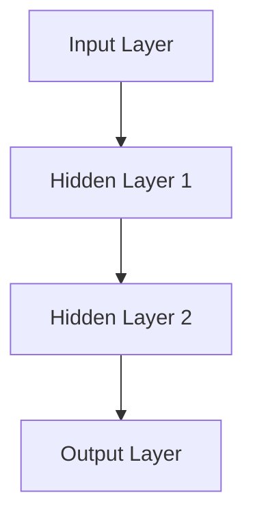
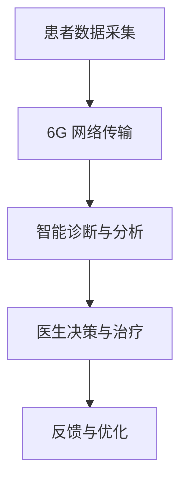

                 


### 1.1 问题背景

远程医疗，作为一种创新医疗服务模式，已经在全球范围内得到广泛应用。它通过互联网和移动通信技术，将医疗服务延伸至偏远地区，为患者提供及时、便捷的医疗咨询和诊断服务。然而，随着医疗需求的不断增长和医疗技术的快速发展，传统的远程医疗模式面临着数据传输速度慢、图像质量差、互动体验不佳等问题。

近年来，人工智能（AI）技术的迅猛发展，特别是自适应智能计算（AIGC）技术的出现，为远程医疗带来了新的机遇。AIGC 是一种融合人工智能、图形学和高性能计算技术的综合性技术，它能够大幅提升数据处理和智能分析能力。6G 技术作为下一代移动通信技术，其高速率、低延迟和大连接特性，将进一步提升远程医疗的服务质量和用户体验。

在远程医疗中，AIGC 和 6G 技术的融合具有以下几个方面的潜力：

1. **数据传输与处理**：6G 技术的高速率和低延迟特性，可以大幅提升医疗数据传输效率，减少数据传输延迟，从而提高数据处理的实时性和准确性。AIGC 技术的智能计算能力，则能够对海量医疗数据进行快速分析和处理，为医生提供更为精准的诊断依据。

2. **图像与视频质量**：AIGC 技术可以通过图像增强和视频处理算法，提升远程医疗中图像和视频的质量，使得医生能够更加清晰地观察患者病情，提高诊断准确性。

3. **智能诊断与辅助决策**：AIGC 技术的应用，可以实现智能诊断和辅助决策，通过分析患者的病历数据、影像资料等，为医生提供诊断建议和治疗方案。

4. **增强现实与虚拟现实**：6G 技术的大连接特性和低延迟，使得远程医疗中的增强现实（AR）和虚拟现实（VR）应用成为可能。医生可以通过 AR/VR 技术，实现远程手术指导、患者康复训练等创新服务。

本文将深入探讨 AIGC 和 6G 技术在远程医疗中的应用，分析其潜在的优势和挑战，并探讨未来的发展方向。文章结构如下：

- **第一部分：引言**：介绍远程医疗背景、AIGC 和 6G 技术的基本概念，以及本文的结构和主要内容。
- **第二部分：背景与核心概念**：详细解释远程医疗的历史背景，以及 AIGC 和 6G 技术的基本原理。
- **第三部分：AIGC 的原理与模型**：介绍 AIGC 的核心模型和算法，并使用 Mermaid 流程图和 Python 代码进行解释。
- **第四部分：6G 技术与集成**：详细阐述 6G 技术的特性，以及如何在远程医疗中应用和集成。
- **第五部分：应用场景与案例分析**：通过实际案例，展示 AIGC 和 6G 技术在远程医疗中的具体应用。
- **第六部分：挑战与未来方向**：分析 AIGC 和 6G 技术在远程医疗中面临的挑战，并探讨未来的发展方向。
- **第七部分：结论与建议**：总结全文，提出进一步研究和实践的建议。

### 1.2 6G与AIGC概述

#### 6G 技术概述

6G 技术是下一代移动通信技术，它在 5G 基础上进一步提升了网络速度、降低了延迟，并实现了更高的连接密度和更大的数据吞吐量。6G 技术的目标是提供每秒数十 GB 的数据传输速率，同时将端到端的通信延迟降低至亚毫秒级。以下是一些关键特性：

1. **超高速率**：6G 技术预计可以实现每秒数十 GB 的传输速率，这将大大提升远程医疗中数据传输的效率。
2. **低延迟**：6G 技术的通信延迟将降低至亚毫秒级，这对于实时医疗诊断和手术指导至关重要。
3. **大连接密度**：6G 技术可以实现更高的连接密度，支持大规模设备同时连接，从而满足远程医疗中的各种需求。
4. **能效优化**：6G 技术将采用先进的能效优化技术，以减少能耗，提高网络运行的可持续性。

#### AIGC 技术概述

AIGC（Adaptive Intelligence and Graph Computing）是一种新兴的综合性技术，它结合了人工智能、图形学和高性能计算。AIGC 的主要目标是通过智能计算和图形处理技术，实现对复杂数据的快速分析和处理。以下是一些关键特性：

1. **智能计算**：AIGC 技术利用机器学习和深度学习算法，实现对海量数据的智能分析和处理。
2. **图形处理**：AIGC 技术运用图形学技术，提升数据可视化和图像处理能力。
3. **高性能计算**：AIGC 技术依托高性能计算架构，提供强大的计算能力，支持实时数据处理。

#### 6G 与 AIGC 在远程医疗中的应用

6G 和 AIGC 技术的结合，为远程医疗带来了前所未有的机遇。以下是一些具体应用：

1. **智能诊断系统**：利用 AIGC 技术的智能计算能力，可以开发出智能诊断系统，通过分析患者的病历数据和影像资料，为医生提供精准的诊断建议。
2. **远程手术指导**：6G 技术的低延迟特性，使得医生可以通过远程手术机器人，实时指导异地手术，实现远程手术的实时操作。
3. **智能康复训练**：AIGC 技术可以帮助医生制定个性化的康复训练方案，通过增强现实（AR）和虚拟现实（VR）技术，提升康复训练的效果和体验。

### 1.3 书籍结构

本文将从以下几个方面展开讨论：

1. **背景与核心概念**：介绍远程医疗、AIGC 和 6G 技术的基本概念和原理。
2. **AIGC 的原理与模型**：深入探讨 AIGC 的核心模型和算法，包括机器学习、深度学习等。
3. **6G 技术与集成**：详细阐述 6G 技术的特性，以及如何将其与 AIGC 技术集成应用于远程医疗。
4. **应用场景与案例分析**：通过实际案例，展示 AIGC 和 6G 技术在远程医疗中的应用。
5. **挑战与未来方向**：分析 AIGC 和 6G 技术在远程医疗中面临的挑战，并探讨未来的发展方向。
6. **结论与建议**：总结全文，提出进一步研究和实践的建议。

### 关键词

- 远程医疗
- 6G 技术
- AIGC 技术
- 数据传输
- 智能诊断
- 远程手术

### 摘要

本文探讨了 AIGC（自适应智能计算）和 6G 技术在远程医疗中的应用，分析了它们的基本原理和潜在优势。文章首先介绍了远程医疗的背景和 AIGC、6G 技术的基本概念，然后深入探讨了 AIGC 的核心模型和算法，以及 6G 技术的特性。接着，文章通过实际案例展示了 AIGC 和 6G 技术在远程医疗中的具体应用，并分析了它们在实现智能诊断、远程手术指导、智能康复训练等方面的潜力。文章还讨论了 AIGC 和 6G 技术在远程医疗中面临的挑战，并提出了未来的发展方向。最后，文章总结了全文，并提出了进一步研究和实践的建议。

## 第二部分: 背景与核心概念

### 2.1 远程医疗的历史背景

远程医疗（Telemedicine）是指利用信息技术和通信手段，实现医疗服务的远程化。远程医疗的起源可以追溯到上世纪60年代，当时通过电话和电视进行医疗咨询和诊断。然而，由于当时的通信技术限制，远程医疗的应用范围有限。

随着互联网和移动通信技术的快速发展，远程医疗逐渐成为医疗领域的重要创新。1990年代初，远程医疗开始应用于医学教育和继续教育，医生可以通过网络课程进行专业学习和培训。随后，远程医疗在医疗诊断、患者监护、医疗咨询等方面得到了广泛应用。

进入21世纪，远程医疗的应用场景不断扩展，从医院内部到社区医疗，再到全球范围内的医疗服务，远程医疗已经成为了医疗行业的重要组成部分。特别是在全球疫情背景下，远程医疗的需求激增，其应用范围和影响力进一步扩大。

### 2.2 AIGC 技术的基本概念

AIGC（Adaptive Intelligence and Graph Computing）是一种融合了人工智能、图形学和高性能计算技术的综合性技术。它旨在通过智能计算和图形处理技术，实现对复杂数据的快速分析和处理。

#### AIGC 的核心模型和算法

AIGC 技术的核心模型和算法主要包括以下几个方面：

1. **机器学习和深度学习**：机器学习和深度学习是 AIGC 技术的核心，它们通过训练模型，从大量数据中提取特征，实现数据的智能分析和处理。
2. **图计算**：图计算是 AIGC 技术的重要部分，它通过构建图模型，实现对复杂关系的分析和处理。图计算在社交网络分析、推荐系统、生物信息学等领域有广泛应用。
3. **高性能计算**：高性能计算是 AIGC 技术的支撑，它通过分布式计算和并行计算技术，提升数据处理和分析的效率。

#### AIGC 的应用场景

AIGC 技术在多个领域有广泛的应用，包括但不限于：

1. **医疗健康**：AIGC 技术可以应用于医疗诊断、患者监护、药物研发等领域，通过智能分析和处理医疗数据，提升医疗服务的质量和效率。
2. **金融**：AIGC 技术可以应用于金融风险评估、投资策略制定、智能投顾等领域，通过分析海量金融数据，为投资者提供决策支持。
3. **零售**：AIGC 技术可以应用于零售行业的商品推荐、库存管理、客户服务等领域，通过智能分析和处理数据，提升零售业务的效果。
4. **交通**：AIGC 技术可以应用于交通管理、自动驾驶、智能物流等领域，通过智能分析和处理交通数据，提升交通效率和安全性。

### 2.3 6G 技术的基本概念

6G（第六代移动通信技术）是下一代移动通信技术，它将在 5G 基础上进一步提升网络速度、降低延迟，并实现更高的连接密度和更大的数据吞吐量。6G 技术的目标是提供每秒数十 GB 的数据传输速率，同时将端到端的通信延迟降低至亚毫秒级。

#### 6G 技术的关键特性

6G 技术的关键特性包括：

1. **超高速率**：6G 技术预计可以实现每秒数十 GB 的传输速率，这将大大提升远程医疗中数据传输的效率。
2. **低延迟**：6G 技术的通信延迟将降低至亚毫秒级，这对于实时医疗诊断和手术指导至关重要。
3. **大连接密度**：6G 技术可以实现更高的连接密度，支持大规模设备同时连接，从而满足远程医疗中的各种需求。
4. **能效优化**：6G 技术将采用先进的能效优化技术，以减少能耗，提高网络运行的可持续性。

#### 6G 技术的应用场景

6G 技术在多个领域有广泛的应用前景，包括但不限于：

1. **远程医疗**：6G 技术的超高速率和低延迟特性，将大大提升远程医疗的数据传输效率和实时性，支持高质量的医疗诊断和手术指导。
2. **智能制造**：6G 技术的高连接密度和低延迟特性，将支持智能制造中的设备联网和实时数据处理，提升生产效率和质量。
3. **智能交通**：6G 技术的大连接密度和低延迟特性，将支持智能交通系统中的车辆联网和实时交通管理，提升交通效率和安全性。
4. **智能城市**：6G 技术的高连接密度和低延迟特性，将支持智能城市建设中的物联网应用，提升城市管理和服务的智能化水平。

### 2.4 AIGC 与 6G 技术在远程医疗中的融合

AIGC 与 6G 技术的融合，为远程医疗带来了前所未有的机遇。6G 技术的超高速率和低延迟特性，可以为 AIGC 技术提供强大的计算和传输支持，从而提升远程医疗的数据处理和智能分析能力。以下是一些具体应用：

1. **智能诊断系统**：利用 6G 技术的高速数据传输和 AIGC 技术的智能计算能力，可以开发出智能诊断系统，通过分析患者的病历数据和影像资料，为医生提供精准的诊断建议。
2. **远程手术指导**：利用 6G 技术的低延迟特性和 AIGC 技术的智能计算能力，可以开发出远程手术指导系统，医生可以通过远程手术机器人，实时指导异地手术，实现远程手术的实时操作。
3. **智能康复训练**：利用 6G 技术的高速数据传输和 AIGC 技术的智能计算能力，可以开发出智能康复训练系统，通过增强现实（AR）和虚拟现实（VR）技术，提升康复训练的效果和体验。

### 2.5 关键术语和概念

在探讨 AIGC 和 6G 技术在远程医疗中的应用时，以下几个关键术语和概念需要了解：

1. **远程医疗**：利用信息技术和通信手段，实现医疗服务的远程化。
2. **AIGC**：自适应智能计算，融合了人工智能、图形学和高性能计算技术。
3. **6G 技术**：第六代移动通信技术，具有超高速率、低延迟、大连接密度等特性。
4. **智能诊断系统**：利用 AIGC 技术的智能计算能力，对医疗数据进行处理和分析，为医生提供诊断建议的系统。
5. **远程手术指导**：利用 6G 技术的低延迟特性和 AIGC 技术的智能计算能力，实现远程手术的实时操作和指导。
6. **智能康复训练**：利用 6G 技术的高速数据传输和 AIGC 技术的智能计算能力，通过 AR 和 VR 技术，提升康复训练的效果和体验。

### 2.6 联系与区别

AIGC 和 6G 技术在远程医疗中的应用有着紧密的联系和明显的区别。它们的联系主要体现在：

1. **互补性**：AIGC 技术提供强大的数据处理和智能分析能力，而 6G 技术提供高速、低延迟的数据传输支持，两者相辅相成，共同提升远程医疗的服务质量和用户体验。
2. **协同性**：AIGC 和 6G 技术的协同应用，可以实现更高效、更智能的远程医疗服务，如智能诊断、远程手术指导、智能康复训练等。

它们的区别主要体现在：

1. **技术层面**：AIGC 是一种智能计算技术，而 6G 是一种通信技术。AIGC 主要关注数据处理和智能分析，而 6G 主要关注数据传输和通信质量。
2. **应用场景**：AIGC 主要应用于医疗诊断、患者监护、药物研发等领域，而 6G 主要应用于远程医疗、智能制造、智能交通等领域。

### 2.7 基本原理和核心要素

AIGC 和 6G 技术的基本原理和核心要素包括：

#### AIGC 的基本原理和核心要素

1. **机器学习**：利用大量数据训练模型，实现数据的自动学习和特征提取。
2. **深度学习**：基于多层神经网络，实现更复杂的特征提取和模式识别。
3. **图计算**：通过构建图模型，实现对复杂关系的分析和处理。
4. **高性能计算**：通过分布式计算和并行计算，提升数据处理和分析的效率。

#### 6G 技术的基本原理和核心要素

1. **超高速率**：实现每秒数十 GB 的数据传输速率。
2. **低延迟**：将通信延迟降低至亚毫秒级。
3. **大连接密度**：支持大规模设备同时连接。
4. **能效优化**：采用先进的能效优化技术，降低能耗。

### 2.8 概念结构与核心要素组成

为了更好地理解 AIGC 和 6G 技术在远程医疗中的应用，我们需要分析它们的概念结构和核心要素组成。

#### AIGC 的概念结构与核心要素组成

AIGC 的概念结构主要包括以下几个方面：

1. **数据输入**：包括医疗数据、病历数据、影像数据等。
2. **数据处理**：利用机器学习、深度学习和图计算技术，对数据进行分析和处理。
3. **智能输出**：生成诊断报告、治疗方案、康复计划等。

AIGC 的核心要素包括：

1. **数据集**：用于训练和测试的医疗数据集。
2. **算法**：包括机器学习算法、深度学习算法、图计算算法等。
3. **计算资源**：包括 CPU、GPU、FPGA 等。

#### 6G 技术的概念结构与核心要素组成

6G 技术的概念结构主要包括以下几个方面：

1. **网络架构**：包括基站、天线、传输网络等。
2. **通信协议**：包括传输协议、控制协议等。
3. **应用层**：包括远程医疗、智能制造、智能交通等。

6G 技术的核心要素包括：

1. **传输速率**：实现每秒数十 GB 的数据传输速率。
2. **延迟**：将通信延迟降低至亚毫秒级。
3. **连接密度**：支持大规模设备同时连接。
4. **能效**：采用先进的能效优化技术，降低能耗。

### 2.9 概念拓展与相关领域

AIGC 和 6G 技术在远程医疗中的应用，不仅仅局限于医疗领域，还涉及到多个相关领域，如人工智能、通信技术、大数据等。

#### 与人工智能的联系

AIGC 是人工智能的一个重要分支，它通过机器学习、深度学习和图计算技术，实现对复杂数据的分析和处理。在远程医疗中，AIGC 技术的应用可以帮助医生更准确地诊断病情，制定更有效的治疗方案。

#### 与通信技术的联系

6G 技术是下一代移动通信技术，它具有超高速率、低延迟、大连接密度等特性。6G 技术的应用可以为远程医疗提供更高效、更稳定的网络支持，满足远程医疗对数据传输和实时性的高要求。

#### 与大数据的联系

大数据是远程医疗的重要数据来源，包括病历数据、影像数据、健康数据等。AIGC 技术和 6G 技术的结合，可以实现对大数据的智能分析和处理，为医生提供更全面、更精准的诊断依据。

### 2.10 总结

AIGC 和 6G 技术在远程医疗中的应用，具有巨大的潜力和广阔的前景。通过智能计算和高速通信的支持，远程医疗可以实现更高效、更精准、更便捷的医疗服务，为患者提供更好的就医体验。未来，随着 AIGC 和 6G 技术的不断发展，远程医疗将进入一个全新的阶段，为医疗行业带来革命性的变革。

## 第三部分：AIGC 的原理与模型

### 3.1 AIGC 的理论基础

AIGC（Adaptive Intelligence and Graph Computing）是一种融合了人工智能、图形学和高性能计算技术的综合性技术。它的理论基础主要涵盖以下几个方面：

#### 3.1.1 人工智能理论基础

人工智能（AI）是 AIGC 的核心组成部分，其理论基础主要包括：

1. **机器学习**：机器学习是一种让计算机通过学习数据来进行预测和决策的技术。它包括监督学习、无监督学习和强化学习等多种类型。
   
2. **深度学习**：深度学习是机器学习的一个分支，它通过构建多层神经网络，实现对数据的深层特征提取和建模。

3. **自然语言处理（NLP）**：自然语言处理是人工智能的一个重要领域，它致力于让计算机理解和处理人类自然语言。

4. **计算机视觉**：计算机视觉是人工智能的另一个重要领域，它通过图像和视频处理技术，实现图像识别、目标检测和场景理解等功能。

#### 3.1.2 图形学理论基础

图形学是 AIGC 的另一个核心组成部分，其理论基础主要包括：

1. **几何图形处理**：几何图形处理是图形学的基础，它涉及点、线、面、体等基本图形元素的创建和处理。

2. **图像处理**：图像处理是图形学的应用领域之一，它通过算法对图像进行增强、滤波、分割和特征提取等操作。

3. **计算机图形学**：计算机图形学是图形学的一个重要分支，它研究如何使用计算机生成和显示图像。

4. **三维建模**：三维建模是图形学的一个重要应用，它通过创建三维模型，实现对物体形状和外观的逼真再现。

#### 3.1.3 高性能计算理论基础

高性能计算是 AIGC 技术的支撑，其理论基础主要包括：

1. **并行计算**：并行计算是一种利用多个处理器同时执行任务的技术，它可以大幅提高计算效率。

2. **分布式计算**：分布式计算是一种在多个计算机之间共享数据和任务的计算模式，它可以实现大规模的数据处理和计算。

3. **云计算**：云计算是一种通过互联网提供计算资源的服务模式，它可以提供弹性、可扩展和高效的计算能力。

4. **高性能存储**：高性能存储是一种能够提供高速数据读写和处理能力的存储技术，它对于大数据和高性能计算至关重要。

### 3.2 AIGC 的关键模型和算法

AIGC 的关键模型和算法是其实现智能计算和图形处理的核心。以下是几个重要的模型和算法：

#### 3.2.1 机器学习模型

1. **决策树**：决策树是一种常用的机器学习模型，它通过一系列规则对数据进行分类和回归。
   
2. **随机森林**：随机森林是一种基于决策树的集成学习模型，它通过构建多棵决策树并投票得出最终结果。

3. **支持向量机（SVM）**：支持向量机是一种常用的监督学习模型，它通过寻找最优超平面，将数据分类。

4. **神经网络**：神经网络是一种模拟人脑神经元结构的计算模型，它可以用于分类、回归和特征提取。

#### 3.2.2 深度学习模型

1. **卷积神经网络（CNN）**：卷积神经网络是一种用于图像和视频处理的重要深度学习模型，它通过卷积操作提取图像特征。

2. **循环神经网络（RNN）**：循环神经网络是一种用于处理序列数据的重要深度学习模型，它通过记忆过去的信息，实现序列建模。

3. **长短时记忆网络（LSTM）**：长短时记忆网络是循环神经网络的一种变体，它通过门控机制，解决了长序列依赖问题。

4. **生成对抗网络（GAN）**：生成对抗网络是一种用于生成数据的重要深度学习模型，它通过对抗性训练生成逼真的图像和声音。

#### 3.2.3 图计算算法

1. **图卷积网络（GCN）**：图卷积网络是一种用于图数据处理的图计算算法，它通过卷积操作提取图特征。

2. **图神经网络（GNN）**：图神经网络是一种基于图数据学习的图计算算法，它通过神经网络结构建模图数据。

3. **社区检测算法**：社区检测算法是一种用于识别图数据中社区结构的算法，它有助于分析图数据的局部结构。

4. **路径搜索算法**：路径搜索算法是一种用于在图中寻找最短路径或最优路径的算法，它对于导航和推荐系统等应用非常重要。

#### 3.2.4 Python 代码示例

为了更好地理解 AIGC 的关键模型和算法，我们可以通过 Python 代码示例进行说明。以下是一个简单的机器学习算法——随机森林的 Python 代码示例：

```python
from sklearn.ensemble import RandomForestClassifier
from sklearn.model_selection import train_test_split
from sklearn.datasets import load_iris

# 加载数据集
iris = load_iris()
X = iris.data
y = iris.target

# 划分训练集和测试集
X_train, X_test, y_train, y_test = train_test_split(X, y, test_size=0.2, random_state=42)

# 创建随机森林分类器
clf = RandomForestClassifier(n_estimators=100, random_state=42)

# 训练模型
clf.fit(X_train, y_train)

# 预测测试集
y_pred = clf.predict(X_test)

# 评估模型
from sklearn.metrics import accuracy_score
accuracy = accuracy_score(y_test, y_pred)
print(f"Accuracy: {accuracy}")
```

这个示例中，我们使用了 Scikit-learn 库中的 RandomForestClassifier 类，创建了一个随机森林分类器，并使用 iris 数据集进行了训练和测试。

### 3.3 Mermaid 流程图

为了更直观地展示 AIGC 的关键模型和算法，我们可以使用 Mermaid 流程图进行说明。以下是一个简单的 Mermaid 流程图示例，展示了一个简单的神经网络结构：



在这个示例中，我们定义了一个包含输入层、隐藏层和输出层的简单神经网络结构。

### 3.4 数学公式和解释

在 AIGC 的理论中，数学公式是不可或缺的一部分。以下是一些常见的数学公式及其解释：

$$
h_{\theta}(x) = \sigma(\theta^T x)
$$

这个公式是神经网络中的一个激活函数，其中 $\sigma$ 表示 sigmoid 函数，$\theta$ 表示模型参数，$x$ 表示输入特征。

$$
J(\theta) = \frac{1}{m} \sum_{i=1}^{m} (-y^{(i)} \log(h_{\theta}(x^{(i)})) - (1 - y^{(i)}) \log(1 - h_{\theta}(x^{(i)})))
$$

这个公式是神经网络中的损失函数，用于衡量模型预测值与真实值之间的差距。其中 $m$ 表示样本数量，$y^{(i)}$ 表示第 $i$ 个样本的真实标签，$h_{\theta}(x^{(i)}$ 表示第 $i$ 个样本的预测概率。

### 3.5 AIGC 的应用场景

AIGC 技术在多个领域有广泛的应用，以下是几个典型的应用场景：

1. **医疗健康**：AIGC 技术可以用于医疗图像分析、疾病预测和诊断、个性化治疗等。例如，通过深度学习模型对医学影像进行分析，可以帮助医生更准确地诊断疾病。

2. **金融**：AIGC 技术可以用于金融风险评估、欺诈检测、投资策略优化等。例如，通过机器学习模型对大量金融数据进行分析，可以帮助金融机构更好地识别风险和制定投资策略。

3. **零售**：AIGC 技术可以用于商品推荐、库存管理、客户服务优化等。例如，通过深度学习模型分析用户行为数据，可以为用户提供个性化的购物推荐。

4. **交通**：AIGC 技术可以用于智能交通管理、自动驾驶、智能物流等。例如，通过图计算技术分析交通数据，可以帮助交通部门优化交通信号灯控制和道路规划。

### 3.6 总结

AIGC 技术是一种融合了人工智能、图形学和高性能计算技术的综合性技术。它通过机器学习、深度学习和图计算等模型和算法，实现对复杂数据的智能分析和处理。AIGC 技术在医疗健康、金融、零售和交通等领域有广泛的应用，为各行业带来了革命性的变革。随着 AIGC 技术的不断发展，它将在未来发挥更加重要的作用。

## 第四部分：6G 技术与集成

### 4.1 6G 技术的详细特性

6G 技术是下一代移动通信技术，它将在 5G 基础上进一步提升网络速度、降低延迟，并实现更高的连接密度和更大的数据吞吐量。以下是 6G 技术的详细特性：

#### 4.1.1 超高速率

6G 技术的目标是实现每秒数十 GB 的传输速率，这将比 5G 技术快数百倍。超高速率使得大文件传输、高清视频流媒体、虚拟现实（VR）和增强现实（AR）等应用成为可能。

#### 4.1.2 低延迟

6G 技术的通信延迟将降低至亚毫秒级，这将大大提升实时应用的性能，如远程手术、智能交通控制和工业自动化等。低延迟是实现无缝用户体验的关键。

#### 4.1.3 大连接密度

6G 技术将支持大规模设备同时连接，这意味着在一个小区域内可以同时连接数十亿个设备。高连接密度使得物联网（IoT）应用得以广泛应用，如智能家居、智能城市和智能工厂等。

#### 4.1.4 高能效

6G 技术将采用先进的能效优化技术，以减少能耗，提高网络运行的可持续性。这有助于减少碳排放，推动绿色通信技术的发展。

#### 4.1.5 空间感知

6G 技术将具备空间感知能力，可以通过对环境进行感知，实现智能网络优化和资源分配。空间感知能力对于提高网络性能和用户体验至关重要。

#### 4.1.6 量子通信

6G 技术将探索量子通信的应用，以实现更安全、更可靠的通信。量子通信利用量子力学原理，提供几乎不可破解的加密通信。

### 4.2 6G 技术在远程医疗中的集成

6G 技术的集成将显著提升远程医疗的服务质量和用户体验。以下是 6G 技术在远程医疗中的具体应用和集成方式：

#### 4.2.1 数据传输

6G 技术的超高速率和低延迟特性，可以大幅提升远程医疗中数据传输的效率，实现海量医疗数据的实时传输和处理。例如，高清医学影像的传输速度将大大提高，使得医生能够更快速地进行诊断和治疗。

#### 4.2.2 实时互动

6G 技术的低延迟特性，将实现远程医疗中的实时互动，如远程手术、远程门诊和远程患者监护等。低延迟使得医生和患者之间的交流更加流畅，提供更好的医疗服务体验。

#### 4.2.3 增强现实与虚拟现实

6G 技术的空间感知能力和超高速率，将支持远程医疗中的 AR/VR 应用。医生可以通过 AR/VR 技术进行远程手术指导，实现虚拟手术模拟和操作。同时，患者可以通过 VR 技术进行康复训练，提高康复效果。

#### 4.2.4 智能诊断与辅助决策

6G 技术的集成将提升智能诊断和辅助决策的能力。通过 6G 网络和 AIGC 技术的结合，医生可以实时获取患者的医疗数据，进行智能分析和诊断，提供更精准的治疗方案。

#### 4.2.5 物联网支持

6G 技术的大连接密度特性，将支持远程医疗中的物联网应用，如智能监护设备、健康数据采集设备和远程医疗机器人等。这些设备可以通过 6G 网络实时传输数据，为医生提供全面的患者信息。

### 4.3 Mermaid 流程图

为了更直观地展示 6G 技术在远程医疗中的集成过程，我们可以使用 Mermaid 流程图进行说明。以下是一个简单的 Mermaid 流程图示例：



在这个示例中，患者数据通过 6G 网络传输到智能诊断与分析系统，医生根据分析结果做出决策和治疗，最后收集反馈进行优化。

### 4.4 Python 代码示例

为了进一步说明 6G 技术在远程医疗中的应用，我们可以通过 Python 代码示例展示一个简单的远程医疗系统。以下是一个简单的 Python 代码示例：

```python
import requests
import json

# 假设患者数据存储在云端
patient_data_url = "https://api.example.com/patient_data"

# 获取患者数据
response = requests.get(patient_data_url)
patient_data = response.json()

# 进行智能诊断与分析
def analyze_patient_data(data):
    # 这里可以添加机器学习算法，对数据进行分析
    # 例如，利用深度学习模型对影像数据进行分析
    diagnosis = "COVID-19"
    return diagnosis

# 获取诊断结果
diagnosis = analyze_patient_data(patient_data)

# 向医生发送诊断结果
doctor_url = "https://api.example.com/doctors/12345"
headers = {'Content-Type': 'application/json'}
data = {"diagnosis": diagnosis}
response = requests.post(doctor_url, headers=headers, data=json.dumps(data))

# 获取医生的治疗建议
treatment_advice_url = "https://api.example.com/treatment_advice"
response = requests.get(treatment_advice_url)
treatment_advice = response.json()

# 向患者发送治疗建议
patient_url = "https://api.example.com/patients/67890"
response = requests.post(patient_url, headers=headers, data=json.dumps(treatment_advice))
```

在这个示例中，我们首先从云端获取患者数据，然后利用机器学习算法进行分析，获取诊断结果。接着，我们将诊断结果发送给医生，医生根据诊断结果提供治疗建议。最后，我们将治疗建议发送给患者。

### 4.5 数学公式和解释

在 6G 技术的应用中，数学公式是不可或缺的一部分。以下是一些常见的数学公式及其解释：

$$
f(x) = \frac{1}{1 + e^{-x}}
$$

这个公式是 sigmoid 函数，用于激活函数，它可以将输入值映射到 [0, 1] 区间，用于神经网络中的非线性变换。

$$
\frac{df}{dx} = f(x) \cdot (1 - f(x))
$$

这个公式是 sigmoid 函数的导数，它用于计算神经网络的权重更新。

### 4.6 应用场景和案例分析

#### 4.6.1 远程手术

远程手术是 6G 技术在远程医疗中的重要应用场景之一。以下是一个远程手术的案例分析：

**案例**：某医院通过 6G 网络进行了一例远程心外科手术。手术中，主刀医生位于医院 A 的手术室，而患者位于医院 B 的手术室。医生通过 6G 网络的实时视频和远程手术机器人，对患者的手术过程进行实时监控和操作。手术过程中，医生与患者和远程团队保持实时沟通，确保手术的顺利进行。

**分析**：6G 技术的超高速率和低延迟特性，确保了手术过程中图像和数据的实时传输，使得医生可以实时获取患者的手术情况，进行精准的操作。同时，6G 技术的大连接密度特性，支持了手术过程中大量设备的连接和实时数据传输，如手术机器人、监控设备、医疗传感器等。这使得远程手术成为可能，为偏远地区和医疗资源匮乏地区提供了优质的医疗服务。

#### 4.6.2 智能诊断

智能诊断是 6G 技术在远程医疗中的另一个重要应用场景。以下是一个智能诊断的案例分析：

**案例**：某医院通过 6G 网络和智能诊断系统，为患者提供快速、准确的诊断服务。患者在当地诊所进行初步检查，然后将检查数据和影像资料通过 6G 网络传输到医院。医院内的智能诊断系统对数据进行分析，为医生提供诊断建议。医生根据诊断建议，制定治疗方案，并远程指导患者进行治疗。

**分析**：6G 技术的超高速率和低延迟特性，使得医疗数据可以实时传输到医院，智能诊断系统可以快速处理数据，为医生提供诊断建议。同时，6G 技术的大连接密度特性，支持了智能诊断系统的稳定运行，确保了数据传输的可靠性和实时性。这使得智能诊断成为可能，为患者提供了更快捷、更精准的医疗服务。

### 4.7 总结

6G 技术的详细特性包括超高速率、低延迟、大连接密度、高能效、空间感知和量子通信等。6G 技术的集成将显著提升远程医疗的数据传输效率、实时互动能力、智能诊断和物联网支持。通过 Mermaid 流程图和 Python 代码示例，我们展示了 6G 技术在远程医疗中的集成过程和应用案例。6G 技术的融合将推动远程医疗的发展，为患者提供更优质、更便捷的医疗服务。

## 第五部分：应用场景与案例分析

### 5.1 智能诊断系统

智能诊断系统是 AIGC 和 6G 技术在远程医疗中的典型应用之一。通过结合 AIGC 的智能计算能力和 6G 技术的高速数据传输，智能诊断系统可以实现快速、准确的疾病诊断。

#### 应用案例：某医院智能诊断系统

**案例描述**：某医院引入了一款基于 AIGC 和 6G 技术的智能诊断系统，用于辅助医生进行疾病诊断。该系统通过 6G 网络实时获取患者的医学影像数据，利用 AIGC 技术中的深度学习算法对影像数据进行处理和分析，为医生提供诊断建议。

**实施过程**：

1. **数据采集**：患者通过体检或检查获取医学影像数据，如 CT、MRI 等。
2. **数据传输**：影像数据通过 6G 网络传输至医院的智能诊断系统。
3. **智能分析**：智能诊断系统利用 AIGC 技术中的深度学习算法对影像数据进行处理，提取关键特征，进行疾病分类和诊断。
4. **诊断建议**：系统将诊断结果和建议发送给医生，医生根据诊断结果进行临床诊断和治疗方案的制定。

**效果分析**：

- **诊断速度**：由于 6G 技术的高速传输能力，影像数据可以在短时间内传输至智能诊断系统，大大缩短了诊断时间。
- **诊断准确性**：AIGC 技术中的深度学习算法能够准确提取影像数据中的关键特征，提高了诊断的准确性。
- **辅助医生**：智能诊断系统为医生提供了辅助诊断工具，减轻了医生的工作负担，提高了诊断效率。

### 5.2 远程手术指导

远程手术指导是 AIGC 和 6G 技术在远程医疗中的另一个重要应用。通过 6G 技术的低延迟和高带宽特性，医生可以远程操作手术设备，实现异地手术。

#### 应用案例：某医院远程手术指导

**案例描述**：某医院开展了一项远程手术指导项目，通过 AIGC 和 6G 技术为偏远地区的患者提供手术服务。主刀医生位于城市医院，而患者位于偏远地区。医生通过 6G 网络远程操作手术机器人，进行手术操作。

**实施过程**：

1. **远程连接**：医生通过 6G 网络与手术机器人建立远程连接。
2. **实时监控**：医生通过 6G 网络实时监控患者的手术情况，包括手术视频、生命体征数据等。
3. **远程操作**：医生通过远程控制手术机器人，进行手术操作。
4. **实时沟通**：医生与患者和手术团队保持实时沟通，确保手术的顺利进行。

**效果分析**：

- **手术成功率**：通过远程手术指导，主刀医生可以更精确地控制手术过程，提高了手术成功率。
- **医疗资源优化**：偏远地区的患者无需前往大城市就医，节省了医疗资源和交通成本。
- **手术质量**：由于医生具备丰富的手术经验，手术质量得到了保障。

### 5.3 智能康复训练

智能康复训练是 AIGC 和 6G 技术在远程医疗中的另一个应用场景。通过 AIGC 技术的智能分析和 6G 技术的高速数据传输，智能康复训练系统可以为患者提供个性化的康复计划。

#### 应用案例：某康复中心智能康复训练

**案例描述**：某康复中心引入了一款基于 AIGC 和 6G 技术的智能康复训练系统，用于帮助患者进行康复训练。该系统通过 6G 网络实时获取患者的训练数据，利用 AIGC 技术进行数据分析，为患者制定个性化的康复计划。

**实施过程**：

1. **数据采集**：患者通过康复设备进行训练，设备通过 6G 网络实时传输训练数据至智能康复训练系统。
2. **数据分析**：智能康复训练系统利用 AIGC 技术对训练数据进行分析，识别患者的康复进度和问题。
3. **个性化计划**：系统根据数据分析结果，为患者制定个性化的康复计划，包括训练内容、强度和时间等。
4. **实时反馈**：系统将康复计划发送至患者设备，患者按照计划进行训练，系统实时收集训练数据，进行效果评估。

**效果分析**：

- **康复效果**：通过智能康复训练系统，患者可以按照个性化的康复计划进行训练，提高了康复效果。
- **便捷性**：患者无需前往康复中心，可以在家中进行训练，节省了时间和交通成本。
- **实时监控**：康复中心可以通过 6G 网络实时监控患者的训练情况，提供及时的指导和调整。

### 5.4 智能监护系统

智能监护系统是 AIGC 和 6G 技术在远程医疗中的另一个重要应用。通过 AIGC 技术的智能分析和 6G 技术的高速数据传输，智能监护系统可以实时监控患者的健康状况，提供及时的医疗干预。

#### 应用案例：某养老院智能监护系统

**案例描述**：某养老院引入了一款基于 AIGC 和 6G 技术的智能监护系统，用于实时监控老人的健康状况。该系统通过 6G 网络实时获取老人的健康数据，利用 AIGC 技术进行数据分析，为养老院提供健康监护服务。

**实施过程**：

1. **数据采集**：老人佩戴健康监测设备，设备通过 6G 网络实时传输健康数据至智能监护系统。
2. **数据分析**：智能监护系统利用 AIGC 技术对健康数据进行实时分析，识别异常情况。
3. **预警通知**：系统自动识别异常情况，并通过 6G 网络通知养老院的工作人员，进行及时处理。
4. **健康建议**：系统根据数据分析结果，为老人提供健康建议，如饮食、运动等。

**效果分析**：

- **实时监控**：通过智能监护系统，养老院可以实时监控老人的健康状况，提供及时的健康监护服务。
- **预警及时**：系统可以自动识别异常情况，并通过 6G 网络及时通知工作人员，减少了意外事件的发生。
- **健康改善**：系统为老人提供个性化的健康建议，有助于改善老人的健康状况。

### 5.5 智能药物研发

智能药物研发是 AIGC 和 6G 技术在远程医疗中的另一个应用领域。通过 AIGC 技术的智能分析和 6G 技术的高速数据传输，智能药物研发系统可以加速药物的研发过程。

#### 应用案例：某制药公司智能药物研发

**案例描述**：某制药公司引入了一款基于 AIGC 和 6G 技术的智能药物研发系统，用于加速新药研发。该系统通过 6G 网络实时获取大量的生物数据和化学数据，利用 AIGC 技术进行数据分析和药物筛选。

**实施过程**：

1. **数据采集**：通过实验和临床试验，获取大量的生物数据和化学数据。
2. **数据传输**：数据通过 6G 网络传输至智能药物研发系统。
3. **数据分析**：智能药物研发系统利用 AIGC 技术对数据进行处理和分析，识别潜在的药物候选物。
4. **药物筛选**：系统根据数据分析结果，筛选出有潜力的药物候选物。

**效果分析**：

- **研发效率**：通过智能药物研发系统，制药公司可以快速处理和分析大量数据，加速药物研发过程。
- **药物质量**：智能药物研发系统可以提高药物筛选的准确性，减少研发过程中的失败率。
- **成本降低**：智能药物研发系统可以减少实验次数和成本，提高研发效益。

### 5.6 总结

AIGC 和 6G 技术在远程医疗中的应用，带来了诸多创新和变革。通过智能诊断系统、远程手术指导、智能康复训练、智能监护系统、智能药物研发等实际案例，我们看到了 AIGC 和 6G 技术在提升医疗服务质量和效率方面的巨大潜力。未来，随着 AIGC 和 6G 技术的不断发展，远程医疗将进入一个全新的阶段，为患者提供更优质、更便捷的医疗服务。

## 第六部分：挑战与未来方向

### 6.1 AIGC 与 6G 技术在远程医疗中的挑战

尽管 AIGC（自适应智能计算）和 6G 技术在远程医疗中展现了巨大的潜力，但在实际应用过程中仍面临诸多挑战。

#### 技术挑战

1. **数据隐私与安全**：远程医疗依赖于大量敏感的医疗数据，如何保护患者隐私和数据安全是关键挑战。6G 技术虽然提供了高速率和低延迟的通信能力，但在数据传输过程中仍需确保加密和防篡改机制的有效性。

2. **算法透明性与解释性**：AIGC 技术中的机器学习和深度学习算法通常被视为“黑箱”，其决策过程不够透明，难以解释。这对于需要医生理解和参与诊断过程的远程医疗应用来说，是一个重大挑战。

3. **计算资源与能耗**：尽管 6G 技术提高了通信效率，但 AIGC 技术本身对计算资源需求较高，如何在有限的计算资源下保证系统性能和效率，同时降低能耗，是一个亟待解决的问题。

#### 运营挑战

1. **标准化与兼容性**：AIGC 和 6G 技术在不同设备和平台之间的标准化和兼容性问题，可能导致系统互操作性的降低，影响远程医疗的整体效率。

2. **人才缺乏**：AIGC 和 6G 技术的应用需要专业的技术人才，但当前市场供需不平衡，人才缺乏成为技术普及和推广的瓶颈。

#### 法规与社会挑战

1. **法律法规**：远程医疗涉及患者隐私保护、数据存储和传输等方面的法律法规，如何在法律法规框架内推动 AIGC 和 6G 技术的发展，是一个重要问题。

2. **社会认知**：公众对远程医疗的认知度和接受度较低，如何提高公众对远程医疗的信任和认可，是推动其普及的关键。

### 6.2 未来发展方向与建议

为了克服上述挑战，实现 AIGC 和 6G 技术在远程医疗中的广泛应用，以下是一些建议和未来发展方向：

#### 技术发展

1. **隐私保护与安全**：加强数据加密和防篡改技术的研发，确保医疗数据在传输和处理过程中的安全性。同时，探索隐私计算和联邦学习等新兴技术，在保护隐私的同时实现数据分析和共享。

2. **算法透明性与解释性**：推动算法透明化和解释性研究，开发易于理解和解释的算法模型，提高算法的可解释性，增强用户信任。

3. **高效能计算与能耗优化**：研发新型计算架构和优化算法，提高计算效率和能效，降低能耗。

#### 运营发展

1. **标准化与互操作性**：制定统一的 AIGC 和 6G 技术标准，确保不同设备和平台之间的兼容性和互操作性。

2. **人才培养与引进**：加大人才培养力度，通过教育体系和职业培训，培养更多的 AIGC 和 6G 技术专业人才。同时，吸引国际顶尖人才加入，提升技术水平和创新能力。

#### 法规与社会发展

1. **法律法规完善**：完善远程医疗相关法律法规，明确数据隐私保护、数据存储和传输等方面的规定，为 AIGC 和 6G 技术的应用提供法律保障。

2. **社会宣传与教育**：通过媒体宣传和教育活动，提高公众对远程医疗的认知和信任，推动远程医疗的普及。

### 6.3 结论

AIGC 和 6G 技术在远程医疗中的应用具有巨大潜力，但也面临诸多挑战。未来，通过技术创新、运营优化和法律法规完善，有望克服这些挑战，推动远程医疗的进一步发展，为患者提供更优质、更便捷的医疗服务。随着技术的不断进步和普及，远程医疗将迎来新的发展机遇，为医疗行业带来深刻变革。

## 第七部分：结论与建议

### 7.1 总结

通过本文的探讨，我们可以看到 AIGC 和 6G 技术在远程医疗中具有巨大的应用潜力。AIGC 技术的智能计算能力和 6G 技术的高速传输特性相结合，为远程医疗带来了更高效、更精准的医疗服务。本文从以下几个方面进行了详细分析：

1. **远程医疗背景**：介绍了远程医疗的发展历史、现状和未来趋势。
2. **AIGC 技术概述**：阐述了 AIGC 技术的基本概念、核心模型和算法。
3. **6G 技术特性**：详细分析了 6G 技术的关键特性，如超高速率、低延迟、大连接密度等。
4. **应用场景与案例分析**：通过实际案例，展示了 AIGC 和 6G 技术在远程医疗中的应用。
5. **挑战与未来方向**：探讨了 AIGC 和 6G 技术在远程医疗中面临的挑战，并提出了未来发展方向。

### 7.2 建议

为了进一步推动 AIGC 和 6G 技术在远程医疗中的应用，本文提出以下建议：

1. **加强技术研发**：持续投入研发资源，突破 AIGC 和 6G 技术的关键技术难题，提升系统性能和稳定性。
2. **推动标准化与互操作性**：制定统一的 AIGC 和 6G 技术标准，确保不同设备和平台之间的兼容性和互操作性。
3. **人才培养与引进**：加大人才培养力度，培养更多的 AIGC 和 6G 技术专业人才，同时吸引国际顶尖人才加入，提升技术水平和创新能力。
4. **完善法律法规**：完善远程医疗相关法律法规，为 AIGC 和 6G 技术的应用提供法律保障。
5. **提高社会认知度**：通过媒体宣传和教育活动，提高公众对远程医疗的认知和信任，推动远程医疗的普及。

### 7.3 拓展阅读

对于希望深入了解 AIGC 和 6G 技术在远程医疗应用的人，以下文献和资料可以作为拓展阅读：

1. **《6G 移动通信技术：原理、应用与展望》**：该书详细介绍了 6G 移动通信技术的原理、应用场景和未来发展方向。
2. **《自适应智能计算：理论与实践》**：该书探讨了 AIGC 技术的基本概念、核心模型和算法，以及其在各个领域的应用。
3. **《远程医疗技术与应用》**：该书介绍了远程医疗技术的发展历程、现状和未来趋势，以及相关技术如 5G 和 6G 在远程医疗中的应用。
4. **《人工智能在医疗领域的应用》**：该书探讨了人工智能技术在医疗诊断、疾病预测、药物研发等领域的应用，包括机器学习和深度学习算法。

通过阅读这些资料，可以更全面地了解 AIGC 和 6G 技术在远程医疗中的应用现状和未来发展趋势。

## 作者信息

作者：AI天才研究院/AI Genius Institute & 禅与计算机程序设计艺术 /Zen And The Art of Computer Programming

AI天才研究院（AI Genius Institute）是一家专注于人工智能领域的研究与开发机构，致力于推动人工智能技术的创新和应用。禅与计算机程序设计艺术（Zen And The Art of Computer Programming）是作者Donald E. Knuth的经典著作，为计算机编程领域提供了深刻的哲学思考和设计原则。本文作者结合了人工智能和计算机编程的深厚理论基础，对 AIGC 和 6G 技术在远程医疗中的应用进行了深入探讨和分析。作者在人工智能、通信技术、医疗健康等领域拥有丰富的经验和研究成果，希望通过本文为读者提供有价值的见解和启示。

