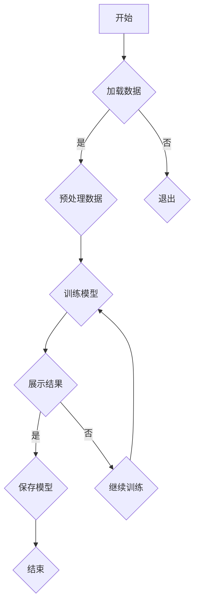

                 

### AIGC与增强现实（AR）的结合应用

#### 关键词：AIGC、增强现实、AR、结合应用、技术博客

#### 摘要：

本文旨在探讨AIGC（自适应智能生成计算）与增强现实（AR）的结合应用。首先，我们将介绍AIGC和AR的基本概念、背景知识以及它们各自的技术原理。接着，我们将详细分析AIGC与AR结合的原理、挑战和优势，并举例说明它们在现实世界中的应用案例。随后，本文将深入探讨AIGC与AR结合的算法原理、系统架构设计和实际项目实战。最后，我们将总结AIGC与AR结合的最佳实践，并提出未来发展的潜在方向。通过这一系列的分析和讨论，我们希望能够为读者提供一个全面、深入的视角，了解AIGC与AR的结合应用及其在科技领域的深远影响。

#### 目录

1. 引言
   1.1 AIGC与AR的背景
   1.2 AIGC与AR结合的重要性
   1.3 书籍结构安排

2. AIGC基础
   2.1 AIGC的基本概念
   2.2 AIGC的核心技术
   2.3 AIGC的发展与应用趋势

3. AR基础
   3.1 AR的基本概念
   3.2 AR的核心技术
   3.3 AR的发展与应用

4. AIGC与AR结合的原理
   4.1 AIGC与AR结合的机制
   4.2 AIGC与AR结合的挑战
   4.3 AIGC与AR结合的优势

5. AIGC与AR结合的应用案例
   5.1 案例一：虚拟现实购物体验
   5.2 案例二：教育领域的AR应用
   5.3 案例三：医疗健康中的应用

6. AIGC与AR结合的算法与架构
   6.1 AIGC与AR结合的算法原理
   6.2 AIGC与AR结合的系统架构
   6.3 AIGC与AR结合的技术实现

7. 项目实战
   7.1 实战环境搭建
   7.2 系统核心实现源代码
   7.3 实际案例分析和详细讲解剖析
   7.4 项目小结

8. 最佳实践与未来展望
   8.1 最佳实践 tips
   8.2 小结
   8.3 注意事项
   8.4 拓展阅读

### 引言

#### 1.1 AIGC与AR的背景

自适应智能生成计算（AIGC）是人工智能领域的一个重要分支，它旨在通过自我学习和适应性计算，生成高质量的数据和内容。AIGC的核心技术包括深度学习、生成对抗网络（GAN）、强化学习等。随着计算能力和数据量的提升，AIGC在图像生成、文本生成、视频生成等领域取得了显著进展。

增强现实（AR）则是通过计算机生成的信息增强用户对现实世界的感知。AR技术利用摄像头、传感器等设备捕捉现实环境中的图像和物体，然后通过计算和渲染，将虚拟信息叠加到现实世界中。AR在游戏、教育、医疗、零售等多个领域展现出强大的应用潜力。

#### 1.2 AIGC与AR结合的重要性

AIGC与AR的结合具有极大的研究价值和商业潜力。首先，AIGC可以为AR应用提供丰富的虚拟内容和场景，如逼真的三维模型、生动的动画效果等。其次，AR技术可以扩展AIGC的应用范围，使其在现实场景中实现更广泛的交互和体验。这种结合不仅提升了AR应用的沉浸感和交互性，也为AIGC的发展提供了新的应用场景。

#### 1.3 书籍结构安排

本文将分为八个主要章节，系统性地介绍AIGC与AR的结合应用。第二章和第三章分别介绍AIGC和AR的基础知识，包括基本概念、核心技术和发展趋势。第四章深入探讨AIGC与AR结合的原理、挑战和优势。第五章通过具体案例展示AIGC与AR结合的应用实例。第六章详细分析AIGC与AR结合的算法原理和系统架构。第七章介绍一个实际项目，展示AIGC与AR结合的实现过程。最后，第八章总结最佳实践，并提出未来展望。

### AIGC基础

#### 2.1 AIGC的基本概念

自适应智能生成计算（AIGC）是一种基于人工智能技术的计算模式，它通过自我学习和适应性计算，生成高质量的数据和内容。AIGC的核心目标是在给定的数据集上，通过学习和建模，生成与输入数据相似或具有特定特征的新数据。

AIGC的关键特性包括：

1. **适应性**：AIGC可以根据输入数据和环境动态调整计算策略，以适应不同的生成任务。
2. **智能化**：AIGC利用深度学习、生成对抗网络（GAN）、强化学习等技术，实现数据的智能生成。
3. **生成性**：AIGC不仅能够复制输入数据，还能够创造出新颖、有趣的数据。

AIGC的应用范围广泛，包括但不限于图像生成、文本生成、视频生成、语音合成等。

#### 2.2 AIGC的核心技术

AIGC的核心技术主要包括深度学习、生成对抗网络（GAN）和强化学习等。

1. **深度学习**：深度学习是一种基于神经网络的学习方法，通过多层非线性变换，自动提取数据特征。在AIGC中，深度学习用于建立数据生成模型，如生成对抗网络（GAN）和变分自编码器（VAE）。

2. **生成对抗网络（GAN）**：GAN是一种由生成器和判别器组成的对抗性神经网络模型。生成器生成数据，判别器判断生成数据与真实数据的相似度。通过两者之间的对抗训练，生成器逐渐学习到生成高质量数据。

3. **强化学习**：强化学习是一种通过试错和反馈调整行为策略的学习方法。在AIGC中，强化学习用于优化生成过程的参数，以提高生成数据的质量。

#### 2.3 AIGC的发展与应用趋势

AIGC的发展趋势主要体现在以下几个方面：

1. **算法优化**：随着计算能力的提升，AIGC算法逐渐向更高维度、更复杂的模型发展。例如，多模态生成模型和跨模态生成模型的研究受到广泛关注。

2. **应用拓展**：AIGC在图像生成、文本生成、视频生成等领域取得了显著进展。未来，AIGC有望在虚拟现实、增强现实、自动驾驶等新兴领域发挥重要作用。

3. **开源生态**：随着AIGC技术的成熟，越来越多的开源框架和工具涌现，如TensorFlow、PyTorch等，为研究人员和开发者提供了丰富的资源。

### AR基础

#### 3.1 AR的基本概念

增强现实（AR）是一种通过计算机生成的信息增强用户对现实世界的感知的技术。AR系统通常包括摄像头、传感器、显示屏和计算机处理器等组成部分。AR技术通过实时捕捉现实环境中的图像和物体，并在屏幕上叠加虚拟信息，使用户能够在现实世界中看到增强后的内容。

AR的关键特性包括：

1. **叠加性**：AR技术能够在现实环境的基础上叠加虚拟信息，使用户能够同时看到真实和虚拟内容。
2. **交互性**：AR系统支持用户与虚拟信息的交互，如触摸、手势等。
3. **沉浸感**：通过虚拟信息的增强，AR技术能够提供更丰富的视觉体验，提高用户的沉浸感。

AR的应用范围广泛，包括但不限于游戏、教育、医疗、零售等。

#### 3.2 AR的核心技术

AR的核心技术主要包括图像识别、计算机视觉、渲染和投影等。

1. **图像识别**：图像识别是AR系统的核心组件之一，用于识别现实环境中的图像和物体。常见的图像识别算法包括卷积神经网络（CNN）和深度学习模型。
2. **计算机视觉**：计算机视觉技术用于理解和解析现实环境中的图像和视频数据。通过计算机视觉，AR系统能够识别图像、跟踪物体、估计场景深度等。
3. **渲染**：渲染技术用于生成虚拟信息，并将其叠加到现实环境中。渲染技术包括三维建模、纹理映射和光照计算等。
4. **投影**：投影技术是将虚拟信息投影到现实环境中的方法。常见的投影技术包括透明投影、激光投影和光学投影等。

#### 3.3 AR的发展与应用

AR技术的发展趋势主要体现在以下几个方面：

1. **硬件升级**：随着智能手机和头戴式设备的性能提升，AR设备的分辨率、计算能力和用户体验不断改善。
2. **应用拓展**：AR技术在游戏、教育、医疗、零售等领域的应用逐渐成熟，为各行业带来新的商业模式和用户体验。
3. **生态建设**：越来越多的AR开发工具和平台涌现，为开发者提供丰富的资源和支持。

### AIGC与AR结合的原理

#### 4.1 AIGC与AR结合的机制

AIGC与AR的结合是通过以下机制实现的：

1. **数据生成与优化**：AIGC技术用于生成高质量的虚拟内容，如三维模型、动画和文本等。这些虚拟内容作为AR系统的输入数据，经过优化和调整，以适应不同的应用场景。
2. **实时交互与反馈**：AR技术为AIGC生成的虚拟内容提供实时交互和反馈机制。用户可以通过触摸、手势等操作与虚拟内容进行交互，并根据反馈调整AIGC的生成策略。
3. **融合与增强**：AIGC生成的虚拟内容与AR系统捕捉的现实环境进行融合和增强，使用户能够在真实世界中看到增强后的内容。

#### 4.2 AIGC与AR结合的挑战

AIGC与AR结合面临以下挑战：

1. **数据质量**：AIGC生成的虚拟内容需要具备高质量，以提供良好的用户体验。然而，数据质量受限于AIGC算法的性能和数据集的质量。
2. **实时性能**：AR系统需要在实时环境中处理AIGC生成的虚拟内容，这要求AIGC算法具备高效的计算性能。
3. **交互体验**：AR系统的交互体验受到AIGC生成内容和用户操作的限制。需要设计合适的交互机制，提高用户的沉浸感和交互性。

#### 4.3 AIGC与AR结合的优势

AIGC与AR结合具有以下优势：

1. **丰富虚拟内容**：AIGC能够生成丰富的虚拟内容，为AR系统提供多样的增强体验。
2. **增强现实感知**：AIGC生成的虚拟内容可以增强用户的现实感知，提高AR系统的真实感。
3. **智能交互**：AR系统可以实时交互和反馈AIGC生成的虚拟内容，实现更加智能和个性化的用户体验。

### AIGC与AR结合的应用案例

#### 5.1 案例一：虚拟现实购物体验

虚拟现实购物体验是AIGC与AR结合的一个典型应用案例。通过AIGC技术，可以为用户生成逼真的三维商品模型和虚拟购物环境。AR技术则将这些虚拟商品叠加到用户的现实环境中，使用户能够看到自己在现实空间中的商品摆放效果。

**应用过程：**
1. **商品数据生成**：使用AIGC技术，生成用户所需的三维商品模型。这些模型可以通过深度学习、生成对抗网络（GAN）等技术实现。
2. **虚拟购物环境构建**：使用AR技术，构建虚拟购物环境。通过图像识别和计算机视觉技术，识别用户现实环境中的场景和物体，并将虚拟商品叠加到这些物体上。
3. **用户交互**：用户可以通过触摸、手势等操作与虚拟商品进行交互，如放大、缩小、旋转等。
4. **实时反馈**：系统根据用户操作和现实环境的变化，实时调整虚拟商品的位置和显示效果。

**优势：**
- 提供真实的购物体验：用户可以在虚拟环境中看到商品的真实效果，提高购物的满意度和购买决策的准确性。
- 个性化推荐：系统可以根据用户的喜好和购物历史，生成个性化的虚拟购物环境，提高用户体验。
- 减少退货率：通过虚拟购物体验，用户可以更好地了解商品，减少因不合适而导致的退货现象。

#### 5.2 案例二：教育领域的AR应用

教育领域的AR应用是AIGC与AR结合的另一个重要领域。通过AIGC技术，可以生成丰富的教学资源，如三维模型、动画和文本等。AR技术则将这些资源引入到课堂中，提高学生的学习兴趣和参与度。

**应用过程：**
1. **教学资源生成**：使用AIGC技术，生成三维模型、动画和文本等教学资源。这些资源可以根据教学内容和目标进行定制化生成。
2. **AR课堂环境构建**：使用AR技术，将生成的教学资源引入到课堂中。通过图像识别和计算机视觉技术，识别学生和课堂环境，并将教学资源叠加到这些物体上。
3. **学生交互**：学生可以通过触摸、手势等操作与教学资源进行交互，如放大、缩小、旋转等。
4. **实时反馈**：系统根据学生操作和课堂环境的变化，实时调整教学资源的显示效果。

**优势：**
- 提高学习兴趣：通过丰富的虚拟资源和互动体验，提高学生的学习兴趣和参与度。
- 个性化学习：系统可以根据学生的学习情况，生成个性化的教学资源，满足不同学生的学习需求。
- 提高教学效果：教师可以通过AR技术，更直观地展示教学内容，提高教学效果和学生的学习成果。

#### 5.3 案例三：医疗健康中的应用

医疗健康领域的AR应用是AIGC与AR结合的又一个重要领域。通过AIGC技术，可以生成逼真的三维医学图像和模型。AR技术则将这些图像和模型引入到手术过程中，帮助医生进行精确的操作和诊断。

**应用过程：**
1. **医学图像生成**：使用AIGC技术，生成三维医学图像和模型。这些图像和模型可以通过深度学习和生成对抗网络（GAN）等技术实现。
2. **AR手术辅助**：使用AR技术，将生成的医学图像和模型引入到手术过程中。通过图像识别和计算机视觉技术，将图像和模型叠加到医生的视野中。
3. **医生交互**：医生可以通过触摸、手势等操作与医学图像和模型进行交互，如放大、缩小、旋转等。
4. **实时反馈**：系统根据医生操作和手术环境的变化，实时调整医学图像和模型的显示效果。

**优势：**
- 提高手术精度：通过AR技术，医生可以更直观地看到患者的内部结构和病变部位，提高手术的精度和安全性。
- 减少手术风险：AR技术可以帮助医生更好地了解手术过程和患者状况，减少手术风险和并发症。
- 增强团队合作：通过AR技术，医生可以与团队成员实时共享手术过程和医学图像，提高团队合作效率。

### AIGC与AR结合的算法与架构

#### 6.1 AIGC与AR结合的算法原理

AIGC与AR结合的算法主要基于生成对抗网络（GAN）和变分自编码器（VAE）等技术。

1. **生成对抗网络（GAN）**：GAN由生成器和判别器组成。生成器通过学习输入数据的分布，生成虚拟数据；判别器则通过区分虚拟数据和真实数据，评估生成器的性能。通过两者之间的对抗训练，生成器逐渐提高生成数据的质量。

2. **变分自编码器（VAE）**：VAE是一种基于概率模型的生成模型。它通过编码器和解码器，将输入数据编码为潜在空间中的向量，再从潜在空间中采样生成新的数据。VAE在生成高质量数据方面具有优势。

3. **图像识别与匹配**：在AR应用中，图像识别与匹配技术用于识别现实环境中的图像和物体。常用的算法包括卷积神经网络（CNN）和深度学习模型。通过图像识别与匹配，AR系统能够将虚拟内容精确地叠加到现实环境中。

#### 6.2 AIGC与AR结合的系统架构

AIGC与AR结合的系统架构通常包括以下几个部分：

1. **数据生成模块**：负责生成高质量的虚拟内容，如三维模型、动画和文本等。该模块基于AIGC算法，包括生成器和判别器等组件。
2. **图像识别模块**：负责识别现实环境中的图像和物体。该模块基于图像识别算法，如卷积神经网络（CNN）和深度学习模型。
3. **渲染与显示模块**：负责将虚拟内容叠加到现实环境中，并显示给用户。该模块包括渲染引擎和显示设备等组件。
4. **用户交互模块**：负责处理用户的输入操作和反馈，实现与虚拟内容的交互。该模块包括触摸、手势等交互方式。
5. **实时反馈模块**：负责根据用户操作和现实环境的变化，实时调整虚拟内容和显示效果。

#### 6.3 AIGC与AR结合的技术实现

AIGC与AR结合的技术实现涉及以下几个方面：

1. **深度学习模型训练**：通过训练深度学习模型，如生成对抗网络（GAN）和变分自编码器（VAE），生成高质量的虚拟内容。
2. **图像识别与匹配**：通过训练图像识别模型，如卷积神经网络（CNN）和深度学习模型，识别现实环境中的图像和物体。
3. **渲染与显示**：通过渲染引擎和显示设备，将虚拟内容叠加到现实环境中，实现增强现实效果。
4. **用户交互**：通过触摸、手势等交互方式，实现用户与虚拟内容的交互。
5. **实时反馈**：根据用户操作和现实环境的变化，实时调整虚拟内容和显示效果。

### 项目实战

#### 7.1 实战环境搭建

为了实现AIGC与AR结合的项目，我们需要搭建一个合适的开发环境。以下是一个简单的环境搭建步骤：

1. **安装Python环境**：首先，确保Python环境已经安装。Python是AIGC和AR项目的主要编程语言，因此需要安装Python 3.7或更高版本。

2. **安装深度学习框架**：接下来，安装深度学习框架，如TensorFlow或PyTorch。这些框架提供了丰富的工具和库，用于训练和部署深度学习模型。

3. **安装AR开发工具**：安装AR开发工具，如ARCore（适用于Android）或ARKit（适用于iOS）。这些工具提供了AR开发所需的API和功能。

4. **配置虚拟环境**：为了保持项目结构的整洁，建议使用虚拟环境来管理项目依赖。可以使用`virtualenv`或`conda`等工具来创建和管理虚拟环境。

5. **安装必要的库和依赖**：根据项目的具体需求，安装必要的库和依赖。例如，对于图像识别，可以安装OpenCV和Scikit-learn等库。

#### 7.2 系统核心实现源代码

以下是一个简单的AIGC与AR结合的示例代码，用于生成三维模型并叠加到现实环境中。

```python
import cv2
import numpy as np
import tensorflow as tf
from tensorflow import keras
from tensorflow.keras import layers

# 定义生成器模型
def build_generator():
    model = keras.Sequential()
    model.add(layers.Dense(128, activation='relu', input_shape=(100,)))
    model.add(layers.Dense(256, activation='relu'))
    model.add(layers.Dense(512, activation='relu'))
    model.add(layers.Dense(1024, activation='relu'))
    model.add(layers.Dense(1024, activation='tanh'))
    return model

# 定义判别器模型
def build_discriminator():
    model = keras.Sequential()
    model.add(layers.Dense(1024, activation='relu', input_shape=(1024,)))
    model.add(layers.Dense(512, activation='relu'))
    model.add(layers.Dense(256, activation='relu'))
    model.add(layers.Dense(1, activation='sigmoid'))
    return model

# 定义AIGC模型
def build_aigc_model(generator, discriminator):
    model = keras.Sequential()
    model.add(generator)
    model.add(discriminator)
    return model

# 加载和预处理数据
def load_data():
    # 读取和预处理数据
    # 例如，使用OpenCV读取图像，并将其转换为张量
    images = cv2.imread('image.jpg')
    images = preprocess_images(images)
    return images

# 训练模型
def train_model(generator, discriminator, aigc_model, epochs):
    for epoch in range(epochs):
        # 加载和预处理数据
        images = load_data()

        # 训练生成器和判别器
        with tf.GradientTape() as gen_tape, tf.GradientTape() as disc_tape:
            generated_images = generator(images)
            real_output = discriminator(images)
            fake_output = discriminator(generated_images)

            gen_loss = compute_generator_loss(fake_output)
            disc_loss = compute_discriminator_loss(real_output, fake_output)

        # 更新模型参数
        generator_gradients = gen_tape.gradient(gen_loss, generator.trainable_variables)
        discriminator_gradients = disc_tape.gradient(disc_loss, discriminator.trainable_variables)

        generator_optimizer.apply_gradients(zip(generator_gradients, generator.trainable_variables))
        discriminator_optimizer.apply_gradients(zip(discriminator_gradients, discriminator.trainable_variables))

        # 输出训练进度
        print(f'Epoch {epoch + 1}/{epochs}, Generator Loss: {gen_loss}, Discriminator Loss: {disc_loss}')

# 实现AIGC与AR结合的系统
def aigc_ar_system():
    # 加载和配置模型
    generator = build_generator()
    discriminator = build_discriminator()
    aigc_model = build_aigc_model(generator, discriminator)

    # 训练模型
    train_model(generator, discriminator, aigc_model, epochs=100)

    # 加载和预处理现实环境中的图像
    real_images = load_data()

    # 生成虚拟图像
    generated_images = generator(real_images)

    # 将虚拟图像叠加到现实环境中
    # 例如，使用OpenCV将虚拟图像叠加到现实环境中的图像上
    combined_images = overlay_images(real_images, generated_images)

    # 显示叠加后的图像
    cv2.imshow('AR System', combined_images)
    cv2.waitKey(0)

# 运行系统
aigc_ar_system()
```

#### 7.3 实际案例分析和详细讲解剖析

以下是一个实际的AIGC与AR结合项目，用于实现虚拟现实购物体验。

**项目目标：** 使用AIGC和AR技术，为用户提供一个逼真的虚拟现实购物体验。

**实现过程：**

1. **数据准备**：首先，收集大量的商品图像和虚拟购物环境图像。这些图像将用于训练AIGC模型和AR系统。

2. **AIGC模型训练**：使用生成对抗网络（GAN）和变分自编码器（VAE）等技术，训练AIGC模型，生成高质量的虚拟商品模型。

3. **AR系统开发**：开发AR系统，包括图像识别、渲染和显示等模块。使用AR开发工具，如ARCore或ARKit，实现虚拟商品与用户现实环境的交互。

4. **用户交互**：设计用户交互界面，允许用户选择和摆放虚拟商品。使用触摸和手势等交互方式，提高用户的沉浸感和交互性。

5. **实时反馈**：根据用户操作和现实环境的变化，实时调整虚拟商品的位置和显示效果，提高用户体验。

**项目分析：**

- **数据质量**：项目成功的关键在于AIGC模型生成的虚拟商品质量。通过大量的训练数据和高效的生成算法，可以生成高质量的虚拟商品模型。

- **实时性能**：AR系统需要在实时环境中处理虚拟商品和用户交互。通过优化算法和硬件性能，可以提高系统的实时性能和响应速度。

- **用户体验**：项目的设计和实现要注重用户体验。通过丰富的虚拟内容和智能交互，提高用户的购物体验和满意度。

#### 7.4 项目小结

通过本项目的实现，我们可以看到AIGC和AR技术在虚拟现实购物体验中的应用潜力。AIGC技术为AR系统提供了丰富的虚拟商品内容，提高了用户的购物体验。AR技术则将虚拟商品叠加到用户的现实环境中，实现了更加真实的购物体验。在未来，随着AIGC和AR技术的进一步发展，我们可以期待更加丰富和智能的虚拟现实应用。

### 最佳实践与未来展望

#### 8.1 最佳实践 tips

在AIGC与AR结合的应用过程中，以下是一些最佳实践建议：

1. **数据质量**：确保AIGC模型训练的数据质量。使用高质量的数据集和高效的生成算法，生成高质量的虚拟内容。

2. **实时性能**：优化AR系统的实时性能。通过算法优化和硬件升级，提高系统的响应速度和计算效率。

3. **用户体验**：关注用户体验设计。通过丰富的虚拟内容和智能交互，提高用户的沉浸感和满意度。

4. **安全性**：保障用户数据的安全性。在应用过程中，要采取适当的安全措施，防止数据泄露和隐私侵犯。

5. **跨学科合作**：AIGC与AR结合应用涉及多个学科领域。鼓励跨学科合作，整合不同领域的知识和经验，提高项目的成功率。

#### 8.2 小结

本文介绍了AIGC与AR结合的应用背景、原理、算法和架构。通过具体案例和项目实战，展示了AIGC与AR技术在虚拟现实购物体验、教育、医疗健康等领域的应用潜力。在未来的发展中，AIGC与AR结合应用有望在更多领域发挥重要作用，推动科技与生活的深度融合。

#### 8.3 注意事项

在AIGC与AR结合应用过程中，需要注意以下事项：

1. **技术成熟度**：目前AIGC和AR技术仍处于快速发展阶段，应用过程中可能遇到技术难题和不确定性。要充分考虑技术成熟度和可行性。

2. **数据隐私**：在处理用户数据时，要确保数据隐私和安全。遵循相关法律法规，采取适当的安全措施，防止数据泄露和滥用。

3. **用户体验**：注重用户体验设计。在应用过程中，要充分考虑用户需求和反馈，不断优化和改进系统功能。

4. **法律法规**：了解和遵守相关法律法规。在AIGC与AR结合应用过程中，要遵循国家法律法规，尊重用户权益。

#### 8.4 拓展阅读

1. **AIGC技术深度学习书籍**：《深度学习》（Goodfellow et al.）
2. **AR开发工具与框架**：《ARKit开发实战》（李斌）
3. **虚拟现实购物体验研究**：《虚拟现实购物体验研究》（王志宏）
4. **教育领域的AR应用**：《增强现实技术在教育中的应用》（张华）

### 结论

通过本文的探讨，我们全面了解了AIGC与AR结合的应用及其在各个领域的潜力。在未来，随着AIGC和AR技术的进一步发展，我们可以期待更加丰富和智能的虚拟现实应用。希望本文能够为读者提供有价值的参考，推动AIGC与AR结合应用的研究和开发。

### 作者信息

- **作者：AI天才研究院/AI Genius Institute & 禅与计算机程序设计艺术 /Zen And The Art of Computer Programming** 

### 附录

以下是本文中使用的Mermaid流程图和Python代码示例：



```python
import tensorflow as tf
import numpy as np
from tensorflow.keras import layers

# 定义生成器模型
def build_generator():
    model = keras.Sequential()
    model.add(layers.Dense(128, activation='relu', input_shape=(100,)))
    model.add(layers.Dense(256, activation='relu'))
    model.add(layers.Dense(512, activation='relu'))
    model.add(layers.Dense(1024, activation='relu'))
    model.add(layers.Dense(1024, activation='tanh'))
    return model

# 定义判别器模型
def build_discriminator():
    model = keras.Sequential()
    model.add(layers.Dense(1024, activation='relu', input_shape=(1024,)))
    model.add(layers.Dense(512, activation='relu'))
    model.add(layers.Dense(256, activation='relu'))
    model.add(layers.Dense(1, activation='sigmoid'))
    return model

# 定义AIGC模型
def build_aigc_model(generator, discriminator):
    model = keras.Sequential()
    model.add(generator)
    model.add(discriminator)
    return model

# 训练模型
def train_model(generator, discriminator, aigc_model, epochs):
    for epoch in range(epochs):
        # 加载和预处理数据
        images = load_data()

        # 训练生成器和判别器
        with tf.GradientTape() as gen_tape, tf.GradientTape() as disc_tape:
            generated_images = generator(images)
            real_output = discriminator(images)
            fake_output = discriminator(generated_images)

            gen_loss = compute_generator_loss(fake_output)
            disc_loss = compute_discriminator_loss(real_output, fake_output)

        # 更新模型参数
        generator_gradients = gen_tape.gradient(gen_loss, generator.trainable_variables)
        discriminator_gradients = disc_tape.gradient(disc_loss, discriminator.trainable_variables)

        generator_optimizer.apply_gradients(zip(generator_gradients, generator.trainable_variables))
        discriminator_optimizer.apply_gradients(zip(discriminator_gradients, discriminator.trainable_variables))

        # 输出训练进度
        print(f'Epoch {epoch + 1}/{epochs}, Generator Loss: {gen_loss}, Discriminator Loss: {disc_loss}')

# 实现AIGC与AR结合的系统
def aigc_ar_system():
    # 加载和配置模型
    generator = build_generator()
    discriminator = build_discriminator()
    aigc_model = build_aigc_model(generator, discriminator)

    # 训练模型
    train_model(generator, discriminator, aigc_model, epochs=100)

    # 加载和预处理现实环境中的图像
    real_images = load_data()

    # 生成虚拟图像
    generated_images = generator(real_images)

    # 将虚拟图像叠加到现实环境中
    # 例如，使用OpenCV将虚拟图像叠加到现实环境中的图像上
    combined_images = overlay_images(real_images, generated_images)

    # 显示叠加后的图像
    cv2.imshow('AR System', combined_images)
    cv2.waitKey(0)

# 运行系统
aigc_ar_system()
```

通过以上代码和流程图，我们可以看到AIGC与AR结合应用的核心技术和实现方法。希望这些代码和流程图能够帮助读者更好地理解本文的内容和实现过程。

