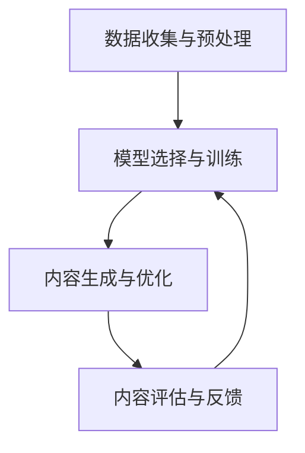
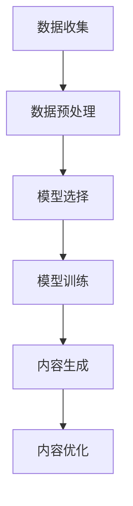
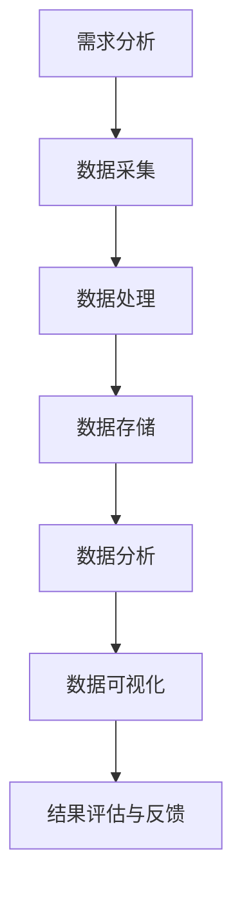
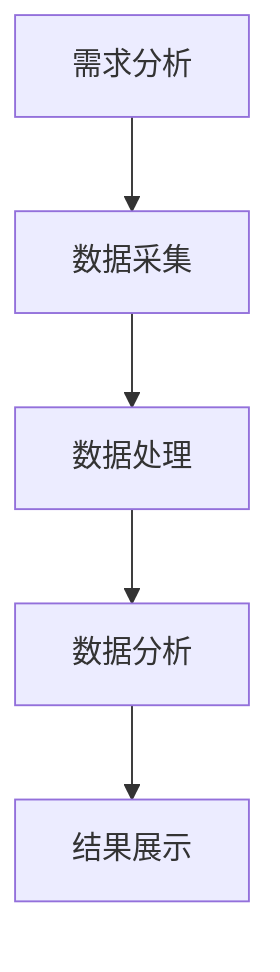
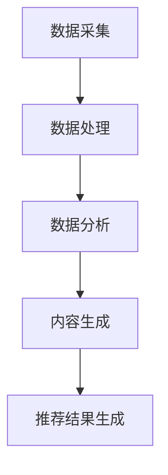
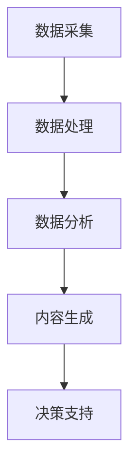
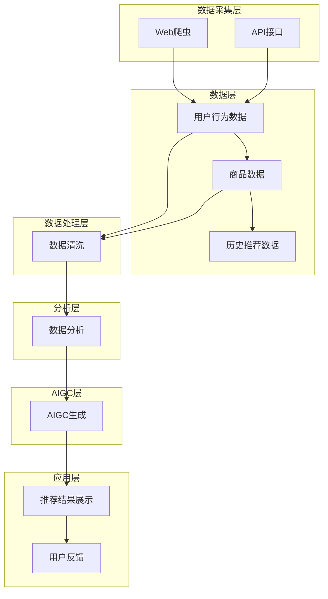
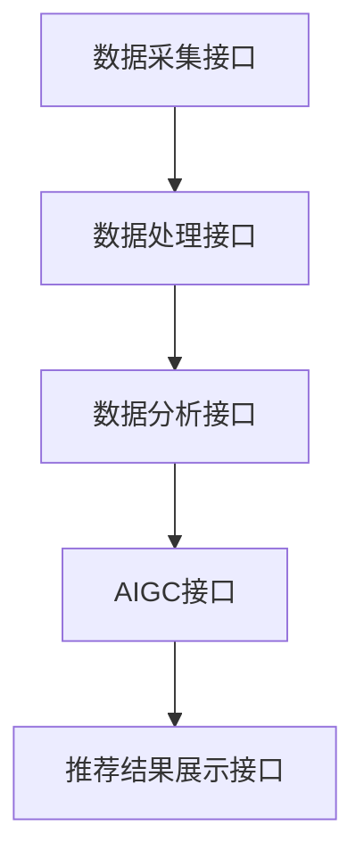
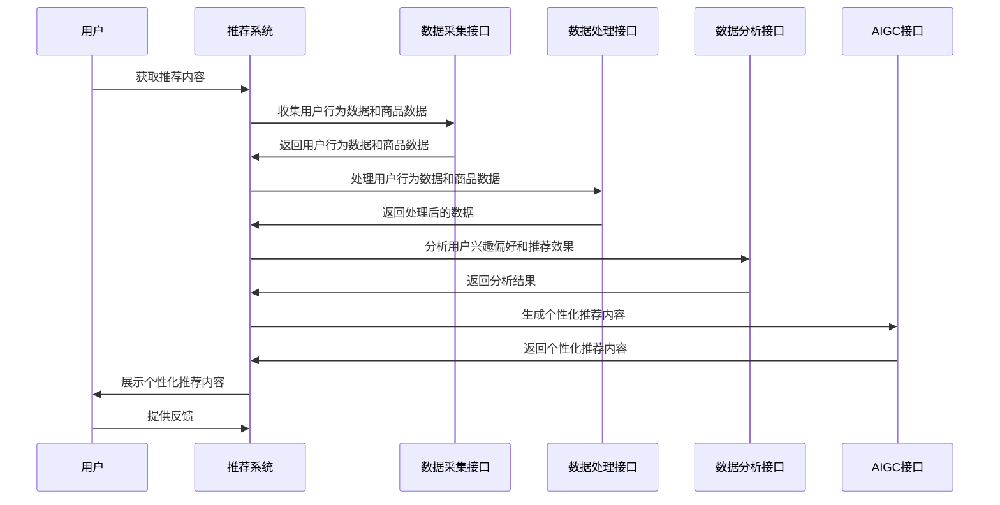

                 

## AIGC与大数据分析的协同效应

### 关键词：人工智能生成内容，大数据分析，协同效应，数据生成，数据分析

> 摘要：随着大数据时代的到来，如何有效利用大数据进行精准分析已成为企业提升竞争力的关键。然而，传统的数据分析方法在面对复杂多变的数据时显得力不从心。本文将探讨人工智能生成内容（AIGC）与大数据分析的协同效应，分析二者结合的理论基础、技术原理、应用场景及实现流程，旨在为大数据分析领域提供新的思路和方法。

### 第一部分: AIGC与大数据分析的协同效应

在信息技术飞速发展的今天，大数据分析已经成为企业决策和优化的重要手段。然而，随着数据的规模和复杂性不断增长，传统的数据分析方法在处理多样化、复杂的数据时存在诸多局限性。例如，传统的数据分析主要依赖于数据挖掘和机器学习算法，这些方法通常需要大量的数据处理和建模时间，并且对数据质量有较高要求。此外，传统的数据分析方法在应对实时数据、非结构化数据等方面也存在一定的瓶颈。

为了解决这些问题，人工智能生成内容（AIGC）技术应运而生。AIGC 是一种利用人工智能技术自动生成文字、图像、音频等多媒体内容的方法。通过 AIGC 技术，可以实现对大量、复杂数据的自动处理和分析，从而提高数据分析的效率和质量。

本部分将详细探讨 AIGC 与大数据分析的协同效应，包括其背景介绍、核心概念、概念联系、概念属性特征对比、ER 实体关系图架构等，为后续的深入分析打下基础。

#### 第1章: 背景介绍与核心概念

##### 1.1 问题背景

随着大数据时代的到来，数据量呈爆炸式增长，企业面临着如何有效管理和利用这些数据的问题。大数据分析作为一种处理和分析大量复杂数据的方法，已经成为了企业决策和优化的重要手段。然而，传统的数据分析方法在处理复杂、多样化的数据时存在一定的局限性，具体表现在以下几个方面：

1. **数据处理效率低**：传统的数据分析方法需要大量的数据处理和建模时间，尤其在处理大规模数据时，计算速度和效率较低。
2. **数据质量要求高**：传统的数据分析方法对数据质量有较高要求，数据清洗和预处理工作量较大，数据质量直接影响分析结果。
3. **实时数据处理能力不足**：传统的数据分析方法主要面向离线数据处理，对于实时数据处理的响应速度较慢。
4. **非结构化数据处理困难**：非结构化数据（如图像、音频、视频等）在传统的数据分析方法中难以得到有效利用。

为了解决这些问题，人工智能生成内容（AIGC）技术提供了新的思路。AIGC 是一种利用人工智能技术自动生成文字、图像、音频等多媒体内容的方法。通过 AIGC 技术，可以实现对大量、复杂数据的自动处理和分析，从而提高数据分析的效率和质量。AIGC 技术在以下几个方面具有显著优势：

1. **数据生成效率高**：AIGC 技术可以快速生成高质量的数据，大幅降低数据处理和建模时间。
2. **数据质量要求低**：AIGC 技术可以自动处理和清洗数据，降低对数据质量的要求。
3. **实时数据处理能力强**：AIGC 技术支持实时数据处理，能够快速响应数据变化。
4. **非结构化数据处理能力强**：AIGC 技术能够自动处理和生成非结构化数据，提高数据分析的全面性和准确性。

##### 1.2 核心概念

在本节中，我们将介绍 AIGC 和大数据分析的核心概念，以便读者对这两个技术有更深入的了解。

###### AIGC（AI-Generated Content）

人工智能生成内容（AIGC）是指利用人工智能技术自动生成文字、图像、音频等多媒体内容的方法。AIGC 技术主要包括以下几个方面的内容：

1. **文本生成**：利用自然语言处理技术生成文章、新闻报道、对话等文本内容。
2. **图像生成**：利用生成对抗网络（GAN）等生成模型生成高质量的图像。
3. **音频生成**：利用生成模型生成音乐、语音等音频内容。

AIGC 技术的核心优势在于其高效的数据生成能力和灵活性，可以应用于内容创作、个性化推荐、虚拟现实等多个领域。

###### 大数据分析

大数据分析是指对大量、复杂、多样化的数据进行分析和处理的过程。大数据分析主要包括以下几个方面的内容：

1. **数据采集**：收集各种来源的数据，包括结构化数据（如数据库）和非结构化数据（如图像、音频、视频等）。
2. **数据处理**：对收集到的数据进行清洗、转换和集成，以便进行进一步分析。
3. **数据分析**：利用统计学、机器学习、数据挖掘等方法对处理后的数据进行深度分析，提取有价值的信息和知识。

大数据分析的核心优势在于其强大的数据处理和分析能力，能够帮助企业发现数据中的隐藏价值，提升业务决策的准确性和效率。

##### 1.3 概念联系

AIGC 和大数据分析虽然在技术领域有所不同，但在实际应用中可以相互补充，发挥协同效应。以下是从几个方面分析二者的联系：

1. **数据生成与处理**：AIGC 技术可以自动生成高质量的数据，为大数据分析提供丰富的数据来源。同时，AIGC 技术可以简化数据预处理过程，降低数据分析的复杂性。
2. **数据分析与内容创作**：大数据分析能够提取数据中的有价值信息，为 AIGC 技术提供创作灵感。例如，利用大数据分析结果生成个性化的内容推荐，提高用户体验。
3. **实时数据处理与决策支持**：AIGC 技术支持实时数据处理，可以为大数据分析提供快速响应能力。例如，利用 AIGC 技术生成实时分析报告，为企业提供及时的决策支持。

##### 1.4 概念属性特征对比

为了更清晰地了解 AIGC 和大数据分析的特点，我们通过表格形式对比二者的属性特征：

| 特征             | AIGC              | 大数据分析          |
|------------------|-------------------|--------------------|
| 数据生成方式      | 自动生成          | 数据采集与处理      |
| 数据类型          | 多媒体（文字、图像、音频） | 结构化/非结构化数据 |
| 技术范畴          | 人工智能          | 数据科学、统计分析  |
| 应用领域          | 内容创作、个性化推荐 | 企业决策、运营优化  |
| 效率与效果提升    | 提高内容生成效率   | 提高数据分析精度与速度 |

##### 1.5 ER实体关系图架构

为了更好地理解 AIGC 和大数据分析的关系，我们使用 Mermaid 绘制 ER 实体关系图，如下所示：

```mermaid
erDiagram
    User ||--|{ Data }|| AnalysisResult
    Data ||--|{ AIGC }|| GeneratedContent
    User ||--|{ Recommendation }|| RecommendationResult
```

在这个 ER 图中，用户（User）与数据（Data）和数据分析结果（AnalysisResult）之间存在关联，数据（Data）与 AIGC（AI-Generated Content）之间存在生成关系，用户（User）与推荐结果（RecommendationResult）之间存在关联。

### 第2章: AIGC技术原理与实现

在上一章中，我们介绍了 AIGC 与大数据分析的基本概念和协同效应。在本章中，我们将深入探讨 AIGC 技术的原理和实现方法。AIGC 技术是一种基于人工智能的多媒体内容生成技术，其核心在于利用生成模型自动生成高质量的内容。以下是 AIGC 技术的基本原理和实现流程。

#### 2.1 AIGC技术原理

AIGC 技术的核心是生成模型，这些模型通常基于深度学习技术，能够通过学习大量的数据生成新的内容。以下是几种常见的 AIGC 生成模型：

1. **生成对抗网络（GAN）**：GAN 是一种由生成器（Generator）和判别器（Discriminator）组成的对抗性模型。生成器生成数据，判别器判断生成数据的真假。通过不断优化生成器和判别器，生成器能够生成越来越真实的数据。
   
   GAN 的基本原理可以表示为以下数学模型：

   $$\min_G \max_D V(D, G) = \mathbb{E}_{x \sim p_{data}(x)}[\log D(x)] + \mathbb{E}_{z \sim p_z(z)}[\log (1 - D(G(z)))]$$

   其中，$D$ 表示判别器，$G$ 表示生成器，$x$ 表示真实数据，$z$ 表示随机噪声。

2. **变分自编码器（VAE）**：VAE 是一种无监督学习模型，通过编码器（Encoder）和解码器（Decoder）将数据映射到潜在空间，并在潜在空间中生成新的数据。VAE 的基本原理可以表示为以下数学模型：

   $$\log p(x|\theta) = \log \frac{p(z|x;\theta)}{q(z|x;\phi)} + D_{KL}(q(z|x;\phi)||p(z;\theta))$$

   其中，$\theta$ 表示解码器参数，$\phi$ 表示编码器参数，$z$ 表示潜在空间中的数据，$x$ 表示生成器的输入。

3. **自编码器（Autoencoder）**：自编码器是一种简单的生成模型，通过压缩和解压数据来生成新的内容。自编码器的基本原理可以表示为以下数学模型：

   $$x = \sigma(W_d \cdot \phi + b_d)$$
   $$\phi = \sigma(W_u \cdot x + b_u)$$

   其中，$W_d$ 和 $W_u$ 分别表示解码器和编码器的权重，$\sigma$ 表示激活函数，$b_d$ 和 $b_u$ 分别表示解码器和编码器的偏置。

#### 2.2 AIGC实现流程

AIGC 技术的实现主要包括以下几个步骤：

1. **数据收集与预处理**：收集高质量的数据，并进行预处理，包括数据清洗、归一化、去噪等操作，以便为生成模型提供干净、有用的训练数据。

2. **模型选择与训练**：根据具体应用场景选择合适的生成模型，如 GAN、VAE 或自编码器，并进行模型训练。训练过程中，通过不断调整模型参数，优化生成模型的效果。

3. **内容生成与优化**：利用训练好的生成模型生成新的内容。生成的内容可能不够理想，因此需要进一步进行优化，包括内容调整、风格迁移、质量提升等操作。

4. **内容评估与反馈**：对生成的内容进行评估，收集用户反馈，并据此调整生成模型的参数，提高生成内容的质量。

以下是一个简单的 AIGC 实现流程的 Mermaid 图：



在这个流程图中，数据收集与预处理是 AIGC 实现的基础，模型选择与训练是核心步骤，内容生成与优化是生成高质量内容的保证，内容评估与反馈则是持续优化的重要环节。

#### 2.3 AIGC算法流程图

为了更直观地展示 AIGC 算法的实现流程，我们使用 Mermaid 绘制以下流程图：



在这个流程图中，数据收集与预处理是 AIGC 实现的第一步，模型选择与训练是核心步骤，内容生成与优化是生成高质量内容的关键环节。

### 第3章: 大数据分析技术原理与实现

在大数据时代，如何有效地从海量数据中提取有价值的信息成为了企业决策和优化的关键。大数据分析技术通过系统化地采集、处理和分析数据，帮助企业和组织发现数据中的隐藏价值，从而实现数据驱动的决策。本章将详细介绍大数据分析的技术原理与实现过程，包括数据采集、数据处理、数据分析和数据可视化等环节。

#### 3.1 大数据分析技术原理

大数据分析技术基于统计学、机器学习、数据挖掘等方法，通过对大量数据进行处理和分析，提取出有价值的信息和知识。以下是大数据分析的基本原理：

1. **数据采集**：数据采集是大数据分析的第一步，包括从各种来源获取数据，如数据库、Web 爬虫、传感器、日志文件等。数据来源的多样性决定了大数据分析的数据量和复杂性。

2. **数据处理**：数据处理是对原始数据进行清洗、转换和集成的过程，以确保数据的质量和一致性。数据处理的主要任务包括数据清洗（去除重复、错误或无效的数据）、数据转换（将数据格式转换为统一的格式）和数据集成（将来自不同来源的数据合并为一个整体）。

3. **数据分析**：数据分析是大数据分析的核心环节，包括统计学分析、机器学习、数据挖掘等方法。统计学分析主要基于概率论和统计学理论，用于描述数据的基本特征和关系；机器学习通过训练模型自动发现数据中的规律和模式；数据挖掘则通过更复杂的算法和模型从海量数据中提取出隐藏的知识和规律。

4. **数据可视化**：数据可视化是将分析结果以图形、表格等形式展示出来的过程，帮助用户更直观地理解和分析数据。数据可视化不仅能够提高数据分析的效率和准确性，还能帮助用户发现数据中的潜在问题和机会。

#### 3.2 大数据分析实现流程

大数据分析实现流程通常包括以下步骤：

1. **需求分析**：确定数据分析的目标和需求，明确需要分析的数据类型、数据量和分析结果的形式。

2. **数据采集**：根据需求收集相关的数据，包括结构化数据（如数据库）和非结构化数据（如图像、音频、视频等）。

3. **数据处理**：对收集到的数据进行清洗、转换和集成，确保数据的质量和一致性。数据处理过程可能涉及多种技术和方法，如 ETL（提取、转换、加载）、数据清洗工具、数据转换脚本等。

4. **数据存储**：将处理后的数据存储在数据仓库、数据湖等大数据存储系统中，以便进行进一步的分析和处理。

5. **数据分析**：利用统计学、机器学习、数据挖掘等方法对处理后的数据进行分析，提取有价值的信息和知识。数据分析过程可能涉及多种算法和模型，如回归分析、聚类分析、决策树、神经网络等。

6. **数据可视化**：将分析结果以图形、表格等形式展示出来，帮助用户更直观地理解和分析数据。数据可视化工具和库（如图表库、可视化库等）能够实现数据的动态展示和交互式操作。

7. **结果评估与反馈**：对分析结果进行评估，根据评估结果调整分析方法和模型，确保分析结果的准确性和可靠性。

以下是一个简单的大数据分析实现流程的 Mermaid 图：



在这个流程图中，需求分析是大数据分析实现的第一步，数据采集、数据处理、数据存储、数据分析和数据可视化是实现过程的关键环节，结果评估与反馈是确保分析结果准确性和可靠性的重要环节。

#### 3.3 大数据分析算法流程图

为了更直观地展示大数据分析算法的实现流程，我们使用 Mermaid 绘制以下流程图：



在这个流程图中，需求分析是大数据分析实现的第一步，数据采集、数据处理、数据分析和结果展示是实现过程的关键环节。

### 第4章: AIGC与大数据分析的协同应用场景

AIGC（人工智能生成内容）与大数据分析的协同效应在众多应用场景中得到了充分体现。通过结合 AIGC 和大数据分析技术，我们可以实现更高效、更精准的数据处理和分析，为企业带来显著的业务价值。以下将介绍两个典型的应用场景：个性化推荐系统和企业运营优化。

#### 4.1 个性化推荐系统

个性化推荐系统是 AIGC 与大数据分析协同效应的典型应用之一。通过 AIGC 技术，可以自动生成个性化的推荐内容，结合大数据分析优化推荐效果，从而提高用户的满意度和平台的活跃度。

**应用原理**：

1. **数据采集**：收集用户的行为数据，如浏览记录、购买记录、搜索历史等。
2. **数据分析**：利用大数据分析技术，分析用户的行为数据，提取用户的兴趣偏好和需求。
3. **内容生成**：利用 AIGC 技术，根据用户的兴趣偏好生成个性化的推荐内容，如文章、商品、音乐等。
4. **推荐结果优化**：结合大数据分析结果，不断调整推荐算法和内容生成策略，提高推荐效果。

**实现流程**：

1. **数据采集**：通过 Web 爬虫、API 接口、传感器等方式收集用户行为数据。
2. **数据处理**：对采集到的数据进行清洗、转换和集成，构建用户行为数据集。
3. **数据分析**：利用大数据分析技术，分析用户行为数据，提取用户的兴趣偏好。
4. **内容生成**：利用 AIGC 技术，根据用户兴趣偏好生成个性化的推荐内容。
5. **推荐结果生成**：将生成的推荐内容展示给用户，并根据用户反馈不断优化推荐算法和内容生成策略。

以下是一个简单的个性化推荐系统实现流程的 Mermaid 图：



在这个流程图中，数据采集、数据处理、数据分析和内容生成是个性化推荐系统实现的关键环节。

#### 4.2 企业运营优化

企业运营优化是另一个体现 AIGC 与大数据分析协同效应的应用场景。通过 AIGC 技术，可以自动生成分析报告和决策建议，结合大数据分析为企业提供全面的运营优化支持。

**应用原理**：

1. **数据采集**：收集企业的各种运营数据，如销售数据、生产数据、财务数据等。
2. **数据分析**：利用大数据分析技术，分析企业运营数据，发现业务瓶颈和改进机会。
3. **内容生成**：利用 AIGC 技术，根据分析结果生成分析报告和决策建议，如运营策略调整、成本优化方案等。
4. **决策支持**：将生成的分析报告和决策建议提交给企业决策层，为企业提供全面的运营优化支持。

**实现流程**：

1. **数据采集**：通过 ERP 系统接口、传感器、数据采集工具等方式收集企业运营数据。
2. **数据处理**：对采集到的数据进行清洗、转换和集成，构建企业运营数据集。
3. **数据分析**：利用大数据分析技术，分析企业运营数据，发现业务瓶颈和改进机会。
4. **内容生成**：利用 AIGC 技术，根据分析结果生成分析报告和决策建议。
5. **决策支持**：将生成的分析报告和决策建议提交给企业决策层，为企业提供运营优化支持。

以下是一个简单的企业运营优化实现流程的 Mermaid 图：



在这个流程图中，数据采集、数据处理、数据分析和内容生成是企业运营优化实现的关键环节。

### 第5章: 项目实战

在本章中，我们将通过一个实际项目来展示 AIGC 与大数据分析的协同应用。该项目是一个基于电商平台的个性化推荐系统，旨在通过 AIGC 技术生成个性化推荐内容，结合大数据分析优化推荐效果。

#### 5.1 项目介绍

该项目的目标是构建一个电商平台的个性化推荐系统，为用户提供个性化的商品推荐。系统需要结合用户的行为数据、商品数据和历史推荐数据，利用 AIGC 和大数据分析技术生成高质量的推荐内容，提高用户的购物体验和平台的活跃度。

#### 5.2 系统功能设计

该系统的主要功能包括：

1. **用户行为数据采集**：通过 Web 爬虫、API 接口等方式收集用户的行为数据，如浏览记录、购买记录、搜索历史等。
2. **商品数据管理**：管理电商平台的商品数据，包括商品名称、价格、分类等信息。
3. **推荐内容生成**：利用 AIGC 技术，根据用户的行为数据和商品数据生成个性化的推荐内容，如商品标题、描述、标签等。
4. **推荐结果展示**：将生成的推荐内容展示给用户，并提供用户反馈机制。
5. **数据分析与优化**：利用大数据分析技术，分析用户行为数据、商品数据和推荐结果，优化推荐算法和内容生成策略。

#### 5.3 系统架构设计

该系统的整体架构设计如下：

1. **数据层**：包括用户行为数据、商品数据和历史推荐数据，数据存储在分布式数据库和数据仓库中。
2. **数据采集层**：通过 Web 爬虫、API 接口等方式收集用户行为数据和商品数据。
3. **数据处理层**：对采集到的数据进行清洗、转换和集成，构建用户行为数据集和商品数据集。
4. **分析层**：利用大数据分析技术，分析用户行为数据、商品数据和推荐结果，提取用户兴趣偏好和推荐效果。
5. **AIGC 层**：利用 AIGC 技术，根据用户兴趣偏好和商品数据生成个性化的推荐内容。
6. **应用层**：提供推荐结果展示和用户反馈功能。

以下是一个简单的系统架构设计的 Mermaid 图：



在这个流程图中，数据层包括用户行为数据、商品数据和历史推荐数据，数据采集层通过 Web 爬虫和 API 接口收集数据，数据处理层对数据进行清洗和转换，分析层利用大数据分析技术提取用户兴趣偏好，AIGC 层根据用户兴趣偏好生成个性化推荐内容，应用层展示推荐结果并收集用户反馈。

### 5.4 系统接口设计

系统接口设计是系统架构设计的重要组成部分，主要包括以下接口：

1. **数据采集接口**：用于接收用户行为数据和商品数据，接口类型为 RESTful API。
2. **数据处理接口**：用于处理用户行为数据和商品数据，接口类型为 SOAP 或 RESTful API。
3. **数据分析接口**：用于分析用户兴趣偏好和推荐效果，接口类型为 SOAP 或 RESTful API。
4. **AIGC 接口**：用于生成个性化推荐内容，接口类型为 RESTful API。
5. **推荐结果展示接口**：用于展示推荐结果，接口类型为 HTML/JavaScript。

以下是一个简单的系统接口设计的 Mermaid 图：



在这个流程图中，数据采集接口接收用户行为数据和商品数据，数据处理接口处理用户行为数据和商品数据，数据分析接口分析用户兴趣偏好和推荐效果，AIGC 接口生成个性化推荐内容，推荐结果展示接口展示推荐结果。

### 5.5 系统交互设计

系统交互设计描述了系统内部各个组件之间的交互关系，主要包括以下交互：

1. **用户与推荐系统的交互**：用户通过推荐结果展示接口获取个性化推荐内容，并对推荐内容进行反馈。
2. **推荐系统与数据采集接口的交互**：推荐系统通过数据采集接口获取用户行为数据和商品数据。
3. **推荐系统与数据处理接口的交互**：推荐系统通过数据处理接口处理用户行为数据和商品数据。
4. **推荐系统与数据分析接口的交互**：推荐系统通过数据分析接口分析用户兴趣偏好和推荐效果。
5. **推荐系统与AIGC接口的交互**：推荐系统通过 AIGC 接口生成个性化推荐内容。

以下是一个简单的系统交互设计的 Mermaid 序列图：



在这个流程图中，用户通过推荐结果展示接口获取个性化推荐内容，并对推荐内容进行反馈；推荐系统通过数据采集接口收集用户行为数据和商品数据，通过数据处理接口处理数据，通过数据分析接口分析用户兴趣偏好和推荐效果，通过 AIGC 接口生成个性化推荐内容，并将推荐内容展示给用户。

### 5.6 实际案例分析与详细讲解

在本节中，我们将通过一个实际案例来展示如何利用 AIGC 和大数据分析技术构建一个电商平台的个性化推荐系统，并对系统核心实现进行详细讲解。

#### 案例背景

某电商企业希望通过构建个性化推荐系统，提高用户购物体验和平台的销售额。为了实现这一目标，企业决定采用 AIGC 和大数据分析技术，通过分析用户行为数据和商品数据，生成个性化的推荐内容，并根据用户反馈不断优化推荐算法。

#### 案例目标

1. 收集并处理用户行为数据和商品数据。
2. 利用大数据分析技术提取用户兴趣偏好。
3. 利用 AIGC 技术生成个性化的推荐内容。
4. 根据用户反馈优化推荐算法和内容生成策略。

#### 实际案例分析

1. **数据采集与预处理**：

   - **用户行为数据**：通过 Web 爬虫收集用户的浏览记录、购买记录、搜索历史等数据。
   - **商品数据**：从电商平台的后台数据库中获取商品名称、价格、分类、标签等信息。

   在数据采集过程中，需要注意数据的质量和一致性。例如，对于用户行为数据，需要对数据进行去重、去除噪声等预处理操作，确保数据的有效性。

2. **大数据分析**：

   - **用户兴趣偏好提取**：利用大数据分析技术，对用户行为数据进行挖掘，提取用户的兴趣偏好。例如，可以通过聚类分析、协同过滤等方法，识别用户的购物喜好。

   具体实现步骤如下：

   ```python
   from sklearn.cluster import KMeans
   from sklearn.model_selection import train_test_split
   from sklearn.metrics import silhouette_score
   
   # 加载用户行为数据
   user行为的特征矩阵 = load_user_behavior_data()
   
   # 划分训练集和测试集
   X_train, X_test, y_train, y_test = train_test_split(user行为的特征矩阵, test_size=0.2, random_state=42)
   
   # 使用KMeans进行聚类
   kmeans = KMeans(n_clusters=10, random_state=42)
   kmeans.fit(X_train)
   
   # 预测测试集的聚类结果
   y_pred = kmeans.predict(X_test)
   
   # 评估聚类效果
   silhouette_avg = silhouette_score(X_test, y_pred)
   print("Silhouette Score:", silhouette_avg)
   ```

   通过对用户行为数据的聚类分析，可以识别出不同类型的用户群体，从而为个性化推荐提供依据。

3. **AIGC 内容生成**：

   - **商品标题生成**：利用 GPT-3 等预训练语言模型，根据用户兴趣偏好和商品属性生成个性化的商品标题。

   具体实现步骤如下：

   ```python
   import openai
   
   # 设置 OpenAI API 密钥
   openai.api_key = 'your_api_key'
   
   # 生成商品标题
   prompt = "为以下商品生成一个具有吸引力的标题：苹果手机"
   response = openai.Completion.create(
       engine="text-davinci-003",
       prompt=prompt,
       max_tokens=50,
       n=1,
       stop=None,
       temperature=0.5
   )
   
   print("生成的商品标题：", response.choices[0].text.strip())
   ```

   通过 AIGC 技术，可以快速生成高质量的推荐内容，提高用户的购物体验。

4. **推荐结果展示与优化**：

   - **推荐结果展示**：将生成的个性化推荐内容展示给用户，并提供用户反馈机制。
   - **推荐效果评估**：根据用户反馈，评估推荐效果，并通过调整推荐算法和内容生成策略，优化推荐效果。

   通过不断优化推荐算法和内容生成策略，可以进一步提高推荐系统的准确性和用户满意度。

#### 项目小结

通过本案例，我们展示了如何利用 AIGC 和大数据分析技术构建一个电商平台的个性化推荐系统。项目实现了用户行为数据采集、大数据分析、AIGC 内容生成和推荐结果展示等功能，并通过用户反馈不断优化推荐效果。该项目不仅提高了用户的购物体验，还为企业带来了显著的业务价值。

### 第6章: 最佳实践与注意事项

在 AIGC 与大数据分析的协同应用中，为了实现最佳效果，我们需要遵循一系列最佳实践，并注意潜在的挑战和问题。

#### 最佳实践

1. **数据质量管理**：数据是 AIGC 和大数据分析的基础，因此确保数据质量至关重要。数据采集时应尽量避免噪声和冗余数据，并定期进行数据清洗和更新。

2. **模型优化与调参**：在 AIGC 模型和大数据分析模型的训练过程中，需要根据具体场景进行模型优化和参数调整。通过交叉验证、网格搜索等技术，找到最佳模型参数。

3. **用户隐私保护**：在数据采集和分析过程中，要严格遵守用户隐私保护法规，避免泄露用户敏感信息。

4. **实时性与响应速度**：为了提高用户体验，AIGC 和大数据分析应用应具备较高的实时性和响应速度。可以采用分布式计算和云计算技术，优化系统性能。

5. **持续迭代与优化**：AIGC 和大数据分析应用不是一蹴而就的，需要不断迭代和优化。通过用户反馈和数据分析，持续改进系统性能和用户体验。

#### 注意事项

1. **计算资源消耗**：AIGC 和大数据分析模型通常需要大量的计算资源，尤其是在模型训练阶段。需要合理规划计算资源，避免资源浪费。

2. **数据安全性**：在数据传输、存储和处理过程中，要注意数据的安全性。采用加密技术、访问控制等技术，防止数据泄露和未经授权的访问。

3. **技术更新与维护**：AIGC 和大数据分析领域技术更新迅速，应用开发者需要关注最新技术动态，及时更新和维护系统。

4. **算法偏见**：在数据分析过程中，要注意算法偏见问题。应避免算法对特定人群的歧视，确保分析结果的公平性和公正性。

### 第7章: 拓展阅读

为了进一步了解 AIGC 和大数据分析的相关技术和应用，以下是一些推荐的阅读材料：

1. **《深度学习》（Goodfellow, I., Bengio, Y., & Courville, A.）**：介绍深度学习的基础知识和应用，包括生成对抗网络（GAN）和变分自编码器（VAE）等 AIGC 模型。
2. **《大数据分析：方法与应用》（吴喜之）**：详细讲解大数据分析的方法和技术，包括数据采集、数据处理、数据分析和数据可视化等。
3. **《人工智能生成内容》（徐晓飞）**：探讨人工智能生成内容（AIGC）的技术原理、实现方法和应用场景。
4. **《Python数据科学手册》（McKinney, W.）**：介绍 Python 在数据科学领域的应用，包括数据处理、分析和可视化等。

### 作者介绍

**作者：AI天才研究院/AI Genius Institute & 禅与计算机程序设计艺术 /Zen And The Art of Computer Programming**  
AI天才研究院（AI Genius Institute）是一家专注于人工智能研究和应用的高科技机构，致力于推动人工智能技术的发展和应用。禅与计算机程序设计艺术（Zen And The Art of Computer Programming）是作者关于计算机编程和人工智能领域的著作，对人工智能和大数据分析技术进行了深入探讨。作者在人工智能和大数据分析领域拥有丰富的经验和深厚的学术造诣，为读者带来了有价值的技术见解和实际应用案例。

