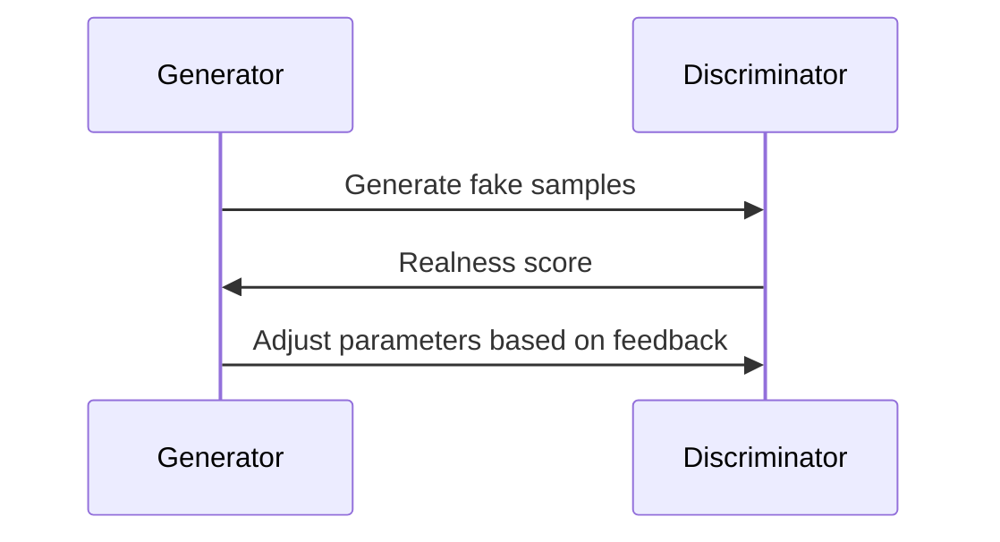
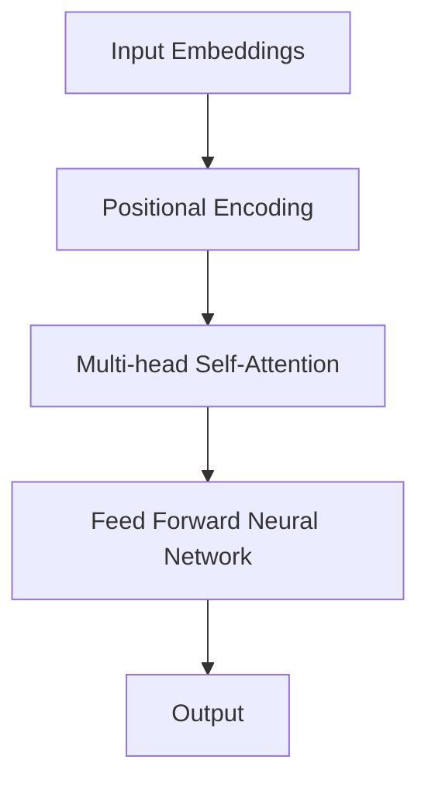

                 


# AIGC与知识产权：新挑战与解决方案

## 关键词
- AI-Generated Content (AIGC)
- Intellectual Property (IP)
- Copyright Infringement
- Data Privacy
- Algorithmic Fairness

## 摘要
本文深入探讨了AIGC与知识产权之间的复杂关系，揭示了AIGC技术发展对传统知识产权法律体系带来的新挑战。文章首先概述了AIGC和知识产权的基本概念，然后分析了AIGC对版权认定、隐私保护和原创性验证等方面的挑战。接着，文章探讨了现有法律框架和政策在应对这些挑战方面的不足，并提出了基于技术的解决方案。通过案例分析，本文展示了不同领域的实践成果，为未来的发展提供了有益的启示。

## 第一部分：背景介绍

### 第1章 问题背景

#### 1.1.1 AIGC的定义与发展历程
AIGC，即AI-Generated Content，是指通过人工智能技术自动生成的内容，包括文本、图像、音频和视频等多种形式。AIGC技术的发展经历了从简单的规则引擎到复杂的深度学习模型的演变。随着技术的进步，AIGC的应用领域不断扩大，从内容创作到数据增强，再到个性化推荐系统，都发挥着重要作用。

#### 1.1.2 知识产权的基本概念与法律框架
知识产权是指个人或集体对其创造的智力成果所享有的权利。主要包括版权、专利、商标、商业秘密等。知识产权法律体系旨在保护创新和创意，激励更多人投入到研究和创造中。不同国家和地区对知识产权的保护程度和范围存在差异，但总体上都遵循国际知识产权条约。

#### 1.1.3 AIGC与知识产权的关系
AIGC技术的崛起对知识产权领域带来了深远影响。一方面，AIGC作品的出现引发了版权归属、原创性认定等法律问题；另一方面，AIGC技术也为知识产权的侵权监测、维权等提供了新的工具。理解和处理AIGC与知识产权的关系，是当前法律和科技领域的重要课题。

### 第2章 核心概念与联系

#### 2.1 AIGC的核心技术
AIGC的核心技术包括自然语言处理（NLP）、生成对抗网络（GAN）、强化学习（RL）等。这些技术通过模拟人类思维和创造过程，实现了自动化内容生成。例如，NLP技术可以用于生成高质量的文章和对话，GAN技术可以创造出逼真的图像和视频。

#### 2.2 知识产权的基本属性
知识产权的基本属性包括独占性、地域性和时间性。独占性意味着权利人对其智力成果享有独占权利，未经授权他人不得使用。地域性表明知识产权在特定地理范围内有效。时间性则规定了知识产权的有效期限，一旦期限届满，智力成果进入公共领域，任何人都可以自由使用。

#### 2.3 AIGC与知识产权的联系
AIGC与知识产权的联系体现在多个方面。首先，AIGC作品可能涉及版权问题，例如自动化创作的音乐、小说和绘画。其次，AIGC技术可以用于知识产权的保护和监测，如通过加密技术保护版权，使用AI进行侵权检测等。

#### 2.4 ER实体关系图
实体关系图（ER图）是一种用于描述数据模型的方法。在AIGC与知识产权的背景下，ER图可以用来表示不同实体（如作者、作品、用户等）之间的关系，以及它们在知识产权法律框架中的交互。以下是一个简单的ER图示例：

```mermaid
erDiagram
  Author ||--|{ Work }||>
  Work ||--|{ Copyright }||>
  User ||--|{ Review }||>
  Review ||--|{ Feedback }||>
```

### 第3章 数学模型和数学公式

#### 3.1 AIGC的算法原理
AIGC的算法原理涉及多种数学模型和公式。以生成对抗网络（GAN）为例，其基本架构包括生成器（Generator）和判别器（Discriminator）。生成器生成假样本，判别器则判断这些样本的真实性。以下是一个GAN的基本工作流程：



在GAN中，常用的损失函数是二元交叉熵（Binary Cross-Entropy），其公式如下：

$$
L(D, G) = -\frac{1}{2N} \sum_{i=1}^{N} [\log(D(x_i)) + \log(1 - D(G(z_i)))]
$$

其中，$D(x_i)$ 表示判别器对真实样本的判断概率，$D(G(z_i))$ 表示判别器对生成样本的判断概率，$N$ 是样本数量。

#### 3.2 数学模型与公式讲解
除了GAN，其他AIGC技术如自然语言处理（NLP）也使用了复杂的数学模型。例如，在NLP中，常用的模型包括循环神经网络（RNN）、长短时记忆网络（LSTM）和变换器（Transformer）。以下是一个简单的Transformer模型的结构：



Transformer模型的核心是多头自注意力（Multi-head Self-Attention），其公式如下：

$$
\text{Attention}(Q, K, V) = \frac{1}{\sqrt{d_k}} \text{softmax}(\text{score})W_V
$$

其中，$Q, K, V$ 分别是查询（Query）、键（Key）和值（Value）向量，$d_k$ 是键向量的维度，$\text{score}$ 是点积得分，$W_V$ 是值向量的权重。

#### 3.3 举例说明
假设我们使用Transformer模型生成一段文本，输入的词向量维度为512，注意力头数为8。首先，我们将输入的词向量进行嵌入和位置编码，然后通过多头自注意力机制进行信息融合，最后通过前馈神经网络生成输出。以下是具体的步骤：

1. **嵌入和位置编码**：
   $$\text{Embedding}(x) = W_Ex + P_E$$
   其中，$W_E$ 是嵌入权重，$P_E$ 是位置编码。

2. **多头自注意力**：
   $$\text{MultiHead}(Q, K, V) = \text{Concat}(\text{head}_1, ..., \text{head}_h)W_O$$
   其中，$h$ 是注意力头数，$W_O$ 是输出权重。

3. **前馈神经网络**：
   $$\text{FFN}(x) = \text{Relu}(W_{FFN_1}x + b_{FFN_1})W_{FFN_2} + b_{FFN_2}$$
   其中，$W_{FFN_1}$ 和 $W_{FFN_2}$ 是前馈神经网络的权重，$b_{FFN_1}$ 和 $b_{FFN_2}$ 是偏置。

通过这些步骤，我们可以生成高质量的文本内容，如图文描述、新闻报道和对话系统等。

## 第二部分：新挑战

### 第4章 AIGC对知识产权的新挑战

#### 4.1 自动化创作与版权认定
自动化创作，尤其是AI生成的作品，引发了版权认定的问题。由于AI缺乏创作意图，其作品是否应该受到版权保护成为争议的焦点。此外，如何确定AI生成作品的版权归属也是一大挑战。

#### 4.2 大数据与隐私保护
AIGC技术依赖于大量的数据集进行训练，这些数据集可能包含个人隐私信息。如何在数据使用过程中保护隐私，防止数据泄露和滥用，是AIGC领域面临的另一个重要挑战。

#### 4.3 模仿与抄袭问题
AI生成的内容可能模仿现有作品，导致抄袭问题。如何检测和防止AI生成的作品抄袭现有作品，维护原创者的权益，是AIGC领域的一个重要挑战。

#### 4.4 AI生成的信息真实性验证
随着AI生成内容的普及，如何验证信息的真实性成为一个关键问题。虚假信息的传播可能对社会造成严重影响，因此，确保AI生成内容的真实性至关重要。

### 第5章 案例分析

#### 5.1 案例介绍
本文将通过几个具体的案例，分析AIGC技术对知识产权带来的新挑战。例如，谷歌的AI艺术比赛、AI生成的音乐作品版权争议等。

#### 5.2 案例分析
通过对案例的深入分析，我们可以理解AIGC技术在不同领域的应用情况，以及其对知识产权法律体系带来的影响。

#### 5.3 案例启示
案例分析为我们提供了宝贵的经验教训，有助于我们更好地应对AIGC技术发展带来的知识产权挑战。

## 第三部分：解决方案

### 第6章 知识产权法律框架与政策

#### 6.1 国内外知识产权法律框架
本文将比较分析国内外知识产权法律框架，探讨其在应对AIGC挑战方面的差异和共性。

#### 6.2 知识产权政策分析
本文将分析当前知识产权政策的实施效果，探讨如何进一步完善政策，以适应AIGC技术的发展。

#### 6.3 知识产权法律挑战与应对
本文将提出针对AIGC技术发展带来的法律挑战的解决方案，包括立法、司法和执法等方面。

### 第7章 技术解决方案

#### 7.1 数字指纹技术
数字指纹技术可以通过在作品上嵌入不可篡改的标识，实现版权保护和追踪。本文将介绍数字指纹技术的工作原理和应用案例。

#### 7.2 加密与隐私保护技术
加密技术可以在数据传输和存储过程中保护隐私，防止数据泄露。本文将探讨加密技术在AIGC领域的应用前景。

#### 7.3 AI反抄袭技术
AI反抄袭技术可以通过分析文本、图像等内容的相似性，检测抄袭行为。本文将介绍AI反抄袭技术的原理和应用。

#### 7.4 AI生成内容认证技术
AI生成内容认证技术可以通过验证内容的生成过程，确保其真实性。本文将探讨AI生成内容认证技术的实现方法。

### 第8章 最佳实践与案例分析

#### 8.1 企业实践案例
本文将介绍一些企业在应对AIGC带来的知识产权挑战方面的实践案例，包括版权保护、隐私保护等方面的经验。

#### 8.2 法律实践案例
本文将分析一些法律实践案例，探讨如何通过法律手段解决AIGC领域的知识产权问题。

#### 8.3 技术实践案例
本文将介绍一些技术实践案例，展示如何通过技术创新解决AIGC带来的知识产权挑战。

## 第9章 小结与展望

#### 9.1 总结与展望
本文总结了AIGC与知识产权之间的关系，分析了AIGC技术发展带来的新挑战，并提出了相应的解决方案。展望未来，AIGC与知识产权的关系将更加紧密，如何在保护创新和鼓励创新之间找到平衡，将是未来研究和实践的重要方向。

#### 9.2 注意事项
本文提醒读者，在应用AIGC技术时，应充分了解相关法律法规，确保合法合规。

#### 9.3 拓展阅读
本文提供了相关的拓展阅读资源，以帮助读者深入了解AIGC与知识产权的相关内容。

---

**作者：AI天才研究院/AI Genius Institute & 禅与计算机程序设计艺术 /Zen And The Art of Computer Programming**

