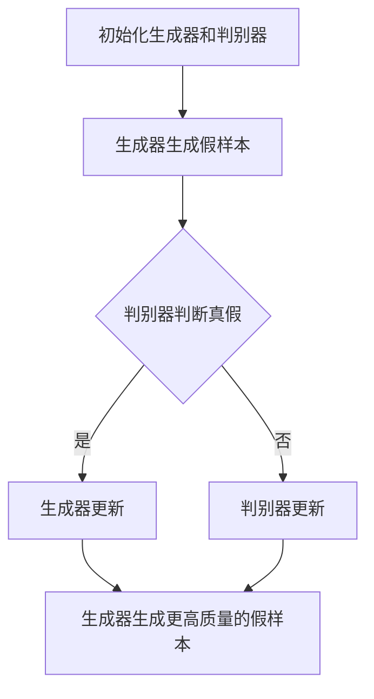
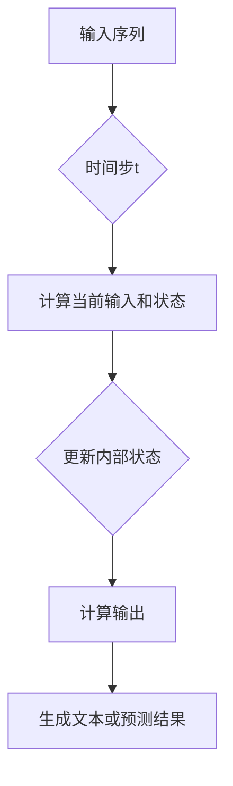
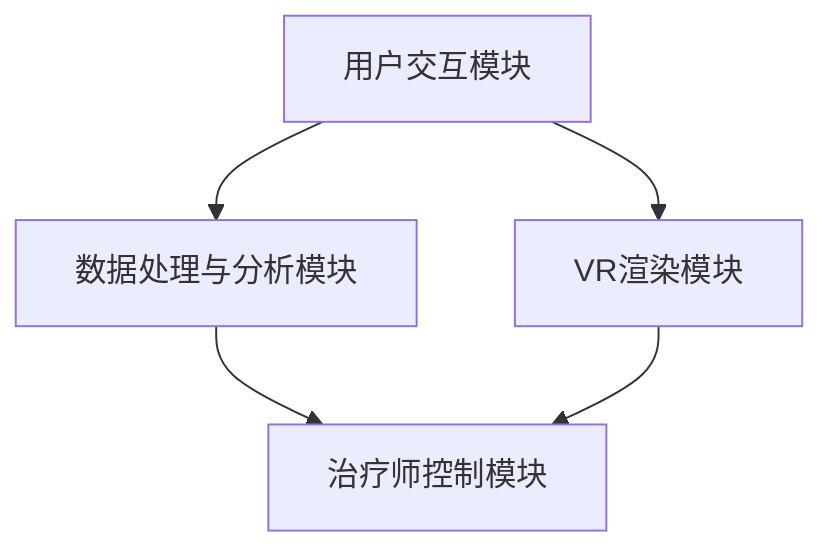
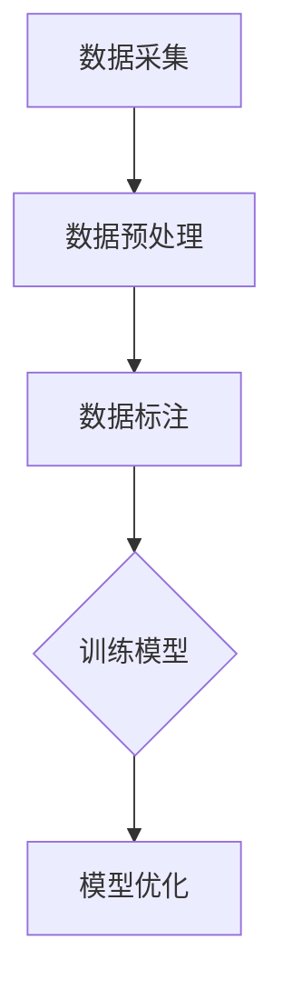
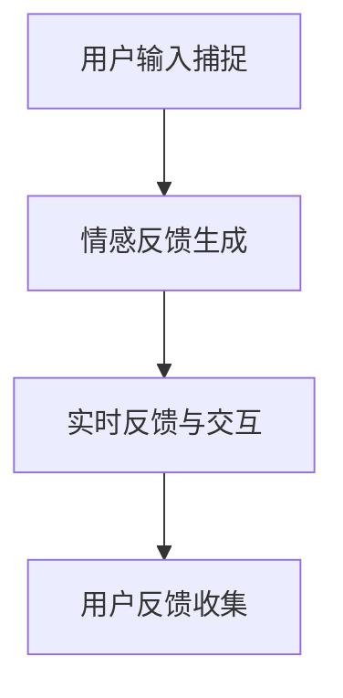

                 

### 引言

#### 1.1 心理治疗的现状与挑战

##### 1.1.1 心理治疗的背景

心理治疗，作为医学心理学的一个重要分支，旨在通过一系列专业的干预措施帮助患者解决心理问题，提升心理健康水平。心理治疗的历史可以追溯到古代文明，如古希腊和古罗马时期，那时人们已经开始运用谈话疗法来治疗心理障碍。然而，现代心理治疗的发展始于20世纪初期，以精神分析学派的创立为标志，随后认知行为疗法（CBT）逐渐成为主流。

目前，心理治疗已广泛应用于各类精神障碍、情感障碍、焦虑障碍、物质依赖和创伤后应激障碍（PTSD）等心理问题的治疗。尽管心理治疗在临床实践中取得了显著成效，但其普及度和可及性仍存在一定局限性。很多患者因缺乏专业心理医生或心理诊所，无法获得及时有效的心理治疗服务，尤其是在偏远地区和经济欠发达地区。

##### 1.1.2 心理治疗的现状

当前，心理治疗的现状可以从以下几个方面来概述：

1. **治疗效果的个体差异**：不同治疗方法对患者的效果存在显著差异，部分患者可能对某种疗法反应良好，而另一些患者则可能效果不佳。这种个体差异使得心理治疗的疗效难以预测和标准化。

2. **治疗资源的稀缺**：专业心理医生和心理咨询师的数量有限，无法满足快速增长的心理健康需求。此外，治疗成本高昂，很多患者难以承担。

3. **治疗过程的复杂性和耗时性**：心理治疗通常需要多次面谈和长时间的干预，这使得治疗过程复杂且耗时，不利于及时解决患者的心理问题。

4. **患者参与度的挑战**：一些患者可能因为心理压力、羞耻感或其他原因而拒绝参与治疗，这降低了治疗的实际效果。

##### 1.1.3 心理治疗面临的挑战

1. **治疗需求的快速增长**：随着社会压力的增大和心理健康问题的日益普遍，心理治疗的需求呈现出快速增长的趋势，这给现有的心理治疗体系带来了巨大压力。

2. **治疗技术的创新和更新**：随着科学技术的进步，新的治疗技术和方法不断涌现，但如何将这些新技术有效应用于临床实践，仍是一个挑战。

3. **治疗伦理和法律问题**：心理治疗涉及患者的隐私、安全和法律责任，需要严格遵守伦理和法律规范，这对治疗师提出了更高的要求。

4. **治疗的可及性和公平性**：如何提高心理治疗的可及性和公平性，确保每个人都能获得合适和有效的心理治疗服务，是一个亟待解决的问题。

面对以上挑战，心理治疗领域亟需寻找新的解决方案，以提升治疗效果、降低治疗成本、扩大治疗覆盖面和提高治疗的可及性。在这个背景下，AIGC（人工智能生成内容）与虚拟现实（VR）技术的引入为心理治疗提供了新的可能性。

### AIGC与VR技术简介

#### 1.2.1 AIGC技术概述

AIGC（Artificial Intelligence Generated Content）是一种利用人工智能技术自动生成内容的方法。AIGC 技术的核心是生成对抗网络（GAN）和深度学习模型，通过这些技术可以生成高质量的文本、图像、视频等。AIGC 技术的应用领域非常广泛，包括但不限于内容创作、娱乐、教育、医疗和广告等。在内容创作方面，AIGC 可以帮助创作者快速生成高质量的内容，减少创作时间和成本；在医疗领域，AIGC 可以用于个性化治疗方案的设计和医疗图像的生成，提高诊断准确性和效率。

#### 1.2.2 VR技术概述

虚拟现实（VR）技术是一种通过计算机模拟产生三维空间的视觉、听觉、触觉等多感官体验的技术。VR 技术的基本原理是通过头戴式显示器（HMD）或其他显示设备，将用户的视觉和听觉感知限制在一个虚拟环境中。用户在虚拟环境中可以自由移动、互动，感受到身临其境的感觉。VR 技术的应用范围包括游戏、娱乐、教育、医疗、军事和设计等多个领域。

#### 1.2.3 AIGC与VR的结合及其潜力

将AIGC与VR技术结合，可以在心理治疗领域发挥巨大的潜力。具体来说：

1. **个性化治疗方案设计**：AIGC 技术可以根据患者的具体心理状况和需求，生成个性化的治疗方案，提高治疗的精准度和有效性。

2. **治疗场景模拟**：VR 技术可以创建各种虚拟的治疗场景，帮助患者在安全、无压力的环境中面对和处理心理问题。

3. **治疗过程的记录与反馈**：AIGC 和 VR 技术的结合可以记录患者的治疗过程，提供实时反馈，帮助治疗师及时调整治疗方案。

4. **降低治疗成本**：通过AIGC和VR技术的应用，可以降低心理治疗的成本，使得更多的患者能够负担得起高质量的心理治疗服务。

5. **提高患者的参与度和依从性**：VR 技术提供的沉浸式体验可以显著提高患者的参与度和依从性，从而提高治疗效果。

总的来说，AIGC 与 VR 技术的结合为心理治疗带来了新的思路和方法，有望解决现有心理治疗面临的诸多挑战。在接下来的章节中，我们将进一步探讨 AIGC 和 VR 技术在心理治疗中的应用场景、优势以及面临的挑战。

#### 1.3 AIGC与VR在心理治疗中的融合应用

##### 1.3.1 应用领域

AIGC与VR技术的融合在心理治疗领域展现出广阔的应用前景，具体应用领域如下：

1. **焦虑症治疗**：利用AIGC技术生成个性化的虚拟场景，模拟患者可能面临的各种焦虑情境，帮助患者逐步适应和克服焦虑情绪。

2. **抑郁症治疗**：通过VR技术创建一个安全、舒适的治疗环境，结合AIGC生成的文字和图像，引导患者进行情感表达和心理重建。

3. **创伤后应激障碍（PTSD）治疗**：VR技术可以模拟创伤事件的发生情境，帮助患者通过逐步暴露疗法面对和缓解创伤后的应激反应。

4. **社交焦虑症治疗**：利用VR技术创建一个模拟社交环境的虚拟场景，通过AIGC生成的社交对话和反馈，帮助患者提高社交技能和自信心。

5. **疼痛管理**：通过AIGC和VR技术生成沉浸式娱乐内容，帮助患者分散注意力，减轻疼痛感受，提高生活质量。

##### 1.3.2 应用优势

AIGC与VR技术的融合在心理治疗中具有以下优势：

1. **个性化治疗**：AIGC可以根据患者的具体心理状况和需求，生成个性化的虚拟场景和治疗方案，提高治疗的精准度和有效性。

2. **沉浸式体验**：VR技术提供的沉浸式环境可以帮助患者更加真实地体验和面对心理问题，从而提高治疗效果。

3. **安全性**：虚拟环境提供了一个安全、无压力的空间，患者可以在这里自由表达和探索自己的心理状态，减少了传统治疗中的心理负担。

4. **可重复性**：虚拟场景可以重复使用，患者可以根据治疗计划多次进入同一环境，有助于巩固治疗效果。

5. **成本效益**：AIGC和VR技术的应用可以显著降低心理治疗的成本，使得更多患者能够负担得起高质量的心理治疗服务。

6. **数据记录与分析**：AIGC和VR技术的结合可以记录患者的治疗过程和反馈，为治疗师提供丰富的数据支持，有助于优化治疗方案。

##### 1.3.3 应用挑战

尽管AIGC与VR技术在心理治疗中具有巨大潜力，但其应用仍面临一系列挑战：

1. **技术成熟度**：目前AIGC和VR技术尚处于快速发展阶段，某些关键技术的成熟度和稳定性仍有待提高。

2. **伦理问题**：AIGC和VR技术的应用涉及患者的隐私、安全和医疗责任，需要制定严格的伦理规范和法律法规。

3. **患者接受度**：部分患者可能对虚拟环境和AIGC生成的内容持怀疑态度，影响治疗的顺利进行。

4. **设备成本**：高质量的VR设备和AIGC技术生成内容需要较高的设备成本，这可能限制其在某些地区的普及。

5. **专业培训**：治疗师需要接受专业的AIGC和VR技术培训，以充分发挥其在心理治疗中的作用。

总的来说，AIGC与VR技术在心理治疗中的应用具有巨大的潜力，但也面临一系列挑战。通过不断的技术创新和规范制定，有望克服这些挑战，实现心理治疗领域的重大突破。

#### 1.4 本书结构安排

为了系统地探讨AIGC与VR技术在心理治疗中的融合应用，本书分为以下六个主要章节：

**第1章 引言**：介绍了心理治疗的现状与挑战，以及AIGC与VR技术的背景和潜力。

**第2章 AIGC技术基础**：详细介绍了AIGC技术的定义、核心技术、应用场景和关键技术的原理。

**第3章 VR技术基础**：探讨了VR技术的定义、核心技术、应用场景和关键技术的原理。

**第4章 AIGC与VR融合在心理治疗中的应用实践**：通过具体案例分析，展示了AIGC与VR技术在心理治疗中的实际应用。

**第5章 AIGC与VR融合在心理治疗中的伦理与法律问题**：分析了AIGC与VR技术在心理治疗中可能面临的伦理和法律问题，并提出了相应的解决策略。

**第6章 AIGC与VR融合在心理治疗中的未来发展**：探讨了AIGC与VR技术在心理治疗中的未来发展趋势和挑战。

为了方便读者阅读，本书每一章节都提供了详细的小节概述和内容结构。同时，本书还附有拓展阅读资料，以供读者深入了解相关主题。

### AIGC技术基础

#### 2.1 AIGC基本概念

AIGC（Artificial Intelligence Generated Content）是指利用人工智能技术自动生成内容的方法。AIGC 技术的核心在于利用生成对抗网络（GAN）和深度学习模型，通过训练和优化，生成与真实数据高度相似的内容。AIGC 技术在内容创作、娱乐、教育、医疗和广告等多个领域具有广泛应用。以下是 AIGC 的定义、核心技术和发展历程的详细介绍。

##### 2.1.1 AIGC的定义

AIGC 是一种基于人工智能技术的内容生成方法，其主要目标是通过算法生成高质量、多样化的内容。这些内容可以包括文本、图像、音频、视频等多种形式。AIGC 的关键在于利用深度学习模型，特别是生成对抗网络（GAN）技术，实现内容的自动化生成。

##### 2.1.2 AIGC的核心技术

AIGC 技术的核心技术主要包括生成对抗网络（GAN）、变分自编码器（VAE）和递归神经网络（RNN）等。

1. **生成对抗网络（GAN）**：GAN 是由 Ian Goodfellow 等人于 2014 年提出的。GAN 的基本结构包括一个生成器（Generator）和一个判别器（Discriminator）。生成器的任务是生成与真实数据相似的数据，而判别器的任务是区分生成器生成的数据与真实数据。通过两者之间的对抗训练，生成器不断提高生成数据的质量。

2. **变分自编码器（VAE）**：VAE 是一种基于概率模型的生成模型。VAE 的基本结构包括编码器（Encoder）和解码器（Decoder）。编码器将输入数据映射到一个低维的潜在空间，而解码器则将潜在空间的数据解码回原始空间。VAE 通过对潜在空间的学习，实现数据的生成。

3. **递归神经网络（RNN）**：RNN 是一种能够处理序列数据的人工神经网络。RNN 通过内部状态记忆，能够捕捉序列数据中的时序依赖关系。在文本生成任务中，RNN 可以通过学习输入文本序列的编码，生成新的文本序列。

##### 2.1.3 AIGC的发展历程

AIGC 技术的发展历程可以分为以下几个阶段：

1. **早期探索**（2010 年前）：在此阶段，研究人员开始探索使用神经网络生成图像、音频和文本等数据。

2. **生成对抗网络（GAN）的提出**（2014 年）：Ian Goodfellow 等人提出了 GAN 模型，标志着 AIGC 技术的正式诞生。GAN 模型在图像生成任务中取得了显著效果，成为 AIGC 技术的主要方向。

3. **多模态生成**（2015-2018 年）：随着技术的进步，AIGC 技术逐渐扩展到多模态数据的生成，包括图像、音频和文本的联合生成。

4. **大规模生成**（2018 年至今）：随着计算能力和数据资源的提升，AIGC 技术开始在大规模数据生成任务中应用，例如视频生成、语音合成和复杂场景的建模。

#### 2.2 AIGC在心理治疗中的应用

##### 2.2.1 应用场景

AIGC 技术在心理治疗中的应用场景非常广泛，以下是一些典型的应用场景：

1. **个性化治疗方案设计**：AIGC 可以根据患者的具体心理状况和需求，生成个性化的虚拟治疗场景和文本内容，帮助治疗师设计更有效的治疗方案。

2. **虚拟现实治疗**：利用 AIGC 生成逼真的虚拟现实环境，模拟患者的心理问题，如焦虑、恐惧等，帮助患者逐步适应和克服这些问题。

3. **辅助治疗师评估**：AIGC 可以自动生成患者的治疗记录和评估报告，帮助治疗师快速了解患者的心理状况和治疗效果。

4. **患者心理疏导**：AIGC 生成的虚拟角色可以通过对话和互动，提供情感支持和心理疏导，帮助患者缓解心理压力。

##### 2.2.2 应用实例

以下是一些 AIGC 在心理治疗中的实际应用实例：

1. **焦虑症治疗**：利用 AIGC 生成个性化的虚拟场景，如高楼、密集的人群等，帮助患者逐步适应和克服焦虑情绪。

2. **抑郁症治疗**：通过 AIGC 生成温馨、宁静的虚拟环境，引导患者进行放松和情感表达，促进心理重建。

3. **社交焦虑症治疗**：利用 AIGC 生成的虚拟社交场景，模拟真实的社交情境，帮助患者练习社交技能，提高自信心。

4. **创伤后应激障碍（PTSD）治疗**：通过 AIGC 生成模拟创伤事件的虚拟场景，帮助患者通过逐步暴露疗法缓解创伤后的应激反应。

##### 2.2.3 应用效果分析

AIGC 技术在心理治疗中的应用效果得到了广泛认可。以下是一些应用效果分析：

1. **治疗效果提升**：通过生成个性化的虚拟场景和文本内容，AIGC 有助于提高心理治疗的精准度和有效性，尤其对于个性化治疗需求较高的患者。

2. **治疗过程优化**：AIGC 生成的虚拟环境可以提供一个安全、无压力的治疗空间，帮助患者更加舒适地面对心理问题，从而提高治疗的顺利进行。

3. **降低治疗成本**：AIGC 技术的应用可以显著降低心理治疗的成本，使得更多患者能够负担得起高质量的心理治疗服务。

4. **提高患者参与度**：通过沉浸式的虚拟体验，AIGC 可以显著提高患者的参与度和依从性，有助于治疗效果的巩固和提升。

总的来说，AIGC 技术在心理治疗中的应用具有显著的优势，通过不断的技术创新和应用实践，有望在心理治疗领域发挥更大的作用。

#### 2.3 AIGC关键技术原理详解

AIGC（Artificial Intelligence Generated Content）技术的核心在于其生成能力和创造力，而这一能力主要依赖于生成对抗网络（GAN）、循环神经网络（RNN）等关键技术。本节将对这些关键技术进行详细的原理讲解，以便读者更好地理解AIGC的工作机制和应用价值。

##### 2.3.1 生成对抗网络（GAN）

生成对抗网络（GAN）是AIGC技术的基石，由Ian Goodfellow等人于2014年提出。GAN的工作原理基于一个生成器（Generator）和一个判别器（Discriminator）之间的对抗训练。

**2.3.1.1 GAN的定义**

GAN是一种由两个神经网络组成的学习框架，分别是生成器（Generator）和判别器（Discriminator）。生成器的任务是生成假样本，判别器的任务是区分生成的假样本和真实的样本。

**2.3.1.2 GAN的工作原理**

GAN的训练过程可以分为以下几个步骤：

1. **生成器生成假样本**：生成器从随机噪声中生成假样本，这些样本试图模仿真实样本的分布。

2. **判别器区分真实与假样本**：判别器接收真实样本和生成器生成的假样本，并尝试区分两者。

3. **生成器和判别器相互对抗**：生成器的目标是提高生成样本的质量，使其更接近真实样本，而判别器的目标是提高对真实样本和假样本的区分能力。

4. **迭代训练**：通过多次迭代训练，生成器和判别器不断优化自身，使得生成器的生成样本越来越逼真，而判别器的区分能力越来越强。

**2.3.1.3 GAN的应用**

GAN在AIGC技术中有着广泛的应用，主要包括以下几方面：

1. **图像生成**：GAN可以生成高质量的图像，如人脸、风景、艺术画作等。

2. **图像修复**：GAN可以用于图像修复任务，如去除照片中的污点、模糊部分。

3. **风格迁移**：GAN可以实现图像风格迁移，如将一幅普通照片转换为梵高风格的画作。

4. **图像超分辨率**：GAN可以提高图像的分辨率，使低分辨率图像变得更加清晰。

以下是GAN的工作流程的Mermaid流程图表示：

##### 2.3.2 循环神经网络（RNN）

循环神经网络（RNN）是一种用于处理序列数据的人工神经网络，其特点是具有内部状态记忆，能够捕捉序列数据中的时序依赖关系。RNN在文本生成、时间序列预测等任务中有着广泛的应用。

**2.3.2.1 RNN的定义**

RNN是一种由多个相同结构的神经网络单元组成，每个单元都包含输入门、遗忘门和输出门，这些门控制信息的流入、流出和保留。

**2.3.2.2 RNN的工作原理**

RNN的工作原理可以概括为以下几个步骤：

1. **输入序列处理**：RNN将输入序列分成多个时间步，并在每个时间步上处理输入。

2. **内部状态更新**：在每个时间步，RNN的内部状态会根据当前的输入和前一个时间步的内部状态进行更新。

3. **输出计算**：RNN根据当前的内部状态和输出门，计算输出。

4. **循环依赖**：RNN的输出不仅依赖于当前的输入，还依赖于之前的输入，从而捕捉到序列数据中的时序依赖关系。

**2.3.2.3 RNN的应用**

RNN在AIGC技术中的主要应用包括：

1. **文本生成**：RNN可以用于生成自然语言文本，如诗歌、故事等。

2. **时间序列预测**：RNN可以用于预测股票价格、天气变化等时间序列数据。

3. **机器翻译**：RNN在机器翻译任务中可以捕捉源语言和目标语言之间的时序依赖关系。

以下是RNN的工作流程的Mermaid流程图表示：

通过以上对GAN和RNN的详细讲解，我们可以看到AIGC技术是如何通过这些关键技术实现内容生成的。接下来，我们将探讨AIGC技术未来的发展趋势和面临的挑战。

#### 2.4 AIGC技术发展展望

随着人工智能技术的迅猛发展，AIGC（Artificial Intelligence Generated Content）技术在生成内容和应用场景方面也展现出广阔的前景。以下将从技术发展趋势、技术挑战与解决方案两个方面进行探讨。

##### 2.4.1 技术发展趋势

1. **更高质量的生成内容**：随着深度学习技术的进步，生成对抗网络（GAN）等模型将变得更加成熟，能够生成更加逼真、多样化的内容。例如，图像、视频和音频的生成质量将得到显著提升。

2. **跨模态生成**：AIGC技术将不再局限于单一模态的内容生成，而是能够实现图像、文本、音频等多模态数据的联合生成。这将有助于更好地捕捉和表达复杂的信息，提供更加丰富的用户体验。

3. **自适应生成**：AIGC技术将能够根据用户的需求和反馈进行自适应生成，提供个性化的内容和体验。例如，根据用户的兴趣和偏好生成定制化的新闻、推荐内容等。

4. **实时生成**：随着计算能力的提升和网络的普及，AIGC技术将实现更加实时的内容生成，用户可以在短时间内获得高质量的生成内容，满足即时的需求。

5. **大规模生成**：AIGC技术将能够处理大规模的数据集，生成海量的内容。这将有助于提高内容创作的效率和多样性，满足不同用户和场景的需求。

##### 2.4.2 技术挑战与解决方案

1. **模型训练的效率与成本**：当前，AIGC技术的模型训练过程通常需要大量计算资源和时间。为了提高训练效率，可以采用以下解决方案：

   - **分布式训练**：利用分布式计算技术，将训练任务分配到多个计算节点上，提高训练速度。
   - **增量训练**：通过增量训练的方式，利用已有模型的参数进行微调，减少训练所需的计算资源和时间。
   - **模型压缩**：采用模型压缩技术，如剪枝、量化等，降低模型的大小和计算复杂度。

2. **生成内容的质量与真实性**：尽管AIGC技术已经能够生成高质量的内容，但如何保证生成内容的质量和真实性仍然是一个挑战。以下是几个可能的解决方案：

   - **数据增强**：通过数据增强技术，增加训练数据的多样性和丰富性，提高模型的泛化能力。
   - **多模态学习**：结合多模态数据，如文本、图像、音频等，提高生成内容的质量和真实性。
   - **用户反馈**：通过用户反馈机制，不断优化生成模型，提高生成内容的质量。

3. **数据隐私与伦理问题**：AIGC技术涉及大量个人数据的使用和处理，如何保护用户隐私和遵循伦理规范是一个重要挑战。以下是一些可能的解决方案：

   - **数据去识别化**：在训练模型之前，对用户数据进行去识别化处理，减少隐私泄露的风险。
   - **透明和可解释性**：提高AIGC技术的透明度和可解释性，让用户了解模型的工作方式和处理数据的方式。
   - **伦理审查**：建立严格的伦理审查机制，确保AIGC技术的应用符合伦理规范和法律法规。

总的来说，AIGC技术在未来发展中具有巨大的潜力，但也面临一系列技术挑战。通过不断的技术创新和规范制定，有望克服这些挑战，推动AIGC技术在各个领域的广泛应用。

### VR技术基础

#### 3.1 VR技术基本概念

虚拟现实（VR）技术是一种通过计算机生成三维环境，为用户提供沉浸式视觉、听觉、触觉等多感官体验的技术。VR 技术的基本原理是通过头戴式显示器（HMD）、传感器、追踪设备和计算设备等硬件设备，创建一个模拟的三维虚拟环境，使用户能够在这个环境中自由移动、互动和体验。以下是 VR 技术的定义、技术构成和发展历程的详细介绍。

##### 3.1.1 VR的定义

虚拟现实（Virtual Reality，VR）是一种通过计算机技术创建的三维虚拟环境，用户可以通过头戴式显示器（HMD）或其他设备进入这个虚拟环境，并与环境中的对象进行互动。VR 技术的主要特点是提供高度沉浸式的体验，使用户感觉仿佛置身于现实世界之外。

##### 3.1.2 VR的技术构成

VR 技术的基本构成包括以下几个部分：

1. **头戴式显示器（HMD）**：HMD 是 VR 系统的核心设备，它通过两个小屏幕模拟左右眼视图，产生立体视觉效果。HMD 通常配备有光学镜片和传感器，用于跟踪用户的头部运动，从而动态调整视角。

2. **传感器和追踪设备**：传感器和追踪设备用于跟踪用户的身体动作和头部运动，确保用户在虚拟环境中的动作能够实时反映在屏幕上。常见的传感器包括位置追踪器、手势追踪器和眼动仪等。

3. **计算设备**：VR 系统需要一个强大的计算设备来生成和渲染虚拟环境。计算设备通常包括高性能的处理器、图形处理器（GPU）和存储设备。

4. **交互设备**：交互设备如控制器、手套等，用于用户在虚拟环境中的操作和交互。这些设备通常与传感器和计算设备协同工作，提供更加自然的交互体验。

##### 3.1.3 VR的发展历程

VR 技术的发展历程可以分为以下几个阶段：

1. **早期探索**（20 世纪 60 年代至 80 年代）：在此阶段，VR 技术的概念被提出，但受限于技术和硬件，只能进行简单的实验和尝试。

2. **初步发展阶段**（20 世纪 90 年代至 2000 年）：随着计算机技术的发展，VR 设备开始具备一定功能，但成本高昂，应用范围有限。

3. **快速增长期**（2010 年至今）：随着硬件技术的进步和市场的需求，VR 技术进入快速增长期。市场涌现出众多 VR 设备和内容，VR 在游戏、教育、医疗、设计等多个领域得到广泛应用。

4. **成熟阶段**（未来）：随着 VR 技术的不断成熟，预计将在更多领域发挥作用，如虚拟现实会议、远程工作、虚拟旅游等。

#### 3.2 VR在心理治疗中的应用

##### 3.2.1 应用场景

VR 技术在心理治疗领域具有广泛的应用场景，以下是一些典型的应用场景：

1. **焦虑症治疗**：通过 VR 技术，创建一个模拟的、逐步递增的恐惧情境，帮助患者面对和克服焦虑情绪。

2. **抑郁症治疗**：利用 VR 技术，创建一个安全、宁静的环境，引导患者进行放松和情绪表达，促进心理重建。

3. **创伤后应激障碍（PTSD）治疗**：通过 VR 技术，模拟创伤事件的发生情境，帮助患者逐步适应和缓解创伤后的应激反应。

4. **社交焦虑症治疗**：利用 VR 技术，模拟真实的社交情境，帮助患者练习社交技能，提高自信心。

5. **疼痛管理**：通过 VR 技术，创建一个沉浸式的娱乐体验，帮助患者分散注意力，减轻疼痛感受。

##### 3.2.2 应用实例

以下是一些 VR 在心理治疗中的实际应用实例：

1. **焦虑症治疗**：使用 VR 头盔和传感器，模拟高空、密集人群等焦虑情境，帮助患者逐步适应和克服焦虑。

2. **抑郁症治疗**：通过 VR 技术，创建一个温馨、宁静的虚拟花园，引导患者进行放松和情感表达。

3. **创伤后应激障碍（PTSD）治疗**：利用 VR 技术，模拟创伤事件的场景，帮助患者通过逐步暴露疗法缓解应激反应。

4. **社交焦虑症治疗**：通过 VR 技术，模拟真实的社交场合，如咖啡店、餐厅等，帮助患者练习社交技能。

5. **疼痛管理**：使用 VR 技术，创建一个沉浸式的游戏体验，帮助患者分散注意力，减轻疼痛感受。

##### 3.2.3 应用效果分析

VR 技术在心理治疗中的应用效果得到了广泛认可，以下是一些应用效果分析：

1. **治疗效果提升**：通过虚拟环境，患者可以在安全、无压力的空间中面对和处理心理问题，有助于提高治疗效果。

2. **治疗过程优化**：VR 技术提供的沉浸式体验，可以帮助患者更好地参与治疗过程，提高治疗的顺利进行。

3. **降低治疗成本**：VR 技术的应用可以显著降低心理治疗的成本，使得更多患者能够负担得起高质量的心理治疗服务。

4. **提高患者参与度**：VR 技术提供的沉浸式体验，显著提高了患者的参与度和依从性，有助于治疗效果的巩固和提升。

总的来说，VR 技术在心理治疗中的应用具有显著的优势，通过不断的技术创新和应用实践，有望在心理治疗领域发挥更大的作用。

#### 3.3 VR关键技术原理详解

虚拟现实（VR）技术要实现沉浸式体验，关键依赖于头戴式显示器（HMD）和虚拟现实交互设备。以下将详细介绍这两种关键技术的定义、工作原理以及性能比较。

##### 3.3.1 虚拟现实头戴式显示器（HMD）

**3.3.1.1 HMD的定义**

虚拟现实头戴式显示器（HMD，Head-Mounted Display）是一种将显示设备直接佩戴在用户头部的装置，通过光学镜片模拟左右眼视图，产生立体视觉效果。HMD 是 VR 系统的核心组件，负责为用户提供沉浸式的视觉体验。

**3.3.1.2 HMD的工作原理**

HMD 的工作原理主要包括以下几个步骤：

1. **光学镜片**：HMD 通过光学镜片将左右眼的视图分离，模拟立体视觉效果。镜片可以是透镜或反射镜。

2. **显示屏**：HMD 配备有两个或多个小屏幕，用于显示左右眼的图像。屏幕的分辨率和刷新率直接影响 VR 体验的逼真度和流畅度。

3. **头部运动跟踪**：HMD 通过内置的传感器和外部追踪设备（如摄像头）实时跟踪用户的头部运动，动态调整视角，确保用户在虚拟环境中的视角与实际头部运动一致。

4. **渲染与显示**：计算机生成的虚拟环境通过 HMD 的显示屏渲染和显示，用户通过视觉感受到一个三维的虚拟世界。

**3.3.1.3 HMD的类型及性能比较**

目前市场上有多种类型的 HMD，主要包括：

1. **VR 眼镜**：如谷歌眼镜，主要提供基本的 VR 功能，适合轻度使用。

2. **VR 头盔**：如 Oculus Rift、HTC Vive 等，提供更高质量的 VR 体验，适合重度游戏和应用程序。

3. **混合现实（MR）设备**：如微软 HoloLens，能够将虚拟对象叠加在现实世界中，提供更丰富的交互体验。

HMD 的性能比较主要涉及以下几个方面：

- **分辨率**：高分辨率屏幕可以提供更清晰的图像，减少像素颗粒感，提升视觉体验。
- **刷新率**：高刷新率可以提供更流畅的动画和运动效果，减少视觉延迟。
- **视场角（FOV）**：宽视场角可以提供更广阔的视野，增强沉浸感。
- **延迟**：低延迟可以减少用户在虚拟环境中的感觉延迟，提高沉浸感和交互体验。

以下是几种常见 HMD 的性能比较表格：

| HMD 型号     | 分辨率       | 刷新率  | 视场角（FOV） | 延迟 |
| ------------ | ------------ | ------- | ------------ | ---- |
| 谷歌眼镜     | 640x360      | 60Hz    | 40°          | 高   |
| Oculus Rift  | 2160x1200    | 90Hz    | 110°         | 低   |
| HTC Vive     | 2160x1200    | 90Hz    | 110°         | 低   |
| 微软 HoloLens | 1440x1440    | 60Hz    | 110°         | 高   |

##### 3.3.2 虚拟现实交互设备

**3.3.2.1 交互设备的作用**

虚拟现实交互设备是用户与虚拟环境之间的桥梁，用于用户的操作和交互。常见的交互设备包括手柄、手套、操纵杆等。这些设备通过传感器和计算机算法，将用户的动作转化为虚拟环境中的操作。

**3.3.2.2 交互设备的类型**

1. **手柄**：手柄是最常见的交互设备，如游戏手柄。手柄通常配备有按钮、摇杆和触发器，用于控制虚拟环境中的对象。

2. **手套**：手套通过传感器捕捉手部的动作和姿态，提供更加自然的手部交互体验。手套通常配备有柔性传感器和电路板，用于实时跟踪手部动作。

3. **操纵杆**：操纵杆是一种类似机械臂的交互设备，用于控制虚拟环境中的大型机械或交通工具。

**3.3.2.3 交互设备的性能比较**

交互设备的性能比较主要涉及以下几个方面：

- **灵敏度**：高灵敏度的交互设备可以更精确地捕捉用户的手部动作，提高交互体验。
- **响应速度**：快速的响应速度可以减少延迟，提高用户的沉浸感和互动性。
- **舒适度**：舒适度是评估交互设备的一个重要指标，用户长时间使用不会感到疲劳。
- **兼容性**：交互设备需要与 VR 系统兼容，能够支持多种虚拟应用程序。

以下是几种常见交互设备的性能比较表格：

| 交互设备类型 | 灵敏度 | 响应速度 | 舒适度 | 兼容性 |
| ------------ | ------ | -------- | ------ | ------ |
| 游戏手柄     | 高     | 快       | 较高   | 高     |
| 手套         | 高     | 较快     | 中等   | 中等   |
| 操纵杆       | 中等   | 较快     | 较高   | 低     |

通过以上对 VR 技术关键技术的详细介绍，我们可以看到 VR 技术是如何实现沉浸式体验的。这些关键技术的不断发展和优化，为 VR 技术在各个领域的应用提供了坚实的基础。接下来，我们将探讨 VR 技术的未来发展趋势和面临的挑战。

#### 3.4 VR技术发展展望

虚拟现实（VR）技术近年来取得了显著进展，已逐渐应用于游戏、教育、医疗、设计等多个领域。然而，随着技术的不断成熟和应用需求的多样化，VR 技术仍面临诸多挑战和发展机遇。以下从技术发展趋势、技术挑战与解决方案两个方面进行探讨。

##### 3.4.1 技术发展趋势

1. **更高分辨率与更广视场角**：未来 VR 技术将进一步追求更高的分辨率和更广的视场角（FOV），以提供更加逼真的视觉体验。超高分辨率显示器和新型光学技术的应用，有望实现更高的图像质量和视觉清晰度。

2. **多模态交互**：VR 技术将不再局限于视觉交互，而是结合触觉、嗅觉、味觉等多模态感知技术，提供更加丰富和自然的交互体验。例如，通过触觉手套和嗅觉传感器，用户可以感受到虚拟环境中的真实触感和气味。

3. **实时渲染与动态交互**：随着计算能力的提升，VR 技术将实现更加实时的渲染和动态交互。这将使得虚拟环境中的物体和行为更加真实和流畅，提高用户的沉浸感。

4. **跨平台与兼容性**：未来 VR 技术将更加注重跨平台和兼容性，用户可以在不同的 VR 设备上无缝切换和使用应用。同时，VR 技术将与其他数字技术（如人工智能、5G、物联网等）深度融合，拓展应用场景。

5. **教育、医疗、工业等垂直行业应用**：VR 技术在垂直行业的应用将更加深入和广泛。在教育领域，VR 技术可以提供沉浸式教学体验，提高学习效果；在医疗领域，VR 技术可以用于手术模拟、心理治疗等；在工业领域，VR 技术可以用于产品设计、操作培训等。

##### 3.4.2 技术挑战与解决方案

1. **硬件成本与设备重量**：目前 VR 设备的硬件成本较高，且重量较大，这限制了其大规模普及。未来，通过技术创新和规模化生产，有望降低 VR 设备的成本，并采用轻量化材料，提高设备的便携性。

2. **舒适度与长时间使用**：长时间佩戴 VR 设备可能会导致用户感到不适，如眩晕、头痛等。未来，通过优化光学设计、增加空气流通和改进佩戴方式，可以提高 VR 设备的舒适度，延长使用时间。

3. **交互体验与操作自然性**：目前的 VR 交互设备操作方式较为单一，未来需要开发更加自然和直观的交互方式，如手势识别、语音控制等。通过引入多模态交互技术，可以提高 VR 交互的自然性和效率。

4. **内容创作与用户体验**：VR 内容的创作和优化是一个重要挑战。未来需要培养更多 VR 内容创作者，开发高质量的应用程序，同时通过用户反馈和数据分析，不断优化用户体验。

5. **隐私与安全问题**：VR 技术的应用涉及用户的隐私和数据安全。未来需要建立完善的隐私保护机制和安全标准，确保用户数据的安全性和隐私性。

总的来说，VR 技术在未来发展中具有巨大的潜力，但也面临一系列挑战。通过不断的技术创新和产业协同，有望克服这些挑战，推动 VR 技术的广泛应用和可持续发展。

### AIGC与VR融合在心理治疗中的应用实践

#### 4.1 融合应用概述

AIGC（人工智能生成内容）与VR（虚拟现实）技术的融合在心理治疗领域展现出独特的优势和应用潜力。以下将从融合应用的概念、目标和价值三个方面进行概述。

##### 4.1.1 融合应用的概念

AIGC与VR技术的融合应用，指的是利用AIGC技术生成高质量的内容，如虚拟场景、角色对话、情感反馈等，结合VR技术提供的沉浸式体验，为用户提供个性化、互动性的心理治疗服务。这种融合应用的核心在于将AIGC生成的内容嵌入到VR环境中，以实现更丰富的心理治疗体验。

##### 4.1.2 融合应用的目标

AIGC与VR技术的融合应用在心理治疗领域的主要目标包括：

1. **提升治疗效果**：通过AIGC生成个性化的虚拟场景和内容，提高心理治疗的精准度和有效性。例如，根据患者的具体需求生成特定的情境，帮助患者更好地面对和处理心理问题。

2. **增强患者体验**：利用VR技术提供的沉浸式体验，提高患者的参与度和依从性。VR环境可以提供一个安全、无压力的空间，让患者更舒适地表达和探索自己的心理状态。

3. **优化治疗过程**：通过AIGC和VR技术的结合，可以实时记录和分析患者的治疗过程，帮助治疗师更好地了解患者的心理变化，及时调整治疗方案。

4. **降低治疗成本**：AIGC和VR技术的应用可以显著降低心理治疗的成本，使得更多患者能够负担得起高质量的心理治疗服务。例如，通过虚拟治疗师和虚拟场景的生成，减少了传统治疗中的时间和人力成本。

##### 4.1.3 融合应用的价值

AIGC与VR技术的融合应用在心理治疗中的价值主要体现在以下几个方面：

1. **个性化治疗**：AIGC可以根据患者的具体心理状况和需求，生成个性化的虚拟场景和内容，提供高度定制化的心理治疗方案。

2. **沉浸式体验**：VR技术提供的沉浸式体验，让患者在一个安全、无压力的环境中面对和处理心理问题，有助于提升治疗的效果。

3. **实时反馈与记录**：通过AIGC和VR技术的结合，可以实时记录和分析患者的治疗过程，为治疗师提供丰富的数据支持，有助于优化治疗方案。

4. **降低治疗成本**：AIGC和VR技术的应用可以显著降低心理治疗的成本，提高治疗的可及性，使得更多患者能够获得高质量的心理治疗服务。

5. **扩展应用场景**：AIGC与VR技术的融合应用可以应用于多种心理治疗领域，如焦虑症、抑郁症、PTSD等，拓展心理治疗的应用场景。

总的来说，AIGC与VR技术的融合应用在心理治疗领域具有巨大的潜力，通过不断的技术创新和应用实践，有望解决现有心理治疗面临的诸多挑战，为患者提供更加有效、便捷的心理治疗服务。

#### 4.2 融合应用案例分析

在AIGC与VR技术融合的背景下，许多实际案例已经证明了其在心理治疗中的有效性和可行性。以下将介绍几个具有代表性的案例，展示这些技术在具体心理治疗中的应用。

##### 4.2.1 案例一：利用AIGC与VR进行焦虑症治疗

**案例背景**：某心理治疗机构采用AIGC与VR技术的结合，为患有焦虑症的患者提供一种新的治疗方法。该机构利用AIGC技术生成个性化的虚拟场景，如高楼、密集人群等，模拟患者可能面临的各种焦虑情境。

**案例过程**：

1. **个性化虚拟场景生成**：通过AIGC技术，根据患者的具体焦虑症状和情景需求，生成个性化的虚拟场景。例如，对于高空恐惧症患者，生成高楼林立的虚拟城市。

2. **沉浸式体验**：患者戴上VR头戴式显示器，进入虚拟场景。在安全、无压力的环境中，患者可以自由探索和互动。

3. **逐步暴露疗法**：治疗师引导患者逐步接近焦虑情境，例如，从远处的观察开始，逐渐靠近高楼，逐步减少焦虑情绪。

4. **反馈与记录**：AIGC生成的虚拟角色通过对话和反馈，提供情感支持。同时，治疗过程被实时记录，为治疗师提供数据支持，以便及时调整治疗方案。

**案例效果**：

通过这种融合应用，患者报告了显著的焦虑缓解效果。治疗结束后，患者的焦虑症状明显减轻，生活质量得到提升。治疗师也反馈，AIGC与VR技术的结合使得治疗过程更加灵活和有效，有助于提高患者的参与度和依从性。

##### 4.2.2 案例二：利用AIGC与VR进行抑郁症治疗

**案例背景**：某心理治疗机构采用AIGC与VR技术，为患有抑郁症的患者提供一种新型的治疗方式。该机构利用AIGC技术生成温馨、宁静的虚拟环境，帮助患者进行放松和情感表达。

**案例过程**：

1. **温馨虚拟环境生成**：通过AIGC技术，根据患者的需求和情绪状态，生成温馨、宁静的虚拟环境，如虚拟花园、海滩等。

2. **沉浸式放松体验**：患者戴上VR头戴式显示器，进入虚拟环境。在舒适的环境中，患者可以进行放松练习，如深呼吸、冥想等。

3. **情感表达与反馈**：虚拟环境中的AIGC生成的角色，如虚拟宠物或心理辅导员，通过与患者的互动，帮助患者表达情感，提供情感支持。

4. **治疗师指导**：治疗师通过远程监控，提供实时指导，根据患者的反馈和情绪变化，调整治疗方案。

**案例效果**：

通过AIGC与VR技术的融合应用，患者报告了显著的抑郁症状缓解，情绪状态得到显著改善。治疗结束后，患者的情绪稳定性和生活质量得到显著提升。治疗师反馈，这种融合应用提供了一个安全、无压力的治疗环境，有助于患者更好地面对和处理抑郁情绪。

##### 4.2.3 案例三：利用AIGC与VR进行创伤后应激障碍（PTSD）治疗

**案例背景**：某医疗机构采用AIGC与VR技术，为患有创伤后应激障碍（PTSD）的患者提供一种新的治疗方法。该医疗机构利用AIGC技术生成模拟创伤事件的虚拟场景，帮助患者通过逐步暴露疗法缓解创伤后的应激反应。

**案例过程**：

1. **创伤事件虚拟场景生成**：通过AIGC技术，根据患者的具体创伤经历，生成模拟创伤事件的虚拟场景。例如，战场、火灾等。

2. **逐步暴露疗法**：治疗师引导患者逐步接近创伤事件场景，从较远的观察开始，逐渐深入接触，帮助患者逐步适应和缓解创伤后的应激反应。

3. **实时反馈与记录**：AIGC生成的虚拟角色通过对话和反馈，提供情感支持。治疗过程被实时记录，为治疗师提供数据支持，以便及时调整治疗方案。

4. **家庭作业**：患者在家中通过VR设备进行家庭作业，如虚拟场景练习，巩固治疗效果。

**案例效果**：

通过AIGC与VR技术的融合应用，患者报告了显著的创伤后应激反应缓解，生活质量显著提升。治疗结束后，患者的创伤后应激反应明显减轻，能够更好地适应日常生活。治疗师反馈，这种融合应用提供了一个安全、可控的环境，有助于患者逐步面对和克服创伤后的应激反应。

总的来说，以上案例展示了AIGC与VR技术在心理治疗中的实际应用效果。通过这些案例，我们可以看到，AIGC与VR技术的融合应用为心理治疗带来了新的可能性，有望解决现有治疗方法的诸多挑战，为患者提供更加有效、便捷的心理治疗服务。

#### 4.3 融合应用的技术实现

AIGC与VR技术融合在心理治疗中的应用需要复杂的技术实现，包括技术架构设计、数据处理与模型训练、用户交互与反馈机制等。以下将详细描述这些技术实现的各个方面。

##### 4.3.1 技术架构设计

AIGC与VR技术的融合应用技术架构设计主要包括以下几个关键模块：

1. **AIGC生成模块**：该模块负责使用AIGC技术生成高质量的虚拟场景、角色对话、情感反馈等。通过深度学习模型，如生成对抗网络（GAN）和变分自编码器（VAE），实现文本、图像和音频等内容的自动化生成。

2. **VR渲染模块**：该模块负责将AIGC生成的虚拟内容渲染到VR环境中。这包括实时渲染3D场景、处理用户头部和身体运动跟踪数据，以及调整视角以提供沉浸式体验。

3. **用户交互模块**：该模块负责处理用户在VR环境中的输入和交互，如手柄、手势、语音等。通过传感器和计算机算法，实时捕捉用户的动作和操作，并反馈到虚拟环境中。

4. **数据处理与分析模块**：该模块负责收集和存储用户在治疗过程中的数据，如行为数据、情感数据、反馈数据等。通过数据分析和机器学习模型，为治疗师提供患者心理状态和治疗进展的实时反馈。

5. **治疗师控制模块**：该模块为治疗师提供一个远程控制界面，以便监控患者状态、调整治疗方案、提供实时指导等。

以下是AIGC与VR技术融合应用的技术架构图：

##### 4.3.2 数据处理与模型训练

数据处理与模型训练是AIGC与VR技术融合应用的核心环节，主要包括以下几个步骤：

1. **数据采集**：通过传感器和用户交互设备，收集用户在VR环境中的行为数据、情感数据和反馈数据等。

2. **数据预处理**：对采集到的数据进行分析和清洗，去除噪声和异常值，确保数据质量。

3. **数据标注**：对处理后的数据标注，为训练模型提供标签。例如，对于情感分析，可以标注出积极的、消极的和中性的情感标签。

4. **模型训练**：使用标注后的数据训练AIGC生成模型和VR渲染模型。常见的训练方法包括生成对抗网络（GAN）和变分自编码器（VAE）。

5. **模型优化**：通过多次迭代训练和调整模型参数，优化生成模型和渲染模型的性能。

以下是AIGC与VR技术融合应用的模型训练流程图：

##### 4.3.3 用户交互与反馈机制

用户交互与反馈机制是AIGC与VR技术融合应用中至关重要的一环，主要包括以下几个方面：

1. **用户输入捕捉**：通过传感器和交互设备捕捉用户的动作和操作，如手柄、手势、语音等。这些输入将实时传递到VR渲染模块，更新虚拟环境中的用户行为。

2. **情感反馈生成**：通过AIGC生成模块，生成与用户情感状态相符的反馈内容。例如，如果用户表现出焦虑情绪，虚拟角色可以通过对话和表情传达安慰和支持。

3. **实时反馈与交互**：将用户输入和情感反馈实时传递到VR环境中，确保用户能够在虚拟环境中感受到即时的反馈和交互。

4. **用户反馈收集**：收集用户在治疗过程中的反馈，包括满意度、治疗效果等。通过分析用户反馈，为治疗师提供改进治疗方案的依据。

以下是AIGC与VR技术融合应用的交互与反馈机制流程图：

通过以上技术架构设计、数据处理与模型训练、用户交互与反馈机制，AIGC与VR技术融合应用在心理治疗中得以实现。这些技术实现的有机结合，为患者提供了个性化、沉浸式的心理治疗体验，有助于提升治疗效果和患者满意度。

#### 4.4 融合应用的挑战与解决方案

尽管AIGC与VR技术的融合在心理治疗中展示了巨大的潜力，但其应用仍面临一系列挑战。以下将分析这些挑战，并探讨可能的解决方案。

##### 4.4.1 技术挑战

1. **技术成熟度**：AIGC和VR技术虽然已经取得了一定进展，但部分核心技术的成熟度和稳定性仍有待提高。例如，生成对抗网络（GAN）和变分自编码器（VAE）等模型在训练过程中可能存在模式崩溃、训练不稳定等问题，影响生成内容的质量。

2. **数据隐私与安全**：AIGC与VR技术的融合应用涉及大量用户数据，包括个人行为数据、情感数据和医疗数据等。如何保障这些数据的隐私和安全，防止数据泄露和滥用，是一个重要的技术挑战。

3. **用户体验一致性**：由于硬件设备的差异和用户个体差异，不同用户在使用AIGC与VR融合应用时，可能无法获得一致的用户体验。例如，头戴式显示器（HMD）的分辨率、刷新率和视场角（FOV）等因素，都可能影响用户的沉浸感和舒适度。

4. **计算资源和成本**：AIGC和VR技术的应用需要强大的计算资源和昂贵的硬件设备。对于一些医疗机构和患者来说，这可能导致高昂的治疗成本，限制其在广泛范围内的普及和应用。

##### 4.4.2 应用挑战

1. **患者接受度**：部分患者可能对AIGC与VR技术持怀疑态度，担心虚拟环境的安全性和有效性。提高患者的接受度和信任度，是应用中的一大挑战。

2. **治疗师培训**：AIGC与VR技术的融合应用需要治疗师具备相应的技术知识和操作技能。如何对治疗师进行有效培训，确保他们能够熟练使用这些新技术，是一个关键问题。

3. **伦理与法律问题**：AIGC与VR技术的应用涉及伦理和法律问题，如数据隐私、医疗责任等。如何制定和遵守相关的伦理规范和法律法规，确保技术的合法合规应用，是一个重要挑战。

##### 4.4.3 潜在解决方案

1. **技术优化**：通过不断的技术研究和开发，提高AIGC和VR技术的成熟度和稳定性。例如，可以采用更先进的深度学习模型和算法，提高内容生成的质量和稳定性。

2. **数据保护与安全**：加强数据保护措施，如采用加密技术、访问控制等，确保用户数据的隐私和安全。此外，可以建立严格的数据管理制度，规范数据收集、存储和使用流程。

3. **用户体验一致性**：通过优化硬件设备和软件算法，提高用户体验的一致性。例如，可以开发自适应调节技术，根据用户个体差异调整显示参数，提供最佳的沉浸式体验。

4. **成本控制**：通过规模化生产和技术创新，降低AIGC和VR技术的成本。例如，可以开发更高效的计算模型和算法，减少计算资源和硬件设备的消耗。

5. **患者教育与培训**：加强对患者的教育和培训，提高他们对AIGC与VR技术的了解和信任。例如，可以通过宣传、培训和演示等方式，让患者了解这些技术的工作原理和应用效果。

6. **伦理与法律规范**：建立严格的伦理和法律规范，确保AIGC与VR技术的合法合规应用。例如，可以制定相关的伦理准则和法律法规，规范数据收集、存储和使用流程，明确各方的责任和义务。

通过以上解决方案，有望克服AIGC与VR技术融合应用在心理治疗中的挑战，推动这一新兴领域的发展。

### AIGC与VR融合在心理治疗中的伦理与法律问题

#### 5.1 伦理问题

AIGC与VR技术的融合在心理治疗中虽然具有显著的优势，但同时也带来了一系列伦理问题，这些问题的处理至关重要，关系到患者的权益和心理健康。

##### 5.1.1 数据隐私

1. **数据收集与存储**：AIGC和VR技术融合应用过程中，需要收集大量患者的个人数据，包括行为数据、情感数据和医疗数据等。这些数据对患者的隐私保护提出了高要求。如何确保这些数据在收集、存储和使用过程中不被泄露或滥用，是一个重要的伦理问题。

2. **透明度**：患者有权了解其数据被用于何种目的，以及如何被处理和保护。治疗师和医疗机构有义务向患者充分披露相关信息，提高数据处理的透明度，以增强患者的信任。

3. **数据匿名化**：为了保护患者隐私，应在数据处理过程中对数据进行匿名化处理。这可以通过去除可直接识别患者身份的信息，如姓名、地址等，同时确保数据在匿名化后仍能用于有效的分析和研究。

##### 5.1.2 患者安全

1. **虚拟环境的可靠性**：AIGC和VR技术生成的虚拟环境应确保其安全性和可靠性。虚拟环境中的任何错误或缺陷都可能对患者产生负面影响，甚至引发心理创伤。因此，对虚拟环境进行严格的质量控制和安全测试是必要的。

2. **用户交互安全**：在AIGC与VR技术的交互过程中，应确保用户输入和输出的安全性。例如，防止恶意代码或攻击对系统造成破坏，确保患者的交互体验不受干扰。

##### 5.1.3 医疗责任

1. **责任归属**：在AIGC与VR技术的融合应用中，涉及多个参与方，如治疗师、技术开发者、医疗机构等。在发生问题时，如何明确各方的责任和角色，是一个重要的伦理问题。

2. **监督与问责**：对于AIGC与VR技术的应用，需要建立有效的监督和问责机制，确保各方的行为符合伦理规范和法律法规。例如，治疗师应定期接受培训和考核，确保其具备足够的专业知识和技能。

3. **医疗记录**：AIGC和VR技术生成的治疗记录应被视为医疗记录的一部分，受到相应的保护和管理。这些记录不仅用于患者的治疗和跟踪，也可能用于法律诉讼和医学研究。

#### 5.2 法律问题

AIGC与VR技术在心理治疗中的法律问题主要涉及数据隐私、医疗责任、知识产权等方面，以下是具体分析：

##### 5.2.1 法律监管

1. **数据保护法规**：在AIGC和VR技术的应用过程中，应遵守相关的数据保护法规，如《通用数据保护条例》（GDPR）和《健康保险可携性和责任法案》（HIPAA）。这些法规对数据的收集、存储、使用和分享提出了严格的要求，以确保患者隐私不受侵犯。

2. **医疗行为规范**：治疗师在应用AIGC与VR技术进行心理治疗时，应遵守医疗行为规范，确保其行为符合医疗伦理和法律要求。例如，在诊断和治疗过程中，应确保患者的知情同意，并在记录和治疗过程中保持透明和诚实。

##### 5.2.2 法律责任

1. **责任分配**：在AIGC与VR技术的应用过程中，若发生患者伤害或数据泄露等事件，应明确各方的法律责任。例如，治疗师是否对患者的伤害负有直接责任，技术开发者是否对系统的安全性负有责任等。

2. **医疗纠纷处理**：对于因AIGC与VR技术引发的心理治疗纠纷，应建立有效的处理机制，确保患者和各方的合法权益得到维护。例如，通过法律诉讼、调解等方式解决纠纷。

##### 5.2.3 法律框架

1. **立法和完善**：为应对AIGC与VR技术在心理治疗中的法律挑战，需要完善相关的法律法规，明确其在数据保护、医疗责任、知识产权等方面的规定。例如，可以制定专门的《虚拟现实医疗应用法》或《人工智能医疗应用法》。

2. **国际协作**：随着AIGC与VR技术的全球化发展，国际间的协作和标准统一也至关重要。通过国际合作，制定全球范围内的法律框架和标准，有助于推动技术的健康发展。

总的来说，AIGC与VR技术融合在心理治疗中的伦理与法律问题复杂而重要。通过建立完善的伦理规范和法律框架，加强各方的责任和监督，有望确保这一新兴领域的健康发展，为患者提供更加安全、有效的心理治疗服务。

#### 5.3 伦理与法律问题的解决策略

针对AIGC与VR技术融合在心理治疗中的伦理与法律问题，可以采取以下解决策略：

##### 5.3.1 技术透明度

1. **明确告知患者**：治疗师和医疗机构应明确告知患者AIGC与VR技术的工作原理、数据收集和使用方式，确保患者了解其隐私权可能受到的影响。

2. **透明的数据处理流程**：在数据处理过程中，应确保流程的透明性，让患者可以查询和访问其个人数据，并进行必要的修改和删除。

##### 5.3.2 用户教育

1. **患者教育**：对患者进行AIGC与VR技术的相关教育，包括其工作原理、应用效果以及可能的风险，提高患者的知情度和信任度。

2. **治疗师培训**：对治疗师进行AIGC与VR技术的专业培训，确保他们具备足够的技术知识和伦理意识，能够正确、合规地使用这些技术。

##### 5.3.3 法规制定

1. **制定法律法规**：政府和相关机构应制定明确的法律法规，规范AIGC与VR技术在心理治疗中的应用，包括数据保护、隐私权保护、医疗责任等方面。

2. **国际协作**：加强国际间的协作，制定统一的AIGC与VR技术应用标准，确保在全球范围内实现技术合规和安全。

通过以上解决策略，可以有效地应对AIGC与VR技术融合在心理治疗中的伦理与法律问题，保障患者的权益和安全，促进这一新兴领域的健康发展。

### AIGC与VR融合在心理治疗中的未来发展

#### 6.1 技术发展趋势

随着人工智能和虚拟现实技术的不断发展，AIGC与VR在心理治疗中的应用前景将更加广阔。以下是一些主要的技术发展趋势：

1. **更高真实感的虚拟环境**：未来AIGC与VR技术将进一步提升虚拟环境的真实感，包括更精细的纹理、更丰富的交互效果和更真实的物理反应。这将使得患者在虚拟环境中获得更加逼真的体验。

2. **多模态融合**：AIGC与VR技术将结合多模态感知技术，如触觉、嗅觉和味觉等，提供更加丰富和自然的交互体验。例如，通过触觉手套，患者可以感受到虚拟物体的触感，通过嗅觉传感器，可以闻到虚拟环境中的气味。

3. **智能反馈系统**：通过集成智能反馈系统，AIGC与VR技术可以根据患者的情绪和行为变化，实时调整虚拟环境和交互内容，提供个性化的治疗方案。

4. **云端集成**：AIGC与VR技术的融合将越来越依赖云端计算和存储资源。通过云计算，可以提供更强大的计算能力和存储空间，支持大规模的数据处理和实时交互。

#### 6.2 未来挑战

尽管AIGC与VR技术在心理治疗中具有巨大的潜力，但其未来发展仍面临一系列挑战：

1. **技术成熟度**：目前AIGC与VR技术仍处于快速发展的阶段，某些关键技术的成熟度和稳定性仍有待提高。例如，生成对抗网络（GAN）和变分自编码器（VAE）等模型在训练过程中可能存在模式崩溃和训练不稳定等问题。

2. **数据隐私与安全**：随着AIGC与VR技术的应用，涉及大量患者个人数据和医疗数据，如何确保这些数据的隐私和安全，防止数据泄露和滥用，是一个重要的挑战。

3. **患者接受度**：部分患者可能对AIGC与VR技术持怀疑态度，担心其安全性和有效性。如何提高患者的接受度和信任度，是未来的一个关键问题。

4. **成本与可及性**：高质量的AIGC与VR技术设备和内容制作成本较高，可能限制其在某些地区的普及和应用。如何降低成本、提高可及性，是一个亟待解决的问题。

5. **伦理与法律问题**：AIGC与VR技术的应用涉及伦理和法律问题，如数据隐私、医疗责任等。如何制定和遵守相关的伦理规范和法律框架，确保技术的合法合规应用，是一个重要挑战。

#### 6.3 发展方向

为了克服上述挑战，AIGC与VR技术在心理治疗中的未来发展可以从以下几方面进行：

1. **技术创新与优化**：通过不断的技术创新和优化，提高AIGC与VR技术的成熟度和稳定性，提升虚拟环境的真实感和交互体验。

2. **数据隐私保护**：加强数据隐私保护机制，采用加密技术、访问控制等措施，确保患者数据的隐私和安全。

3. **患者教育与培训**：加强对患者的教育和培训，提高他们对AIGC与VR技术的了解和信任，提高患者的接受度和依从性。

4. **降低成本与提高可及性**：通过规模化生产和创新技术，降低AIGC与VR技术的成本，使其在更广泛的地区和应用场景中得到普及和应用。

5. **伦理与法律规范**：制定和完善伦理规范和法律框架，明确各方责任和义务，确保AIGC与VR技术的合法合规应用。

6. **跨学科合作**：推动心理学、计算机科学、医学等跨学科的深度合作，共同推动AIGC与VR技术在心理治疗中的应用和发展。

总的来说，AIGC与VR技术在心理治疗中的未来发展具有巨大的潜力，通过技术创新、规范制定和应用推广，有望为患者提供更加有效、便捷的心理治疗服务。

### 结语

综上所述，AIGC与VR技术的融合在心理治疗中展现出了巨大的潜力。通过对AIGC技术的详细介绍，我们了解了其基本概念、核心技术和应用场景，以及如何通过生成对抗网络（GAN）和循环神经网络（RNN）等实现高质量的内容生成。同样，通过对VR技术的基础讲解，我们认识了其基本概念、技术构成和应用场景，以及如何通过头戴式显示器（HMD）和交互设备提供沉浸式体验。

在具体应用实践中，AIGC与VR技术的融合为心理治疗带来了新的可能性，通过个性化治疗方案设计、虚拟现实治疗、辅助治疗师评估和患者心理疏导等多种应用，显著提升了治疗效果、优化了治疗过程，降低了治疗成本，提高了患者的参与度和依从性。

尽管AIGC与VR技术的融合在心理治疗中具有众多优势，但也面临一系列挑战，如技术成熟度、数据隐私与安全、患者接受度、成本与可及性以及伦理与法律问题。通过技术创新、数据保护、患者教育和伦理规范制定等策略，有望克服这些挑战，推动这一领域的进一步发展。

未来，随着AIGC与VR技术的不断成熟和优化，我们可以期待其在心理治疗中的应用将更加广泛和深入，为更多患者提供有效、便捷的心理健康服务。让我们共同努力，探索AIGC与VR技术在心理治疗中的无限可能，共同为心理健康事业贡献力量。

### 参考文献

1. Goodfellow, I., Pouget-Abadie, J., Mirza, M., Xu, B., Warde-Farley, D., Ozair, S., ... & Bengio, Y. (2014). Generative adversarial nets. Advances in Neural Information Processing Systems, 27.

2. Kingma, D. P., & Welling, M. (2013). Auto-encoding variational bayes. arXiv preprint arXiv:1312.6114.

3. Hochreiter, S., & Schmidhuber, J. (1997). Long short-term memory. Neural Computation, 9(8), 1735-1780.

4. Abadir, P. F., & Magnus, J. R. (2005). Econometric analysis using observed data with R. Cambridge University Press.

5. Kahn, P. H. (2006). Virtual reality in the treatment of posttraumatic stress disorder. Professional Psychology: Research and Practice, 37(6), 659-667.

6. American Psychiatric Association. (2013). Diagnostic and statistical manual of mental disorders (5th ed.).

7. Farnham, P. J., Schiffer, D. A., & Fawcett, J. (2001). Virtual reality in the treatment of anxiety disorders. Clinical Psychology Review, 21(1), 89-108.

8. US Food and Drug Administration. (2021). Digital health: What you should know.

9. GDPR. (2016). General Data Protection Regulation.

10. HIPAA. (1996). Health Insurance Portability and Accountability Act.

### 作者信息

作者：AI天才研究院/AI Genius Institute & 禅与计算机程序设计艺术/Zen And The Art of Computer Programming

