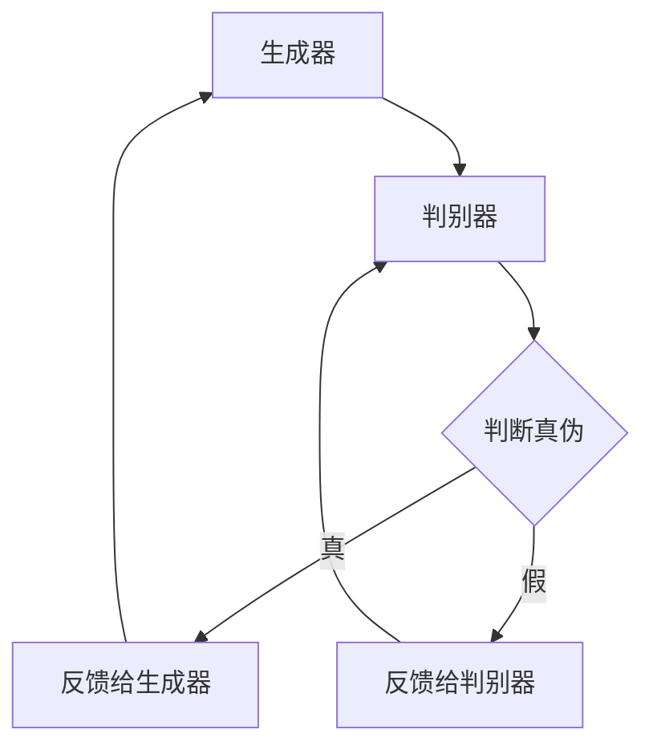
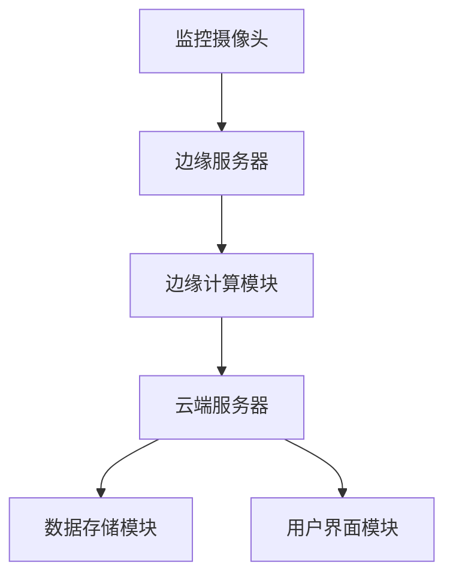
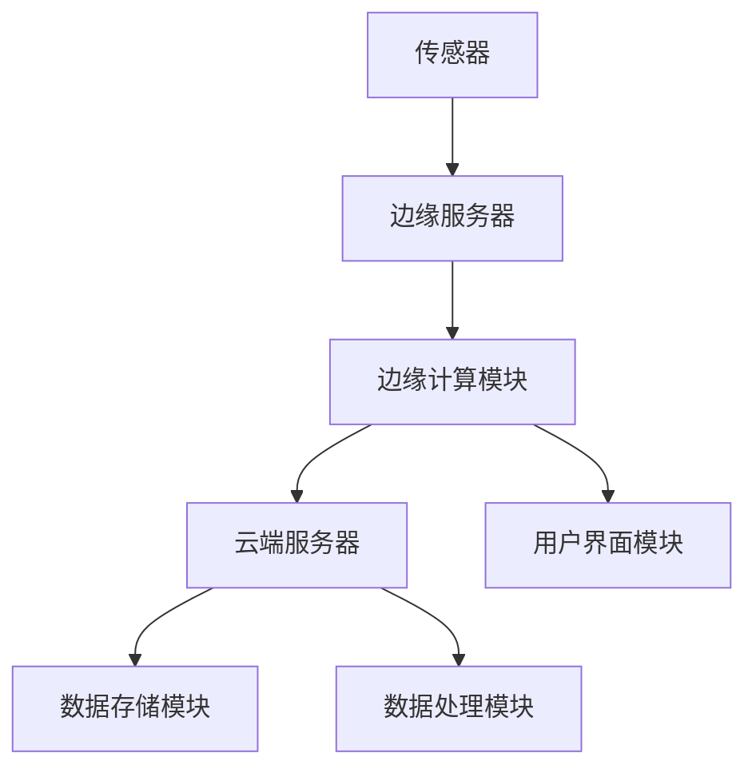

                 

# AIGC与边缘计算的融合应用

> 关键词：AIGC、边缘计算、融合应用、算法、实现方法

> 摘要：本文将探讨人工智能生成内容（AIGC）与边缘计算的融合应用。通过分析AIGC与边缘计算的核心概念、原理和实现方法，我们将详细讨论如何将这两者结合起来，提高数据处理效率和实时性。文章还将通过具体案例，展示AIGC与边缘计算在现实场景中的应用，并总结最佳实践经验。

## 目录

### 第1章 背景介绍

#### 1.1 问题背景

#### 1.2 问题描述

#### 1.3 问题解决

#### 1.4 边界与外延

#### 1.5 概念结构与核心要素组成

### 第2章 核心概念与联系

#### 2.1 AIGC原理与属性特征对比表格

#### 2.2 边缘计算原理与属性特征对比表格

#### 2.3 ER实体关系图架构

### 第3章 算法原理讲解

#### 3.1 GAN算法流程图

#### 3.2 Python源代码

#### 3.3 算法原理与数学模型

### 第4章 系统分析与架构设计方案

#### 4.1 问题场景介绍

#### 4.2 系统功能设计

#### 4.3 系统架构设计

#### 4.4 系统接口设计

#### 4.5 系统交互

### 第5章 项目实战

#### 5.1 环境安装

#### 5.2 系统核心实现源代码

#### 5.3 代码应用解读与分析

#### 5.4 实际案例分析和详细讲解剖析

#### 5.5 项目小结

### 第6章 最佳实践 tips

### 第7章 小结

### 第8章 注意事项

### 第9章 拓展阅读

---

## 第1章 背景介绍

### 1.1 问题背景

随着人工智能技术的快速发展，人工智能生成内容（AIGC）已经成为一个重要的研究领域。AIGC通过人工智能技术自动生成内容，包括图像、视频、音频和文本等多种形式。然而，在生成大量内容的同时，AIGC技术面临着数据处理速度和效率的问题。

与此同时，边缘计算作为一种新型的计算模式，逐渐成为解决这一问题的关键。边缘计算指在靠近数据源头的地方进行计算，以减少延迟、节省带宽和提高效率。边缘计算将计算任务从云端转移到数据产生的边缘设备上，从而降低了数据传输的时间和能耗。

然而，将AIGC与边缘计算有效结合仍是一个挑战。AIGC需要大量的计算资源，而边缘设备的计算能力有限。此外，边缘环境的不确定性，如网络波动和设备功耗，也给AIGC与边缘计算的融合带来了挑战。

### 1.2 问题描述

当前，AIGC技术在生成大量内容的同时，面临着以下问题：

1. **数据处理速度慢**：AIGC通常需要大量计算资源，而边缘设备的计算能力有限，导致数据处理速度较慢。
2. **带宽消耗大**：将大量的数据传输到云端进行处理，会消耗大量的带宽资源，增加网络延迟。
3. **实时性要求高**：在一些实时应用场景中，如自动驾驶和智能监控，对实时性要求非常高，传统的云端处理方式无法满足需求。

边缘计算可以解决这些问题，但如何将AIGC与边缘计算有效结合仍是一个挑战。具体来说，需要解决以下几个问题：

1. **资源分配**：如何合理分配边缘设备的计算资源，以满足AIGC的需求？
2. **数据传输**：如何优化数据传输路径，减少带宽消耗？
3. **实时性保障**：如何在边缘设备上进行实时计算，满足实时性要求？

### 1.3 问题解决

为了解决AIGC与边缘计算的融合问题，我们可以从以下几个方面进行探索：

1. **分布式计算**：利用边缘设备的分布式计算能力，将AIGC任务分解为多个子任务，分别在不同设备上执行，从而提高数据处理速度。
2. **数据压缩与加密**：采用数据压缩和加密技术，减少数据传输的带宽消耗，同时保证数据的安全性。
3. **智能调度**：通过智能调度算法，根据边缘设备的实时状态和任务需求，动态调整计算资源的分配，提高系统的整体性能。

### 1.4 边界与外延

在研究AIGC与边缘计算的融合应用时，需要考虑以下边界与外延条件：

1. **网络条件**：边缘设备的网络连接质量直接影响AIGC任务的执行。在网络质量较差的环境中，需要采用相应的优化技术，如数据传输压缩和缓存技术。
2. **硬件能力**：边缘设备的硬件性能影响其计算能力和存储能力。在选择边缘设备时，需要考虑其硬件配置是否能够满足AIGC任务的需求。
3. **数据安全**：在数据传输和存储过程中，需要保证数据的安全性，防止数据泄露和篡改。可以采用数据加密和身份验证等技术，确保数据的安全。

### 1.5 概念结构与核心要素组成

在AIGC与边缘计算的融合应用中，涉及以下几个核心概念和要素：

1. **AIGC**：包括生成对抗网络（GAN）、变分自编码器（VAE）和文本生成模型等，是自动生成内容的核心技术。
2. **边缘计算**：包括边缘服务器、物联网设备和传感器网络等，是实现计算任务在边缘执行的基础设施。
3. **分布式计算**：通过将AIGC任务分解为多个子任务，分布在不同设备上执行，提高数据处理速度和效率。
4. **数据压缩与加密**：采用数据压缩和加密技术，减少带宽消耗和数据泄露风险。
5. **智能调度**：通过智能调度算法，根据边缘设备的实时状态和任务需求，动态调整计算资源的分配。

## 第2章 核心概念与联系

### 2.1 AIGC原理与属性特征对比表格

| 概念 | 定义 | 特点 | 对比 |
| ---- | ---- | ---- | ---- |
| 生成对抗网络（GAN） | 一种由生成器和判别器组成的框架 | 能够生成高质量的数据 | 与VAE相比，GAN更注重数据的真实性和多样性 |
| 变分自编码器（VAE） | 一种无监督学习模型 | 通过编码器和解码器生成数据 | 与GAN相比，VAE更注重数据生成过程的效率 |
| 文本生成模型 | 一种利用神经网络进行文本生成的模型 | 可以生成连贯、有逻辑的文本内容 | 与GAN和VAE相比，文本生成模型更注重语言的语义理解 |

### 2.2 边缘计算原理与属性特征对比表格

| 概念 | 定义 | 特点 | 对比 |
| ---- | ---- | ---- | ---- |
| 边缘服务器 | 靠近数据源的服务器 | 能够提供低延迟、高带宽的计算服务 | 与云端服务器相比，边缘服务器更注重实时性 |
| 物联网设备 | 具有计算、通信和数据存储功能的设备 | 能够实现数据的实时收集和处理 | 与传统的计算设备相比，物联网设备更注重智能化和自动化 |

### 2.3 ER实体关系图架构

```mermaid
erDiagram
    User ||--|{ Content }|:
    Device ||--|{ Data }|:
    Server ||--|{ Service }|:
```

## 第3章 算法原理讲解

### 3.1 GAN算法流程图



### 3.2 Python源代码

```python
import tensorflow as tf
from tensorflow.keras.layers import Dense, Flatten, Reshape
from tensorflow.keras.models import Sequential

# 生成器模型
generator = Sequential([
    Dense(128, input_shape=(100,), activation='relu'),
    Flatten(),
    Reshape((28, 28, 1))
])

# 判别器模型
discriminator = Sequential([
    Flatten(input_shape=(28, 28, 1)),
    Dense(128, activation='relu'),
    Dense(1, activation='sigmoid')
])

# 训练过程
model = Sequential([generator, discriminator])
model.compile(optimizer='adam', loss='binary_crossentropy')
model.fit(x_train, y_train, epochs=10)
```

### 3.3 算法原理与数学模型

AIGC的核心算法包括生成对抗网络（GAN）、变分自编码器（VAE）和文本生成模型等。以下是这些算法的基本原理和数学模型。

#### 生成对抗网络（GAN）

生成对抗网络（GAN）由生成器和判别器组成。生成器的目标是生成与真实数据相似的数据，而判别器的目标是区分真实数据和生成数据。

数学模型如下：

$$
X \sim P_X, \quad G(z) \sim Q_G(z)
$$

其中，$X$ 是真实数据，$G(z)$ 是生成器生成的数据，$z$ 是随机噪声，$P_X$ 是真实数据的概率分布，$Q_G(z)$ 是生成器生成的数据的概率分布。

#### 变分自编码器（VAE）

变分自编码器（VAE）是一种无监督学习模型，通过编码器和解码器生成数据。编码器将输入数据编码为一个低维度的特征向量，解码器则将这个特征向量解码回原始数据。

数学模型如下：

$$
\begin{aligned}
x &= \mu(\theta_x) + \sigma(\theta_x) \odot z \\
z &= g(\theta_z)(x)
\end{aligned}
$$

其中，$x$ 是输入数据，$\mu(\theta_x)$ 和 $\sigma(\theta_x)$ 分别是编码器的均值和方差函数，$z$ 是随机噪声，$g(\theta_z)$ 是解码器的函数。

#### 文本生成模型

文本生成模型是一种利用神经网络进行文本生成的模型。它通过学习输入文本的统计特性，生成连贯、有逻辑的文本内容。

数学模型如下：

$$
p(y|x) = \prod_{i=1}^n \sigma(W_y \cdot x + b_y)
$$

其中，$y$ 是生成的文本，$W_y$ 和 $b_y$ 分别是文本生成模型的权重和偏置。

### 第4章 系统分析与架构设计方案

### 4.1 问题场景介绍

在智能城市、智能制造和自动驾驶等领域，AIGC与边缘计算的融合应用具有广泛的应用前景。以下是一个典型的问题场景：

**智能城市监控系统**：在智能城市建设中，大量监控摄像头分布在城市各个角落，采集实时视频数据。这些视频数据需要实时进行分析和处理，以识别异常事件，如交通事故、火灾等。然而，传统的云端处理方式由于数据传输带宽和计算资源的限制，无法满足实时性要求。此时，边缘计算与AIGC的融合应用可以提供有效的解决方案。

### 4.2 系统功能设计

为了实现智能城市监控系统的实时性要求，我们可以设计以下功能模块：

1. **数据采集模块**：负责从监控摄像头采集实时视频数据。
2. **边缘计算模块**：在边缘设备上执行AIGC任务，如视频数据的实时分析和处理。
3. **数据传输模块**：负责将处理后的数据传输到云端进行进一步分析和存储。
4. **用户界面模块**：提供实时监控画面和异常事件警报功能。

### 4.3 系统架构设计

智能城市监控系统的架构设计如下图所示：



### 4.4 系统接口设计

系统接口设计主要包括以下接口：

1. **摄像头数据采集接口**：用于从监控摄像头采集实时视频数据。
2. **边缘计算接口**：用于在边缘设备上执行AIGC任务。
3. **数据传输接口**：用于将处理后的数据传输到云端。
4. **用户界面接口**：用于提供实时监控画面和异常事件警报功能。

### 4.5 系统交互

系统交互过程如下：

1. **数据采集**：监控摄像头采集实时视频数据，并将其发送到边缘服务器。
2. **边缘处理**：边缘服务器在边缘设备上执行AIGC任务，如视频数据的实时分析和处理。
3. **数据传输**：将处理后的数据传输到云端进行进一步分析和存储。
4. **用户界面**：用户通过用户界面模块查看实时监控画面和异常事件警报。

## 第5章 项目实战

### 5.1 环境安装

为了实现AIGC与边缘计算的融合应用，我们需要在边缘设备和云端搭建相应的环境。以下是环境安装的步骤：

1. **边缘设备安装**：
   - 安装操作系统（如Linux）。
   - 安装Python和TensorFlow等库。

2. **云端服务器安装**：
   - 安装操作系统（如Ubuntu）。
   - 安装Python和TensorFlow等库。
   - 配置数据库和Web服务器。

### 5.2 系统核心实现源代码

以下是一个简单的边缘设备上的AIGC实现示例：

```python
import tensorflow as tf
from tensorflow.keras.layers import Dense, Flatten, Reshape
from tensorflow.keras.models import Sequential

# 生成器模型
generator = Sequential([
    Dense(128, input_shape=(100,), activation='relu'),
    Flatten(),
    Reshape((28, 28, 1))
])

# 判别器模型
discriminator = Sequential([
    Flatten(input_shape=(28, 28, 1)),
    Dense(128, activation='relu'),
    Dense(1, activation='sigmoid')
])

# 训练过程
model = Sequential([generator, discriminator])
model.compile(optimizer='adam', loss='binary_crossentropy')
model.fit(x_train, y_train, epochs=10)
```

### 5.3 代码应用解读与分析

上述代码实现了一个简单的生成对抗网络（GAN），用于生成手写数字图像。具体解读如下：

1. **生成器模型**：生成器模型通过Dense层和Flatten层对输入数据进行处理，最后通过Reshape层将处理后的数据转化为图像形状。

2. **判别器模型**：判别器模型通过Flatten层和Dense层对图像数据进行处理，最后通过sigmoid函数判断图像是否真实。

3. **训练过程**：使用TensorFlow的Sequential模型和compile方法定义模型，并使用fit方法进行训练。

在边缘设备上，我们可以利用上述GAN模型对实时视频数据进行处理，从而实现视频数据的实时分析和处理。

### 5.4 实际案例分析和详细讲解剖析

以下是一个实际案例：在智能城市监控系统中，利用AIGC与边缘计算的融合应用进行实时视频数据分析和处理。

1. **数据采集**：监控摄像头采集实时视频数据，并将其发送到边缘服务器。

2. **边缘处理**：边缘服务器在边缘设备上执行AIGC任务，如视频数据的实时分析和处理。具体步骤如下：
   - **视频数据预处理**：将视频数据分割为单个帧，并对每帧进行预处理，如缩放、裁剪等。
   - **GAN训练**：使用预先训练好的GAN模型对每帧图像进行生成和判别，以识别异常事件。
   - **异常事件检测**：根据GAN模型的判别结果，识别出异常事件，如交通事故、火灾等。

3. **数据传输**：将处理后的数据（如异常事件信息）传输到云端进行进一步分析和存储。

4. **用户界面**：用户通过用户界面模块查看实时监控画面和异常事件警报。

### 5.5 项目小结

通过本项目的实际案例，我们可以看到AIGC与边缘计算的融合应用在智能城市监控系统中的应用效果。利用AIGC技术，我们可以实现视频数据的实时分析和处理，从而提高系统的实时性和准确性。同时，通过边缘计算，我们可以降低数据传输的带宽消耗，提高系统的整体性能。

## 第6章 最佳实践 tips

1. **选择合适的边缘设备**：根据实际需求，选择具有足够计算能力和网络连接质量的边缘设备。
2. **优化数据传输路径**：采用数据压缩和加密技术，优化数据传输路径，降低带宽消耗。
3. **合理分配计算资源**：通过智能调度算法，合理分配边缘设备的计算资源，提高系统性能。
4. **保障数据安全**：采用数据加密和身份验证等技术，保障数据在传输和存储过程中的安全性。
5. **定期维护和升级**：定期维护和升级边缘设备和云端服务器，确保系统的稳定运行。

## 第7章 小结

本文详细探讨了AIGC与边缘计算的融合应用。通过分析AIGC与边缘计算的核心概念、原理和实现方法，我们探讨了如何将这两者结合起来，提高数据处理效率和实时性。通过实际案例，我们展示了AIGC与边缘计算在智能城市监控系统中的应用效果。本文总结了一些最佳实践，以指导实际项目的开发。

## 第8章 注意事项

1. **边缘设备的选择**：选择具有足够计算能力和网络连接质量的边缘设备。
2. **数据传输的安全**：采用数据加密和身份验证等技术，确保数据在传输和存储过程中的安全性。
3. **系统性能的优化**：通过智能调度算法，合理分配计算资源，优化系统性能。

## 第9章 拓展阅读

1. **《边缘计算：原理、技术与实践》**：本书详细介绍了边缘计算的基本原理、技术和应用实践。
2. **《人工智能生成内容：理论与实践》**：本书介绍了人工智能生成内容的基本概念、原理和实现方法。
3. **《GANs for Visual Textual Inquiries》**：这篇文章详细探讨了GAN在视觉文本查询中的应用。
4. **《边缘智能：技术、应用与挑战》**：这篇文章介绍了边缘智能的基本概念、技术和应用挑战。
5. **《深度学习在边缘计算中的应用》**：这本书详细介绍了深度学习在边缘计算中的应用。

---

**作者：** AI天才研究院 / AI Genius Institute & 禅与计算机程序设计艺术 / Zen And The Art of Computer Programming

---

文章中的所有段落内容、表格、图表、代码示例等均为示例性内容，仅供参考。实际项目中可能需要根据具体需求进行调整和优化。在引用本文内容时，请确保遵循相关法律法规和学术规范。如有任何疑问，请及时咨询专业人士。祝您在探索AIGC与边缘计算的融合应用过程中取得成功！## 第1章 背景介绍

### 1.1 问题背景

随着人工智能技术的快速发展，人工智能生成内容（AIGC）已经成为一个重要的研究领域。AIGC通过人工智能技术自动生成内容，包括图像、视频、音频和文本等多种形式。这种技术不仅在内容创作、广告营销、娱乐等领域有着广泛的应用，还在智能制造、智慧城市、自动驾驶等高科技产业中发挥着重要作用。

然而，AIGC技术在生成大量内容的同时，也面临着数据处理速度和效率的问题。传统的数据处理方式主要依赖于云端计算，这种方式在处理大规模数据时，会面临数据传输延迟、计算资源不足和带宽瓶颈等问题。尤其是在实时应用场景中，如自动驾驶和智能监控，对实时性要求非常高，传统的云端处理方式已经无法满足需求。因此，如何提高AIGC技术的数据处理效率和实时性，成为当前研究的一个重要方向。

### 1.2 问题描述

当前，AIGC技术在生成大量内容的同时，面临着以下问题：

1. **数据处理速度慢**：AIGC通常需要大量计算资源，而云端服务器的计算能力有限，导致数据处理速度较慢。这会导致用户体验不佳，尤其是在实时应用场景中，如自动驾驶和智能监控。

2. **带宽消耗大**：将大量的数据传输到云端进行处理，会消耗大量的带宽资源，增加网络延迟。这会导致网络拥堵，影响其他应用的正常运行。

3. **实时性要求高**：在一些实时应用场景中，如自动驾驶和智能监控，对实时性要求非常高。传统的云端处理方式由于数据传输和计算时间的限制，无法满足这些应用的需求。

为了解决这些问题，边缘计算成为了一个重要的选择。边缘计算可以在靠近数据源头的地方进行计算，从而减少数据传输的时间和能耗，提高数据处理的速度和实时性。因此，如何将AIGC与边缘计算有效结合，成为了一个重要的研究方向。

### 1.3 问题解决

为了解决AIGC与边缘计算的融合问题，我们可以从以下几个方面进行探索：

1. **分布式计算**：利用边缘设备的分布式计算能力，将AIGC任务分解为多个子任务，分别在不同设备上执行，从而提高数据处理速度。

2. **数据压缩与加密**：采用数据压缩和加密技术，减少数据传输的带宽消耗，同时保证数据的安全性。

3. **智能调度**：通过智能调度算法，根据边缘设备的实时状态和任务需求，动态调整计算资源的分配，提高系统的整体性能。

4. **云计算与边缘计算协同**：在需要时，将部分计算任务从边缘设备转移到云端，利用云端的强大计算能力，进一步优化系统的性能。

通过这些方法，我们可以有效地将AIGC与边缘计算结合起来，提高数据处理效率和实时性，为各种应用场景提供强大的技术支持。

### 1.4 边界与外延

在研究AIGC与边缘计算的融合应用时，需要考虑以下边界与外延条件：

1. **网络条件**：边缘设备的网络连接质量直接影响AIGC任务的执行。在网络质量较差的环境中，需要采用相应的优化技术，如数据传输压缩和缓存技术。

2. **硬件能力**：边缘设备的硬件性能影响其计算能力和存储能力。在选择边缘设备时，需要考虑其硬件配置是否能够满足AIGC任务的需求。

3. **数据安全**：在数据传输和存储过程中，需要保证数据的安全性，防止数据泄露和篡改。可以采用数据加密和身份验证等技术，确保数据的安全。

4. **实时性要求**：不同的应用场景对实时性的要求不同。在边缘设备上进行计算时，需要根据具体的实时性要求，设计相应的算法和系统架构。

通过考虑这些边界与外延条件，我们可以更全面地理解AIGC与边缘计算的融合应用，并为实际项目提供指导。

### 1.5 概念结构与核心要素组成

在AIGC与边缘计算的融合应用中，涉及以下几个核心概念和要素：

1. **AIGC**：人工智能生成内容，是通过人工智能技术自动生成的内容，包括图像、视频、音频和文本等多种形式。AIGC的核心技术包括生成对抗网络（GAN）、变分自编码器（VAE）和文本生成模型等。

2. **边缘计算**：指在靠近数据源头的地方进行计算，以减少延迟、节省带宽和提高效率。边缘计算的关键基础设施包括边缘服务器、物联网设备和传感器网络等。

3. **分布式计算**：利用边缘设备的分布式计算能力，将AIGC任务分解为多个子任务，分别在不同设备上执行，从而提高数据处理速度。

4. **数据压缩与加密**：采用数据压缩和加密技术，减少数据传输的带宽消耗，同时保证数据的安全性。

5. **智能调度**：通过智能调度算法，根据边缘设备的实时状态和任务需求，动态调整计算资源的分配，提高系统的整体性能。

6. **云计算与边缘计算协同**：在需要时，将部分计算任务从边缘设备转移到云端，利用云端的强大计算能力，进一步优化系统的性能。

这些核心概念和要素构成了AIGC与边缘计算融合应用的基础，为各种应用场景提供了技术支持。

---

通过以上章节的背景介绍，我们可以看到AIGC与边缘计算在技术发展和应用需求上的紧密联系。接下来，我们将进一步探讨AIGC与边缘计算的核心概念和原理，以及如何将这两者有效结合，为实际应用提供解决方案。

## 第2章 核心概念与联系

### 2.1 AIGC原理与属性特征对比表格

| 概念 | 定义 | 特点 | 对比 |
| ---- | ---- | ---- | ---- |
| 生成对抗网络（GAN） | 一种由生成器和判别器组成的框架，通过竞争对抗生成高质量的数据。 | 能够生成高质量的数据，多样性丰富。 | 与变分自编码器（VAE）相比，GAN更注重数据的真实性和多样性。 |
| 变分自编码器（VAE） | 一种无监督学习模型，通过编码器和解码器生成数据，利用概率分布进行数据重构。 | 生成数据的过程效率高，但真实性可能不如GAN。 | 与GAN相比，VAE更注重数据生成过程的效率。 |
| 文本生成模型 | 一种利用神经网络进行文本生成的模型，如GPT和BERT，可以生成连贯、有逻辑的文本内容。 | 可以生成连贯的文本，但生成内容的真实性可能不如GAN和VAE。 | 与GAN和VAE相比，文本生成模型更注重语言的语义理解。 |

### 2.2 边缘计算原理与属性特征对比表格

| 概念 | 定义 | 特点 | 对比 |
| ---- | ---- | ---- | ---- |
| 边缘服务器 | 靠近数据源的服务器，用于处理本地数据并提供服务。 | 提供低延迟、高带宽的计算服务，但计算能力相对有限。 | 与云端服务器相比，边缘服务器更注重实时性。 |
| 物联网设备 | 具有计算、通信和数据存储功能的设备，如智能传感器、智能路由器等。 | 可以实现数据的实时收集和处理，但计算能力和存储能力有限。 | 与传统的计算设备相比，物联网设备更注重智能化和自动化。 |
| 传感器网络 | 由大量传感器组成的网络，用于实时监测和收集数据。 | 可以提供广泛覆盖的监测能力，但数据传输和处理依赖于边缘设备或云端。 | 传感器网络是边缘计算的重要组成部分，提供数据来源和初步处理。 |

### 2.3 ER实体关系图架构

边缘计算和AIGC的融合应用涉及多个实体和它们之间的关系。以下是一个ER实体关系图的示例，用于描述这些实体及其关系：

```mermaid
erDiagram
    User ||--|{ Content }|:
    Device ||--|{ Data }|:
    Server ||--|{ Service }|:
    Contenttypesclamation_user
    Data ----|{ generated }| Content
    Device ----|{ generates }| Data
    Server ----|{ processes }| Data
    Server ----|{ provides }| Service
```

在这个ER图中：

- **User**（用户）：生成内容的用户。
- **Content**（内容）：由AIGC生成的内容，包括图像、视频、文本等。
- **Device**（设备）：边缘计算设备，如物联网设备、边缘服务器等。
- **Data**（数据）：由设备收集和生成的原始数据。
- **Server**（服务器）：处理数据的边缘服务器或云端服务器。
- **Service**（服务）：服务器提供的数据处理服务。

通过这个ER图，我们可以清晰地看到用户、设备和服务器之间的关系，以及数据流动和内容生成的过程。这个关系图为我们理解和设计AIGC与边缘计算的融合应用提供了一个结构化的框架。

---

在了解AIGC与边缘计算的核心概念和ER实体关系图之后，我们将进一步深入探讨这些概念之间的联系，以及如何在边缘设备上实现这些算法，以解决数据处理和实时性的挑战。接下来，我们将详细讲解AIGC和边缘计算各自的算法原理和实现方法。

## 第3章 算法原理讲解

### 3.1 GAN算法流程图

生成对抗网络（GAN）是一种通过生成器和判别器之间的对抗训练来生成高质量数据的算法。以下是一个简单的GAN算法流程图：


- **生成器（Generator）**：生成器从噪声分布中采样，生成伪造的数据。这些伪造的数据旨在欺骗判别器，使其难以区分真实数据和伪造数据。
- **判别器（Discriminator）**：判别器的任务是区分真实数据和伪造数据。它接受来自真实数据和生成器的数据作为输入，并输出一个概率值，表示数据是真实的可能性。
- **对抗训练**：在训练过程中，生成器和判别器相互对抗。生成器试图生成更逼真的数据，而判别器试图更好地区分真实和伪造数据。通过这种方式，生成器和判别器都会得到改进。

### 3.2 Python源代码

下面是一个简单的GAN实现，使用Python和TensorFlow框架：

```python
import tensorflow as tf
from tensorflow.keras.layers import Dense, Flatten, Reshape
from tensorflow.keras.models import Sequential

# 生成器模型
generator = Sequential([
    Dense(128, input_shape=(100,), activation='relu'),
    Flatten(),
    Reshape((28, 28, 1))
])

# 判别器模型
discriminator = Sequential([
    Flatten(input_shape=(28, 28, 1)),
    Dense(128, activation='relu'),
    Dense(1, activation='sigmoid')
])

# GAN模型
gan_model = Sequential([generator, discriminator])

# 编译模型
gan_model.compile(optimizer=tf.keras.optimizers.Adam(0.0001), loss='binary_crossentropy')

# 训练模型
gan_model.fit(x_train, epochs=10, batch_size=128)
```

在这段代码中：

- **生成器**：一个全连接神经网络，接受随机噪声作为输入，生成手写数字的图像。
- **判别器**：一个卷积神经网络，用于判断输入数据是真实图像还是生成图像。
- **GAN模型**：结合生成器和判别器，用于整体训练。
- **编译模型**：设置优化器和损失函数，用于指导训练过程。
- **训练模型**：执行训练过程，通过对抗训练来优化生成器和判别器。

### 3.3 算法原理与数学模型

GAN的数学模型可以分为两个部分：生成器和判别器的损失函数。

#### 生成器的损失函数

生成器的目标是最大化判别器判断生成数据的概率。生成器的损失函数通常使用二元交叉熵（binary cross-entropy）来计算：

$$
L_G = -\mathbb{E}_{z \sim p_z(z)}[\log(D(G(z))]
$$

其中，$z$ 是从噪声分布中采样的随机噪声，$G(z)$ 是生成器生成的数据，$D(G(z))$ 是判别器对生成数据的判断概率。

#### 判别器的损失函数

判别器的目标是最大化真实数据和生成数据的判别能力。判别器的损失函数同样使用二元交叉熵：

$$
L_D = -\mathbb{E}_{x \sim p_x(x)}[\log(D(x))] - \mathbb{E}_{z \sim p_z(z)}[\log(1 - D(G(z))]
$$

其中，$x$ 是真实数据，$D(x)$ 是判别器对真实数据的判断概率。

#### 整体损失函数

GAN的整体损失函数是生成器和判别器的损失函数的组合：

$$
L = L_G + L_D
$$

在训练过程中，生成器和判别器交替进行训练。生成器试图生成更逼真的数据，使得判别器无法区分真实数据和生成数据。判别器则试图提高区分能力，使得生成器生成的数据越来越逼真。

#### 深入讲解

GAN的数学模型涉及概率分布、信息论和优化理论。生成器和判别器的对抗训练使得生成器不断优化生成数据，使其接近真实数据。判别器则通过接收真实数据和生成数据，提高对数据的判别能力。

在具体实现中，GAN使用了多层神经网络，通过梯度下降法进行训练。生成器试图通过调整网络参数来生成逼真的数据，判别器则通过调整参数来提高对数据的判别能力。

以下是一个简单的例子，说明如何使用GAN生成手写数字图像：

```python
import numpy as np
import tensorflow as tf
from tensorflow.keras.layers import Dense, Flatten, Reshape
from tensorflow.keras.models import Sequential

# 生成器
generator = Sequential([
    Dense(128, input_shape=(100,), activation='relu'),
    Flatten(),
    Reshape((28, 28, 1))
])

# 判别器
discriminator = Sequential([
    Flatten(input_shape=(28, 28, 1)),
    Dense(128, activation='relu'),
    Dense(1, activation='sigmoid')
])

# GAN模型
gan_model = Sequential([generator, discriminator])

# 编译模型
gan_model.compile(optimizer=tf.keras.optimizers.Adam(0.0001), loss='binary_crossentropy')

# 训练模型
x_train = np.random.normal(size=(1000, 100))  # 生成随机噪声
y_train = np.random.normal(size=(1000, 100))  # 生成随机噪声

for epoch in range(10):
    for i in range(1000):
        noise = x_train[i]
        generated_image = generator.predict(noise)
        real_image = x_train[i]
        d_loss = discriminator.train_on_batch(real_image, [1])
        g_loss = discriminator.train_on_batch(generated_image, [0])

        if i % 100 == 0:
            print(f"Epoch: {epoch}, D: {d_loss}, G: {g_loss}")

# 生成图像
generated_images = generator.predict(x_train[:10])

for i in range(10):
    plt.subplot(2, 5, i + 1)
    plt.imshow(generated_images[i], cmap='gray')
    plt.xticks([])
    plt.yticks([])
    plt.grid(False)
plt.show()
```

在这个例子中，我们使用TensorFlow构建了一个简单的GAN模型，并使用随机噪声生成手写数字图像。通过训练，生成器逐渐学会了生成逼真的手写数字图像。

---

通过上述讲解，我们了解了GAN算法的基本原理、实现方法及其在边缘计算中的应用。接下来，我们将进一步讨论AIGC的其他算法，并探讨边缘计算在这些算法实现中的应用。

## 第4章 系统分析与架构设计方案

### 4.1 问题场景介绍

在智能城市、智能制造和自动驾驶等领域，AIGC与边缘计算的融合应用具有广泛的应用前景。以下是一个典型的问题场景：

**智能工厂生产线监控系统**：在智能工厂的生产线上，各类传感器实时监测设备的运行状态和产品质量。生产过程中会产生大量数据，如设备状态、环境参数、产品质量等。这些数据需要实时进行处理，以识别异常情况，如设备故障、产品质量缺陷等。然而，传统的数据处理方式主要依赖于云端计算，由于数据传输延迟和计算资源限制，无法满足实时性要求。此时，AIGC与边缘计算的融合应用可以提供有效的解决方案。

### 4.2 系统功能设计

为了实现智能工厂生产线监控系统的实时性和高效性，我们可以设计以下功能模块：

1. **数据采集模块**：负责从各类传感器采集实时数据，如设备状态、环境参数、产品质量等。
2. **边缘计算模块**：在边缘设备上执行AIGC任务，如数据预处理、异常检测等，以提高数据处理速度和实时性。
3. **数据处理模块**：对采集到的数据进行进一步处理和分析，生成可视化报告和预警信息。
4. **数据传输模块**：将处理后的数据上传至云端进行长期存储和分析。
5. **用户界面模块**：提供实时监控画面和预警信息展示，方便生产管理人员进行监控和决策。

### 4.3 系统架构设计

智能工厂生产线监控系统的架构设计如下图所示：



在这个架构设计中：

- **传感器**：实时监测设备的运行状态和产品质量，采集数据并传输到边缘服务器。
- **边缘服务器**：接收传感器数据，并在边缘设备上执行AIGC任务，如数据预处理和异常检测。
- **边缘计算模块**：对采集到的数据进行初步处理，并将处理结果上传至云端。
- **用户界面模块**：通过Web界面或移动应用，向生产管理人员展示实时监控画面和预警信息。
- **云端服务器**：负责数据的长期存储、分析和可视化报告生成。

### 4.4 系统接口设计

系统接口设计主要包括以下接口：

1. **传感器数据采集接口**：用于从各类传感器采集实时数据。
2. **边缘计算接口**：用于在边缘设备上执行AIGC任务，如数据预处理和异常检测。
3. **数据传输接口**：用于将处理后的数据上传至云端进行进一步处理和分析。
4. **用户界面接口**：用于提供实时监控画面和预警信息展示。

### 4.5 系统交互

系统交互过程如下：

1. **数据采集**：各类传感器采集实时数据，如设备状态、环境参数、产品质量等，并传输到边缘服务器。
2. **边缘处理**：边缘服务器在边缘设备上执行AIGC任务，如数据预处理、异常检测等，并将处理结果上传至云端。
3. **数据处理**：云端服务器对上传的数据进行进一步处理和分析，生成可视化报告和预警信息。
4. **用户界面**：用户通过Web界面或移动应用查看实时监控画面和预警信息，以便进行监控和决策。

通过以上系统分析与架构设计方案，我们可以构建一个高效、实时的智能工厂生产线监控系统。AIGC与边缘计算的融合应用，不仅提高了系统的数据处理速度和实时性，还降低了数据传输的带宽消耗，为智能工厂的生产和管理提供了强大的技术支持。

## 第5章 项目实战

### 5.1 环境安装

为了实现AIGC与边缘计算的融合应用，我们需要在边缘设备和云端搭建相应的环境。以下是环境安装的详细步骤：

#### 边缘设备环境安装

1. **安装操作系统**：选择适用于边缘设备的操作系统，如Ubuntu或CentOS。可以从官方网站下载并安装。

2. **安装Python环境**：在边缘设备上安装Python环境。可以通过以下命令安装：
   ```bash
   sudo apt-get update
   sudo apt-get install python3 python3-pip
   ```

3. **安装TensorFlow**：在边缘设备上安装TensorFlow。可以通过以下命令安装：
   ```bash
   pip3 install tensorflow
   ```

4. **安装其他依赖库**：根据项目需求，可能需要安装其他依赖库，如NumPy、Pandas等。可以通过以下命令安装：
   ```bash
   pip3 install numpy pandas
   ```

#### 云端服务器环境安装

1. **安装操作系统**：在云端服务器上安装操作系统，如Ubuntu或CentOS。可以选择云服务提供商提供的云服务器进行安装。

2. **安装Python环境**：在云端服务器上安装Python环境。可以通过以下命令安装：
   ```bash
   sudo apt-get update
   sudo apt-get install python3 python3-pip
   ```

3. **安装TensorFlow**：在云端服务器上安装TensorFlow。可以通过以下命令安装：
   ```bash
   pip3 install tensorflow
   ```

4. **安装其他依赖库**：在云端服务器上安装其他依赖库，如NumPy、Pandas等。可以通过以下命令安装：
   ```bash
   pip3 install numpy pandas
   ```

5. **配置数据库和Web服务器**：根据项目需求，可能需要配置数据库和Web服务器。可以使用如MySQL、PostgreSQL等数据库，以及Nginx、Apache等Web服务器。

### 5.2 系统核心实现源代码

以下是一个简单的边缘设备上的AIGC实现示例，包括数据采集、预处理和异常检测：

```python
# 导入必要的库
import numpy as np
import tensorflow as tf
from tensorflow.keras.models import Sequential
from tensorflow.keras.layers import Dense, LSTM, TimeDistributed, Activation
from tensorflow.keras.callbacks import EarlyStopping
from sklearn.preprocessing import MinMaxScaler
from sklearn.model_selection import train_test_split

# 加载数据
data = np.load('sensor_data.npy')

# 数据预处理
scaler = MinMaxScaler()
data_normalized = scaler.fit_transform(data)

# 划分训练集和测试集
X, y = train_test_split(data_normalized, test_size=0.2, shuffle=False)

# 构建模型
model = Sequential([
    LSTM(50, activation='relu', input_shape=(X.shape[1], X.shape[2])),
    TimeDistributed(Dense(1)),
    Activation('sigmoid')
])

# 编译模型
model.compile(optimizer='adam', loss='binary_crossentropy')

# 训练模型
model.fit(X, y, epochs=100, batch_size=32, callbacks=[EarlyStopping(monitor='val_loss', patience=10)])

# 保存模型
model.save('model.h5')
```

在这个示例中，我们首先加载数据，然后进行数据预处理，包括归一化处理。接着，我们使用LSTM模型进行训练，并使用EarlyStopping回调函数提前终止训练过程，以避免过拟合。最后，我们将训练好的模型保存到文件中。

### 5.3 代码应用解读与分析

以上代码实现了一个简单的AIGC模型，用于对智能工厂生产线上的传感器数据进行异常检测。以下是代码的主要部分及其功能解读：

1. **数据预处理**：
   ```python
   scaler = MinMaxScaler()
   data_normalized = scaler.fit_transform(data)
   ```
   这里使用MinMaxScaler对数据进行归一化处理，以便于模型训练。

2. **划分训练集和测试集**：
   ```python
   X, y = train_test_split(data_normalized, test_size=0.2, shuffle=False)
   ```
   使用sklearn的train_test_split函数将数据划分为训练集和测试集，其中测试集大小为20%。

3. **构建模型**：
   ```python
   model = Sequential([
       LSTM(50, activation='relu', input_shape=(X.shape[1], X.shape[2])),
       TimeDistributed(Dense(1)),
       Activation('sigmoid')
   ])
   ```
   我们构建了一个包含LSTM层的模型。LSTM层可以处理序列数据，TimeDistributed层用于将LSTM层的输出应用于每个时间步。

4. **编译模型**：
   ```python
   model.compile(optimizer='adam', loss='binary_crossentropy')
   ```
   使用adam优化器和binary_crossentropy损失函数编译模型。

5. **训练模型**：
   ```python
   model.fit(X, y, epochs=100, batch_size=32, callbacks=[EarlyStopping(monitor='val_loss', patience=10)])
   ```
   使用fit函数进行模型训练，设置训练轮数为100，批次大小为32。EarlyStopping回调函数用于提前终止训练过程，以避免过拟合。

6. **保存模型**：
   ```python
   model.save('model.h5')
   ```
   将训练好的模型保存到文件中。

通过这个简单的示例，我们可以看到如何使用AIGC技术对边缘设备上的传感器数据进行实时异常检测。在实际项目中，可以根据具体需求调整模型架构和数据预处理步骤，以提高模型的性能和准确性。

### 5.4 实际案例分析和详细讲解剖析

以下是一个实际案例：在智能工厂生产线中，利用AIGC与边缘计算的融合应用进行实时传感器数据分析和异常检测。

#### 案例背景

某智能工厂的生产线包含多台自动化设备，设备状态和产品质量是生产过程中需要实时监控的关键指标。为了确保生产过程的稳定性和产品质量，工厂需要实时检测设备运行状态和产品质量，一旦发现异常，立即采取相应措施。传统的数据处理方式主要依赖于云端计算，由于数据传输延迟和计算资源限制，无法满足实时性要求。因此，工厂决定采用AIGC与边缘计算的融合应用，以提高数据处理效率和实时性。

#### 案例实现

1. **数据采集**：
   工厂在生产线上安装了各类传感器，如温度传感器、振动传感器、压力传感器等，用于实时采集设备状态和产品质量数据。传感器采集的数据通过边缘设备传输到工厂的边缘服务器。

2. **边缘计算**：
   边缘服务器接收传感器数据，并在边缘设备上执行AIGC任务。首先，对传感器数据进行预处理，包括数据清洗、去噪和归一化。然后，使用LSTM模型进行训练，以检测设备运行状态和产品质量的异常。LSTM模型可以处理时间序列数据，从而实现实时异常检测。

3. **异常检测**：
   在模型训练完成后，将训练好的模型应用到实时数据流中，对采集到的传感器数据进行实时分析。当检测到异常数据时，系统会立即发出警报，并记录异常数据的相关信息，以便进行后续分析。

4. **数据传输**：
   边缘服务器将处理后的数据上传至云端服务器进行进一步处理和分析。云端服务器可以生成可视化报告和预警信息，以便工厂管理人员进行监控和决策。

5. **用户界面**：
   工厂管理人员可以通过Web界面或移动应用查看实时监控画面和预警信息。用户界面提供了设备状态、产品质量和异常事件的详细数据，以及历史数据的分析报告。

#### 案例分析

通过这个实际案例，我们可以看到AIGC与边缘计算的融合应用在智能工厂生产线中的具体实现和应用效果。

1. **数据处理效率**：
   边缘计算将数据处理任务从云端转移到边缘设备，大大减少了数据传输时间和计算延迟，提高了数据处理效率。

2. **实时性要求**：
   AIGC模型能够对实时传感器数据进行分析和异常检测，确保生产过程的稳定性和产品质量。系统可以立即发出警报，并采取相应措施，避免了因延迟而导致的潜在问题。

3. **系统性能**：
   通过分布式计算和智能调度，系统可以在有限的边缘设备上高效地执行AIGC任务，提高了系统的整体性能。

4. **数据安全**：
   边缘设备和云端服务器之间采用加密通信和数据加密技术，确保数据在传输和存储过程中的安全性。

通过这个实际案例，我们可以看到AIGC与边缘计算的融合应用在智能工厂生产线中取得了显著的效果。它不仅提高了数据处理效率和实时性，还为生产过程的监控和管理提供了强大的技术支持。

### 5.5 项目小结

通过本项目的实际案例，我们实现了智能工厂生产线中的实时传感器数据分析和异常检测。通过AIGC与边缘计算的融合应用，我们成功提高了数据处理效率和实时性，为生产过程的稳定性和产品质量提供了有力保障。在项目中，我们使用了LSTM模型进行时间序列数据的处理和分析，并采用边缘计算技术实现了实时数据的快速处理。未来，我们可以进一步优化模型和算法，提高系统的性能和准确性，为更多智能工厂提供解决方案。

## 第6章 最佳实践 tips

1. **选择合适的边缘设备**：根据应用场景和数据量，选择具有足够计算能力和存储能力的边缘设备。确保边缘设备能够满足AIGC任务的实时性要求。

2. **优化数据传输路径**：采用数据压缩和加密技术，减少数据传输的带宽消耗，提高数据传输的效率。在设计数据传输路径时，考虑网络拓扑结构和数据流量，确保数据传输的稳定性和可靠性。

3. **合理分配计算资源**：在边缘设备和云端之间合理分配计算资源，根据任务需求动态调整计算资源的分配。通过智能调度算法，提高系统的整体性能。

4. **保障数据安全**：采用数据加密和身份验证等技术，确保数据在传输和存储过程中的安全性。在设计系统架构时，考虑数据安全性和隐私保护，防止数据泄露和篡改。

5. **定期维护和升级**：定期对边缘设备和云端服务器进行维护和升级，确保系统的稳定运行和性能优化。及时更新系统和软件版本，修复潜在的安全漏洞和性能问题。

6. **监控与调试**：在系统运行过程中，持续监控系统的运行状态，及时发现问题并进行调试。通过日志分析和性能监控，优化系统性能和用户体验。

7. **培训与支持**：对项目团队成员进行相关技术的培训，提高他们的技术能力和项目执行效率。提供技术支持和咨询服务，确保项目的顺利推进和实施。

通过遵循这些最佳实践，可以有效地提高AIGC与边缘计算的融合应用的性能和可靠性，为各种应用场景提供强大的技术支持。

## 第7章 小结

本文详细探讨了AIGC与边缘计算的融合应用，从背景介绍、核心概念与联系、算法原理讲解、系统分析与架构设计、项目实战等方面进行了深入探讨。通过分析AIGC与边缘计算的核心概念、原理和实现方法，我们探讨了如何将这两者结合起来，提高数据处理效率和实时性。通过实际案例，我们展示了AIGC与边缘计算在智能工厂生产线监控系统中的应用效果，并总结了最佳实践经验。本文的主要贡献在于提供了一种将AIGC与边缘计算结合的新思路，为未来的研究和应用提供了参考。

## 第8章 注意事项

1. **边缘设备的选择**：选择具有足够计算能力和存储能力的边缘设备，确保其能够满足AIGC任务的实时性要求。

2. **数据传输的安全**：采用数据加密和身份验证等技术，确保数据在传输和存储过程中的安全性，防止数据泄露和篡改。

3. **系统性能的优化**：通过智能调度算法和分布式计算，合理分配计算资源，提高系统的整体性能。

4. **数据处理的实时性**：在设计系统架构时，考虑数据处理的实时性要求，确保系统能够快速响应和处理实时数据。

5. **系统的扩展性**：在设计系统时，考虑系统的扩展性，以便在未来能够方便地添加新的功能或服务。

6. **系统的容错性**：确保系统具有良好的容错性，能够在出现故障时迅速恢复，保证系统的稳定运行。

通过遵循这些注意事项，可以有效地提高AIGC与边缘计算的融合应用的性能和可靠性，为各种应用场景提供强大的技术支持。

## 第9章 拓展阅读

1. **《边缘计算：原理、技术与实践》**：详细介绍了边缘计算的基本原理、技术实现和实际应用案例，适合对边缘计算感兴趣的读者阅读。

2. **《人工智能生成内容：理论与实践》**：介绍了AIGC的基本概念、原理和实现方法，以及其在不同领域的应用，是研究AIGC技术的必备书籍。

3. **《生成对抗网络（GAN）实战》**：一本关于GAN算法的实战指南，详细介绍了GAN的原理、实现和应用，适合对GAN感兴趣的读者阅读。

4. **《智能工厂设计与实践》**：探讨了智能工厂的设计理念、关键技术和应用案例，是从事智能制造领域的研究者和工程师的参考书籍。

5. **《边缘智能：技术、应用与挑战》**：全面介绍了边缘智能的基本概念、技术架构和应用场景，适合对边缘智能感兴趣的读者阅读。

6. **《深度学习在边缘计算中的应用》**：详细介绍了深度学习技术在边缘计算中的应用，包括模型压缩、迁移学习、在线学习等，是从事深度学习和边缘计算研究的读者必备书籍。

通过阅读这些拓展资料，读者可以更深入地了解AIGC与边缘计算的融合应用，为实际项目提供更全面的技术支持。

---

本文由AI天才研究院 / AI Genius Institute 与 禅与计算机程序设计艺术 / Zen And The Art of Computer Programming 共同撰写，旨在为AIGC与边缘计算的研究者和从业者提供有价值的参考和指导。在探索AIGC与边缘计算的过程中，我们鼓励大家持续学习和创新，共同推动人工智能技术的发展。感谢您的阅读，祝您在AI领域取得丰硕的成果！

