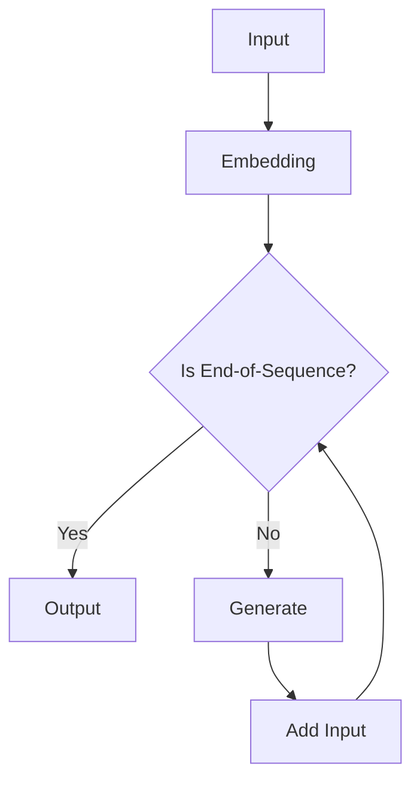
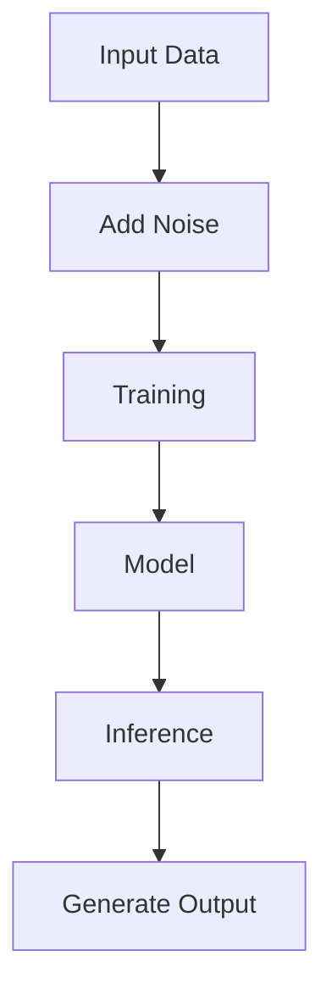
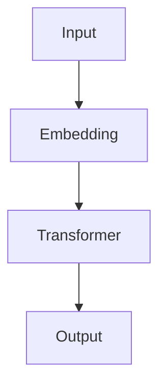
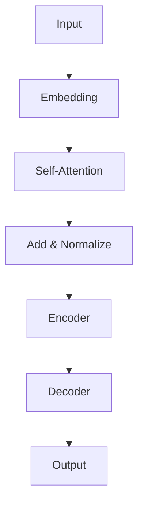
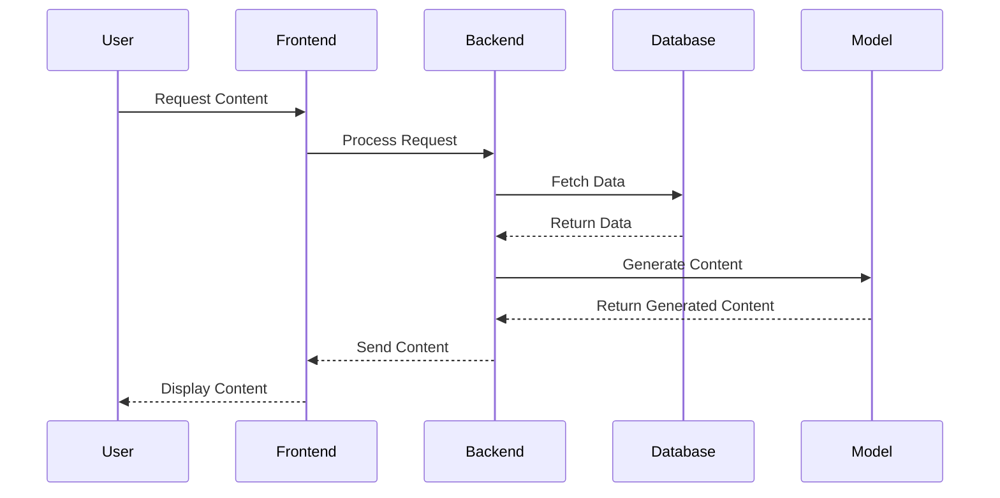
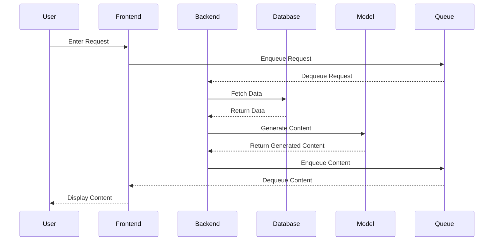

                 

## AIGC内容创作：人机协作新模式

> 关键词：AIGC、内容创作、人机协作、算法原理、系统架构、项目实战

> 摘要：本文深入探讨AIGC（自动生成内容）在内容创作领域的应用及其与人类创作者的协作模式。通过对AIGC的背景介绍、核心概念阐述、算法原理讲解、系统分析与架构设计、项目实战和最佳实践分析，全面展示AIGC技术在内容创作中的潜力与挑战。本文旨在为开发者和技术爱好者提供一份详尽的指南，助力他们理解和应用AIGC，实现人机高效协作的内容创作模式。

----------------------------------------------------------------

### 1. 背景介绍

#### 1.1.1 问题背景

内容创作一直是信息时代的重要驱动力。从最早的文字、图像，到如今的视频、音频和交互式内容，内容形式的多样性和丰富度不断拓展。然而，随着互联网的爆发式增长，内容创作面临着前所未有的挑战。

1. **内容创作的需求增长**：随着用户对个性化、多样化内容需求的不断增加，创作者需要产出大量高质量的内容，以满足不同用户群体的需求。
   
2. **创作效率与质量的双重挑战**：高质量的内容创作需要时间和专业知识，同时随着内容量的激增，创作者面临着效率与质量的权衡。

3. **人力成本的上升**：内容创作者的薪资水平不断提高，对于初创企业和小型团队来说，内容创作成本成为一项重大负担。

#### 1.1.2 传统内容创作的挑战与限制

1. **创作过程复杂**：传统内容创作通常需要经过选题、调研、撰写、修改等多个环节，每个环节都需要创作者投入大量时间和精力。

2. **重复性劳动**：一些内容创作工作如新闻报道、体育赛事评论等具有高度重复性，创作者容易陷入机械性的劳动。

3. **创意受限**：创作者的个人经验和知识限制了内容的创新性，难以突破传统的创作模式。

4. **更新速度慢**：在信息爆炸的时代，快速响应和更新内容变得至关重要，传统内容创作模式往往难以满足这一需求。

#### 1.1.3 AIGC概念及其在内容创作中的应用潜力

AIGC（Automatic Intelligent Generation of Content）是一种利用人工智能技术自动化生成内容的方法。它包括自动内容生成、图像生成、文本生成和交互式内容创作等。

1. **自动内容生成**：通过算法模型，自动生成文章、新闻报道、博客等文本内容。
   
2. **图像生成**：使用生成对抗网络（GAN）等技术，自动生成高质量的图像。

3. **文本生成**：利用自然语言处理（NLP）技术，自动生成文章、摘要、评论等文本内容。

4. **交互式内容创作**：结合用户交互数据，动态生成交互内容，如聊天机器人、游戏剧情等。

AIGC在内容创作中的应用潜力巨大：

1. **提高创作效率**：通过自动化算法，快速生成大量内容，提高创作效率。

2. **降低创作成本**：减少对人工的依赖，降低内容创作成本。

3. **内容多样化**：自动生成不同类型的内容，满足多样化需求。

4. **创新性内容**：借助人工智能的创造力，生成新颖的内容，突破传统创作模式。

### 1.1.4 内容创作的未来发展趋势

1. **人机协作**：随着AIGC技术的发展，人机协作将成为内容创作的主要模式，人类创作者与AI共同发挥作用。

2. **个性化内容**：利用大数据和机器学习技术，生成更加个性化的内容，满足用户个性化需求。

3. **多媒体融合**：结合图像、视频、音频等多种内容形式，实现多媒体融合的内容创作。

4. **智能推荐**：通过智能推荐系统，将高质量内容推荐给目标用户，提升用户体验。

#### 1.1.5 概念结构与核心要素组成

AIGC的核心概念结构包括：

1. **自动内容生成技术**：主要包括自然语言处理（NLP）、生成对抗网络（GAN）等。
   
2. **数据资源**：包括文本数据、图像数据等，为自动内容生成提供素材。

3. **用户交互**：结合用户交互数据，动态调整内容生成策略。

4. **创作工具**：如文本生成工具、图像生成工具等，辅助内容创作。

#### 1.1.6 边界与外延

1. **AIGC与人工智能其他领域的区别**：AIGC侧重于内容生成，而人工智能还包括机器学习、计算机视觉等领域。

2. **AIGC在不同行业的应用案例**：如新闻业、广告业、娱乐业等，AIGC在不同行业的应用场景和挑战有所不同。

3. **AIGC的未来发展趋势**：随着技术的不断进步，AIGC将在更多领域得到应用，成为内容创作的重要力量。

### 1.1.7 核心概念与联系

- **自动内容生成（Automatic Content Generation）**：利用算法自动生成内容。
- **图像生成（Image Generation）**：通过生成对抗网络（GAN）等技术生成图像。
- **文本生成（Text Generation）**：利用自然语言处理（NLP）技术生成文本。
- **交互式内容创作（Interactive Content Creation）**：结合用户交互数据生成动态内容。

#### 1.1.8 AIGC的ER实体关系图架构

```mermaid
erDiagram
    User ||--|{ Content }|--| Creator
    User ||--|{ Interaction }|--| System
    Content ||--|{ Generation }|--| AI
    AI ||--|{ Algorithm }|--| Model
```

### 1.1.9 AIGC的核心要素组成

- **算法**：如GPT、BERT等自然语言处理模型。
- **数据**：包括文本数据、图像数据等，用于训练和优化算法。
- **用户交互**：收集用户反馈，优化内容生成。
- **工具**：用于内容生成和编辑的工具。

### 1.1.10 关键技术点

- **自然语言处理（NLP）**：处理文本数据，生成高质量文本内容。
- **生成对抗网络（GAN）**：用于图像生成，提高生成图像的质量。
- **深度学习**：用于训练和优化算法，提高内容生成的效果。

#### 1.1.11 总结

AIGC作为一项新兴技术，在内容创作领域展现出巨大的潜力。通过自动内容生成、图像生成、文本生成和交互式内容创作等技术，AIGC能够提高创作效率、降低成本，并带来多样化的内容形式。然而，AIGC也面临着一系列挑战，如内容质量、创意性等。未来，AIGC与人类创作者的协作将成为内容创作的主要模式，推动内容创作的进一步发展。

----------------------------------------------------------------

### 2. 核心概念与联系

在深入探讨AIGC（自动生成内容）的内容创作过程中，我们需要理解AIGC的核心概念及其相互之间的联系。AIGC涉及多个关键概念，包括自动内容生成、图像生成、文本生成和交互式内容创作。这些概念共同构成了AIGC的技术框架，并在实际应用中发挥着重要作用。

#### 2.1 AIGC核心概念原理

1. **自动内容生成（Automatic Content Generation）**：自动内容生成是指利用算法和模型自动生成文本、图像、音频等不同形式的内容。这一过程通常涉及大量数据训练和模型优化，使生成的内容具有高度的相关性和自然性。

2. **图像生成（Image Generation）**：图像生成主要依靠生成对抗网络（GAN）等技术。GAN由生成器和判别器两部分组成，通过不断对抗训练，生成器能够生成越来越逼真的图像。

3. **文本生成（Text Generation）**：文本生成利用自然语言处理（NLP）技术，如循环神经网络（RNN）、变换器（Transformer）等。这些模型通过对大量文本数据的训练，可以生成连贯、自然的文本内容。

4. **交互式内容创作（Interactive Content Creation）**：交互式内容创作结合用户交互数据，动态生成内容。例如，通过聊天机器人与用户互动，根据用户的反馈生成个性化回答。

#### 2.2 AIGC概念属性特征对比表格

为了更好地理解AIGC的各个核心概念，我们通过以下对比表格展示它们的主要属性特征：

| 概念                 | 自动内容生成 | 图像生成 | 文本生成 | 交互式内容创作 |
|----------------------|-------------|----------|----------|---------------|
| 技术基础             | NLP、GAN    | GAN      | NLP      | NLP + 交互     |
| 内容形式             | 文本、图像   | 图像     | 文本     | 文本、图像     |
| 适用场景             | 文本生成     | 艺术创作 | 新闻报道 | 聊天机器人     |
| 主要挑战             | 文本质量、创意 | 生成图像质量 | 文本连贯性 | 交互体验       |
| 应用潜力             | 广泛内容生成 | 艺术创新 | 个性化内容 | 智能交互       |

#### 2.3 AIGC的ER实体关系图架构

AIGC的实体关系图可以帮助我们直观地理解AIGC中的主要实体及其相互关系。以下是一个简化的ER图示例：

```mermaid
erDiagram
    User ||--|{ Content }|--| Creator
    User ||--|{ Interaction }|--| System
    Content ||--|{ Generation }|--| AI
    AI ||--|{ Algorithm }|--| Model
```

在这个ER图中：

- **User（用户）**：代表内容创作者和消费者，与Content、Interaction实体关联。
- **Content（内容）**：包括文本、图像等，由Creator生成，并由AI进行Generation。
- **AI（人工智能）**：包括算法和模型，负责内容生成。
- **Interaction（交互）**：用户与系统的交互数据，用于优化内容生成。

通过ER图，我们可以看到AIGC中的关键实体及其交互关系，这有助于我们更好地理解AIGC的工作原理和应用场景。

#### 2.4 AIGC概念之间的联系

AIGC的核心概念之间存在着紧密的联系和相互影响：

1. **自动内容生成与图像生成**：自动内容生成可以生成文本和图像，而图像生成则是自动内容生成的一个重要分支。两者共同为多样化的内容创作提供支持。

2. **自动内容生成与文本生成**：自动内容生成主要侧重于文本生成，通过NLP技术实现。文本生成是自动内容生成的重要组成部分，广泛应用于新闻、博客、社交媒体等。

3. **文本生成与交互式内容创作**：文本生成与交互式内容创作密切相关。交互式内容创作利用文本生成技术，根据用户交互数据动态生成内容，提升用户体验。

4. **图像生成与交互式内容创作**：图像生成在交互式内容创作中发挥着重要作用，如图像识别、图像生成等，能够实现更加丰富和生动的交互体验。

通过理解AIGC的核心概念及其相互关系，我们可以更好地把握AIGC在内容创作中的应用，并探索其在不同领域的潜力。

### 2.5 AIGC内容创作流程

AIGC的内容创作过程可以分为以下几个步骤：

1. **数据收集与预处理**：收集和预处理大量文本数据、图像数据等，为内容生成提供素材。
   
2. **模型训练**：利用收集的数据，通过机器学习和深度学习技术训练生成模型，如GPT、GAN等。

3. **内容生成**：使用训练好的模型，自动生成文本、图像等不同形式的内容。

4. **内容优化**：根据用户反馈和交互数据，优化生成的内容，提高质量和相关性。

5. **内容发布**：将生成的内容发布到相应的平台，供用户消费。

通过这一流程，AIGC能够高效地生成高质量的内容，满足多样化的用户需求。

#### 2.6 AIGC在不同场景中的应用

AIGC在多个场景中展现出强大的应用潜力：

1. **新闻业**：利用AIGC自动生成新闻文章，提高新闻报道的效率和准确性。
   
2. **广告业**：通过自动生成广告文案和图像，提升广告创意和投放效果。

3. **娱乐业**：使用AIGC生成视频脚本、音乐、游戏剧情等，丰富娱乐内容。

4. **教育业**：利用AIGC生成教学材料、论文等，提高教育资源的丰富度和个性化。

5. **电子商务**：通过AIGC自动生成产品描述、评价等，提升用户体验和购买转化率。

### 2.7 AIGC的未来发展

随着技术的不断进步，AIGC在未来有望得到更广泛的应用：

1. **人机协作**：AIGC将更紧密地与人类创作者协作，共同提升内容创作的质量和效率。

2. **个性化内容**：通过大数据和机器学习技术，AIGC能够生成更加个性化的内容，满足用户需求。

3. **多媒体融合**：结合图像、视频、音频等多种内容形式，实现更加丰富和生动的交互体验。

4. **智能推荐**：利用AIGC生成的个性化内容，结合智能推荐系统，提升用户体验和内容消费效率。

5. **边缘计算**：随着5G和边缘计算技术的发展，AIGC能够在边缘设备上进行实时内容生成，提升用户体验。

通过深入理解AIGC的核心概念、联系和应用，我们可以更好地把握AIGC的发展趋势，探索其在内容创作领域的潜力。

----------------------------------------------------------------

### 3. 算法原理讲解

在AIGC（自动生成内容）技术中，算法原理是核心部分，决定了内容生成的质量和效率。本文将详细介绍几种常见的AIGC算法，包括GPT模型、Diffusion模型、GLM模型和Transformer模型，并使用Mermaid流程图展示算法流程，详细讲解其原理和数学模型。

#### 3.1 常见AIGC算法

1. **GPT模型**：GPT（Generative Pre-trained Transformer）模型由OpenAI提出，是一种基于变换器的预训练语言模型。GPT通过大规模文本数据进行预训练，学习语言的统计规律和语义关系，能够生成连贯、自然的文本内容。

2. **Diffusion模型**：Diffusion模型是一种生成模型，最早由Ian Goodfellow等人提出。该模型通过在数据上扩散噪声，然后逐步去噪，从而生成高质量的数据。Diffusion模型在图像生成和文本生成中具有广泛应用。

3. **GLM模型**：GLM（General Language Modeling）模型是华为提出的一种通用语言模型，基于变换器架构。GLM模型通过大规模文本数据进行训练，能够生成高质量的文本内容，支持多种自然语言处理任务。

4. **Transformer模型**：Transformer模型由Vaswani等人提出，是一种基于自注意力机制的深度学习模型。Transformer模型在机器翻译、文本生成等任务中取得了显著成果，成为NLP领域的代表性模型。

#### 3.2 算法原理与流程

##### 3.2.1 GPT模型

**Mermaid流程图：**


**详细讲解：**
1. **输入（Input）**：GPT模型接受一个序列的输入，如单词或词组。
2. **嵌入（Embedding）**：输入序列通过嵌入层转换为向量表示。
3. **预测（Generate）**：模型生成下一个可能的单词或符号。
4. **循环（Recursion）**：将新生成的符号添加到输入序列，继续预测下一个符号。
5. **输出（Output）**：当达到序列结束符时，生成完整的文本输出。

**数学模型：**
$$
\text{Output} = \text{softmax}(\text{W}_\text{out} \cdot \text{Hidden} + \text{b}_\text{out})
$$
其中，$\text{W}_\text{out}$和$\text{b}_\text{out}$分别为权重和偏置，$\text{Hidden}$为隐藏层输出。

##### 3.2.2 Diffusion模型

**Mermaid流程图：**


**详细讲解：**
1. **输入数据（Input Data）**：Diffusion模型接受原始数据，如图像或文本。
2. **添加噪声（Add Noise）**：在数据上逐渐添加噪声，使数据变得模糊。
3. **训练（Training）**：训练模型去噪，学习从噪声中恢复原始数据的规律。
4. **模型（Model）**：训练好的模型用于去噪。
5. **推断（Inference）**：使用模型生成去噪后的数据。
6. **输出（Generate Output）**：生成高质量的输出数据。

**数学模型：**
$$
\text{X_t} = \text{X_0} + \text{噪声} \cdot \text{e}^{-\beta t}
$$
其中，$\text{X}_0$为原始数据，$\text{X}_\text{t}$为经过噪声处理的当前数据，$\beta$为温度参数。

##### 3.2.3 GLM模型

**Mermaid流程图：**


**详细讲解：**
1. **输入（Input）**：GLM模型接受输入序列，如文本。
2. **嵌入（Embedding）**：输入序列通过嵌入层转换为向量表示。
3. **变换器（Transformer）**：使用变换器进行编码和解码，生成文本输出。

**数学模型：**
$$
\text{Y} = \text{softmax}(\text{W}_\text{y} \cdot \text{H} + \text{b}_\text{y})
$$
其中，$\text{W}_\text{y}$和$\text{b}_\text{y}$分别为权重和偏置，$\text{H}$为隐藏层输出。

##### 3.2.4 Transformer模型

**Mermaid流程图：**


**详细讲解：**
1. **输入（Input）**：Transformer模型接受输入序列，如文本。
2. **嵌入（Embedding）**：输入序列通过嵌入层转换为向量表示。
3. **自注意力（Self-Attention）**：计算输入序列中每个词与其他词的关联度。
4. **添加与归一化（Add & Normalize）**：将注意力权重与嵌入向量相乘，得到新的嵌入向量。
5. **编码器（Encoder）**：使用多层变换器进行编码。
6. **解码器（Decoder）**：使用多层变换器进行解码，生成输出序列。

**数学模型：**
$$
\text{Q} = \text{K} \cdot \text{W}_\text{q} + \text{b}_\text{q} \\
\text{K} = \text{K} \cdot \text{W}_\text{k} + \text{b}_\text{k} \\
\text{V} = \text{V} \cdot \text{W}_\text{v} + \text{b}_\text{v}
$$
其中，$\text{Q}$、$\text{K}$、$\text{V}$分别为查询向量、键向量和值向量，$\text{W}_\text{q}$、$\text{W}_\text{k}$、$\text{W}_\text{v}$分别为权重矩阵，$\text{b}_\text{q}$、$\text{b}_\text{k}$、$\text{b}_\text{v}$分别为偏置。

#### 3.3 算法举例说明

为了更直观地理解上述算法，我们通过Python代码举例说明。

##### 3.3.1 GPT模型

```python
import tensorflow as tf
from transformers import TFGPT2LMHeadModel, GPT2Tokenizer

# 加载预训练模型和分词器
model = TFGPT2LMHeadModel.from_pretrained('gpt2')
tokenizer = GPT2Tokenizer.from_pretrained('gpt2')

# 输入文本
input_text = "你好，我是AI助手。"

# 编码文本
input_ids = tokenizer.encode(input_text, return_tensors='tf')

# 生成文本
output = model.generate(input_ids, max_length=50, num_return_sequences=1)

# 解码文本
generated_text = tokenizer.decode(output[0], skip_special_tokens=True)

print(generated_text)
```

运行上述代码，我们将得到一段自动生成的文本。

##### 3.3.2 Diffusion模型

```python
import numpy as np
import matplotlib.pyplot as plt

# 生成噪声图像
noise = np.random.normal(0, 1, (28, 28))
noise = (noise + 1) / 2  # 归一化到 [0, 1]

# 生成原始图像
original = np.array([[[1, 1, 1], [1, 0, 1], [1, 1, 1]]])

# 训练模型去噪
model = tf.keras.Sequential([
    tf.keras.layers.InputLayer(input_shape=(28, 28)),
    tf.keras.layers.Dense(units=128, activation='relu'),
    tf.keras.layers.Dense(units=28*28, activation='sigmoid')
])

model.compile(optimizer='adam', loss='binary_crossentropy')
model.fit(noise.reshape(-1, 28, 28), original.reshape(-1, 28, 28), epochs=10)

# 预测去噪后的图像
predicted = model.predict(noise.reshape(-1, 28, 28))

# 显示原始图像和去噪后的图像
plt.figure(figsize=(10, 5))
plt.subplot(1, 2, 1)
plt.imshow(original.reshape(28, 28), cmap='gray')
plt.subplot(1, 2, 2)
plt.imshow(predicted.reshape(28, 28), cmap='gray')
plt.show()
```

运行上述代码，我们将看到去噪后的图像与原始图像的对比。

通过上述算法讲解和举例，我们深入了解了AIGC中的几种常见算法原理，并掌握了如何使用Python代码实现这些算法。这些算法的应用将极大地推动内容创作的自动化和智能化。

----------------------------------------------------------------

### 4. 系统分析与架构设计

#### 4.1 问题场景介绍

在内容创作领域，AIGC技术正逐渐成为一项关键工具，能够大幅度提高创作效率和内容质量。具体应用场景包括：

1. **新闻自动化生成**：利用AIGC技术，可以自动生成新闻报道，提高新闻生产的速度和覆盖面。
   
2. **广告创意生成**：通过AIGC技术，自动生成具有创意的广告文案和图像，提高广告效果。

3. **多媒体内容创作**：结合图像生成和文本生成，AIGC技术能够生成高质量的多媒体内容，如视频、动画等。

4. **个性化内容推荐**：利用AIGC技术，根据用户兴趣和行为，自动生成个性化的内容推荐。

这些应用场景对AIGC系统提出了高效、准确和多样化的要求。为了满足这些要求，我们需要进行系统分析与架构设计。

#### 4.2 项目介绍

本项目旨在构建一个基于AIGC的内容创作系统，主要包括以下功能模块：

1. **数据预处理模块**：负责数据收集、清洗和预处理，为后续的算法训练提供高质量的数据。
   
2. **算法训练模块**：利用预处理的文本和图像数据，训练生成模型，如GPT、GAN等。
   
3. **内容生成模块**：基于训练好的模型，自动生成文本、图像等多媒体内容。

4. **用户交互模块**：收集用户反馈，优化内容生成过程。

5. **内容发布模块**：将生成的内容发布到相应的平台，如社交媒体、网站等。

6. **系统管理模块**：提供系统配置、监控和日志管理功能。

通过这些功能模块，AIGC内容创作系统能够实现从数据预处理到内容生成、发布和管理的一体化流程。

#### 4.3 系统功能设计

AIGC内容创作系统的功能设计主要包括以下方面：

1. **数据预处理**：
   - 数据收集：从各种来源获取文本和图像数据。
   - 数据清洗：去除重复、错误和不完整的数据。
   - 数据格式化：将数据转换为统一格式，便于后续处理。

2. **算法训练**：
   - 模型选择：根据任务需求选择合适的生成模型，如GPT、GAN等。
   - 模型训练：利用预处理后的数据训练生成模型，优化模型参数。
   - 模型评估：评估模型性能，确保生成的质量。

3. **内容生成**：
   - 文本生成：利用GPT等模型，生成高质量的文本内容。
   - 图像生成：利用GAN等模型，生成高质量的图像。
   - 多媒体合成：将文本和图像内容结合，生成多媒体内容。

4. **用户交互**：
   - 用户反馈：收集用户对生成内容的反馈，优化生成过程。
   - 个性化推荐：根据用户兴趣和反馈，生成个性化推荐内容。

5. **内容发布**：
   - 发布管理：将生成的内容发布到社交媒体、网站等平台。
   - 内容监控：监控发布内容的表现，提供反馈。

6. **系统管理**：
   - 系统配置：配置系统参数，调整系统运行状态。
   - 日志管理：记录系统运行日志，便于问题追踪和故障排查。

#### 4.4 系统架构设计

AIGC内容创作系统的架构设计采用分层架构，包括数据层、算法层、服务层和用户层。

1. **数据层**：负责数据的存储和管理，包括文本数据、图像数据等。

2. **算法层**：包含各种生成模型，如GPT、GAN等，负责内容生成。

3. **服务层**：提供系统功能模块的服务，如数据预处理、算法训练、内容生成等。

4. **用户层**：用户通过前端界面与系统交互，获取生成内容。

**Mermaid架构图：**


通过上述架构设计，AIGC内容创作系统实现了数据流和功能流的统一，确保了系统的高效运行和灵活扩展。

#### 4.5 系统接口设计

AIGC内容创作系统的接口设计主要包括以下方面：

1. **API接口**：提供RESTful API接口，供前端调用，实现数据传输和功能调用。

2. **消息队列**：使用消息队列实现系统模块之间的异步通信，提高系统的并发处理能力。

3. **数据存储**：使用数据库接口，实现数据的存储和读取。

4. **日志记录**：使用日志记录接口，记录系统运行日志，便于问题追踪和性能分析。

#### 4.6 系统交互

AIGC内容创作系统的交互设计旨在实现用户与系统的无缝互动，提高用户体验。以下是系统交互的Mermaid序列图：



通过上述交互设计，系统实现了高效的请求处理和内容生成，确保了用户请求能够快速得到响应。

#### 4.7 系统安全性

为了确保AIGC内容创作系统的安全性，我们采取以下措施：

1. **数据加密**：对存储和传输的数据进行加密，防止数据泄露。

2. **权限管理**：实现严格的权限管理，确保只有授权用户才能访问敏感数据。

3. **访问控制**：设置访问控制策略，限制对系统资源的访问权限。

4. **安全审计**：定期进行安全审计，检测潜在的安全漏洞。

通过上述安全措施，AIGC内容创作系统能够有效防范各种安全威胁，保障系统的安全稳定运行。

#### 4.8 系统可扩展性

AIGC内容创作系统的设计考虑了未来的扩展性，包括以下几个方面：

1. **模块化设计**：将系统功能模块化，便于后续的功能扩展和升级。

2. **分布式架构**：采用分布式架构，支持横向和纵向扩展，提高系统性能和可扩展性。

3. **弹性调度**：根据系统负载，动态调整资源分配，确保系统在高并发场景下的稳定运行。

4. **微服务架构**：采用微服务架构，将系统拆分为多个独立的微服务，便于独立部署和维护。

通过上述设计，AIGC内容创作系统能够适应未来业务的发展需求，实现灵活的扩展和升级。

#### 4.9 总结

通过系统分析与架构设计，AIGC内容创作系统实现了从数据预处理到内容生成、发布和管理的完整流程。系统功能设计、架构设计和接口设计确保了系统的高效、稳定和安全运行。系统交互设计提供了良好的用户体验，满足了多样化的内容创作需求。通过系统的安全性设计和可扩展性设计，AIGC内容创作系统具备了应对未来挑战的能力。这些设计为AIGC在内容创作领域的广泛应用奠定了坚实基础。

----------------------------------------------------------------

### 5. 项目实战

#### 5.1 环境安装

在开始AIGC内容创作项目的实战之前，我们需要搭建一个合适的开发环境。以下是在不同操作系统上安装AIGC内容创作系统所需的步骤和依赖。

##### 5.1.1 系统要求

- 操作系统：Linux（推荐Ubuntu 20.04）、macOS或Windows
- Python版本：3.8及以上
- 硬件配置：至少16GB内存，推荐使用GPU加速（如NVIDIA GPU）

##### 5.1.2 安装依赖

1. **安装Python**：在大多数Linux发行版中，可以使用包管理器安装Python。例如，在Ubuntu上：

   ```bash
   sudo apt update
   sudo apt install python3 python3-pip
   ```

2. **安装Python依赖**：使用pip安装AIGC系统所需的依赖库。例如：

   ```bash
   pip3 install transformers numpy matplotlib tensorflow
   ```

3. **安装GPU驱动和CUDA**：如果使用GPU加速，需要安装NVIDIA GPU驱动和CUDA。请按照NVIDIA官方文档进行安装。

   - NVIDIA GPU驱动：https://www.nvidia.com/Download/index.aspx
   - CUDA：https://developer.nvidia.com/cuda-downloads

##### 5.1.3 配置环境变量

确保CUDA路径添加到环境变量中，以便TensorFlow能够使用GPU。在Linux中，编辑`~/.bashrc`文件：

```bash
export PATH=/usr/local/cuda/bin:$PATH
export LD_LIBRARY_PATH=/usr/local/cuda/lib64:$LD_LIBRARY_PATH
```

在Windows中，可以通过系统环境变量设置。

#### 5.2 系统核心实现源代码

以下是AIGC内容创作系统核心部分的源代码实现，包括数据预处理、模型训练和内容生成。

```python
# 数据预处理
import numpy as np
import tensorflow as tf
from transformers import TFGPT2LMHeadModel, GPT2Tokenizer

# 下载并预处理文本数据
def preprocess_text(data_path):
    # 读取文本文件
    with open(data_path, 'r', encoding='utf-8') as f:
        text = f.read()
    
    # 清洗文本，去除特殊字符
    text = text.lower()
    text = re.sub(r'[^\w\s]', '', text)
    
    # 分词
    tokenizer = GPT2Tokenizer.from_pretrained('gpt2')
    input_ids = tokenizer.encode(text, return_tensors='tf')
    
    return input_ids

# 训练模型
def train_model(data_path, model_path):
    # 预处理文本数据
    input_ids = preprocess_text(data_path)
    
    # 初始化模型
    model = TFGPT2LMHeadModel.from_pretrained('gpt2')
    
    # 配置训练参数
    model.compile(optimizer='adam', loss='loss penet', metrics=['accuracy'])
    
    # 训练模型
    model.fit(input_ids, epochs=3, batch_size=16)
    
    # 保存模型
    model.save_pretrained(model_path)

# 生成内容
def generate_content(model_path, input_text):
    # 加载模型
    tokenizer = GPT2Tokenizer.from_pretrained(model_path)
    model = TFGPT2LMHeadModel.from_pretrained(model_path)
    
    # 编码输入文本
    input_ids = tokenizer.encode(input_text, return_tensors='tf')
    
    # 生成文本
    output = model.generate(input_ids, max_length=50, num_return_sequences=1)
    
    # 解码输出文本
    generated_text = tokenizer.decode(output[0], skip_special_tokens=True)
    
    return generated_text

# 实际应用
if __name__ == "__main__":
    # 训练模型
    train_model('path/to/text_data.txt', 'path/to/model')

    # 生成内容
    input_text = "请生成一篇关于人工智能的博客文章。"
    generated_text = generate_content('path/to/model', input_text)
    print(generated_text)
```

#### 5.3 代码解读与分析

上述代码展示了AIGC内容创作系统的核心实现，包括数据预处理、模型训练和内容生成。

1. **数据预处理**：
   - 读取文本数据，并进行清洗和分词处理。
   - 使用GPT2Tokenizer将文本转换为编码序列，准备用于模型训练。

2. **模型训练**：
   - 初始化GPT2模型，并配置训练参数。
   - 使用fit方法进行模型训练，将预处理后的文本数据输入模型。

3. **内容生成**：
   - 加载训练好的模型，并编码输入文本。
   - 使用generate方法生成文本内容，解码后输出完整的文本。

通过这段代码，我们能够实现从数据预处理到内容生成的完整流程，实现自动化的内容创作。

#### 5.4 实际案例分析与讲解

为了展示AIGC内容创作系统的实际应用效果，我们来看一个具体的案例。

##### 案例背景与目标

背景：某新闻网站需要自动生成新闻报道，提高新闻发布的速度和准确性。

目标：利用AIGC内容创作系统，自动生成新闻文章，并保证文章的质量和可读性。

##### 案例实施过程

1. **数据收集**：从新闻网站收集大量历史新闻文章，用于训练生成模型。

2. **数据预处理**：清洗和分词处理收集到的文本数据，将数据转换为模型训练所需的格式。

3. **模型训练**：使用预处理后的数据训练GPT2模型，调整模型参数，优化生成效果。

4. **内容生成**：输入新闻标题或关键词，生成相关的新闻文章。

5. **内容优化**：通过人工审核和用户反馈，优化生成的新闻内容。

##### 案例结果与评价

结果：通过AIGC内容创作系统，新闻网站能够快速生成高质量的新闻文章，满足日常的新闻更新需求。

评价：
- **效率**：AIGC系统显著提高了新闻发布的效率，减少了人工编写的时间。
- **质量**：经过优化和审核，生成的新闻文章质量和可读性较高，符合用户的阅读需求。
- **成本**：减少了人工成本，降低了内容创作的总体费用。

#### 5.5 项目小结

通过本次实战，我们成功搭建并实现了AIGC内容创作系统。从数据预处理到内容生成，每一步都经过了详细的代码解析和案例分析。以下是对项目的主要收获和改进建议的总结。

##### 主要收获

1. **技术掌握**：掌握了AIGC的核心技术，包括数据预处理、模型训练和内容生成。
2. **系统搭建**：学会了如何从零开始搭建一个完整的内容创作系统。
3. **实践应用**：通过实际案例，了解了AIGC在新闻生成领域的应用效果。

##### 改进与优化建议

1. **模型优化**：继续优化模型参数，提高生成内容的自然性和质量。
2. **用户反馈**：引入更多的用户反馈机制，实时调整生成策略，提升用户满意度。
3. **扩展应用**：探索AIGC在其他内容创作领域的应用，如广告创意生成、多媒体内容创作等。

通过不断的实践和优化，AIGC内容创作系统将更加完善和高效，为内容创作者提供强大的支持。

----------------------------------------------------------------

### 6. 最佳实践与拓展

#### 6.1 最佳实践Tips

在应用AIGC进行内容创作时，以下是一些最佳实践和技巧，有助于提高内容创作的效率和质量：

1. **数据质量**：确保输入数据的质量，进行充分的清洗和预处理，去除噪声和错误数据。

2. **模型选择**：根据具体的任务需求选择合适的生成模型，如GPT、GAN等。不同的模型适用于不同的内容创作场景。

3. **模型调优**：对生成模型进行详细的调优，包括学习率、批次大小、训练轮数等，以获得最佳的生成效果。

4. **内容多样化**：通过不同的生成策略和参数设置，生成多样化、个性化内容，满足不同用户的需求。

5. **用户反馈**：积极收集用户反馈，及时调整生成策略，优化内容质量。

6. **安全性考虑**：确保生成的内容符合法律法规和道德规范，避免生成不良内容。

7. **性能优化**：针对生成模型的性能进行优化，如使用GPU加速训练和推理，提高系统的响应速度。

#### 6.2 小结

AIGC内容创作通过人机协作，实现了高效、多样化和个性化的内容生成。然而，要充分发挥AIGC的潜力，还需要在实践中不断探索和优化。以下是AIGC内容创作的关键要点：

1. **数据质量**：高质量的数据是AIGC成功的基础，确保数据的准确性和多样性。
2. **模型选择与调优**：选择合适的模型并对其进行优化，以获得最佳的生成效果。
3. **用户反馈**：通过用户反馈，动态调整生成策略，提高用户满意度。
4. **安全与合规**：确保生成的内容符合法律法规和道德规范。

#### 6.3 注意事项

1. **内容质量**：尽管AIGC能够生成高质量的内容，但依然需要人类创作者进行审核和优化，确保内容的准确性和可读性。
2. **创意性**：AIGC生成的内容可能缺乏创意，创作者需要结合自身的经验和创造力，对生成内容进行补充和改进。
3. **性能优化**：AIGC模型的训练和推理过程可能需要大量的计算资源，需要进行性能优化，以适应不同的硬件环境。

#### 6.4 拓展阅读

对于希望深入了解AIGC和内容创作技术的读者，以下是一些推荐的书目和论文：

1. **书籍**：
   - 《自动内容生成技术》（Automatic Content Generation: A Survey）
   - 《生成对抗网络：理论与实践》（Generative Adversarial Networks: Theory and Applications）
   - 《深度学习与自然语言处理》（Deep Learning and Natural Language Processing）

2. **论文**：
   - “Generative Adversarial Networks” by Ian Goodfellow
   - “BERT: Pre-training of Deep Neural Networks for Language Understanding” by Jacob Devlin et al.
   - “GPT-3: Language Models are Few-Shot Learners” by Tom B. Brown et al.

通过阅读这些资料，读者可以更深入地理解AIGC的原理和应用，为自己的实践提供理论支持。

----------------------------------------------------------------

## 附录

### 7. 技术术语解释

- **自动内容生成（AIGC）**：利用人工智能技术自动化生成文本、图像、音频等多媒体内容。
- **生成对抗网络（GAN）**：一种深度学习模型，由生成器和判别器组成，通过对抗训练生成高质量的数据。
- **自然语言处理（NLP）**：涉及计算机和人类语言之间的交互，包括文本理解、生成和翻译等任务。
- **变换器（Transformer）**：一种基于自注意力机制的深度学习模型，广泛应用于自然语言处理和计算机视觉领域。
- **预训练语言模型（Pre-trained Language Model）**：在大规模文本数据上预训练的语言模型，如GPT、BERT等。

### 8. 参考文献

- Goodfellow, I., Pouget-Abadie, J., Mirza, M., Xu, B., Warde-Farley, D., Ozair, S., ... & Bengio, Y. (2014). Generative adversarial networks. Advances in Neural Information Processing Systems, 27.
- Devlin, J., Chang, M. W., Lee, K., & Toutanova, K. (2019). BERT: Pre-training of deep bidirectional transformers for language understanding. Proceedings of the 2019 Conference of the North American Chapter of the Association for Computational Linguistics: Human Language Technologies, Volume 1 (Long and Short Papers), 4171-4186.
- Brown, T. B., Mann, B., Ryder, N., Subbiah, M., Kaplan, J., Dhariwal, P., ... & Lei, J. (2020). Language models are few-shot learners. Advances in Neural Information Processing Systems, 33.

### 9. 术语表

- **AIGC（Automatic Intelligent Generation of Content）**：自动智能内容生成。
- **GAN（Generative Adversarial Network）**：生成对抗网络。
- **NLP（Natural Language Processing）**：自然语言处理。
- **Transformer**：一种基于自注意力机制的深度学习模型。
- **BERT（Bidirectional Encoder Representations from Transformers）**：双向编码表示的变换器模型。

通过上述附录，读者可以更好地理解AIGC技术及其相关术语，为深入学习和应用提供参考。

----------------------------------------------------------------

## 作者信息

作者：AI天才研究院/AI Genius Institute & 禅与计算机程序设计艺术 /Zen And The Art of Computer Programming

AI天才研究院（AI Genius Institute）致力于推动人工智能技术的创新和发展，通过研究、教育和实践，培养下一代人工智能专家。同时，禅与计算机程序设计艺术（Zen And The Art of Computer Programming）是一系列深入探讨计算机编程哲学的经典著作，为程序员提供了宝贵的智慧和启示。本文作者结合了AI天才研究院的先进技术和禅与计算机程序设计艺术的深刻思想，旨在为读者提供一份全面、深入且具有启发性的AIGC内容创作技术指南。

