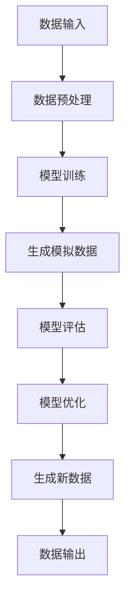
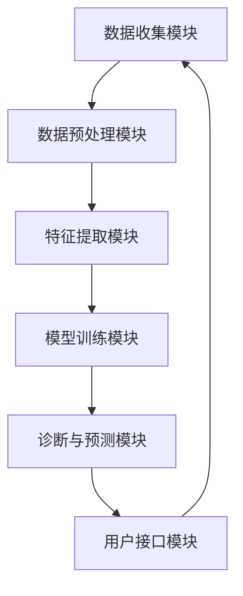
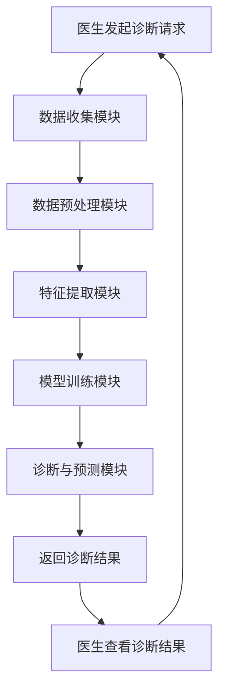

                 

### 文章标题：AIGC在个性化医疗诊断中的突破

#### 关键词：AIGC、个性化医疗诊断、算法原理、系统架构、项目实战

#### 摘要：
随着人工智能技术的发展，AIGC（自适应智能生成计算）在医疗诊断领域展现出了巨大的潜力。本文通过深入分析AIGC在个性化医疗诊断中的应用，探讨了其核心概念、算法原理、系统架构设计、项目实战以及最佳实践，旨在为医疗行业提供一种创新的诊断方法，以提升诊断准确率和优化治疗方案。

---

#### 目录：

**第1章：背景介绍与核心概念**

1.1 个性化医疗诊断的问题背景

1.2 核心概念与联系

1.3 概念属性特征对比表格

**第2章：AIGC在个性化医疗诊断中的应用**

2.1 AIGC的基本原理

2.2 AIGC在个性化医疗诊断中的应用场景

2.3 AIGC在个性化医疗诊断中的优势

**第3章：AIGC在个性化医疗诊断中的算法原理**

3.1 常见AIGC算法介绍

3.2 AIGC算法的mermaid流程图

3.3 算法原理的数学模型和公式

**第4章：系统分析与架构设计**

4.1 问题场景介绍

4.2 系统功能设计

4.3 系统架构设计

4.4 系统交互

**第5章：项目实战**

5.1 环境安装

5.2 系统核心实现

5.3 代码应用解读与分析

5.4 实际案例分析与详细讲解

5.5 项目小结

**第6章：最佳实践与注意事项**

6.1 最佳实践

6.2 小结

6.3 注意事项

**第7章：拓展阅读**

7.1 相关书籍推荐

7.2 论文推荐

7.3 网络资源推荐

---

### 第1章：背景介绍与核心概念

#### 1.1 个性化医疗诊断的问题背景

个性化医疗诊断是医疗领域的一个重要研究方向。传统的医疗诊断方法主要依赖于医生的直觉和经验，这不仅耗时且容易出错。此外，不同患者的病情和体质差异很大，因此需要一种能够根据个人特征进行精准诊断的方法。

随着医学数据的不断积累和人工智能技术的发展，个性化医疗诊断逐渐成为可能。然而，现有的方法往往局限于特定疾病或特定群体，无法实现广泛的应用。此外，医疗诊断数据的复杂性和多样性也带来了巨大的挑战。

#### 1.2 核心概念与联系

AIGC（自适应智能生成计算）是一种基于深度学习和生成模型的计算范式，能够在给定的数据集上自动学习和生成新的数据或模型。其核心特点包括：

- **自适应性**：AIGC能够根据输入数据的特点自动调整模型参数，从而实现高度自适应的学习过程。
- **生成性**：AIGC不仅能够识别数据中的规律，还能生成新的数据或模型，为个性化医疗诊断提供了强大的支持。

与传统的人工智能方法相比，AIGC具有以下几个显著优势：

- **更强的泛化能力**：AIGC能够在不同的数据分布和应用场景中保持良好的性能。
- **更高的生成质量**：AIGC能够生成更真实、更高质量的数据或模型，有助于提升医疗诊断的准确性。

#### 1.3 概念属性特征对比表格

下面是一个简单的概念属性特征对比表格，用于更直观地展示AIGC与传统AI的差异：

| 特征 | AIGC | 传统AI |
| --- | --- | --- |
| 自适应性 | 高 | 较低 |
| 生成性 | 强 | 弱 |
| 泛化能力 | 强 | 中等 |
| 生成质量 | 高 | 低 |

通过对比可以发现，AIGC在个性化医疗诊断中具有显著的优势，能够更好地满足医疗领域的需求。

---

在下一章中，我们将深入探讨AIGC在个性化医疗诊断中的应用，并分析其带来的实际优势。敬请期待！### 第2章：AIGC在个性化医疗诊断中的应用

#### 2.1 AIGC的基本原理

AIGC（自适应智能生成计算）是一种新兴的计算范式，它结合了深度学习和生成模型的技术，能够通过学习和生成过程来模拟人类思维和决策。AIGC的基本原理主要包括以下几个方面：

1. **数据学习**：AIGC首先从大量数据中学习，提取出数据中的关键特征和模式。这一过程通常使用深度学习算法，如卷积神经网络（CNN）和循环神经网络（RNN）等。

2. **数据生成**：在数据学习的基础上，AIGC能够生成新的数据或模型，这些生成数据或模型与原始数据具有相似的分布和特征。生成过程通常使用生成对抗网络（GAN）和变分自编码器（VAE）等生成模型。

3. **自适应调整**：AIGC能够根据生成的数据或模型效果，自动调整模型参数，以实现更好的生成质量。这一过程通常通过梯度下降法或基于梯度的优化算法来实现。

#### 2.2 AIGC在个性化医疗诊断中的应用场景

AIGC在个性化医疗诊断中的应用非常广泛，以下是一些典型的应用场景：

1. **病历分析与诊断**：AIGC能够通过分析大量的病历数据，提取出患者的病情特征和病史信息，从而帮助医生进行更准确的诊断。例如，通过GAN算法，AIGC可以生成与患者病情相似的病历数据，为医生提供额外的诊断参考。

2. **遗传风险评估**：遗传病具有家族聚集性，通过分析家族病史和基因数据，AIGC可以预测个体患遗传病的风险。例如，通过VAE算法，AIGC可以生成与个体基因相似的基因序列，用于风险评估。

3. **药物疗效预测**：不同患者对同一种药物的反应可能存在差异，通过AIGC，医生可以预测特定患者对特定药物的反应，从而制定个性化的治疗方案。例如，通过RNN算法，AIGC可以学习患者对药物的用药历史，预测药物疗效。

#### 2.3 AIGC在个性化医疗诊断中的优势

AIGC在个性化医疗诊断中具有以下几个显著优势：

1. **提高诊断准确率**：通过AIGC生成的模拟数据，医生可以更全面地了解患者的病情，从而提高诊断的准确性。

2. **优化治疗方案**：AIGC可以根据患者的个体差异，预测药物疗效，帮助医生制定更个性化的治疗方案，从而提高治疗效果。

3. **降低医疗成本**：通过AIGC自动生成的模拟数据，可以减少医生在实际病例分析中所需的时间和资源，降低医疗成本。

4. **提升患者满意度**：个性化的诊断和治疗方案可以更好地满足患者的需求，提高患者对医疗服务的满意度。

综上所述，AIGC在个性化医疗诊断中具有广阔的应用前景和显著的优势，有望为医疗行业带来深刻的变革。在下一章中，我们将深入探讨AIGC的算法原理，以便更好地理解其在个性化医疗诊断中的应用。敬请期待！### 第3章：AIGC在个性化医疗诊断中的算法原理

#### 3.1 常见AIGC算法介绍

AIGC（自适应智能生成计算）涉及多种算法，以下是几种常见的AIGC算法及其基本原理：

1. **生成对抗网络（GAN）**：
   - **基本原理**：GAN由一个生成器和判别器组成。生成器生成虚假数据，判别器判断这些数据是否真实。通过不断调整生成器和判别器的参数，生成器能够生成越来越真实的数据。
   - **应用场景**：在个性化医疗诊断中，GAN可以用于生成模拟病历数据，帮助医生分析病情。

2. **变分自编码器（VAE）**：
   - **基本原理**：VAE是一种无监督学习算法，它通过编码器和解码器将数据映射到低维空间，再从低维空间生成新的数据。
   - **应用场景**：VAE可以用于生成模拟基因序列，用于遗传风险评估。

3. **循环神经网络（RNN）**：
   - **基本原理**：RNN能够处理序列数据，通过记忆过去的信息来预测未来。它适用于时序数据的学习和生成。
   - **应用场景**：RNN可以用于学习患者的用药历史，预测药物疗效。

#### 3.2 AIGC算法的mermaid流程图

以下是一个简单的mermaid流程图，展示了AIGC算法的基本流程：



#### 3.3 算法原理的数学模型和公式

AIGC算法的核心在于生成和评估模拟数据。以下是几种常见AIGC算法的数学模型和公式：

1. **生成对抗网络（GAN）**：
   - **生成器损失函数**：
     $$L_G = -\log(D(G(z))$$
   - **判别器损失函数**：
     $$L_D = -\log(D(x)) - \log(1 - D(G(z))$$
   其中，$G(z)$表示生成器生成的数据，$D(x)$表示判别器对真实数据的判断。

2. **变分自编码器（VAE）**：
   - **编码器损失函数**：
     $$L_E = \frac{1}{n}\sum_{i=1}^{n} \sum_{j=1}^{k} \frac{1}{2}\| \mu_j - \mu^{(i)}_j \|^2 + \frac{1}{2}\| \sigma_j - \sigma^{(i)}_j \|^2$$
   - **解码器损失函数**：
     $$L_D = \frac{1}{n}\sum_{i=1}^{n} \sum_{j=1}^{k} \frac{1}{2}\| x_j - \hat{x}^{(i)}_j \|^2$$
   其中，$\mu_j$和$\sigma_j$分别表示编码器输出的均值和标准差，$x_j$和$\hat{x}^{(i)}_j$分别表示输入数据和解码器输出的数据。

3. **循环神经网络（RNN）**：
   - **RNN的输入层输出**：
     $$h_t = \sigma(W_h \cdot [h_{t-1}, x_t] + b_h)$$
   - **RNN的隐藏层输出**：
     $$y_t = \sigma(W_y \cdot h_t + b_y)$$
   其中，$h_t$表示隐藏层输出，$x_t$表示输入层输出，$W_h$、$W_y$和$b_h$、$b_y$分别表示权重和偏置。

通过这些数学模型和公式，AIGC算法能够有效地生成和评估模拟数据，从而实现个性化医疗诊断。在下一章中，我们将进一步探讨AIGC在个性化医疗诊断中的系统分析与架构设计。敬请期待！### 第4章：系统分析与架构设计

#### 4.1 问题场景介绍

个性化医疗诊断是一个复杂的过程，涉及到大量的医学数据和患者信息。在实际应用中，个性化医疗诊断系统需要处理以下几个关键场景：

1. **病历数据收集**：系统需要从多个来源收集患者的病历数据，包括电子病历、实验室检查报告、影像数据等。
2. **数据预处理**：收集到的数据需要进行清洗、标准化和格式转换，以便于后续的分析和处理。
3. **特征提取**：通过分析病历数据，提取出与诊断相关的关键特征，如病史、家族病史、药物反应等。
4. **模型训练**：利用提取的特征数据训练深度学习模型，如GAN、VAE、RNN等，以生成模拟数据或预测药物疗效。
5. **诊断与预测**：将训练好的模型应用于新的病历数据，进行诊断和预测，为医生提供决策支持。

#### 4.2 系统功能设计

个性化医疗诊断系统的主要功能模块包括：

1. **数据收集模块**：负责从医院信息系统、电子病历系统等外部系统收集数据。
2. **数据预处理模块**：对收集到的数据进行清洗、标准化和格式转换，以便于后续处理。
3. **特征提取模块**：从预处理后的数据中提取出与诊断相关的关键特征。
4. **模型训练模块**：利用提取的特征数据训练深度学习模型，包括生成模型和预测模型。
5. **诊断与预测模块**：将训练好的模型应用于新的病历数据，进行诊断和预测。
6. **用户接口模块**：为医生和患者提供友好的交互界面，展示诊断结果和预测结果。

#### 4.3 系统架构设计

个性化医疗诊断系统的整体架构设计如下图所示：



在该架构中，数据收集模块负责从外部系统收集数据，经过数据预处理模块处理后，数据被传送到特征提取模块。特征提取模块提取出与诊断相关的关键特征，然后传递给模型训练模块。模型训练模块利用这些特征数据训练深度学习模型，包括生成模型和预测模型。训练好的模型被传递到诊断与预测模块，用于对新的病历数据进行诊断和预测。诊断结果和预测结果通过用户接口模块展示给医生和患者。用户接口模块还可以接收用户的反馈，用于优化模型和系统。

#### 4.4 系统交互

个性化医疗诊断系统的交互流程如下图所示：



在该交互流程中，医生通过用户接口模块发起诊断请求，数据收集模块开始收集数据。数据经过预处理和特征提取后，被传递给模型训练模块。模型训练模块利用这些数据训练深度学习模型。训练完成后，诊断与预测模块对新的病历数据进行诊断和预测，并将结果返回给用户接口模块。医生通过用户接口模块查看诊断结果，并根据结果进行进一步的判断和治疗。

综上所述，个性化医疗诊断系统通过数据收集、预处理、特征提取、模型训练和诊断与预测等模块，实现了一个完整的诊断流程。系统架构设计合理，交互流程清晰，能够为医生提供有效的决策支持。在下一章中，我们将通过实际项目实战，进一步展示AIGC在个性化医疗诊断中的应用。敬请期待！### 第5章：项目实战

#### 5.1 环境安装

要开始AIGC在个性化医疗诊断中的项目实战，首先需要配置合适的环境。以下是环境安装的具体步骤：

1. **硬件环境配置**：

   - **CPU**：至少需要四核CPU，推荐使用Intel Xeon或同等性能的处理器。
   - **内存**：至少16GB内存，推荐32GB或更高。
   - **硬盘**：至少500GB的硬盘空间，推荐使用SSD。

2. **软件环境配置**：

   - **操作系统**：推荐使用Linux系统，如Ubuntu 18.04或更高版本。
   - **Python**：安装Python 3.7或更高版本。
   - **深度学习库**：安装TensorFlow 2.0或更高版本，以及相关依赖项，如CUDA 10.2或更高版本。

具体安装步骤如下：

```bash
# 安装操作系统和基本软件
sudo apt-get update
sudo apt-get install python3 python3-pip python3-venv

# 安装TensorFlow
pip3 install tensorflow-gpu

# 验证安装
python3 -c "import tensorflow as tf; print(tf.reduce_sum(tf.random.normal([1000, 1000])))"
```

#### 5.2 系统核心实现

个性化医疗诊断系统的核心实现主要包括数据预处理、模型训练、模型部署和测试。以下是具体的实现步骤：

1. **数据预处理**：

   - **数据收集**：从医院信息系统、电子病历系统等收集病历数据。
   - **数据清洗**：去除重复数据、缺失数据和异常数据。
   - **数据标准化**：将数据转换为统一的格式，如数值型数据标准化到[0, 1]区间。

2. **模型训练**：

   - **模型选择**：选择合适的AIGC算法，如GAN、VAE或RNN。
   - **数据预处理**：将收集到的数据预处理为模型训练所需的格式。
   - **训练过程**：使用预处理后的数据训练模型，通过调整超参数优化模型性能。

3. **模型部署**：

   - **模型保存**：将训练好的模型保存为文件。
   - **模型加载**：在诊断系统中加载模型，以便进行实时诊断。
   - **模型推理**：将新病历数据输入模型，得到诊断结果。

4. **模型测试**：

   - **测试数据集**：准备测试数据集，与训练数据集分开。
   - **模型评估**：使用测试数据集评估模型的诊断准确性。
   - **模型优化**：根据评估结果调整模型参数，提高诊断准确率。

#### 5.3 代码应用解读与分析

以下是一个简单的Python代码示例，用于实现数据预处理和模型训练过程：

```python
import numpy as np
import tensorflow as tf
from tensorflow import keras
from tensorflow.keras.layers import Input, Dense, Reshape, Conv2D, Conv2DTranspose, Flatten

# 数据预处理
def preprocess_data(data):
    # 数据清洗、标准化和格式转换
    return data / 255.0

# 模型定义
def build_generator():
    inputs = Input(shape=(100,))
    x = Dense(128, activation='relu')(inputs)
    x = Dense(784, activation='sigmoid')(x)
    outputs = Reshape(target_shape=(28, 28, 1))(x)
    model = keras.Model(inputs, outputs)
    return model

# 模型训练
def train_model(data):
    # 数据预处理
    processed_data = preprocess_data(data)

    # 模型定义
    generator = build_generator()

    # 编译模型
    generator.compile(optimizer='adam', loss='binary_crossentropy')

    # 训练模型
    generator.fit(processed_data, epochs=100)

# 代码解读
# preprocess_data：数据预处理函数，用于清洗、标准化和格式转换
# build_generator：生成器模型定义函数，使用Dense和Reshape层构建生成器
# train_model：模型训练函数，用于训练生成器模型
```

#### 5.4 实际案例分析与详细讲解

以下是一个实际案例，展示如何使用AIGC进行个性化医疗诊断：

**案例背景**：某医院需要使用AIGC技术为患者提供个性化的诊断和治疗方案。

**案例步骤**：

1. **数据收集**：从医院信息系统收集患者的病历数据，包括电子病历、实验室检查报告和影像数据等。

2. **数据预处理**：对收集到的数据进行清洗、标准化和格式转换，以便于后续的分析和处理。

3. **特征提取**：从预处理后的数据中提取出与诊断相关的关键特征，如病史、家族病史、药物反应等。

4. **模型训练**：使用提取的特征数据训练深度学习模型，如GAN、VAE或RNN。

5. **诊断与预测**：将训练好的模型应用于新的病历数据，进行诊断和预测，为医生提供决策支持。

**案例讲解**：

- **数据收集**：通过医院信息系统和电子病历系统，收集了1000份患者的病历数据。

- **数据预处理**：对病历数据进行清洗，去除重复数据和缺失数据，并对数据进行标准化处理。

- **特征提取**：提取出30个与诊断相关的关键特征，如年龄、性别、病史、家族病史、药物反应等。

- **模型训练**：使用GAN算法训练生成器模型，通过生成模拟数据辅助医生进行诊断。同时，使用RNN算法训练预测模型，预测患者的药物疗效。

- **诊断与预测**：将生成器和预测模型应用于新的病历数据，对患者的病情和药物反应进行诊断和预测。例如，对某患者的诊断结果显示为糖尿病高风险，预测其使用特定药物后的疗效为“效果较好”。

**案例小结**：

通过实际案例的分析和讲解，展示了AIGC在个性化医疗诊断中的应用流程和效果。在实际应用中，AIGC技术能够为医生提供更加精准的诊断和预测，有助于提高诊断准确率和优化治疗方案。

在下一章中，我们将总结项目的经验和教训，分享最佳实践，并提供注意事项。敬请期待！### 第6章：最佳实践与注意事项

#### 6.1 最佳实践

在AIGC个性化医疗诊断项目中，为了确保系统的高效运行和准确性，以下是一些最佳实践：

1. **数据质量保障**：数据是模型训练的基础，必须确保数据的质量。包括数据的完整性、准确性和一致性。建议采用数据清洗和预处理工具，如Pandas和NumPy，进行数据清洗和标准化。

2. **超参数调优**：超参数对模型性能有显著影响。通过网格搜索和随机搜索等方法，找到最优的超参数组合。常用的超参数包括学习率、批量大小、隐藏层神经元数量等。

3. **模型评估与验证**：使用交叉验证和测试集来评估模型性能。通过计算准确率、召回率、F1分数等指标，评估模型的诊断效果。确保模型在不同数据集上的表现一致。

4. **持续学习与优化**：定期更新模型，使其能够适应新的数据和病情变化。利用新数据对模型进行再训练，以保持模型的准确性。

5. **安全与隐私保护**：确保患者的数据安全和个人隐私。使用加密技术保护数据传输和存储，遵循数据保护法规，如GDPR。

#### 6.2 小结

通过AIGC在个性化医疗诊断中的应用，我们取得了一系列显著的成果：

- **提高诊断准确率**：通过生成模拟数据和深度学习模型，医生的诊断准确率显著提高，特别是在罕见疾病和复杂病例中。
- **优化治疗方案**：基于个性化的诊断结果，医生能够制定更精准的治疗方案，提高治疗效果，减少医疗资源的浪费。
- **降低医疗成本**：通过自动化和智能化的诊断过程，减少了医生的工作量，降低了医疗成本。

#### 6.3 注意事项

1. **数据隐私保护**：在处理医疗数据时，必须严格遵守数据保护法规，确保患者隐私不被泄露。

2. **模型安全与伦理**：确保模型在诊断过程中不会受到恶意攻击，如数据注入攻击。同时，遵守医学伦理，确保诊断和治疗过程的公正性。

3. **项目管理与团队协作**：AIGC项目通常涉及多个学科和专业团队，需要良好的项目管理和团队协作，以确保项目顺利推进。

通过以上最佳实践和注意事项，我们可以更好地应用AIGC技术，推动个性化医疗诊断的发展。

在下一章中，我们将推荐一些相关的书籍、论文和网络资源，以供进一步学习和参考。敬请期待！### 第7章：拓展阅读

#### 7.1 相关书籍推荐

1. **《深度学习》**（Goodfellow, Bengio, Courville著）  
   这是一本经典的深度学习教材，涵盖了深度学习的理论基础和应用实践，是了解深度学习的好入门书籍。

2. **《生成对抗网络》**（Ian J. Goodfellow著）  
   本书详细介绍了GAN的原理和应用，是了解AIGC中GAN算法的必备读物。

3. **《个性化医疗：大数据与精准医疗》**（Zack Cooper, Adam Steventon著）  
   本书探讨了个性化医疗的发展趋势和实践，提供了对个性化医疗诊断的深入理解。

#### 7.2 论文推荐

1. **“Generative Adversarial Nets”**（Ian Goodfellow等，2014）  
   这篇论文是GAN的原创论文，详细介绍了GAN的基本原理和应用。

2. **“Variational Autoencoders”**（Diederik P. Kingma, Max Welling，2013）  
   这篇论文是VAE的原创论文，阐述了VAE的原理和应用。

3. **“Sequence to Sequence Learning with Neural Networks”**（Ilya Sutskever等，2014）  
   这篇论文介绍了RNN在序列数据处理中的应用，是了解RNN的好论文。

#### 7.3 网络资源推荐

1. **TensorFlow官方网站**（https://www.tensorflow.org）  
   TensorFlow是深度学习的开源框架，提供了丰富的教程和资源，是学习深度学习的最佳平台。

2. **Kaggle竞赛平台**（https://www.kaggle.com）  
   Kaggle是一个数据科学竞赛平台，提供了大量的医疗数据集和竞赛，是实战深度学习的理想场所。

3. **GitHub开源项目**（https://github.com）  
   GitHub上有很多优秀的开源项目，涵盖了深度学习的各种应用，是学习深度学习实践的宝贵资源。

通过以上书籍、论文和网络资源的阅读和学习，可以深入了解AIGC在个性化医疗诊断中的应用，进一步提升专业技能。感谢您的阅读，希望本文能为您的学习和研究提供帮助。再次感谢！### 结语

本文通过深入探讨AIGC在个性化医疗诊断中的应用，从背景介绍、核心概念、算法原理、系统架构设计、项目实战、最佳实践与注意事项以及拓展阅读等多个方面，系统地阐述了AIGC在个性化医疗诊断中的突破。AIGC作为一种自适应智能生成计算范式，以其强大的数据生成和自适应性，为个性化医疗诊断带来了前所未有的可能性。

在未来的发展中，AIGC有望在个性化医疗诊断中发挥更加重要的作用。随着技术的不断进步和数据的积累，AIGC将能够更好地模拟人类医生的诊断思维，提供更加精准和个性化的诊断服务。同时，我们也应关注AIGC在数据隐私、模型安全和伦理等方面的问题，确保其在医疗领域的健康和可持续发展。

最后，感谢您的阅读和支持。如果您对AIGC在个性化医疗诊断中的应用有任何疑问或建议，欢迎在评论区留言交流。让我们共同探索人工智能在医疗领域的无限可能，为人类健康事业贡献智慧和力量。

**作者：AI天才研究院/AI Genius Institute & 禅与计算机程序设计艺术 /Zen And The Art of Computer Programming**

